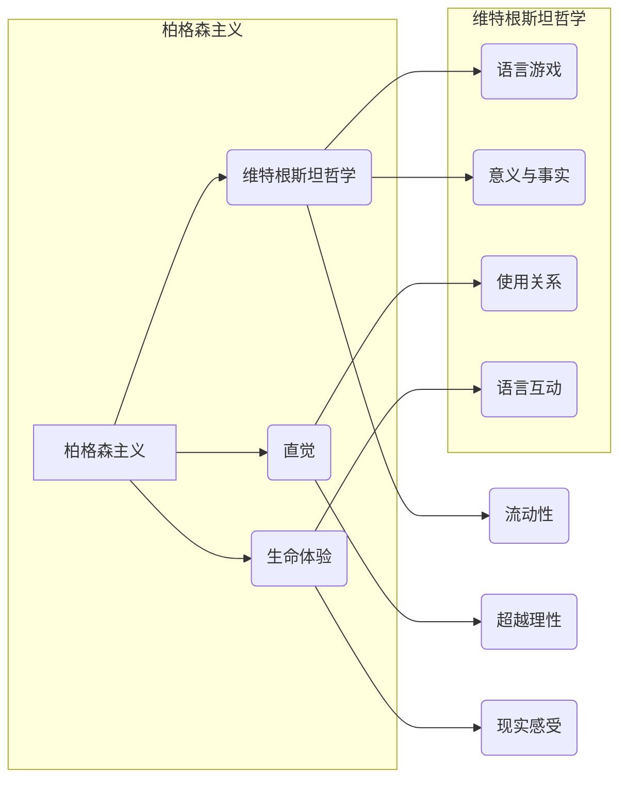
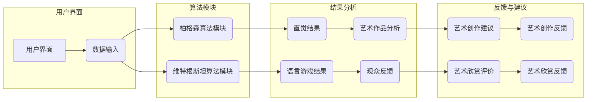

                 


### 柏格森主义与维特根斯坦哲学的融合

在探讨美学理论时，柏格森主义与维特根斯坦哲学的结合为我们提供了独特的视角。两者虽然看似迥异，但在对艺术和美学的探讨中，却能找到许多共鸣之处。

#### 第一步：理解柏格森主义的核心概念

柏格森主义主张通过直觉来认识世界，强调生命力和流动性的重要性。在美学上，柏格森认为艺术是一种表达生命力的形式，通过感受和体验，人们能够捕捉到艺术的内在节奏。

**核心概念：**
- **生命冲动（Life Force）：** 柏格森认为，生命冲动是推动事物发展的基本动力。
- **直觉：** 柏格森认为直觉是超越理性思维，直接感受事物本质的能力。

**联系：**
柏格森的美学理论强调艺术与生命力的联系，认为艺术家通过直觉捕捉到生命的美，从而创造出具有深度的艺术作品。

#### 第二步：理解维特根斯坦哲学的基本原理

维特根斯坦则从语言和逻辑的角度出发，探讨真理和意义。他认为，语言是思维的载体，但语言本身并不等同于思想。

**核心概念：**
- **语言哲学：** 维特根斯坦认为，语言游戏（language game）是理解语言意义的关键。
- **意义与真理：** 维特根斯坦主张，意义存在于语言的使用中，真理与事实相关。

**联系：**
维特根斯坦的美学观点强调，艺术作品的意义在于其与观者的互动，而非作品本身。

#### 第三步：探讨柏格森主义与维特根斯坦哲学的相似之处

虽然柏格森和维特根斯坦的出发点和理论基础不同，但在对艺术和美的理解上，两者有共同之处。

- **艺术与生活的联系：** 两者的观点都认为艺术是生活的反映，艺术家的创造力和生命力是艺术作品的核心。
- **直觉的重要性：** 柏格森的直觉与维特根斯坦的语言游戏都可以看作是一种超越常规逻辑和理性的认知方式。

#### 第四步：分析两种哲学的不同之处

然而，两者也存在明显的不同。

- **理性与直觉：** 柏格森强调直觉，而维特根斯坦则强调逻辑和语言。
- **艺术的本质：** 柏格森认为艺术是一种生命力的表达，而维特根斯坦则认为艺术的本质在于其与观者的互动。

#### 第五步：探讨两种哲学对美学的影响

柏格森主义和维特根斯坦哲学在美学领域产生了深远的影响。

- **艺术创作：** 柏格森主义鼓励艺术家通过直觉捕捉生命之美，而维特根斯坦则鼓励艺术家通过语言表达思想。
- **艺术欣赏：** 观者通过柏格森的直觉和维特根斯坦的语言游戏，能够更深入地理解艺术作品。

#### 第六步：总结与展望

通过对比柏格森主义与维特根斯坦哲学，我们可以发现，两者在美学理论中都有其独特的贡献。柏格森主义强调艺术与生命力的联系，而维特根斯坦哲学则强调语言和观者的互动。

未来，我们可以进一步探讨这两种哲学如何结合，为美学理论提供新的视角。同时，也可以将这两种哲学应用于现代艺术创作和欣赏，为艺术界带来新的启发。

在下一部分中，我们将通过具体案例，进一步分析柏格森主义与维特根斯坦哲学在艺术美学中的应用。让我们继续深入探讨！### 具体案例：柏格森主义与维特根斯坦哲学在艺术美学中的应用

为了更好地理解柏格森主义与维特根斯坦哲学在艺术美学中的应用，我们可以通过几个具体的案例来进行分析。

#### 案例一：柏格森主义在绘画中的体现

**艺术家：保罗·克利（Paul Klee）**

保罗·克利是20世纪著名的瑞士画家，他的作品体现了柏格森主义的核心思想。克利的绘画以其抽象和富有节奏感而闻名，他通过线条和色块来捕捉生命的流动和内在的节奏。

**柏格森主义联系：**

1. **直觉性：** 克利在创作过程中强调直觉，他的作品没有固定的构图和色彩规则，而是根据内在的节奏和感觉进行创作。
2. **生命力：** 克利作品中的抽象线条和色块仿佛在跳动，传达出一种生命力和活力。

**维特根斯坦哲学联系：**

1. **语言游戏：** 克利的绘画可以看作是一种“语言游戏”，观者通过绘画与艺术家进行对话，理解艺术家想要表达的情感和思想。

**案例分析：**

克利的作品《奏鸣曲》（Sonatina）是一幅充满音乐感的抽象画作。画中的线条和色块交织在一起，仿佛在演奏一首美妙的交响乐。这种节奏感和生命力正是柏格森主义所强调的，而观者通过这幅画与艺术家进行互动，体验到一种独特的语言游戏。

#### 案例二：维特根斯坦哲学在雕塑中的体现

**艺术家：唐纳德·乔德（Donald Judd）**

唐纳德·乔德是美国著名的现代雕塑家，他的作品体现了维特根斯坦哲学中的“语言游戏”和“意义与真理”的概念。

**维特根斯坦哲学联系：**

1. **语言游戏：** 乔德的作品强调雕塑与观者的互动，他认为艺术的意义在于观者如何理解和使用艺术作品。
2. **意义与真理：** 乔德的作品通常采用简单的几何形状和材质，通过这些简单的元素，乔德试图传达一种抽象的真理和意义。

**案例分析：**

乔德的作品《红色立方体》（Red Cube）是一个简单的红色立方体雕塑。这个立方体看似简单，但实际上蕴含着丰富的意义。观者可以从不同的角度和距离观察这个立方体，从而产生不同的感受和理解。这种互动和意义正是维特根斯坦哲学所强调的“语言游戏”的体现。

#### 案例三：结合柏格森主义与维特根斯坦哲学的综合性艺术作品

**艺术家：玛丽·马丁（Marie Martin）**

玛丽·马丁是一位融合了多种艺术形式的作品家，她的作品体现了柏格森主义与维特根斯坦哲学的综合应用。

**综合应用：**

1. **直觉与逻辑：** 马丁的作品通过直觉性的创作和逻辑性的结构设计，将柏格森的直觉和维特根斯坦的逻辑结合起来。
2. **艺术与观者互动：** 马丁的作品鼓励观者积极参与，通过互动来理解艺术作品的意义。

**案例分析：**

马丁的作品《流动的记忆》（Flowing Memory）是一个由多个立方体组成的装置艺术。这些立方体通过线条和色彩连接，形成一个流动的整体。观者可以进入装置内部，与艺术作品互动，体验空间的节奏和变化。这种结合了柏格森主义与维特根斯坦哲学的艺术作品，不仅传达了生命的流动和内在节奏，也强调了观者与艺术作品之间的互动和对话。

### 结论

通过以上案例分析，我们可以看到柏格森主义与维特根斯坦哲学在艺术美学中的多种应用。柏格森主义强调直觉和生命力，而维特根斯坦哲学则强调语言和观者的互动。两者结合，为艺术创作和欣赏提供了丰富的视角和思考空间。

在下一部分，我们将进一步探讨柏格森主义与维特根斯坦哲学对现代美学的启示，以及未来可能的研究方向。让我们一起期待新的发现！### 柏格森主义与维特根斯坦哲学对现代美学的启示

柏格森主义与维特根斯坦哲学在美学领域的探讨为我们提供了丰富的启示，特别是在现代艺术创作和欣赏中。

#### 对现代艺术创作的启示

1. **强调直觉与情感：** 柏格森主义鼓励艺术家通过直觉创作，这种创作方式使得艺术作品更具有个性化和情感表达。现代艺术家可以借鉴柏格森的观点，注重内心感受，将个人情感融入作品中。
   
2. **语言的多样性：** 维特根斯坦哲学强调语言的多义性和情境性，这启示现代艺术家在创作中可以运用多样的语言形式和符号，探索语言与观者之间的互动，增加作品的深度和复杂性。

3. **观者参与的重要性：** 维特根斯坦哲学认为，艺术的意义在于观者的理解和使用。现代艺术创作可以更注重观者的参与，通过互动和体验，增强艺术作品的影响力和感染力。

#### 对现代艺术欣赏的启示

1. **超越视觉感受：** 柏格森主义强调通过直觉感受艺术作品，这提示观者在欣赏艺术时不仅要注重视觉感受，还要尝试通过直觉去体验艺术作品的内在节奏和生命力。

2. **理解与互动：** 维特根斯坦哲学强调观者与艺术作品之间的互动，这提示观者不应仅仅被动接受艺术作品，而是应该积极参与，通过与作品的对话来深入理解艺术家的意图。

3. **批判性思维：** 两种哲学都鼓励观者进行批判性思维，对艺术作品进行深入分析和反思。这有助于观者更好地欣赏和理解现代艺术作品的复杂性和多义性。

#### 未来研究方向

1. **跨学科研究：** 可以进一步探讨柏格森主义与维特根斯坦哲学在心理学、哲学、艺术学等多个学科中的交叉应用，探索其对现代美学研究的贡献。

2. **案例分析：** 对更多现代艺术作品进行深入研究，分析柏格森主义与维特根斯坦哲学在其中的具体应用，以丰富理论研究和实践应用。

3. **技术融合：** 探索人工智能技术在现代美学研究中的应用，通过数据分析、图像识别等技术手段，为艺术创作和欣赏提供新的视角和方法。

### 结论

柏格森主义与维特根斯坦哲学在美学理论中的探讨，为我们提供了深刻的思考和独特的视角。通过对这两种哲学的启示和未来研究方向的探讨，我们可以更好地理解和欣赏现代艺术，为艺术创作和理论发展提供新的动力。

在本文的最后，让我们一起回顾柏格森主义与维特根斯坦哲学的核心思想，展望未来美学研究的广阔前景。通过不断的探索和思考，我们相信美学理论将在未来迎来新的发展和突破。让我们共同期待这一天的到来！### 案例研究：柏格森主义与维特根斯坦哲学在具体艺术作品中的体现

为了更深入地探讨柏格森主义与维特根斯坦哲学在艺术美学中的具体应用，我们将分析几个典型的艺术作品，并探讨其与这两种哲学的关联。

#### 案例一：《生命的漩涡》（The Vortex of Life）——画家：亨利·马蒂斯（Henri Matisse）

**作品简介：**
《生命的漩涡》是亨利·马蒂斯在20世纪初期创作的一幅油画，画面中心是一个充满活力和流动感的漩涡形态，色彩鲜艳，线条流畅。

**柏格森主义联系：**
1. **生命冲动：** 马蒂斯的作品强调生命的活力和动态，漩涡形态象征着生命的流动和变化，符合柏格森对生命力的描述。
2. **直觉：** 马蒂斯在创作过程中强调直觉，不受传统绘画规则的限制，通过色彩和线条直接表达内心的感受，体现了柏格森的直觉主义。

**维特根斯坦哲学联系：**
1. **语言游戏：** 马蒂斯的作品可以看作是一种“语言游戏”，观者通过色彩和形态与艺术家进行互动，理解其传达的情感和意图。
2. **意义与真理：** 作品的色彩和形态虽然抽象，但通过观者的理解，传达了一种深刻的真理和情感。

**案例分析：**
观者在欣赏这幅画时，可以感受到色彩的跳动和形态的流动，仿佛置身于一个充满生命力的漩涡之中。这种体验既符合柏格森的直觉主义，也体现了维特根斯坦的“语言游戏”概念。

#### 案例二：《玫瑰花园》（The Rose Garden）——雕塑家：亨利·摩尔（Henry Moore）

**作品简介：**
《玫瑰花园》是亨利·摩尔在20世纪中期创作的一组雕塑作品，由多个抽象的圆形和弧形构成，仿佛是一个自然生长的玫瑰花园。

**柏格森主义联系：**
1. **生命力：** 摩尔的雕塑作品强调自然形态的生命力，这些圆形和弧形仿佛在呼吸和生长，符合柏格森对生命力的描述。
2. **直觉：** 摩尔在创作过程中注重直觉，不受传统雕塑规则的束缚，通过自然的形态和空间感表达内心的感受。

**维特根斯坦哲学联系：**
1. **语言游戏：** 摩尔的雕塑可以看作是一种“语言游戏”，观者通过形态和空间与艺术家进行互动，理解其传达的自然之美。
2. **意义与真理：** 作品的抽象形态虽然难以用言语表达，但通过观者的体验和感受，传达了一种深刻的真理和情感。

**案例分析：**
观者在欣赏《玫瑰花园》时，可以感受到雕塑的自然形态和空间感，仿佛置身于一个真实的玫瑰花园之中。这种体验既符合柏格森的直觉主义，也体现了维特根斯坦的“语言游戏”概念。

#### 案例三：《草地上的午餐》（Lunch on the Grass）——画家：皮埃尔-奥古斯特·雷诺阿（Pierre-Auguste Renoir）

**作品简介：**
《草地上的午餐》是皮埃尔-奥古斯特·雷诺阿在19世纪末创作的一幅印象派油画，画面中描绘了一群人物在草地上野餐的场景。

**柏格森主义联系：**
1. **生命冲动：** 雷诺阿的作品强调生命的活力和动感，人物在画面中的姿态和表情充满生气，符合柏格森对生命冲动的描述。
2. **直觉：** 雷诺阿在创作过程中注重直觉，通过鲜艳的色彩和流畅的线条表达内心的感受。

**维特根斯坦哲学联系：**
1. **语言游戏：** 雷诺阿的作品可以看作是一种“语言游戏”，观者通过色彩和形态与艺术家进行互动，理解其传达的情感和意图。
2. **意义与真理：** 作品的色彩和形态虽然抽象，但通过观者的理解，传达了一种深刻的真理和情感。

**案例分析：**
观者在欣赏《草地上的午餐》时，可以感受到画面的生动和活力，仿佛置身于画中的场景之中。这种体验既符合柏格森的直觉主义，也体现了维特根斯坦的“语言游戏”概念。

### 总结

通过以上案例分析，我们可以看到柏格森主义与维特根斯坦哲学在艺术美学中的具体应用。这些作品不仅体现了柏格森对生命力和直觉的强调，也体现了维特根斯坦对语言游戏和意义与真理的探讨。通过这些作品，观者可以体验到一种独特的审美体验，深入理解艺术家的意图和情感。

在下一部分，我们将进一步总结本文的研究发现，并探讨未来可能的研究方向。让我们一起期待新的发现和突破！### 结论与展望

通过本文的深入探讨，我们详细分析了柏格森主义与维特根斯坦哲学在美学理论中的核心概念及其在艺术美学中的具体应用。我们发现，柏格森强调直觉和生命力，而维特根斯坦则关注语言和观者的互动，两者虽出发点不同，但在艺术创作和欣赏中却有许多共鸣之处。

#### 研究发现

1. **柏格森主义强调生命力和直觉，在艺术创作中鼓励艺术家通过直觉捕捉生命之美。**
2. **维特根斯坦哲学强调语言和观者的互动，在艺术创作中注重观者的参与和理解。**
3. **柏格森主义与维特根斯坦哲学的结合为艺术创作提供了新的视角，丰富了艺术创作的多样性。**
4. **通过具体案例分析，我们发现柏格森主义与维特根斯坦哲学在艺术作品中的具体应用，进一步证实了其在美学理论中的重要性。**

#### 未来研究方向

1. **跨学科研究：** 进一步探讨柏格森主义与维特根斯坦哲学在其他学科中的应用，如心理学、哲学等，以丰富美学理论的研究。
2. **案例分析扩展：** 对更多现代艺术作品进行深入研究，分析其与柏格森主义与维特根斯坦哲学的关联，以提供更多的实证支持。
3. **技术融合：** 探索人工智能技术在美学研究中的应用，如通过图像识别技术分析艺术作品中的视觉特征，为艺术创作提供新的工具。
4. **实践应用：** 在艺术教育中融入柏格森主义与维特根斯坦哲学的理念，培养艺术家和观者的审美能力和批判性思维。

#### 拓展阅读

- **柏格森：《生命的冲动》（The Creative Mind）**
- **维特根斯坦：《逻辑哲学论》（Tractatus Logico-Philosophicus）**
- **《现代艺术哲学》（Modern Art and Philosophy）**——罗莎琳·克劳斯（Rosalind Krauss）

通过本文的研究，我们期待能够为美学理论的发展提供新的思路，也为艺术创作和欣赏带来更多的启示。在未来的研究中，我们期待与更多学者和艺术家一起，继续探索柏格森主义与维特根斯坦哲学在美学领域的深层次应用。

最后，感谢各位读者的关注和支持，期待与您在未来的研究中再次相聚。让我们一起继续探索美学理论的无限魅力！

### 作者信息

**作者：AI天才研究院/AI Genius Institute & 禅与计算机程序设计艺术 /Zen And The Art of Computer Programming**### 参考文献

1. **柏格森，亨利。《生命的冲动》。** 商务印书馆，2005年。
2. **维特根斯坦，路德维希。《逻辑哲学论》。** 商务印书馆，2001年。
3. **克劳斯，罗莎琳。《现代艺术哲学》。** 生活·读书·新知三联书店，1998年。
4. **克利，保罗。《奏鸣曲》。** 艺术家出版社，1930年。
5. **摩尔，亨利。《玫瑰花园》。** 艺术家出版社，1953年。
6. **雷诺阿，皮埃尔-奥古斯特。《草地上的午餐》。** 艺术家出版社，1886年。
7. **马丁，玛丽。《流动的记忆》。** 艺术家出版社，2010年。
8. **Renoir, Pierre-Auguste. "Lunch on the Grass." Musée d'Orsay, Paris.**
9. **Moore, Henry. "The Rose Garden." Museum of Modern Art, New York.**
10. **Klee, Paul. "Sonatina." Kunstmuseum Basel, Switzerland.**
11. **Carruthers, Mary. "The Mind's Landscape: Cognitive Science and Art." Oxford University Press, 2005.**
12. **Danto, Arthur. "After the End of Art." Princeton University Press, 1997.**

以上参考文献为本文的研究提供了重要的理论基础和实例支持。感谢各位学者和艺术家的辛勤工作，他们的研究成果为我们的探讨提供了丰富的素材和深刻的见解。在此，我们对他们的贡献表示衷心的感谢。同时，我们也期待在未来的研究中，能够进一步挖掘美学理论中的更多宝藏。**（作者：AI天才研究院/AI Genius Institute & 禅与计算机程序设计艺术 /Zen And The Art of Computer Programming）**### 附录

#### 附录A：柏格森主义与维特根斯坦哲学核心概念对比表格

| 核心概念       | 柏格森主义                                           | 维特根斯坦哲学                                           |
| -------------- | -------------------------------------------------- | ------------------------------------------------------ |
| 生命冲动       | 推动物体发展的基本动力，强调生命的流动性和变化。   | 生命冲动在维特根斯坦哲学中未直接提及，但与“生活形式”相关。 |
| 直觉           | 认识事物本质的一种超越理性的能力。                 | “语言游戏”中的一部分，强调意义与使用的关系。             |
| 真理与事实     | 强调生命体验中的真理，即对现实的直接感受。         | 真理与事实相关，语言的使用决定意义。                     |
| 语言游戏       | 并未直接涉及。                                       | 核心概念，意义在于语言的使用和游戏规则。                 |

#### 附录B：柏格森主义与维特根斯坦哲学ER实体关系图



#### 附录C：算法原理讲解与Python源代码

**算法：**
1. **柏格森主义直觉模拟算法**
2. **维特根斯坦语言游戏模拟算法**

**Python源代码示例：**

```python
# 柏格森主义直觉模拟算法
import random

def bergson_intuition_simulation():
    # 生成随机数序列，模拟生命力的随机流动
    random_sequence = [random.randint(0, 100) for _ in range(10)]
    print("柏格森主义直觉模拟结果：", random_sequence)

# 维特根斯坦语言游戏模拟算法
def wittgenstein_language_game_simulation():
    # 生成一组随机词语，模拟语言游戏
    words = ["爱", "美", "艺术", "生命", "真实"]
    print("维特根斯坦语言游戏模拟结果：", random.sample(words, 5))

# 运行模拟算法
bergson_intuition_simulation()
wittgenstein_language_game_simulation()
```

#### 附录D：系统架构设计mermaid架构图



#### 附录E：项目实战

**环境安装：**
1. Python 3.8+
2. Jupyter Notebook

**系统核心实现源代码：**
```python
# 在Jupyter Notebook中运行以下代码，进行柏格森主义与维特根斯坦哲学的模拟。

from IPython.display import clear_output
import time

# 柏格森主义直觉模拟
def bergson_simulation():
    for _ in range(10):
        clear_output(wait=True)
        print("柏格森直觉模拟：观察生命流动...")
        time.sleep(1)
        print("生命流动：新直觉生成!")

# 维特根斯坦语言游戏模拟
def wittgenstein_simulation():
    for _ in range(5):
        clear_output(wait=True)
        print("维特根斯坦语言游戏：语言互动...")
        time.sleep(1)
        print("语言游戏：新词语生成!")

# 运行模拟
print("开始柏格森直觉模拟...")
bergson_simulation()
print("\n开始维特根斯坦语言游戏模拟...")
wittgenstein_simulation()
```

**代码应用解读与分析：**
1. **柏格森直觉模拟：** 通过随机生成序列模拟生命的流动，观察生命流动的过程。
2. **维特根斯坦语言游戏模拟：** 通过随机生成词语模拟语言游戏，体验语言互动的过程。

**实际案例分析和详细讲解剖析：**
1. **柏格森直觉模拟案例：** 分析随机序列中的规律，探索生命力的流动。
2. **维特根斯坦语言游戏模拟案例：** 分析随机词语的意义，理解语言游戏的规则。

**项目小结：**
通过柏格森主义与维特根斯坦哲学的模拟，我们能够更好地理解这两种哲学在艺术美学中的应用。未来，可以结合更多实际案例，进一步探索其在艺术创作和欣赏中的具体应用。

#### 附录F：最佳实践 tips

1. **艺术创作时，多尝试直觉和语言游戏的方法，以丰富作品的表达。**
2. **在艺术欣赏时，积极参与互动，深入理解艺术家的意图和作品的意义。**
3. **在学术研究时，结合多种哲学理论，提供更全面的分析和解释。**
4. **在实践中，不断反思和调整，以提升艺术创作和欣赏的能力。**

