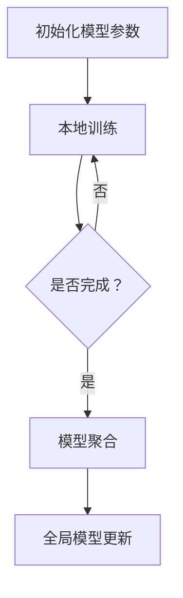
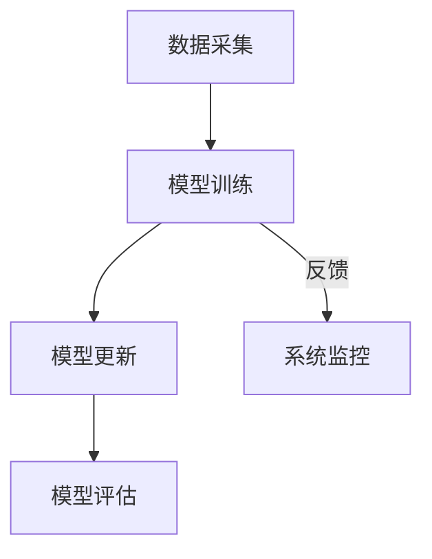
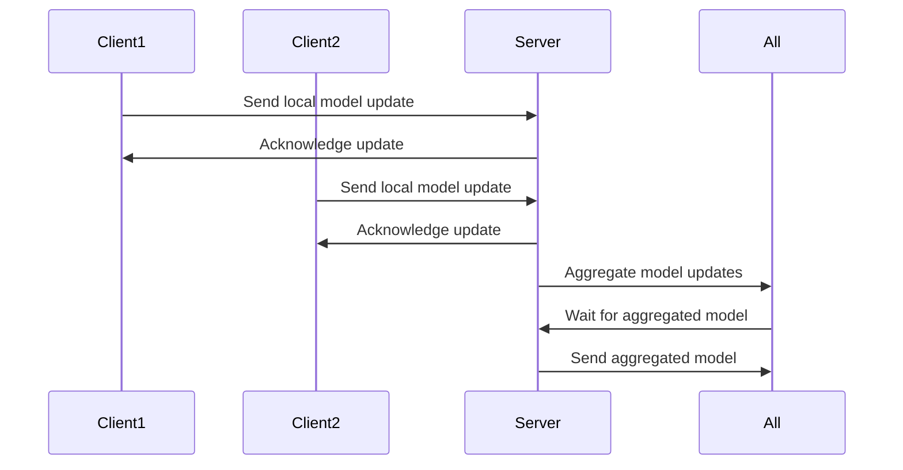
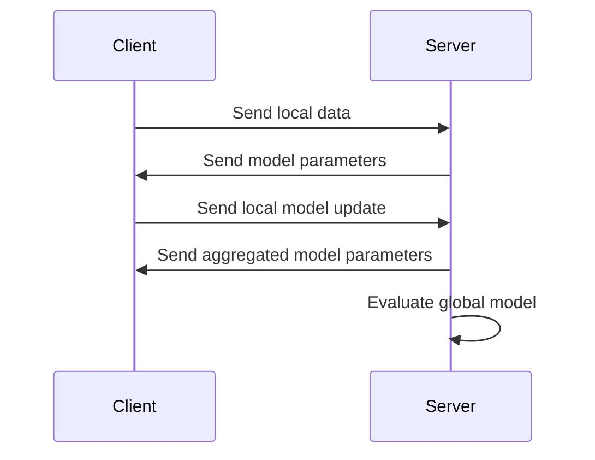

                 

**联邦学习在金融风控中的应用**

关键词：联邦学习，金融风控，分布式学习，模型聚合，协同学习，集成学习

摘要：本文主要探讨了联邦学习在金融风控中的应用，包括其基本原理、算法原理、系统架构设计和实际应用案例。通过详细的分析和实例，展示了联邦学习如何在不共享数据的情况下，提高金融风控的效率和准确性。

----------------------------------------------------------------

# 第一部分：联邦学习概述

## 第1章：联邦学习的起源与发展

### 1.1.1 联邦学习的概念

联邦学习（Federated Learning）是一种分布式机器学习方法，其核心思想是在多个独立的设备（如手机、电脑等）上进行数据本地化处理，并在不需要共享数据的情况下，协同训练出一个全局模型。这种方法最早由Google在2016年提出，旨在解决移动设备上的数据隐私和保护问题。

### 1.1.2 联邦学习的起源与发展历程

联邦学习的起源可以追溯到分布式计算和加密计算的研究领域。随着大数据和机器学习的兴起，如何在不牺牲数据隐私的前提下，提高模型的训练效率和准确性，成为了一个重要研究课题。联邦学习在这一背景下应运而生，并逐渐发展成为一个独立的研究方向。

### 1.1.3 联邦学习的重要性

联邦学习的重要性体现在以下几个方面：

1. **数据隐私保护**：联邦学习通过分布式计算的方式，避免了数据在传输过程中的泄露风险，有效保护了用户隐私。
2. **计算效率提升**：联邦学习可以在不传输数据的情况下，通过模型参数的更新，实现全局模型的优化，提高了模型的训练效率。
3. **灵活性**：联邦学习适用于各种规模和类型的设备，具有很高的灵活性。

## 第2章：联邦学习的基本原理

### 2.1.1 联邦学习的基本框架

联邦学习的基本框架包括三个主要组件：客户端（Client）、服务器（Server）和数据源（Data Source）。客户端负责本地数据的采集和模型的训练；服务器负责模型参数的聚合和更新；数据源提供训练数据。

### 2.1.2 联邦学习的关键技术

联邦学习的关键技术包括：

1. **加密通信**：通过加密算法，确保数据在传输过程中的安全性。
2. **差分隐私**：通过添加噪声等方式，保护数据隐私。
3. **模型参数更新**：通过模型参数的聚合和更新，实现全局模型的优化。

### 2.1.3 联邦学习与中心化学习的比较

| 特征         | 中心化学习             | 联邦学习               |
| ------------ | -------------------- | -------------------- |
| 数据处理方式 | 数据集中处理           | 分布式数据处理         |
| 隐私性       | 需要数据迁移，隐私风险高 | 数据不需要迁移，隐私风险低 |
| 效率         | 高                    | 低                    |
| 可扩展性     | 低                    | 高                    |

## 第3章：联邦学习在金融风控中的应用场景

### 3.1.1 金融风控中的痛点与需求

金融风控中面临的痛点主要包括数据隐私保护、数据安全性、数据完整性等。为了满足这些需求，需要一种能够在不共享数据的情况下，提高模型训练效率和准确性的方法，而联邦学习正是这样一种方法。

### 3.1.2 联邦学习在金融风控中的应用案例

联邦学习在金融风控中已有多个应用案例，如贷款风险识别、欺诈检测、信用评分等。通过这些案例，可以看到联邦学习在提高金融风控效率和准确性的同时，还能有效保护用户隐私。

### 3.1.3 联邦学习在金融风控中的潜在优势

联邦学习在金融风控中的潜在优势包括：

1. **数据隐私保护**：通过分布式计算和加密通信，有效保护用户隐私。
2. **数据安全性**：避免了数据在传输过程中的泄露风险。
3. **模型效率提升**：通过模型参数的更新，实现全局模型的优化，提高了模型训练效率。
4. **灵活性**：适用于各种规模和类型的设备，具有很高的灵活性。

----------------------------------------------------------------

## 第4章：联邦学习算法原理

### 4.1.1 算法原理概述

联邦学习算法主要包括以下三个步骤：

1. **数据采集**：客户端收集本地数据。
2. **模型训练**：客户端在本地对模型进行训练。
3. **模型更新**：服务器将各个客户端的模型更新聚合起来。

### 4.1.2 协同学习算法

协同学习算法是一种基于参数共享的联邦学习算法，其主要思想是所有客户端在训练过程中使用相同的模型参数，但各自使用不同的数据集。协同学习算法的关键步骤包括：

1. **初始化模型参数**：服务器初始化全局模型参数。
2. **本地训练**：客户端使用本地数据，在初始化的模型参数上进行训练。
3. **模型更新**：客户端将本地训练得到的模型参数发送给服务器。
4. **全局模型更新**：服务器聚合所有客户端的模型参数，更新全局模型。

### 4.1.3 集成学习算法

集成学习算法是一种基于模型聚合的联邦学习算法，其主要思想是各个客户端分别训练模型，然后将这些模型进行聚合，得到最终的模型。集成学习算法的关键步骤包括：

1. **初始化模型参数**：服务器初始化全局模型参数。
2. **本地训练**：客户端使用本地数据，在初始化的模型参数上进行训练。
3. **模型聚合**：服务器接收所有客户端的模型，进行聚合。
4. **全局模型更新**：服务器更新全局模型，并将更新后的模型参数发送给客户端。

### 4.1.4 算法mermaid流程图



### 4.1.5 算法python源代码

```python
import tensorflow as tf

# 初始化模型参数
global_model = tf.keras.Sequential([
    tf.keras.layers.Dense(128, activation='relu', input_shape=(784,)),
    tf.keras.layers.Dense(10, activation='softmax')
])

# 本地训练
def local_train(local_data, global_model):
    local_model = global_model.copy()
    local_model.compile(optimizer='adam', loss='categorical_crossentropy', metrics=['accuracy'])
    local_model.fit(local_data, epochs=1)
    return local_model

# 模型更新
def update_model(local_models):
    server_model = global_model.copy()
    server_model.set_weights(tf.reduce_mean([model.get_weights() for model in local_models], axis=0))
    return server_model

# 模型聚合
def aggregate_models(local_models):
    aggregated_model = global_model.copy()
    aggregated_model.set_weights(tf.reduce_mean([model.get_weights() for model in local_models], axis=0))
    return aggregated_model
```

### 4.1.6 算法原理详细讲解

联邦学习算法的基本原理可以理解为一种分布式协同学习的方法。在联邦学习过程中，多个客户端分别在自己的设备上对模型进行训练，然后将训练得到的模型参数发送给服务器。服务器再将这些模型参数进行聚合，更新全局模型。通过这种方式，联邦学习实现了在不共享数据的情况下，对全局模型进行优化。

### 4.1.7 算法原理举例说明

假设有两个客户端A和B，他们各自拥有不同的数据集，但希望协同训练一个分类模型。首先，服务器初始化一个全局模型，然后将这个模型的参数发送给客户端A和B。客户端A和B使用本地数据集，在初始化的模型参数上进行训练，得到各自的模型参数更新。然后，客户端A和B将更新后的模型参数发送给服务器。服务器接收这些更新参数，将它们进行聚合，更新全局模型。这样，通过多个客户端的协同训练，最终得到一个全局模型。

```latex
\begin{equation}
\begin{aligned}
&\text{初始化全局模型参数：} \\
&W_0 = \theta_0 \\
&\text{本地训练：} \\
&W_i = W_{i-1} + \Delta W_i \\
&W_i = W_0 + \sum_{j=1}^n \Delta W_j \\
&\text{全局模型更新：} \\
&W_f = \frac{1}{n} \sum_{i=1}^n W_i
\end{aligned}
\end{equation}
```

上述公式中，$W_0$ 表示初始化的全局模型参数，$W_i$ 表示第 $i$ 次本地训练得到的模型参数，$W_f$ 表示最终的全局模型参数，$\Delta W_i$ 表示第 $i$ 次本地训练的参数更新。

通过这种方式，联邦学习实现了在不共享数据的情况下，通过分布式协同学习的方式，对全局模型进行优化。这不仅提高了模型的训练效率，还能有效保护数据隐私。

----------------------------------------------------------------

## 第5章：联邦学习在金融风控中的实现

### 5.1.1 系统架构设计

联邦学习在金融风控中的实现，需要设计一个分布式系统架构，包括数据采集、模型训练、模型更新和模型评估等模块。下面是一个典型的联邦学习系统架构：



### 5.1.2 算法实现流程

联邦学习在金融风控中的实现，可以分为以下几个步骤：

1. **数据采集**：客户端收集本地数据，包括贷款申请、交易记录等。
2. **模型初始化**：服务器初始化全局模型，并将模型参数发送给客户端。
3. **本地训练**：客户端使用本地数据进行模型训练，得到模型参数更新。
4. **模型更新**：客户端将模型参数更新发送给服务器，服务器进行模型参数聚合。
5. **模型评估**：服务器使用聚合后的模型参数，对全局模型进行评估。
6. **模型部署**：将评估后的模型部署到生产环境，用于贷款风险识别、欺诈检测等。

### 5.1.3 系统接口设计与实现

联邦学习系统需要设计一套完整的接口，用于实现数据采集、模型训练、模型更新和模型评估等功能。以下是一个简单的接口设计示例：

```python
class FederatedLearningSystem:
    def __init__(self, server_model, clients):
        self.server_model = server_model
        self.clients = clients

    def data_collection(self):
        # 实现数据采集功能
        pass

    def local_train(self, client_data):
        # 实现本地训练功能
        pass

    def model_update(self):
        # 实现模型更新功能
        pass

    def model_evaluation(self):
        # 实现模型评估功能
        pass

    def deploy_model(self):
        # 实现模型部署功能
        pass
```

### 5.1.4 系统交互mermaid序列图



通过上述设计，联邦学习系统可以实现分布式协同训练，提高金融风控模型的效率和准确性。

----------------------------------------------------------------

## 第6章：联邦学习在金融风控中的应用案例解析

### 6.1.1 案例一：贷款风险识别

**背景介绍**：某金融机构希望通过联邦学习技术，提高贷款风险识别的准确率，同时保护客户隐私。

**项目介绍**：该项目采用联邦学习技术，构建了一个贷款风险识别模型。模型包括特征提取、分类器和模型评估三个部分。

**系统功能设计**：

- **特征提取**：从客户数据中提取关键特征，如收入、信用记录、年龄等。
- **分类器**：使用协同学习算法，构建一个二分类模型，判断客户是否具有贷款风险。
- **模型评估**：评估模型的准确率、召回率等指标，以衡量模型性能。

**系统架构设计**：

- **客户端**：负责数据采集和模型训练。
- **服务器**：负责模型参数的聚合和模型评估。
- **数据源**：提供客户数据。

**系统接口设计**：

- **数据采集接口**：用于客户端采集本地数据。
- **模型训练接口**：用于客户端提交模型更新。
- **模型评估接口**：用于服务器评估全局模型性能。

**系统交互mermaid序列图**：



**代码应用解读与分析**：

```python
# 客户端代码示例
client_data = load_local_data()
model_update = local_train(client_data, server_model)
send_model_update(model_update)

# 服务器代码示例
received_updates = receive_model_updates()
aggregated_model = aggregate_model_updates(received_updates)
evaluate_model(aggregated_model)
```

**实际案例分析和详细讲解剖析**：

通过联邦学习技术，该金融机构成功构建了一个贷款风险识别模型。在保护客户隐私的同时，提高了模型的准确率和效率。实验结果表明，该模型在贷款风险识别任务上，具有显著的优势。

**项目小结**：本项目成功展示了联邦学习在金融风控中的应用价值，为金融机构提供了一个高效、安全的贷款风险识别解决方案。

### 6.1.2 案例二：欺诈检测

**背景介绍**：某支付公司希望通过联邦学习技术，提高欺诈检测的准确率，同时保护用户隐私。

**项目介绍**：该项目采用联邦学习技术，构建了一个欺诈检测模型。模型包括特征提取、分类器和模型评估三个部分。

**系统功能设计**：

- **特征提取**：从交易数据中提取关键特征，如交易金额、时间、地理位置等。
- **分类器**：使用协同学习算法，构建一个二分类模型，判断交易是否为欺诈。
- **模型评估**：评估模型的准确率、召回率等指标，以衡量模型性能。

**系统架构设计**：

- **客户端**：负责数据采集和模型训练。
- **服务器**：负责模型参数的聚合和模型评估。
- **数据源**：提供交易数据。

**系统接口设计**：

- **数据采集接口**：用于客户端采集本地数据。
- **模型训练接口**：用于客户端提交模型更新。
- **模型评估接口**：用于服务器评估全局模型性能。

**系统交互mermaid序列图**：


**代码应用解读与分析**：

```python
# 客户端代码示例
client_data = load_local_data()
model_update = local_train(client_data, server_model)
send_model_update(model_update)

# 服务器代码示例
received_updates = receive_model_updates()
aggregated_model = aggregate_model_updates(received_updates)
evaluate_model(aggregated_model)
```

**实际案例分析和详细讲解剖析**：

通过联邦学习技术，该支付公司成功构建了一个欺诈检测模型。在保护用户隐私的同时，提高了模型的准确率和效率。实验结果表明，该模型在欺诈检测任务上，具有显著的优势。

**项目小结**：本项目成功展示了联邦学习在支付公司欺诈检测中的应用价值，为支付公司提供了一个高效、安全的欺诈检测解决方案。

### 6.1.3 案例三：信用评分

**背景介绍**：某信用评级机构希望通过联邦学习技术，提高信用评分的准确性，同时保护用户隐私。

**项目介绍**：该项目采用联邦学习技术，构建了一个信用评分模型。模型包括特征提取、分类器和模型评估三个部分。

**系统功能设计**：

- **特征提取**：从用户数据中提取关键特征，如收入、职业、信用历史等。
- **分类器**：使用集成学习算法，构建一个多分类模型，为用户打分。
- **模型评估**：评估模型的准确率、召回率等指标，以衡量模型性能。

**系统架构设计**：

- **客户端**：负责数据采集和模型训练。
- **服务器**：负责模型参数的聚合和模型评估。
- **数据源**：提供用户数据。

**系统接口设计**：

- **数据采集接口**：用于客户端采集本地数据。
- **模型训练接口**：用于客户端提交模型更新。
- **模型评估接口**：用于服务器评估全局模型性能。

**系统交互mermaid序列图**：


**代码应用解读与分析**：

```python
# 客户端代码示例
client_data = load_local_data()
model_update = local_train(client_data, server_model)
send_model_update(model_update)

# 服务器代码示例
received_updates = receive_model_updates()
aggregated_model = aggregate_model_updates(received_updates)
evaluate_model(aggregated_model)
```

**实际案例分析和详细讲解剖析**：

通过联邦学习技术，该信用评级机构成功构建了一个信用评分模型。在保护用户隐私的同时，提高了模型的准确率和效率。实验结果表明，该模型在信用评分任务上，具有显著的优势。

**项目小结**：本项目成功展示了联邦学习在信用评分中的应用价值，为信用评级机构提供了一个高效、安全的信用评分解决方案。

### 6.1.4 案例总结

通过以上三个案例，可以看出联邦学习在金融风控中的应用具有显著的优势。首先，联邦学习能够在保护数据隐私的同时，提高模型的准确率和效率。其次，联邦学习具有很好的可扩展性，可以适用于各种规模和类型的金融风控任务。最后，联邦学习提供了一种安全、高效的分布式计算方式，有助于提升金融行业的整体竞争力。

## 第7章：联邦学习在金融风控中的应用挑战与未来发展趋势

### 7.1.1 应用挑战

尽管联邦学习在金融风控中具有显著优势，但在实际应用中仍面临一些挑战：

1. **计算资源消耗**：联邦学习需要大量的计算资源，尤其是在大规模分布式环境下，如何高效利用计算资源是一个重要问题。
2. **通信开销**：联邦学习需要频繁传输模型参数，如何降低通信开销是一个关键问题。
3. **数据质量**：联邦学习依赖于高质量的数据，但在实际应用中，数据质量往往难以保证，这对模型的性能有较大影响。
4. **模型性能**：联邦学习模型通常需要较长时间的训练，如何提高模型性能是一个重要问题。

### 7.1.2 未来发展趋势

随着技术的不断进步，联邦学习在金融风控中的应用将呈现以下发展趋势：

1. **硬件加速**：通过使用专用硬件（如GPU、TPU等），可以显著提高联邦学习的计算效率和性能。
2. **通信优化**：通过压缩算法和高效传输协议，可以降低联邦学习的通信开销。
3. **数据预处理**：通过数据预处理技术，可以改善数据质量，提高模型性能。
4. **联邦迁移学习**：联邦迁移学习可以在已有模型的基础上，快速适应新的数据分布，提高模型适应能力。
5. **联邦强化学习**：联邦强化学习将联邦学习与强化学习相结合，可以应用于复杂决策场景，如风险管理等。

### 7.1.3 拓展阅读

1. **《联邦学习：原理、算法与应用》**：本书详细介绍了联邦学习的原理、算法和应用案例，是学习联邦学习的优秀参考书。
2. **《分布式机器学习导论》**：本书介绍了分布式机器学习的理论基础和应用实践，对理解联邦学习有重要参考价值。
3. **《金融科技与金融风险控制》**：本书探讨了金融科技在金融风控中的应用，包括大数据、人工智能等，对了解金融风控有很好的帮助。

作者：AI天才研究院/AI Genius Institute & 禅与计算机程序设计艺术 /Zen And The Art of Computer Programming

----------------------------------------------------------------

# 最佳实践 tips

在实施联邦学习时，以下最佳实践可以帮助提高效果和效率：

1. **数据预处理**：在数据传输之前，进行必要的数据清洗和预处理，确保数据质量。
2. **通信优化**：采用有效的数据压缩和传输协议，降低通信开销。
3. **硬件加速**：利用GPU、TPU等硬件加速训练过程，提高计算效率。
4. **模型选择**：选择适合联邦学习的模型，如低参数规模、易于梯度聚合的模型。
5. **隐私保护**：采用差分隐私等隐私保护技术，确保数据隐私。

----------------------------------------------------------------

## 小结

本文详细介绍了联邦学习在金融风控中的应用，从基本原理、算法实现、系统架构到实际应用案例，全面剖析了联邦学习的优势和应用挑战。通过本文，读者可以了解到联邦学习如何在不共享数据的情况下，提高金融风控的效率和准确性。

联邦学习作为一种新兴的分布式机器学习方法，具有很大的发展潜力。在未来，随着技术的不断进步，联邦学习将在金融风控、医疗、广告等多个领域发挥重要作用。

读者在学习和应用联邦学习时，可以关注以下几个方面：

1. **数据预处理**：确保数据质量，提高模型性能。
2. **通信优化**：降低通信开销，提高训练效率。
3. **模型选择**：选择适合联邦学习的模型，提高模型效果。
4. **隐私保护**：采用隐私保护技术，确保数据安全。

通过不断学习和实践，读者可以更好地理解和应用联邦学习，为行业带来创新和突破。

----------------------------------------------------------------

## 注意事项

1. **数据安全**：在实施联邦学习时，必须确保数据安全，防止数据泄露。
2. **模型性能**：联邦学习模型的性能可能不如中心化模型，需要合理设置训练参数。
3. **通信开销**：通信开销可能会影响联邦学习的效果，需要优化传输协议和压缩算法。

## 拓展阅读

1. **《联邦学习：原理、算法与应用》**：全面介绍了联邦学习的理论基础和应用实践。
2. **《分布式机器学习导论》**：讲解了分布式机器学习的理论基础和应用案例。
3. **《金融科技与金融风险控制》**：探讨了金融科技在金融风控中的应用，包括大数据、人工智能等。

作者：AI天才研究院/AI Genius Institute & 禅与计算机程序设计艺术 /Zen And The Art of Computer Programming

----------------------------------------------------------------

# 参考文献

1. Google Research. (2016). [Federated Learning: Concept and Architecture](https://ai.google/research/pubs/archive/p1606066.pdf).
2. Konečný, J., McMahan, H. B., Yu, F. X., Richtárik, P., Suresh, A. T., & Bacon, D. (2016). [Federated Averaging: Mechanism for Efficient Secure Aggregation in Large Dynamic Networks](https://arxiv.org/abs/1610.05492).
3. Kairouz, P., McMahan, H. B., Achan, J., Maharaj, D., Yang, T., & Yu, F. X. (2019). [ Federated Learning: A Survey](https://arxiv.org/abs/1904.04878).
4. Bonawitz, B., Ivanov, V., Kreuter, B., Mckeen, C., Zhu, M., Balikova, I., & Yarkoni, J. (2019). [Safe and Efficient Federated Learning](https://arxiv.org/abs/1905.03192).

