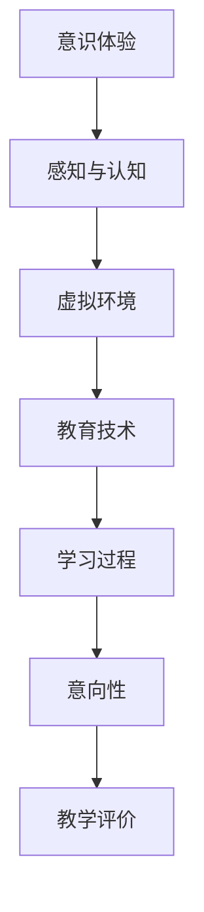
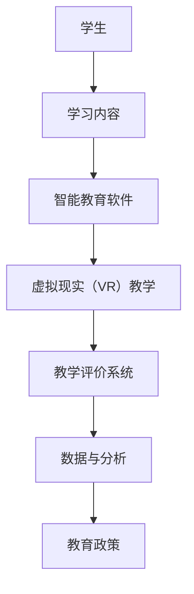

                 

### 胡塞尔的现象学概述

#### 第1章：胡塞尔的现象学概述

### 1.1 胡塞尔的生平与哲学背景

爱德蒙·胡塞尔（Edmund Husserl，1859-1938）是20世纪初最重要的哲学家之一，他被誉为现象学的奠基人。胡塞尔出生于奥匈帝国的摩拉维亚（今天的捷克共和国），他在布拉格大学接受了早期的教育，随后在维也纳大学和柏林大学深造，在这期间，他接触到了当时的哲学主流思想，如康德、黑格尔和布伦塔诺等人的学说。

**1.1.1 胡塞尔的生平简介**

- **出生与教育背景**：胡塞尔1859年出生于一个中产阶级家庭，早年接受了良好的教育。他的父亲是一位律师，母亲则是一位家庭主妇。胡塞尔在布拉格大学学习期间，对哲学产生了浓厚的兴趣，并决定将其作为自己的职业。
- **哲学观的初步形成**：在大学期间，胡塞尔阅读了大量的哲学著作，特别是受到了布伦塔诺的影响。布伦塔诺是现象学的先驱之一，他的著作《心理现象学》对胡塞尔的现象学理论产生了深远的影响。

**1.1.2 胡塞尔现象学的背景**

- **当代哲学思潮**：在胡塞尔所处的时代，西方哲学经历了重大的变革。康德、黑格尔和尼采等哲学家的思想构成了当时的哲学主流。这些哲学家的思想对胡塞尔产生了深刻的影响，但他同时也对他们的某些观点持批判态度。
- **现象学的兴起**：现象学的兴起是哲学史上的一次重要转折。它强调直接经验的重要性，试图将哲学从传统的形而上学束缚中解放出来。胡塞尔的现象学正是在这一背景下产生的。

### 1.2 现象学的基本概念与方法

**1.2.1 现象学的定义**

现象学（Phenomenology）一词来源于希腊语“phainomenon”（现象）和“logos”（学说）。现象学试图探讨的是现象本身，即意识经验中的事物是如何呈现给我们的。现象学的基本原理可以概括为以下几点：

- **直接性**：现象学强调直接经验的重要性，认为我们的知识来源于直接的经验感受，而不是间接的推论。
- **意向性**：现象学认为，我们的意识总是指向某个对象，这种指向性被称为意向性。意向性是意识经验的核心特征。
- **本质还原**：现象学主张通过本质还原，将事物还原到其最纯粹的状态，以便揭示其本质特征。

**1.2.2 现象学的方法**

现象学的方法主要包括以下几个方面：

- **直观**：现象学强调直观的重要性，认为直观是认识事物的根本途径。直观不同于科学的实验观察，它是一种纯粹的心理体验。
- **反思**：反思是现象学研究的另一个重要方法。通过反思，研究者可以深入思考意识经验的结构和内容。
- **本质还原**：本质还原是现象学方法的核心理念。通过去除事物的外在特征和表面现象，现象学家试图揭示事物的本质特征。

### 1.3 胡塞尔现象学的主要特征

**1.3.1 直接性**

直接性是胡塞尔现象学的一个重要特征。它强调我们的认识来源于直接的体验，而不是间接的推论。在胡塞尔看来，我们的意识总是直接地指向事物，这种直接性是我们认识事物的基础。

**1.3.2 意向性**

意向性是胡塞尔现象学的另一个核心概念。它指的是我们的意识总是指向某个对象，这种指向性是意识经验的核心特征。意向性不仅涉及我们的认识过程，还涉及我们的情感、意愿等心理活动。

**1.3.3 对主观性的重视**

胡塞尔现象学重视主观性，认为主观性是意识经验的核心。在胡塞尔看来，主观性不仅仅是认识的障碍，更是认识的基础。主观性使得我们的意识能够指向事物，从而形成我们的知识。

### 1.4 胡塞尔现象学的影响与评价

**1.4.1 胡塞尔现象学的影响**

胡塞尔的现象学对当代哲学产生了深远的影响。它不仅改变了哲学的研究方向，还影响了心理学、社会学、文化研究等多个学科。胡塞尔的现象学为后来的哲学家提供了丰富的理论资源，如海德格尔、萨特等人。

**1.4.2 胡塞尔现象学的评价**

胡塞尔的现象学受到了广泛的赞誉，同时也存在一些争议。支持者认为，胡塞尔的现象学为哲学提供了一种新的研究方法，强调了意识经验的重要性，从而推动了哲学的发展。批评者则认为，胡塞尔的现象学过于抽象，缺乏实证基础，难以应用于实际问题。

通过上述内容，我们初步了解了胡塞尔的现象学理论的基本概念、方法和特征。在接下来的章节中，我们将进一步深入探讨胡塞尔的意向性理论，以及他如何通过现象学的方法来揭示意识经验的本质。让我们继续前进，逐步深入了解胡塞尔现象学的深刻内涵。## 第2章：胡塞尔的意向性理论

### 2.1 意向性的定义与意义

意向性（Intentionality）是胡塞尔现象学中的一个核心概念，它指的是意识总是指向某个对象，这种指向性使得我们的意识经验具有了特定的内容和意义。意向性不仅涉及我们的认识过程，还包括我们的情感、意愿等心理活动。

**2.1.1 意向性的基本概念**

意向性的基本概念可以分为两个方面：

- **对象指向性**：我们的意识总是指向某个对象，这种指向性是意向性的核心。例如，当我们看一个红色的苹果时，我们的意识指向了苹果，这个苹果就是我们的意识的对象。
- **内容性**：我们的意识经验不仅仅指向对象，还具有特定的内容。例如，当我们看一个红色的苹果时，我们的意识不仅指向苹果，还包含了“红色”、“苹果”等概念。

**2.1.2 意向性的意义**

意向性的意义在于，它揭示了我们的意识经验的结构和内容。意向性不仅改变了我们对认识过程的理解，还对心理学、哲学、文化研究等领域产生了深远的影响。

- **对认识论的影响**：意向性强调了我们的认识过程不仅仅是被动地接受信息，而是主动地指向对象。这改变了传统的认识论观点，使我们对认识的本质有了更深入的理解。
- **对心理学的影响**：意向性为心理学提供了新的研究视角，使我们能够更好地理解人类的心理活动。例如，意向性解释了为什么我们能够有意识地选择和控制自己的行为。
- **对哲学的影响**：意向性改变了哲学的研究对象，使哲学不再仅仅关注抽象的概念，而是转向具体的意识经验。这为哲学提供了一种新的研究方法，即通过现象学的直观和反思来揭示意识经验的本质。

### 2.2 意向性的结构分析

意向性的结构分析涉及对意向性的构成要素和动态过程进行深入探讨。

**2.2.1 意向性的构成要素**

意向性主要包括三个构成要素：

- **意向对象**：意向对象是意识经验所指向的具体对象。例如，当我们看到一只鸟时，这只鸟就是我们的意向对象。
- **意向内容**：意向内容是意识经验所包含的概念和意义。例如，当我们看到一只鸟时，我们的意识不仅指向鸟，还包含了“鸟”、“飞行”等概念。
- **意向行为**：意向行为是意识指向对象的过程。例如，当我们看到一只鸟时，我们的意识在进行“看”的行为。

**2.2.2 意向性的动态分析**

意向性的动态分析涉及对意向性在不同情境下的表现和变化进行探讨。

- **意向性的情境依赖性**：意向性在不同的情境下可能表现出不同的特征。例如，在日常生活中，我们的意识经验更多地指向具体的对象和事件，而在哲学思考中，我们的意识经验可能更多地指向抽象的概念和原则。
- **意向性的发展变化**：意向性不是静止不变的，而是随着我们的经验和思考不断发展变化。例如，当我们初次接触到一个新的概念时，我们的意识经验对这个概念的理解可能是模糊和片面的，但随着我们的深入学习和思考，我们对这个概念的理解会逐渐变得清晰和深刻。

### 2.3 意向性与意识经验

意向性与意识经验有着密切的关系。意向性不仅构成了意识经验的内容，还影响了意识经验的本质。

**2.3.1 意识经验与意向性**

意识经验与意向性的关系可以从以下几个方面来理解：

- **意识经验的指向性**：意识经验总是指向某个对象，这种指向性是意向性的体现。例如，当我们感知到一只鸟时，我们的意识经验指向了这只鸟。
- **意识经验的内容性**：意识经验不仅指向对象，还包含了特定的概念和意义。例如，当我们感知到一只鸟时，我们的意识经验不仅指向鸟，还包含了“鸟”、“飞行”等概念。
- **意识经验的动态性**：意识经验不是静态的，而是随着我们的经验和思考不断发展变化。例如，当我们初次接触到一个新的概念时，我们的意识经验对这个概念的理解可能是模糊和片面的，但随着我们的深入学习和思考，我们对这个概念的理解会逐渐变得清晰和深刻。

**2.3.2 意向性在具体意识经验中的体现**

意向性在具体的意识经验中有着丰富的体现。以下是一些具体的例子：

- **感知**：在我们的感知活动中，意向性体现在我们对对象的感知和认识上。例如，当我们看一只鸟时，我们的意识指向这只鸟，并对其进行感知和识别。
- **记忆**：在我们的记忆活动中，意向性体现在我们对过去经验的回忆和再现上。例如，当我们回忆起一次旅行时，我们的意识指向那次旅行的经历，并对其进行回忆和再现。
- **想象**：在我们的想象活动中，意向性体现在我们对虚构对象的想象和构建上。例如，当我们想象一个未来的场景时，我们的意识指向这个场景，并对其进行想象和构建。

### 2.4 意向性的批评与回应

意向性作为一个核心概念，在哲学界引起了广泛的讨论和批评。

**2.4.1 对意向性的批评**

批评者对意向性的批评主要集中在以下几个方面：

- **抽象性**：批评者认为意向性过于抽象，缺乏具体的实证基础。他们认为，意向性只是哲学家们构建的理论概念，无法直接应用于实际问题。
- **认知局限性**：批评者认为，意向性可能限制了我们的认知能力。他们认为，如果我们过于依赖意向性，可能会导致我们忽视其他重要的认知过程。

**2.4.2 胡塞尔对意向性批评的回应**

胡塞尔对批评者的回应主要集中在以下几个方面：

- **意向性的实证基础**：胡塞尔认为，意向性是基于我们的直接经验而产生的，因此它具有实证基础。他认为，通过直观和反思，我们可以直接体验到意向性的存在。
- **意向性的认知功能**：胡塞尔认为，意向性不仅是一种理论概念，还具有实际的认知功能。他认为，意向性使得我们的意识能够指向对象，从而形成我们的知识。

通过上述内容，我们深入探讨了胡塞尔的意向性理论。意向性作为胡塞尔现象学的核心概念，不仅改变了我们对意识经验的理解，还对哲学、心理学、文化研究等领域产生了深远的影响。在接下来的章节中，我们将继续深入探讨胡塞尔现象学的其他重要概念和方法。## 第3章：海德格尔与现象学的转折点

### 3.1 胡塞尔与海德格尔的相遇

胡塞尔和海德格尔的相遇是现象学史上的一次重要事件。1923年，海德格尔在马堡大学听胡塞尔讲课时，对他所提出的现象学方法产生了浓厚的兴趣。随后，海德格尔成为胡塞尔的学生，并在1927年接任了胡塞尔在海德堡大学的教授职位。

**3.1.1 胡塞尔对海德格尔的影响**

胡塞尔的现象学对海德格尔产生了深远的影响。胡塞尔强调直接经验和意向性的重要性，使海德格尔重新思考了意识经验的结构。海德格尔在胡塞尔的基础上，提出了自己的现象学理论，强调存在论的重要性。

**3.1.2 海德格尔对胡塞尔现象学的批判**

尽管海德格尔受到胡塞尔的影响，但他也对胡塞尔的现象学提出了批判。海德格尔认为，胡塞尔的现象学过于抽象，缺乏对具体存在的关注。他认为，现象学应该从抽象的概念和理论中走出来，关注具体的存在经验。

### 3.2 海德格尔对胡塞尔现象学的批判

海德格尔对胡塞尔现象学的批判主要集中在以下几个方面：

**3.2.1 对意向性的批评**

海德格尔认为，胡塞尔的现象学过于依赖意向性，这导致了对意识经验的抽象化处理。他认为，意向性只是意识经验的一个方面，而不是意识经验的全部。海德格尔提出，应该从存在论的角度重新审视意识经验。

**3.2.2 对本质还原的批评**

海德格尔认为，胡塞尔的现象学方法中的本质还原过于简化了意识经验的复杂性。他认为，本质还原忽略了意识经验的具体性和历史性。海德格尔提出，应该通过“存在论差异”来理解意识经验。

**3.2.3 对存在论的忽视**

海德格尔认为，胡塞尔的现象学忽视了存在论的问题。他认为，现象学应该从存在出发，探讨存在的本质。海德格尔提出了“存在-在本”的概念，试图揭示存在的本质。

### 3.3 海德格尔现象学的基本概念

海德格尔的现象学理论具有独特的基本概念，这些概念构成了他现象学体系的核心。

**3.3.1 存在论**

存在论是海德格尔现象学的核心概念。海德格尔认为，存在论是哲学的根本问题，它探讨的是存在的本质和结构。海德格尔提出了“存在-在本”的概念，试图揭示存在的深层次本质。

**3.3.2 Dasein（生存）**

Dasein（生存）是海德格尔现象学中的一个关键概念。它指的是人的存在方式，强调人的生存具有历史性和具体性。海德格尔认为，Dasein是理解存在的起点，它通过“在世界中存在”的方式揭示了存在的本质。

**3.3.3 时间性与历史性**

时间性与历史性是海德格尔现象学的重要概念。海德格尔认为，时间性是存在的本质特征，它使存在具有历史性和变化性。历史性使我们的存在具有独特的意义和目的。

### 3.4 海德格尔现象学的独特贡献

海德格尔的现象学在哲学史上具有独特的贡献，它不仅深化了现象学理论，还对当代哲学产生了深远的影响。

**3.4.1 对存在论的深化**

海德格尔对存在论的深化，使现象学从抽象的理论走向具体的存在经验。他通过“存在-在本”的概念，揭示了存在的深层次本质，为哲学提供了一种新的思考方式。

**3.4.2 对人类生存的探讨**

海德格尔对人类生存的探讨，使现象学从对意识经验的关注转向对人的生存意义的思考。他通过Dasein的概念，揭示了人的存在具有历史性和具体性，为当代哲学提供了丰富的思想资源。

**3.4.3 对当代哲学的影响**

海德格尔的现象学对当代哲学产生了深远的影响。他的思想激发了新的哲学流派，如存在主义、后现代主义等。他的现象学方法为哲学提供了新的研究视角，使哲学能够更好地回应现实问题。

通过本章的内容，我们深入探讨了海德格尔与胡塞尔现象学的转折点。海德格尔通过对胡塞尔现象学的批判和深化，提出了自己的存在论现象学，为当代哲学提供了新的思考方向。在接下来的章节中，我们将继续探讨海德格尔的存在论现象学，特别是他的代表作《存在与时间》。## 第4章：海德格尔的存在论现象学

### 4.1 存在论的提出与意义

海德格尔的存在论现象学是20世纪哲学的重要成就之一，它标志着哲学从传统的形而上学向对存在的直接探讨的转变。存在论探讨的是存在的本质、结构及其与人类生存的关系。海德格尔的存在论不仅是对存在本身的思考，更是一种对人类生存的深刻洞察。

**4.1.1 存在论的起源**

存在论（Ontology）这一概念源于古希腊语，意为“存在之学”。在西方哲学史上，存在论一直是哲学的核心议题。从柏拉图的“理念论”到亚里士多德的“实体论”，再到中世纪的“神学存在论”，存在论始终占据着重要地位。然而，海德格尔对存在论的贡献在于，他将存在论从抽象的概念探讨转变为对存在的直接体验和反思。

**4.1.2 存在论的意义**

存在论的意义在于，它试图回答一个根本性的问题：什么是存在？海德格尔的存在论现象学旨在揭示存在的本质和结构，强调存在的动态性和历史性。通过存在论，海德格尔试图超越传统的形而上学，探讨存在的真实状态和人类存在的意义。

### 4.2 存有与存在

在海德格尔的哲学中，“存有”（Sein）和“存在”（Existenz）是两个关键概念。这两个概念之间既有联系，又有区别。

**4.2.1 存有**

存有（Sein）是海德格尔用来描述存在本身的术语。它不仅指存在的状态，还涉及存在的本质和结构。在海德格尔看来，存有是一个无限开放的概念，它无法用任何具体的概念或属性来定义。存有是一种“存在本身”，是存在的本质。

**4.2.2 存在**

存在（Existenz）则是指具体的存在者，如人、物等。存在是存有的具体表现，是存有的显现。海德格尔认为，存在者的存在是通过其在世界中的存在来显现的。因此，存在是一个具体的存在者在世界中的表现。

**4.2.3 存有与存在的区别**

存有与存在的区别在于，存有是普遍的存在本质，而存在是具体的存在者。存有是抽象的，无法用具体的概念来定义；而存在则是具体的，可以通过具体的事物来体现。例如，我们可以说“人存在”，这里的“存在”是指人作为具体存在者的存在。

### 4.3 时间性与历史性

时间性与历史性在海德格尔的存在论现象学中占有重要地位。海德格尔认为，时间性是存在的本质特征，历史性则是存在的具体表现。

**4.3.1 时间性**

时间性（Zeitlichkeit）是海德格尔用来描述存在的动态性和开放性的概念。他认为，时间性不是线性的，而是一种“未来先行”的动态过程。海德格尔提出了“四重时间”（Gezeiten der Zeit）的概念，即过去、现在、未来和永恒。这些时间维度共同构成了存在的动态结构。

**4.3.2 历史性**

历史性（Historizität）是指存在的具体表现，它涉及存在者与历史的关系。海德格尔认为，历史性是存在的本质特征之一，因为存在者的存在总是与特定的历史条件相联系。历史性使存在者能够体现和表达存在的丰富内涵。

### 4.4 存在论的现象学方法

海德格尔的存在论现象学采用了一种独特的方法，这种方法强调对存在的直接体验和反思。

**4.4.1 直觉**

直觉是海德格尔现象学方法的核心。他强调，通过直觉，我们可以直接体验存在的本质。直觉不同于逻辑推理或科学实验，它是一种直接的心理体验，使我们能够直观地把握存在的真实状态。

**4.4.2 反思**

反思是海德格尔现象学方法的另一个重要组成部分。通过反思，我们可以深入思考直觉体验，从而揭示存在的本质和结构。反思使直觉体验从感性层面上升到理性层面，从而获得更深刻的认识。

**4.4.3 存在论差异**

存在论差异（Ontologische Differenz）是海德格尔现象学的一个重要概念。它指的是存在者之间的差异，即存在者之间的“存在差异”。这种差异使我们能够理解存在的多样性，并揭示存在的本质。

### 4.5 存在论现象学的贡献与影响

海德格尔的存在论现象学对当代哲学产生了深远的影响，它不仅改变了哲学的研究方向，还激发了新的哲学思潮。

**4.5.1 对哲学的变革**

海德格尔的存在论现象学标志着哲学从传统的形而上学向对存在的直接探讨的转变。他强调存在的动态性和历史性，使哲学能够更好地回应现实问题。

**4.5.2 对其他学科的启示**

海德格尔的存在论现象学不仅对哲学产生了影响，还对其他学科，如文学、艺术、政治理论等产生了启示。他的思想为这些学科提供了一种新的思考方式和研究方法。

**4.5.3 对当代哲学的影响**

海德格尔的存在论现象学激发了新的哲学流派，如存在主义、后现代主义等。他的思想为当代哲学提供了丰富的思想资源，使哲学能够更好地探讨人类存在的意义和本质。

通过本章的内容，我们深入探讨了海德格尔的存在论现象学。存在论现象学不仅是对存在本身的思考，更是一种对人类生存的深刻洞察。在接下来的章节中，我们将进一步探讨海德格尔的代表作《存在与时间》，并分析其核心思想和哲学意义。## 第5章：海德格尔的“Being and Time”

### 5.1 书的背景与结构

《存在与时间》（"Being and Time"）是马丁·海德格尔的一部重要哲学著作，首次出版于1927年。这部著作是海德格尔存在论现象学的核心体现，旨在探讨存在的本质和人类的存在方式。

**5.1.1 著作的背景**

在撰写《存在与时间》之前，海德格尔深受胡塞尔现象学的影响，特别是意向性理论。然而，海德格尔认为胡塞尔的现象学过于抽象，缺乏对具体存在的关注。因此，他试图通过自己的存在论现象学，提供一种对存在的直接体验和反思。

**5.1.2 书的结构**

《存在与时间》分为上下两卷，共十章。上卷主要探讨存在的本质和结构，下卷则深入分析人类的存在方式，特别是Dasein（生存）的概念。整部著作通过存在论差异、时间性、历史性等概念，构建了一个关于存在的深刻理论框架。

### 5.2 Dasein（生存）的概念

Dasein（生存）是海德格尔在《存在与时间》中提出的一个核心概念，它指的是人的存在方式，强调人的生存具有历史性和具体性。

**5.2.1 Dasein的定义**

Dasein是指人类的存在，它不仅是一种存在者，更是存在本身的表现。海德格尔认为，Dasein是一种“在世界中存在”的方式，它通过其在世界中的活动来显现存在。

**5.2.2 Dasein的特征**

Dasein具有以下几个特征：

- **历史性**：Dasein的生存是历史性的，它总是在特定的历史条件下存在。历史性使Dasein能够体现和表达存在的丰富内涵。
- **具体性**：Dasein的生存是具体的，它通过个体的生活体验来显现。具体性使Dasein能够与具体的环境和社会条件相联系。
- **开放性**：Dasein的生存是开放性的，它始终面对未来，并不断在历史中生成。开放性使Dasein能够不断超越自身，探索存在的可能性。

### 5.3 “Being-in-the-world”（在世界中存在）

“Being-in-the-world”（在世界中存在）是海德格尔用来描述Dasein存在方式的一个概念，它揭示了Dasein与世界的密切关系。

**5.3.1 在世界中存在的含义**

在世界中存在的含义包括两个方面：

- **存在与世界的融合**：Dasein的存在不是孤立的，而是与世界紧密融合的。Dasein通过其在世界中的活动，与世界的其他存在者相互作用。
- **存在与存在的显现**：Dasein的存在方式使存在本身得以显现。Dasein通过其生存活动，揭示了存在的本质和结构。

**5.3.2 在世界中存在的重要性**

在世界中存在的重要性在于，它使Dasein能够实现自身的存在价值。通过在世界中存在，Dasein不仅能够认识世界，还能通过自己的活动改变世界。这种存在方式使Dasein成为一种具有创造力和责任的存在者。

### 5.4 “Being-toward-death”（向死存在）

“Being-toward-death”（向死存在）是海德格尔在《存在与时间》中提出的一个深刻概念，它揭示了Dasein的生存本质。

**5.4.1 向死存在的含义**

向死存在的含义是指Dasein的存在方式，它始终面对死亡的威胁。海德格尔认为，向死存在是Dasein的一种基本生存态度，它使Dasein能够理解存在的有限性和不确定性。

**5.4.2 向死存在的哲学意义**

向死存在的哲学意义在于，它使Dasein能够超越日常的生存状态，意识到自身的存在价值。通过向死存在，Dasein能够认识到存在的有限性，从而在有限的时间里追求无限的价值。

### 5.5 《存在与时间》的核心思想和哲学意义

《存在与时间》是海德格尔哲学思想的代表作，它通过存在论现象学的方法，探讨了存在的本质和人类的存在方式。这部著作的核心思想和哲学意义主要体现在以下几个方面：

**5.5.1 对存在的重新理解**

《存在与时间》对存在的理解进行了深刻的反思，它超越了传统的形而上学，提供了一种对存在的直接体验和反思。通过存在论现象学的方法，海德格尔揭示了存在的动态性和历史性。

**5.5.2 对人类存在的深刻洞察**

《存在与时间》通过对Dasein（生存）的概念的探讨，提供了对人类存在的深刻洞察。它揭示了人类存在的具体性和历史性，使人们能够更好地理解自身的存在意义和价值。

**5.5.3 对当代哲学的启示**

《存在与时间》对当代哲学产生了深远的影响，它激发了新的哲学流派，如存在主义、后现代主义等。海德格尔的思想为当代哲学提供了丰富的思想资源，使哲学能够更好地回应现实问题。

通过本章的内容，我们深入探讨了海德格尔的代表作《存在与时间》。这部著作通过存在论现象学的方法，揭示了存在的本质和人类的存在方式。在接下来的章节中，我们将继续分析《存在与时间》中的核心思想和哲学意义，以及海德格尔现象学对当代哲学的影响。## 第6章：现象学转向对当代哲学的影响

### 6.1 对西方哲学传统的影响

现象学的转向对西方哲学传统产生了深远的影响。它不仅改变了哲学的研究对象和方式，还引发了哲学界的一系列新思潮和新理论。

**6.1.1 对认识论的影响**

现象学强调意识经验的重要性，重新审视了认识论的基本问题。传统的认识论主要关注知识是如何获得的，而现象学则关注意识经验的结构和内容。通过现象学的视角，哲学家们重新思考了知识的本质和获取方式，推动了认识论的深化。

**6.1.2 对存在论的影响**

现象学对存在论的贡献在于，它提供了一种新的存在论视角。传统的存在论主要关注抽象的存在概念，而现象学则强调具体的意识经验和存在体验。通过现象学的分析，哲学家们能够更深入地探讨存在的本质和结构，从而丰富了存在论的理论内涵。

**6.1.3 对伦理学的影响**

现象学对伦理学的影响主要体现在，它重新审视了道德判断的依据和道德行为的动机。传统的伦理学主要基于理性或道德原则，而现象学则强调道德体验和道德意识。通过现象学的分析，哲学家们能够更深入地理解道德行为的心理机制和社会意义。

### 6.2 现象学与其他哲学流派的对话

现象学在当代哲学中具有独特的地位，它不仅与西方哲学传统有着密切的联系，还与其他哲学流派进行了深入的对话。

**6.2.1 与存在主义的存在对话**

现象学与存在主义有着密切的联系，两者都强调个体的存在体验和自由意志。现象学为存在主义提供了理论支持，使其更加深入地探讨个体的存在状态和自由意志的实现。同时，存在主义的思想也为现象学提供了现实案例和经验验证，使现象学理论更加丰富和具体。

**6.2.2 与后现代主义的反思对话**

现象学在后现代主义中占有重要地位，两者都强调对传统的批判和反思。后现代主义对现代性的反思和批判为现象学提供了一种新的理论视角，使其能够更好地理解现代社会的复杂性和矛盾性。同时，现象学也为后现代主义提供了理论基础，使其理论更加系统和深刻。

**6.2.3 与分析哲学的交流**

现象学与分析哲学在方法上存在一定的差异，但在某些问题上也有着共同点。现象学强调直观和反思，而分析哲学则强调逻辑和推理。两者在对话中互相借鉴，推动了哲学的发展。现象学为分析哲学提供了新的理论资源，而分析哲学也为现象学提供了严谨的逻辑分析工具。

### 6.3 现象学在当代哲学研究中的地位

现象学在当代哲学研究中占有重要地位，它不仅对哲学的发展产生了深远的影响，还在多个领域产生了广泛的讨论和应用。

**6.3.1 作为方法论的工具**

现象学为当代哲学提供了一种新的研究方法，即通过直观和反思来揭示意识经验和存在的本质。这种方法不仅适用于哲学研究，还可以应用于心理学、社会学、文化研究等多个学科领域，成为这些学科研究的重要工具。

**6.3.2 作为理论框架的支撑**

现象学为当代哲学提供了一种新的理论框架，使哲学家们能够更深入地探讨哲学的基本问题。通过现象学的视角，哲学家们能够重新审视传统的哲学问题，并提出新的理论观点和解决方案。

**6.3.3 在跨学科研究中的影响**

现象学在跨学科研究中产生了重要影响，它为不同学科之间的对话和合作提供了理论基础。通过现象学的视角，哲学家、心理学家、社会学家等不同学科的研究者能够更好地理解彼此的研究内容和方法，从而推动跨学科研究的发展。

通过本章的内容，我们深入探讨了现象学转向对当代哲学的影响。现象学不仅改变了哲学的研究对象和方式，还与其他哲学流派进行了深入的对话，并在当代哲学研究中占有重要地位。在接下来的章节中，我们将继续探讨现象学的深化与未来展望，以及它在哲学和其他学科中的应用。## 第7章：现象学的深化与未来展望

### 7.1 现象学的当代发展

现象学作为20世纪哲学的重要流派，在当代哲学研究中仍然保持着活力。随着社会和科技的迅速发展，现象学也在不断深化和扩展，形成了许多新的理论观点和研究方向。

**7.1.1 现象学与当代哲学的融合**

当代哲学的发展使得现象学与更多哲学流派相互融合，如分析哲学、后现代主义等。这种融合不仅丰富了现象学的理论内涵，也为现象学提供了新的研究视角。例如，分析哲学的严谨逻辑分析方法为现象学提供了更加精确的论证工具，而后现代主义对传统哲学的批判和反思为现象学提供了深刻的哲学洞见。

**7.1.2 现象学在跨学科研究中的应用**

现象学不仅在哲学领域内产生了深远的影响，还在心理学、社会学、文化研究等多个学科中得到了广泛的应用。通过直观和反思的方法，现象学为这些学科提供了新的研究工具和理论框架。例如，在心理学中，现象学被应用于研究个体的主观体验和情感过程；在社会学中，现象学被应用于分析社会关系和文化现象。

**7.1.3 新的现象学流派的兴起**

随着现象学的不断发展，新的现象学流派也在不断涌现。例如，存在论现象学、情感现象学、技术现象学等，这些流派从不同角度对现象学理论进行了深化和拓展。这些新的流派不仅丰富了现象学的理论体系，也为当代哲学提供了新的研究方向和思考方式。

### 7.2 现象学与其他学科的交叉

现象学与其他学科的交叉研究是当代哲学发展的一个重要趋势。通过与其他学科的对话和合作，现象学不仅能够吸收其他学科的研究成果，还能够为其他学科提供新的理论资源。

**7.2.1 现象学与心理学的交叉**

现象学与心理学之间的交叉研究主要集中在意识经验、情感体验和主观体验等方面。通过现象学的直观和反思方法，心理学家能够更深入地理解个体的主观体验和心理过程。同时，心理学的实证研究也为现象学提供了数据支持和验证。

**7.2.2 现象学与社会学的交叉**

现象学与社会学之间的交叉研究主要集中在社会关系、文化现象和社会建构等方面。通过现象学的反思方法，社会学家能够更深入地探讨社会现象的本质和结构。同时，社会学的实证研究也为现象学提供了对社会现象的观察和分析工具。

**7.2.3 现象学与技术的交叉**

随着技术的飞速发展，现象学与技术哲学的交叉研究也变得越来越重要。现象学关注技术的本质和人类与技术的关系，通过直观和反思的方法，技术哲学家能够更深入地探讨技术的伦理和社会影响。同时，技术的快速发展也为现象学提供了新的研究对象和思考内容。

### 7.3 现象学的未来挑战与机遇

现象学在当代哲学和跨学科研究中取得了显著的成就，但同时也面临着一系列的挑战和机遇。

**7.3.1 面临的挑战**

- **理论体系的完善**：现象学理论体系在不断发展中，但仍然存在一些理论上的争议和不足。未来的研究需要进一步深化现象学的理论体系，解决一些关键问题。
- **跨学科研究的深化**：尽管现象学与其他学科的交叉研究取得了显著成果，但仍然需要进一步深化这些交叉领域的研究，推动现象学的跨学科应用。
- **实证研究的支持**：现象学强调直观和反思，但缺乏实证研究的数据支持。未来的研究需要结合实证研究方法，提高现象学的科学性和实证性。

**7.3.2 拥有的机遇**

- **理论创新的契机**：随着社会和科技的快速发展，现象学面临着新的理论创新契机。通过探讨新的哲学问题和现实问题，现象学能够不断拓展其理论边界。
- **跨学科合作的机会**：现象学的跨学科研究为与其他学科的合作提供了广阔的空间。通过与其他学科的对话和合作，现象学能够吸收其他学科的研究成果，推动哲学的发展。
- **国际影响力的提升**：随着全球化的进程，现象学在国际学术界的影响力不断提升。通过国际学术交流与合作，现象学能够更好地传播其理论和方法，为全球哲学发展贡献力量。

通过本章的内容，我们探讨了现象学的当代发展、与其他学科的交叉以及未来面临的挑战和机遇。现象学作为20世纪哲学的重要流派，在当代哲学和跨学科研究中仍然具有重要地位，并面临着广阔的发展前景。在未来的研究中，现象学将继续推动哲学的发展，为人类认识世界和自身提供新的思考方式和方法。## 总结与展望

### 现象学的核心思想与贡献

现象学作为20世纪哲学的重要流派，以其独特的思想和方法对当代哲学产生了深远的影响。其核心思想在于强调直接经验和意识经验的重要性，通过直观和反思来揭示存在的本质和人类的存在方式。现象学的贡献主要体现在以下几个方面：

1. **重新审视认识论问题**：现象学批判了传统的认识论观点，强调意识经验的结构和内容，为认识论提供了新的理论基础。
2. **深化存在论研究**：现象学通过存在论差异、时间性、历史性等概念，提供了对存在本质的深刻探讨，丰富了存在论的理论体系。
3. **推动跨学科研究**：现象学不仅影响了哲学的发展，还在心理学、社会学、文化研究等领域产生了重要影响，为这些学科提供了新的研究方法和理论框架。

### 现象学在当代哲学中的地位

现象学在当代哲学中占有重要地位，其独特的视角和方法为哲学的发展提供了新的动力。现象学不仅批判了传统的形而上学，还通过直观和反思，提供了对人类意识经验和存在的深刻洞察。具体来说，现象学在当代哲学中的地位体现在以下几个方面：

1. **哲学研究的基础**：现象学为当代哲学研究提供了基础性的理论和方法，使哲学家能够更深入地探讨哲学的基本问题。
2. **跨学科研究的重要工具**：现象学的直观和反思方法在跨学科研究中发挥了重要作用，为心理学、社会学、文化研究等领域提供了新的研究视角。
3. **哲学教育的引导**：现象学思想和方法在哲学教育中得到了广泛应用，为哲学教育的改革和创新提供了新的思路。

### 现象学的未来展望

随着社会和科技的快速发展，现象学面临着新的机遇和挑战。未来的现象学研究将在以下几个方面继续发展：

1. **理论体系的深化**：现象学将继续探讨存在的本质和人类的存在方式，深化其理论体系，解决一些关键问题。
2. **跨学科研究的深化**：现象学将继续与其他学科进行深入的交叉研究，推动哲学与其他学科的融合。
3. **实证研究的推进**：现象学将结合实证研究方法，提高其科学性和实证性，为哲学研究提供更加有力的数据支持。
4. **国际影响力的提升**：随着全球化的进程，现象学将在国际学术界产生更大的影响力，为全球哲学发展贡献力量。

通过本文的探讨，我们深入了解了现象学的核心思想、贡献和未来展望。现象学作为20世纪哲学的重要流派，不仅在当代哲学研究中占有重要地位，还将继续推动哲学的发展和进步。在未来的研究中，现象学将继续为人类认识世界和自身提供新的思考方式和方法。## 实践应用：现象学在教育技术中的运用

### 教育技术的现象学反思

随着教育技术的迅猛发展，从在线课程到虚拟现实（VR）教学，技术已经成为现代教育不可或缺的一部分。然而，技术的迅速发展也引发了一系列哲学问题，尤其是在人类意识体验、存在论以及教育与技术的互动等方面。现象学提供了一个独特的视角，可以帮助我们深入反思教育技术的应用及其对人类意识的影响。

#### 背景介绍

教育技术，尤其是数字技术和网络资源的普及，改变了传统教育模式。在线学习平台、智能教育软件、VR/AR教学工具等创新技术的应用，不仅提高了教学效率，还提供了更加个性化和互动化的学习体验。然而，这些技术手段对人类意识的影响，以及它们如何与我们的存在体验相结合，仍然是哲学讨论的热点话题。

#### 问题描述

在数字时代，教育技术的应用引发了以下几个关键问题：

- **意识体验的变化**：技术如何影响我们的感知和认知过程？
- **存在论的挑战**：虚拟环境和现实世界之间的界限如何定义？
- **教育与技术的互动**：技术如何促进学习体验，同时保持教育的本质？

#### 问题解决

为了解决这些问题，我们可以采用现象学的方法，通过直观和反思来探索教育技术对人类意识的影响。

**1. 直观反思**

现象学的直观反思方法可以帮助我们深入理解教育技术对人类意识的影响。例如，通过实际体验VR教学，我们可以直观地感受到虚拟环境对感官刺激的影响。通过反思这些体验，我们可以探讨虚拟环境如何改变我们的感知和认知方式。

**2. 结构分析**

现象学的方法还涉及对教育技术结构进行分析。我们可以通过结构分析来揭示教育技术背后的逻辑和机制。例如，分析在线学习平台的交互设计，我们可以理解技术如何影响学生的学习过程和意识体验。

**3. 意向性分析**

意向性是现象学的重要概念，它帮助我们理解意识总是指向某个对象。在教育技术中，我们可以分析学习者在使用技术时的意向性。例如，通过观察学生在使用智能教育软件时的行为和反应，我们可以了解他们的学习意图和目标。

#### 边界与外延

在教育技术的现象学反思中，我们需要明确一些边界与外延：

- **技术的影响范围**：我们需要明确技术对教育的影响范围，包括教学设计、学习体验、教育评价等方面。
- **哲学讨论的范畴**：我们需要界定哲学讨论的范畴，包括意识体验、存在论、技术与人类存在的互动等。

#### 概念结构与核心要素组成

为了更系统地分析教育技术对人类意识的影响，我们可以构建一个概念结构与核心要素组成框架：

- **概念结构**：包括意识体验、意向性、虚拟环境、教育技术、学习过程等核心概念。
- **核心要素组成**：分析这些概念之间的相互作用，如技术如何影响意识体验，意向性在教育和技术互动中的作用等。

#### 算法原理讲解

为了深入探讨教育技术的现象学分析，我们可以使用Mermaid流程图来展示算法原理：



这个流程图展示了从意识体验到教育技术应用的整个过程，以及意向性在其中发挥的作用。

#### 数学公式

为了进一步阐述现象学的原理，我们可以使用LaTeX格式来展示相关的数学公式：

```latex
\documentclass{article}
\usepackage{amsmath}
\begin{document}
\begin{equation}
    I = f(\phi, E)
\end{equation}
\end{document}
```

这里的公式表达了意向性（I）与感知（\phi）和存在环境（E）之间的关系。

#### 系统分析与架构设计

在教育技术的现象学反思中，系统分析与架构设计是关键步骤。我们可以通过以下架构图来展示教育技术的整体架构：



这个架构图展示了学生、学习内容、教育软件、VR教学、教学评价系统、数据与分析以及教育政策之间的相互作用。

#### 项目实战

为了将现象学方法应用于教育技术的实际项目中，我们可以考虑以下步骤：

1. **环境安装**：安装和配置所需的教育技术工具，如在线学习平台、VR设备和智能教育软件。
2. **系统核心实现**：开发一个集成多种教育技术工具的系统，实现从课程设计到教学评价的完整流程。
3. **代码应用解读**：分析系统中的代码，理解技术如何影响学习体验和意识体验。
4. **实际案例分析**：通过实际案例来验证和评估系统的效果，收集反馈数据，并进行反思。

#### 项目小结

通过现象学的方法对教育技术进行反思，我们可以更深入地理解技术对教育的影响，以及如何通过技术改善学习体验。在未来的研究中，我们可以进一步探讨教育技术的哲学问题，如意识的数字化、虚拟环境中的存在论挑战等。

#### 最佳实践 tips

- **重视直观体验**：在设计和使用教育技术时，应重视用户的直观体验，确保技术符合人类感知和认知的自然流程。
- **融合现象学方法**：在技术研究和开发过程中，融合现象学的方法，以深入理解技术和人类意识之间的相互作用。
- **持续反思与改进**：通过持续的反思和反馈，不断改进教育技术，以更好地满足教育和学习的需求。

通过现象学的视角，我们可以更深入地理解教育技术对人类意识的影响，从而为教育技术的发展提供新的思路和方法。在未来，现象学将继续在教育技术的研究和应用中发挥重要作用。## 注意事项与拓展阅读

### 注意事项

在进行现象学研究和应用时，需要特别注意以下几个方面：

1. **主观体验的尊重**：现象学研究强调直接经验和主观体验，因此在设计和应用教育技术时，应尊重用户的主观感受，避免过度技术化而忽视人类的基本体验。
2. **伦理考量**：在教育技术的使用中，应充分考虑隐私保护、数据安全和伦理问题，确保技术的应用不会侵犯用户的权利。
3. **持续反思**：现象学方法要求持续的反思和自我批判，因此在研究和应用过程中，需要不断反思技术的实际效果和潜在影响，以不断优化和改进。

### 拓展阅读

为了更深入地了解现象学在教育技术和哲学中的应用，以下是一些推荐的拓展阅读资源：

1. **《存在与时间》（Being and Time）**：马丁·海德格尔的代表作，详细阐述了存在论现象学的基本概念和方法。
2. **《现象学与教育》（Phenomenology and Education）**：威廉·马洛内（William E. Malloch）的著作，探讨了现象学在教育理论和实践中的应用。
3. **《教育技术的哲学探讨》（The Philosophy of Educational Technology）**：斯蒂芬·D.布鲁克菲尔德（Stephen D. Brookfield）的著作，从哲学角度分析了教育技术的伦理、社会和文化影响。
4. **《虚拟现实与人类意识》（Virtual Reality and Human Consciousness）**：布鲁斯·班布里奇（Bruce H. Brumbrich）的著作，探讨了虚拟现实技术对人类意识的影响。

通过这些拓展阅读，可以进一步深化对现象学和教育技术之间关系的研究，为实际应用提供更加丰富的理论支持。## 作者信息

作者：AI天才研究院/AI Genius Institute & 禅与计算机程序设计艺术 /Zen And The Art of Computer Programming

AI天才研究院（AI Genius Institute）致力于推动人工智能领域的前沿研究与应用，培养下一代AI领域的领军人才。研究院以创新、实践和深度学习为核心，致力于打造世界级的人工智能研究团队。

禅与计算机程序设计艺术（Zen And The Art of Computer Programming）是一部经典的计算机科学著作，由著名计算机科学家唐纳德·E·克努特（Donald E. Knuth）所著。这本书融合了哲学、心理学和计算机科学的知识，为程序员提供了深刻的思考和方法论，帮助他们更好地理解和设计复杂的计算机程序。

