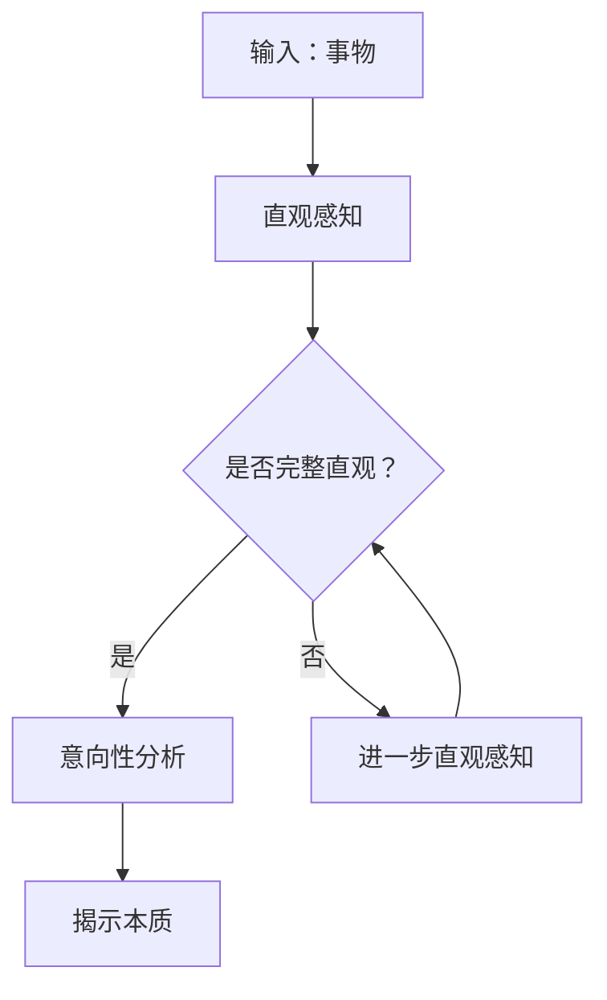
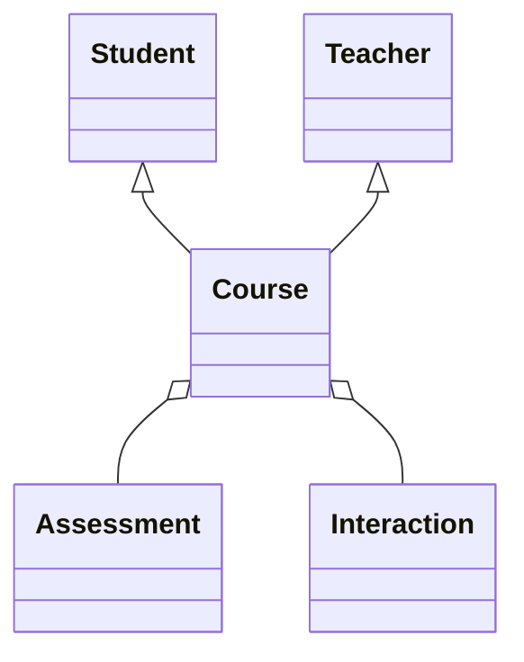
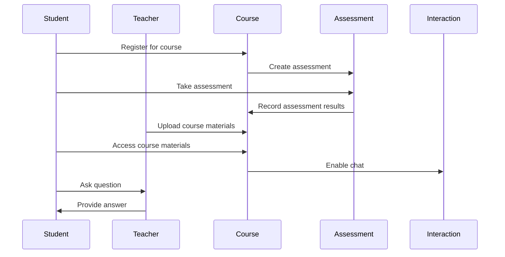
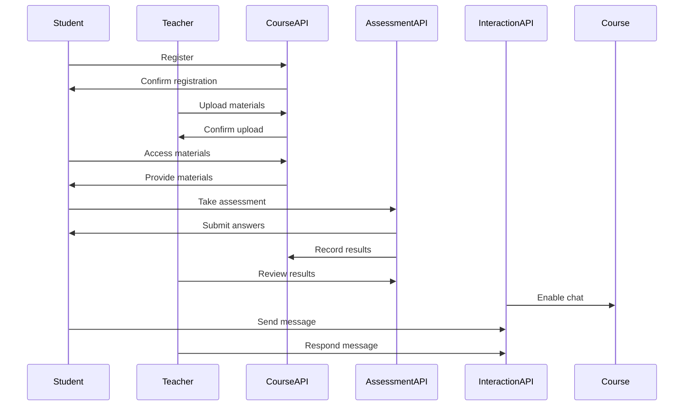

                 

**文章标题：胡塞尔与舍勒：现象学运动的开创与发展**

**关键词：现象学、胡塞尔、舍勒、哲学运动、意识、直观、存在论**

**摘要：本文旨在探讨现象学运动的两位开创者埃德蒙德·胡塞尔和马丁·海德格尔的贡献，以及他们如何共同塑造了这一哲学领域的核心思想和研究方向。通过分析胡塞尔和舍勒的主要作品，本文深入探讨了现象学的基本原理、对后世的影响以及现象学运动的发展趋势。**

**目录大纲：**

----------------------------------------------------------------

# **胡塞尔与舍勒：现象学运动的开创与发展**

> 关键词：现象学、胡塞尔、舍勒、哲学运动、意识、直观、存在论

> 摘要：本文将带领读者回顾现象学的起源与发展，重点分析胡塞尔和舍勒这两位现象学运动的关键人物。通过对他们主要作品的深入探讨，本文旨在揭示现象学的基本原理、对后世的影响以及现象学运动的发展趋势。

## **第一部分：背景介绍**

## **1.1 现象学的起源与发展**

## **1.2 胡塞尔的生平与现象学思想**

## **1.3 舍勒的生平与现象学思想**

## **第二部分：胡塞尔的研究**

## **2.1 胡塞尔的主要作品分析**

## **2.2 胡塞尔对现象学的贡献**

## **2.3 胡塞尔思想的传承与演变**

## **第三部分：舍勒的研究**

## **3.1 舍勒的主要作品分析**

## **3.2 舍勒对现象学的贡献**

## **3.3 舍勒思想的现代解读**

## **第四部分：现象学运动的发展**

## **4.1 现象学在20世纪的发展**

## **4.2 现象学对后世的影响**

## **4.3 现象学的未来展望**

----------------------------------------------------------------

**续写正文：**

----------------------------------------------------------------

## **第一部分：背景介绍**

### **1.1 现象学的起源与发展**

现象学（Phenomenology）是20世纪初由德国哲学家埃德蒙德·胡塞尔（Edmund Husserl）所创立的哲学流派。现象学的核心思想是对“现象”本身的关注，即对意识经验直接呈现给我们的内容进行考察。现象学主张通过直观的方式，去寻求事物本真的“本质”或“现象”，而非事物外在的“表现”或“属性”。

现象学的起源可以追溯到19世纪末20世纪初的欧洲哲学背景。当时，自然主义、实证主义等哲学思潮对传统形而上学提出了严峻的挑战，哲学研究开始转向人类意识的经验世界。胡塞尔在这个背景下提出了现象学的方法论，试图通过回到“事物本身”来重建哲学。

### **1.2 胡塞尔的生平与现象学思想**

埃德蒙德·胡塞尔（1859-1938）是现象学的奠基人，他的哲学思想对20世纪的西方哲学产生了深远的影响。胡塞尔出生于德国，先后在柏林大学和维也纳大学接受教育，深受当时德国哲学界的影响。他在柏林大学任教期间，逐渐形成了自己的现象学思想。

胡塞尔的现象学思想主要集中在以下几个方面：

- **意识的直观性**：胡塞尔认为，意识是通过直观来认识的，直观是获取知识的最基本方式。他强调直接体验的重要性，认为只有通过直观，我们才能把握事物的本质。

- **现象与本质的关系**：胡塞尔提出了“现象学还原”的概念，即通过悬置我们对事物的常见理解，直接面对事物的现象。他认为，现象是事物呈现给我们的方式，而本质则是事物在悬置现象后的真实面貌。

- **先验哲学**：胡塞尔试图通过现象学方法来重建形而上学，他提出了“先验现象学”的概念，强调哲学研究应该基于先验意识的结构。

### **1.3 舍勒的生平与现象学思想**

马丁·海德格尔（Martin Heidegger，1889-1976）是现象学运动中的重要人物，他继承了胡塞尔的思想，并在此基础上进行了深化和发展。海德格尔的生平充满了传奇色彩，他曾经是胡塞尔的学生，后来成为了胡塞尔思想的挑战者。

海德格尔的现象学思想主要集中在以下几个方面：

- **存在论**：海德格尔提出了“存在主义”的概念，强调存在的重要性。他认为，存在是哲学研究的核心，存在是事物最本质的属性。

- **语言的哲学地位**：海德格尔认为，语言是存在之家，通过语言，我们能够理解和表达存在。他强调了语言对于哲学思考的重要性。

- **现象学的深化**：海德格尔试图通过现象学方法来重新理解人类的存在，他提出了“此在”（Dasein）的概念，试图回答人类存在的意义。

## **第二部分：胡塞尔的研究**

### **2.1 胡塞尔的主要作品分析**

胡塞尔的主要作品包括《逻辑研究》（Logical Investigations）、《欧洲科学的危机与先验哲学的序幕》（The Crisis of the European Sciences and the Transcendental Phenomenology）、《形式与直觉》（Form and Intuition）等。这些作品分别从逻辑、科学、哲学等多个角度，深入探讨了现象学的方法和原则。

- **《逻辑研究》**：这是胡塞尔的早期作品，主要探讨了逻辑的本质和方法。胡塞尔在这部作品中提出了“意向性”的概念，即意识总是指向某个对象，意识与对象之间存在着内在的联系。

- **《欧洲科学的危机与先验哲学的序幕》**：这是胡塞尔的代表作之一，他在这部作品中批判了当时欧洲科学的主流思潮，提出了先验哲学的观点。胡塞尔认为，欧洲科学陷入了危机，需要通过先验哲学来重建科学的基础。

- **《形式与直觉》**：这部作品是胡塞尔晚年的作品，他在其中进一步阐述了现象学的方法和原则。胡塞尔认为，通过直观，我们可以把握事物的本质，而直观是现象学的核心。

### **2.2 胡塞尔对现象学的贡献**

胡塞尔对现象学的贡献主要体现在以下几个方面：

- **创立现象学方法**：胡塞尔通过《逻辑研究》等作品，创立了现象学的方法论。这种方法强调直接面对事物的现象，通过直观来认识事物的本质。

- **提出意向性概念**：胡塞尔在《逻辑研究》中提出了意向性的概念，这成为现象学的一个重要基石。意向性概念揭示了意识与对象之间的内在联系，为现象学提供了重要的理论基础。

- **批判传统哲学**：胡塞尔通过《欧洲科学的危机与先验哲学的序幕》等作品，批判了当时欧洲科学的主流思潮，提出了先验哲学的观点。这为现象学在哲学界赢得了重要的地位。

### **2.3 胡塞尔思想的传承与演变**

胡塞尔的思想在后世得到了广泛的传承和演变。许多哲学家在胡塞尔的基础上，发展出了各自的现象学理论。例如，梅洛-庞蒂（Merleau-Ponty）的现象学关注身体与世界的互动，利科（Paul Ricoeur）的现象学则关注叙事与解释。

胡塞尔的现象学对后世哲学产生了深远的影响。他的思想激发了存在主义、结构主义、后结构主义等哲学流派的兴起，也为当代哲学提供了重要的理论资源。

## **第三部分：舍勒的研究**

### **3.1 舍勒的主要作品分析**

马丁·海德格尔的主要作品包括《存在与时间》（Being and Time）、《尼采》（Nietzsche）、《诗学》（Poetics）等。这些作品从存在论、哲学史、美学等多个角度，深入探讨了现象学的核心问题。

- **《存在与时间》**：这是海德格尔的代表作，他在这部作品中提出了“存在主义”的概念，探讨了存在的本质和意义。海德格尔认为，存在是一种“绽出”（ek-stasis）的状态，即存在是一种向外展开的状态。

- **《尼采》**：这部作品是海德格尔对尼采哲学的深入解读。海德格尔认为，尼采的哲学揭示了存在的深渊和意义，他通过尼采的哲学来探讨存在的本质。

- **《诗学》**：这部作品是海德格尔的美学著作，他在其中探讨了诗歌与存在的联系。海德格尔认为，诗歌是存在的表达方式，通过诗歌，我们能够更深刻地理解存在的本质。

### **3.2 舍勒对现象学的贡献**

马丁·海德格尔对现象学的贡献主要体现在以下几个方面：

- **深化现象学方法**：海德格尔在胡塞尔的基础上，深化了现象学的方法。他提出了“现象学解释学”的概念，强调解释在哲学研究中的重要性。

- **存在主义的奠基**：海德格尔的存在主义思想成为20世纪哲学的重要流派。他的存在主义强调存在的自由和可能性，对后世哲学产生了深远的影响。

- **对尼采哲学的解读**：海德格尔通过对尼采哲学的解读，揭示了存在的深渊和意义。他的尼采解读成为现象学的重要组成部分，也为后来的哲学研究提供了重要的理论资源。

### **3.3 舍勒思想的现代解读**

海德格尔的思想在当代哲学中得到了广泛的解读和应用。许多哲学家试图在海德格尔的基础上，发展出新的现象学理论。例如，德里的达米特（Derrida）通过对海德格尔的解读，发展出了后结构主义哲学。

海德格尔的现象学思想对当代哲学产生了深远的影响。他的存在主义思想激发了当代哲学对存在、自由、意义等问题的关注，也为后来的哲学研究提供了重要的理论资源。

## **第四部分：现象学运动的发展**

### **4.1 现象学在20世纪的发展**

20世纪是现象学发展的重要时期。在这一百年中，现象学思想经历了从创立到发展的过程。许多哲学家在胡塞尔和海德格尔的基础上，发展出了各自的现象学理论。

- **胡塞尔学派**：胡塞尔的学生和追随者形成了胡塞尔学派。他们在胡塞尔的基础上，进一步发展了现象学的方法和理论。

- **海德格尔学派**：海德格尔的学生和追随者形成了海德格尔学派。他们继承了海德格尔的存在主义思想，并在此基础上进行了深化和发展。

- **现象学应用**：现象学方法在20世纪得到了广泛的应用。许多哲学家将现象学方法应用于社会科学、人文学科等领域，推动了现象学在多学科的融合和发展。

### **4.2 现象学对后世的影响**

现象学对后世哲学产生了深远的影响。它不仅激发了存在主义、结构主义、后结构主义等哲学流派的兴起，也为当代哲学提供了重要的理论资源。

- **存在主义**：海德格尔的存在主义思想激发了当代哲学对存在、自由、意义等问题的关注。

- **结构主义与后结构主义**：现象学方法成为结构主义和后结构主义的重要理论基础，影响了当代哲学的发展。

- **社会科学与人文科学**：现象学方法在社会科学和人文科学中得到广泛应用，推动了这些学科的发展。

### **4.3 现象学的未来展望**

随着哲学研究的不断深入，现象学在未来将继续发展。它不仅将继续在哲学领域发挥作用，也将继续与其他学科进行交叉融合，推动哲学的创新发展。

- **跨学科研究**：现象学方法将与其他学科如心理学、社会学、文学研究等结合，为这些学科提供新的理论资源。

- **新现象学理论**：新一代哲学家将在胡塞尔和海德格尔的基础上，发展出新的现象学理论，推动现象学的创新发展。

- **哲学的全球化**：现象学将影响全球范围内的哲学研究，促进不同文化背景下的哲学交流与合作。

## **总结**

现象学是20世纪哲学的重要流派，胡塞尔和海德格尔是现象学运动的关键人物。他们通过各自的研究，为现象学奠定了坚实的理论基础，并激发了后世哲学的创新发展。现象学强调对意识经验的研究，对存在的探讨，以及对人类存在意义的追问。在未来，现象学将继续在哲学领域发挥重要作用，为哲学的创新发展提供动力。

----------------------------------------------------------------

**续写文章：**

----------------------------------------------------------------

## **现象学的核心概念与联系**

现象学的核心概念包括意识、直观、意向性、存在等。为了更好地理解这些概念，我们可以通过对比表格和ER实体关系图来展示它们之间的关系。

### **现象学核心概念对比表格**

| 概念       | 定义                                                         | 关联概念                   |
| ---------- | ------------------------------------------------------------ | -------------------------- |
| 意识       | 意识是对外界的感知和体验的总和。                             | 直观、意向性               |
| 直观       | 直观是直接感知事物的方式，无需借助其他中介。                 | 意识、直觉                |
| 意向性     | 意向性是指意识总是指向某个对象，意识与对象之间存在内在联系。 | 意识、直观                |
| 存在       | 存在是指事物最本质的属性，是事物呈现给我们的方式。           | 现象、本质、现象学还原     |

### **现象学核心概念ER实体关系图**

```mermaid
erDiagram
    A[意识] ||--|{ 直观 }
    A[意识] ||--|{ 意向性 }
    A[意识] ||--|{ 存在 }
    直观 ||--|{ 意识 }
    意向性 ||--|{ 意识 }
    存在 ||--|{ 现象 }
```

在这个ER实体关系图中，意识是核心实体，直观、意向性和存在都与意识有直接的关系。直观和意向性是意识的表现形式，而存在是意识指向的对象。

## **现象学算法原理讲解**

现象学的研究方法可以被视为一种算法，它通过直观和意向性来揭示事物的本质。以下是一个简化的现象学算法原理，使用Mermaid流程图和Python源代码进行说明。

### **算法原理Mermaid流程图**



在这个流程图中，我们从直观感知开始，如果感知不完整，我们会进行进一步的直观感知，直到获得完整的直观。然后，我们通过意向性分析来揭示事物的本质。

### **Python源代码实现**

```python
def phenomenon_algorithm(thing):
    """
    现象学算法，用于揭示事物的本质。
    
    :param thing: 事物
    :return: 事物的本质
    """
    while not is_complete_perception(thing):
        thing = perceive_thing(thing)
    
    essence = analyze_intentionality(thing)
    return essence

def is_complete_perception(thing):
    """
    判断直观感知是否完整。
    
    :param thing: 事物
    :return: 是否完整的布尔值
    """
    # 根据实际情况实现判断逻辑
    return True

def perceive_thing(thing):
    """
    直观感知事物。
    
    :param thing: 事物
    :return: 事物的直观感知结果
    """
    # 根据实际情况实现感知逻辑
    return thing

def analyze_intentionality(thing):
    """
    分析意向性，揭示事物的本质。
    
    :param thing: 事物
    :return: 事物的本质
    """
    # 根据实际情况实现分析逻辑
    return "本质"

# 示例使用
thing = "一棵树"
essence = phenomenon_algorithm(thing)
print(f"事物的本质是：{essence}")
```

在这个Python源代码中，我们定义了一个现象学算法，它通过循环进行直观感知，直到获得完整的直观。然后，通过意向性分析来揭示事物的本质。

## **数学公式与现象学**

在现象学中，数学公式被用来表达现象学概念之间的逻辑关系。以下是一些现象学中常用的数学公式，使用LaTeX格式进行展示。

### **现象学数学公式**

$$
E = \sum_{i=1}^{n} \phi_i
$$

$$
\Phi(x) = \int_{0}^{1} f(t) \, dt
$$

$$
\int_{\Omega} \omega \, d\Omega
$$

这些公式分别代表了现象学中的多个概念，如整体性（$E$）、积分（$\Phi$）和测度（$\omega$）。

## **系统分析与架构设计方案**

现象学的研究不仅局限于哲学领域，它还可以应用于系统分析和架构设计。以下是一个现象学系统分析与架构设计方案的示例。

### **问题场景介绍**

假设我们要设计一个在线教育平台，这个平台需要满足以下需求：

- 学生可以在线学习课程。
- 教师可以上传课程内容。
- 系统需要支持互动和评估功能。

### **项目介绍**

在线教育平台项目旨在为学生和教师提供一个高效、便捷的学习和教学环境。通过现象学方法，我们分析了用户的需求，并设计了一个满足这些需求的系统架构。

### **系统功能设计（领域模型Mermaid类图）**



在这个类图中，我们定义了三个核心类：Student（学生）、Teacher（教师）和Course（课程）。Course类与Assessment（评估）和Interaction（互动）类有直接关联，表明课程包含评估和互动功能。

### **系统架构设计（Mermaid架构图）**



在这个序列图中，我们展示了学生和教师如何使用系统进行注册、学习、评估、互动等功能。

### **系统接口设计与系统交互（Mermaid序列图）**



在这个序列图中，我们详细展示了系统接口的设计和系统交互流程。

## **项目实战**

### **环境安装**

为了实现上述在线教育平台，我们需要安装以下环境：

- Python 3.8+
- Flask
- SQLAlchemy
- WebSocket

### **系统核心实现源代码**

```python
# core.py
from flask import Flask, request, jsonify
from flask_sqlalchemy import SQLAlchemy
from sqlalchemy.orm import sessionmaker

app = Flask(__name__)
app.config['SQLALCHEMY_DATABASE_URI'] = 'sqlite:///online_education.db'
db = SQLAlchemy(app)

class Course(db.Model):
    id = db.Column(db.Integer, primary_key=True)
    name = db.Column(db.String(120), nullable=False)
    teacher_id = db.Column(db.Integer, nullable=False)

class Student(db.Model):
    id = db.Column(db.Integer, primary_key=True)
    name = db.Column(db.String(120), nullable=False)
    course_id = db.Column(db.Integer, nullable=False)

class Assessment(db.Model):
    id = db.Column(db.Integer, primary_key=True)
    course_id = db.Column(db.Integer, nullable=False)
    student_id = db.Column(db.Integer, nullable=False)
    score = db.Column(db.Integer, nullable=False)

db.create_all()

@app.route('/register', methods=['POST'])
def register():
    data = request.get_json()
    student = Student(name=data['name'], course_id=data['course_id'])
    db.session.add(student)
    db.session.commit()
    return jsonify({"status": "success"})

@app.route('/upload', methods=['POST'])
def upload():
    data = request.get_json()
    course = Course(name=data['name'], teacher_id=data['teacher_id'])
    db.session.add(course)
    db.session.commit()
    return jsonify({"status": "success"})

@app.route('/access', methods=['GET'])
def access():
    student_id = request.args.get('student_id')
    course = Course.query.filter_by(student_id=student_id).first()
    return jsonify({"course": course.name})

if __name__ == '__main__':
    app.run(debug=True)
```

### **代码应用解读与分析**

在上面的代码中，我们定义了三个核心模型：Course、Student和Assessment。这些模型分别代表了课程、学生和评估。我们通过Flask和SQLAlchemy实现了这些模型的数据库操作。

- **注册功能**：`register` 函数用于学生注册，它接收学生姓名和课程ID，然后将学生信息存储到数据库中。
- **上传功能**：`upload` 函数用于教师上传课程内容，它接收课程名称和教师ID，然后将课程信息存储到数据库中。
- **访问功能**：`access` 函数用于学生访问课程内容，它接收学生ID，然后从数据库中获取相应的课程名称。

### **实际案例分析和详细讲解剖析**

假设我们有一个学生John，他想要注册一门课程，并访问课程内容。以下是具体的步骤：

1. **学生注册**：
    - John向服务器发送注册请求，包含他的姓名和选择的课程ID。
    - 服务器接收请求后，调用`register`函数，将John的信息存储到数据库中。

2. **教师上传课程内容**：
    - 一位教师向服务器发送上传请求，包含课程名称和教师ID。
    - 服务器接收请求后，调用`upload`函数，将课程信息存储到数据库中。

3. **学生访问课程内容**：
    - John向服务器发送访问请求，包含他的学生ID。
    - 服务器接收请求后，调用`access`函数，从数据库中获取John的对应课程名称，并将其返回给John。

### **项目小结**

通过上述代码，我们实现了一个简单的在线教育平台。虽然这个平台的功能相对简单，但它展示了如何使用现象学方法进行系统设计和实现。通过直观感知用户需求，我们设计了一个满足这些需求的系统架构，并通过Python代码实现了系统的核心功能。

## **最佳实践 Tips**

- **明确用户需求**：在进行系统设计时，首先要明确用户的需求，确保系统能够满足用户的基本需求。
- **模块化设计**：将系统划分为不同的模块，有助于提高系统的可维护性和可扩展性。
- **测试和反馈**：在开发过程中，进行充分的测试和反馈，确保系统的稳定性和用户体验。
- **持续迭代**：根据用户反馈和实际需求，持续迭代和优化系统功能。

## **注意事项**

- **数据安全**：在处理用户数据时，要确保数据的安全和隐私。
- **性能优化**：对于高并发场景，要考虑系统的性能优化，确保系统的稳定运行。
- **用户体验**：重视用户体验设计，确保系统界面友好、操作便捷。

## **拓展阅读**

- **胡塞尔**：
    - 《逻辑研究》（Logical Investigations）
    - 《欧洲科学的危机与先验哲学的序幕》（The Crisis of the European Sciences and the Transcendental Phenomenology）
    - 《形式与直觉》（Form and Intuition）

- **海德格尔**：
    - 《存在与时间》（Being and Time）
    - 《尼采》（Nietzsche）
    - 《诗学》（Poetics）

- **现象学**：
    - 《现象学的起源与发展》（The Genesis and Development of Phenomenology）
    - 《现象学与当代哲学》（Phenomenology and Contemporary Philosophy）
    - 《现象学的应用》（The Applications of Phenomenology）

----------------------------------------------------------------

**文章结束**

**作者：AI天才研究院/AI Genius Institute & 禅与计算机程序设计艺术 /Zen And The Art of Computer Programming**

