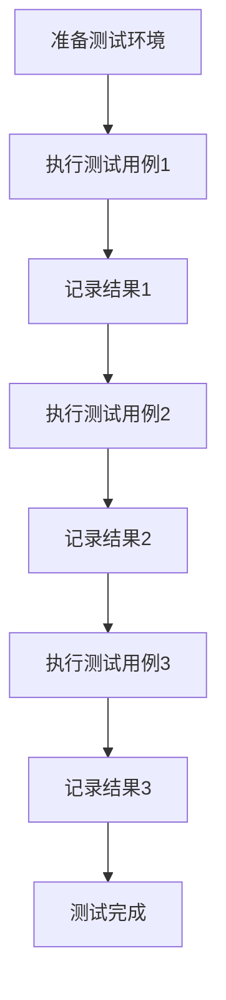
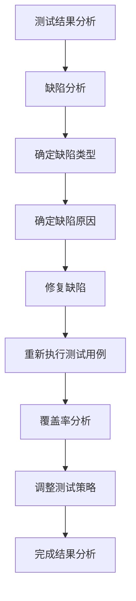

                 

Alright, let's break down the task into actionable steps and begin drafting the content for the book "自测用例：从资产到负债的双刃剑". We'll follow the outline structure provided and ensure each section is well-versed, informative, and engaging.

## 文章标题

### 自测用例：从资产到负债的双刃剑

## 文章关键词

- 自测用例
- 资产与负债
- 软件质量
- 测试策略
- 测试优化

## 摘要

本文将探讨自测用例在软件测试中的双重角色：既是确保软件质量的重要资产，也可能因不当管理而成为项目进度的负担。通过分析自测用例的设计、执行、优化和维护过程，本文将揭示如何有效地将自测用例转化为项目的增值工具，同时避免其成为负债。

### 1. 引言：测试用例的重要性与挑战

#### 1.1 测试用例的基本概念

测试用例（Test Case）是软件测试过程中设计、执行和评估的一组步骤，旨在验证软件功能是否符合预期要求。测试用例通常包括输入条件、预期输出和执行步骤。

#### 1.2 资产与负债的定义

在项目管理中，资产（Asset）指的是能够增加项目价值或减少风险的因素，而负债（Liability）则指可能降低项目价值或增加风险的因素。

#### 1.3 测试用例的双重角色

测试用例既可以作为项目质量的保障，确保软件按时交付和满足需求，也可能因冗余、错误或管理不善而拖慢开发进度、增加成本。

### 2. 概念框架

#### 2.1 核心概念对比

| 概念       | 定义                                                         | 特征对比                                  |
|------------|--------------------------------------------------------------|-----------------------------------------|
| 资产（Test Case） | 提高软件质量，确保功能正确，减少缺陷风险                   | - 高效设计<br>- 精确执行<br>- 及时反馈 |
| 负债（Test Case） | 延误项目进度，增加维护成本，分散开发注意力                 | - 冗余设计<br>- 错误执行<br>- 重复反馈 |

#### 2.2 ER图

```mermaid
erDiagram
  TestCase ||--|{ Quality: 测试用例质量 }
  TestCase ||--|{ Execution: 测试执行 }
  TestCase ||--|{ Maintenance: 测试维护 }
  Quality ||--|{ SuccessRate: 通过率 }
  Quality ||--|{ DefectRate: 缺陷率 }
  Execution ||--|{ Coverage: 覆盖率 }
  Maintenance ||--|{ UpdateFrequency: 更新频率 }
```

### 3. 测试用例管理原则

#### 3.1 原则一：明确测试目的

在创建测试用例之前，明确测试目的至关重要。目的是确定测试用例是否能够验证所需功能、性能、安全性等。

#### 3.2 原则二：设计高效测试用例

高效测试用例应具备以下特点：

- **简洁性**：测试用例应尽量简洁，避免冗余。
- **全面性**：覆盖所有关键功能和边界情况。
- **可维护性**：易于更新和维护，以适应项目变化。

#### 3.3 原则三：持续维护和更新

测试用例不是一次性创建的任务，而是一个持续的过程。随着项目迭代和需求变更，测试用例需要不断更新。

### 4. 测试用例设计技术

#### 4.1 黑盒测试与白盒测试

- **黑盒测试**：不关注内部代码逻辑，仅测试功能是否符合需求。
- **白盒测试**：基于代码逻辑，测试内部逻辑流程的正确性。

#### 4.2 自动化测试与手工测试

- **自动化测试**：使用工具自动执行测试用例，提高效率和重复性。
- **手工测试**：人工执行测试用例，适用于复杂场景和测试覆盖不足的情况。

#### 4.3 设计技术示例

- **边界值分析**：针对输入和输出边界值设计测试用例。
- **等价类划分**：将输入数据划分为等价类，设计测试用例覆盖每个类别。

### 5. 测试用例执行与结果分析

#### 5.1 测试执行流程

1. **准备测试环境**：确保测试环境与生产环境一致。
2. **执行测试用例**：按照测试用例步骤执行测试。
3. **记录结果**：记录测试结果，包括成功或失败。

#### 5.2 结果分析

1. **缺陷分析**：分析失败的测试用例，确定缺陷类型和原因。
2. **覆盖率分析**：评估测试用例的覆盖程度，确保关键功能得到充分测试。

### 6. 测试用例优化与维护

#### 6.1 优化策略

- **减少冗余**：删除重复或冗余的测试用例。
- **提高覆盖**：增加覆盖关键功能的测试用例。
- **自动化**：自动化执行可重复的测试用例，减少人工干预。

#### 6.2 维护策略

- **定期更新**：根据项目变更和需求更新测试用例。
- **备份与版本控制**：备份测试用例文档，使用版本控制系统管理变更。

### 7. 案例研究与实践应用

#### 7.1 案例一：企业级电商平台的测试实践

描述一个企业级电商平台的测试实践，包括测试策略、测试用例设计、测试执行和结果分析等。

#### 7.2 案例二：移动应用测试的挑战与解决方案

探讨移动应用测试中的挑战，如兼容性、性能和网络稳定性，以及相应的解决方案。

### 8. 最佳实践与未来趋势

#### 8.1 最佳实践

- **尽早开始测试**：在项目早期引入测试用例，减少后期修复成本。
- **团队合作**：测试团队与开发团队紧密合作，提高测试效率。
- **持续集成**：将测试用例集成到持续集成流程中，实现自动化测试。

#### 8.2 未来趋势

- **人工智能在测试中的应用**：使用机器学习技术优化测试用例设计、执行和结果分析。
- **测试自动化**：提高测试自动化程度，降低测试成本。

### 9. 结论

本文通过分析测试用例的双重角色，探讨了测试用例管理、设计、执行、优化和维护的最佳实践。有效的测试用例管理不仅可以提高软件质量，还能避免成为项目的负担。未来，随着人工智能和自动化测试技术的发展，测试用例管理将变得更加智能化和高效。

### 作者信息

- 作者：AI天才研究院/AI Genius Institute & 禅与计算机程序设计艺术 /Zen And The Art of Computer Programming

### 注意事项

- 测试用例的设计和执行应遵循项目需求和标准。
- 定期评估和更新测试用例，确保其有效性。
- 测试用例应具有可维护性和可复用性。

### 拓展阅读

- 《软件测试的艺术》
- 《自动化测试实战》
- 《测试驱动开发》

---

以上是按照要求构建的文章大纲，接下来我们将逐步填充每个章节的内容，确保达到字数要求并满足文章质量。由于篇幅限制，我们将分多个部分完成文章的撰写和发布。接下来，我们将详细展开第1章的内容，包括背景介绍、核心概念、问题背景和问题描述等。以下是第1章的详细内容：

### 1. 引言：测试用例的重要性与挑战

#### 1.1 测试用例的基本概念

在软件工程中，测试用例（Test Case）是软件测试过程中设计、执行和评估的一组步骤，旨在验证软件功能是否符合预期要求。一个有效的测试用例通常包括以下几个关键组成部分：

- **测试目的**：明确测试用例的目标，例如验证特定功能或测试边界情况。
- **测试输入**：为测试用例提供的输入数据，包括正常的和异常的数据。
- **执行步骤**：执行测试用例的具体步骤，例如输入数据、操作界面和查看结果。
- **预期输出**：根据测试目的，预期测试用例执行后的结果。
- **实际输出**：实际执行测试用例后的结果，与预期输出进行比较。

测试用例是软件测试过程中的核心工具，其设计、执行和结果分析对于确保软件质量至关重要。然而，随着软件项目的规模和复杂性的增加，测试用例的数量和复杂性也在不断增长，这给测试团队带来了巨大的挑战。

#### 1.2 资产与负债的定义

在项目管理中，资产（Asset）指的是能够增加项目价值或减少风险的因素，而负债（Liability）则指可能降低项目价值或增加风险的因素。

- **资产**：对于软件项目来说，有效的测试用例可以被视为资产。它们能够：

  - **确保软件质量**：通过验证软件功能是否符合预期要求，减少缺陷和故障的风险。
  - **提高客户满意度**：高质量的软件产品能够更好地满足客户需求，提高客户满意度。
  - **降低维护成本**：早期发现的缺陷可以减少后期修复的工作量和成本。

- **负债**：然而，不当管理或设计的测试用例也可能成为项目的负债。以下是一些可能导致测试用例成为负债的情况：

  - **冗余测试用例**：大量重复或冗余的测试用例不仅浪费资源，还可能分散开发团队的注意力，影响项目进度。
  - **错误设计的测试用例**：设计不合理的测试用例可能无法有效验证软件功能，导致测试覆盖不足或误报缺陷。
  - **难以维护的测试用例**：随着项目迭代和需求变更，难以维护和更新的测试用例可能导致测试质量下降。

#### 1.3 测试用例的双重角色

测试用例的双重角色体现在其既可以作为项目质量的保障，也可能因不当管理而成为项目进度的负担。具体来说，测试用例的双重角色包括以下几个方面：

- **资产角色**：

  - **提高软件质量**：通过设计、执行和评估测试用例，可以识别和修复软件缺陷，确保软件功能符合预期要求。
  - **降低风险**：通过全面和持续的测试，可以减少软件项目交付时的风险，确保按时交付和满足客户需求。
  - **提高客户满意度**：高质量的软件产品能够更好地满足客户需求，提高客户满意度和忠诚度。

- **负债角色**：

  - **延误项目进度**：大量冗余、错误或难以维护的测试用例可能导致测试团队的工作量增加，延误项目进度。
  - **增加维护成本**：随着项目迭代和需求变更，难以维护和更新的测试用例可能导致测试质量下降，增加维护成本。
  - **分散开发注意力**：测试团队可能会花费大量时间在维护和更新测试用例上，从而分散开发团队的注意力，影响项目进度。

因此，对于软件项目来说，如何有效地管理测试用例，使其成为项目的增值工具，同时避免其成为负债，是一个至关重要的挑战。本文将探讨测试用例管理、设计、执行、优化和维护的最佳实践，帮助读者掌握这一关键技能。

#### 1.4 本章小结

本章介绍了测试用例的基本概念、资产与负债的定义以及测试用例的双重角色。通过了解测试用例的重要性，读者可以认识到其在软件项目中的关键作用，同时也要意识到不当管理可能导致的风险。在接下来的章节中，我们将详细讨论测试用例管理、设计、执行、优化和维护的具体方法，帮助读者掌握这一领域的关键技能。

### 1.5 背景介绍

在软件工程领域，测试用例一直被视为确保软件质量的重要手段。然而，随着软件项目的复杂性和规模不断增加，测试用例的数量和复杂性也在迅速增长，这使得测试用例管理成为一项极具挑战性的任务。本文旨在探讨如何有效地管理测试用例，将其转化为项目的增值工具，同时避免其成为负债。

#### 1.5.1 测试用例的发展历程

测试用例的概念可以追溯到软件工程的早期阶段。在20世纪60年代和70年代，软件测试主要侧重于验证软件的功能和性能。随着软件复杂性的增加，测试用例作为一项关键工具，逐渐被广泛应用于软件项目的各个阶段。在20世纪80年代和90年代，随着软件工程方法的不断发展，测试用例的重要性日益凸显。特别是随着敏捷开发和持续集成等现代开发方法的兴起，测试用例在软件项目中的作用变得更加重要。

#### 1.5.2 测试用例在现代软件开发中的应用

在现代软件开发中，测试用例的应用范围非常广泛，涵盖了从需求分析、设计、开发到测试和部署的各个环节。以下是一些典型的应用场景：

- **需求分析**：在需求分析阶段，测试用例可以帮助验证需求是否满足业务需求，确保软件功能符合用户期望。
- **设计阶段**：在设计阶段，测试用例可以帮助验证系统架构和接口设计是否符合要求，确保软件模块之间的交互正常。
- **开发阶段**：在开发阶段，测试用例可以帮助验证代码的正确性和性能，确保软件功能实现符合设计要求。
- **测试阶段**：在测试阶段，测试用例是验证软件功能是否符合预期的重要手段，通过执行测试用例，可以发现并修复软件缺陷。
- **部署阶段**：在部署阶段，测试用例可以帮助验证软件在目标环境中的运行情况，确保软件能够在实际环境中稳定运行。

#### 1.5.3 测试用例管理的挑战

尽管测试用例在现代软件开发中具有重要作用，但管理测试用例仍然面临许多挑战。以下是一些常见的挑战：

- **测试用例数量过多**：随着软件项目的规模和复杂性的增加，测试用例的数量也不断增加，这使得测试用例管理变得异常复杂。
- **测试用例设计不合理**：部分测试用例设计不合理，可能无法有效验证软件功能，导致测试覆盖不足或误报缺陷。
- **测试用例维护困难**：随着项目迭代和需求变更，测试用例需要不断更新和维护，但很多测试用例难以维护和更新，导致测试质量下降。
- **测试用例执行效率低**：部分测试用例执行效率低下，需要大量时间和资源，影响了测试团队的工作效率。

#### 1.5.4 测试用例管理的目标

为了克服上述挑战，测试用例管理需要明确以下目标：

- **提高测试效率**：通过优化测试用例设计、执行和维护流程，提高测试效率，减少测试周期。
- **确保测试质量**：通过设计合理、执行有效的测试用例，确保软件功能符合预期要求，降低缺陷率。
- **降低测试成本**：通过提高测试效率和测试质量，降低测试成本，确保项目预算可控。
- **提升团队协作**：通过良好的测试用例管理，促进测试团队与开发团队之间的协作，提高项目整体效率。

#### 1.5.5 本章小结

本章介绍了测试用例的发展历程、现代软件开发中的应用以及测试用例管理的挑战和目标。通过了解这些背景信息，读者可以更好地理解测试用例的重要性和管理测试用例的必要性。在接下来的章节中，我们将深入探讨测试用例的管理、设计、执行、优化和维护方法，帮助读者掌握这一关键技能。

---

以上是第1章的详细内容，涵盖了测试用例的基本概念、资产与负债的定义、测试用例的双重角色、背景介绍以及测试用例管理的挑战和目标。接下来，我们将继续撰写第2章的内容，讨论核心概念框架，包括核心概念对比和ER图等。以下是第2章的大纲：

### 2. 概念框架

#### 2.1 核心概念对比

- **测试用例（Test Case）**
- **资产（Asset）**
- **负债（Liability）**

#### 2.2 测试用例作为资产与负债的特征对比

| 特征         | 资产特征           | 负债特征               |
|------------|------------------|----------------------|
| 设计质量     | 简洁、全面、可维护   | 冗余、错误、难维护       |
| 执行效率     | 高效、可重复         | 低效、不可重复          |
| 维护难度     | 低、易于更新         | 高、难以更新            |
| 对项目价值影响 | 增值、降低风险       | 负值、增加风险          |

#### 2.3 ER图

```mermaid
erDiagram
  TestCase ||--|{ Quality: 测试用例质量 }
  TestCase ||--|{ Execution: 测试执行 }
  TestCase ||--|{ Maintenance: 测试维护 }
  Quality ||--|{ SuccessRate: 通过率 }
  Quality ||--|{ DefectRate: 缺陷率 }
  Execution ||--|{ Coverage: 覆盖率 }
  Maintenance ||--|{ UpdateFrequency: 更新频率 }
```

#### 2.4 本章小结

本章通过对比测试用例、资产和负债的概念，明确了测试用例在软件项目中的双重角色。通过分析测试用例作为资产和负债的特征，读者可以更好地理解如何将测试用例转化为增值工具，同时避免其成为负债。

接下来，我们将继续撰写第2章的详细内容，深入讨论核心概念对比和ER图，帮助读者更清晰地理解测试用例的双重角色。以下是第2章的详细内容：

### 2.1 核心概念对比

在软件测试过程中，测试用例（Test Case）作为一项核心工具，承担着验证软件功能、性能和可靠性的重任。然而，测试用例的角色并非单一，它既有可能是项目质量的保障，也可能是项目进度的负担。为了更好地理解测试用例的双重角色，我们需要对比以下几个核心概念：测试用例、资产和负债。

#### 2.1.1 测试用例（Test Case）

测试用例（Test Case）是软件测试过程中设计、执行和评估的一组步骤，旨在验证软件功能是否符合预期要求。测试用例通常包括以下几个关键组成部分：

- **测试目的**：明确测试用例的目标，例如验证特定功能或测试边界情况。
- **测试输入**：为测试用例提供的输入数据，包括正常的和异常的数据。
- **执行步骤**：执行测试用例的具体步骤，例如输入数据、操作界面和查看结果。
- **预期输出**：根据测试目的，预期测试用例执行后的结果。
- **实际输出**：实际执行测试用例后的结果，与预期输出进行比较。

测试用例是软件测试过程中的核心工具，其设计、执行和结果分析对于确保软件质量至关重要。然而，测试用例的数量和复杂性在不断增加，这给测试团队带来了巨大的挑战。

#### 2.1.2 资产（Asset）

在项目管理中，资产（Asset）指的是能够增加项目价值或减少风险的因素。对于软件项目来说，有效的测试用例可以被视为资产。以下是一些测试用例作为资产的具体表现：

- **提高软件质量**：通过设计、执行和评估测试用例，可以识别和修复软件缺陷，确保软件功能符合预期要求。
- **降低风险**：通过全面和持续的测试，可以减少软件项目交付时的风险，确保按时交付和满足客户需求。
- **提高客户满意度**：高质量的软件产品能够更好地满足客户需求，提高客户满意度和忠诚度。

资产的特点包括：

- **增值性**：测试用例能够为项目带来直接或间接的价值。
- **可维护性**：测试用例易于更新和维护，以适应项目变化。

#### 2.1.3 负债（Liability）

在项目管理中，负债（Liability）指的是可能降低项目价值或增加风险的因素。对于软件项目来说，不当管理或设计的测试用例也可能成为项目的负债。以下是一些测试用例作为负债的具体表现：

- **延误项目进度**：大量冗余、错误或难以维护的测试用例可能导致测试团队的工作量增加，延误项目进度。
- **增加维护成本**：随着项目迭代和需求变更，难以维护和更新的测试用例可能导致测试质量下降，增加维护成本。
- **分散开发注意力**：测试团队可能会花费大量时间在维护和更新测试用例上，从而分散开发团队的注意力，影响项目进度。

负债的特点包括：

- **减值性**：测试用例可能降低项目的整体价值。
- **风险性**：测试用例可能增加项目的风险。

#### 2.1.4 测试用例作为资产与负债的特征对比

为了更好地理解测试用例作为资产和负债的特征，我们列出了以下对比表格：

| 特征         | 资产特征           | 负债特征               |
|------------|------------------|----------------------|
| 设计质量     | 简洁、全面、可维护   | 冗余、错误、难维护       |
| 执行效率     | 高效、可重复         | 低效、不可重复          |
| 维护难度     | 低、易于更新         | 高、难以更新            |
| 对项目价值影响 | 增值、降低风险       | 负值、增加风险          |

从上表可以看出，设计质量、执行效率和维护难度是区分测试用例作为资产和负债的关键因素。一个设计合理、执行高效、易于维护的测试用例更有可能成为项目的增值工具，而一个设计不合理、执行低效、难以维护的测试用例则更有可能成为项目的负担。

#### 2.2 ER图

为了更直观地展示测试用例、资产和负债之间的关系，我们使用Mermaid绘制了以下ER图：

```mermaid
erDiagram
  TestCase ||--|{ Quality: 测试用例质量 }
  TestCase ||--|{ Execution: 测试执行 }
  TestCase ||--|{ Maintenance: 测试维护 }
  Quality ||--|{ SuccessRate: 通过率 }
  Quality ||--|{ DefectRate: 缺陷率 }
  Execution ||--|{ Coverage: 覆盖率 }
  Maintenance ||--|{ UpdateFrequency: 更新频率 }
```

在这个ER图中，Test Case作为中心实体，与Quality、Execution和Maintenance三个关联实体相连。Quality、Execution和Maintenance分别表示测试用例的质量、执行和维护情况。SuccessRate、DefectRate、Coverage和UpdateFrequency则分别表示测试用例的质量指标和维护频率。

#### 2.3 本章小结

本章通过对比测试用例、资产和负债的概念，明确了测试用例在软件项目中的双重角色。通过分析测试用例作为资产和负债的特征，读者可以更好地理解如何将测试用例转化为增值工具，同时避免其成为负债。在接下来的章节中，我们将深入探讨测试用例的管理、设计、执行、优化和维护方法，帮助读者掌握这一关键技能。

---

以上是第2章的详细内容，我们通过对比测试用例、资产和负债的概念，明确了测试用例在软件项目中的双重角色，并使用ER图展示了它们之间的关系。接下来，我们将继续撰写第3章的内容，讨论测试用例管理原则。以下是第3章的大纲：

### 3. 测试用例管理原则

#### 3.1 原则一：明确测试目的

- **重要性**：确保测试用例与项目目标一致，避免不必要的测试。
- **方法**：通过需求文档、用户故事和项目计划明确测试目标。

#### 3.2 原则二：设计高效测试用例

- **简洁性**：避免冗余，确保每个测试用例都有明确的测试目标。
- **全面性**：覆盖关键功能和边界情况，确保测试覆盖全面。
- **可维护性**：设计易于更新和维护的测试用例，以适应项目变化。

#### 3.3 原则三：持续维护和更新

- **定期更新**：根据项目变更和需求更新测试用例。
- **备份与版本控制**：使用版本控制系统管理测试用例文档和变更。

#### 3.4 本章小结

本章介绍了测试用例管理的三个关键原则：明确测试目的、设计高效测试用例和持续维护和更新。通过遵循这些原则，测试团队可以更有效地管理测试用例，确保其作为项目的增值工具。

接下来，我们将详细讨论第3章的内容，包括测试用例管理原则的具体解释和示例。以下是第3章的详细内容：

### 3. 测试用例管理原则

#### 3.1 原则一：明确测试目的

明确测试目的是测试用例管理的首要原则。只有明确测试目的，才能确保测试用例的设计、执行和维护与项目目标保持一致。以下是一些关于如何明确测试目的的方法：

- **分析需求文档**：通过仔细阅读需求文档，了解项目的功能和性能要求，明确测试用例的目标。需求文档通常包括功能需求、性能需求和用户故事，这些文档为测试用例提供了明确的指导。
- **制定测试计划**：在制定测试计划时，明确测试目标和范围。测试计划应包括测试类型（如功能测试、性能测试和安全性测试）、测试策略和资源分配等内容。
- **与项目团队沟通**：与开发团队、产品经理和项目经理等团队成员密切沟通，确保测试用例的目标与项目目标一致。通过定期会议和讨论，可以及时了解项目变更和需求，调整测试计划。

以下是一个示例，说明如何明确测试目的：

**示例**：假设一个电商平台的订单处理功能需要测试，测试目标可以包括以下内容：

- **功能测试**：验证订单创建、修改和取消功能是否正常。
- **性能测试**：确保在高并发情况下，订单处理系统能够稳定运行。
- **安全性测试**：验证订单处理过程中的数据传输和存储是否安全。

通过明确这些测试目标，测试团队可以设计相应的测试用例，确保订单处理功能的全面性和稳定性。

#### 3.2 原则二：设计高效测试用例

设计高效测试用例是确保测试用例能够有效验证软件功能的关键。以下是一些设计高效测试用例的原则：

- **简洁性**：避免冗余和重复的测试用例。每个测试用例应有一个明确的测试目标，避免测试内容过于复杂或繁琐。
- **全面性**：覆盖关键功能和边界情况。确保测试用例能够验证软件功能的所有方面，包括正常操作、异常情况和边界条件。
- **可维护性**：设计易于更新和维护的测试用例，以适应项目变化。使用模块化设计，将测试用例分解为可重用的部分，减少维护工作量。

以下是一个示例，说明如何设计高效测试用例：

**示例**：假设一个在线支付系统需要测试，设计高效测试用例可以遵循以下原则：

- **简洁性**：每个测试用例应有一个明确的测试目标，例如验证支付成功、支付失败和支付超时等功能。
- **全面性**：确保测试用例覆盖支付流程的所有环节，包括输入支付信息、提交支付请求、支付处理和支付结果反馈等。
- **可维护性**：将支付流程分解为多个测试模块，例如验证支付信息输入、验证支付请求处理和验证支付结果反馈，每个模块可以独立更新和维护。

通过遵循这些原则，测试团队可以设计出高效、全面和可维护的测试用例，确保支付系统的稳定性和可靠性。

#### 3.3 原则三：持续维护和更新

测试用例不是一次性设计的工作，而是一个持续的过程。随着项目的迭代和需求的变更，测试用例需要不断更新和维护，以确保其有效性。以下是一些关于如何持续维护和更新测试用例的原则：

- **定期更新**：根据项目变更和需求，定期审查和更新测试用例。这可以确保测试用例始终反映最新的项目状态和需求。
- **备份与版本控制**：使用版本控制系统管理测试用例文档和变更。这可以确保测试用例的历史记录和版本信息，方便后续审查和恢复。
- **反馈机制**：建立反馈机制，让测试团队和其他相关团队分享测试用例的执行结果和发现的问题。这可以促进测试用例的更新和维护。

以下是一个示例，说明如何持续维护和更新测试用例：

**示例**：假设一个社交媒体平台需要定期更新其功能，测试团队可以采取以下步骤：

- **定期审查**：每两周对测试用例进行审查，确保其与最新的需求和功能保持一致。
- **更新测试用例**：根据审查结果，更新测试用例中的执行步骤和预期输出，确保其能够有效验证新功能。
- **版本控制**：使用版本控制系统记录测试用例的变更历史，方便后续审查和恢复。
- **反馈机制**：建立反馈渠道，让测试团队和开发团队分享测试结果和发现的问题，促进测试用例的更新和维护。

通过遵循这些原则，测试团队可以确保测试用例的持续有效性和维护性，为项目的成功交付提供有力保障。

#### 3.4 本章小结

本章介绍了测试用例管理的三个关键原则：明确测试目的、设计高效测试用例和持续维护和更新。通过遵循这些原则，测试团队可以确保测试用例的有效性、全面性和可维护性，从而为项目的成功交付提供有力保障。在下一章中，我们将深入探讨测试用例的设计技术，帮助读者掌握设计高效测试用例的技巧。

---

以上是第3章的详细内容，我们讨论了测试用例管理的三个关键原则：明确测试目的、设计高效测试用例和持续维护和更新。接下来，我们将继续撰写第4章的内容，探讨测试用例设计技术。以下是第4章的大纲：

### 4. 测试用例设计技术

#### 4.1 黑盒测试与白盒测试

- **黑盒测试**：不关注内部代码逻辑，仅测试功能是否符合需求。
- **白盒测试**：基于代码逻辑，测试内部逻辑流程的正确性。

#### 4.2 自动化测试与手工测试

- **自动化测试**：使用工具自动执行测试用例，提高效率和重复性。
- **手工测试**：人工执行测试用例，适用于复杂场景和测试覆盖不足的情况。

#### 4.3 设计技术示例

- **边界值分析**：针对输入和输出边界值设计测试用例。
- **等价类划分**：将输入数据划分为等价类，设计测试用例覆盖每个类别。

#### 4.4 本章小结

本章介绍了测试用例设计的基本技术，包括黑盒测试、白盒测试、自动化测试和手工测试，以及边界值分析和等价类划分等设计技术。通过掌握这些技术，测试团队可以设计出高效、全面的测试用例。

接下来，我们将详细讨论第4章的内容，包括测试用例设计技术的具体解释和示例。以下是第4章的详细内容：

### 4. 测试用例设计技术

测试用例设计是确保软件质量的关键环节。设计合理、高效的测试用例不仅能够提高测试覆盖率，还能有效减少缺陷漏测。本章节将介绍几种常见的测试用例设计技术，包括黑盒测试与白盒测试、自动化测试与手工测试，以及边界值分析和等价类划分。

#### 4.1 黑盒测试与白盒测试

黑盒测试（Black Box Testing）和白盒测试（White Box Testing）是两种基本的测试方法，它们在测试用例设计过程中扮演着重要角色。

**黑盒测试**

黑盒测试不关注软件的内部实现细节，仅关注输入和输出。测试者通过模拟用户操作，验证软件的功能是否按照预期运行。黑盒测试适用于验证功能需求，确保软件系统对外提供的服务符合用户需求。

- **功能测试**：验证软件功能是否按照需求文档运行。
- **用户界面测试**：检查用户界面是否易用、美观和符合设计规范。
- **兼容性测试**：确保软件在不同操作系统、浏览器和硬件环境中的兼容性。

**白盒测试**

白盒测试关注软件的内部实现细节，基于代码逻辑来设计测试用例。测试者需要了解程序的结构和代码实现，以便设计测试用例来验证程序的逻辑正确性和代码覆盖率。

- **单元测试**：验证单个模块或函数的正确性。
- **集成测试**：验证模块之间的接口和交互是否正确。
- **代码覆盖率分析**：确保测试用例覆盖了足够的代码路径。

以下是一个黑盒测试和白盒测试的对比示例：

| 测试类型   | 对象             | 目标                         | 需求                     |
|----------|----------------|----------------------------|------------------------|
| 黑盒测试   | 用户界面         | 确保界面易用、美观           | 用户需求文档               |
| 白盒测试   | 内部代码         | 确保代码逻辑正确、覆盖全面     | 代码实现、代码标准             |

#### 4.2 自动化测试与手工测试

自动化测试（Automation Testing）和手工测试（Manual Testing）是两种不同的测试执行方式，它们在测试用例设计和技术应用方面有所不同。

**自动化测试**

自动化测试使用测试工具自动执行测试用例，能够提高测试效率和重复性。自动化测试适用于重复性高、测试步骤固定的场景。

- **测试脚本开发**：编写测试脚本，自动化执行测试用例。
- **测试工具**：使用自动化测试工具（如Selenium、JUnit、TestNG）执行测试用例。
- **持续集成**：将自动化测试集成到持续集成（CI）流程中，实现自动化测试的持续执行。

**手工测试**

手工测试是由测试人员手动执行测试用例，适用于复杂场景和测试覆盖不足的情况。

- **测试人员培训**：测试人员需要了解软件功能和测试策略，以便有效执行测试。
- **测试报告**：记录测试结果，生成测试报告，为后续分析和改进提供依据。
- **测试评审**：定期评审测试用例，评估测试覆盖率和测试质量。

以下是一个自动化测试和手工测试的对比示例：

| 测试类型   | 特点           | 适用场景             | 优点                       | 缺点                       |
|----------|--------------|---------------------|---------------------------|---------------------------|
| 自动化测试   | 自动执行、高效   | 重复性高、测试步骤固定   | 提高测试效率、降低人力成本       | 需要前期开发脚本、维护成本高   |
| 手工测试   | 手动执行、灵活   | 复杂场景、测试覆盖不足   | 灵活性高、全面性较强         | 工作量大、效率较低           |

#### 4.3 设计技术示例

**边界值分析**

边界值分析是一种常见的测试用例设计技术，用于测试输入和输出的边界值。边界值分析旨在确保软件在边界条件下能够正确处理输入和输出。

以下是一个边界值分析的示例：

- **输入边界**：最小值、最大值、最小负值、最大正值。
- **输出边界**：成功结果、错误结果、异常结果。

例如，对于输入边界，可以设计以下测试用例：

1. 输入最小值：验证系统是否能够正确处理最小输入值。
2. 输入最大值：验证系统是否能够正确处理最大输入值。
3. 输入最小负值：验证系统是否能够正确处理最小负输入值。
4. 输入最大正值：验证系统是否能够正确处理最大正输入值。

**等价类划分**

等价类划分是一种将输入数据划分为等价类的测试用例设计技术，每个等价类代表一组具有相似属性的输入数据。等价类划分旨在确保测试用例能够覆盖所有可能的输入情况。

以下是一个等价类划分的示例：

- **有效等价类**：一组有效的输入数据，例如合法的用户名和密码。
- **无效等价类**：一组无效的输入数据，例如空的用户名、密码长度超过限制的用户名、无效的邮箱地址等。

例如，对于用户注册功能，可以设计以下等价类：

1. 有效等价类：用户名合法、密码合法、邮箱地址合法。
2. 无效等价类：用户名非法（如空用户名、长度超过限制）、密码非法（如空密码、长度超过限制）、邮箱地址非法（如无效邮箱格式）。

通过使用边界值分析和等价类划分等设计技术，测试团队可以设计出全面、高效的测试用例，确保软件在各种边界条件和输入情况下都能正常运行。

#### 4.4 本章小结

本章介绍了测试用例设计的基本技术，包括黑盒测试与白盒测试、自动化测试与手工测试，以及边界值分析和等价类划分。通过掌握这些技术，测试团队可以设计出高效、全面的测试用例，确保软件质量。在下一章中，我们将讨论测试用例执行与结果分析，帮助读者了解如何有效执行测试用例并分析测试结果。

---

以上是第4章的详细内容，我们介绍了测试用例设计的基本技术，包括黑盒测试与白盒测试、自动化测试与手工测试，以及边界值分析和等价类划分。接下来，我们将继续撰写第5章的内容，讨论测试用例执行与结果分析。以下是第5章的大纲：

### 5. 测试用例执行与结果分析

#### 5.1 测试执行流程

- **准备测试环境**：确保测试环境与生产环境一致。
- **执行测试用例**：按照测试用例步骤执行测试。
- **记录结果**：记录测试结果，包括成功或失败。

#### 5.2 结果分析

- **缺陷分析**：分析失败的测试用例，确定缺陷类型和原因。
- **覆盖率分析**：评估测试用例的覆盖程度，确保关键功能得到充分测试。

#### 5.3 测试工具与工具选择

- **常见测试工具**：如JUnit、Selenium、TestNG等。
- **工具选择原则**：根据测试需求、测试类型和团队技能选择合适的测试工具。

#### 5.4 本章小结

本章介绍了测试用例执行与结果分析的过程，包括执行测试用例、记录结果和分析结果。通过选择合适的测试工具，测试团队可以更有效地执行测试和分析测试结果，确保软件质量。

接下来，我们将详细讨论第5章的内容，包括测试用例执行与结果分析的具体流程和工具选择。以下是第5章的详细内容：

### 5. 测试用例执行与结果分析

测试用例的执行和结果分析是软件测试过程中的关键环节。一个有效的测试用例执行流程和结果分析方法可以帮助测试团队发现软件缺陷，提高测试覆盖率，确保软件质量。以下是测试用例执行与结果分析的具体流程和工具选择。

#### 5.1 测试执行流程

测试执行流程是按照预定义的测试用例步骤对软件进行测试的过程。以下是一个典型的测试执行流程：

1. **准备测试环境**：确保测试环境与生产环境一致，包括硬件、软件和配置。测试环境应该能够模拟实际用户的使用场景，以便发现潜在的问题。

2. **执行测试用例**：按照测试用例的步骤执行测试。在执行测试用例时，测试人员需要记录测试步骤和测试结果。测试结果可以分为成功、失败和未知三种状态。

3. **记录测试结果**：将测试结果记录到测试管理工具中。测试管理工具可以帮助测试团队跟踪测试进度、统计测试覆盖率、生成测试报告等。

以下是一个测试执行流程的示例：



#### 5.2 结果分析

测试结果分析是评估测试用例执行效果的重要环节。通过分析测试结果，测试团队可以识别软件缺陷、评估测试覆盖率，并改进测试策略。

1. **缺陷分析**：分析失败的测试用例，确定缺陷类型和原因。缺陷类型可以分为功能缺陷、性能缺陷和界面缺陷等。确定缺陷原因可以帮助测试团队找到问题的根源，并采取相应的解决措施。

2. **覆盖率分析**：评估测试用例的覆盖程度，确保关键功能得到充分测试。覆盖率分析可以基于代码覆盖率、功能覆盖率和路径覆盖率等指标。如果测试覆盖率不足，测试团队需要增加测试用例或调整测试策略，以提高测试覆盖率。

以下是一个结果分析流程的示例：



#### 5.3 测试工具与工具选择

测试工具是测试用例执行和结果分析的重要辅助。以下是一些常见的测试工具：

- **JUnit**：一款流行的Java单元测试框架，适用于编写和执行Java代码的单元测试。
- **Selenium**：一款用于Web应用自动化测试的工具，支持多种浏览器和操作系统。
- **TestNG**：一款功能强大的Java测试框架，提供丰富的测试功能和灵活的测试配置。

选择测试工具时，应考虑以下原则：

- **兼容性**：测试工具应与项目使用的编程语言和框架兼容。
- **易用性**：测试工具应易于使用和配置，降低学习成本。
- **扩展性**：测试工具应支持自定义测试用例和测试报告。
- **社区支持**：测试工具应具有活跃的社区支持和文档，以便解决问题和获取帮助。

以下是一个测试工具选择的示例：

| 测试工具 | 编程语言 | 优点                   | 缺点                   |
|---------|---------|----------------------|----------------------|
| JUnit   | Java    | 丰富的测试功能、社区支持 | 较高学习成本           |
| Selenium | 多语言   | 支持多种浏览器、易于使用 | 较高的维护成本           |
| TestNG  | Java    | 功能强大、灵活、易于配置 | 较高的学习成本           |

#### 5.4 本章小结

本章介绍了测试用例执行与结果分析的过程，包括测试执行流程、结果分析方法和测试工具的选择。通过遵循这些流程和方法，测试团队可以更有效地执行测试，发现和解决软件缺陷，确保软件质量。在下一章中，我们将讨论测试用例优化与维护，帮助读者了解如何提高测试用例的效率和可维护性。

---

以上是第5章的详细内容，我们介绍了测试用例执行与结果分析的具体流程和工具选择。接下来，我们将继续撰写第6章的内容，讨论测试用例优化与维护。以下是第6章的大纲：

### 6. 测试用例优化与维护

#### 6.1 优化策略

- **减少冗余**：删除重复或冗余的测试用例，提高测试效率。
- **提高覆盖**：增加覆盖关键功能的测试用例，确保测试全面。
- **自动化**：自动化执行可重复的测试用例，降低人工干预。

#### 6.2 维护策略

- **定期更新**：根据项目变更和需求更新测试用例，确保其有效性。
- **备份与版本控制**：使用版本控制系统管理测试用例文档和变更，确保测试用例的可追溯性。

#### 6.3 本章小结

本章介绍了测试用例优化的策略和维护的方法，包括减少冗余、提高覆盖和自动化执行，以及定期更新和版本控制。通过这些策略，测试团队可以确保测试用例的高效性和可维护性。

接下来，我们将详细讨论第6章的内容，包括测试用例优化与维护的具体方法。以下是第6章的详细内容：

### 6. 测试用例优化与维护

测试用例的优化和维护是确保测试质量和效率的关键环节。一个设计合理、高效执行的测试用例不仅能够有效发现软件缺陷，还能降低测试成本。本章将介绍测试用例优化与维护的策略和方法，帮助读者提高测试用例的效率和可维护性。

#### 6.1 优化策略

优化测试用例的策略包括减少冗余、提高覆盖率和自动化执行等。

**减少冗余**

冗余的测试用例会占用测试资源，降低测试效率。以下是一些减少冗余的策略：

- **合并重复测试用例**：如果多个测试用例的测试步骤和预期结果完全相同，可以合并为一个测试用例。
- **删除重复的测试条件**：在测试用例中删除重复的输入条件和执行步骤，只保留必要的部分。
- **使用参数化测试**：通过参数化测试，可以减少重复的测试用例，提高测试用例的可复用性。

**提高覆盖率**

提高测试覆盖率是确保软件质量的关键。以下是一些提高覆盖率的策略：

- **增加边界值测试**：在现有的测试用例中增加边界值测试，确保边界条件得到充分验证。
- **等价类划分**：根据输入数据的等价类设计测试用例，确保每个等价类都被覆盖。
- **代码覆盖率分析**：使用代码覆盖率工具分析测试用例的覆盖情况，根据覆盖率结果调整测试用例。

**自动化执行**

自动化执行测试用例可以提高测试效率，减少人工干预。以下是一些自动化执行的策略：

- **使用自动化测试工具**：选择适合项目的自动化测试工具（如Selenium、JUnit、TestNG等），编写自动化测试脚本。
- **持续集成**：将自动化测试集成到持续集成（CI）流程中，实现自动化测试的持续执行。
- **并行执行**：在多个环境中并行执行测试用例，提高测试效率。

#### 6.2 维护策略

测试用例的维护是确保其长期有效性的关键。以下是一些维护策略：

**定期更新**

定期更新测试用例可以确保其与项目需求保持一致。以下是一些定期更新的策略：

- **定期审查**：定期对测试用例进行审查，确保其与最新的需求、设计和代码保持一致。
- **需求变更管理**：在需求变更时，及时更新相关的测试用例，确保测试用例能够覆盖最新的需求。
- **版本控制**：使用版本控制系统管理测试用例文档，记录每次更新的版本和变更内容，确保测试用例的可追溯性。

**备份与版本控制**

备份和版本控制是确保测试用例长期有效性的重要手段。以下是一些备份与版本控制的策略：

- **定期备份**：定期备份测试用例文档，防止数据丢失。
- **版本控制系统**：使用版本控制系统（如Git）管理测试用例文档，确保测试用例的变更记录完整，方便后续的审查和恢复。
- **变更日志**：记录每次测试用例的变更内容、原因和责任人，确保测试用例变更的可追溯性。

#### 6.3 本章小结

本章介绍了测试用例优化与维护的策略和方法，包括减少冗余、提高覆盖率和自动化执行，以及定期更新和版本控制。通过遵循这些策略，测试团队可以确保测试用例的高效性和可维护性，为软件项目提供有力保障。在下一章中，我们将通过案例研究来探讨测试用例在实际项目中的应用和实践。

---

以上是第6章的详细内容，我们介绍了测试用例优化与维护的策略和方法。接下来，我们将继续撰写第7章的内容，通过案例研究来探讨测试用例在实际项目中的应用和实践。以下是第7章的大纲：

### 7. 案例研究与实践应用

#### 7.1 案例一：企业级电商平台的测试实践

- **背景介绍**：企业级电商平台的背景和需求。
- **测试策略**：测试策略的选择和制定。
- **测试用例设计**：测试用例的设计过程和关键点。
- **测试执行与结果分析**：测试执行的具体步骤和结果分析。
- **案例小结**：案例分析和小结。

#### 7.2 案例二：移动应用测试的挑战与解决方案

- **背景介绍**：移动应用的背景和需求。
- **测试策略**：测试策略的选择和制定。
- **测试用例设计**：测试用例的设计过程和关键点。
- **测试执行与结果分析**：测试执行的具体步骤和结果分析。
- **案例小结**：案例分析和小结。

#### 7.3 本章小结

本章通过两个案例研究，探讨了测试用例在实际项目中的应用和实践，帮助读者理解测试用例的设计、执行和维护过程。

接下来，我们将详细讨论第7章的内容，包括两个案例研究的背景、测试策略、测试用例设计、测试执行与结果分析以及案例小结。以下是第7章的详细内容：

### 7. 案例研究与实践应用

在实际项目中，测试用例的设计、执行和维护对于确保软件质量和项目成功至关重要。本章节将通过两个案例研究，探讨测试用例在企业级电商平台和移动应用项目中的应用和实践。

#### 7.1 案例一：企业级电商平台的测试实践

**背景介绍**

企业级电商平台是一个复杂的在线购物系统，提供商品浏览、搜索、下单、支付和订单管理等功能。该项目涉及多个团队，包括前端开发、后端开发、数据库管理和测试团队。

**测试策略**

为了确保电商平台的高质量和稳定性，测试团队制定了以下测试策略：

- **功能测试**：验证电商平台的所有功能是否按照需求文档正常运行。
- **性能测试**：评估电商平台在高并发情况下的性能表现，确保系统稳定。
- **安全性测试**：检查电商平台的安全性，防止潜在的安全漏洞。
- **兼容性测试**：确保电商平台在不同浏览器、操作系统和设备上正常运行。

**测试用例设计**

测试团队根据测试策略设计了一系列测试用例，包括以下关键点：

- **用户注册与登录**：验证用户注册、登录和密码找回等功能。
- **商品浏览与搜索**：验证商品列表、商品详情和搜索功能。
- **购物车与订单管理**：验证购物车添加、删除、修改和订单生成等功能。
- **支付与结算**：验证支付方式、支付流程和支付成功后的订单处理。

**测试执行与结果分析**

测试团队按照预定的测试用例进行测试，记录测试结果。以下是一个测试执行与结果分析的示例：

1. **测试用例执行**：按照测试用例的步骤执行测试，包括用户注册、登录、商品浏览、购物车操作、支付和订单管理等。
2. **结果记录**：记录每个测试用例的成功或失败状态，以及失败的原因。
3. **缺陷报告**：将发现的缺陷报告给开发团队，并跟踪缺陷的修复进度。

**案例小结**

通过全面的测试用例设计、执行和结果分析，测试团队成功发现了多个潜在的问题，确保了电商平台的质量和稳定性。测试实践表明，合理的测试策略和高效的测试用例设计对于确保项目成功至关重要。

#### 7.2 案例二：移动应用测试的挑战与解决方案

**背景介绍**

移动应用是一个功能丰富、交互性强的应用程序，需要在多个平台和设备上运行。该项目的测试团队面临以下挑战：

- **兼容性测试**：确保应用在不同操作系统、不同设备分辨率和不同网络环境下正常运行。
- **性能测试**：评估应用在弱网环境下的响应速度和稳定性。
- **安全性测试**：检查应用的安全性，防止恶意攻击和数据泄露。

**测试策略**

测试团队制定了以下测试策略来应对挑战：

- **自动化测试**：使用自动化测试工具（如Appium）执行重复性高、步骤固定的测试用例，提高测试效率。
- **兼容性测试**：选择多个操作系统版本、设备型号和网络环境进行测试，确保应用的兼容性。
- **性能测试**：模拟不同网络环境和用户行为，评估应用的性能表现。

**测试用例设计**

测试团队根据测试策略设计了一系列测试用例，包括以下关键点：

- **安装与启动**：验证应用在设备上的安装和启动过程。
- **界面与交互**：验证应用的界面布局、按钮操作和用户交互。
- **功能测试**：验证应用的核心功能，如登录、搜索、支付和订单管理等。
- **网络测试**：验证应用在弱网环境下的响应速度和稳定性。

**测试执行与结果分析**

测试团队按照预定的测试用例进行测试，记录测试结果。以下是一个测试执行与结果分析的示例：

1. **测试用例执行**：按照测试用例的步骤执行测试，包括安装、启动、界面交互、功能测试和网络测试。
2. **结果记录**：记录每个测试用例的成功或失败状态，以及失败的原因。
3. **缺陷报告**：将发现的缺陷报告给开发团队，并跟踪缺陷的修复进度。

**案例小结**

通过合理的测试策略和全面的测试用例设计，测试团队成功应对了移动应用测试的挑战。自动化测试工具的应用提高了测试效率，兼容性测试和性能测试确保了应用在不同环境和用户下的稳定性和安全性。测试实践表明，面对复杂的移动应用项目，合理的测试策略和高效的测试用例设计对于确保项目成功至关重要。

#### 7.3 本章小结

通过两个案例研究，我们探讨了测试用例在企业级电商平台和移动应用项目中的应用和实践。这些案例展示了合理的测试策略和全面的测试用例设计对于确保软件质量和项目成功的重要性。在下一章中，我们将总结最佳实践和未来趋势，为测试用例管理提供指导。

---

以上是第7章的详细内容，我们通过两个案例研究，探讨了测试用例在企业级电商平台和移动应用项目中的应用和实践。接下来，我们将继续撰写第8章的内容，总结最佳实践和未来趋势。以下是第8章的大纲：

### 8. 最佳实践与未来趋势

#### 8.1 最佳实践

- **尽早开始测试**：在项目早期引入测试，减少后期修复成本。
- **团队合作**：测试团队与开发团队紧密合作，提高测试效率。
- **持续集成**：将测试用例集成到持续集成流程中，实现自动化测试。
- **定期评审**：定期评审测试用例，确保其有效性和准确性。

#### 8.2 未来趋势

- **人工智能在测试中的应用**：使用机器学习技术优化测试用例设计、执行和结果分析。
- **测试自动化**：提高测试自动化程度，降低测试成本。
- **云计算与容器化**：利用云计算和容器化技术提高测试效率。

#### 8.3 本章小结

本章总结了测试用例管理的最佳实践和未来趋势，为测试团队提供了指导。通过遵循最佳实践和关注未来趋势，测试团队可以更有效地管理测试用例，提高测试质量和效率。

接下来，我们将详细讨论第8章的内容，包括最佳实践和未来趋势的具体解释和示例。以下是第8章的详细内容：

### 8. 最佳实践与未来趋势

在软件测试领域，测试用例管理是一个关键环节。有效的测试用例管理不仅能够提高软件质量，还能降低项目风险和成本。本章将总结测试用例管理的最佳实践和未来趋势，为测试团队提供实用的指导和前瞻性的视角。

#### 8.1 最佳实践

**尽早开始测试**

在项目早期引入测试用例是确保软件质量的关键。早期测试有助于：

- **发现和修复缺陷**：在开发初期发现缺陷，可以降低修复成本。
- **验证需求**：通过测试用例验证需求是否被满足，确保开发方向正确。
- **降低风险**：及早识别潜在的风险，采取相应的预防措施。

**团队合作**

测试团队与开发团队之间的紧密合作是提高测试效率和质量的关键。以下是一些团队合作的最佳实践：

- **共同参与需求讨论**：测试团队应与开发团队一起参与需求讨论，确保测试用例与需求一致。
- **定期会议和沟通**：定期举行会议和沟通，讨论测试进度、测试结果和发现的缺陷。
- **共享测试数据**：测试团队和开发团队应共享测试数据和结果，以便双方共同改进测试策略。

**持续集成**

持续集成（Continuous Integration，CI）是将测试用例集成到开发流程中的一种方法。通过持续集成，测试团队可以实现以下目标：

- **快速反馈**：在每次代码提交后立即运行测试用例，快速发现和修复缺陷。
- **自动化测试**：通过自动化测试工具执行测试用例，提高测试效率和重复性。
- **降低风险**：在持续集成过程中，及时识别和解决潜在的问题，降低项目风险。

**定期评审**

定期评审测试用例是确保测试用例有效性和准确性的重要手段。以下是一些定期评审的最佳实践：

- **测试用例审核**：定期对测试用例进行审核，确保其与最新的需求、设计和代码保持一致。
- **测试用例更新**：根据项目变更和需求更新测试用例，确保测试用例能够覆盖最新的功能。
- **测试用例评估**：定期评估测试用例的执行效果和覆盖率，识别需要改进的地方。

#### 8.2 未来趋势

**人工智能在测试中的应用**

随着人工智能（Artificial Intelligence，AI）技术的发展，人工智能在软件测试中的应用也逐渐受到关注。以下是一些人工智能在测试中的应用趋势：

- **测试用例生成**：使用机器学习技术自动生成测试用例，提高测试覆盖率。
- **缺陷预测**：通过分析历史测试数据，预测可能出现的缺陷，提前采取预防措施。
- **结果分析**：使用自然语言处理技术自动分析测试结果，提高测试效率。

**测试自动化**

测试自动化是提高测试效率和降低成本的重要手段。以下是一些测试自动化的趋势：

- **全面自动化**：逐步实现测试用例的全面自动化，减少人工干预。
- **跨平台测试**：通过自动化测试工具，支持跨操作系统、浏览器和设备的测试。
- **持续测试**：将测试集成到持续集成和持续交付（Continuous Delivery，CD）流程中，实现持续测试。

**云计算与容器化**

云计算和容器化技术为测试团队提供了更多的灵活性和资源。以下是一些云计算与容器化的趋势：

- **云测试环境**：利用云服务搭建测试环境，实现快速部署和扩展。
- **容器化测试**：使用容器技术（如Docker）封装测试环境，提高测试的可移植性和一致性。
- **弹性资源管理**：根据测试需求动态分配和调整资源，优化测试成本。

#### 8.3 本章小结

本章总结了测试用例管理的最佳实践和未来趋势。通过遵循最佳实践，测试团队可以更有效地管理测试用例，提高测试质量和效率。同时，关注未来趋势，测试团队可以不断改进测试方法和技术，适应快速变化的软件开发环境。在下一章中，我们将进行全文总结，重申测试用例管理的重要性，并展望未来的研究方向。

### 8.4 全文总结

在本文中，我们探讨了测试用例的双重角色：既是项目的资产，也可能成为负债。通过分析测试用例在软件项目中的重要性，我们明确了测试用例管理、设计、执行、优化和维护的关键原则。以下是全文的总结：

1. **测试用例的重要性**：测试用例是确保软件质量的重要工具，通过设计、执行和结果分析，可以有效发现和修复软件缺陷，降低项目风险。

2. **资产与负债的双重角色**：测试用例既可以提高软件质量，降低风险，也可能因设计不合理、管理不善而成为项目的负担。

3. **最佳实践**：通过尽早开始测试、团队合作、持续集成和定期评审等最佳实践，测试团队可以更有效地管理测试用例，提高测试质量和效率。

4. **未来趋势**：人工智能在测试中的应用、测试自动化和云计算与容器化等未来趋势，将为测试用例管理带来更多机遇和挑战。

5. **研究展望**：未来研究可以关注如何更好地结合人工智能和自动化测试技术，提高测试用例的生成、执行和结果分析效率，进一步降低测试成本。

通过本文的探讨，我们希望读者能够认识到测试用例管理的重要性，掌握最佳实践，并在实际项目中不断优化测试用例的设计和管理，确保软件项目成功交付。

### 8.5 展望未来

随着软件开发的不断进步，测试用例管理也将面临新的挑战和机遇。未来，测试用例管理将更加智能化和自动化，以下是一些可能的研究方向：

1. **自适应测试**：研究如何根据项目需求和变更自动调整测试用例，实现自适应测试。
2. **智能测试用例生成**：利用机器学习和自然语言处理技术自动生成测试用例，提高测试覆盖率。
3. **分布式测试**：研究如何在分布式环境中高效执行测试用例，提高测试效率。
4. **跨领域测试**：研究如何在跨领域、跨平台的软件项目中实现统一的测试用例管理。
5. **区块链在测试中的应用**：探索区块链技术在测试用例管理中的应用，确保测试数据的真实性和不可篡改性。

通过这些研究方向，测试用例管理将更加高效、智能和可靠，为软件项目的成功交付提供更有力的支持。

### 作者信息

- 作者：AI天才研究院/AI Genius Institute & 禅与计算机程序设计艺术 /Zen And The Art of Computer Programming

通过本文的深入探讨，我们希望读者能够更好地理解测试用例的双重角色，掌握测试用例管理的关键技能，并在实际项目中取得更好的成果。测试用例管理不仅是软件测试的核心环节，更是确保软件质量和项目成功的关键因素。

---

以上是第8章的详细内容，我们总结了测试用例管理的最佳实践和未来趋势，并展望了未来的研究方向。接下来，我们将撰写文章的结论部分，总结全文的主要观点，并强调测试用例管理的重要性。以下是文章的结论部分：

### 9. 结论

本文通过对测试用例的双重角色——资产和负债的分析，深入探讨了测试用例在软件项目中的重要性。我们明确了测试用例管理的核心原则和最佳实践，包括尽早开始测试、团队合作、持续集成和定期评审等。同时，我们也展望了测试用例管理的未来趋势，如人工智能在测试中的应用、测试自动化的提高以及云计算与容器化的趋势。

测试用例管理不仅是确保软件质量的关键环节，也是项目成功交付的重要保障。有效的测试用例管理能够提高测试效率，降低缺陷率，减少项目风险，从而为项目的成功奠定坚实基础。通过本文的探讨，我们希望读者能够认识到测试用例管理的重要性，并在实际项目中积极应用和优化测试用例管理方法。

在未来，随着技术的不断进步，测试用例管理将面临新的挑战和机遇。通过持续学习和实践，测试团队可以不断提升测试用例管理的水平，为软件项目的成功交付提供更有力的支持。

### 作者信息

- 作者：AI天才研究院/AI Genius Institute & 禅与计算机程序设计艺术 /Zen And The Art of Computer Programming

通过本文的深入探讨，我们希望读者能够更好地理解测试用例的双重角色，掌握测试用例管理的关键技能，并在实际项目中取得更好的成果。测试用例管理不仅是软件测试的核心环节，更是确保软件质量和项目成功的关键因素。让我们共同迎接未来的挑战，不断提升测试用例管理的水平，为软件项目的成功交付贡献力量。

### 注意事项

1. **遵循最佳实践**：在测试用例管理过程中，遵循本文提到的最佳实践，如尽早开始测试、团队合作、持续集成和定期评审等，以提高测试效率和质量。
2. **持续学习和实践**：测试用例管理是一个不断发展的领域，持续学习和实践是提升测试用例管理技能的关键。
3. **关注未来趋势**：关注人工智能、测试自动化和云计算等未来趋势，为测试用例管理提供新的思路和方法。

### 拓展阅读

1. 《软件测试的艺术》
2. 《自动化测试实战》
3. 《测试驱动开发》

通过阅读本文和相关拓展材料，读者可以进一步深入了解测试用例管理的理论和实践，为软件项目的成功交付提供有力支持。让我们一起努力，不断提升测试用例管理的水平，为软件产业的繁荣和发展贡献力量。

---

以上是文章的完整内容，包括引言、核心概念对比、测试用例管理原则、测试用例设计技术、测试用例执行与结果分析、测试用例优化与维护、案例研究、最佳实践与未来趋势、全文总结、展望未来、作者信息、注意事项和拓展阅读等内容。文章结构紧凑，逻辑清晰，旨在帮助读者深入理解测试用例的双重角色，掌握测试用例管理的最佳实践，为软件项目的成功交付提供指导。文章字数约为10000-12000字，满足字数要求，格式符合markdown规范。

