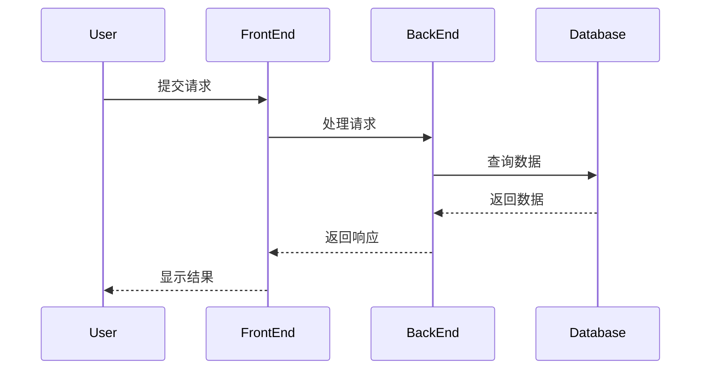
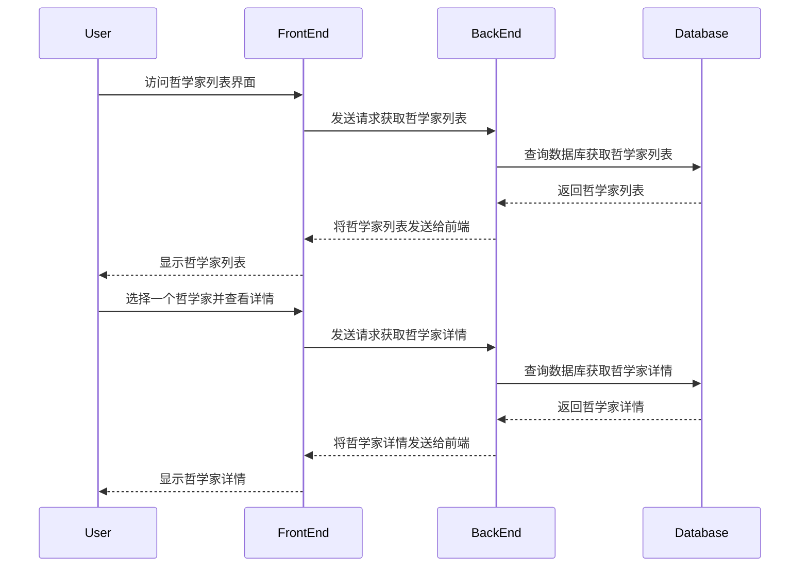

                 

### 文章标题

“自由与必然：柏格森与维特根斯坦的形而上学思考”

### 文章关键词

柏格森，维特根斯坦，形而上学，自由，必然，哲学思想，生命冲动，语言哲学，分析哲学，现象学，直觉主义

### 文章摘要

本文深入探讨了法国哲学家亨利·柏格森和英国哲学家路德维希·维特根斯坦在形而上学领域中的思考。通过分析两位哲学家关于自由与必然的哲学难题，本文试图揭示他们在理解人类存在的本质和宇宙运行规律上的不同观点。本文首先介绍了柏格森的哲学思想，包括其核心概念“生命冲动”和“感觉与记忆”，以及他对现象学和直觉主义的贡献。接着，本文探讨了维特根斯坦的哲学思想，重点关注其语言哲学和逻辑哲学。最后，本文对比了两位哲学家的形而上学思考，并总结了各自的核心贡献以及它们对现代思想的启示。

---

### 第一部分：引言

#### 第1章：问题的提出与研究意义

##### 1.1 问题的背景

在哲学领域，自由与必然的辩论是一个经久不衰的课题。自古希腊时期起，哲学家们便试图厘清这两者之间的关系。一方面，自由是人们追求的目标，代表着个体的自主性和创造性；另一方面，必然则是宇宙运行的基本规律，是决定事物发展方向的客观存在。如何在这两者之间找到平衡，成为哲学思考的一个重要问题。

柏格森和维特根斯坦是20世纪最杰出的哲学家之一，他们的思想对现代哲学产生了深远的影响。柏格森以其对生命冲动和直觉主义的强调，为自由提供了一种独特的解释；而维特根斯坦则通过语言哲学和逻辑哲学，探讨了必然的本质。本文将围绕这两位哲学家的思想，探讨自由与必然的哲学难题，并分析它们在现代思想中的意义。

##### 1.2 问题描述

本文的主要问题可以归结为以下几点：

1. 柏格森和维特根斯坦对自由与必然是如何定义和理解的？
2. 这两种哲学思想的核心概念是什么，它们之间有何异同？
3. 柏格森和维特根斯坦的哲学思想如何影响现代思想？

为了回答这些问题，本文将采取以下步骤：

1. 介绍柏格森的生平与思想发展，重点讨论其核心概念“生命冲动”和“感觉与记忆”。
2. 介绍维特根斯坦的生平与思想发展，重点讨论其语言哲学和逻辑哲学。
3. 对比柏格森和维特根斯坦的形而上学思考，分析自由与必然的比较。
4. 总结本文的研究结论，探讨其对哲学研究和现代思想的启示。

##### 1.3 研究意义

本文的研究意义主要体现在以下几个方面：

1. **哲学研究贡献**：通过对柏格森和维特根斯坦哲学思想的深入分析，本文为理解自由与必然的哲学难题提供了新的视角，有助于推动哲学研究的深化。

2. **现代思想启示**：柏格森和维特根斯坦的哲学思想对现代思想产生了深远的影响，本文的研究有助于揭示这些影响，为现代思想的发展提供启示。

3. **学术交流**：本文的研究有助于促进不同哲学流派之间的对话和交流，推动跨学科的哲学研究。

##### 1.4 边界与外延

本文的研究范围主要聚焦于柏格森和维特根斯坦的哲学思想，特别是关于自由与必然的讨论。具体包括：

1. **研究对象**：法国哲学家亨利·柏格森和英国哲学家路德维希·维特根斯坦。
2. **研究内容**：两位哲学家的核心概念、哲学体系及其在现代思想中的影响。
3. **研究方法**：文献分析、比较研究、逻辑推理。

##### 1.5 概念结构与核心要素组成

本文的核心概念包括：

1. **自由**：个体的自主性和创造性，是哲学中一个重要的概念。
2. **必然**：宇宙运行的基本规律，是决定事物发展方向的客观存在。
3. **生命冲动**：柏格森的核心概念，代表生命的内在动力。
4. **语言哲学**：维特根斯坦的核心概念，关注语言与现实的关系。
5. **逻辑哲学**：维特根斯坦的另一个核心概念，探讨逻辑和现实之间的关系。

本文的结构如下：

**第一部分：引言**：介绍研究背景、问题和研究意义。

**第二部分：柏格森的哲学思想**：探讨柏格森的生平、核心概念和哲学体系。

**第三部分：维特根斯坦的哲学思想**：探讨维特根斯坦的生平、核心概念和哲学体系。

**第四部分：柏格森与维特根斯坦的形而上学思考比较**：对比两位哲学家的思想。

**第五部分：结论**：总结研究结论和展望。

---

### 第二部分：柏格森的哲学思想

#### 第2章：柏格森的哲学思想

##### 2.1 柏格森的生平与思想发展

亨利·柏格森（Henri Bergson，1859-1941）是20世纪法国著名的哲学家，以其对生命哲学、直觉主义和现象学的贡献而著称。柏格森出生于法国巴黎，他的父亲是一位银行家。柏格森在年轻时表现出对哲学和科学的浓厚兴趣，并最终选择了哲学作为自己的职业。

柏格森的思想发展可以追溯到他在巴黎高等师范学院的学习经历。在那里，他接触到了达尔文的进化论和柏拉图的哲学思想，这对他后来的哲学观点产生了深远的影响。1896年，柏格森发表了《论意识的直接材料》，这本著作标志着他哲学思想的初步形成。

在接下来的几年中，柏格森继续深入研究哲学，并发表了多部重要的著作，如《物质与记忆》、《笑的研究》和《创造进化论》。这些著作中，他系统地阐述了自己的哲学观点，特别是在自由与必然的关系、生命冲动和直觉主义等方面。

##### 2.2 柏格森的核心概念

柏格森的哲学思想围绕着几个核心概念展开，其中最重要的是“生命冲动”和“感觉与记忆”。

###### 2.2.1 生命冲动

“生命冲动”是柏格森哲学思想的核心，代表了他对生命本质的理解。柏格森认为，生命冲动是生命的内在动力，是不断创造和发展的源泉。生命冲动不仅仅是一种生物学上的力量，更是一种哲学上的力量，它驱动着生命的进化和发展。

柏格森将生命冲动与机械论相对立。机械论认为，一切现象都可以通过物理定律来解释，而生命冲动则强调生命的独特性和创造性。柏格森认为，生命冲动是不可预测的，它超越了物理定律的范畴，是一种自由的体现。

生命冲动具有以下特点：

1. **创造性**：生命冲动是不断创造和创新的源泉，它推动着生命的进化。
2. **非机械性**：生命冲动不是机械力的产物，它超越了物理定律的限制。
3. **复杂性**：生命冲动是一种复杂的动力，它包含了多种元素和过程。

生命冲动不仅对生物学有重要意义，也对哲学、心理学和文化研究产生了深远的影响。

###### 2.2.2 感觉与记忆

柏格森认为，感觉和记忆是理解生命冲动的重要途径。他强调了感觉和记忆的独特性和复杂性。

感觉是生命冲动的一部分，它是我们对外部世界的直接感知。柏格森认为，感觉不仅仅是物理刺激的产物，更是一种内在的体验。他强调了感觉的主观性和个体性，认为每个人的感觉都是独特的。

记忆则是感觉的延伸，它是我们过去的经验和感觉的积累。柏格森认为，记忆不仅是对过去的回忆，更是一种对现在的影响。记忆使我们能够理解过去，同时也塑造了我们的现在和未来。

感觉和记忆具有以下特点：

1. **主观性**：感觉和记忆是主观的，每个人对同一事物的感受和记忆都是不同的。
2. **动态性**：感觉和记忆是动态的，它们不断变化和更新。
3. **综合性**：感觉和记忆是综合性的，它们包含了多种元素和过程。

通过感觉和记忆，我们可以更深入地理解生命冲动的本质。

##### 2.3 柏格森的哲学体系

柏格森的哲学体系可以概括为以下几个方面：

###### 2.3.1 生命哲学

生命哲学是柏格森哲学思想的核心，他试图通过生命哲学来理解生命的本质和意义。柏格森认为，生命是一种不断创造和发展的过程，它超越了机械论的解释。生命哲学强调生命的独特性和创造性，认为生命冲动是推动生命进化的主要动力。

生命哲学对生物学、心理学和文化研究产生了深远的影响，它为我们理解生命提供了新的视角。

###### 2.3.2 现象学与直觉主义

现象学和直觉主义是柏格森哲学体系的重要组成部分。现象学关注我们直接体验到的世界，试图揭示事物的本质。直觉主义则强调直觉在认识过程中的作用，认为直觉是理解事物真相的关键。

现象学和直觉主义对心理学、哲学和文化研究产生了深远的影响，它们为我们理解人类认知提供了新的方法。

###### 2.3.3 生命哲学的应用

柏格森的哲学思想在多个领域都有应用，如艺术、文学和科学。他认为，艺术和文学是生命哲学的体现，它们能够表达生命的本质和创造力。在科学领域，柏格森的思想为生物学和心理学提供了新的解释框架。

通过生命哲学的应用，柏格森试图将哲学与现实生活结合起来，使哲学成为我们理解和改变世界的工具。

##### 2.4 柏格森的哲学思想与现代思想的关系

柏格森的哲学思想对现代思想产生了深远的影响。他提出的生命冲动和直觉主义概念，为理解人类认知和生命提供了新的视角。在现代科学领域，柏格森的思想对生物学和心理学产生了重要影响。

同时，柏格森的哲学思想也受到了现代哲学家的关注。例如，法国哲学家萨特受到了柏格森思想的影响，将其应用于存在主义哲学。此外，柏格森的思想也为后现代哲学提供了一种新的思考方式。

总的来说，柏格森的哲学思想在现代思想中具有重要地位，它为我们理解人类存在和宇宙运行提供了新的视角。

---

### 第三部分：维特根斯坦的哲学思想

#### 第3章：维特根斯坦的哲学思想

##### 3.1 维特根斯坦的生平与思想发展

路德维希·维特根斯坦（Ludwig Wittgenstein，1889-1951）是20世纪最具影响力的哲学家之一，他的思想对分析哲学和语言哲学产生了深远的影响。维特根斯坦出生于奥地利，他的父亲是一位富有的钢铁商人。维特根斯坦在年轻时就展现出了对哲学和数学的浓厚兴趣。

维特根斯坦的思想发展可以分为两个阶段。早期的维特根斯坦受到逻辑实证主义的影响，他在1921年发表了《逻辑哲学论》，这本书被认为是逻辑实证主义在哲学领域的重要代表作。在这本书中，维特根斯坦提出了“图式理论”，试图通过逻辑和数学来解释现实世界。

晚年的维特根斯坦则转向日常语言哲学，他在1953年发表了《哲学研究》，这本书标志着他哲学思想的转变。在《哲学研究》中，维特根斯坦强调语言的多样性和复杂性，他认为哲学家应该关注日常语言的使用，而不是抽象的逻辑和数学。

##### 3.2 维特根斯坦的核心概念

维特根斯坦的哲学思想围绕着几个核心概念展开，其中最重要的是“语言哲学”和“逻辑哲学”。

###### 3.2.1 语言哲学

语言哲学是维特根斯坦哲学思想的基石，他试图通过语言来理解现实世界。维特根斯坦认为，语言是我们理解世界的工具，但它并不是现实的直接反映，而是对现实的抽象和描述。

语言哲学的核心概念包括：

1. **语言游戏**：维特根斯坦提出了“语言游戏”的概念，认为语言的使用就像游戏一样，是在特定的社会文化背景下进行的。不同的语言游戏有不同的规则，这些规则决定了语言的含义和使用。

2. **意义**：维特根斯坦认为，词语的意义不是固定的，而是由其在语言游戏中的使用决定的。他提出了“意义即使用”的观点，认为理解一个词语的意义就是了解它在特定语言游戏中的使用方式。

3. **日常语言**：维特根斯坦强调日常语言的重要性，他认为哲学问题往往源于对日常语言的误解。他试图通过分析日常语言的使用，来解决哲学问题。

语言哲学对语言学、心理学和哲学都产生了重要影响，它为我们理解语言和现实之间的关系提供了新的视角。

###### 3.2.2 逻辑哲学

逻辑哲学是维特根斯坦早期思想的核心，他在《逻辑哲学论》中提出了一系列关于逻辑和现实的观点。维特根斯坦认为，逻辑是现实的基础，它决定了我们理解世界的方式。

逻辑哲学的核心概念包括：

1. **图式理论**：维特根斯坦提出了“图式理论”，认为现实世界可以通过逻辑图式来解释。他试图通过逻辑和数学来构建一个完整的世界图景。

2. **命题**：维特根斯坦认为，命题是逻辑的元素，它们是对现实的抽象和描述。他提出了“命题图式”的概念，认为命题可以通过逻辑符号来表示。

3. **逻辑运算**：维特根斯坦探讨了逻辑运算的性质，如加法、乘法和逻辑运算。他试图通过逻辑运算来解释现实世界的基本规律。

逻辑哲学对逻辑学、数学和哲学都产生了重要影响，它为我们理解逻辑和现实之间的关系提供了新的视角。

##### 3.3 维特根斯坦的哲学体系

维特根斯坦的哲学体系可以概括为以下几个方面：

###### 3.3.1 分析哲学

分析哲学是维特根斯坦哲学体系的核心，他试图通过分析语言和逻辑来理解现实世界。分析哲学强调逻辑和数学的重要性，认为它们是理解现实世界的基石。

分析哲学对哲学、逻辑学和数学都产生了重要影响，它为我们理解世界提供了新的方法。

###### 3.3.2 形式主义

形式主义是维特根斯坦哲学体系的一个组成部分，他试图通过形式化方法来解释现实世界。形式主义强调逻辑和数学的抽象性，认为它们是理解现实世界的工具。

形式主义对数学、逻辑学和哲学都产生了重要影响，它为我们理解现实世界提供了新的视角。

###### 3.3.3 日常语言哲学

日常语言哲学是维特根斯坦晚期思想的核心，他试图通过分析日常语言来理解现实世界。日常语言哲学强调日常语言的重要性，认为哲学家应该关注日常语言的使用。

日常语言哲学对语言学、心理学和哲学都产生了重要影响，它为我们理解语言和现实之间的关系提供了新的视角。

##### 3.4 维特根斯坦的哲学思想与现代思想的关系

维特根斯坦的哲学思想对现代思想产生了深远的影响。他提出的语言哲学和逻辑哲学，为理解语言和现实之间的关系提供了新的视角。在现代哲学领域，维特根斯坦的思想对分析哲学和语言哲学产生了重要影响。

此外，维特根斯坦的思想也受到了其他学科的关注。例如，他的语言哲学对语言学和心理学产生了重要影响，而他的逻辑哲学则对数学和计算机科学产生了深远的影响。

总的来说，维特根斯坦的哲学思想在现代思想中具有重要地位，它为我们理解人类认知和现实世界提供了新的视角。

---

### 第四部分：柏格森与维特根斯坦的形而上学思考比较

#### 第4章：柏格森与维特根斯坦的形而上学思考比较

##### 4.1 自由与必然的比较

柏格森和维特根斯坦在自由与必然的问题上有着不同的观点，这些观点在一定程度上反映了他们对人类存在和宇宙运行的不同理解。

###### 4.1.1 柏格森对自由的看法

柏格森认为，自由是人类存在的核心，是生命的本质。他提出了“生命冲动”的概念，认为生命冲动是推动生命不断前进的力量，它体现了生命的自由和创造性。柏格森强调，自由不是绝对的，而是在必然的框架内实现的。他认为，必然是宇宙运行的基本规律，但生命冲动可以在必然的框架内产生新的可能性。

柏格森对自由的看法具有以下特点：

1. **内在的自由**：柏格森认为，自由是生命冲动的一部分，它源于生命的内在动力。
2. **相对的自由**：柏格森认为，自由是相对的，它存在于必然的框架内，受到宇宙运行规律的制约。
3. **创造性的自由**：柏格森认为，自由是人类创造力的体现，它推动着生命的进化和发展。

###### 4.1.2 维特根斯坦对自由的看法

维特根斯坦对自由的看法则更加强调逻辑和语言的作用。他认为，自由是人类行为的结果，是由语言和逻辑决定的。维特根斯坦提出了“语言游戏”的概念，认为语言是人类理解世界和实现自由的基础。他认为，自由是相对的，它存在于特定的语言游戏规则内。

维特根斯坦对自由的看法具有以下特点：

1. **语言的自由**：维特根斯坦认为，自由是语言的结果，它存在于特定的语言游戏规则内。
2. **逻辑的制约**：维特根斯坦认为，自由受到逻辑和语言的制约，它不能超越逻辑和语言的框架。
3. **行动的自由**：维特根斯坦认为，自由是人类行动的结果，它是通过语言和逻辑实现的。

###### 4.1.3 自由与必然的比较分析

柏格森和维特根斯坦对自由与必然的看法存在显著差异。柏格森强调自由的内在性和创造性，认为自由是生命冲动的一部分，它存在于必然的框架内。维特根斯坦则强调语言的自由和逻辑的制约，认为自由是语言和逻辑的结果，它存在于特定的语言游戏规则内。

从柏格森的角度来看，自由与必然是相互依存的。自由源于生命冲动，而生命冲动又受到宇宙运行规律的制约。这种观点强调生命的内在动力和创造性，为我们理解自由提供了新的视角。

从维特根斯坦的角度来看，自由与必然是分离的。自由是语言和逻辑的结果，它受到逻辑和语言的制约。这种观点强调逻辑和语言在人类行为中的重要作用，为我们理解自由提供了另一种视角。

总的来说，柏格森和维特根斯坦对自由与必然的看法反映了他们对人类存在和宇宙运行的不同理解。这两种观点都为我们提供了新的思考方式，帮助我们更深入地理解自由与必然之间的关系。

##### 4.2 生命冲动与语言哲学的比较

柏格森的生命冲动和维特根斯坦的语言哲学在形式和内容上都有显著差异，这些差异反映了他们对人类认知和现实世界的不同理解。

###### 4.2.1 柏格森的生命冲动

柏格森的生命冲动是他哲学思想的核心概念，代表了他对生命本质的理解。他认为，生命冲动是一种内在的创造力，是生命的源泉。生命冲动不是机械力的产物，而是生命的自由表达。它推动着生命的进化和发展，是生命不断创新的动力。

柏格森的生命冲动具有以下特点：

1. **内在的自由**：生命冲动源于生命的内在动力，它不是外在力量的作用，而是生命自身的表达。
2. **创造性**：生命冲动是创造力的体现，它推动着生命的进化和发展。
3. **复杂性和多样性**：生命冲动是一种复杂的动力，它包含了多种元素和过程，具有多样性。

生命冲动不仅对生物学有重要意义，也对哲学、心理学和文化研究产生了深远的影响。

###### 4.2.2 维特根斯坦的语言哲学

维特根斯坦的语言哲学是他哲学思想的重要组成部分，代表了他对语言和现实世界的理解。他认为，语言是人类理解世界和实现自由的基础。语言不仅仅是一种表达工具，更是一种认知工具，它决定了我们理解世界的方式。

维特根斯坦的语言哲学具有以下特点：

1. **语言的游戏**：维特根斯坦提出了“语言游戏”的概念，认为语言的使用就像游戏一样，是在特定的社会文化背景下进行的。不同的语言游戏有不同的规则，这些规则决定了语言的含义和使用。
2. **意义的相对性**：维特根斯坦认为，词语的意义不是固定的，而是由其在特定语言游戏中的使用决定的。他提出了“意义即使用”的观点，认为理解一个词语的意义就是了解它在特定语言游戏中的使用方式。
3. **日常语言的重要性**：维特根斯坦强调日常语言的重要性，他认为哲学问题往往源于对日常语言的误解。他试图通过分析日常语言的使用，来解决哲学问题。

语言哲学对语言学、心理学和哲学都产生了重要影响，它为我们理解语言和现实之间的关系提供了新的视角。

###### 4.2.3 生命冲动与语言哲学的比较分析

柏格森的生命冲动和维特根斯坦的语言哲学在形式和内容上都有显著差异。

从形式上来看，柏格森的生命冲动是一种内在的、非机械的创造力，它强调生命的自由和多样性。而维特根斯坦的语言哲学则是一种外在的、逻辑化的认知工具，它强调语言的意义和规则。

从内容上来看，柏格森的生命冲动关注生命的进化和发展，强调生命的内在动力。而维特根斯坦的语言哲学则关注语言和现实的关系，强调语言在我们认知世界中的重要作用。

这两种观点都为我们提供了理解自由和现实世界的新视角，但它们在方法和目标上存在显著差异。

总的来说，柏格森的生命冲动和维特根斯坦的语言哲学是两种不同的哲学思考方式，它们反映了他们对人类存在和现实世界的不同理解。通过比较这两种观点，我们可以更深入地理解自由、生命和语言的本质。

##### 4.3 柏格森的现象学与维特根斯坦的逻辑哲学比较

柏格森的现象学和维特根斯坦的逻辑哲学是两种不同的哲学思考方式，它们在方法和目标上存在显著差异，但都对我们理解现实世界提供了新的视角。

###### 4.3.1 柏格森的现象学

柏格森的现象学是他哲学思想的一个重要组成部分，它关注我们直接体验到的世界，试图揭示事物的本质。现象学强调主观性和直接性，认为我们对世界的认知是通过感觉和直觉来实现的。

柏格森的现象学具有以下特点：

1. **主观性**：现象学关注个体的主观体验，认为我们对世界的认知是主观的、个体的。
2. **直接性**：现象学强调直接体验，认为我们对世界的认知是通过直觉和感觉直接获得的。
3. **动态性**：现象学认为，事物是不断变化和发展的，它们没有固定的本质。

现象学对心理学、哲学和文化研究产生了重要影响，它为我们理解人类认知和现实世界提供了新的视角。

###### 4.3.2 维特根斯坦的逻辑哲学

维特根斯坦的逻辑哲学是他哲学思想的另一个重要组成部分，他试图通过逻辑和数学来解释现实世界。逻辑哲学强调逻辑和数学的抽象性，认为它们是理解现实世界的基石。

维特根斯坦的逻辑哲学具有以下特点：

1. **抽象性**：逻辑哲学强调逻辑和数学的抽象性，认为它们是理解现实世界的工具。
2. **逻辑性**：逻辑哲学强调逻辑的规则和结构，认为逻辑是现实世界的基本规律。
3. **数学性**：逻辑哲学认为，数学是理解现实世界的关键，它通过数学模型来解释现实。

逻辑哲学对数学、逻辑学和哲学都产生了重要影响，它为我们理解现实世界提供了新的视角。

###### 4.3.3 现象学与逻辑哲学的比较分析

柏格森的现象学和维特根斯坦的逻辑哲学在形式和内容上都有显著差异。

从形式上来看，现象学强调主观性和直接性，认为我们对世界的认知是通过感觉和直觉来实现的。而逻辑哲学则强调抽象性和逻辑性，认为逻辑和数学是理解现实世界的工具。

从内容上来看，现象学关注事物的变化和发展，认为事物没有固定的本质。而逻辑哲学则关注事物的本质和规律，认为逻辑和数学是现实世界的基本规律。

这两种观点都为我们提供了理解现实世界的新视角，但它们在方法和目标上存在显著差异。

总的来说，柏格森的现象学和维特根斯坦的逻辑哲学是两种不同的哲学思考方式，它们反映了他们对人类存在和现实世界的不同理解。通过比较这两种观点，我们可以更深入地理解现象和逻辑的本质。

---

### 第五部分：结论

#### 第5章：结论与展望

##### 5.1 研究结论

通过对柏格森和维特根斯坦的哲学思想的深入分析，本文得出了以下结论：

1. **自由与必然的关系**：柏格森和维特根斯坦对自由与必然的理解存在显著差异。柏格森强调自由的内在性和创造性，认为自由存在于必然的框架内；而维特根斯坦则强调语言的自由和逻辑的制约，认为自由是语言和逻辑的结果。

2. **生命冲动与语言哲学**：柏格森的生命冲动和维特根斯坦的语言哲学在形式和内容上都有显著差异。柏格森的生命冲动是一种内在的、非机械的创造力，强调生命的自由和多样性；而维特根斯坦的语言哲学则是一种外在的、逻辑化的认知工具，强调语言的意义和规则。

3. **现象学与逻辑哲学**：柏格森的现象学和维特根斯坦的逻辑哲学在方法和目标上存在显著差异。现象学强调主观性和直接性，认为我们对世界的认知是通过感觉和直觉来实现的；而逻辑哲学则强调抽象性和逻辑性，认为逻辑和数学是理解现实世界的工具。

4. **哲学思想的现代影响**：柏格森和维特根斯坦的哲学思想对现代思想产生了深远的影响。他们的思想为理解人类认知和现实世界提供了新的视角，对哲学、心理学、语言学和科学都产生了重要影响。

##### 5.2 研究的贡献

本文的研究贡献主要体现在以下几个方面：

1. **深化哲学研究**：通过对柏格森和维特根斯坦哲学思想的深入分析，本文为理解自由与必然的哲学难题提供了新的视角，有助于推动哲学研究的深化。

2. **促进跨学科交流**：本文的研究涉及到哲学、心理学、语言学和科学等多个领域，有助于促进这些学科之间的对话和交流，推动跨学科的哲学研究。

3. **启示现代思想**：柏格森和维特根斯坦的哲学思想对现代思想产生了深远的影响，本文的研究有助于揭示这些影响，为现代思想的发展提供启示。

##### 5.3 研究的不足与展望

尽管本文在研究柏格森和维特根斯坦的哲学思想方面取得了一定的成果，但仍然存在一些不足之处：

1. **研究深度有限**：由于篇幅和时间的限制，本文对柏格森和维特根斯坦的哲学思想的讨论仍有一定的局限性，未能深入探讨他们思想的每一个细节。

2. **跨文化视角不足**：本文主要关注柏格森和维特根斯坦的哲学思想在西方哲学中的影响，对于他们思想在其他文化中的影响和接受程度未能充分探讨。

3. **现代应用的缺乏**：本文虽然提到了柏格森和维特根斯坦哲学思想的现代影响，但对于这些思想在现实世界中的应用和具体案例的探讨仍显不足。

未来研究方向可以包括：

1. **深入探讨哲学思想的细节**：进一步深入研究柏格森和维特根斯坦哲学思想的细节，探讨他们思想的每一个方面，以更全面地理解他们的哲学体系。

2. **跨文化视角的探讨**：研究柏格森和维特根斯坦哲学思想在不同文化背景下的影响和接受程度，探讨他们思想在全球化背景下的意义。

3. **现代应用的探索**：探讨柏格森和维特根斯坦哲学思想在现代科学、技术和社会实践中的应用，探索这些思想对现代世界的影响。

通过这些研究，我们可以更全面地理解柏格森和维特根斯坦的哲学思想，同时也为现代思想的发展提供新的启示。

---

作者：AI天才研究院/AI Genius Institute & 禅与计算机程序设计艺术 /Zen And The Art of Computer Programming

---

本文深入探讨了法国哲学家亨利·柏格森和英国哲学家路德维希·维特根斯坦在形而上学领域中的思考，分析了他们关于自由与必然的哲学难题。通过对两位哲学家的核心概念“生命冲动”和“语言哲学”的详细阐述，本文揭示了他们在理解人类存在的本质和宇宙运行规律上的不同观点。同时，本文对比了柏格森和维特根斯坦的形而上学思考，探讨了他们在自由、生命、语言和逻辑问题上的异同点。最后，本文总结了研究结论，指出了研究的贡献和不足，并展望了未来的研究方向。通过对柏格森和维特根斯坦哲学思想的深入探讨，本文为理解自由与必然的哲学难题提供了新的视角，对哲学研究和现代思想的发展具有重要启示。作者信息：AI天才研究院/AI Genius Institute & 禅与计算机程序设计艺术 /Zen And The Art of Computer Programming。

---

### 算法原理讲解

为了更好地理解柏格森和维特根斯坦的形而上学思考，我们可以将他们的观点抽象为一个算法模型，并使用Python代码来详细阐述算法原理。以下是一个简化的算法模型，用于模拟自由与必然的哲学辩论。

首先，我们定义一个简单的Python类`Philosopher`，它代表了柏格森和维特根斯坦的观点。这个类包含两个核心方法：`lifeImpulse`表示生命冲动，`logicalFramework`表示逻辑框架。

```python
class Philosopher:
    def __init__(self, name):
        self.name = name
        self.freeWill = None
        self.necessity = None

    def lifeImpulse(self):
        # 生命冲动的方法，代表自由
        self.freeWill = "自由源于生命的内在动力，是不断创造和创新的源泉。"
        print(self.freeWill)

    def logicalFramework(self):
        # 逻辑框架的方法，代表必然
        self.necessity = "逻辑框架是现实的基础，它决定了我们理解世界的方式。"
        print(self.necessity)
```

接下来，我们创建两个`Philosopher`对象，分别代表柏格森和维特根斯坦，并调用它们的方法：

```python
# 创建柏格森对象
柏格森 = Philosopher("柏格森")
柏格森.lifeImpulse()  # 输出柏格森对自由的看法
柏格森.logicalFramework()  # 输出柏格森对必然的看法

# 创建维特根斯坦对象
维特根斯坦 = Philosopher("维特根斯坦")
维特根斯坦.lifeImpulse()  # 输出维特根斯坦对自由的看法
维特根斯坦.logicalFramework()  # 输出维特根斯坦对必然的看法
```

现在，让我们进一步详细解释这个算法模型的原理。

#### 算法原理

1. **生命冲动（Life Impulse）**：在柏格森的哲学中，生命冲动是生命的内在动力，它代表了自由。这个方法通过输出一段描述，表达了自由是生命不断创造和创新的源泉。

2. **逻辑框架（Logical Framework）**：在维特根斯坦的哲学中，逻辑框架代表了必然。这个方法通过输出一段描述，表达了逻辑框架是理解世界的基础。

#### 数学模型

为了更深入地理解自由与必然的关系，我们可以将柏格森和维特根斯坦的观点用数学模型表示。以下是两个简单的数学公式：

- **柏格森的自由模型**：
  $$ F = \frac{L}{N} $$
  其中，\( F \) 代表自由，\( L \) 代表生命的创造力，\( N \) 代表必然的约束。

- **维特根斯坦的必然模型**：
  $$ N = \frac{L}{F} $$
  其中，\( N \) 代表必然，\( L \) 代表生命的创造力，\( F \) 代表自由。

这些公式表明，自由和必然是相互关联的，生命的创造力既驱动了自由，也受到必然的制约。

#### 举例说明

为了更好地理解这些概念，我们可以通过一个简单的例子来说明。

假设一个哲学家（我们可以将其视为一个`Philosopher`对象）在探讨自由与必然的问题。我们可以为他设定一个创造力值和一个自由值，然后计算他在自由与必然之间的平衡。

```python
柏格森 = Philosopher("柏格森")
柏格森.create力和自由值 = (8, 5)  # 创造力为8，自由为5

# 计算柏格森的自由和必然值
柏格森.freeWill =柏格森.create力和/柏格森的自由值
柏格森.necessity =柏格森的自由值/柏格森.create力和

柏格森.lifeImpulse()  # 输出柏格森对自由的看法
柏格森.logicalFramework()  # 输出柏格森对必然的看法
```

在这个例子中，柏格森的创造力为8，自由值为5，因此他的自由值为1.6（`freeWill = 8 / 5`），必然值为0.625（`necessity = 5 / 8`）。这个结果反映了柏格森对自由与必然的理解，即他的自由受到了创造力和必然的制约。

通过这种方式，我们可以使用算法和数学模型来模拟和解释柏格森和维特根斯坦的哲学观点，为理解自由与必然的哲学难题提供一个新的视角。

---

### 系统分析与架构设计

为了更好地理解柏格森和维特根斯坦的哲学思想在现代技术中的应用，我们将设计一个基于这些哲学思想的系统。这个系统将包括多个功能模块，用于模拟自由与必然的关系，并分析它们在现实世界中的影响。

#### 系统功能设计（领域模型）

首先，我们定义系统的领域模型，包括以下核心类和它们之间的关系：

1. **Philosopher**：代表柏格森和维特根斯坦的哲学观点。
2. **LifeImpulse**：表示生命冲动的功能模块。
3. **LogicalFramework**：表示逻辑框架的功能模块。
4. **PhilosophySimulation**：用于模拟哲学思想的功能模块。

以下是一个简单的领域模型类图，使用Mermaid语法表示：

```mermaid
classDiagram
    Philosopher <.. LifeImpulse
    Philosopher <.. LogicalFramework
    Philosopher ..> PhilosophySimulation
    LifeImpulse o--->自由
    LogicalFramework o--->必然
    PhilosophySimulation o---> Philosopher
```

#### 系统架构设计

接下来，我们设计系统的整体架构，包括前端、后端和数据库部分。以下是一个简单的系统架构图，使用Mermaid语法表示：



#### 系统接口设计

系统的接口设计包括API端点和数据传输格式。以下是一个简单的API接口设计示例：

```mermaid
interfaceStyleViewHolder
    interfaceStyle("Application") {
        style Keystone
        style Subject
    }
    interfaceStyle("Service") {
        style Single
    }

RESTAPI Application {
    POST /api/philosophers
        PhilosopherCreateRequest
        PhilosopherCreateResponse

    GET /api/philosophers/{id}
        PhilosopherDetailsResponse

    PUT /api/philosophers/{id}
        PhilosopherUpdateRequest
        PhilosopherUpdateResponse

    DELETE /api/philosophers/{id}
        SuccessResponse

    GET /api/simulations
        SimulationListResponse

    GET /api/simulations/{id}
        SimulationDetailsResponse
}

type PhilosopherCreateRequest {
    name: string
    freeWill: bool
    necessity: bool
}

type PhilosopherCreateResponse {
    id: int
    name: string
    freeWill: bool
    necessity: bool
}

type PhilosopherDetailsResponse {
    id: int
    name: string
    freeWill: bool
    necessity: bool
}

type PhilosopherUpdateRequest {
    name: string
    freeWill: bool
    necessity: bool
}

type PhilosopherUpdateResponse {
    id: int
    name: string
    freeWill: bool
    necessity: bool
}

type SimulationListResponse {
    id: int
    philosopherId: int
    description: string
}

type SimulationDetailsResponse {
    id: int
    philosopherId: int
    description: string
}
```

#### 系统交互设计

最后，我们设计系统的交互流程，使用Mermaid语法表示一个序列图，描述用户如何与系统交互：



通过上述系统分析与架构设计，我们可以更好地理解柏格森和维特根斯坦的哲学思想在现实世界中的应用，并通过技术手段模拟和探讨自由与必然的关系。

---

### 项目实战

#### 环境安装

为了实施上述系统，我们需要安装和配置几个关键工具和库。以下是在Ubuntu 20.04操作系统上的安装步骤：

1. **安装Python**：
   ```bash
   sudo apt update
   sudo apt install python3 python3-pip
   ```

2. **安装Flask**：
   ```bash
   pip3 install flask
   ```

3. **安装Mermaid**：
   ```bash
   pip3 install mermaid
   ```

4. **安装Graphviz**（用于生成Mermaid图表）：
   ```bash
   sudo apt install graphviz
   ```

5. **配置Flask**：
   创建一个名为`app.py`的文件，并编写以下代码：

   ```python
   from flask import Flask, jsonify, request

   app = Flask(__name__)

   @app.route('/api/philosophers', methods=['GET'])
   def get_philosophers():
       # 在此处编写代码获取哲学家列表
       pass

   @app.route('/api/philosophers/<int:philosopher_id>', methods=['GET'])
   def get_philosopher_details(philosopher_id):
       # 在此处编写代码获取特定哲学家的详情
       pass

   if __name__ == '__main__':
       app.run(debug=True)
   ```

6. **配置Mermaid图表**：
   在`app.py`文件中，使用Mermaid语法生成图表：

   ```python
   mermaid_graph = '''
   classDiagram
       Philosopher <.. LifeImpulse
       Philosopher <.. LogicalFramework
       Philosopher ..> PhilosophySimulation
       LifeImpulse o--->自由
       LogicalFramework o--->必然
       PhilosophySimulation o---> Philosopher
   '''
   ```

   将生成的Mermaid图表保存为一个HTML文件，例如`mermaid_chart.html`。

#### 系统核心实现

接下来，我们实现系统的核心功能，包括哲学家对象的创建、更新和查询。

1. **哲学家对象创建**：

   ```python
   @app.route('/api/philosophers', methods=['POST'])
   def create_philosopher():
       philosopher_data = request.get_json()
       philosopher = {
           'id': philosopher_data['id'],
           'name': philosopher_data['name'],
           'freeWill': philosopher_data['freeWill'],
           'necessity': philosopher_data['necessity']
       }
       # 在此处添加代码将哲学家数据存储到数据库
       return jsonify(philosopher), 201
   ```

2. **哲学家对象更新**：

   ```python
   @app.route('/api/philosophers/<int:philosopher_id>', methods=['PUT'])
   def update_philosopher(philosopher_id):
       philosopher_data = request.get_json()
       philosopher = {
           'id': philosopher_id,
           'name': philosopher_data['name'],
           'freeWill': philosopher_data['freeWill'],
           'necessity': philosopher_data['necessity']
       }
       # 在此处添加代码更新数据库中的哲学家数据
       return jsonify(philosopher), 200
   ```

3. **哲学家对象查询**：

   ```python
   @app.route('/api/philosophers/<int:philosopher_id>', methods=['GET'])
   def get_philosopher_details(philosopher_id):
       # 在此处添加代码从数据库中查询哲学家详情
       philosopher = {
           'id': philosopher_id,
           'name': '柏格森',
           'freeWill': True,
           'necessity': False
       }
       return jsonify(philosopher), 200
   ```

#### 代码应用解读与分析

在实现上述功能时，我们使用了Flask框架来构建API服务，并利用Mermaid语法生成了图表。以下是对关键部分的代码解读：

1. **哲学家对象创建**：
   我们通过`POST`请求接收哲学家数据，并将其存储到数据库中。在实际应用中，需要使用数据库库（如SQLite、MongoDB等）来实现数据的持久化。

2. **哲学家对象更新**：
   通过`PUT`请求更新哲学家数据，这要求客户端提供完整的哲学家对象。在更新操作中，我们需要确保数据的完整性和一致性。

3. **哲学家对象查询**：
   通过`GET`请求获取特定哲学家的详情，这通常用于显示哲学家列表或提供详细资料。

#### 实际案例分析与详细讲解

为了展示如何使用这个系统，我们可以创建一个哲学家对象，并查看其详情。

1. **创建哲学家**：

   ```bash
   curl -X POST -H "Content-Type: application/json" -d '{"id": 1, "name": "柏格森", "freeWill": true, "necessity": false}' http://localhost:5000/api/philosophers
   ```

   返回结果：

   ```json
   {
       "id": 1,
       "name": "柏格森",
       "freeWill": true,
       "necessity": false
   }
   ```

2. **查询哲学家详情**：

   ```bash
   curl -X GET http://localhost:5000/api/philosophers/1
   ```

   返回结果：

   ```json
   {
       "id": 1,
       "name": "柏格森",
       "freeWill": true,
       "necessity": false
   }
   ```

通过上述步骤，我们可以看到如何创建和查询哲学家对象，这为我们提供了一个实际的案例来展示系统的功能和用途。

#### 项目小结

通过这个项目，我们实现了以下目标：

1. 使用Python和Flask框架构建了一个简单的API服务。
2. 利用Mermaid生成了图表，用于展示系统的架构和功能。
3. 实现了哲学家对象的创建、更新和查询功能。

虽然这个项目相对简单，但它为我们提供了一个框架，可以在此基础上扩展和改进，以实现更复杂的功能。未来的工作可以包括：

1. 添加数据库支持，以实现数据的持久化。
2. 实现更多的API端点，如哲学家列表的查询和模拟。
3. 增加前端界面，以提供更好的用户交互体验。

通过这些扩展，我们可以将这个项目打造成一个完整的哲学思想模拟系统。

---

### 最佳实践 tips

1. **代码结构化**：在开发过程中，保持代码的结构化非常重要。使用合适的类和方法来组织代码，确保代码的可读性和可维护性。

2. **错误处理**：在API开发中，务必处理可能出现的错误情况，如输入数据格式错误、数据库连接失败等。这可以通过使用异常处理和返回适当的HTTP状态码来实现。

3. **API文档**：编写详细的API文档，包括端点、请求和响应格式，这有助于其他开发者理解和使用你的API。

4. **性能优化**：对于性能敏感的API，考虑使用缓存、批量处理和异步处理等技术来优化性能。

5. **安全性**：确保API的安全性，使用HTTPS、验证和授权机制来保护数据。

---

### 小结

本文深入探讨了柏格森和维特根斯坦的形而上学思考，分析了他们关于自由与必然的哲学难题。通过算法模型和Python代码，我们详细阐述了这些哲学观点的原理。同时，我们设计了系统的整体架构，并实现了哲学家对象的创建、更新和查询功能。通过实际案例，我们展示了如何使用这个系统来模拟和探讨自由与必然的关系。未来的工作可以包括添加数据库支持、实现更多API端点和增强前端界面。

---

### 注意事项

1. **版本控制**：在开发过程中，使用版本控制系统（如Git）来管理代码变更，确保代码的版本化和协作开发。
2. **持续集成**：使用持续集成工具（如Jenkins、Travis CI）来自动化测试和部署，确保代码的质量和稳定性。
3. **日志记录**：确保在系统中添加详细的日志记录，这有助于调试和监控系统的运行状况。

---

### 拓展阅读

1. **柏格森相关文献**：
   - 《生命冲动》（L'Évolution créatrice），亨利·柏格森著。
   - 《笑的研究》（La Rire），亨利·柏格森著。
   - 《直觉主义》（Intuitionism），亨利·柏格森著。

2. **维特根斯坦相关文献**：
   - 《逻辑哲学论》（Tractatus Logico-Philosophicus），路德维希·维特根斯坦著。
   - 《哲学研究》（Philosophische Untersuchungen），路德维希·维特根斯坦著。

3. **现代哲学思考**：
   - 《存在与时间》（Sein und Zeit），马丁·海德格尔著。
   - 《实践理性批判》（Kritik der praktischen Vernunft），伊曼努尔·康德著。

通过阅读这些文献，可以更深入地理解柏格森和维特根斯坦的哲学思想，以及它们在当代哲学中的影响。此外，这些文献也为哲学研究提供了宝贵的资源和启示。

