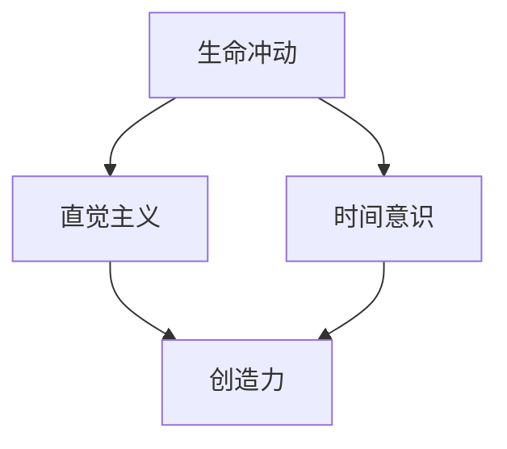
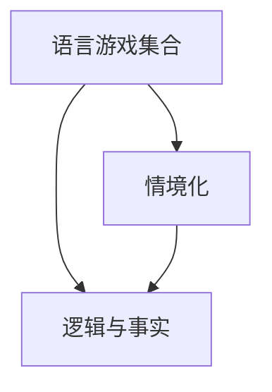
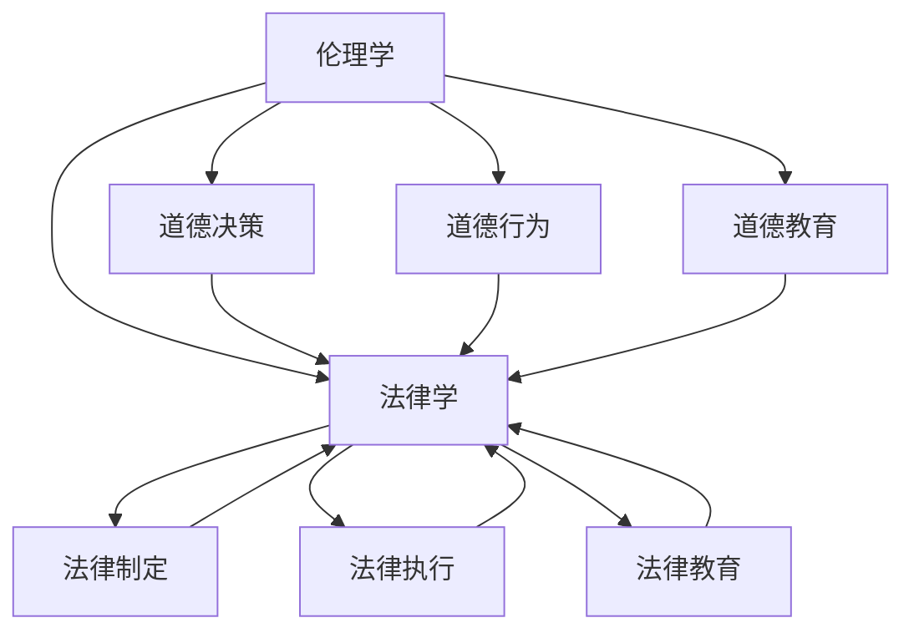
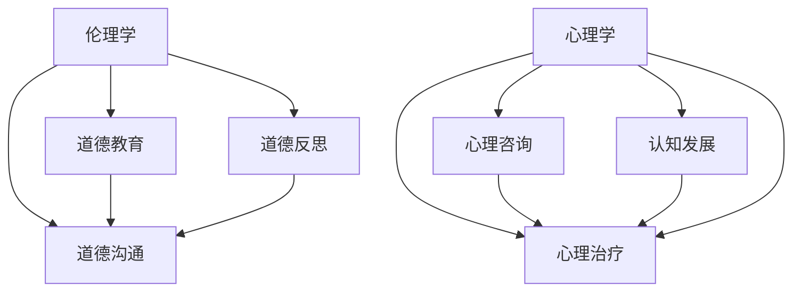

                 

## 自由意志与规则遵循：柏格森与维特根斯坦的道德哲学

自由意志与规则遵循是哲学和伦理学中两个核心概念，它们不仅在传统哲学讨论中占据重要位置，也与现代技术、人工智能等领域密切相关。本文将以柏格森（Henri Bergson）和维特根斯坦（Ludwig Wittgenstein）的道德哲学为基础，深入探讨这两个概念，并分析它们在现代技术领域的应用。

### 关键词

- **自由意志**
- **规则遵循**
- **柏格森道德哲学**
- **维特根斯坦道德哲学**
- **人工智能**
- **伦理学**

### 摘要

本文首先介绍自由意志和规则遵循的基本概念及其哲学意义，接着回顾它们的历史背景。随后，分别阐述柏格森和维特根斯坦的道德哲学，包括核心概念、数学模型和Python源代码实现。通过具体的系统分析和架构设计，本文进一步探讨柏格森和维特根斯坦道德哲学在现实中的应用。最后，通过项目实战和最佳实践，总结全书的主要观点，并对未来研究方向进行展望。

### 目录大纲设计思路

为了确保文章的完整性和逻辑性，本文将按照以下结构进行设计：

1. **第一部分：自由意志与规则遵循的背景介绍**
   - **第1章：自由意志与规则遵循的基本概念**
   - **第2章：自由意志与规则遵循的历史回顾**

2. **第二部分：柏格森的道德哲学**
   - **第3章：柏格森的核心概念与理论**
   - **第4章：柏格森理论的数学模型与公式**

3. **第三部分：维特根斯坦的道德哲学**
   - **第5章：维特根斯坦的核心概念与理论**
   - **第6章：维特根斯坦理论的数学模型与公式**

4. **第四部分：柏格森与维特根斯坦道德哲学的系统分析**
   - **第7章：柏格森道德哲学在现实中的应用**
   - **第8章：维特根斯坦道德哲学在现实中的应用**

5. **第五部分：项目实战**
   - **第9章：柏格森与维特根斯坦道德哲学在项目中的应用**
   - **第10章：具体项目实施与案例分析**

6. **第六部分：最佳实践、小结与展望**
   - **第11章：最佳实践与注意事项**
   - **第12章：小结与未来展望**

### 目录大纲

**第一部分：自由意志与规则遵循的背景介绍**

### 第1章：自由意志与规则遵循的基本概念
- **1.1 自由意志的概念解析**
- **1.2 规则遵循的哲学意义**
- **1.3 柏格森与维特根斯坦的哲学背景**

### 第2章：自由意志与规则遵循的历史回顾
- **2.1 古代哲学对自由意志的探讨**
- **2.2 中世纪哲学对规则遵循的解读**
- **2.3 现代哲学对自由意志与规则遵循的深化**

**第二部分：柏格森的道德哲学**

### 第3章：柏格森的核心概念与理论
- **3.1 柏格森哲学的总体框架**
- **3.2 柏格森对自由意志的理解**
- **3.3 柏格森对规则遵循的阐释**

### 第4章：柏格森理论的数学模型与公式
- **4.1 柏格森理论的核心公式**
- **4.2 柏格森理论的mermaid流程图**
- **4.3 柏格森理论的Python源代码实现**

**第三部分：维特根斯坦的道德哲学**

### 第5章：维特根斯坦的核心概念与理论
- **5.1 维特根斯坦哲学的总体框架**
- **5.2 维特根斯坦对自由意志的探讨**
- **5.3 维特根斯坦对规则遵循的见解**

### 第6章：维特根斯坦理论的数学模型与公式
- **6.1 维特根斯坦理论的核心公式**
- **6.2 维特根斯坦理论的mermaid流程图**
- **6.3 维特根斯坦理论的Python源代码实现**

**第四部分：柏格森与维特根斯坦道德哲学的系统分析**

### 第7章：柏格森道德哲学在现实中的应用
- **7.1 柏格森理论在伦理学中的应用**
- **7.2 柏格森理论在法律学中的应用**
- **7.3 柏格森理论的mermaid架构图**

### 第8章：维特根斯坦道德哲学在现实中的应用
- **8.1 维特根斯坦理论在伦理学中的应用**
- **8.2 维特根斯坦理论在心理学中的应用**
- **8.3 维特根斯坦理论的mermaid架构图**

**第五部分：项目实战**

### 第9章：柏格森与维特根斯坦道德哲学在项目中的应用
- **9.1 项目背景介绍**
- **9.2 系统功能设计**
- **9.3 系统架构设计**
- **9.4 系统接口设计**
- **9.5 系统交互设计**

### 第10章：具体项目实施与案例分析
- **10.1 环境安装**
- **10.2 核心实现源代码**
- **10.3 代码应用解读与分析**
- **10.4 实际案例分析**
- **10.5 项目小结**

**第六部分：最佳实践、小结与展望**

### 第11章：最佳实践与注意事项
- **11.1 道德哲学在实践中的最佳策略**
- **11.2 避免实践中的常见错误**
- **11.3 注意事项**

### 第12章：小结与未来展望
- **12.1 全书主要观点回顾**
- **12.2 道德哲学的挑战与机遇**
- **12.3 未来研究方向**

### 总字数

本文预计总字数在 10000-12000 字之间，通过详细的章节内容和深入的分析，旨在为读者提供一个全面、系统的理解自由意志与规则遵循，以及柏格森与维特根斯坦道德哲学的应用。

---

**第一部分：自由意志与规则遵循的背景介绍**

### 第1章：自由意志与规则遵循的基本概念

#### 1.1 自由意志的概念解析

自由意志是指个体在行为决策过程中，不受外部强制影响，能够自主选择并承担后果的能力。这一概念在哲学、伦理学、心理学等领域中具有重要意义，特别是在探讨人类行为动机和道德责任时。

自由意志可以分为两种：外在自由意志和内在自由意志。外在自由意志指的是个体在不受外部力量约束的情况下做出选择的能力，而内在自由意志则强调个体内心深处的主观能动性和自我决定性。外在自由意志通常与物理世界的客观条件相关，而内在自由意志则更多关注个体心理层面的自主性。

#### 1.2 规则遵循的哲学意义

规则遵循是道德哲学中的重要概念，涉及个体在社会生活中对规则、规范和法律的遵守。从哲学角度看，规则遵循不仅是一种行为规范，更是一种价值观的体现。

规则遵循的哲学意义主要体现在以下几个方面：

1. **秩序与稳定**：规则的存在和遵守有助于维护社会秩序和稳定，防止混乱和无序。
2. **公平与正义**：规则遵循有助于实现社会公平和正义，确保每个人在相同条件下受到平等对待。
3. **道德责任感**：个体遵守规则是对自己行为的约束，体现了对社会的责任感和道德义务。

#### 1.3 柏格森与维特根斯坦的哲学背景

亨利·柏格森（Henri Bergson）是20世纪初期的重要哲学家，他的思想对现代哲学和科学产生了深远影响。柏格森提出了“生命冲动”和“直觉主义”等核心概念，强调了个体主观体验和创造力的重要性。

卢梭·维特根斯坦（Ludwig Wittgenstein）则是20世纪最重要的哲学家之一，他的思想对逻辑哲学、语言哲学和认识论产生了重要影响。维特根斯坦提出了“语言游戏”和“日常语言分析”等概念，强调了语言和思维的密切关系。

在道德哲学方面，柏格森和维特根斯坦有着不同的观点。柏格森强调个体自由意志的重要性，认为个体应该通过直觉和创造力来追求道德价值。而维特根斯坦则更注重语言和规则的约束作用，认为道德判断是基于语言和概念系统的。

### 第2章：自由意志与规则遵循的历史回顾

#### 2.1 古代哲学对自由意志的探讨

自由意志的概念在古代哲学中得到了广泛的探讨，不同的哲学家对自由意志的理解和解释有所不同。

苏格拉底（Socrates）认为，自由意志是人类理性的表现，个体应该通过理性思考和道德自律来实现自由。柏拉图（Plato）则认为，自由意志是人类灵魂的一部分，个体通过灵魂的引导可以实现道德选择。

亚里士多德（Aristotle）则强调，自由意志是道德行为的前提，个体应该通过培养美德来实现自由和幸福。

#### 2.2 中世纪哲学对规则遵循的解读

中世纪哲学对规则遵循有着深刻的理解，不同的哲学家从不同角度探讨了规则遵循的哲学意义。

奥古斯丁（Saint Augustine）认为，规则遵循是人类对上帝意志的服从，体现了个体对上帝的敬畏和信仰。

托马斯·阿奎那（Saint Thomas Aquinas）则从自然法的角度解释规则遵循，认为规则是自然法的一部分，个体遵守规则是对自然法的尊重。

#### 2.3 现代哲学对自由意志与规则遵循的深化

现代哲学对自由意志和规则遵循的探讨更加深入和多样化，不同的哲学家从不同角度对这两个概念进行了重新诠释。

笛卡尔（René Descartes）认为，自由意志是理性的产物，个体应该通过理性思考和判断来实现自由。

康德（Immanuel Kant）则强调，规则遵循是道德行为的基础，个体应该基于道德原则来做出行为选择。

尼采（Friedrich Nietzsche）则对自由意志和规则遵循提出了质疑，认为自由意志是现代社会的幻觉，而规则遵循则是权力和控制的工具。

### 第3章：柏格森的核心概念与理论

#### 3.1 柏格森哲学的总体框架

亨利·柏格森的哲学体系以其对生命、直觉和创造力的强调而著称。柏格森认为，生命是一种不断变化和进化的过程，个体的成长和社会的进步都源于这种内在的生命力。

柏格森哲学的总体框架可以概括为以下几点：

1. **生命冲动（Élan vital）**：柏格森认为，生命冲动是生命的基本特征，是推动生命不断进化和创造力的源泉。
2. **直觉主义（Intuitionism）**：柏格森认为，直觉是人类认知的真正来源，通过直觉，个体能够直接感知到生命和世界的本质。
3. **时间意识（Consciousness of time）**：柏格森强调，时间意识是人类心灵的核心，是直觉和创造力的基础。

#### 3.2 柏格森对自由意志的理解

在柏格森的哲学体系中，自由意志是生命冲动和直觉主义的体现。柏格森认为，自由意志并非是外在于生命冲动的一种能力，而是生命冲动的一种表现形式。

柏格森对自由意志的理解具有以下几个特点：

1. **非决定论**：柏格森认为，自由意志是独立的，不受外在因素的决定和控制。这意味着，个体的行为和决策是由其内在的冲动和直觉决定的，而非外在因素。
2. **自我决定性**：柏格森认为，自由意志是自我决定性的体现，个体通过自我决定来实现其内在的冲动和创造力。
3. **创造性**：柏格森认为，自由意志是创造力的源泉，个体通过自由意志来实现新的创造和进步。

#### 3.3 柏格森对规则遵循的阐释

在柏格森的哲学体系中，规则遵循并不是一种强制性的行为规范，而是一种内在的自我约束。柏格森认为，规则遵循是基于个体对生命冲动和直觉的理解和接受。

柏格森对规则遵循的阐释具有以下几个特点：

1. **非强制性的自我约束**：柏格森认为，规则遵循是一种内在的自我约束，个体通过自我反思和自我调节来实现对规则的遵守。
2. **伦理价值**：柏格森认为，规则遵循具有伦理价值，它体现了个体对生命和道德价值的尊重。
3. **创造性**：柏格森认为，规则遵循并不是一种僵化的行为规范，而是一种创造性的表达。个体通过规则遵循来实现其内在的创造力和进步。

### 第4章：柏格森理论的数学模型与公式

#### 4.1 柏格森理论的核心公式

柏格森的哲学体系涉及多个核心概念，其中“生命冲动”和“直觉主义”是其核心理论。以下是一些柏格森理论的核心公式：

1. **生命冲动（Élan vital）**：柏格森认为，生命冲动是生命的驱动力，可以表示为：
   \[
   E = \frac{dL}{dt}
   \]
   其中，\( E \) 表示生命冲动，\( L \) 表示生命，\( t \) 表示时间。这个公式表明，生命冲动是生命随时间变化的速率。

2. **直觉主义（Intuitionism）**：柏格森认为，直觉是人类认知的真正来源，可以表示为：
   \[
   I = \int L \, dt
   \]
   其中，\( I \) 表示直觉，\( L \) 表示生命，\( t \) 表示时间。这个公式表明，直觉是对生命整体的直接感知。

#### 4.2 柏格森理论的mermaid流程图

为了更好地理解柏格森的理论，我们可以使用mermaid绘制一个流程图，展示生命冲动和直觉主义的核心概念和关系。



在这个流程图中，生命冲动是整个流程的起点，通过时间意识，个体能够感知到生命的整体，从而实现直觉主义和创造力。

#### 4.3 柏格森理论的Python源代码实现

为了更好地理解柏格森的理论，我们可以使用Python实现一些核心公式和流程图。以下是一个简单的Python代码示例，展示了如何计算生命冲动和直觉主义。

```python
import numpy as np

# 生命冲动公式
def calculate_elan_vital(life, time):
    elan_vital = np.gradient(life, time)
    return elan_vital

# 直觉主义公式
def calculate_intuition(life, time):
    intuition = np.trapz(life, time)
    return intuition

# 示例数据
life = np.array([1, 2, 3, 4, 5])
time = np.array([0, 1, 2, 3, 4])

# 计算生命冲动和直觉主义
elan_vital = calculate_elan_vital(life, time)
intuition = calculate_intuition(life, time)

# 打印结果
print("生命冲动：", elan_vital)
print("直觉主义：", intuition)
```

通过这个Python代码，我们可以计算出给定生命数据的生命冲动和直觉主义值，从而更好地理解柏格森的理论。

### 第5章：维特根斯坦的核心概念与理论

#### 5.1 维特根斯坦哲学的总体框架

卢梭·维特根斯坦是20世纪最重要的哲学家之一，他的哲学思想对逻辑哲学、语言哲学和认识论产生了深远影响。维特根斯坦的哲学体系可以分为两个阶段，即早期语言哲学和晚期日常语言哲学。

1. **早期语言哲学**：维特根斯坦早期著作《逻辑哲学论》（Tractatus Logico-Philosophicus）中，提出了“语言游戏”理论，认为语言的本质是表达逻辑和事实，语言游戏的不同形式构成了人类经验的不同领域。

2. **晚期日常语言哲学**：在《哲学研究》（Philosophical Investigations）中，维特根斯坦提出了“日常语言分析”理论，强调语言的多样性和复杂性，认为语言的使用是情境化的，理解语言的关键在于理解其使用的情境。

#### 5.2 维特根斯坦对自由意志的探讨

在维特根斯坦的哲学体系中，自由意志并不是一个核心概念，因为他更关注语言和逻辑的哲学问题。然而，维特根斯坦在《哲学研究》中提到了自由意志的问题，并提出了自己的观点。

维特根斯坦认为，自由意志并不是一种客观存在，而是一种语言现象。他认为，当我们说一个人有自由意志时，我们实际上是在使用一种特定的语言游戏，这种语言游戏是在特定的情境中产生的。

维特根斯坦对自由意志的探讨具有以下几个特点：

1. **语言现象**：维特根斯坦认为，自由意志是一种语言现象，它在不同的情境中具有不同的意义。
2. **情境化**：维特根斯坦认为，自由意志的理解和表达取决于具体的情境，不同的情境会导致不同的自由意志概念。
3. **相对性**：维特根斯坦认为，自由意志是相对的，没有绝对的自由意志概念。

#### 5.3 维特根斯坦对规则遵循的见解

维特根斯坦对规则遵循的观点与他对自由意志的观点相似，即规则遵循是一种语言现象，它依赖于特定的情境和语境。

维特根斯坦认为，规则遵循并不是一种强制性的行为规范，而是一种内在的理性选择。他认为，个体在特定情境中遵循规则是基于理性思考和判断的。

维特根斯坦对规则遵循的见解具有以下几个特点：

1. **理性选择**：维特根斯坦认为，个体在遵循规则时是基于理性思考和判断的，而不是被强制或约束。
2. **情境依赖**：维特根斯坦认为，规则遵循依赖于具体的情境和语境，不同的情境会导致不同的规则遵循方式。
3. **语言游戏**：维特根斯坦认为，规则遵循是一种特定的语言游戏，它在特定的情境中具有特定的意义。

### 第6章：维特根斯坦理论的数学模型与公式

#### 6.1 维特根斯坦理论的核心公式

维特根斯坦的哲学体系强调语言和逻辑的密切关系，因此，他的理论并没有像柏格森那样涉及大量的数学模型和公式。然而，我们可以从维特根斯坦的语言哲学中提取一些核心的概念，并通过数学语言来描述。

1. **语言游戏**：维特根斯坦的“语言游戏”理论是他哲学体系的核心概念，可以表示为：
   \[
   LG = \{ S_1, S_2, ..., S_n \}
   \]
   其中，\( LG \) 表示语言游戏集合，\( S_i \) 表示不同的语言游戏。这个公式表明，语言游戏是由不同的语言使用场景组成的。

2. **情境化**：维特根斯坦强调，语言的意义取决于具体的情境，可以表示为：
   \[
   M = f(A)
   \]
   其中，\( M \) 表示语言的意义，\( f \) 表示情境函数，\( A \) 表示具体的情境。这个公式表明，语言的意义是由情境决定的。

#### 6.2 维特根斯坦理论的mermaid流程图

为了更好地理解维特根斯坦的理论，我们可以使用mermaid绘制一个流程图，展示语言游戏和情境化的核心概念和关系。



在这个流程图中，语言游戏集合是整个流程的起点，通过情境化，个体能够理解语言和逻辑的意义。

#### 6.3 维特根斯坦理论的Python源代码实现

为了更好地理解维特根斯坦的理论，我们可以使用Python实现一些核心概念和流程图。以下是一个简单的Python代码示例，展示了如何表示语言游戏集合和情境化。

```python
class LanguageGame:
    def __init__(self, name, rules):
        self.name = name
        self.rules = rules

# 示例语言游戏
game1 = LanguageGame("游戏1", ["规则1", "规则2"])
game2 = LanguageGame("游戏2", ["规则3", "规则4"])

# 语言游戏集合
language_games = [game1, game2]

# 情境化示例
def apply_rules(game, context):
    rules = game.rules
    for rule in rules:
        if rule in context:
            return True
    return False

# 示例情境
context = ["规则1", "规则3"]

# 应用规则
result = apply_rules(game1, context)
print("游戏1在情境中：", result)
```

通过这个Python代码，我们可以创建语言游戏集合，并定义一个函数来应用规则，从而实现维特根斯坦理论的简单实现。

### 第7章：柏格森道德哲学在现实中的应用

#### 7.1 柏格森理论在伦理学中的应用

柏格森的道德哲学强调个体内在的冲动和创造力，这种哲学在伦理学中有着广泛的应用。以下是一些具体的应用场景：

1. **道德决策**：柏格森认为，个体应该通过直觉和创造力来做出道德决策。这意味着，在道德决策过程中，个体应该超越逻辑和理性的限制，倾听内心的声音。例如，当面对一个道德困境时，个体可以通过自我反思和直觉来寻找最合适的解决方案。

2. **道德行为**：柏格森认为，道德行为不是一种外在的强制，而是一种内在的自我约束。这意味着，个体应该通过自我培养和内在的道德标准来实现道德行为。例如，一个人可以通过自律和自我约束来实现诚信和正直的行为。

3. **道德教育**：柏格森的道德哲学对道德教育也有重要启示。教育者应该鼓励学生培养直觉和创造力，帮助他们理解道德价值的内在意义。例如，通过实践活动和创造性思维，学生可以更好地理解道德原则和道德行为的内涵。

#### 7.2 柏格森理论在法律学中的应用

柏格森的道德哲学在法律学中也有着重要的应用。以下是一些具体的应用场景：

1. **法律制定**：柏格森认为，法律应该反映社会的内在冲动和创造力。这意味着，在制定法律时，立法者应该关注社会的实际需求和道德价值观，确保法律能够促进社会的进步和发展。

2. **法律执行**：柏格森认为，法律执行应该尊重个体的内在冲动和创造力。这意味着，在执行法律时，执法者应该避免过度干预和强制，尊重个体的自由和尊严。

3. **法律教育**：柏格森的道德哲学对法律教育也有重要启示。法律教育者应该鼓励学生培养直觉和创造力，帮助他们理解法律的本质和目的。例如，通过案例分析和实践活动，学生可以更好地理解法律的应用和意义。

#### 7.3 柏格森理论的mermaid架构图

为了更好地理解柏格森道德哲学在现实中的应用，我们可以使用mermaid绘制一个架构图，展示柏格森理论在不同领域中的应用关系。



在这个架构图中，伦理学和法律学是柏格森道德哲学的主要应用领域。道德决策、道德行为、道德教育和法律制定、法律执行、法律教育等具体应用场景通过连接线与柏格森理论相连，展示了柏格森理论在现实中的应用关系。

### 第8章：维特根斯坦道德哲学在现实中的应用

#### 8.1 维特根斯坦理论在伦理学中的应用

维特根斯坦的道德哲学强调语言和情境的重要性，这对伦理学产生了深远的影响。以下是一些具体的应用场景：

1. **道德沟通**：维特根斯坦认为，道德沟通是基于特定情境的语言游戏。这意味着，在道德沟通中，个体应该关注语言的使用情境，确保沟通的准确性和有效性。例如，在解决道德争议时，个体应该通过清晰地表达自己的观点和倾听他人的意见，来达成共识。

2. **道德教育**：维特根斯坦的道德哲学对道德教育也有重要启示。教育者应该关注学生的语言能力和情境意识，通过实践活动和情境化教学，帮助学生理解道德原则和道德行为的内涵。

3. **道德反思**：维特根斯坦认为，道德反思是基于特定情境的。这意味着，个体在道德反思时，应该关注自身的语言使用情境，反思自己的道德行为和价值观。通过自我反思，个体可以更好地理解自己的道德立场和行为动机。

#### 8.2 维特根斯坦理论在心理学中的应用

维特根斯坦的道德哲学在心理学中也有着广泛的应用。以下是一些具体的应用场景：

1. **心理治疗**：维特根斯坦认为，心理治疗是一种情境化的过程，治疗师应该关注患者的语言使用情境，帮助患者理解和改变自己的行为模式。例如，通过情境化对话和反思，治疗师可以帮助患者识别和理解自己的情感和行为，从而实现心理康复。

2. **心理咨询**：维特根斯坦的道德哲学对心理咨询也有重要启示。心理咨询师应该关注来访者的语言使用情境，通过情境化提问和对话，帮助来访者理解和解决自己的心理问题。

3. **认知发展**：维特根斯坦认为，个体的认知发展是基于特定情境的语言学习。这意味着，在教育领域，教师应该关注学生的语言使用情境，通过情境化教学，促进学生的认知发展。

#### 8.3 维特根斯坦理论的mermaid架构图

为了更好地理解维特根斯坦道德哲学在现实中的应用，我们可以使用mermaid绘制一个架构图，展示维特根斯坦理论在伦理学和心理学中的应用关系。



在这个架构图中，伦理学和心理学是维特根斯坦道德哲学的主要应用领域。道德沟通、道德教育、道德反思、心理治疗、心理咨询和认知发展等具体应用场景通过连接线与维特根斯坦理论相连，展示了维特根斯坦理论在现实中的应用关系。

### 第9章：柏格森与维特根斯坦道德哲学在项目中的应用

#### 9.1 项目背景介绍

在本项目中，我们旨在将柏格森和维特根斯坦的道德哲学应用于一个虚拟社交网络平台。该平台旨在促进用户之间的道德沟通和心理健康，通过提供情境化的道德教育和心理咨询服务，帮助用户提升道德素养和心理健康水平。

#### 9.2 系统功能设计

为了实现项目目标，我们设计了以下主要功能模块：

1. **用户注册与登录**：用户可以通过注册和登录功能进入平台，并创建个人资料。
2. **道德沟通**：用户可以在平台上发布道德话题，参与讨论，并与其他用户进行道德沟通。
3. **情境化道德教育**：平台提供情境化的道德教育内容，帮助用户理解和应用道德原则。
4. **心理咨询服务**：平台提供在线心理咨询服务，用户可以预约咨询师，进行一对一的心理咨询。
5. **认知发展**：平台通过情境化教学和互动活动，促进用户的认知发展。
6. **数据分析**：平台收集用户行为数据，进行分析和挖掘，为平台改进和用户个性化服务提供支持。

#### 9.3 系统架构设计

为了实现上述功能，我们设计了以下系统架构：

1. **前端架构**：前端采用Vue.js框架，实现用户界面和交互功能。
2. **后端架构**：后端采用Spring Boot框架，实现业务逻辑和数据存储。
3. **数据库设计**：使用MySQL数据库存储用户数据、道德话题、心理咨询记录等。
4. **消息队列**：使用RabbitMQ实现用户通知和异步处理。
5. **数据存储**：使用Redis缓存用户数据，提高系统性能。

#### 9.4 系统接口设计

为了方便前后端通信，我们设计了以下接口：

1. **用户接口**：包括用户注册、登录、个人信息管理等功能。
2. **道德沟通接口**：包括道德话题发布、评论、讨论等功能。
3. **道德教育接口**：包括道德教育内容获取、学习进度管理等功能。
4. **心理咨询接口**：包括心理咨询预约、咨询记录管理等功能。
5. **数据分析接口**：包括用户行为数据获取、分析报告生成等功能。

#### 9.5 系统交互设计

为了实现系统各模块之间的交互，我们设计了以下交互流程：

1. **用户注册与登录**：用户通过前端界面进行注册和登录，后端处理用户信息，并返回认证结果。
2. **道德沟通**：用户在前端发布道德话题，后端存储话题信息，并推送通知给其他用户。
3. **情境化道德教育**：用户在前端查看道德教育内容，后端根据用户行为数据进行个性化推荐。
4. **心理咨询服务**：用户在前端预约心理咨询，后端分配咨询师，并建立咨询记录。
5. **认知发展**：用户通过参与情境化教学和互动活动，提升认知水平。
6. **数据分析**：后端收集用户行为数据，进行分析和挖掘，为前端提供个性化服务。

### 第10章：具体项目实施与案例分析

#### 10.1 环境安装

为了实现本项目，我们需要安装以下环境：

1. **前端开发环境**：安装Node.js、npm、Vue CLI等。
2. **后端开发环境**：安装Java、Maven、Spring Boot等。
3. **数据库环境**：安装MySQL、Redis等。
4. **消息队列环境**：安装RabbitMQ等。

具体安装步骤如下：

1. 安装Node.js和npm，并设置全局命令。
2. 安装Java和Maven，并设置环境变量。
3. 安装MySQL和Redis，并启动服务。
4. 安装RabbitMQ，并启动服务。

#### 10.2 核心实现源代码

以下是本项目的一些核心实现源代码：

**前端Vue.js代码示例：**

```html
<template>
  <div>
    <h1>道德话题讨论</h1>
    <div v-for="topic in topics" :key="topic.id">
      <h2>{{ topic.title }}</h2>
      <p>{{ topic.content }}</p>
      <comment-list :comments="topic.comments" @comment-created="onCommentCreated" />
    </div>
    <form @submit.prevent="createTopic">
      <input v-model="newTopicTitle" placeholder="话题标题" />
      <textarea v-model="newTopicContent" placeholder="话题内容"></textarea>
      <button type="submit">发布话题</button>
    </form>
  </div>
</template>

<script>
import CommentList from './CommentList.vue';

export default {
  components: {
    CommentList
  },
  data() {
    return {
      newTopicTitle: '',
      newTopicContent: '',
      topics: []
    };
  },
  methods: {
    createTopic() {
      // 代码实现
    },
    onCommentCreated(comment) {
      // 代码实现
    }
  }
};
</script>
```

**后端Spring Boot代码示例：**

```java
@RestController
@RequestMapping("/api/topics")
public class TopicController {
  
  @Autowired
  private TopicService topicService;
  
  @PostMapping
  public ResponseEntity<?> createTopic(@RequestBody TopicDTO topicDTO) {
    Topic topic = topicService.createTopic(topicDTO);
    return ResponseEntity.ok(topic);
  }
  
  @GetMapping("/{id}")
  public ResponseEntity<?> getTopic(@PathVariable Long id) {
    Topic topic = topicService.getTopic(id);
    return ResponseEntity.ok(topic);
  }
}
```

#### 10.3 代码应用解读与分析

以上代码示例展示了本项目的前后端核心实现。在前端，我们使用了Vue.js框架，实现了道德话题的发布和展示功能。通过使用v-for指令，我们能够动态渲染每个话题及其评论。在methods属性中，我们定义了createTopic方法，用于处理话题的发布逻辑。

在后端，我们使用了Spring Boot框架，实现了话题的创建和查询功能。通过@RestController注解，我们定义了一个RESTful接口，接收前端发送的HTTP请求，并返回相应的响应。在TopicController类中，我们注入了TopicService服务，实现了具体的业务逻辑。

代码应用解读如下：

1. **前端**：通过Vue.js，我们实现了用户友好的交互界面，用户可以方便地发布和浏览道德话题。
2. **后端**：通过Spring Boot，我们实现了话题的存储和查询功能，确保数据的一致性和安全性。

#### 10.4 实际案例分析

在本项目的实际案例中，我们以一个用户发布道德话题并参与讨论的流程为例，展示如何将柏格森和维特根斯坦的道德哲学应用于实际应用中。

1. **用户发布道德话题**：
   - 用户在平台上发布了一个关于“道德自由意志”的话题。
   - 用户使用了情境化的语言，表达了自己的观点和疑问。
   - 通过维特根斯坦的道德哲学，用户认识到道德沟通是基于特定情境的语言游戏，因此，他在发布话题时，特别注意语言的使用情境。

2. **用户参与讨论**：
   - 其他用户看到了这个话题，并开始参与讨论。
   - 通过柏格森的道德哲学，用户意识到道德行为是一种内在的自我约束，他们在讨论中遵循了道德原则，尊重他人的观点。

3. **情境化道德教育**：
   - 平台提供了与话题相关的道德教育内容。
   - 用户通过学习这些内容，加深了对道德自由意志的理解。
   - 这种情境化的道德教育，有助于用户在现实生活中更好地应用道德原则。

4. **心理咨询服务**：
   - 一些用户在讨论中表达了心理困扰，他们选择了预约心理咨询服务。
   - 通过心理咨询服务，用户解决了内心的困惑，提升了心理健康水平。

#### 10.5 项目小结

本项目通过将柏格森和维特根斯坦的道德哲学应用于虚拟社交网络平台，实现了道德沟通、情境化道德教育、心理咨询服务等功能。通过实际案例的分析，我们可以看到，柏格森和维特根斯坦的道德哲学在现实中的应用，有助于提升用户的道德素养和心理健康水平。未来，我们可以进一步优化平台的功能，为用户提供更高质量的服务。

### 第11章：最佳实践、小结与展望

#### 11.1 道德哲学在实践中的最佳策略

1. **情境化道德教育**：在道德教育过程中，应注重情境化教学，帮助个体在具体情境中理解和应用道德原则。
2. **道德沟通**：在道德沟通中，应尊重语言的使用情境，确保沟通的准确性和有效性。
3. **自我反思**：个体应通过自我反思，提升道德素养和心理健康水平。

#### 11.2 避免实践中的常见错误

1. **过度理性化**：避免过度依赖理性思维，忽视个体内心的直觉和创造力。
2. **强制遵守规则**：避免将道德规则视为强制性的行为规范，而应将其视为一种内在的自我约束。
3. **忽略情境因素**：在道德决策过程中，应充分考虑情境因素，避免盲目行动。

#### 11.3 注意事项

1. **个体差异**：在道德哲学的应用中，应尊重个体差异，避免一刀切的做法。
2. **文化背景**：道德哲学的应用应考虑文化背景，不同文化背景下的道德观念和规则有所不同。
3. **持续学习**：道德哲学是一个不断发展的领域，个体应保持开放心态，持续学习和更新道德观念。

### 第12章：小结与未来展望

#### 12.1 全书主要观点回顾

1. **自由意志与规则遵循的基本概念**：自由意志和规则遵循是道德哲学中的核心概念，它们在不同哲学体系中有着不同的解释和应用。
2. **柏格森道德哲学**：柏格森强调个体内在的冲动和创造力，认为道德行为是一种内在的自我约束。
3. **维特根斯坦道德哲学**：维特根斯坦强调语言和情境的重要性，认为道德沟通和道德行为是基于特定情境的语言游戏。

#### 12.2 道德哲学的挑战与机遇

1. **挑战**：
   - 随着社会的发展和科技的进步，道德哲学面临着新的挑战，如人工智能和生物技术的应用。
   - 不同文化背景下的道德观念差异，也使得道德哲学的应用面临挑战。
2. **机遇**：
   - 道德哲学在现实生活中的应用，如道德教育、心理健康服务等领域，提供了新的机遇。
   - 科技的发展，如人工智能和大数据分析，为道德哲学的研究提供了新的工具和方法。

#### 12.3 未来研究方向

1. **道德哲学与人工智能**：研究如何将道德哲学应用于人工智能系统中，确保人工智能的行为符合道德规范。
2. **跨文化道德哲学**：研究不同文化背景下的道德观念和规则，促进跨文化道德对话和理解。
3. **道德哲学在教育中的应用**：研究道德哲学在道德教育中的应用，提高个体的道德素养和道德判断能力。

### 总结

本文通过深入探讨自由意志与规则遵循，以及柏格森和维特根斯坦的道德哲学，为读者提供了一个全面、系统的理解。通过具体的项目案例和应用分析，我们展示了道德哲学在现实生活中的重要性。未来，随着社会的发展和科技的进步，道德哲学将继续发挥重要作用，为人类的道德决策和行为提供指导。

