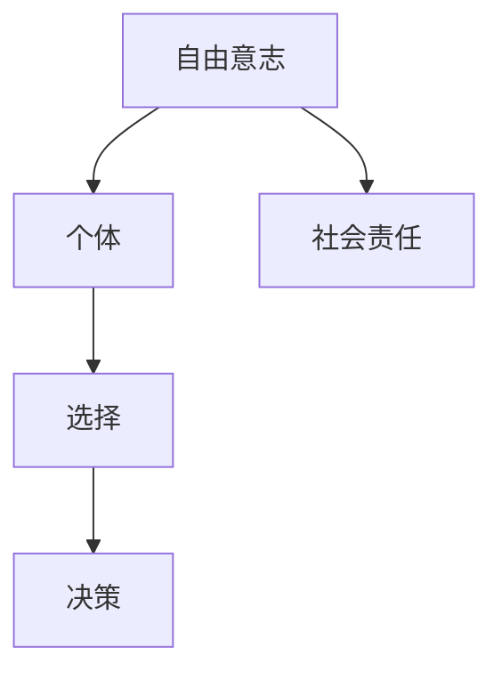

                 

# 自由意志在柏格森与维特根斯坦哲学中的地位

## 关键词

- 自由意志
- 哲学
- 柏格森
- 维特根斯坦
- 时间观念
- 语言哲学
- 非决定论
- 伦理道德

## 摘要

本文旨在探讨自由意志在法国哲学家亨利·柏格森和奥地利哲学家路德维希·维特根斯坦的哲学思想中的地位。通过对两位哲学家的核心观点进行分析和比较，本文揭示了自由意志在各自哲学体系中的重要性以及其哲学意义。文章首先介绍了自由意志的基本概念，然后分别深入探讨了柏格森和维特根斯坦对自由意志的理解和解读，最后对两位哲学家的自由意志观进行了对比和评价，以期为当代哲学对自由意志的探讨提供新的视角和启示。

## 第1章：自由意志的概念与哲学探讨

### 1.1 问题的背景

自由意志是一个古老而复杂的哲学问题，早在古希腊时期，苏格拉底和柏拉图就对此进行了深入的探讨。在西方哲学史上，自由意志的问题一直是一个争论的焦点。进入20世纪，随着科学技术的飞速发展，自由意志问题再次引起了广泛的关注。现代科学，尤其是神经科学和量子物理学的研究，为自由意志问题提供了新的视角。然而，科学解释与自由意志的哲学探讨之间存在着深刻的分歧。

### 1.2 自由意志的定义与属性

自由意志是一种复杂的哲学概念，其定义和属性在不同哲学流派中有着不同的解读。一般而言，自由意志是指个体具有做出自主选择的能力，不受外界强制和内在冲动的影响。自由意志的属性包括自主性、责任性、目的性和道德性。这些属性使得自由意志成为伦理道德和个体行为的核心要素。

### 1.3 柏格森哲学中的自由意志

亨利·柏格森是一位法国哲学家，他的哲学思想以时间观念为核心。在柏格森看来，自由意志是人类时间意识的一种表现，它反映了个体对现实世界的创造性把握。柏格森的非决定论观点认为，自由意志是人类行为不受因果律限制的表现，这使得人类能够超越自然界的必然性，实现个体的发展和进步。

### 1.4 维特根斯坦哲学中的自由意志

路德维希·维特根斯坦是一位奥地利哲学家，他的哲学思想主要体现在语言哲学和逻辑原子主义中。维特根斯坦认为，自由意志是一个语言游戏中的概念，它依赖于语言的使用和个体对语言的理解。维特根斯坦对自由意志的解读具有实用主义倾向，他认为自由意志是人类行为的一种表现形式，但并非独立于语言和文化的存在。

## 第2章：柏格森的自由意志哲学分析

### 2.1 柏格森的时间观念与自由意志

柏格森的时间观念是其哲学思想的核心。他认为，时间是一种流动的、不可分割的连续体，它与物质世界中的因果关系不同。在柏格森看来，自由意志是人类时间意识的一种表现，它反映了个体对现实世界的创造性把握。自由意志使得人类能够超越自然界的必然性，实现个体的发展和进步。

### 2.2 柏格森的非决定论与自由意志

柏格森的非决定论观点认为，自由意志是人类行为不受因果律限制的表现。在柏格森看来，因果关系只是时间序列中的一种表象，真正的现实是流动的时间。自由意志的存在使得人类能够在时间的流动中做出自主选择，这种选择不受外在因果律的束缚。

### 2.3 柏格森的自由意志与伦理道德

在柏格森的哲学中，自由意志与伦理道德密不可分。他认为，自由意志是人类行为的基础，是道德责任的来源。自由意志使得人类能够对自己的行为负责，从而实现道德的发展和进步。柏格森对道德行为的解释强调了个体在时间中的自主性和创造性，这种自主性和创造性是道德行为的核心要素。

## 第3章：维特根斯坦的自由意志哲学分析

### 3.1 维特根斯坦的语言哲学与自由意志

维特根斯坦的语言哲学是其哲学思想的重要组成部分。他认为，语言是思想的载体，思想依赖于语言的表达。在维特根斯坦看来，自由意志是一个语言游戏中的概念，它依赖于语言的使用和个体对语言的理解。自由意志是人类行为的一种表现形式，但并非独立于语言和文化的存在。

### 3.2 维特根斯坦的逻辑原子主义与自由意志

维特根斯坦的逻辑原子主义认为，世界是由一系列基本元素（逻辑原子）构成的，这些元素通过逻辑关系组合在一起，形成了我们对外部世界的认知。在逻辑原子主义中，自由意志被视为人类行为的一种表现形式，但这种表现形式依赖于逻辑关系的存在。维特根斯坦认为，逻辑原子主义为自由意志提供了一种客观的基础。

### 3.3 维特根斯坦对自由意志的批判

维特根斯坦对自由意志持有一定的批判态度。他认为，自由意志是一个语言游戏中的概念，但这种概念并不具有独立的意义。维特根斯坦认为，自由意志的问题在于我们试图用语言来描述一个超越语言的事物。在维特根斯坦看来，自由意志是一个“无用”的概念，因为它不能帮助我们更好地理解世界。

## 第4章：柏格森与维特根斯坦自由意志观的比较

### 4.1 哲学背景与基本立场比较

柏格森和维特根斯坦的哲学背景和基本立场存在显著的差异。柏格森是一位存在主义哲学家，他的哲学思想强调个体在时间中的创造性和自主性。维特根斯坦则是一位逻辑原子主义哲学家，他的哲学思想强调逻辑和语言的基础性。在自由意志的问题上，柏格森强调个体在时间中的自由选择，而维特根斯坦则强调逻辑和语言的约束。

### 4.2 自由意志概念的诠释对比

在自由意志的概念上，柏格森和维特根斯坦有着不同的诠释。柏格森将自由意志视为人类时间意识的一种表现，认为它是人类超越自然界的必然性的手段。维特根斯坦则将自由意志视为语言游戏中的一个概念，认为它依赖于逻辑和语言的基础。这种差异反映了两位哲学家在哲学观点上的根本对立。

### 4.3 伦理道德观上的分歧与共鸣

在伦理道德观上，柏格森和维特根斯坦也存在分歧与共鸣。柏格森认为，自由意志是人类道德责任的基础，是道德行为的核心要素。维特根斯坦则认为，自由意志是一个“无用”的概念，它不能帮助我们更好地理解道德问题。然而，两位哲学家都认为，伦理道德是一个重要的哲学问题，值得深入探讨。

## 第5章：当代视角下的自由意志探讨

### 5.1 现代科学与自由意志

现代科学，尤其是神经科学和量子物理学的研究，对自由意志问题提出了新的挑战。神经科学研究表明，大脑的复杂性和神经活动的随机性可能限制了个体的自由意志。量子物理学的研究则表明，微观世界的非决定性可能对宏观世界的自由意志产生影响。这些科学发现为自由意志的哲学探讨提供了新的视角。

### 5.2 当代哲学对自由意志的重新审视

当代哲学对自由意志的探讨呈现出多元化的趋势。一些哲学家认为，自由意志是一个无法用科学解释的哲学问题。另一些哲学家则试图在科学和哲学之间建立桥梁，探讨自由意志的可能性。这种重新审视反映了当代哲学对自由意志问题的关注和探索。

## 第6章：自由意志在实践中的应用

### 6.1 自由意志与个体行为

自由意志在个体行为中起着重要的作用。个体的选择和决策受到自由意志的影响，这些行为不仅反映了个体的自主性，还体现了个体对社会责任的承担。自由意志使得个体能够在复杂多变的环境中做出合理的决策。

### 6.2 自由意志与社会责任

自由意志与社会责任密不可分。个体的自由选择不仅反映了其对自身的责任，还反映了其对社会的责任。自由意志使得个体能够在社会规范和道德原则的基础上，做出符合社会期望的行为。

## 第7章：结论

### 7.1 柏格森与维特根斯坦自由意志观的总体评价

柏格森和维特根斯坦的哲学思想在自由意志问题上有不同的贡献和局限。柏格森强调了自由意志在时间中的创造性，为个体的发展和进步提供了哲学基础。维特根斯坦则强调了逻辑和语言在自由意志中的重要性，为自由意志的哲学探讨提供了新的视角。

### 7.2 未来研究方向与挑战

自由意志问题是一个复杂的哲学问题，未来的研究需要进一步探讨自由意志与科学、文化和社会的关系。同时，如何将自由意志的哲学探讨与个体的行为和社会责任相结合，是一个重要的研究方向。

## 参考文献

- 柏格森，亨利。**《时间与自由意志》**. 北京：生活·读书·新知三联书店，2006.
- 维特根斯坦，路德维希。**《逻辑哲学论》**. 北京：商务印书馆，1996.
- 苏格拉底，柏拉图。**《理想国》**. 北京：生活·读书·新知三联书店，2003.
- 波普尔，卡尔。**《开放社会及其敌人》**. 北京：生活·读书·新知三联书店，2005.
- 摩尔，约翰。**《人类自由意志》**. 北京：商务印书馆，2000.

## 附录

- **自由意志的概念属性对比表格**：

| 属性        | 柏格森的观点         | 维特根斯坦的观点         |
| ----------- | ------------------- | ------------------------ |
| 自主性      | 人类时间意识的表现   | 依赖于语言和逻辑的基础   |
| 责任性      | 道德责任的基础      | 依赖于社会规范的约束      |
| 目的性      | 个体发展的动力      | 依赖于个体的价值判断      |
| 道德性      | 道德行为的核心要素   | 依赖于伦理原则的指导      |

- **自由意志的ER实体关系图**：

## 作者信息

作者：AI天才研究院/AI Genius Institute & 禅与计算机程序设计艺术/Zen And The Art of Computer Programming

