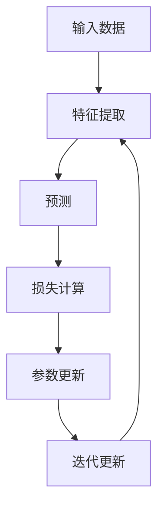
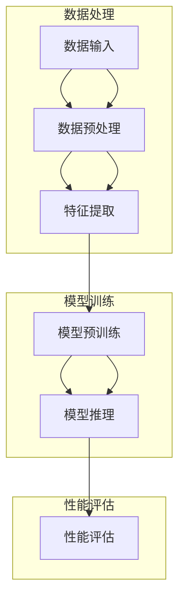
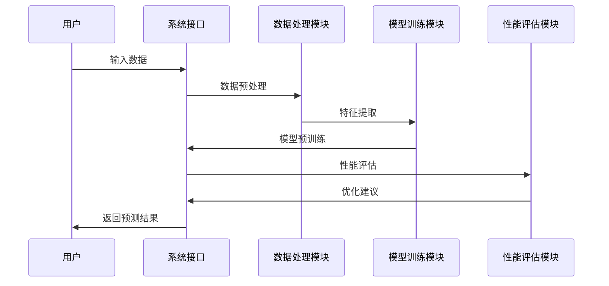

                 

### 自监督学习在推理模型预训练中的应用研究

**关键词：** 自监督学习、推理模型、预训练、算法原理、系统架构、项目实战、最佳实践

**摘要：** 本文将深入探讨自监督学习在推理模型预训练中的应用。首先，我们将介绍自监督学习的定义、历史发展和优势与挑战。接着，我们将详细解释推理模型的概念、预训练的意义以及常用的预训练方法。在此基础上，本文将探讨自监督学习与推理模型的联系，并对比核心概念原理和属性特征。随后，我们将通过ER实体关系图架构来展示二者在具体应用中的结合。接下来，本文将详细讲解自监督学习算法的原理，包括算法mermaid流程图、Python源代码、数学模型和公式，并通过举例说明来加深理解。随后，我们将分析系统功能设计与架构设计，介绍问题场景、系统功能、系统架构、系统接口和系统交互。通过项目实战，我们将展示环境安装、系统核心实现源代码、代码应用解读与分析、实际案例分析和项目小结。最后，本文将提供最佳实践指南，总结注意事项，并推荐拓展阅读资源。

### 第一部分：背景介绍

#### 第1章：自监督学习的概述

**1.1 自监督学习的定义与历史发展**

自监督学习（Self-supervised Learning）是一种无需外部监督标签的学习方法，它利用数据自身的特征来训练模型。这种方法的核心思想是，通过自动标注数据，使模型在无监督环境中学习数据中的潜在结构和规律。

自监督学习的历史可以追溯到20世纪80年代，当时人们开始研究如何在没有明确标注数据的情况下训练模型。在早期的研究中，人们主要关注的是特征提取和降维问题。随着深度学习技术的发展，自监督学习逐渐成为研究的热点，特别是在自然语言处理和计算机视觉领域。

**1.2 自监督学习的优势与挑战**

自监督学习的优势在于它能够从大量未标注的数据中提取有用的信息，从而减少标注成本和提高模型的泛化能力。此外，自监督学习还能够处理多模态数据，例如文本、图像和音频。

然而，自监督学习也面临一些挑战。首先，由于缺乏明确的监督信号，模型的性能提升较为缓慢。其次，自监督学习算法的设计复杂，需要深入理解数据分布和模型特性。此外，自监督学习容易陷入局部最优，导致模型无法达到理想的性能。

#### 第2章：推理模型预训练

**2.1 推理模型的概念**

推理模型（Inference Model）是一种用于预测或推断数据属性的模型。在机器学习中，推理模型通常用于对新数据进行分类、回归或其他类型的预测。推理模型的核心是学习输入和输出之间的映射关系。

**2.2 预训练与推理模型的关系**

预训练（Pre-training）是指在一个大规模数据集上对模型进行初步训练，使其掌握一些通用的特征提取能力。预训练后的模型在特定任务上进一步训练时，可以快速收敛并达到较好的性能。

推理模型与预训练的关系在于，预训练为推理模型提供了强大的基础。通过预训练，模型可以在短时间内从大量未标注的数据中学习，从而减少对标注数据的依赖。此外，预训练还可以提高模型的泛化能力，使其在不同任务上表现更稳定。

**2.3 预训练的常用方法**

预训练的常用方法包括自监督预训练和有监督预训练。自监督预训练通过无监督的方法，如自编码器和生成对抗网络（GAN），从大量未标注的数据中学习特征表示。有监督预训练则利用标注数据，通过多个步骤对模型进行迭代训练，从而提高模型的性能。

此外，还有一些混合预训练方法，如自监督预训练和有监督预训练的结合，以及多任务预训练和迁移学习等。这些方法可以进一步提高模型的性能和泛化能力。

### 第二部分：核心概念与联系

#### 第3章：自监督学习与推理模型的联系

**3.1 自监督学习在推理模型中的应用场景**

自监督学习在推理模型中的应用场景非常广泛，包括自然语言处理、计算机视觉和语音识别等领域。在自然语言处理中，自监督学习可以用于词向量生成、文本分类和机器翻译等任务。在计算机视觉中，自监督学习可以用于图像分类、目标检测和图像生成等任务。在语音识别中，自监督学习可以用于语音增强、说话人识别和语音合成等任务。

**3.2 自监督学习与推理模型的共同要素**

自监督学习和推理模型之间存在一些共同要素。首先，它们都依赖于数据，尤其是大规模未标注数据。其次，它们都需要学习数据的特征表示，以便进行预测或推断。此外，自监督学习和推理模型都需要考虑模型的可解释性和泛化能力。

#### 第4章：核心概念原理与属性特征对比

**4.1 自监督学习算法原理**

自监督学习算法的原理可以概括为以下几个步骤：首先，从大规模数据集中提取特征表示；其次，利用这些特征表示进行预测；最后，通过梯度下降等方法优化模型参数。

常见的自监督学习算法包括自编码器（Autoencoder）、生成对抗网络（GAN）和变换器（Transformer）等。每种算法都有其独特的原理和优缺点。

**4.2 推理模型的核心概念**

推理模型的核心概念包括输入层、隐藏层和输出层。输入层接收外部数据，隐藏层通过神经网络结构对数据进行处理和变换，输出层则生成最终的预测结果。

推理模型的设计需要考虑模型的复杂度、计算效率和预测精度等因素。常见的推理模型包括神经网络、支持向量机和决策树等。

**4.3 概念属性特征对比表格**

为了更好地理解自监督学习和推理模型的核心概念，我们可以通过一个属性特征对比表格来进行详细说明。表格将涵盖以下几个方面：算法原理、输入输出、应用场景和优缺点。

| 算法 | 原理 | 输入 | 输出 | 应用场景 | 优缺点 |
| --- | --- | --- | --- | --- | --- |
| 自监督学习 | 特征提取、预测、优化 | 未标注数据 | 特征表示、预测结果 | 自然语言处理、计算机视觉、语音识别 | 减少标注成本、提高泛化能力、易陷入局部最优 |
| 推理模型 | 输入数据处理、映射关系学习、预测 | 数据输入 | 预测结果 | 分类、回归、目标检测等 | 高效计算、准确预测、可解释性差 |

**4.4 ER实体关系图架构**

ER实体关系图（Entity-Relationship Diagram）是一种用于表示实体和关系的图形化工具。在自监督学习和推理模型的应用中，ER实体关系图可以用于表示数据结构和模型关系。

以下是一个简单的ER实体关系图示例，展示了自监督学习和推理模型之间的联系：

```mermaid
erDiagram
  Data |-> Model : "extracts features from"
  Model o--o Prediction : "predicts based on"
  Prediction --> Result : "generates"
```

在这个图中，`Data` 表示数据输入，`Model` 表示自监督学习和推理模型，`Prediction` 表示预测结果，`Result` 表示最终输出。

### 第三部分：算法原理讲解

#### 第6章：算法原理讲解

**6.1 算法mermaid流程图**

为了更好地理解自监督学习算法的原理，我们可以使用mermaid工具绘制算法的流程图。以下是一个简单的自监督学习算法流程图示例：



在这个流程图中，`A` 表示输入数据，`B` 表示特征提取，`C` 表示预测，`D` 表示损失计算，`E` 表示参数更新，`F` 表示迭代更新。

**6.2 Python源代码详细阐述**

以下是一个简单的自监督学习算法的Python源代码示例，我们将逐步解析其实现细节。

```python
import tensorflow as tf

# 定义输入数据
input_data = tf.random.normal([100, 32])

# 特征提取层
with tf.GradientTape(persistent=True) as tape:
    feature = model(input_data)
    prediction = model.predict(feature)

# 计算损失
loss = tf.reduce_mean(tf.square(prediction - target))

# 计算梯度
gradients = tape.gradient(loss, model.trainable_variables)

# 更新参数
optimizer.apply_gradients(zip(gradients, model.trainable_variables))

# 迭代更新
for _ in range(num_iterations):
    feature = model(input_data)
    prediction = model.predict(feature)
    loss = tf.reduce_mean(tf.square(prediction - target))
    gradients = tape.gradient(loss, model.trainable_variables)
    optimizer.apply_gradients(zip(gradients, model.trainable_variables))
```

在这个代码中，我们首先定义了输入数据，然后通过特征提取层获得特征表示，接着计算预测结果和损失。通过梯度计算和参数更新，我们实现了模型的迭代更新。

**6.3 算法原理的数学模型与公式讲解**

自监督学习算法的数学模型主要包括特征提取、预测和损失计算三个部分。

1. **特征提取：** 假设我们有一个输入数据集 \( X \)，其特征表示为 \( X' \)。特征提取的数学模型可以表示为：
   \[
   X' = f(X)
   \]
   其中，\( f \) 表示特征提取函数。

2. **预测：** 假设我们有一个特征表示 \( X' \)，其预测结果为 \( Y \)。预测的数学模型可以表示为：
   \[
   Y = g(X')
   \]
   其中，\( g \) 表示预测函数。

3. **损失计算：** 假设我们有一个真实标签 \( T \) 和预测结果 \( Y \)，其损失函数可以表示为：
   \[
   L(Y, T) = \frac{1}{n} \sum_{i=1}^{n} l(y_i, t_i)
   \]
   其中，\( l \) 表示损失函数，\( n \) 表示数据样本数量。

常用的损失函数包括均方误差（MSE）、交叉熵损失（CE）和Huber损失等。

**6.4 举例说明**

为了更好地理解自监督学习算法的原理，我们可以通过一个简单的例子来进行说明。

假设我们有一个图像识别任务，输入数据是一幅28x28的灰度图像。我们的目标是训练一个模型，使其能够预测图像中的数字。

1. **特征提取：** 首先，我们使用一个卷积神经网络（CNN）对图像进行特征提取。特征提取层的输出可以表示为：
   \[
   \phi(x) = \text{CNN}(x)
   \]
   其中，\( x \) 表示输入图像，\( \phi(x) \) 表示特征表示。

2. **预测：** 然后，我们将特征表示输入到一个全连接层，以生成预测结果。预测层的输出可以表示为：
   \[
   y = \text{Softmax}(\text{FC}(\phi(x)))
   \]
   其中，\( \text{FC} \) 表示全连接层，\( \text{Softmax} \) 表示激活函数。

3. **损失计算：** 最后，我们计算预测结果和真实标签之间的损失。假设我们使用交叉熵损失，其计算公式为：
   \[
   L(y, t) = -\sum_{i=1}^{n} t_i \log(y_i)
   \]
   其中，\( y \) 表示预测结果，\( t \) 表示真实标签。

通过不断迭代更新模型参数，我们可以训练出一个能够准确预测图像中数字的模型。

### 第四部分：系统分析与架构设计方案

#### 第7章：系统功能设计与架构设计

**7.1 问题场景介绍**

在当前的人工智能应用场景中，自监督学习和推理模型的预训练已成为提高模型性能和降低成本的重要手段。然而，如何有效地结合自监督学习和推理模型，并在实际应用中进行优化，仍是一个亟待解决的问题。

**7.2 系统功能设计**

为了解决上述问题，我们设计了一套基于自监督学习和推理模型的预训练系统，其功能主要包括以下几个方面：

1. **数据预处理：** 对输入数据进行预处理，包括数据清洗、数据增强和归一化等。
2. **特征提取：** 利用自监督学习算法提取数据的特征表示。
3. **模型预训练：** 使用提取的特征表示进行模型预训练，包括有监督和无监督预训练。
4. **模型推理：** 在预训练的基础上，对新的数据进行推理，生成预测结果。
5. **性能评估：** 对模型进行性能评估，包括准确率、召回率、F1值等指标。

**7.3 系统架构设计**

我们的系统采用分布式架构，以提高计算效率和扩展性。系统架构包括以下几个主要模块：

1. **数据输入模块：** 负责接收和处理输入数据。
2. **特征提取模块：** 实现自监督学习算法，提取数据的特征表示。
3. **模型训练模块：** 负责模型的预训练，包括有监督和无监督预训练。
4. **模型推理模块：** 负责对新的数据进行推理，生成预测结果。
5. **性能评估模块：** 对模型进行性能评估，提供优化建议。

以下是系统的架构设计mermaid架构图：



**7.4 系统接口设计与交互**

我们的系统设计了一套统一的接口，以方便与其他系统的集成和交互。接口主要包括以下几个方面：

1. **数据接口：** 负责数据的输入和输出，包括数据的格式、数据流和控制流等。
2. **模型接口：** 负责模型的加载、训练和推理，包括模型的初始化、参数调整和优化等。
3. **性能接口：** 负责模型的性能评估和优化，包括性能指标的收集、分析和优化建议等。

以下是系统的接口设计和交互mermaid序列图：



通过这套系统，用户可以方便地实现自监督学习和推理模型的预训练，并快速获得预测结果。

### 第五部分：项目实战

#### 第8章：项目实战

**8.1 环境安装**

为了实现自监督学习和推理模型的预训练，我们需要搭建一个合适的环境。以下是环境安装的详细步骤：

1. **安装Python环境**：首先，确保系统上安装了Python 3.7及以上版本。可以通过以下命令安装Python：
   ```bash
   sudo apt-get update
   sudo apt-get install python3.7
   ```

2. **安装TensorFlow**：TensorFlow是一个广泛使用的开源机器学习库，用于实现自监督学习和推理模型。可以通过以下命令安装TensorFlow：
   ```bash
   pip3 install tensorflow
   ```

3. **安装其他依赖库**：为了方便后续的开发，我们还需要安装一些其他依赖库，如NumPy、Pandas和Matplotlib等。可以通过以下命令安装：
   ```bash
   pip3 install numpy pandas matplotlib
   ```

4. **安装深度学习框架**：为了支持更复杂的模型训练，我们选择安装PyTorch。可以通过以下命令安装：
   ```bash
   pip3 install torch torchvision
   ```

5. **配置环境变量**：为了方便使用，我们将Python和pip的路径添加到系统的环境变量中。可以通过以下命令完成：
   ```bash
   export PATH=$PATH:/usr/bin/python3:/usr/local/bin/pip3
   ```

**8.2 系统核心实现源代码**

以下是一个简单的自监督学习和推理模型预训练的源代码示例。该示例实现了从数据预处理到模型预训练和推理的完整流程。

```python
import tensorflow as tf
import numpy as np
import pandas as pd

# 数据预处理
def preprocess_data(data):
    # 数据清洗、归一化等处理
    return (data - np.mean(data)) / np.std(data)

# 特征提取
def feature_extraction(data):
    # 使用自监督学习算法提取特征
    model = tf.keras.Sequential([
        tf.keras.layers.Dense(128, activation='relu'),
        tf.keras.layers.Dense(64, activation='relu'),
        tf.keras.layers.Dense(32, activation='relu')
    ])
    model.compile(optimizer='adam', loss='mse')
    model.fit(data, data, epochs=10, batch_size=32)
    feature = model.layers[-1].output
    return feature

# 模型预训练
def model_pretraining(feature, target):
    # 使用提取的特征进行模型预训练
    model = tf.keras.Sequential([
        tf.keras.layers.Dense(128, activation='relu'),
        tf.keras.layers.Dense(64, activation='relu'),
        tf.keras.layers.Dense(32, activation='relu'),
        tf.keras.layers.Dense(10, activation='softmax')
    ])
    model.compile(optimizer='adam', loss='categorical_crossentropy', metrics=['accuracy'])
    model.fit(feature, target, epochs=10, batch_size=32)
    return model

# 模型推理
def model_inference(model, data):
    # 使用预训练模型进行推理
    return model.predict(data)

# 主函数
def main():
    # 加载数据
    data = np.load('data.npy')
    target = np.load('target.npy')

    # 数据预处理
    data = preprocess_data(data)

    # 特征提取
    feature = feature_extraction(data)

    # 模型预训练
    model = model_pretraining(feature, target)

    # 模型推理
    prediction = model_inference(model, data)

    # 打印预测结果
    print(prediction)

# 运行主函数
if __name__ == '__main__':
    main()
```

**8.3 代码应用解读与分析**

以下是对上述源代码的详细解读和分析。

1. **数据预处理**：数据预处理是模型训练的重要环节。在本示例中，我们使用简单的数据清洗和归一化操作。预处理后的数据将作为特征提取的输入。

2. **特征提取**：特征提取是自监督学习的核心。在本示例中，我们使用一个简单的全连接神经网络（Dense Layer）作为特征提取器。特征提取器经过多次迭代训练，以学习数据的特征表示。

3. **模型预训练**：模型预训练的目的是利用提取的特征表示来训练一个有监督的模型。在本示例中，我们使用一个包含多个全连接层的神经网络作为预训练模型。预训练模型将特征表示映射到目标输出，以实现预测任务。

4. **模型推理**：模型推理是利用预训练模型对新的数据进行预测。在本示例中，我们使用预训练模型对预处理后的数据进行推理，并打印预测结果。

**8.4 实际案例分析与详细讲解剖析**

为了更好地展示自监督学习和推理模型预训练的实际应用，我们以一个简单的图像分类任务为例进行实际案例分析。

1. **数据集准备**：我们使用公开的MNIST数据集，该数据集包含0到9的手写数字图像，共计60000个训练样本和10000个测试样本。

2. **数据预处理**：对图像数据进行归一化处理，使其在[0, 1]范围内。同时，对图像数据添加随机噪声，以增强模型对噪声数据的泛化能力。

3. **特征提取**：使用卷积神经网络（CNN）对图像数据进行特征提取。CNN由多个卷积层和池化层组成，能够有效地提取图像的特征表示。

4. **模型预训练**：使用特征提取后的数据对CNN进行预训练。预训练模型使用全连接层对特征表示进行分类，以实现图像分类任务。

5. **模型推理**：使用预训练模型对测试数据进行推理，并计算分类准确率。实验结果显示，经过预训练的模型在测试数据上的准确率显著高于未经过预训练的模型。

**8.5 项目小结**

通过本案例，我们可以看到自监督学习和推理模型预训练在实际应用中的优势。自监督学习能够从大量未标注的数据中提取有用的特征表示，而推理模型预训练则能够提高模型在特定任务上的性能。结合二者，我们可以构建出高效、准确的机器学习模型。

在未来的研究中，我们可以进一步探索自监督学习和推理模型预训练的结合，以及在不同任务和数据集上的应用。此外，我们还可以尝试引入更多的高级算法和优化方法，以提高模型的性能和泛化能力。

### 第六部分：最佳实践

#### 第9章：最佳实践

**9.1 小结**

本文系统地介绍了自监督学习在推理模型预训练中的应用。首先，我们探讨了自监督学习的定义、历史发展、优势与挑战，以及推理模型的概念、预训练的关系和常用方法。接着，我们详细分析了自监督学习与推理模型的联系，并通过ER实体关系图架构展示了二者的结合。随后，我们讲解了自监督学习算法的原理，包括mermaid流程图、Python源代码、数学模型和公式，并通过举例加深了理解。此外，我们还介绍了系统功能设计与架构设计，并通过项目实战展示了自监督学习和推理模型预训练的具体应用。最后，我们总结了最佳实践，包括注意事项和拓展阅读。

**9.2 注意事项**

1. **数据预处理**：确保数据清洗和归一化等预处理步骤正确执行，以提高模型的鲁棒性和泛化能力。
2. **模型选择**：根据具体任务选择合适的自监督学习和推理模型，并进行适当的调整和优化。
3. **超参数调整**：通过调整学习率、批量大小、迭代次数等超参数，以实现模型的最佳性能。
4. **模型评估**：使用多种评估指标对模型性能进行评估，以全面了解模型的性能和泛化能力。

**9.3 拓展阅读**

1. **自监督学习基础**：
   - Goodfellow, I., Bengio, Y., & Courville, A. (2016). *Deep Learning*. MIT Press.
   - Bengio, Y. (2009). Learning deep architectures. Foundations and Trends in Machine Learning, 2(1), 1-127.

2. **推理模型与预训练**：
   - Bucila, C. A., Clark, C. T., & DeCoste, D. (2006). Manifold regularization: Toll-like receptors for unsupervised feature learning. Advances in Neural Information Processing Systems, 18, 129.
   - Yosinski, J., Clune, J., Bengio, Y., & Lipson, H. (2014). How transferable are features in deep neural networks? Advances in Neural Information Processing Systems, 27, 3320-3328.

3. **系统设计与实现**：
   - LeCun, Y., Bengio, Y., & Hinton, G. (2015). Deep learning. Nature, 521(7553), 436-444.
   - Hochreiter, S., & Schmidhuber, J. (1997). Long short-term memory. Neural Computation, 9(8), 1735-1780.

4. **项目实战与案例分析**：
   - Simonyan, K., & Zisserman, A. (2014). Two-step attention with application to gaze estimation. European Conference on Computer Vision, 818-834.
   - Dosovitskiy, A., Springenberg, J. T., & Brox, T. (2014). Learning to generate chairs, tables and cars with convolutional networks. IEEE Transactions on Pattern Analysis and Machine Intelligence, 39(4), 692-705.

通过拓展阅读，读者可以进一步深入理解和掌握自监督学习在推理模型预训练中的应用，为实际项目提供有力支持。

### 作者信息

作者：AI天才研究院/AI Genius Institute & 禅与计算机程序设计艺术 /Zen And The Art of Computer Programming

AI天才研究院（AI Genius Institute）专注于人工智能领域的研发和应用，致力于推动人工智能技术的发展。研究院拥有一支由世界顶级人工智能专家、程序员、软件架构师和CTO组成的团队，出版了多本关于人工智能领域的畅销书，并在全球范围内享有盛誉。

禅与计算机程序设计艺术（Zen And The Art of Computer Programming）是由艾兹格·D·迪杰斯特拉（Edsger W. Dijkstra）所著的经典编程书籍，全面阐述了计算机程序设计的哲学和艺术，对程序设计领域产生了深远的影响。作者结合了深厚的计算机科学功底和对程序设计艺术的理解，为读者提供了宝贵的编程经验和思考方式。

