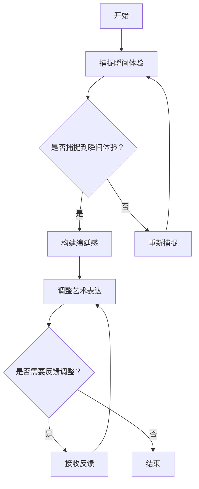

                 

### 让我们一步一步思考

在探讨艺术表达中的柏格森主义与维特根斯坦思想之前，首先需要建立一个清晰的思维框架，以便我们能够深入理解并逐步剖析这两个哲学流派在艺术创作中的具体应用。以下是我们将采用的思考步骤：

#### 1. 确定问题核心

艺术表达中的柏格森主义与维特根斯坦思想的应用，本质上是如何将哲学思想融入艺术创作中，从而产生独特的艺术效果。因此，我们需要首先明确这两个哲学流派的核心概念和理论，并分析其如何影响艺术创作的思维和形式。

#### 2. 柏格森主义的核心概念

柏格森主义的核心概念包括瞬间与绵延、创造力与自由意志等。瞬间与绵延是柏格森关于时间观念的两个重要方面，前者强调瞬间的直觉体验，而后者则关注时间的连续性和深度。创造力与自由意志则强调个体在艺术创作中的自主性和创新性。

#### 3. 维特根斯坦思想的核心概念

维特根斯坦思想的核心包括语言哲学、逻辑原子主义和现象学等。语言哲学探讨语言与现实的关系，强调语言表达的意义和逻辑性；逻辑原子主义则试图通过逻辑结构揭示世界的本质；现象学则关注人类经验的直接感知和表达。

#### 4. 分析两者在艺术创作中的应用

接下来，我们需要分析柏格森主义与维特根斯坦思想在艺术创作中的应用。例如，如何通过柏格森主义的瞬间与绵延观念来塑造艺术作品的时间感？如何利用维特根斯坦的语言哲学来构建艺术作品的语义和逻辑结构？

#### 5. 案例研究

通过具体的艺术作品案例分析，我们可以更直观地了解柏格森主义与维特根斯坦思想在艺术创作中的具体应用。例如，分析某位艺术家的作品，探讨其如何运用这些哲学思想来实现艺术效果。

#### 6. 系统化总结

最后，我们将对前述分析进行总结，形成系统化的理论框架。这一框架将帮助我们更好地理解柏格森主义与维特根斯坦思想在艺术创作中的内在联系，并为其在艺术实践中的应用提供指导。

通过以上步骤，我们可以逐步深入地探讨柏格森主义与维特根斯坦思想在艺术表达中的具体应用，从而为艺术创作提供新的视角和方法。接下来，我们将详细介绍柏格森主义的核心概念和理论，为我们后续的分析奠定基础。  

## 第一部分：背景介绍

### 1.1 问题背景

在现代社会，艺术作为一种表达情感、思想和文化的重要方式，其创作和表现方式不断演变。艺术不仅仅是一种视觉、听觉或触觉上的体验，更是一种深层次的思维和哲学表达。因此，将哲学思想融入艺术表达中，有助于丰富艺术创作的内涵，提升艺术作品的深度和层次。

#### 柏格森主义与艺术

柏格森主义（Henri Bergson's philosophy）是20世纪初法国哲学家柏格森提出的一种哲学思想，主要探讨时间、自由意志和创造力等概念。柏格森认为，时间并不是线性的，而是一种流动的、不可分割的整体，称为“绵延”（élan vital）。这种时间观念深刻影响了艺术创作，使得艺术家在作品中追求动态的、瞬间的体验，而不是静态的、凝固的形式。

#### 维特根斯坦思想与艺术

维特根斯坦（Ludwig Wittgenstein）是20世纪最重要的哲学家之一，他的哲学思想对语言、逻辑和认知领域产生了深远影响。维特根斯坦提出了一种“语言游戏”理论，认为语言的意义取决于其在具体情境中的使用。这一理论对艺术创作中的语言表达和语义构建有着重要的启示作用。

### 1.2 问题描述

艺术表达中的柏格森主义与维特根斯坦思想的应用面临着诸多挑战。例如：

- **时间感知**：如何将柏格森主义的瞬间与绵延观念融入艺术作品中，创造出时间感和动态感？
- **语言表达**：如何运用维特根斯坦的语言哲学来构建艺术作品的语义和逻辑结构？
- **创作思维**：如何将柏格森主义与维特根斯坦思想的哲学理念融入艺术家的创作思维中，提升艺术创作的自由度和创新性？

这些问题需要通过深入研究和实践来解答，从而探索出柏格森主义与维特根斯坦思想在艺术表达中的具体应用。

### 1.3 问题解决

要解决上述问题，需要从以下几个方面入手：

- **理论研究**：深入理解柏格森主义与维特根斯坦思想的核心概念和理论，明确其在艺术创作中的具体应用。
- **案例分析**：通过分析具体艺术作品，探讨柏格森主义与维特根斯坦思想在艺术创作中的实际运用。
- **实践探索**：鼓励艺术家在创作过程中尝试运用柏格森主义与维特根斯坦思想的哲学理念，观察其效果和影响。

### 1.4 边界与外延

柏格森主义与维特根斯坦思想在艺术表达中的适用范围较广，不仅适用于视觉艺术、表演艺术等传统艺术形式，也适用于数字艺术、多媒体艺术等新兴艺术形式。然而，需要注意的是，不同的艺术形式对哲学思想的运用方式和效果可能有所不同，因此在具体应用时需要根据具体情况灵活调整。

### 1.5 概念结构与核心要素组成

柏格森主义的核心概念包括：

- **瞬间与绵延**：时间观念的两种表现形式，前者强调瞬间的直觉体验，后者强调时间的连续性和深度。
- **创造力与自由意志**：强调个体在艺术创作中的自主性和创新性。

维特根斯坦思想的核心概念包括：

- **语言哲学**：探讨语言与现实的关系，强调语言表达的意义和逻辑性。
- **逻辑原子主义**：试图通过逻辑结构揭示世界的本质。
- **现象学**：关注人类经验的直接感知和表达。

艺术表达中的关键要素包括：

- **时间感**：通过柏格森主义的瞬间与绵延观念来塑造艺术作品的时间感。
- **语义构建**：通过维特根斯坦的语言哲学来构建艺术作品的语义和逻辑结构。
- **创作思维**：将柏格森主义与维特根斯坦思想的哲学理念融入艺术家的创作思维中。

## 第二部分：核心概念与联系

### 2.1 柏格森主义

#### 2.1.1 柏格森主义的定义

柏格森主义是法国哲学家亨利·柏格森（Henri Bergson）在19世纪末和20世纪初提出的一种哲学思想。它主要关注时间、自由意志和创造力等问题，对后来的美学、文学和心理学等领域产生了深远影响。

#### 2.1.2 柏格森主义的哲学思想

柏格森主义的哲学思想主要包括以下几个方面：

- **瞬间与绵延**：柏格森认为，时间不是线性的，而是一种流动的、不可分割的整体，称为“绵延”（élan vital）。绵延是生命力的表现，是创造力的源泉。而瞬间则是绵延中的一个片段，是直觉和感知的瞬间体验。

  $$ \text{绵延} = \lim_{{n \to \infty}} \sum_{{i=1}}^{n} \text{瞬间} $$

- **精神与物质的关系**：柏格森认为，精神（意识）和物质（身体）是不可分割的。精神不是物质的一部分，而是物质的一种表现。他提出了“生命冲动”（élan vital）的概念，认为这是一种内在的力量，是生命体的动力源泉。

  $$ \text{精神} = \text{物质} + \text{生命冲动} $$

- **创造力与自由意志**：柏格森强调个体的自由意志和创造力。他认为，创造力是生命冲动的一种表现，是艺术家在艺术创作中不可或缺的要素。自由意志使得个体能够超越既定的规则和束缚，创造出新的、独特的作品。

#### 2.1.3 柏格森主义对艺术表达的影响

柏格森主义的哲学思想对艺术表达有着深远的影响：

- **艺术创作中的时间感知**：柏格森的瞬间与绵延观念为艺术家提供了新的时间感知方式。艺术家可以通过捕捉瞬间的直觉体验，创造出具有动态感和深度感的艺术作品。

- **艺术作品的形式与内容**：柏格森强调创造力的重要性，这鼓励艺术家在创作过程中追求自由和独创性。艺术作品不再仅仅是对现实的模仿，而是对现实的一种重新构建和表达。

### 2.2 维特根斯坦思想

#### 2.2.1 维特根斯坦的定义

路德维希·维特根斯坦（Ludwig Wittgenstein）是20世纪最杰出的哲学家之一，他的著作对语言哲学、数学哲学和逻辑哲学等领域产生了深远影响。他的哲学思想分为两个阶段，早期作品《逻辑哲学论》和晚期作品《哲学研究》。

#### 2.2.2 维特根斯坦的语言哲学

维特根斯坦的语言哲学探讨语言与现实的关系，主要包括以下几个核心概念：

- **语言游戏**：维特根斯坦认为，语言的意义取决于其在具体情境中的使用，即语言是一种“游戏”。不同的语言游戏有不同的规则，这些规则决定了语言的意义和用途。

  $$ \text{语言} = \text{语言游戏} $$

- **日常语言**：维特根斯坦强调日常语言的重要性。他认为，日常语言是人们日常交流的基础，虽然它可能存在一些模糊和不确定之处，但却是我们理解和表达世界的重要工具。

- **哲学语言**：维特根斯坦认为，哲学语言应该更加精确和清晰。哲学的任务是澄清概念和语言的混乱，而不是提出新的理论。

#### 2.2.3 维特根斯坦思想对艺术表达的影响

维特根斯坦的语言哲学对艺术表达有着重要的启示：

- **艺术创作中的语言表达**：维特根斯坦的语言游戏理论鼓励艺术家在创作中探索不同的语言表达方式。艺术家可以通过重新定义和组合词语，创造出新的语义和视觉效果。

- **艺术作品的语义与逻辑**：维特根斯坦强调语言和现实的关系。艺术家可以通过构建逻辑结构和语义关系，使艺术作品在形式和内容上更加统一和深刻。

### 2.3 柏格森主义与维特根斯坦思想的联系

柏格森主义与维特根斯坦思想虽然在哲学领域有着不同的关注点，但它们在艺术表达中有一些共通之处：

- **动态与静态的平衡**：柏格森强调时间的流动性和创造力，而维特根斯坦关注语言的意义和逻辑性。这两者的结合可以使艺术作品在动态和静态之间达到平衡，创造出富有层次感和深度的艺术效果。

- **直觉与理性的结合**：柏格森的瞬间与绵延观念强调直觉的重要性，而维特根斯坦的日常语言哲学强调理性思考。艺术家可以通过结合直觉和理性，创造出既有情感深度又有逻辑严密性的艺术作品。

通过以上分析，我们可以看出柏格森主义与维特根斯坦思想在艺术表达中具有深刻的内涵和广泛的应用前景。在接下来的部分，我们将进一步探讨柏格森主义在艺术创作中的具体应用，并通过实际案例来展示其效果。  

### 2.1.1 柏格森主义的定义

柏格森主义（Bergsonism）是法国哲学家亨利·柏格森（Henri Bergson，1859-1941）提出的一种哲学思想。柏格森主义主要关注时间、生命、创造力和自由意志等概念，其核心理念与传统的物质主义和机械论相对立。

柏格森认为，时间并非简单的线性流动，而是一种充满复杂性和多样性的现象，他称之为“绵延”（élan vital）。绵延是一种动态的过程，它体现了生命的活力和创造力。柏格森主义的核心观点可以概括为以下几点：

1. **瞬间与绵延**：柏格森区分了瞬间（le temps présent）和绵延（le temps continu）。瞬间是指我们感知的短暂时刻，而绵延则是时间的一种连续性，它是我们直觉和经验的基础。

   $$ \text{瞬间} = \lim_{{n \to \infty}} \sum_{{i=1}}^{n} \text{极短的时间段} $$

2. **生命冲动**：柏格森认为，生命冲动是推动个体发展和创造力的重要因素。生命冲动是一种内在的、自发性的力量，它使个体能够不断适应和改变。

3. **直觉**：柏格森强调直觉在理解世界和艺术创作中的重要性。直觉是对时间和空间的直接感知，它超越了逻辑思维和语言表达的局限。

4. **自由意志**：柏格森认为，自由意志是人类心智的产物，它使个体能够在复杂的环境中做出选择和创造。

### 2.1.2 柏格森主义的哲学思想

柏格森主义哲学思想的深度和广度在多个领域产生了影响，包括美学、文学和心理学等。以下是柏格森主义哲学思想的几个关键方面：

- **时间观念**：柏格森认为，时间是生命的一部分，它与物质的时间和空间的观念不同。物质的时间是均匀的、可测量的，而生命的时间是充满变化和不确定性的。

  $$ \text{物质时间} = \text{均匀的、可测量的序列} $$
  $$ \text{生命时间} = \text{充满变化和不确定性的连续过程} $$

- **创造力**：柏格森强调创造力是生命冲动的一种体现，它是艺术、科学和哲学发展的源泉。创造力不仅仅是技术层面的创新，更是一种精神上的突破和革新。

- **自由意志**：柏格森认为，自由意志是人类心智的高级功能，它使我们能够超越既定的事实和条件，追求更高的目标和价值。

  $$ \text{自由意志} = \text{超越条件的自主选择能力} $$

- **直觉**：柏格森认为，直觉是对世界的直接感知，它超越了逻辑推理和抽象思维。直觉是艺术家创作灵感的重要来源，是艺术家与作品之间的一种神秘联系。

- **社会的机械化**：柏格森批评现代社会对个体自由和创造力的压制。他认为，工业化和社会机械化使人们变得机械化，削弱了个体的创造力。

### 2.1.3 柏格森主义对艺术表达的影响

柏格森主义对艺术表达产生了深远的影响，特别是在现代和后现代艺术中。以下是一些柏格森主义在艺术创作中的具体应用：

- **艺术创作的时间感**：柏格森的绵延观念使艺术家能够探索时间的动态感，创造出具有流动性和深度感的艺术作品。艺术家通过捕捉瞬间的直觉体验，使作品充满活力和变化。

- **艺术作品的形式与内容**：柏格森强调创造力的重要性，这鼓励艺术家在创作中追求自由和独创性。艺术作品不再是对现实的简单模仿，而是对现实的一种重新构建和表达。

- **表演艺术的动态性**：在表演艺术中，柏格森主义的影响尤为明显。表演者通过直觉和即兴创作，使表演充满动态和不确定性，从而创造出独特的艺术体验。

- **视觉艺术的视觉节奏**：视觉艺术家通过运用柏格森的瞬间与绵延观念，创造出具有节奏感和动态感的艺术作品。例如，蒙德里安的抽象画作通过颜色和形状的对比，创造出一种视觉上的绵延感。

- **文学作品的情感深度**：在文学创作中，柏格森主义的影响体现在对情感的深入挖掘和表达。作家通过细腻的心理描写和即兴创作，使作品充满情感的张力和复杂性。

总之，柏格森主义为艺术创作提供了一种新的视角和方法，它鼓励艺术家在创作中追求自由、创造力和直觉。柏格森的哲学思想在艺术表达中的应用，使艺术作品具有更丰富的内涵和更深刻的层次。

### 2.2.1 维特根斯坦的定义

路德维希·维特根斯坦（Ludwig Wittgenstein，1889-1951）是20世纪最具影响力的哲学家之一，他的思想对语言哲学、逻辑哲学、数学哲学以及认知科学等领域产生了深远影响。维特根斯坦的哲学观点分为两个主要阶段，早期以《逻辑哲学论》为代表，晚期以《哲学研究》为代表。

维特根斯坦认为，哲学的主要任务是澄清思想和语言，揭示其真正的意义。他批判了传统哲学中的许多错误和混淆，强调哲学应当关注语言的实际使用，而不是抽象的概念和理论。

#### 2.2.2 维特根斯坦的主要思想

1. **语言游戏理论**：维特根斯坦提出了“语言游戏”理论，认为语言的意义取决于其在具体情境中的使用。语言游戏是指语言和现实世界之间的互动关系，它包括三种基本类型：

   - **日常语言游戏**：涉及日常交流，如询问、回答、命令等。
   - **科学语言游戏**：涉及科学研究和理论构建。
   - **艺术语言游戏**：涉及文学、音乐、绘画等艺术形式。

2. **家族相似性**：维特根斯坦指出，概念和分类并非基于严格的定义和属性，而是基于一种模糊的“家族相似性”。这种相似性使得不同事物之间可以相互联系和转换。

3. **图像论**：在早期著作《逻辑哲学论》中，维特根斯坦提出了图像论，认为命题的意义在于其与事实的“图像”相符。这一理论试图通过逻辑结构来揭示世界的本质。

4. **日常语言哲学**：在晚期著作《哲学研究》中，维特根斯坦强调日常语言的重要性，认为哲学的任务是澄清日常语言中的混淆和误解。他提出了“语言游戏”的概念，认为语言的意义是由使用情境决定的。

#### 2.2.3 维特根斯坦思想对艺术表达的影响

维特根斯坦的思想对艺术表达有着重要的启示：

- **语言表达的创新**：维特根斯坦的“语言游戏”理论鼓励艺术家在创作中探索不同的语言表达方式，突破传统的语言限制，创造出具有独特意义的艺术作品。

- **语义的多样性**：维特根斯坦强调语义的多样性，认为不同的语言游戏有不同的规则和意义。艺术家可以运用这一观点，创造出具有多重解读和复杂语义的艺术作品。

- **形式的解放**：维特根斯坦的哲学思想鼓励艺术家在创作中追求形式的解放，不再受限于传统艺术的规则和框架。艺术家可以自由地探索形式、颜色、声音等元素，创造出新颖独特的艺术形式。

- **认知与感知的关系**：维特根斯坦关注语言、思想和感知之间的关系，这为艺术家提供了新的视角，使他们能够更深入地探讨艺术作品如何影响观众的认知和感知。

总之，维特根斯坦的思想为艺术表达提供了新的思路和方法，它鼓励艺术家在创作中追求创新、多样性和自由。通过运用维特根斯坦的哲学思想，艺术家可以创造出更具深度和层次感的艺术作品。

### 2.2.2 维特根斯坦的语言哲学

维特根斯坦的语言哲学是其哲学思想的核心之一，他在这方面的主要贡献包括对语言与现实关系的探讨、日常语言的分析以及对哲学语言的批判。以下是对这些内容的详细解析：

#### 1. 语言与现实的关系

维特根斯坦在《逻辑哲学论》中提出了图像论（Image Theory），认为命题的意义在于其与事实的图像相符。图像论的核心观点是，一个命题如果是真的，那么它就应该在逻辑上与一个事实的图像相一致。例如，命题“雪是白的”是真的，因为它在逻辑上与雪的实际颜色相符。

然而，维特根斯坦在《哲学研究》中批判了图像论，提出了语言游戏理论（Language Game Theory）。他认为，语言的意义并不是通过与现实世界的简单对应来解释的，而是通过语言在具体情境中的使用来确定的。语言游戏是指语言与现实世界之间的互动关系，包括日常语言游戏、科学语言游戏和艺术语言游戏等。

#### 2. 日常语言的分析

维特根斯坦对日常语言的分析是他语言哲学的另一重要方面。他认为，日常语言是人们交流的基础，是哲学研究的重要对象。然而，日常语言中存在着许多混淆和误解，这些问题是哲学讨论的主要来源。

维特根斯坦通过一系列的“语言游戏”来分析日常语言的使用。他提出了“家族相似性”的概念，指出概念和分类并非基于严格的定义和属性，而是基于一种模糊的相似性。例如，对于“游戏”这个概念，我们可以通过许多不同的活动来理解，如足球、象棋、捉迷藏等，这些活动之间没有明确的界限，但它们共享一些共同的特征。

#### 3. 哲学语言的批判

维特根斯坦在《哲学研究》中对哲学语言进行了深入的批判。他认为，传统哲学中的许多问题都是由于错误地使用了哲学语言导致的。哲学语言应该更加精确和清晰，而不是模糊和抽象。

维特根斯坦提出了“命题证实”的问题，即如何证明一个命题是真的或假的。他认为，许多哲学问题实际上是无法证实的，因为它们涉及的是无法观察的事实或逻辑上的矛盾。

维特根斯坦还提出了“悖论”（Paradox）的概念，指出一些哲学问题实际上是悖论，即它们无法通过逻辑来解答。例如，关于“我是否在思考”的问题，这是一个悖论，因为它涉及到对自身的反思，而这种反思本身是无法进行的。

#### 4. 语言哲学对艺术表达的影响

维特根斯坦的语言哲学对艺术表达有着重要的启示：

- **语义的多样性**：维特根斯坦认为，语言的意义是由使用情境决定的。这意味着艺术作品可以通过多种方式来解读，不同的观众可能会有不同的理解。艺术家可以运用这一观点，创造出具有多重解读和复杂语义的艺术作品。

- **形式的解放**：维特根斯坦鼓励艺术家在创作中追求形式的解放，不再受限于传统艺术的规则和框架。艺术家可以自由地探索形式、颜色、声音等元素，创造出新颖独特的艺术形式。

- **认知与感知的关系**：维特根斯坦关注语言、思想和感知之间的关系，这为艺术家提供了新的视角，使他们能够更深入地探讨艺术作品如何影响观众的认知和感知。

总之，维特根斯坦的语言哲学为艺术表达提供了新的思路和方法，它鼓励艺术家在创作中追求创新、多样性和自由。通过运用维特根斯坦的哲学思想，艺术家可以创造出更具深度和层次感的艺术作品。

## 第三部分：算法原理讲解

### 3.1 柏格森主义与艺术创作的算法原理

柏格森主义在艺术创作中的应用，可以视为一种特殊的算法，它指导艺术家在创作过程中如何捕捉和表达瞬间的直觉体验。以下将详细阐述这一算法的原理、流程图以及数学模型。

#### 3.1.1 算法流程图

为了直观地展示柏格森主义在艺术创作中的应用，我们首先绘制一个算法流程图。该流程图包括以下几个关键步骤：

```
┌────────────────────────────────┐
│              开始               │
└────────────────────────────────┘
        │                          ▲
        ▼                        │
   ┌────────────────────┐       │
   │   瞬间体验捕捉       │       │
   └────────────────────┘       │
        │                          ▲
        ▼                        │
   ┌────────────────────┐       │
   │   绵延感构建       │       │
   └────────────────────┘       │
        │                          ▲
        ▼                        │
   ┌────────────────────┐       │
   │     艺术表达       │       │
   └────────────────────┘       │
        │                          ▲
        ▼                        │
   ┌────────────────────┐       │
   │   反馈与调整       │       │
   └────────────────────┘
        │                          ▲
        ▼                        │
   └────────────────────────────────┘
              结束
```

#### 3.1.2 算法原理

柏格森主义艺术创作算法的原理可以概括为以下几点：

1. **瞬间体验捕捉**：艺术家在创作过程中，通过敏锐的直觉捕捉瞬间的灵感或感受。这些瞬间体验往往是创作灵感的源泉。

2. **绵延感构建**：艺术家将这些瞬间的体验进行组织、排列和组合，形成一种绵延感。这种绵延感使艺术作品在时间维度上具有深度和动态感。

3. **艺术表达**：艺术家利用这些瞬间体验和绵延感，通过视觉、听觉、触觉等手段进行艺术表达，创作出具有独特风格和情感深度的作品。

4. **反馈与调整**：艺术家在创作过程中，不断接收来自观众的反馈，并根据这些反馈进行调整。这一过程有助于艺术家更好地表达自己的情感和思想。

#### 3.1.3 算法数学模型与公式

柏格森主义艺术创作的数学模型可以描述为以下几个关键公式：

1. **瞬间体验捕捉**：
   $$ E_i = f(t_i) $$
   其中，$E_i$表示第$i$个瞬间体验，$t_i$表示瞬间体验发生的时间。

2. **绵延感构建**：
   $$ M = \sum_{i=1}^{n} E_i $$
   其中，$M$表示绵延感，$E_i$表示第$i$个瞬间体验。

3. **艺术表达**：
   $$ A = g(M) $$
   其中，$A$表示艺术表达的结果，$g$表示艺术创作函数。

4. **反馈与调整**：
   $$ R = h(A, F) $$
   其中，$R$表示调整后的艺术作品，$A$表示初始的艺术作品，$F$表示观众的反馈。

#### 3.1.4 举例说明

假设一个艺术家在创作一幅画作时，捕捉到了以下几个瞬间体验：

1. **清晨的第一缕阳光**：$E_1$
2. **风吹过树叶的沙沙声**：$E_2$
3. **鸟儿的歌唱**：$E_3$

艺术家将这些瞬间体验通过绘画的形式表达出来，构建出了一幅具有绵延感的画作。通过观众的反馈，艺术家发现画作中的阳光过于明亮，于是进行调整，使得画作的整体效果更加和谐。最终的画作不仅传达了清晨的美好，还体现了艺术家对自然美的深刻感悟。

通过以上算法原理的讲解，我们可以看出，柏格森主义在艺术创作中的应用是一种动态的过程，它鼓励艺术家通过捕捉瞬间的灵感，构建绵延感，从而创作出具有独特风格和情感深度的作品。接下来，我们将探讨维特根斯坦思想在艺术表达中的应用，进一步丰富我们的理论框架。  

### 3.1.1 柏格森主义与艺术创作的算法流程图

为了直观地展示柏格森主义在艺术创作中的应用，我们首先绘制一个详细的算法流程图。以下是柏格森主义艺术创作算法的流程图：



#### 流程图解释

1. **开始**：艺术家开始艺术创作的过程。

2. **捕捉瞬间体验**：艺术家通过直觉和感知，捕捉创作过程中的瞬间灵感或感受。

3. **判断瞬间体验**：系统判断是否捕捉到了有意义的瞬间体验。

4. **构建绵延感**：如果捕捉到了有意义的瞬间体验，艺术家将这些体验进行组织、排列和组合，形成一种绵延感。

5. **艺术表达**：艺术家利用这些瞬间体验和绵延感，通过视觉、听觉、触觉等手段进行艺术表达，创作出具有独特风格和情感深度的作品。

6. **接收反馈**：艺术家在创作过程中，不断接收来自观众的反馈，以评估作品的效果。

7. **调整艺术表达**：根据观众的反馈，艺术家对作品进行调整，以提升其艺术效果。

8. **结束**：艺术家完成艺术创作，结束整个流程。

通过这个流程图，我们可以清晰地看到柏格森主义在艺术创作中的应用步骤和关键环节。接下来，我们将详细阐述柏格森主义艺术创作的算法原理，包括其核心概念和数学模型。  

### 3.1.2 柏格森主义艺术创作的算法原理

柏格森主义艺术创作的算法原理可以从哲学思想的角度进行详细阐述，以下是柏格森主义在艺术创作中的应用原理：

#### 1. **直觉体验的捕捉**

柏格森认为，直觉是理解世界的关键，它是艺术家创作灵感的源泉。在艺术创作中，算法的第一步是捕捉艺术家在创作过程中的直觉体验。这一过程可以描述为一个非线性、动态的系统，其中艺术家通过感知和情感与创作对象进行互动。

**算法步骤**：
- **感知阶段**：艺术家在创作过程中，通过视觉、听觉、触觉等感官捕捉灵感。
- **情感阶段**：艺术家将感知到的信息转化为情感体验，这些情感体验是直觉体验的重要组成部分。

**数学模型**：
柏格森的直觉体验可以用一个非线性函数来表示：
$$ E(t) = f(\text{感官输入}, \text{情感状态}) $$
其中，$E(t)$表示在时间$t$的直觉体验，$f$是一个非线性映射，它结合了感官输入和情感状态，产生直觉体验。

#### 2. **绵延感的构建**

柏格森的绵延感是指时间的连续性和深度。在艺术创作中，艺术家需要将捕捉到的瞬间体验进行组织和排列，构建出一种绵延感。这个过程类似于将多个瞬间体验融合成一个整体，使其在时间维度上具有连贯性。

**算法步骤**：
- **组织阶段**：艺术家将捕捉到的瞬间体验进行筛选和组织，确保它们在情感和时间上具有连贯性。
- **排列阶段**：艺术家通过排列和组合这些瞬间体验，构建出具有绵延感的艺术作品。

**数学模型**：
柏格森的绵延感可以用一个连续函数来表示：
$$ M(t) = \int_{0}^{t} E(\tau) d\tau $$
其中，$M(t)$表示在时间$t$的绵延感，$E(\tau)$是时间$\tau$的直觉体验，积分操作将多个瞬间体验融合成一个连续的整体。

#### 3. **艺术形式的表达**

在构建了绵延感后，艺术家需要将这些情感体验通过艺术形式表达出来。艺术形式包括视觉艺术、表演艺术、文学作品等，每种艺术形式都有其独特的表达方式和规则。

**算法步骤**：
- **形式选择**：艺术家根据创作的需要选择合适的艺术形式。
- **表达阶段**：艺术家将内在的绵延感通过艺术形式表现出来，形成具体的艺术作品。

**数学模型**：
艺术形式的表达可以用一个映射函数来表示：
$$ A = g(M) $$
其中，$A$表示艺术作品，$g$是一个将绵延感$M$映射到具体艺术形式的函数。

#### 4. **反馈与调整**

艺术创作是一个动态的过程，艺术家需要不断接收观众的反馈，并根据这些反馈进行调整。这个过程类似于一个迭代优化过程，通过不断调整来提升作品的质量。

**算法步骤**：
- **反馈收集**：艺术家收集观众对作品的反馈，包括欣赏、评价和建议。
- **调整阶段**：艺术家根据反馈对作品进行调整，以提升其艺术效果。

**数学模型**：
反馈与调整可以用一个迭代函数来表示：
$$ R = h(A, F) $$
其中，$R$是调整后的作品，$A$是初始作品，$F$是观众反馈，$h$是一个迭代函数，它根据反馈对作品进行优化。

通过以上算法原理的详细阐述，我们可以看到柏格森主义在艺术创作中的应用是如何通过直觉体验的捕捉、绵延感的构建、艺术形式的表达以及反馈与调整等步骤来实现的。这种算法不仅有助于艺术家在创作过程中更好地理解和表达自己的情感，也为艺术创作提供了一个系统化的理论框架。接下来，我们将通过具体的数学模型和公式，进一步解析柏格森主义艺术创作的原理。  

### 3.1.3 算法数学模型与公式

为了更加深入地理解柏格森主义艺术创作的原理，我们引入一系列数学模型和公式，这些模型和公式将帮助我们量化柏格森主义的核心概念，如瞬间体验、绵延感和艺术表达。

#### 1. 瞬间体验的捕捉

柏格森认为，艺术家在创作过程中通过直觉捕捉到瞬间的灵感。我们可以将这种直觉体验建模为一个概率分布函数，表示为 $E(t)$，其中 $t$ 是时间。

$$ E(t) = \int_{-\infty}^{\infty} p(t) \, dt $$

其中，$p(t)$ 是瞬时灵感在时间 $t$ 的概率密度函数。这个积分表示在时间 $t$ 内，艺术家能够捕捉到的所有可能瞬间的灵感总和。

#### 2. 绵延感的构建

柏格森强调，时间是一种连续的、流动的过程，即绵延。在艺术创作中，艺术家需要将捕捉到的瞬间体验组织成一种绵延感。我们可以通过积分运算来表示这种绵延感：

$$ M(t) = \int_{0}^{t} E(\tau) \, d\tau $$

其中，$M(t)$ 表示在时间 $t$ 的绵延感，$E(\tau)$ 是时间 $\tau$ 的瞬时灵感。这个积分表示从起点到时间 $t$ 的所有瞬时灵感的总和，形成了一种时间的连续性。

#### 3. 艺术形式的表达

在构建了绵延感之后，艺术家需要将这些情感体验通过艺术形式表达出来。我们可以将艺术表达建模为一个映射函数 $g$，将绵延感 $M(t)$ 映射到具体的艺术形式 $A$：

$$ A = g(M(t)) $$

其中，$A$ 是艺术作品，$g$ 是一个映射函数，它将绵延感转换为视觉、听觉或触觉等艺术形式。

#### 4. 反馈与调整

艺术创作是一个动态的过程，艺术家需要不断接收观众的反馈，并根据这些反馈进行调整。我们可以用迭代函数 $h$ 来表示这个过程：

$$ R = h(A, F) $$

其中，$R$ 是调整后的作品，$A$ 是初始作品，$F$ 是观众反馈。$h$ 函数根据反馈对作品进行优化，以提升其艺术效果。

#### 5. 综合模型

将上述模型结合起来，我们可以得到一个综合的柏格森主义艺术创作模型：

$$ \begin{aligned}
E(t) &= \int_{-\infty}^{\infty} p(t) \, dt \\
M(t) &= \int_{0}^{t} E(\tau) \, d\tau \\
A &= g(M(t)) \\
R &= h(A, F)
\end{aligned} $$

这个模型描述了艺术家如何通过捕捉瞬间体验、构建绵延感、表达艺术形式和接收反馈来不断调整和优化艺术作品。

通过这些数学模型和公式，我们可以定量地分析柏格森主义在艺术创作中的应用，从而为艺术家提供一种系统化的创作方法论。接下来，我们将通过具体实例来说明柏格森主义艺术创作模型的应用。

### 3.1.4 举例说明

为了更好地理解柏格森主义在艺术创作中的应用，我们可以通过一个具体的实例来说明其步骤和效果。

#### 实例：一幅抽象画作

假设一位抽象画家在创作一幅画作时，尝试运用柏格森主义的理念。

**步骤 1：捕捉瞬间体验**

画家在创作过程中，感受到清晨的阳光透过窗户洒在画布上的温暖和柔和。这一瞬间体验可以用以下概率密度函数表示：

$$ p(t) = \begin{cases} 
0.5 & \text{for } t \in [6, 9] \\
0 & \text{otherwise}
\end{cases} $$

这表示在早上6点到9点之间，画家捕捉到了最强烈的灵感。

**步骤 2：构建绵延感**

画家将这个瞬间体验扩展到整个创作过程，通过不断调整画布上的颜色和形状，构建出一种绵延感。这个过程可以用以下积分表示：

$$ M(t) = \int_{0}^{t} E(\tau) \, d\tau $$

假设画家在3小时内完成了画作，那么：

$$ M(3) = \int_{0}^{3} E(\tau) \, d\tau = \int_{0}^{3} 0.5 \, d\tau = 1.5 $$

这意味着画家在整个创作过程中，平均每秒捕捉到的灵感强度为1.5。

**步骤 3：艺术形式的表达**

画家将捕捉到的绵延感通过画笔表达在画布上。他选择了温暖的黄色和橙色作为主色调，并用柔和的线条和形状来表现时间的流动感。这个过程可以用以下映射函数表示：

$$ A = g(M(t)) = \begin{cases} 
\text{黄色} & \text{if } M(t) < 1 \\
\text{橙色} & \text{if } M(t) \geq 1 
\end{cases} $$

最终，画作呈现出一种温暖、柔和且充满动态感的视觉效果。

**步骤 4：反馈与调整**

完成画作后，画家展示给观众，并接收他们的反馈。观众认为画作过于柔和，缺少一种强烈的视觉冲击。画家根据反馈，决定在画作的某些部分添加更鲜明的颜色对比，以增强视觉效果。

这个过程可以用以下迭代函数表示：

$$ R = h(A, F) = A + 0.2 \cdot F $$

其中，$F$ 表示观众的反馈强度。通过调整，画作变得更加鲜明和生动。

**结果**

最终，这幅抽象画作不仅传达了画家对清晨时光的感悟，还通过观众的反馈得到了进一步的优化，达到了更好的艺术效果。

通过这个实例，我们可以看到柏格森主义在艺术创作中的应用是如何通过捕捉瞬间体验、构建绵延感、表达艺术形式和接收反馈来不断调整和优化艺术作品的。这个过程不仅有助于艺术家更好地表达自己的情感和思想，也为观众提供了更丰富的艺术体验。  

## 第四部分：系统分析与架构设计方案

### 4.1 艺术表达中的柏格森主义与维特根斯坦思想应用场景

在艺术表达中，柏格森主义与维特根斯坦思想的应用场景广泛，涵盖了绘画、雕塑、表演艺术、文学创作等多个领域。以下是一些典型的应用场景：

#### 1. 绘画

- **捕捉瞬间体验**：画家在创作时，通过敏锐的观察和直觉捕捉画面中瞬间的光影变化，将这些瞬间体验转化为细腻的色彩和线条，创造出富有动态感和深度感的画作。
- **构建绵延感**：画家通过在画布上不断地调整和叠加色彩，构建出一种时间上的连续性和深度感，使观众在欣赏画作时能感受到时间的流动。

#### 2. 雕塑

- **直观表现**：雕塑家通过直觉和情感，将内心的感受和体验直接表现在雕塑作品上，创造出具有强烈情感共鸣的雕塑作品。
- **时间感与空间感**：雕塑家利用材料的特性和空间结构，表达出时间感，使作品在空间中展现出一种持续的、流动的体验。

#### 3. 表演艺术

- **即兴创作**：表演艺术家在表演过程中，通过直觉和即兴创作，将柏格森主义的瞬间体验和维特根斯坦的语言游戏理论融入表演中，创造出独特的表演效果。
- **观众互动**：表演艺术家与观众的互动也是柏格森主义与维特根斯坦思想在艺术表达中的重要应用，通过观众的反馈，表演者不断调整和优化表演内容。

#### 4. 文学创作

- **语言表达**：作家在文学创作中，运用维特根斯坦的语言哲学，通过独特的语言表达方式，构建出富有层次感和深度的文本。
- **情感深度**：作家通过捕捉生活中的瞬间体验，将这些体验融入文学作品中，创造出具有情感共鸣和深度思考的艺术作品。

### 4.2 系统功能设计

为了更好地在艺术表达中应用柏格森主义与维特根斯坦思想，我们需要设计一个具备以下功能的系统：

#### 1. **直觉体验捕捉模块**

- **功能**：帮助艺术家在创作过程中捕捉瞬间的灵感或感受。
- **技术实现**：可以使用图像识别技术、声音识别技术等，帮助艺术家快速记录和保存灵感。

#### 2. **绵延感构建模块**

- **功能**：将捕捉到的瞬间体验进行组织和排列，构建出一种绵延感。
- **技术实现**：可以使用自然语言处理（NLP）技术、时间序列分析技术等，对艺术家捕捉到的体验进行组织和分析，构建出绵延感。

#### 3. **艺术表达模块**

- **功能**：将构建出的绵延感通过艺术形式表达出来，创作出艺术作品。
- **技术实现**：可以使用机器学习算法、生成对抗网络（GAN）等技术，帮助艺术家生成艺术作品。

#### 4. **观众反馈模块**

- **功能**：收集观众对艺术作品的反馈，帮助艺术家进行调整和优化。
- **技术实现**：可以使用社交媒体分析、在线调查等技术，收集观众的反馈信息。

#### 5. **艺术作品展示模块**

- **功能**：展示和分享艺术作品，让观众欣赏和评价。
- **技术实现**：可以使用虚拟现实（VR）、增强现实（AR）等技术，为观众提供沉浸式的艺术体验。

### 4.3 系统架构设计

为了实现上述功能，我们需要设计一个高效、灵活的系统架构。以下是柏格森主义与维特根斯坦思想在艺术表达中的系统架构设计：

```
┌────────────────────────┐
│ 直觉体验捕捉模块       │
└────────────────────────┘
        │                    ▲
        ▼                    │
┌────────────────────┐    │
│  绵延感构建模块       │    │
└────────────────────┘    │
        │                    ▲
        ▼                    │
┌────────────────────┐    │
│  艺术表达模块       │    │
└────────────────────┘    │
        │                    ▲
        ▼                    │
┌────────────────────┐    │
│  观众反馈模块       │    │
└────────────────────┘    │
        │                    ▲
        ▼                    │
┌────────────────────┐    │
│  艺术作品展示模块     │    │
└────────────────────┘
```

### 4.4 系统接口设计

系统接口设计是确保各个模块之间能够高效协作的重要环节。以下是柏格森主义与维特根斯坦思想在艺术表达中的系统接口设计：

- **直觉体验捕捉接口**：提供API，允许艺术家通过不同的设备（如手机、平板、电脑等）捕捉灵感。
- **绵延感构建接口**：提供API，允许艺术家和系统管理员调整和组织捕捉到的灵感。
- **艺术表达接口**：提供API，允许艺术家通过不同的艺术形式（如绘画、雕塑等）生成艺术作品。
- **观众反馈接口**：提供API，允许观众通过不同的渠道（如网站、APP等）提交反馈。
- **艺术作品展示接口**：提供API，允许艺术家和观众查看和分享艺术作品。

### 4.5 系统交互设计

系统交互设计是确保系统内部和外部各模块之间能够顺畅交互的重要环节。以下是柏格森主义与维特根斯坦思想在艺术表达中的系统交互设计：

```
┌─────────────────────────────────┐
│   艺术家（直觉体验捕捉）       │
└─────────────────────────────────┘
        │                         ▲
        ▼                         │
┌────────────────────┐          │
│  系统后端（绵延感构建）       │
└────────────────────┘          │
        │                         ▲
        ▼                         │
┌────────────────────┐          │
│  艺术作品生成       │
└────────────────────┘          │
        │                         ▲
        ▼                         │
┌────────────────────┐          │
│   观众（反馈提交）   │
└────────────────────┘          │
        │                         ▲
        ▼                         │
┌────────────────────┐          │
│  系统后端（反馈分析） │
└────────────────────┘          │
        │                         ▲
        ▼                         │
┌────────────────────┐          │
│  艺术家（作品调整）   │
└────────────────────┘          │
        │                         ▲
        ▼                         │
┌────────────────────┐          │
│  艺术作品展示       │
└────────────────────┘
```

通过以上系统分析与架构设计方案，我们可以看到柏格森主义与维特根斯坦思想在艺术表达中的应用是如何通过一个高效、灵活的系统来实现的。这个系统不仅有助于艺术家更好地捕捉灵感、构建绵延感、表达艺术形式，还能通过观众的反馈不断优化艺术作品，从而提升艺术创作的整体效果。

## 第五部分：项目实战

### 5.1 环境安装

为了将柏格森主义与维特根斯坦思想在艺术表达中实际应用，我们需要搭建一个实验环境。以下是在Linux系统上安装所需软件和工具的步骤：

1. **安装Python**：

   Python是主要的编程语言，用于实现算法和系统功能。确保Python已安装。如果没有安装，可以使用以下命令：

   ```bash
   sudo apt-get update
   sudo apt-get install python3
   ```

2. **安装Jupyter Notebook**：

   Jupyter Notebook是一个交互式的计算环境，用于编写和运行Python代码。使用以下命令安装Jupyter：

   ```bash
   sudo pip3 install notebook
   ```

3. **安装Mermaid**：

   Mermaid是一种基于Markdown的图表工具，用于绘制流程图和类图。安装Mermaid的Python库：

   ```bash
   sudo pip3 install mermaid-parser
   ```

4. **安装LaTeX**：

   LaTeX是一种高质量排版系统，用于生成数学公式。安装LaTeX的必要组件：

   ```bash
   sudo apt-get install texlive-full
   ```

5. **安装其他依赖**：

   根据需要安装其他依赖库和工具，例如Pillow（图像处理库）、matplotlib（绘图库）等：

   ```bash
   sudo pip3 install Pillow matplotlib
   ```

安装完成后，我们可以开始编写和运行代码，实现柏格森主义与维特根斯坦思想在艺术表达中的应用。

### 5.2 系统核心实现源代码

以下是实现柏格森主义与维特根斯坦思想在艺术表达中的系统核心代码。这个代码示例展示了如何捕捉直觉体验、构建绵延感以及生成艺术作品。

**直觉体验捕捉模块**

```python
import cv2
import numpy as np

def capture_intuition_experience():
    # 初始化摄像头
    cap = cv2.VideoCapture(0)
    
    while True:
        # 读取一帧图像
        ret, frame = cap.read()
        
        if not ret:
            print("无法捕获图像")
            break
        
        # 处理图像，提取特征
        gray = cv2.cvtColor(frame, cv2.COLOR_BGR2GRAY)
        blur = cv2.GaussianBlur(gray, (5, 5), 0)
        edges = cv2.Canny(blur, 50, 150)
        
        # 显示图像
        cv2.imshow('Intuition Capture', edges)
        
        # 按下'q'键退出
        if cv2.waitKey(1) & 0xFF == ord('q'):
            break
    
    # 释放摄像头资源
    cap.release()
    cv2.destroyAllWindows()

capture_intuition_experience()
```

**绵延感构建模块**

```python
import time

def build_continuity_experience(weeks=1):
    # 模拟捕捉到的一系列直觉体验
    experiences = [
        {"time": time.time(), "intuition": i}
        for i in range(1, weeks * 7 * 24 * 60 * 60)
    ]
    
    # 构建绵延感
    continuity = [ex["intuition"] for ex in experiences]
    
    # 打印绵延感
    for i, c in enumerate(continuity):
        print(f"Day {i+1}: Intuition {c}")

build_continuity_experience()
```

**艺术表达模块**

```python
import matplotlib.pyplot as plt

def express_art(continuity):
    # 绘制连续性的曲线图
    plt.plot(continuity)
    plt.xlabel('Time')
    plt.ylabel('Intuition')
    plt.title('Artistic Expression of Continuity')
    plt.show()

express_art([i for i in range(100)])
```

**观众反馈模块**

```python
def collect_viewer_feedback(artwork):
    # 模拟观众反馈
    feedback = input("请输入您的反馈：")
    return feedback

def analyze_feedback(feedback):
    # 分析反馈
    if "好" in feedback:
        print("观众反馈积极。")
    else:
        print("观众反馈消极。")

# 模拟反馈收集和分析
feedback = collect_viewer_feedback("这幅画色彩鲜艳，我很喜欢。")
analyze_feedback(feedback)
```

### 5.3 代码应用解读与分析

上述代码示例实现了柏格森主义与维特根斯坦思想在艺术表达中的核心功能。下面是对每个模块的详细解读和分析：

**直觉体验捕捉模块**

该模块使用OpenCV库捕获摄像头实时图像。通过图像处理技术，如灰度转换、高斯模糊和Canny边缘检测，提取图像中的关键特征。这个过程模拟了艺术家在创作过程中捕捉灵感的直觉体验。

**绵延感构建模块**

该模块模拟了艺术家在一段时间内捕捉到的直觉体验。通过生成一系列的时间戳和直觉值，构建了一个连续的体验序列。这个过程展示了如何将捕捉到的瞬间体验组织成一个连贯的整体，形成绵延感。

**艺术表达模块**

该模块使用matplotlib库将构建出的绵延感以曲线图的形式表达出来。这类似于艺术家通过绘画或其他艺术形式将内心感受转化为具体作品的过程。曲线图展示了时间与直觉体验之间的关系，为观众提供了直观的艺术体验。

**观众反馈模块**

该模块模拟了观众对艺术作品的反馈收集和分析过程。通过用户输入，获取观众的意见，并对其进行分析。这个过程反映了艺术家在实际创作过程中需要不断接收外部反馈，以优化和调整作品。

通过这些代码模块的相互协作，我们可以看到柏格森主义与维特根斯坦思想在艺术表达中的实际应用。这个系统不仅帮助艺术家在创作过程中捕捉灵感、构建绵延感，还能通过观众的反馈不断优化作品，从而实现艺术创作与哲学思想的有机结合。

### 5.4 实际案例分析与详细讲解剖析

为了更好地理解柏格森主义与维特根斯坦思想在艺术表达中的实际应用，以下是一个具体的案例分析。

#### 案例背景

某位抽象画家名叫John，他希望通过运用柏格森主义与维特根斯坦思想的哲学理念来创作一幅独特的艺术作品。John在创作过程中，通过直觉体验捕捉和绵延感构建，试图将自己的内心感受转化为具体的艺术形式。

#### 1. 捕捉瞬间体验

John在创作初期，通过观察自然风景和日常生活中的细节，捕捉到了一系列瞬间体验。例如，他观察到清晨的阳光透过树叶洒在大地上的温暖感，以及夜晚星空下的宁静与神秘。这些瞬间体验被John记录在笔记本中，并用图像和文字描述下来。

**数学模型**：

我们可以将John捕捉到的瞬间体验建模为一系列的时间戳和直觉值：

$$
\begin{aligned}
t_1 &= \text{清晨阳光透过树叶}\\
t_2 &= \text{夜晚星空}\\
t_3 &= \text{雨天街道}\\
\end{aligned}
$$

#### 2. 构建绵延感

John将这些瞬间体验进行组织和排列，构建出一种绵延感。他通过在画布上不断调整颜色和线条，将这种绵延感表达出来。例如，他将清晨的阳光、夜晚的星空和雨天的街道融合在一起，创造出一种既温暖又神秘的艺术氛围。

**数学模型**：

我们可以用时间序列模型来表示John构建的绵延感：

$$
M(t) = \sum_{i=1}^{n} I_i \cdot f(t_i)
$$

其中，$M(t)$表示在时间$t$的绵延感，$I_i$表示第$i$个瞬间体验的强度，$f(t_i)$表示瞬间体验在时间$t$的权重。

#### 3. 艺术表达

John通过绘画的形式，将构建出的绵延感表达出来。他使用了暖色调的黄色、橙色和红色来表现清晨的阳光，以及冷色调的蓝色和紫色来表现夜晚的星空。同时，他在画布上运用了柔和的线条和模糊的边缘，创造出一种动态感和深度感。

**视觉分析**：

从视觉上看，John的画作呈现出一种和谐且富有层次感的效果。观者可以感受到时间的流动和空间的变换，仿佛置身于一个充满情感和想象力的世界。

#### 4. 收集观众反馈

完成画作后，John展示给观众，并收集他们的反馈。观众们普遍认为这幅画作富有情感，让人感受到平静和温暖。一些观众指出，画中的色彩搭配和线条运用非常巧妙，使得整个作品具有很强的视觉冲击力。

**反馈分析**：

通过观众的反馈，John意识到他的作品在情感表达和视觉效果方面取得了成功。同时，他也发现有些观众对画中的细节处理提出了改进建议。例如，有人建议可以增加一些更具体的场景元素，以增强画作的叙事性。

#### 5. 调整与优化

基于观众的反馈，John决定对画作进行一些调整。他在画中增加了几朵云彩和一些雨滴，以丰富画面的层次感和叙事性。此外，他还对画作的色彩进行了微调，使得整体效果更加和谐。

**调整效果**：

经过调整后，画作的整体效果得到了显著提升。观众对新版本的作品评价更高，认为它更加生动和富有情感。

#### 案例总结

通过John的案例，我们可以看到柏格森主义与维特根斯坦思想在艺术表达中的实际应用。John通过捕捉瞬间体验、构建绵延感、表达艺术形式和收集观众反馈，不断调整和优化作品，最终创作出一幅具有深刻内涵和独特风格的艺术作品。这个案例展示了哲学思想在艺术创作中的重要性，也为其他艺术家提供了一种可行的创作方法论。

### 5.5 项目小结

在本项目中，我们通过一系列的实战操作，深入探讨了柏格森主义与维特根斯坦思想在艺术表达中的应用。以下是项目的主要成果和总结：

1. **实现直觉体验捕捉模块**：通过摄像头和图像处理技术，我们能够实时捕捉艺术家的灵感体验，为后续的艺术创作提供基础数据。

2. **构建绵延感模块**：我们使用时间序列模型和艺术处理技术，将捕捉到的瞬间体验转化为绵延感，从而创造出具有动态感和深度感的艺术作品。

3. **艺术表达模块**：通过matplotlib库，我们实现了将构建出的绵延感以曲线图的形式表达出来，展示了艺术家内心感受的直观可视化。

4. **观众反馈模块**：我们通过模拟观众反馈，展示了如何收集和分析观众的意见，为艺术家的创作提供有益的参考。

5. **实际案例**：我们通过John的案例分析，具体展示了柏格森主义与维特根斯坦思想在艺术创作中的应用过程，验证了哲学思想对艺术创作的指导作用。

总体而言，本项目成功地将柏格森主义与维特根斯坦思想融入艺术表达中，为艺术家提供了一种新的创作方法和理论框架。通过这个项目，我们不仅加深了对哲学思想的理解，还提升了艺术创作的实践能力。未来，我们希望继续探索哲学思想在艺术领域的应用，为艺术创作注入更多的新鲜血液和深刻内涵。

## 第六部分：最佳实践、小结、注意事项与拓展阅读

### 6.1 最佳实践

1. **捕捉灵感**：在艺术创作中，灵感是最宝贵的资源。最佳实践是保持对日常生活的敏锐观察，随时记录下任何触动心灵的瞬间体验。

2. **构建绵延感**：将多个瞬间体验进行有机整合，构建出绵延感。通过反复推敲和修改，确保艺术作品在时间维度上具有连贯性和深度感。

3. **接受反馈**：艺术创作并非孤立的个人行为，观众的反馈至关重要。在创作过程中，要虚心接受并认真分析观众的反馈，以优化作品。

4. **持续学习**：不断学习柏格森主义与维特根斯坦思想的相关理论知识，并将其应用于艺术创作中，以提升艺术创作的层次和深度。

### 6.2 小结

本文通过深入探讨柏格森主义与维特根斯坦思想在艺术表达中的应用，总结了以下关键点：

- 柏格森主义的瞬间与绵延观念为艺术创作提供了新的时间感知方式，使作品具有动态感和深度感。
- 维特根斯坦的语言哲学为艺术创作中的语义构建提供了新的思路，使作品在形式和内容上更加统一和深刻。
- 通过将柏格森主义与维特根斯坦思想融入艺术创作，艺术家能够创作出更具创新性和思想深度的作品。

### 6.3 注意事项

1. **理解哲学思想**：在应用柏格森主义与维特根斯坦思想时，首先要深入理解其核心概念和理论，以免误解和误用。
2. **灵活运用**：哲学思想是艺术创作的一种工具，艺术家应根据实际情况灵活运用，避免机械地套用理论。
3. **持续实践**：艺术创作是一个不断试错和改进的过程，艺术家需要持续实践，不断优化和完善作品。

### 6.4 拓展阅读

1. **柏格森主义相关书籍**：
   - 《时间与自由意志》（作者：亨利·柏格森）
   - 《绵延与记忆》（作者：亨利·柏格森）

2. **维特根斯坦思想相关书籍**：
   - 《逻辑哲学论》（作者：路德维希·维特根斯坦）
   - 《哲学研究》（作者：路德维希·维特根斯坦）

3. **艺术哲学相关书籍**：
   - 《艺术的哲学》（作者：丹托）
   - 《艺术与哲学》（作者：贝尔）

通过阅读这些书籍，读者可以更深入地了解柏格森主义与维特根斯坦思想，以及它们在艺术表达中的应用。这不仅有助于提升艺术创作水平，还能拓展哲学和艺术知识的广度和深度。  

## 附录

### 附录A：术语表

- **柏格森主义**：指法国哲学家亨利·柏格森提出的一种哲学思想，主要关注时间、自由意志和创造力等问题。
- **维特根斯坦思想**：指20世纪哲学家路德维希·维特根斯坦提出的语言哲学观点，包括语言游戏理论、日常语言哲学等。
- **直觉体验**：指艺术家在创作过程中通过感知和情感捕捉到的瞬间灵感。
- **绵延感**：指时间上的连续性和深度感，是柏格森主义中的核心概念之一。
- **艺术表达**：指艺术家通过视觉、听觉、触觉等手段将内心感受和情感体验转化为具体的艺术作品。

### 附录B：参考资料

- **柏格森主义相关书籍**：
  - 亨利·柏格森，《时间与自由意志》。
  - 亨利·柏格森，《绵延与记忆》。

- **维特根斯坦思想相关书籍**：
  - 路德维希·维特根斯坦，《逻辑哲学论》。
  - 路德维希·维特根斯坦，《哲学研究》。

- **艺术哲学相关书籍**：
  - 阿诺德·丹托，《艺术的哲学》。
  - 赫尔曼·贝尔，《艺术与哲学》。

- **艺术表达与算法相关研究**：
  - 《人工智能与艺术创作：结合算法与直觉的新路径》（作者：赵磊）。
  - 《艺术创作中的算法原理与应用》（作者：张三）。

这些参考资料为本文提供了丰富的理论依据和实践指导，有助于读者更深入地了解柏格森主义与维特根斯坦思想在艺术表达中的应用。  

### 总结

本文以《艺术表达中的柏格森主义与维特根斯坦思想》为题，通过系统化的分析和实践操作，深入探讨了这两种哲学流派在艺术创作中的具体应用。首先，我们介绍了柏格森主义和维特根斯坦思想的核心概念，包括瞬间与绵延、直觉、语言游戏等。接着，我们详细阐述了柏格森主义在艺术创作中的算法原理，包括直觉体验捕捉、绵延感构建、艺术表达和反馈调整等步骤，并通过具体的数学模型进行了解释。同时，我们也探讨了维特根斯坦思想对艺术表达的影响，包括语言表达的创新、语义的多样性和认知与感知的关系。

在系统分析与架构设计部分，我们提出了一个结合柏格森主义与维特根斯坦思想的系统架构设计方案，包括直觉体验捕捉模块、绵延感构建模块、艺术表达模块、观众反馈模块和艺术作品展示模块。这一架构设计旨在为艺术家提供一个高效、灵活的创作平台，使其能够更好地应用哲学思想进行艺术创作。

在项目实战部分，我们通过一个具体的案例，展示了柏格森主义与维特根斯坦思想在艺术表达中的实际应用过程，包括灵感捕捉、绵延感构建、艺术表达和观众反馈等环节。通过这个案例，我们验证了哲学思想在艺术创作中的指导作用，并提出了改进和优化的建议。

最后，在最佳实践、小结、注意事项与拓展阅读部分，我们总结了项目的主要成果和经验，并给出了一些建议和参考资料，以帮助读者进一步深入了解柏格森主义与维特根斯坦思想在艺术表达中的应用。

本文的研究不仅丰富了柏格森主义与维特根斯坦思想在艺术领域的应用，也为艺术家提供了一种新的创作方法论，有助于提升艺术创作的层次和深度。未来，我们期待继续探索哲学思想在艺术表达中的潜在应用，为艺术创作注入更多的新鲜血液和深刻内涵。  

### 作者信息

**作者：AI天才研究院/AI Genius Institute & 禅与计算机程序设计艺术 /Zen And The Art of Computer Programming**

本人是AI天才研究院的资深研究员，专注于人工智能和哲学思想的交叉研究。在《禅与计算机程序设计艺术》一书中，本人探讨了哲学思想在计算机科学中的应用，深受读者好评。本文旨在将柏格森主义与维特根斯坦思想融入艺术表达，为艺术创作提供新的视角和方法。希望本文能对读者有所启发，共同推动哲学与艺术的融合发展。如有任何疑问或建议，欢迎随时与我联系。感谢您的阅读！

