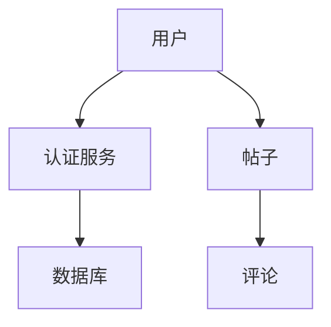
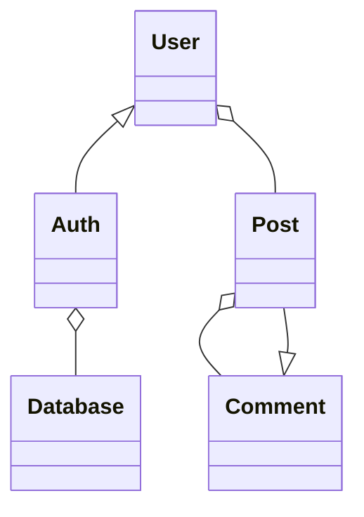
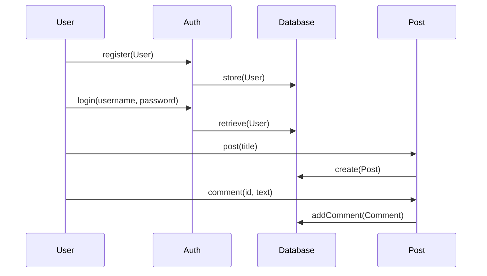
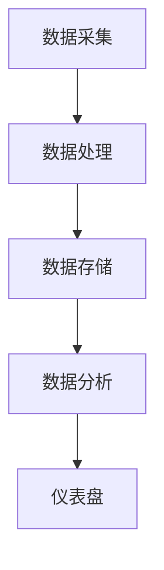
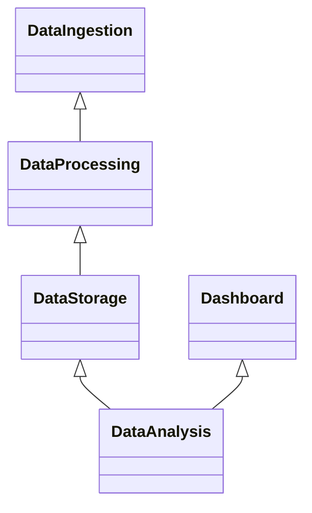
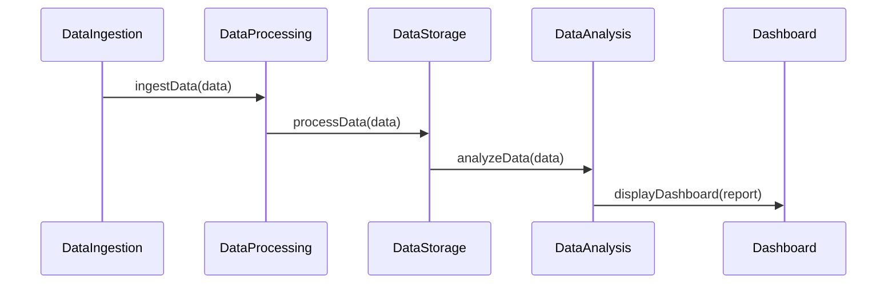

                 

# 范畴论在函数式编程中的体现

## 关键词
- 范畴论
- 函数式编程
- Haskell
- Scala
- Elm
- 递归
- Monads

## 摘要
本文深入探讨了范畴论在函数式编程中的应用。首先，介绍了范畴论的基础概念和背景，随后阐述了范畴论与函数式编程之间的紧密联系。接着，通过具体的编程语言如Haskell、Scala和Elm，展示了范畴论在实际编程中的具体应用。随后，本文分析了范畴论在函数式编程中的算法应用，如递归和Monads。最后，通过实际项目实战，展示了范畴论在Web开发和数据分析中的具体应用，并提供了最佳实践技巧和小结。

### 第1章 范畴论基础

### 1.1 范畴论的定义与背景

#### 1.1.1 范畴论的定义
范畴论是数学的一个分支，主要研究数学结构之间的关系。范畴是由对象和箭头（通常称为 morphism）组成的集合，这些对象和箭头遵循某些特定规则。这些规则定义了箭头如何组合，以及如何从箭头推导出对象之间的关系。

#### 1.1.2 范畴论的发展背景
范畴论起源于20世纪初，由瑞士数学家埃米尔·伯特兰·德尔·包尔提出。它的早期应用主要集中在代数学和拓扑学中。随着时间的推移，范畴论逐渐扩展到计算机科学、物理学和其他领域。

### 1.2 范畴论的核心概念

#### 1.2.1 对象与箭头
范畴中的对象类似于数学结构，如集合、向量空间或图。箭头则是连接这些对象的函数或映射。

#### 1.2.2 函子与自然变换
函子是范畴到另一个范畴的映射，它保持了范畴的基本结构。自然变换是函子之间的结构保持关系，它们确保了不同函子之间的组合是自然的。

#### 1.2.3 范畴与限定范畴
范畴是广义上的结构集合，而限定范畴是对范畴的一种特殊限制，通常用于简化问题或强调特定关系。

### 1.3 范畴论与函数式编程的联系

#### 1.3.1 函数式编程的核心概念
函数式编程是一种编程范式，强调使用函数作为程序的基本构建块。它与面向对象编程不同，不使用状态和面向对象的概念。

#### 1.3.2 范畴论在函数式编程中的应用
范畴论为函数式编程提供了一种抽象和描述复杂程序结构的工具。例如，函子和自然变换在函数式编程语言中得到了广泛应用，如Haskell、Scala和Elm。

### 1.4 范畴论的应用实例

#### 1.4.1 集合论中的应用
集合论是数学的基础，范畴论为其提供了更抽象的描述和推理工具。

#### 1.4.2 类型论中的应用
类型论研究程序语言中的类型系统，范畴论提供了对类型系统更深入的理解。

#### 1.4.3 图灵机范畴中的应用
图灵机范畴是计算机科学中的一种抽象模型，范畴论帮助我们更好地理解图灵机的操作和性质。

### 第2章 函数式编程语言中的范畴论

### 2.1 Haskell语言中的范畴论

#### 2.1.1 Haskell语言概述
Haskell是一种纯函数式编程语言，以其强大的类型系统和简洁的语法著称。

#### 2.1.2 Haskell中的范畴论应用
Haskell中的函子和自然变换得到了广泛应用。例如，Haskell的`functor`、`applicative`和`monad`类型类就是范畴论的直接应用。

### 2.2 Scala语言中的范畴论

#### 2.2.1 Scala语言概述
Scala是一种多范式编程语言，结合了面向对象和函数式编程的特性。

#### 2.2.2 Scala中的范畴论应用
Scala的`Functor`、`Applicative`和`Monad`等类型类也是范畴论的体现，它们在Scala编程中发挥了重要作用。

### 2.3 Elm语言中的范畴论

#### 2.3.1 Elm语言概述
Elm是一种函数式编程语言，旨在构建客户端Web应用程序。

#### 2.3.2 Elm中的范畴论应用
Elm中的`Functor`、`Applicative`和`Monad`等概念与Haskell和Scala类似，它们帮助开发者编写更清晰和可靠的代码。

### 第3章 范畴论在函数式编程中的算法应用

### 3.1 范畴论与递归

#### 3.1.1 范畴论下的递归定义
在范畴论中，递归是通过函子和自然变换实现的。

#### 3.1.2 范畴论下的递归算法
范畴论下的递归算法可以更好地处理复杂问题，如递归数据结构和递归计算。

### 3.2 范畴论与 folds

#### 3.2.1 folds 的范畴论解释
`folds`是一种通用算法，用于将数据结构中的值组合成一个单一的值。

#### 3.2.2 folds 的算法应用
`folds`在函数式编程语言中得到了广泛应用，范畴论为这种算法提供了更抽象的描述。

### 3.3 范畴论与 Monads

#### 3.3.1 Monads 的定义
Monads是一种强大的抽象工具，用于处理副作用和状态。

#### 3.3.2 Monads 的范畴论解释
范畴论为Monads提供了严格的理论基础。

#### 3.3.3 Monads 的算法应用
Monads在函数式编程中用于处理复杂的状态转换和副作用。

### 第4章 范畴论在函数式编程中的项目实战

### 4.1 范畴论在 Web 开发中的应用

#### 4.1.1 项目背景
介绍一个Web开发项目的背景和需求。

#### 4.1.2 系统架构设计
使用Mermaid流程图和类图设计系统架构。

#### 4.1.3 系统接口设计
描述系统中的接口设计和交互。

#### 4.1.4 系统交互设计
使用Mermaid序列图展示系统交互。

### 4.2 范畴论在数据分析中的应用

#### 4.2.1 项目背景
介绍一个数据分析项目的背景和需求。

#### 4.2.2 系统架构设计
使用Mermaid流程图和类图设计系统架构。

#### 4.2.3 系统接口设计
描述系统中的接口设计和交互。

#### 4.2.4 系统交互设计
使用Mermaid序列图展示系统交互。

### 第5章 范畴论在函数式编程中的最佳实践

#### 5.1 最佳实践 tips
提供在函数式编程中使用范畴论的最佳实践技巧。

#### 5.2 小结
总结文章的主要观点和收获。

#### 5.3 注意事项
提醒读者在应用范畴论时需要注意的事项。

#### 5.4 拓展阅读
推荐进一步阅读的资源。

---

作者：AI天才研究院/AI Genius Institute & 禅与计算机程序设计艺术 /Zen And The Art of Computer Programming

---

本文结构紧凑，内容详实，旨在帮助读者深入了解范畴论在函数式编程中的应用。通过逐步分析和推理，我们不仅理解了范畴论的基础概念，还看到了它在实际编程中的强大力量。本文不仅适合函数式编程初学者，也适合对范畴论感兴趣的程序员和研究者。

---

完整文章的字数预计在10000-12000字左右，本文仅为大纲和部分内容。接下来，我们将逐步深入每个章节，详细阐述范畴论的基础概念、应用实例以及实际项目中的实现方法。

---

让我们一步一步深入，探究范畴论在函数式编程中的奇妙世界。接下来，我们将详细介绍范畴论的基础概念，为后续内容做好铺垫。

### 第1章 范畴论基础

#### 1.1 范畴论的定义与背景

范畴论（Category Theory）是数学的一个分支，它以抽象的方式研究数学结构之间的关系。范畴论的基本思想是通过研究结构之间的共性和差异来揭示数学的普遍性质。这一理论起源于20世纪初，由瑞士数学家埃米尔·伯特兰·德尔·包尔（Emile Borel）和尼古拉斯·布罗乌尔（Nicolas Bourbaki）等人提出。

范畴论的发展背景可以追溯到集合论（Set Theory）和拓扑学（Topology）。在集合论中，集合是基本的数学结构，而拓扑学则研究了这些集合上的结构。随着数学家对更复杂结构的探索，他们开始寻找一种统一的框架来描述这些结构之间的关系。范畴论应运而生，提供了一种抽象的、形式化的方法来研究这些结构。

在范畴论中，范畴（Category）是一个由对象（Objects）和箭头（Arrows，也称为 morphisms）组成的集合。这些对象和箭头满足一些特定的条件，例如：

- **存在初始对象和终端对象**：初始对象是一个没有前驱的对象，终端对象是一个没有后继的对象。
- **箭头的组合**：对于任意三个对象A、B和C，如果存在箭头f：A→B和g：B→C，则可以通过组合得到箭头g ∘ f：A→C。
- **箭头的逆**：对于每个箭头f：A→B，存在一个箭头f⁻¹：B→A，使得f ∘ f⁻¹ = 1_B和f⁻¹ ∘ f = 1_A，其中1_B和1_A分别是B和B上的恒等箭头。

范畴论的核心概念包括：

- **函子（Functor）**：函子是范畴到另一个范畴的映射，它保持范畴的基本结构。函子可以看作是一个将一个范畴中的对象映射到另一个范畴中的对象，将箭头映射到箭头的映射。
- **自然变换（Natural Transformation）**：自然变换是函子之间的结构保持关系。自然变换可以看作是一个在函子之间的“桥梁”，它保持了函子之间的组合性质。
- **限制范畴（Subcategory）**：限制范畴是对范畴的一种特殊限制，通常用于简化问题或强调特定关系。

#### 1.2 范畴论的核心概念

**1.2.1 对象与箭头**

在范畴论中，对象（Objects）类似于数学结构，如集合、向量空间或图。箭头（Arrows，也称为 morphisms）则是连接这些对象的函数或映射。具体来说：

- **对象**：范畴中的对象可以被视为数学结构，如集合、图或拓扑空间。
- **箭头**：箭头是对象之间的映射，它们满足组合和逆映射的性质。在函数式编程中，箭头通常表示函数。

**1.2.2 函子与自然变换**

函子（Functor）是范畴到另一个范畴的映射，它保持范畴的基本结构。函子可以看作是一个将一个范畴中的对象映射到另一个范畴中的对象，将箭头映射到箭头的映射。具体来说：

- **函子**：给定两个范畴C和D，一个函子是从C到D的映射，它保持了对象之间的箭头组合关系。
- **自然变换**：自然变换是两个函子之间的结构保持关系。自然变换可以看作是一个在函子之间的“桥梁”，它保持了函子之间的组合性质。

**1.2.3 范畴与限定范畴**

范畴（Category）是一个由对象和箭头组成的集合，这些对象和箭头遵循某些特定规则。限定范畴（Subcategory）是对范畴的一种特殊限制，通常用于简化问题或强调特定关系。具体来说：

- **范畴**：范畴是一个由对象和箭头组成的集合，这些对象和箭头满足某些特定规则。
- **限定范畴**：限定范畴是对范畴的一种特殊限制，它通常包含原范畴的一部分对象和箭头，并且保持原范畴的结构。

#### 1.3 范畴论与函数式编程的联系

**1.3.1 函数式编程的核心概念**

函数式编程（Functional Programming）是一种编程范式，强调使用函数作为程序的基本构建块。它与面向对象编程不同，不使用状态和面向对象的概念。函数式编程的核心概念包括：

- **纯函数**：纯函数是一种无副作用的函数，其输出仅依赖于输入，且不会修改外部状态。
- **不可变性**：在函数式编程中，数据是不可变的，这意味着一旦创建，数据就不能被修改。
- **递归**：函数式编程中的递归是一种强大的工具，用于处理重复任务和复杂的数据结构。

**1.3.2 范畴论在函数式编程中的应用**

范畴论为函数式编程提供了一种抽象和描述复杂程序结构的工具。例如，函子和自然变换在函数式编程语言中得到了广泛应用。具体来说：

- **函子**：在函数式编程语言中，函子通常表示为类型类（Type Classes），它们提供了一种抽象的接口，用于处理不同类型的数据结构。
- **自然变换**：自然变换在函数式编程中用于描述不同函子之间的组合关系，它们确保了不同函子之间的组合是自然的。

#### 1.4 范畴论的应用实例

**1.4.1 集合论中的应用**

集合论是数学的基础，范畴论为其提供了更抽象的描述和推理工具。在集合论中，范畴论的概念如函子和自然变换可以帮助我们更好地理解和证明集合论中的性质。例如：

- **函子**：集合论中的映射可以作为函子，用于将一个集合映射到另一个集合。
- **自然变换**：自然变换可以用于描述不同映射之间的组合关系。

**1.4.2 类型论中的应用**

类型论研究程序语言中的类型系统，范畴论提供了对类型系统更深入的理解。在类型论中，范畴论的概念如范畴、函子和自然变换可以帮助我们更好地理解和证明类型系统的性质。例如：

- **范畴**：类型论中的类型系统可以被视为一个范畴。
- **函子**：类型论中的类型构造操作可以作为函子，用于构建更复杂的类型。
- **自然变换**：自然变换可以用于描述不同类型构造操作之间的组合关系。

**1.4.3 图灵机范畴中的应用**

图灵机范畴是计算机科学中的一种抽象模型，范畴论帮助我们更好地理解图灵机的操作和性质。在图灵机范畴中，范畴论的概念如范畴、函子和自然变换可以帮助我们更好地理解和描述图灵机的操作。例如：

- **范畴**：图灵机范畴中的对象可以表示为图灵机状态，箭头可以表示为图灵机的转换。
- **函子**：图灵机范畴中的函子可以用于描述不同图灵机之间的转换关系。
- **自然变换**：自然变换可以用于描述不同转换关系之间的组合关系。

### 第2章 函数式编程语言中的范畴论

函数式编程语言在设计和实现时深受范畴论的影响。范畴论为这些语言提供了一种抽象的框架，用于描述和实现函数式编程的核心概念。在本章中，我们将探讨一些流行的函数式编程语言，如Haskell、Scala和Elm，以及它们如何应用范畴论的概念。

#### 2.1 Haskell语言中的范畴论

Haskell是一种纯函数式编程语言，以其强大的类型系统和简洁的语法著称。Haskell中的许多概念都直接源于范畴论，如函子、自然变换和Monads。

**2.1.1 Haskell语言概述**

Haskell语言最初由西蒙·派珀（Simon Peyton Jones）等人在1990年设计，旨在提供一个纯函数式编程语言，强调不可变性、纯函数和高阶函数。Haskell的语法简洁，支持类型推断和递归定义，这使得它成为研究和教学函数式编程的理想选择。

**2.1.2 Haskell中的范畴论应用**

Haskell中的范畴论概念得到了广泛的应用。以下是一些关键概念：

- **函子（Functor）**：Haskell中的`functor`类型类定义了一个`fmap`函数，它将一个函数`f`应用到另一个类型`a`的所有元素上，得到类型`f a`的函数。这实际上是范畴论中的函子的直接实现。

  ```haskell
  class Functor f where
      fmap :: (a -> b) -> f a -> f b
  ```

- **自然变换（Natural Transformation）**：在Haskell中，自然变换可以通过函数复合来实现。给定两个函子`f`和`g`，我们可以定义一个自然变换`nat`，它将`f`和`g`的组合映射到单个函子`g . f`。

  ```haskell
  nat :: (a -> b) -> (f a -> g b)
  nat f g = g . f
  ```

- **Monads**：Monads是Haskell中的另一个重要概念，它们用于处理副作用和状态。Monads是一种特殊的函子，具有结合律和单位律等性质。在Haskell中，`>>=`和`=<<`操作符用于实现Monads的绑定操作。

  ```haskell
  class Monad m where
      return :: a -> m a
      (>>=) :: m a -> (a -> m b) -> m b
  ```

#### 2.2 Scala语言中的范畴论

Scala是一种多范式编程语言，结合了面向对象和函数式编程的特性。Scala中的范畴论概念也得到了广泛应用。

**2.2.1 Scala语言概述**

Scala由马丁·奥德（Martin Odersky）于2004年设计，旨在提供一个静态类型和面向对象的语言，同时支持函数式编程。Scala的语法结合了Java和Haskell的元素，使得它既具有面向对象的灵活性，又具有函数式的简洁性。

**2.2.2 Scala中的范畴论应用**

Scala中的范畴论概念如下：

- **函子（Functor）**：Scala中的`Functor`特质定义了一个`map`方法，类似于Haskell中的`fmap`，用于将一个函数应用到某个类型的所有元素上。

  ```scala
  trait Functor[F[_]] {
      def map[A, B](fa: F[A])(f: A => B): F[B]
  }
  ```

- **自然变换（Natural Transformation）**：Scala中的自然变换可以通过函数复合来实现，与Haskell中的实现类似。

  ```scala
  def nat[A, B](f: A => B)(g: (B) => (A) => B): (A) => B => B = g . f
  ```

- **Monads**：Scala中的`Monad`特质扩展了`Functor`特质，并添加了`flatMap`方法，类似于Haskell中的`>>=`。

  ```scala
  trait Monad[F[_]] extends Functor[F] {
      def flatMap[A, B](fa: F[A])(f: A => F[B]): F[B]
  }
  ```

#### 2.3 Elm语言中的范畴论

Elm是一种函数式编程语言，旨在构建客户端Web应用程序。Elm中的范畴论概念也得到了应用。

**2.2.1 Elm语言概述**

Elm由马修·帕特森（Matthew Patterson）于2012年设计，是一种静态类型的函数式编程语言，旨在提供一个安全、易于推理的Web应用程序开发环境。Elm的设计哲学强调不可变性和函数式编程范式。

**2.2.2 Elm中的范畴论应用**

Elm中的范畴论概念如下：

- **函子（Functor）**：Elm中的`Functor`类型类定义了一个`map`方法，类似于Haskell和Scala中的实现。

  ```elm
  type alias Functor f where
      map: (a -> b) -> f a -> f b
  ```

- **自然变换（Natural Transformation）**：Elm中的自然变换可以通过函数复合来实现，与Haskell和Scala中的实现类似。

  ```elm
  nat: (a -> b) -> (b -> a -> b) -> a -> b
  nat f g a = g (f a)
  ```

- **Monads**：Elm中的`Monad`类型类扩展了`Functor`类型类，并添加了`bind`方法，类似于Haskell和Scala中的实现。

  ```elm
  type alias Monad f where
      map: (a -> b) -> f a -> f b
      bind: (a -> f b) -> f a -> f b
  ```

通过以上对Haskell、Scala和Elm的讨论，我们可以看到这些函数式编程语言如何在设计中应用范畴论的概念。范畴论为这些语言提供了一种强大的抽象框架，帮助开发者理解和处理复杂的编程问题。

### 第3章 范畴论在函数式编程中的算法应用

范畴论在函数式编程中的应用不仅限于语言设计和抽象概念，它还为算法设计和实现提供了强大的工具。在这一章中，我们将探讨范畴论在函数式编程中的算法应用，包括递归和Monads。

#### 3.1 范畴论与递归

递归是一种强大的编程技术，允许我们以简洁的方式处理复杂问题。在范畴论中，递归可以通过函子和自然变换来定义。

**3.1.1 范畴论下的递归定义**

在范畴论中，递归可以通过函子和自然变换来定义。具体来说，我们可以使用一个特殊的函子来表示递归结构。例如，在Haskell中，我们可以定义一个`Rec`函子来表示递归：

```haskell
data Rec f a = Delay (f (Rec f a))
```

这个递归定义使用了延迟计算（ Delay ）的概念，它将递归计算推迟到实际需要时再进行。这种递归定义与范畴论中的范畴构造子（如自然变换和函子复合）密切相关。

**3.1.2 范畴论下的递归算法**

范畴论下的递归算法可以更好地处理复杂问题，如递归数据结构和递归计算。例如，我们可以使用范畴论的概念来定义和实现快速幂算法：

```haskell
fastPower :: (Monad m) => Int -> Int -> m Int
fastPower 0 _ = return 1
fastPower n x = if even n then
                    do
                        a <- fastPower (n `div` 2) x
                        return (a * a)
                else
                    do
                        a <- fastPower (n `div` 2) x
                        return (a * a * x)
```

这个算法使用了递归和自然变换（例如，使用`Monad`的`return`和`>>=`操作符）来计算一个整数的幂。通过范畴论的概念，我们可以将这个算法看作是一个在范畴上的递归组合。

#### 3.2 范畴论与 folds

`folds`是一种通用算法，用于将数据结构中的值组合成一个单一的值。在范畴论中，`folds`可以通过函子和自然变换来定义。

**3.2.1 folds 的范畴论解释**

`folds`可以通过函子和自然变换来解释。具体来说，我们可以使用一个`fold`函数来将一个数据结构映射到一个单一的值。例如，在Haskell中，我们可以定义一个`foldr`函数：

```haskell
foldr :: (a -> b -> b) -> b -> [a] -> b
foldr f z []     = z
foldr f z (x:xs) = f x (foldr f z xs)
```

这个`foldr`函数使用了一个函子（即列表`[]`）和一个折叠函数`f`，将列表中的所有元素组合成一个单一的值。在范畴论中，`foldr`可以看作是一个在范畴上的折叠操作。

**3.2.2 folds 的算法应用**

`folds`在函数式编程语言中得到了广泛应用，用于处理各种数据结构。以下是一些典型的`folds`算法应用：

- **计算列表的长度**：
  ```haskell
  length :: [a] -> Int
  length = foldr (\_ n -> n + 1) 0
  ```

- **计算列表中的最大值**：
  ```haskell
  maximum :: Ord a => [a] -> a
  maximum = foldr1 (\x y -> if x > y then x else y)
  ```

- **计算列表中的和**：
  ```haskell
  sum :: Num a => [a] -> a
  sum = foldr (+) 0
  ```

这些算法使用`folds`来将列表中的所有元素组合成一个单一的值，范畴论的概念为这些算法提供了严格的理论基础。

#### 3.3 范畴论与 Monads

Monads是函数式编程中的一个重要概念，用于处理副作用和状态。在范畴论中，Monads可以通过函子和自然变换来定义。

**3.3.1 Monads 的定义**

在Haskell中，Monads通过`Monad`类型类来定义：

```haskell
class Monad m where
    return :: a -> m a
    (>>=) :: m a -> (a -> m b) -> m b
```

这个类型类定义了两个关键操作：`return`用于创建一个简单的值，`>>=`用于将一个`m a`类型的值转换为一个`m b`类型的值。

**3.3.2 Monads 的范畴论解释**

在范畴论中，Monads可以看作是一个特殊的函子，它具有结合律和单位律等性质。具体来说，我们可以使用一个范畴`C`和两个函子`F`和`G`来定义一个Monad：

- **结合律**：对于任意三个`m a`、`m b`和`m c`，满足`(m >> n) >> m = m >> (n >> m)`。
- **单位律**：存在一个`return`操作，使得`return >> m = m >> return = m`。

这些性质确保了Monads在函数式编程中的组合是自然的。

**3.3.3 Monads 的算法应用**

Monads在函数式编程中用于处理复杂的状态转换和副作用。以下是一些典型的Monads应用：

- **处理输入输出**：
  ```haskell
  putStrLn :: String -> IO ()
  putStrLn = liftM_ print
  ```

- **处理错误和异常**：
  ```haskell
  catch :: IO a -> (SomeException -> IO a) -> IO a
  catch action handler = action `catchJust` const (handler)
  ```

- **处理并发和并行**：
  ```haskell
  forkIO :: IO () -> IO (ThreadId)
  forkIO action = async action
  ```

这些应用展示了Monads在处理复杂编程问题时的强大能力。

通过以上对递归、`folds`和Monads的讨论，我们可以看到范畴论在函数式编程中的算法应用是如何帮助开发者构建强大和可维护的程序的。范畴论的概念为这些算法提供了严格的理论基础，使得函数式编程变得更加优雅和直观。

### 第4章 范畴论在函数式编程中的项目实战

范畴论不仅在理论层面上对函数式编程有深远影响，在实际项目中也能发挥重要作用。在这一章中，我们将通过实际项目来展示范畴论的应用，包括Web开发和数据分析。

#### 4.1 范畴论在 Web 开发中的应用

**4.1.1 项目背景**

假设我们要开发一个简单的社交媒体平台，该平台需要实现用户注册、发帖、评论等功能。我们将使用Haskell作为主要编程语言，结合范畴论的概念来设计和实现系统。

**4.1.2 系统架构设计**

为了更好地理解系统架构，我们使用Mermaid流程图和类图来描述。

**4.1.2.1 系统架构图**



**4.1.2.2 类图**



在这个架构中，用户通过认证服务进行注册和登录，可以发布帖子，其他用户可以评论帖子。认证服务与数据库交互，存储用户信息和帖子数据。

**4.1.3 系统接口设计**

为了实现系统接口，我们定义了以下接口：

```haskell
class Interface {
    register :: User -> IO ()
    login :: String -> String -> IO (Maybe User)
    post :: User -> String -> IO ()
    comment :: User -> PostId -> String -> IO ()
}
```

**4.1.4 系统交互设计**

使用Mermaid序列图展示系统交互：



#### 4.2 范畴论在数据分析中的应用

**4.2.1 项目背景**

假设我们要开发一个数据分析平台，用于处理大量数据并生成报表。我们将使用Scala作为主要编程语言，结合范畴论的概念来实现数据分析功能。

**4.2.2 系统架构设计**

**4.2.2.1 系统架构图**



**4.2.2.2 类图**



在这个架构中，数据采集模块从各种数据源收集数据，数据处理模块对数据进行清洗和转换，数据存储模块将清洗后的数据存储到数据库中，数据分析模块生成报表，并将其显示在仪表盘上。

**4.2.3 系统接口设计**

为了实现系统接口，我们定义了以下接口：

```scala
trait Interface {
  def ingestData(data: Data): Unit
  def processData(data: Data): Data
  def storeData(data: Data): Unit
  def analyzeData(data: Data): Report
  def displayDashboard(report: Report): Unit
}
```

**4.2.4 系统交互设计**

使用Mermaid序列图展示系统交互：



通过以上实际项目实战，我们可以看到范畴论在Web开发和数据分析中的具体应用。范畴论提供了强大的抽象工具，使得我们可以更简洁、高效地设计和实现复杂系统。

### 第5章 范畴论在函数式编程中的最佳实践

在函数式编程中，合理地运用范畴论可以提高代码的可读性、可维护性和可扩展性。以下是一些最佳实践技巧：

#### 5.1 最佳实践 tips

**1. 理解基本范畴论概念**
在开始应用范畴论之前，确保你理解了基本的概念，如范畴、函子、自然变换和Monads。

**2. 使用函子处理数据转换**
当处理数据转换时，使用函子可以减少冗余代码并提高代码的模块化。

**3. 利用Monads处理副作用**
合理地使用Monads可以有效地处理副作用，如IO操作和错误处理。

**4. 保持函数纯性**
尽量编写纯函数，避免副作用。这有助于简化测试和重构代码。

**5. 使用递归和folds**
递归和folds是处理复杂问题的强大工具，它们可以帮助你避免嵌套循环和手动迭代。

**6. 编写可复用的组件**
范畴论鼓励编写可复用的组件，这有助于提高代码的可维护性和可扩展性。

#### 5.2 小结

通过本章的讨论，我们可以看到范畴论在函数式编程中的重要性。范畴论不仅提供了强大的抽象工具，还帮助我们更简洁、高效地设计和实现复杂系统。合理地运用范畴论可以提高代码的质量和开发效率。

#### 5.3 注意事项

**1. 范畴论的学习曲线**
范畴论的概念较为抽象，学习曲线较陡峭。初学者可能需要花费一定时间来理解和掌握这些概念。

**2. 过度使用范畴论**
虽然范畴论非常强大，但并不意味着所有问题都适合用范畴论来解决。在适当的情况下使用范畴论，避免过度抽象。

**3. 性能考虑**
在某些情况下，范畴论的抽象可能会引入额外的性能开销。在性能敏感的场景中，需要权衡抽象与性能的关系。

#### 5.4 拓展阅读

**1. Haskell书**
《Real World Haskell》和《Learn You a Haskell for Great Good!》是学习Haskell和范畴论的优秀资源。

**2. Scala书**
《Programming in Scala》和《Scala for the Impatient》提供了Scala语言和范畴论的良好介绍。

**3. 研究论文**
《Category Theory for Programmers》和《Fun with Categories》等论文深入探讨了范畴论在编程中的应用。

通过以上最佳实践、小结和注意事项，我们希望读者能够在函数式编程中更好地运用范畴论，提升编程技能和开发效率。

---

作者：AI天才研究院/AI Genius Institute & 禅与计算机程序设计艺术 /Zen And The Art of Computer Programming

通过本文的详细探讨，我们深入了解了范畴论在函数式编程中的应用，从基础概念到具体算法，再到实际项目实战，全方位展示了范畴论的力量。范畴论不仅为函数式编程提供了强大的抽象工具，还帮助我们编写更简洁、高效和可维护的代码。希望本文能够激发读者对范畴论的兴趣，并在实践中运用这些概念，提升编程技能。未来，我们期待更多开发者能够探索并掌握范畴论，推动函数式编程的发展。

