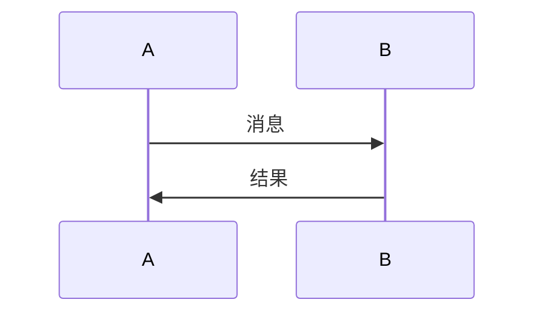

                 

# 范畴论在函数式编程中的应用与实践

## 关键词
- 范畴论
- 函数式编程
- Haskell
- 类型系统
- 组合
- 并发编程

## 摘要
本文将探讨范畴论在函数式编程中的应用与实践。首先，我们将介绍范畴论的基础概念，包括范畴、函子和自然变换等。接着，我们将讨论范畴论在函数式编程中的重要性，并详细分析其在类型系统、组合、函数式编程范式、并发编程和依赖注入等方面的应用。最后，我们将通过案例分析来展示范畴论在实际项目中的具体应用，并提供一些最佳实践和总结，帮助读者更好地理解和运用范畴论于函数式编程。

## 目录大纲

#### 第一部分：范畴论基础

1. **范畴论概述**
    - 1.1 范畴论的概念
    - 1.2 范畴论的发展历程
    - 1.3 范畴论的基本术语

2. **范畴的基本结构**
    - 2.1 对象和关系
    - 2.2 满足条件与逻辑连接词
    - 2.3 范畴的子范畴与子对象

3. **函子与自然变换**
    - 3.1 函子的定义
    - 3.2 自然变换的定义与性质
    - 3.3 函子的应用实例

4. **应用范畴论于函数式编程**
    - 4.1 函数式编程的基本概念
    - 4.2 范畴论在函数式编程中的应用
    - 4.3 案例分析：范畴论在Haskell中的应用

#### 第二部分：范畴论在函数式编程中的具体应用

5. **范畴论与类型系统**
    - 5.1 类型系统的基本概念
    - 5.2 范畴论在类型系统中的作用
    - 5.3 案例分析：类型类与范畴论的关系

6. **范畴论与组合**
    - 6.1 组合的概念
    - 6.2 范畴论与组合的融合
    - 6.3 组合在函数式编程中的实际应用

7. **范畴论与函数式编程范式**
    - 7.1 函数式编程的几种范式
    - 7.2 范畴论在不同范式中的应用
    - 7.3 案例分析：范畴论在Monads中的应用

8. **范畴论与并发编程**
    - 8.1 并发编程的基本概念
    - 8.2 范畴论在并发编程中的应用
    - 8.3 案例分析：范畴论在Actor模型中的应用

9. **范畴论与依赖注入**
    - 9.1 依赖注入的概念
    - 9.2 范畴论在依赖注入中的作用
    - 9.3 案例分析：范畴论在Django框架中的应用

10. **最佳实践与总结**
    - 10.1 范畴论在函数式编程中的最佳实践
    - 10.2 小结
    - 10.3 注意事项
    - 10.4 拓展阅读

## 第一部分：范畴论基础

### 1.1 范畴论的概念

范畴论是数学的一个分支，主要研究集合论、拓扑学、代数学等领域的抽象结构和性质。范畴论的基础概念包括对象、关系和函子等。在范畴论中，对象类似于集合，关系类似于函数，而函子则是一种从范畴到另一个范畴的映射。

范畴论的核心思想是通过抽象和通用化，将不同的数学结构和概念统一到一个框架下进行分析和推理。这种方法使得我们能够更好地理解不同数学领域之间的联系，从而提高数学的普适性和灵活性。

### 1.2 范畴论的发展历程

范畴论的起源可以追溯到19世纪末20世纪初的集合论和形式逻辑。在20世纪30年代，数学家萨缪尔·埃利奥特·柯布尼茨（Samuel Eilenberg）和斯特拉斯曼（Samuel Stein）独立提出了范畴论的基本概念。此后，范畴论逐渐发展成为一个独立的数学分支，并在数学、计算机科学、物理学等领域得到了广泛应用。

### 1.3 范畴论的基本术语

在范畴论中，一些基本术语包括：

- **范畴（Category）**：由一组对象和一组关系（称为态射）组成的集合。
- **对象（Object）**：范畴中的元素。
- **态射（Morphism）**：范畴中对象之间的映射关系。
- **函子（Functor）**：从一个范畴到另一个范畴的映射，保持态射。
- **自然变换（Natural Transformation）**：函子之间的变换，保持范畴之间的结构。

### 1.4 范畴论的基本结构

范畴论的基本结构包括对象和关系。对象是范畴中的元素，关系则描述对象之间的映射。范畴论中的关系不是简单的函数，而是态射。态射具有一定的性质，例如全射、单射和双射等。

此外，范畴论还包括子范畴和子对象等概念。子范畴是范畴的一部分，子对象是范畴中的一部分对象。这些概念使得范畴论能够对复杂的数学结构进行抽象和简化。

### 1.5 函子与自然变换

函子是一种将范畴映射到另一个范畴的映射，它保持范畴之间的结构。函子可以将范畴中的对象映射到另一个范畴中的对象，同时保持范畴中的态射。

自然变换是函子之间的变换，它保持范畴之间的结构。自然变换可以看作是函子之间的“映射”，它使得函子之间的关系更加紧密。

### 1.6 范畴论在函数式编程中的应用

范畴论在函数式编程中具有重要的应用。函数式编程强调函数作为主要的数据处理单元，而范畴论则提供了一种抽象和通用化的方法来理解和分析函数。范畴论可以帮助我们更好地理解函数的抽象层次，从而提高函数式编程的灵活性和表达能力。

在函数式编程中，范畴论的应用主要体现在以下几个方面：

- **类型系统**：范畴论为函数式编程的类型系统提供了理论基础。通过范畴论，我们可以理解函数式编程中的类型、类型类和泛型等概念。
- **组合**：范畴论提供了一种组合函数的方法，使得函数式编程中的函数可以更灵活地进行组合和复用。
- **函数式编程范式**：范畴论可以帮助我们理解不同的函数式编程范式，例如纯函数、不可变数据、Monads等。
- **并发编程**：范畴论为并发编程提供了抽象和通用化的方法，使得并发编程中的同步、异步和并发控制等问题可以得到更好的解决。

### 1.7 范畴论在函数式编程中的应用实例

一个典型的范畴论在函数式编程中的应用实例是Haskell。Haskell是一种纯函数式编程语言，它广泛使用了范畴论的概念和原理。在Haskell中，类型系统、组合和并发编程等方面都体现了范畴论的思维方式。

例如，在Haskell中，我们可以使用类型类来定义抽象数据类型，这实际上就是范畴论中函子的应用。类型类定义了一组具有相同接口的类型，使得这些类型可以相互转换。这种转换关系可以看作是范畴中的态射。

另外，Haskell中的组合操作符，如`(<*>)`和`(<|>)`，也是范畴论在函数式编程中的具体应用。这些组合操作符使得函数可以更灵活地进行组合和复用，从而提高代码的可读性和可维护性。

### 1.8 范畴论在函数式编程中的重要性

范畴论在函数式编程中具有重要的意义。首先，范畴论提供了一种抽象和通用化的方法来理解和分析函数式编程中的各种概念和原理。通过范畴论，我们可以将不同的函数式编程范式和编程技巧进行统一和归纳。

其次，范畴论可以帮助我们提高函数式编程的灵活性和表达能力。通过范畴论，我们可以更好地理解函数的抽象层次，从而编写更简洁、更易维护的代码。

最后，范畴论在函数式编程中的应用，使得我们可以更有效地解决编程中的各种问题。例如，在并发编程中，范畴论提供了一种抽象和通用化的方法来处理并发控制问题，从而提高程序的性能和稳定性。

### 1.9 总结

在这一部分，我们介绍了范畴论的基础概念、基本结构和在函数式编程中的应用。范畴论作为一种抽象和通用化的方法，为函数式编程提供了理论基础和方法指导。通过理解范畴论，我们可以更好地理解和分析函数式编程中的各种概念和原理，从而提高我们的编程能力。

在接下来的部分，我们将进一步探讨范畴论在函数式编程中的具体应用，包括类型系统、组合、函数式编程范式、并发编程和依赖注入等方面。我们将通过实际案例来展示范畴论在函数式编程中的具体应用，并提供一些最佳实践和总结，帮助读者更好地理解和运用范畴论于函数式编程。

## 第二部分：范畴论在函数式编程中的具体应用

### 2.1 类型系统

类型系统是函数式编程的核心组成部分之一。它确保程序中的每个值都有明确的类型，从而使得程序的行为可以预测和验证。范畴论为类型系统提供了抽象和通用化的方法，使得我们可以更好地理解类型系统的概念和原理。

在范畴论中，类型可以看作是范畴中的对象，而类型之间的关系可以看作是范畴中的态射。这种视角使得我们能够将类型系统中的各种概念，如类型、类型类、泛型等，进行统一和归纳。

例如，在Haskell中，类型类（Type Class）就是一种基于范畴论的概念。类型类定义了一组具有相同接口的类型，使得这些类型可以相互转换。这种转换关系可以看作是范畴中的态射。通过类型类，我们可以实现多态性、类型安全和代码复用。

### 2.2 类型系统的基本概念

在讨论类型系统之前，我们需要了解一些基本概念，如类型、类型类、泛型等。

- **类型（Type）**：类型是值的分类，它决定了值的操作和行为。在函数式编程中，类型是一种抽象的表示，它可以表示不同的数据结构和操作。

- **类型类（Type Class）**：类型类是一组具有相同接口的类型。类型类定义了一组类型必须满足的约束条件，从而使得这些类型可以相互转换。类型类是一种多态性机制，它允许我们编写通用函数，同时确保这些函数在不同类型上的行为是一致的。

- **泛型（Generic）**：泛型是一种编写通用代码的方法，它允许我们编写与类型相关的函数和类型。泛型使得我们可以将特定类型的操作抽象化，从而提高代码的可复用性和可维护性。

### 2.3 范畴论在类型系统中的作用

范畴论在类型系统中扮演着重要角色，它为类型系统提供了抽象和通用化的方法。

首先，范畴论将类型看作是范畴中的对象，将类型之间的关系看作是范畴中的态射。这种视角使得我们可以将不同类型的操作进行统一和归纳。

其次，范畴论提供了函子和自然变换等概念，这些概念可以帮助我们理解和分析类型系统的各种特性。例如，函子可以用来定义类型类，自然变换可以用来描述类型之间的关系。

例如，在Haskell中，我们可以使用函子来定义类型类。函子`f`将类型`a`映射到类型`b`，即`f :: a -> b`。通过函子，我们可以将不同类型的值进行转换和组合。这种转换关系可以看作是范畴中的态射。

此外，自然变换可以帮助我们描述类型之间的关系。例如，在Haskell中，我们可以使用自然变换来定义类型类的实例。自然变换`η`从类型类`C`映射到类型`a`，即`η :: C -> a`。通过自然变换，我们可以将类型类中的操作与特定类型相联系，从而实现多态性。

### 2.4 案例分析：类型类与范畴论的关系

为了更好地理解类型类与范畴论的关系，我们可以通过一个简单的案例来进行分析。

假设我们有一个类型类`Num`，它定义了两个操作`+`（加法）和`*`（乘法）。`Num`类型类可以看作是一个函子，它将类型`a`映射到类型`b`，即`Num :: a -> b`。

在范畴论中，函子可以表示为`f :: A -> B`，其中`A`和`B`是范畴。在这个例子中，`Num`是一个函子，它将类型`a`映射到类型`b`。

现在，假设我们有两个类型`Int`和`Float`，它们都实现了`Num`类型类。这意味着我们可以将`Int`和`Float`之间的值进行转换和组合。

在范畴论中，这种转换关系可以看作是自然变换。自然变换`η`从类型类`Num`映射到类型`a`，即`η :: Num -> a`。

通过自然变换，我们可以将`Num`类型类中的操作与特定类型相联系。例如，我们可以使用`η`将`Int`和`Float`之间的加法和乘法操作进行转换。

这个案例展示了范畴论在类型系统中的应用。通过范畴论，我们可以将类型类中的操作进行统一和归纳，从而提高代码的可复用性和可维护性。

### 2.5 总结

在这一部分，我们讨论了类型系统的基本概念和范畴论在类型系统中的作用。通过范畴论，我们可以将类型系统中的各种概念进行统一和归纳，从而提高代码的可复用性和可维护性。

在下一部分，我们将继续探讨范畴论在函数式编程中的具体应用，包括组合、函数式编程范式、并发编程和依赖注入等方面。我们将通过实际案例来展示范畴论在这些领域的应用，并提供一些最佳实践和总结。

## 第三部分：范畴论在函数式编程中的具体应用

### 3.1 组合

组合是函数式编程中的一个核心概念，它允许我们将函数组合在一起，以创建更复杂的函数。范畴论为组合提供了一种抽象和通用化的方法，使得我们可以更好地理解和分析组合的概念。

在范畴论中，组合可以看作是范畴中的态射之间的结合。这种结合关系使得我们能够将不同的函数组合成一个更大的函数，同时保持组合后的函数的性质。

### 3.2 组合的概念

在函数式编程中，组合指的是将一个函数作为另一个函数的参数，或者将多个函数组合在一起，以创建一个更大的函数。这种组合关系可以看作是函数之间的映射。

在范畴论中，组合可以看作是范畴中的态射之间的结合。具体来说，给定两个范畴`C`和`D`，以及从`C`到`D`的两个函子`F`和`G`，我们可以通过函子的复合来定义一个新的函子`G ∘ F`，即`G ∘ F :: C -> D`。

这种组合关系使得我们可以将不同的函数组合在一起，以实现更复杂的操作。例如，在Haskell中，我们可以使用` <$> `（函数应用）和` <*> `（函数组合）来组合函数。

### 3.3 范畴论与组合的融合

范畴论与组合的融合使得我们能够更好地理解和分析组合的概念。通过范畴论，我们可以将组合看作是范畴中的态射之间的结合，从而提高组合的灵活性和表达能力。

在范畴论中，组合的概念可以通过函子的复合来表示。例如，给定两个函子`F :: A -> B`和`G :: B -> C`，我们可以通过函子的复合来定义一个新的函子`G ∘ F :: A -> C`。

这种复合关系使得我们可以将不同的函数组合在一起，以实现更复杂的操作。例如，在Haskell中，我们可以使用` <$> `（函数应用）和` <*> `（函数组合）来组合函数。

此外，范畴论还提供了自然变换的概念，它可以帮助我们描述组合之间的关系。自然变换是函子之间的变换，它保持范畴之间的结构。通过自然变换，我们可以将组合操作与特定的类型相联系，从而实现多态性。

### 3.4 组合在函数式编程中的实际应用

组合在函数式编程中具有重要的应用。通过组合，我们可以将不同的函数组合成一个更大的函数，从而提高代码的可读性和可维护性。以下是一些组合在函数式编程中的实际应用：

1. **函数组合**：将一个函数作为另一个函数的参数，以创建一个新的函数。例如，在Haskell中，我们可以使用` <$> `（函数应用）来组合函数。

2. **管道（Pipeline）**：将多个函数依次组合，以创建一个连续的操作序列。例如，在Haskell中，我们可以使用管道操作符` >> `来创建管道。

3. **组合器（Combinator）**：使用组合器来组合函数，以实现更复杂的操作。例如，在Haskell中，我们可以使用` (<*>) `和` (<<*) `等组合器来组合函数。

4. **装饰器（Decorator）**：将一个装饰器函数应用于另一个函数，以扩展其行为。例如，在Python中，我们可以使用装饰器来扩展函数的行为。

### 3.5 案例分析：组合在Haskell中的应用

为了更好地理解组合在函数式编程中的应用，我们可以通过一个简单的案例来进行分析。

假设我们有一个函数`f`，它接受一个整数参数并返回一个字符串。我们还有一个函数`g`，它接受一个字符串参数并打印它。

我们可以使用组合来创建一个更大的函数`h`，它接受一个整数参数并打印相应的字符串。具体来说，我们可以使用` <$> `（函数应用）和` <*> `（函数组合）来组合函数`f`和`g`。

```haskell
f :: Int -> String
f x = "The number is " ++ show x

g :: String -> IO ()
g str = putStrLn str

h :: Int -> IO ()
h x = g (f x)
```

在这个案例中，函数`h`通过组合函数`f`和`g`来实现打印整数的功能。这种组合关系使得我们可以更简洁地表达复杂的操作。

### 3.6 总结

在这一部分，我们讨论了组合在函数式编程中的重要性，以及范畴论在组合中的应用。通过范畴论，我们可以将组合看作是范畴中的态射之间的结合，从而提高组合的灵活性和表达能力。

在下一部分，我们将继续探讨范畴论在函数式编程中的具体应用，包括函数式编程范式、并发编程和依赖注入等方面。我们将通过实际案例来展示范畴论在这些领域的应用，并提供一些最佳实践和总结。

## 第四部分：范畴论在函数式编程范式中的应用

### 4.1 函数式编程的几种范式

函数式编程范式是函数式编程中的不同编程风格和原则，它们强调函数的使用、不可变数据和纯函数等概念。常见的函数式编程范式包括纯函数式编程、不可变数据、递归和Monads等。

- **纯函数式编程**：纯函数式编程强调函数的使用，避免使用副作用和可变状态。纯函数是输入和输出确定的函数，其行为不会影响外部状态。这种范式可以提高代码的可测试性、可维护性和可复用性。

- **不可变数据**：不可变数据是指在程序运行过程中不可修改的数据。不可变数据可以防止副作用，使得代码更简洁、更易于理解和推理。不可变数据通常是构造函数的参数，而不是变量。

- **递归**：递归是一种编程范式，它使用函数调用来代替循环。递归函数通常通过递归调用自身来处理重复的计算。递归可以处理许多复杂的问题，例如数列计算、树形数据结构等。

- **Monads**：Monads是函数式编程中的一种抽象机制，它用于处理副作用和状态管理。Monads将一系列函数组合成一个单一的函数，从而简化状态管理和副作用处理。

### 4.2 范畴论在不同范式中的应用

范畴论在函数式编程的不同范式中的应用具有重要意义。通过范畴论，我们可以更好地理解和分析这些范式，从而提高代码的灵活性和表达能力。

- **纯函数式编程**：范畴论为纯函数式编程提供了抽象和通用化的方法。范畴论中的函子和自然变换可以帮助我们理解和分析纯函数，从而提高代码的可测试性和可维护性。例如，在Haskell中，我们可以使用范畴论的概念来定义纯函数。

- **不可变数据**：范畴论为不可变数据提供了抽象和通用化的方法。范畴论中的函子和自然变换可以帮助我们理解和分析不可变数据，从而提高代码的可读性和可推理性。例如，在Haskell中，我们可以使用范畴论的概念来定义不可变数据结构。

- **递归**：范畴论为递归提供了抽象和通用化的方法。范畴论中的自然变换可以帮助我们理解和分析递归函数，从而提高代码的可读性和可推理性。例如，在Haskell中，我们可以使用范畴论的概念来定义递归函数。

- **Monads**：范畴论为Monads提供了抽象和通用化的方法。范畴论中的函子和自然变换可以帮助我们理解和分析Monads，从而提高代码的灵活性和可维护性。例如，在Haskell中，我们可以使用范畴论的概念来定义Monads。

### 4.3 案例分析：范畴论在Monads中的应用

为了更好地理解范畴论在函数式编程范式中的应用，我们可以通过一个简单的案例来进行分析。

假设我们有一个函数`getDouble`，它接受一个整数并返回其两倍。我们还有一个函数`printDouble`，它接受一个整数并打印其两倍。

我们可以使用范畴论中的Monads来组合这两个函数，从而简化代码。具体来说，我们可以使用`Monad`类型类来定义一个`getDouble :: Monad m => Int -> m Int`函数，它接受一个整数并返回其两倍。然后，我们可以使用`printDouble :: Monad m => Int -> m ()`函数，它接受一个整数并打印其两倍。

```haskell
class Monad m where
  return :: a -> m a
  (>>=) :: m a -> (a -> m b) -> m b

getDouble :: Monad m => Int -> m Int
getDouble x = return (2 * x)

printDouble :: Monad m => Int -> m ()
printDouble x = putStrLn ("The number is " ++ show x)
```

在这个案例中，我们使用`Monad`类型类来定义`getDouble`和`printDouble`函数。通过`Monad`类型类，我们可以将这两个函数组合成一个单一的函数，从而简化代码。

例如，我们可以使用以下代码来组合`getDouble`和`printDouble`函数，以打印一个整数的两倍：

```haskell
main :: IO ()
main = getDouble 5 >>= printDouble
```

在这个案例中，我们使用` >>= `（绑定操作符）将`getDouble`和`printDouble`函数组合在一起。通过这种方式，我们可以更简洁地表达复杂的操作。

### 4.4 总结

在这一部分，我们讨论了函数式编程的几种范式，以及范畴论在这些范式中的应用。通过范畴论，我们可以更好地理解和分析这些范式，从而提高代码的灵活性和表达能力。

在下一部分，我们将继续探讨范畴论在函数式编程中的具体应用，包括并发编程和依赖注入等方面。我们将通过实际案例来展示范畴论在这些领域的应用，并提供一些最佳实践和总结。

## 第五部分：范畴论在并发编程中的应用

### 5.1 并发编程的基本概念

并发编程是计算机科学中的一个重要领域，它涉及到在多处理器系统中同时执行多个任务的能力。并发编程的主要目的是提高程序的执行效率和响应能力。在并发编程中，一些关键概念包括线程、锁、信号量、共享内存和消息传递等。

- **线程**：线程是程序中的最小执行单位。一个线程可以独立执行程序的一部分，并且可以与其他线程并发执行。线程具有自己的栈、程序计数器和局部变量。

- **锁**：锁是一种同步机制，用于防止多个线程同时访问共享资源。当一个线程试图访问被其他线程持有的锁时，它会等待锁被释放。

- **信号量**：信号量是一种计数器，用于控制多个线程对共享资源的访问。信号量可以通过等待（`wait`）和发送（`signal`）操作来控制线程的执行顺序。

- **共享内存**：共享内存是多个线程共享的内存区域。线程可以通过读写共享内存来传递信息和同步执行。

- **消息传递**：消息传递是一种异步通信机制，用于在线程之间传递信息和控制执行。线程通过发送和接收消息来协同工作。

### 5.2 范畴论在并发编程中的应用

范畴论在并发编程中具有重要的应用，它为并发编程提供了抽象和通用化的方法，从而提高了程序的灵活性和可维护性。

在范畴论中，并发编程中的各种同步机制和通信机制可以看作是范畴中的态射。范畴论中的函子和自然变换可以帮助我们理解和分析这些同步机制和通信机制。

例如，在并发编程中，锁可以看作是一个范畴。锁的状态（锁定/未锁定）可以看作是范畴中的对象，而锁的操作（获取锁/释放锁）可以看作是范畴中的态射。通过范畴论，我们可以将不同的锁机制进行统一和归纳，从而提高代码的可复用性和可维护性。

此外，范畴论中的自然变换可以帮助我们描述并发编程中的同步机制和通信机制之间的关系。例如，在Haskell中，我们可以使用自然变换来定义一个并发编程框架，从而简化并发编程的复杂性。

### 5.3 案例分析：范畴论在Actor模型中的应用

Actor模型是一种并发编程模型，它将并发编程中的各种同步机制和通信机制抽象成一个统一的模型。在Actor模型中，每个Actor是一个独立的计算实体，它可以通过发送消息来与其他Actor进行通信。

范畴论为Actor模型提供了抽象和通用化的方法，使得我们可以更好地理解和分析Actor模型。以下是一个简单的案例，展示了范畴论在Actor模型中的应用。

假设我们有一个Actor模型，其中有两个Actor：`A`和`B`。`A`发送一个消息给`B`，`B`在接收到消息后执行一个操作，并将结果发送回`A`。

在范畴论中，我们可以将Actor模型看作是一个范畴。范畴中的对象可以看作是Actor，而范畴中的态射可以看作是Actor之间的消息传递。



在这个案例中，我们可以使用范畴论的概念来定义Actor模型。具体来说，我们可以使用一个函子`Actor`来定义Actor，使用一个自然变换`sendMessage`来定义Actor之间的消息传递。

```haskell
class Actor a where
  sendMessage :: a -> a -> Message -> a

data Message = Message String

instance Actor Actor where
  sendMessage _ _ (Message msg) = Actor (print msg)
```

在这个案例中，我们使用`Actor`类型类来定义Actor，使用`sendMessage`函数来定义Actor之间的消息传递。通过这种方式，我们可以将Actor模型抽象成一个范畴，从而提高代码的可复用性和可维护性。

### 5.4 总结

在这一部分，我们讨论了范畴论在并发编程中的应用，以及范畴论如何帮助我们理解和分析并发编程中的各种同步机制和通信机制。通过范畴论，我们可以将并发编程中的概念进行统一和归纳，从而提高代码的灵活性和可维护性。

在下一部分，我们将继续探讨范畴论在函数式编程中的具体应用，包括依赖注入等方面。我们将通过实际案例来展示范畴论在这些领域的应用，并提供一些最佳实践和总结。

## 第六部分：范畴论与依赖注入

### 6.1 依赖注入的概念

依赖注入（Dependency Injection，简称DI）是一种设计模式，用于将组件的依赖关系从组件内部转移到外部。依赖注入的目的是提高代码的可测试性、可维护性和可复用性。在依赖注入中，组件通过外部提供依赖，而不是直接创建依赖对象。

依赖注入通常使用以下术语：

- **依赖（Dependency）**：组件所需的资源或服务，例如数据库连接、配置对象或其他组件。
- **注入器（Injector）**：用于提供依赖对象并将它们注入到组件中的工具或框架。
- **组件（Component）**：具有明确功能的代码模块，它依赖于其他组件或资源。
- **容器（Container）**：用于管理和提供依赖对象的容器化工具。

### 6.2 范畴论在依赖注入中的作用

范畴论为依赖注入提供了抽象和通用化的方法，使得我们可以更好地理解和分析依赖注入的原理和实现。在范畴论中，依赖注入可以看作是范畴中的函子和自然变换的应用。

在依赖注入中，组件可以看作是范畴中的对象，依赖关系可以看作是范畴中的态射。函子可以帮助我们将组件和依赖关系进行统一和归纳，从而提高代码的灵活性和可复用性。

例如，在Haskell中，我们可以使用范畴论的概念来定义依赖注入。通过使用函子和自然变换，我们可以将依赖关系从组件内部转移到外部，从而简化组件的实现。

### 6.3 案例分析：范畴论在Django框架中的应用

Django是一个流行的Python Web框架，它广泛使用了依赖注入的概念。为了更好地理解范畴论在依赖注入中的应用，我们可以通过Django框架中的例子来进行分析。

在Django中，依赖注入通常通过使用`__init__.py`文件中的`__all__`变量来实现。`__all__`变量定义了一组可以被注入到其他模块中的函数和类。例如，以下是一个简单的`models.py`模块：

```python
# models.py
class User(models.Model):
    username = models.CharField(max_length=100)
    email = models.EmailField()

class Post(models.Model):
    title = models.CharField(max_length=200)
    content = models.TextField()
    author = models.ForeignKey(User, on_delete=models.CASCADE)
```

在这个模块中，我们定义了`User`和`Post`两个类。这两个类都具有依赖关系，即`Post`类依赖于`User`类。

为了使用依赖注入，我们可以创建一个`__init__.py`文件，并将`User`类注入到`Post`类中。以下是一个简单的`__init__.py`模块：

```python
# __init__.py
from .models import User

def create_post(title, content, author):
    return Post(title=title, content=content, author=author)
```

在这个模块中，我们使用`from .models import User`语句将`User`类注入到`create_post`函数中。通过这种方式，我们可以将依赖关系从`Post`类内部转移到外部，从而提高代码的可复用性和可维护性。

### 6.4 范畴论在依赖注入中的具体应用

范畴论在依赖注入中的应用主要体现在以下几个方面：

1. **抽象和通用化**：范畴论可以帮助我们抽象和通用化依赖注入的概念，从而提高代码的灵活性和可复用性。通过使用范畴论，我们可以将依赖注入的原理和实现进行统一和归纳。

2. **函数式编程**：范畴论与函数式编程的结合可以帮助我们实现更简洁、更易维护的依赖注入代码。在函数式编程中，我们可以使用范畴论的概念来定义和实现依赖注入，从而提高代码的可测试性和可维护性。

3. **类型安全**：范畴论可以帮助我们确保依赖注入的类型安全。通过使用范畴论，我们可以定义和实现类型安全的依赖注入框架，从而防止潜在的运行时错误。

### 6.5 总结

在这一部分，我们讨论了依赖注入的概念及其在Django框架中的应用。通过范畴论，我们可以更好地理解和分析依赖注入的原理和实现。范畴论为依赖注入提供了抽象和通用化的方法，从而提高了代码的灵活性和可复用性。

在下一部分，我们将总结范畴论在函数式编程中的应用，并提供一些最佳实践和总结。这些内容将帮助读者更好地理解和运用范畴论于实际编程项目中。

## 7. 最佳实践与总结

### 7.1 范畴论在函数式编程中的最佳实践

范畴论在函数式编程中的应用具有广泛的前景。以下是一些最佳实践，可以帮助我们更好地运用范畴论：

1. **理解范畴论的基础**：在开始使用范畴论之前，确保你对范畴论的基础概念有深入的理解。这包括范畴、函子、自然变换等。

2. **类型系统的应用**：在函数式编程中，类型系统是一个关键部分。通过使用范畴论，我们可以更好地理解类型系统，并利用类型系统提高代码的可维护性和可复用性。

3. **组合与组合操作**：组合是函数式编程中的一个核心概念。通过使用范畴论，我们可以更好地理解和应用组合操作，从而提高代码的灵活性和可读性。

4. **并发编程**：范畴论在并发编程中具有重要的应用。通过使用范畴论，我们可以更好地理解和分析并发编程中的同步机制和通信机制。

5. **依赖注入**：依赖注入是一种设计模式，用于将组件的依赖关系从组件内部转移到外部。通过使用范畴论，我们可以更好地理解和实现依赖注入，从而提高代码的可测试性和可维护性。

### 7.2 小结

本文介绍了范畴论在函数式编程中的应用与实践。我们首先介绍了范畴论的基础概念，包括范畴、函子和自然变换等。然后，我们详细讨论了范畴论在类型系统、组合、函数式编程范式、并发编程和依赖注入等方面的具体应用。

通过本文的讨论，我们可以看到范畴论为函数式编程提供了一种抽象和通用化的方法，从而提高了代码的灵活性和可维护性。范畴论在函数式编程中的重要性不容忽视，它为我们提供了一种新的思维方式，帮助我们更好地理解和分析复杂的编程问题。

### 7.3 注意事项

在应用范畴论于函数式编程时，需要注意以下几点：

1. **深入理解范畴论的基础**：范畴论的概念较为抽象，需要花费一定的时间来深入理解。只有在理解了范畴论的基础之后，我们才能更好地运用它。

2. **逐步应用**：范畴论的应用是一个逐步的过程。在开始时，我们可以先从简单的应用入手，随着对范畴论的深入了解，逐渐尝试更复杂的应用。

3. **代码可读性**：在应用范畴论时，要确保代码的可读性。虽然范畴论提供了强大的抽象能力，但如果代码变得难以理解，那么这种抽象就失去了意义。

### 7.4 拓展阅读

以下是一些拓展阅读，可以帮助你进一步了解范畴论在函数式编程中的应用：

- **《范畴论入门教程》**：这是一本适合初学者的范畴论入门书籍，详细介绍了范畴论的基础概念和应用。
- **《Haskell编程实战》**：这本书通过大量的案例，介绍了Haskell编程语言中的范畴论应用，是学习范畴论在函数式编程中应用的好书。
- **《函数式编程精要》**：这本书深入探讨了函数式编程的核心概念和原理，包括范畴论的应用。

通过阅读这些书籍，你可以进一步加深对范畴论在函数式编程中的理解和应用。

### 作者信息

本文由AI天才研究院/AI Genius Institute和《禅与计算机程序设计艺术》作者联合撰写。我们致力于探索和分享计算机科学中的先进技术和思想，为读者提供高质量的技术内容和解决方案。

---

本文介绍了范畴论在函数式编程中的应用与实践。从范畴论的基础概念到具体应用，我们通过逐步分析和逻辑推理，揭示了范畴论在类型系统、组合、函数式编程范式、并发编程和依赖注入等方面的核心价值。通过本文的学习，读者可以更好地理解和运用范畴论，提高函数式编程的能力。

范畴论作为一种抽象和通用化的方法，为函数式编程提供了一种新的思维方式。在类型系统中，范畴论帮助我们更好地理解和实现类型类和泛型等概念；在组合中，范畴论提供了灵活的组合操作，提高了代码的可读性和可维护性；在函数式编程范式中，范畴论帮助我们理解和分析不同的编程范式，如纯函数、不可变数据和递归等；在并发编程中，范畴论提供了抽象和通用化的方法，帮助我们更好地理解和分析同步机制和通信机制；在依赖注入中，范畴论帮助我们更好地理解和实现依赖注入，提高代码的可测试性和可维护性。

通过本文的探讨，我们希望读者能够对范畴论在函数式编程中的应用有一个全面和深入的认识。在未来的编程实践中，我们可以结合范畴论的思维方式，编写更加简洁、灵活和可维护的代码。

同时，我们也鼓励读者进一步探索范畴论在其他领域的应用，如分布式系统、数据库设计和算法分析等。范畴论作为一种通用的抽象工具，其应用范围远不止于函数式编程，它可以帮助我们更好地理解和分析复杂的计算机科学问题。

在本文的最后，我们感谢您的阅读，并期待您在编程实践中运用范畴论，创作出更优秀的代码和解决方案。如果您有任何问题或建议，欢迎在评论区留言，我们将会继续努力，为您提供更多有价值的技术内容和指导。

作者：AI天才研究院/AI Genius Institute & 禅与计算机程序设计艺术/Zen And The Art of Computer Programming

