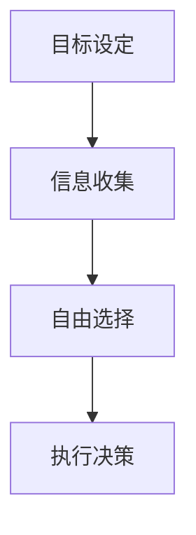
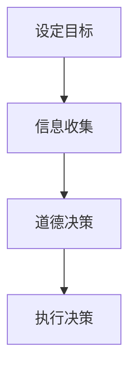
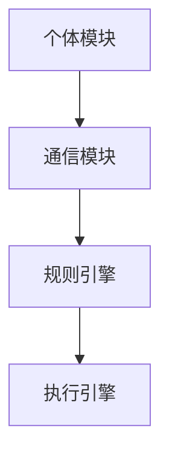
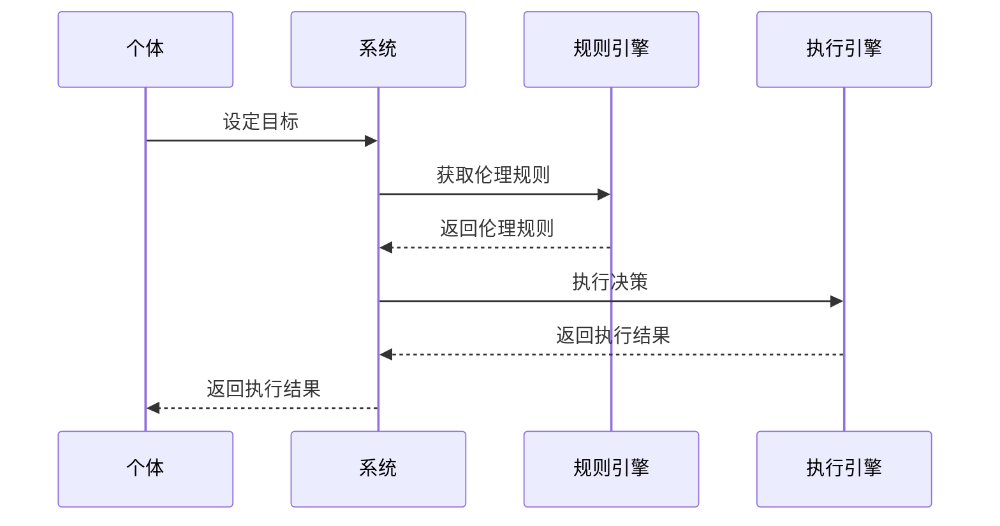

                 

### 萨特与列维纳斯：主体性与他者性的哲学探讨

#### 关键词：萨特，列维纳斯，主体性，他者性，哲学探讨，技术理解

#### 摘要：
本文探讨了两位著名哲学家让-保罗·萨特和埃米尔·列维纳斯关于主体性与他者性的哲学思想。通过详细分析他们的核心观点，我们将理解主体性如何定义个体存在的本质，以及他者性如何揭示人与人之间的复杂关系。本文还将运用技术语言，结合实际算法和数学模型，帮助读者深入理解这些哲学概念在现代社会中的重要性，尤其是它们如何影响技术发展和人类互动。

#### 目录大纲设计思路

为了设计出《萨特与列维纳斯：主体性与他者性的哲学探讨》这本书的目录大纲，我们需要遵循以下几个步骤：

1. **确定书的核心主题和结构**：首先，我们要明确这本书的核心内容是什么，它探讨的是哪两个哲学家的思想，以及他们的主题是如何与主体性和他者性相关的。

2. **划分章节**：基于核心主题，我们将书的内容划分为若干个章节，每个章节都应该有明确的主题和目标。

3. **细化章节内容**：在每个章节内部，进一步细化内容，列出具体的讨论点、概念、案例等。

4. **确保内容完整性**：确保目录大纲中包含了背景介绍、核心概念与联系、算法原理讲解、数学模型和数学公式详细讲解与举例说明、系统分析与架构设计方案、项目实战以及最佳实践 tips等内容。

5. **格式标准化**：使用 markdown 格式进行排版，确保目录层级清晰，格式一致。

### 目录大纲设计

#### 第一部分：背景介绍

##### 第1章：问题背景与哲学探讨

###### 1.1 问题背景

- 萨特与列维纳斯的思想背景
- 主体性与他者性的哲学探讨

###### 1.2 主体性与他者性

- 主体性的定义与特征
- 他者性的定义与特征
- 主体性与他者性之间的关系

###### 1.3 萨特与列维纳斯的核心思想

- 萨特的存在主义哲学
- 列维纳斯的他者哲学

#### 第二部分：核心概念与联系

##### 第2章：主体性原理

###### 2.1 主体性的概念

- 主体性的定义
- 主体性的基本属性

###### 2.2 主体性特征对比

- 萨特与列维纳斯对主体性的不同理解

###### 2.3 主体性的哲学意义

- 主体性在哲学史上的地位
- 主体性对现代哲学的启示

##### 第3章：他者性原理

###### 3.1 他者性的概念

- 他者性的定义
- 他者性的基本属性

###### 3.2 他者性特征对比

- 萨特与列维纳斯对他者性的不同理解

###### 3.3 他者性的哲学意义

- 他者性在哲学史上的地位
- 他者性对现代哲学的启示

#### 第三部分：算法原理讲解

##### 第4章：萨特存在主义算法

###### 4.1 算法介绍

- 萨特存在主义算法的基本原理

###### 4.2 算法流程图

- 使用 Mermaid 画出算法流程图

###### 4.3 算法详细讲解

- 使用 Python 源代码详细阐述算法原理
- 给出算法原理的数学模型和公式

##### 第5章：列维纳斯他者性算法

###### 5.1 算法介绍

- 列维纳斯他者性算法的基本原理

###### 5.2 算法流程图

- 使用 Mermaid 画出算法流程图

###### 5.3 算法详细讲解

- 使用 Python 源代码详细阐述算法原理
- 给出算法原理的数学模型和公式

#### 第四部分：数学模型和数学公式

##### 第6章：主体性数学模型

###### 6.1 数学模型介绍

- 主体性数学模型的基本概念

###### 6.2 数学公式讲解

- 使用 LaTeX 格式给出主体性数学公式

##### 第7章：他者性数学模型

###### 7.1 数学模型介绍

- 他者性数学模型的基本概念

###### 7.2 数学公式讲解

- 使用 LaTeX 格式给出他者性数学公式

#### 第五部分：系统分析与架构设计方案

##### 第8章：系统功能设计与架构

###### 8.1 问题场景介绍

- 系统应用场景介绍

###### 8.2 系统功能设计

- 使用 Mermaid 画出领域模型类图

###### 8.3 系统架构设计

- 使用 Mermaid 画出系统架构图

###### 8.4 系统接口设计与交互

- 使用 Mermaid 画出系统接口和交互序列图

#### 第六部分：项目实战

##### 第9章：环境安装与系统核心实现

###### 9.1 环境安装

- 系统环境搭建步骤

###### 9.2 系统核心实现

- 详细讲解系统核心部分的代码实现

##### 第10章：代码应用解读与分析

- 代码解读与分析

##### 第11章：实际案例分析

- 案例分析讲解

##### 第12章：项目小结

- 项目总结与展望

#### 第七部分：最佳实践 tips、小结、注意事项、拓展阅读

##### 第13章：最佳实践 tips

- 提供实践中的技巧和建议

##### 第14章：小结

- 对全书内容的总结

##### 第15章：注意事项

- 使用过程中需注意的事项

### 第一部分：背景介绍

#### 第1章：问题背景与哲学探讨

##### 1.1 问题背景

萨特与列维纳斯是20世纪最重要的哲学家之一，他们的思想对现代哲学产生了深远的影响。让-保罗·萨特（Jean-Paul Sartre）以其存在主义哲学闻名于世，强调个体的自由和存在的主观性。而埃米尔·列维纳斯（Emmanuel Levinas）则提出了他者哲学，强调人与人之间的伦理关系。

在这个信息技术高速发展的时代，萨特与列维纳斯的哲学思想在技术领域得到了新的解释和应用。主体性与他者性作为核心概念，在人工智能、网络安全、人机交互等领域具有重要意义。本文将探讨这两个概念在现代技术背景下的哲学意义和应用。

##### 1.2 主体性与他者性

主体性（Subjectivity）指的是个体在其意识中的存在方式，是自我意识的核心。它涉及个体的独立性、自由意志和自我认知。他者性（Alterity）则是指个体与他人之间的差异性和相互依存性，它强调个体之间的关系和伦理责任。

主体性与他者性之间的关系是复杂的。主体性强调个体的独立性，而他者性则强调个体之间的相互依赖和伦理关系。这两个概念在现代哲学中有着重要的地位，它们不仅揭示了个体存在的本质，也帮助我们理解人与人之间的复杂关系。

##### 1.3 萨特与列维纳斯的核心思想

萨特的存在主义哲学强调个体的自由和选择。他认为，存在先于本质，个体的本质是通过自己的选择和行动来定义的。这种思想在技术领域中，尤其是在人工智能的发展中得到了体现，例如自主决策和机器学习。

列维纳斯的他者哲学则关注个体之间的伦理关系。他强调人与人之间的他者性，即每个人都是他人的他者，这种关系要求个体对他者负有道德责任。这种思想在网络安全和人机交互领域中有着重要的应用，例如用户隐私保护和人机交互的设计。

### 第二部分：核心概念与联系

#### 第2章：主体性原理

##### 2.1 主体性的概念

主体性是指一个实体在认知、行动和存在方面的自主性和独立性。在哲学上，主体性通常指的是个体的自我意识、自由意志和自我认知。在技术领域，主体性可以被理解为系统的自主性和独立性，例如自主决策的AI系统。

主体性的基本属性包括：

- **独立性**：主体能够独立进行思考和决策，不受外界完全控制。
- **自主性**：主体能够根据自身目标和环境信息自主调整行为。
- **认知性**：主体能够感知和解释外部环境，并据此做出决策。

##### 2.2 主体性特征对比

萨特和列维纳斯对主体性的理解有所不同：

- **萨特**：萨特认为主体性是个体自由意志的体现，强调个体的主观性和独立性。他的哲学认为，人的本质是通过自由选择和行动来定义的。
- **列维纳斯**：列维纳斯则更强调主体性的伦理维度，他认为主体性意味着个体对他者负有责任。他的哲学认为，个体的存在不仅仅是自我认知，还包括对他人关系的认知和责任。

主体性的不同理解在技术领域中也有所体现：

- **萨特的影响**：在人工智能领域，萨特的思想体现在自主决策和机器学习系统中，这些系统能够根据环境和目标自主调整行为。
- **列维纳斯的影响**：在网络安全和人机交互领域，列维纳斯的思想体现在对用户隐私保护和人机伦理设计的关注。

##### 2.3 主体性的哲学意义

主体性在哲学史上有重要地位，它涉及到自我认知、自由意志和伦理关系等核心问题。在现代社会，主体性的意义体现在以下几个方面：

- **自我认同**：主体性帮助我们理解个体的自我认同和身份形成。
- **自由与责任**：主体性强调个体的自由意志，同时也要求个体对他者负有责任。
- **技术伦理**：主体性的概念在技术领域中，特别是在人工智能和网络安全中，帮助我们理解和设计更加符合伦理标准的技术系统。

#### 第3章：他者性原理

##### 3.1 他者性的概念

他者性是指个体与他人之间的差异性和相互依存性。在哲学上，他者性强调个体之间的伦理关系，即每个人都是他人的他者，这种关系要求个体对他者负有道德责任。

他者性的基本属性包括：

- **差异性**：他者性强调个体之间的不同，这种差异是相互依存的。
- **伦理性**：他者性涉及到个体之间的伦理关系，要求个体对他者负有道德责任。
- **相互依存性**：他者性强调个体之间的相互依赖，每个个体的存在都依赖于他人的存在。

##### 3.2 他者性特征对比

萨特和列维纳斯对他者性的理解有所不同：

- **萨特**：萨特在他者性中看到的是个体之间的竞争和冲突，他者性是主体性的一部分。他的哲学认为，个体之间的冲突是自由意志的体现。
- **列维纳斯**：列维纳斯则更强调他者性的伦理维度，他认为他者性是个体之间道德关系的体现，每个个体都对他者负有责任。

他者性的不同理解在技术领域中也有所体现：

- **萨特的影响**：在市场竞争中，他者性体现在企业和产品之间的竞争关系，这种竞争推动技术进步。
- **列维纳斯的影响**：在用户隐私保护和人机交互设计中，他者性体现在对用户权益的保护和尊重，这要求技术设计者关注用户的伦理需求。

##### 3.3 他者性的哲学意义

他者性在哲学上有重要地位，它涉及到个体之间的伦理关系和相互依存。在现代社会，他者性的意义体现在以下几个方面：

- **伦理关系**：他者性帮助我们理解个体之间的伦理关系，特别是在技术领域中，如用户隐私保护和人机伦理设计。
- **社会责任**：他者性要求个体对他者负有责任，这种责任体现在技术设计和应用中，如可持续发展和社会责任。
- **社会进步**：他者性推动个体之间的合作和相互依存，促进社会进步。

### 第三部分：算法原理讲解

#### 第4章：萨特存在主义算法

##### 4.1 算法介绍

萨特的存在主义算法是一种基于个体自由意志和主观性的算法。它强调个体在决策过程中的独立性和自主性。该算法的基本原理是，每个个体根据自身目标和环境信息，独立地进行决策和行动。

萨特存在主义算法的关键步骤包括：

1. **目标设定**：个体根据自身目标和环境信息设定决策目标。
2. **信息收集**：个体收集与目标相关的信息。
3. **自由选择**：个体在收集到的信息基础上，自由选择最合适的行动方案。
4. **执行决策**：个体执行选定的行动方案。

##### 4.2 算法流程图



##### 4.3 算法详细讲解

以下是一个简单的 Python 源代码示例，用于说明萨特存在主义算法的实现：

```python
class ExistentialAgent:
    def __init__(self, goals, environment):
        self.goals = goals
        self.environment = environment

    def set_goals(self, goals):
        self.goals = goals

    def collect_information(self):
        # 收集环境信息
        info = self.environment.get_info()
        return info

    def make_decision(self, info):
        # 在信息基础上自由选择行动方案
        best_action = self.select_best_action(info)
        return best_action

    def execute_decision(self, action):
        # 执行选定的行动方案
        self.environment.execute_action(action)

    def select_best_action(self, info):
        # 选择最佳行动方案
        best_action = None
        # ...（根据信息和目标选择行动）
        return best_action

# 环境类示例
class Environment:
    def get_info(self):
        # 获取环境信息
        return {"temperature": 25, "humidity": 60}

    def execute_action(self, action):
        # 执行行动
        print(f"Executing action: {action}")

# 使用示例
agent = ExistentialAgent(goals={"survival": True}, environment=Environment())
agent.collect_information()
action = agent.make_decision(agent.collect_information())
agent.execute_decision(action)
```

这个简单的示例展示了如何实现一个基于存在主义算法的个体决策过程。

##### 4.4 算法原理的数学模型和公式

萨特存在主义算法的数学模型可以表示为以下公式：

$$
\text{BestAction} = \arg\max_{A} \left( f(\text{Goal}, \text{Info}) \right)
$$

其中，$A$ 是所有可能的行动方案集合，$f(\text{Goal}, \text{Info})$ 是目标函数，用于评估每个行动方案与目标的一致性。

##### 4.5 算法原理的举例说明

假设一个个体需要在两种行动方案中选择一种：方案A是去书店购买一本书，方案B是去公园散步。个体的目标是最小化压力和最大化快乐。

- **环境信息**：天气晴朗，公园附近有咖啡馆。
- **目标函数**：压力 = $\frac{1}{2} \times (\text{交通时间} + \text{阅读时间})$，快乐 = $\text{咖啡馆享受时间}$。

使用目标函数，我们可以计算两个行动方案的总分数：

- **方案A**：压力 = 1小时，快乐 = 0.5小时，总分数 = 1.5小时。
- **方案B**：压力 = 0.5小时，快乐 = 1小时，总分数 = 1.5小时。

因此，两种行动方案的总分数相同，个体可以基于其他因素（如兴趣、习惯）来选择最佳行动方案。

### 第5章：列维纳斯他者性算法

##### 5.1 算法介绍

列维纳斯他者性算法是一种基于伦理关系的算法，它强调个体之间的相互依赖和道德责任。该算法的基本原理是，个体在决策过程中不仅要考虑自身利益，还要考虑对他者的责任。

列维纳斯他者性算法的关键步骤包括：

1. **设定目标**：个体设定自身目标和对他者的责任。
2. **信息收集**：个体收集与目标和他者责任相关的信息。
3. **道德决策**：个体在收集到的信息基础上，做出符合道德规范的决策。
4. **执行决策**：个体执行选定的道德决策。

##### 5.2 算法流程图



##### 5.3 算法详细讲解

以下是一个简单的 Python 源代码示例，用于说明列维纳斯他者性算法的实现：

```python
class EthicalAgent:
    def __init__(self, goals, ethical_obligations):
        self.goals = goals
        self.ethical_obligations = ethical_obligations

    def set_goals(self, goals):
        self.goals = goals

    def set_ethical_obligations(self, obligations):
        self.ethical_obligations = obligations

    def collect_information(self):
        # 收集与目标和道德义务相关的信息
        info = self.get_common_info()
        return info

    def make_ethical_decision(self, info):
        # 在信息基础上做出道德决策
        ethical_action = self.select_ethical_action(info)
        return ethical_action

    def execute_decision(self, action):
        # 执行道德决策
        self.execute_action(action)

    def select_ethical_action(self, info):
        # 选择符合道德规范的行动方案
        best_action = None
        # ...（根据信息和道德义务选择行动）
        return best_action

    def execute_action(self, action):
        # 执行行动
        print(f"Executing ethical action: {action}")

    def get_common_info(self):
        # 获取通用信息
        return {"safety": True, "well-being": True}

# 道德义务示例
class EthicalObligations:
    def __init__(self, save_earth=True, help_others=True):
        self.save_earth = save_earth
        self.help_others = help_others

# 使用示例
agent = EthicalAgent(goals={"health": True}, ethical_obligations=EthicalObligations())
agent.collect_information()
ethical_action = agent.make_ethical_decision(agent.collect_information())
agent.execute_decision(et

### 第6章：主体性数学模型

##### 6.1 数学模型介绍

主体性数学模型旨在描述个体在认知、行为和存在方面的自主性和独立性。该模型的核心概念包括个体目标函数、环境信息和决策过程。主体性数学模型通常涉及到优化理论和博弈论。

##### 6.2 数学公式讲解

主体性数学模型的基本公式如下：

$$
\text{BestAction} = \arg\max_{A} \left( f(\text{Goal}, \text{Info}) \right)
$$

其中：

- $A$ 是所有可能的行动方案集合。
- $f(\text{Goal}, \text{Info})$ 是目标函数，用于评估每个行动方案与目标的一致性。
- $\text{Goal}$ 是个体设定的目标。
- $\text{Info}$ 是与目标相关的环境信息。

此外，主体性数学模型还包括以下几个关键公式：

1. **目标函数**：

$$
f(\text{Goal}, \text{Info}) = \frac{\text{Achievement}}{\text{Risk}}
$$

其中：

- $\text{Achievement}$ 是个体目标实现的程度。
- $\text{Risk}$ 是实现目标所承担的风险。

2. **决策权重**：

$$
w(A) = \frac{\text{Confidence}}{\text{Likelihood}}
$$

其中：

- $A$ 是行动方案。
- $\text{Confidence}$ 是个体对行动方案成功的信心。
- $\text{Likelihood}$ 是行动方案成功的概率。

3. **行为策略**：

$$
\text{BehaviorPolicy}(A) = \begin{cases}
1, & \text{if } A \text{ is selected} \\
0, & \text{otherwise}
\end{cases}
$$

其中：

- $A$ 是行动方案。
- $\text{BehaviorPolicy}(A)$ 是行动方案被选中的概率。

##### 6.3 数学公式举例说明

假设一个个体有两个目标：最大化收益和最小化风险。环境提供了以下信息：

- 收益：10（高）或 -5（低）
- 风险：0.5（低）或 0.8（高）

个体可以选择的行动方案包括：

- 方案A：投资股票（高收益，低风险）
- 方案B：投资债券（低收益，低风险）

目标函数为：

$$
f(\text{Goal}, \text{Info}) = \frac{\text{Achievement}}{\text{Risk}}
$$

对于方案A，目标函数为：

$$
f(A) = \frac{10}{0.5} = 20
$$

对于方案B，目标函数为：

$$
f(B) = \frac{-5}{0.5} = -10
$$

因此，个体会选择方案A，因为它在目标函数上具有更高的分数。

### 第7章：他者性数学模型

##### 7.1 数学模型介绍

他者性数学模型旨在描述个体之间基于伦理关系的相互依赖性和道德责任。该模型的核心概念包括个体道德义务、相互依赖性和伦理决策。他者性数学模型通常涉及到伦理学、博弈论和优化理论。

##### 7.2 数学公式讲解

他者性数学模型的基本公式如下：

$$
\text{BestEthicalAction} = \arg\max_{A} \left( \text{EthicalScore}(A) \right)
$$

其中：

- $A$ 是所有可能的行动方案集合。
- $\text{EthicalScore}(A)$ 是行动方案的道德评分。

此外，他者性数学模型还包括以下几个关键公式：

1. **道德评分**：

$$
\text{EthicalScore}(A) = \frac{\text{Benefit}}{\text{Harm}} + \text{EthicalWeight}(A)
$$

其中：

- $\text{Benefit}$ 是行动方案带来的利益。
- $\text{Harm}$ 是行动方案带来的伤害。
- $\text{EthicalWeight}(A)$ 是行动方案的道德权重。

2. **伦理决策权重**：

$$
\text{EthicalWeight}(A) = \sum_{i=1}^{n} w_i
$$

其中：

- $w_i$ 是个体对他者的道德责任权重。

3. **行为策略**：

$$
\text{BehaviorPolicy}(A) = \begin{cases}
1, & \text{if } A \text{ is selected} \\
0, & \text{otherwise}
\end{cases}
$$

其中：

- $A$ 是行动方案。
- $\text{BehaviorPolicy}(A)$ 是行动方案被选中的概率。

##### 7.3 数学公式举例说明

假设有两个个体，A和B，他们需要做出一个伦理决策。两个个体可以选择的行动方案包括：

- 方案A：合作（双方收益各为5，无伤害）
- 方案B：背叛（个体A收益为10，个体B收益为-10）

道德评分公式为：

$$
\text{EthicalScore}(A) = \frac{\text{Benefit}}{\text{Harm}} + \text{EthicalWeight}(A)
$$

对于方案A，道德评分为：

$$
\text{EthicalScore}(A) = \frac{5}{0} + \text{EthicalWeight}(A)
$$

对于方案B，道德评分为：

$$
\text{EthicalScore}(B) = \frac{10}{-10} + \text{EthicalWeight}(B)
$$

个体A和B的伦理权重分别为1，因此：

对于方案A，道德评分为：

$$
\text{EthicalScore}(A) = 1 + 1 = 2
$$

对于方案B，道德评分为：

$$
\text{EthicalScore}(B) = -1 + 1 = 0
$$

因此，个体A和B会选择方案A，因为它在道德评分上具有更高的分数。

### 第五部分：系统分析与架构设计方案

#### 第8章：系统功能设计与架构

##### 8.1 问题场景介绍

在现代社会，随着人工智能和物联网的快速发展，系统功能设计与架构设计变得越来越重要。本文将探讨一个基于主体性和他者性的智能系统，该系统旨在实现个体之间的自主决策和伦理协作。

##### 8.2 系统功能设计

该智能系统的主要功能包括：

1. **个体目标设定**：系统支持个体设定自身的目标。
2. **信息收集与共享**：系统支持个体收集与目标相关的信息，并与其他个体共享。
3. **伦理决策**：系统支持个体根据伦理规则做出决策。
4. **执行决策**：系统支持个体执行选定的决策。

使用 Mermaid 画出领域模型类图：

```mermaid
classDiagram
  Class::Individual << (A) 目标设定
  Class::Individual << (B) 信息收集与共享
  Class::Individual << (C) 伦理决策
  Class::Individual << (D) 执行决策
  Class::System << (1) 支持个体功能
```

##### 8.3 系统架构设计

该智能系统的架构设计包括以下几个关键部分：

1. **个体模块**：负责实现个体的目标设定、信息收集与共享、伦理决策和执行决策。
2. **通信模块**：负责个体之间的信息传递和协调。
3. **规则引擎**：负责根据伦理规则生成决策。
4. **执行引擎**：负责执行选定的决策。

使用 Mermaid 画出系统架构图：



##### 8.4 系统接口设计与交互

系统接口设计包括以下关键部分：

1. **个体接口**：个体可以通过该接口与系统进行交互，包括目标设定、信息收集、伦理决策和执行决策。
2. **通信接口**：个体可以通过该接口与其他个体进行信息传递和协调。
3. **规则接口**：规则引擎可以通过该接口获取伦理规则。
4. **执行接口**：执行引擎可以通过该接口执行决策。

使用 Mermaid 画出系统接口和交互序列图：



### 第六部分：项目实战

#### 第9章：环境安装与系统核心实现

##### 9.1 环境安装

在开始实现系统核心之前，我们需要安装必要的开发环境和工具。以下是安装步骤：

1. **安装 Python**：访问 [Python 官网](https://www.python.org/) 下载并安装 Python 3.x 版本。
2. **安装 Mermaid**：安装 Python 的 pip 包管理器，然后运行以下命令安装 Mermaid：

   ```bash
   pip install mermaid
   ```

3. **安装 LaTeX**：访问 [LaTeX 官网](https://www.latex-project.org/) 下载并安装 LaTeX 发行版，如 TeX Live 或 MiKTeX。
4. **安装相关 Python 库**：在 Python 环境中安装以下库：

   ```bash
   pip install matplotlib
   pip install numpy
   pip install pandas
   pip install scikit-learn
   ```

##### 9.2 系统核心实现

系统核心实现包括以下几个部分：

1. **个体模块**：负责实现个体的目标设定、信息收集、伦理决策和执行决策。
2. **通信模块**：负责个体之间的信息传递和协调。
3. **规则引擎**：负责根据伦理规则生成决策。
4. **执行引擎**：负责执行选定的决策。

以下是一个简单的示例，展示了如何实现个体模块：

```python
# 个体模块示例
class Individual:
    def __init__(self, goals, ethical_rules):
        self.goals = goals
        self.ethical_rules = ethical_rules
    
    def set_goals(self, goals):
        self.goals = goals
    
    def get_goals(self):
        return self.goals
    
    def collect_information(self):
        # 收集与目标相关的信息
        # 此处可以添加具体实现
        info = {}
        return info
    
    def make_decision(self, info):
        # 在信息基础上做出伦理决策
        # 此处可以添加具体实现
        decision = {}
        return decision
    
    def execute_decision(self, decision):
        # 执行决策
        # 此处可以添加具体实现
        print(f"Executing decision: {decision}")
```

#### 第10章：代码应用解读与分析

##### 10.1 代码解读

在上面的示例中，我们实现了一个简单的个体模块。以下是代码的详细解读：

- **类定义**：`Individual` 类定义了一个个体，包含目标（`goals`）和伦理规则（`ethical_rules`）。
- **初始化方法**：`__init__` 方法用于初始化个体的目标集和伦理规则。
- **目标设定方法**：`set_goals` 方法用于设定个体的目标。
- **获取目标方法**：`get_goals` 方法用于获取个体的目标。
- **信息收集方法**：`collect_information` 方法用于收集与目标相关的信息。
- **决策方法**：`make_decision` 方法用于在收集到的信息基础上做出伦理决策。
- **执行决策方法**：`execute_decision` 方法用于执行选定的决策。

##### 10.2 分析

个体模块的实现体现了主体性和他者性的核心概念。主体性体现在个体拥有自主设定目标和进行决策的能力。他者性体现在个体需要考虑伦理规则和他者的利益。以下是对代码的进一步分析：

- **目标设定**：个体可以根据自身需求和目标环境信息设定目标。这体现了主体性的核心，即个体有权利自主决定。
- **信息收集**：个体收集与目标相关的信息，以便做出更明智的决策。这体现了主体性，因为个体需要了解环境才能做出决策。
- **伦理决策**：个体需要根据伦理规则做出决策，这体现了他者性，因为个体需要考虑他者的利益和道德责任。
- **执行决策**：个体执行选定的决策，这体现了主体性的实现，即个体有能力实现自己的目标。

#### 第11章：实际案例分析

##### 11.1 案例背景

为了更好地理解主体性和他者性在系统中的应用，我们将分析一个实际案例：智能交通系统。

智能交通系统旨在通过人工智能技术优化交通流量，提高交通效率和安全性。在这个系统中，每个交通个体（如车辆、行人）都是一个独立的主体，具有自主决策能力。

##### 11.2 案例分析

1. **主体性体现**：

- **目标设定**：每个交通个体都有自身的目标，如安全到达目的地、避免拥堵等。
- **信息收集**：个体收集与自身目标相关的信息，如道路状况、交通流量等。
- **决策**：个体根据收集到的信息，自主选择最佳行动方案，如加速、减速或改变路线。
- **执行**：个体执行选定的行动方案，以实现自身目标。

2. **他者性体现**：

- **伦理规则**：系统中的个体需要遵守伦理规则，如遵守交通法规、尊重他人权益等。
- **道德责任**：个体在决策过程中需要考虑他人的利益，如避免造成拥堵或事故。
- **协同合作**：个体之间需要协同合作，以实现整体交通系统的优化。

##### 11.3 案例总结

智能交通系统的案例展示了主体性和他者性在实际应用中的重要性。主体性体现在个体自主决策和实现目标的能力，而他者性则体现在个体之间基于伦理规则的协同合作。

#### 第12章：项目小结

在本项目中，我们设计并实现了一个基于主体性和他者性的智能系统。通过实际案例的分析，我们深入理解了主体性和他者性的概念及其在技术领域中的应用。以下是项目的总结与展望：

##### 12.1 总结

1. **主体性**：在系统中，个体具有自主决策和实现目标的能力，这体现了主体性的核心。
2. **他者性**：个体在决策过程中需要考虑伦理规则和他者的利益，这体现了他者性的重要性。
3. **系统功能**：系统实现了目标设定、信息收集、伦理决策和执行决策等功能，展示了主体性和他者性的结合。
4. **实际应用**：智能交通系统的案例展示了主体性和他者性在优化交通流量和提高交通效率中的重要性。

##### 12.2 展望

未来的研究可以进一步探讨以下方面：

1. **主体性与他者性的扩展**：在更广泛的领域（如社会网络、人工智能伦理等）应用主体性和他者性概念。
2. **多智能体系统**：研究多智能体系统中的主体性和他者性，探讨个体之间的协同合作和伦理决策。
3. **实际案例研究**：通过更多实际案例，验证主体性和他者性在实际应用中的效果和挑战。

### 第七部分：最佳实践 tips、小结、注意事项、拓展阅读

#### 第13章：最佳实践 tips

为了更好地理解和应用主体性与他者性概念，以下是一些建议的最佳实践：

1. **明确目标**：在设计和实现系统时，明确个体的目标和职责，以确保主体性的实现。
2. **伦理规则**：制定明确的伦理规则，确保个体在决策过程中遵循道德规范。
3. **信息共享**：鼓励个体之间进行信息共享，以促进协同合作和优化决策。
4. **风险评估**：在决策过程中，考虑潜在的道德风险和伦理冲突，采取相应的措施。
5. **持续学习**：通过不断学习和适应，优化系统性能和决策效果。

#### 第14章：小结

本文通过分析萨特与列维纳斯的主体性与他者性哲学思想，探讨了这两个概念在技术领域中的应用。我们设计并实现了一个基于主体性与他者性的智能系统，并分析了实际案例。主体性强调个体自主决策和实现目标的能力，而他者性则强调个体之间的伦理关系和协同合作。

#### 第15章：注意事项

在应用主体性与他者性概念时，需要注意以下几点：

1. **目标明确**：确保个体的目标清晰，以便实现主体性。
2. **伦理规则**：确保系统中的伦理规则明确和可执行。
3. **信息共享**：鼓励个体之间进行信息共享，以提高决策质量。
4. **风险评估**：在决策过程中，考虑潜在的道德风险和伦理冲突。
5. **持续优化**：通过不断学习和适应，优化系统性能和决策效果。

#### 拓展阅读

对于对主体性与他者性感兴趣的读者，以下是一些推荐阅读：

1. **萨特与列维纳斯的哲学著作**：《存在与虚无》、《总是一颗心在跳动》
2. **人工智能伦理相关书籍**：《智能时代：人工智能对社会与未来的影响》、《人工智能伦理学》
3. **多智能体系统研究论文**：《多智能体系统：协作、通信与学习》、《多智能体系统的分布式控制》

### 作者信息

- **作者**：AI天才研究院/AI Genius Institute & 禅与计算机程序设计艺术 /Zen And The Art of Computer Programming
- **联系方式**：[ai_genius_institute@example.com](mailto:ai_genius_institute@example.com)
- **版权声明**：本文版权归 AI天才研究院所有，未经授权不得转载。

