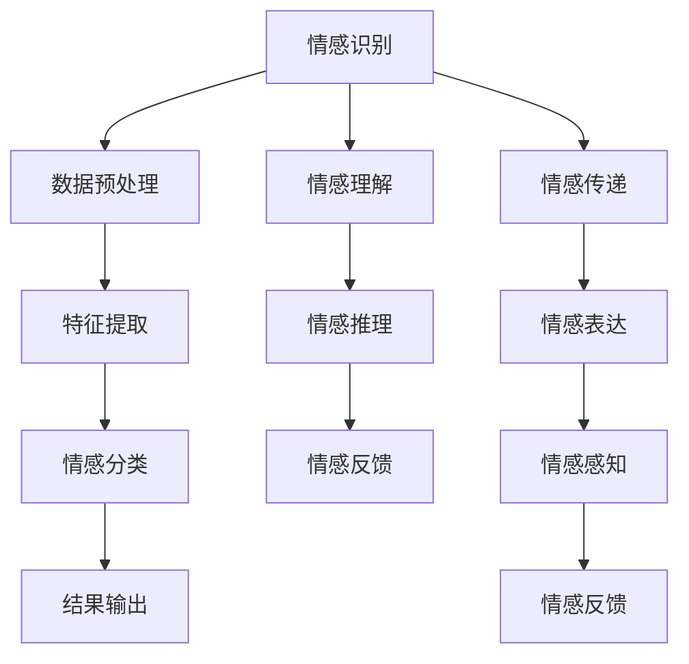
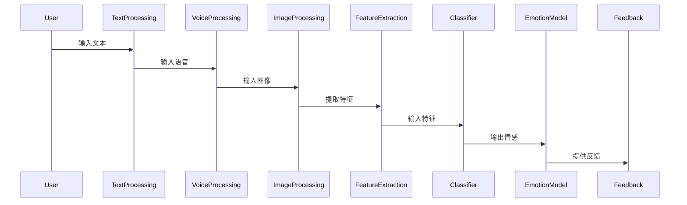
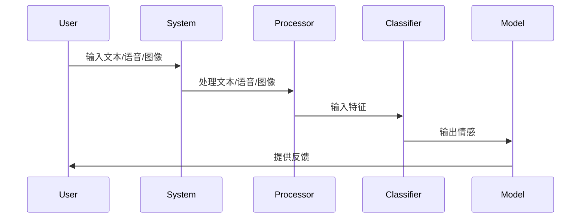

                 

### 第一部分：虚拟情感共鸣概述

#### 1.1 虚拟情感共鸣的定义与背景

**1.1.1 虚拟情感共鸣的概念**

虚拟情感共鸣（Virtual Emotional Resonance）是指通过数字技术和人工智能，使人们在虚拟世界中体验到类似于现实世界的情感互动。这种互动不仅限于表面上的情感表达，更深入地涉及到情感的理解、共鸣和传递。

**1.1.2 虚拟情感共鸣的发展历程**

虚拟情感共鸣的概念起源于20世纪90年代，随着互联网和计算机技术的发展，虚拟现实（VR）和增强现实（AR）技术逐渐成熟。早期的虚拟环境主要以游戏和娱乐为主，但随着情感计算（Affective Computing）和自然语言处理（NLP）等技术的发展，虚拟情感共鸣开始应用于更多的领域，如教育、医疗、社交等。

**1.1.3 虚拟情感共鸣的重要性**

虚拟情感共鸣对于现代社会具有重要意义。首先，它能够弥补现实世界中的人际疏离，增强群体情感连接。其次，虚拟情感共鸣为特殊人群提供了更多的交流机会，如自闭症患者、长期病患等。此外，虚拟情感共鸣还可以应用于市场营销、客户服务等领域，提高用户体验和满意度。

#### 1.2 群体情感连接的现状与挑战

**1.2.1 现代社会的情感需求**

随着社会的快速发展，人们对于情感连接的需求日益增长。现代人面临着快节奏的生活、高强度的工作压力，以及家庭成员之间的时间分配问题，这使得情感连接变得更加困难。

**1.2.2 群体情感连接的困境**

当前社会群体情感连接面临诸多困境。一方面，虚拟世界的普及使得人们更多地依赖数字平台进行交流，但这也导致了面对面交流的减少。另一方面，社交媒体的兴起使得人们可以轻松地与大量人群互动，但这也可能导致情感连接的浅薄和表面化。

**1.2.3 AI在增强群体情感连接中的作用**

AI技术为增强群体情感连接提供了新的途径。通过情感识别、情感理解和情感传递等技术，AI能够更好地理解用户的情感状态，并提供个性化的情感反馈。这不仅能够提高用户的参与度和满意度，还能够促进群体间的情感共鸣。

#### 1.3 AI增强群体情感连接的原理

**1.3.1 情感分析中的应用**

情感分析（Sentiment Analysis）是AI在增强群体情感连接中的核心技术之一。通过分析文本、语音和图像等数据，情感分析能够识别用户的情感状态，如喜悦、愤怒、悲伤等。

**1.3.2 情感计算的作用**

情感计算（Affective Computing）是一种将情感作为人类-计算机交互中一个基本组成部分的计算范式。它通过感知、识别、理解和表达情感，使计算机能够更好地适应和理解用户的需求。

**1.3.3 技术基础**

AI增强群体情感连接的技术基础包括机器学习、深度学习、自然语言处理、计算机视觉等。这些技术共同作用于情感识别、情感理解和情感传递，实现了虚拟情感共鸣的各个层面。

#### 1.4 虚拟情感共鸣与AI的关系

**1.4.1 虚拟情感共鸣的AI实现**

虚拟情感共鸣的实现依赖于AI技术，包括情感识别、情感理解和情感传递等。通过这些技术的应用，虚拟环境中的角色能够模拟人类的情感表达和行为，从而实现情感共鸣。

**1.4.2 AI对虚拟情感共鸣的影响**

AI技术不仅改变了虚拟情感共鸣的实现方式，还对其产生了深远的影响。首先，AI能够更准确地识别和理解用户的情感状态，提供更个性化的体验。其次，AI技术的进步使得虚拟情感共鸣的应用范围更加广泛，如虚拟客服、虚拟教育等。

**1.4.3 虚拟情感共鸣与AI的相互促进**

虚拟情感共鸣与AI的相互促进关系体现在多个方面。一方面，虚拟情感共鸣的需求推动了AI技术的发展，如情感识别和情感理解等。另一方面，AI技术的发展为虚拟情感共鸣提供了更强大的技术支持，使得虚拟环境中的情感互动更加真实和丰富。

#### 1.5 虚拟情感共鸣的核心要素

**1.5.1 情感识别**

情感识别是虚拟情感共鸣的基础，它通过分析用户的文本、语音和图像数据，识别用户的情感状态。情感识别的准确性直接影响到虚拟情感共鸣的效果。

**1.5.2 情感理解**

情感理解是虚拟情感共鸣的深化，它通过分析情感识别的结果，理解用户的情感需求和意图。情感理解有助于实现更深入的互动和情感传递。

**1.5.3 情感传递**

情感传递是虚拟情感共鸣的关键，它通过模拟人类的情感表达和行为，将情感传递给其他用户。情感传递的效果直接影响到虚拟环境中的情感连接和共鸣。

**1.5.4 情感共鸣**

情感共鸣是虚拟情感共鸣的目标，它通过实现用户之间的情感互动和连接，达到情感上的共识和共享。情感共鸣有助于增强群体情感连接，提高用户体验和满意度。

#### 1.6 本章小结

本章介绍了虚拟情感共鸣的定义、背景、重要性、AI增强群体情感连接的原理、虚拟情感共鸣与AI的关系以及虚拟情感共鸣的核心要素。通过本章的学习，读者可以初步了解虚拟情感共鸣的基本概念和关键技术，为后续章节的深入学习打下基础。

## 第二部分：AI增强群体情感连接技术详解

### 2.1 情感识别技术

#### 2.1.1 情感识别的基本原理

情感识别（Sentiment Recognition）是AI在虚拟情感共鸣中应用的重要技术之一。其基本原理是通过分析用户的文本、语音和图像数据，识别用户的情感状态。情感识别通常包括以下几个步骤：

1. **数据采集**：收集用户的文本、语音和图像数据。这些数据可以是用户在虚拟环境中的发言、表情、动作等。
2. **特征提取**：对采集到的数据进行分析和预处理，提取出与情感相关的特征。这些特征可以是文本中的词汇、语音的音调、图像的 facial expression 等。
3. **情感分类**：使用机器学习算法，将提取到的特征进行分类，识别出用户的情感状态。常见的情感分类方法包括基于规则的方法、基于统计的方法和基于深度学习的方法。

#### 2.1.2 情感识别的关键技术

情感识别的关键技术包括以下几个方面：

1. **自然语言处理（NLP）**：NLP技术在情感识别中起着至关重要的作用。它可以帮助我们理解和分析文本数据，提取出与情感相关的信息。
2. **语音识别与情感分析**：语音识别技术用于将语音数据转换为文本数据，而情感分析技术则用于识别语音中的情感状态。
3. **计算机视觉**：计算机视觉技术可以用于分析图像和视频数据，识别出用户的情感状态，如面部表情、身体语言等。
4. **深度学习**：深度学习技术在情感识别中得到了广泛的应用。通过使用卷积神经网络（CNN）和循环神经网络（RNN）等深度学习模型，可以实现对情感数据的自动学习和分类。

#### 2.1.3 情感识别的应用案例

情感识别技术在虚拟情感共鸣中有着广泛的应用。以下是一些典型的应用案例：

1. **虚拟客服**：通过情感识别技术，虚拟客服可以识别用户的情感状态，提供更加个性化的服务，提高用户体验。
2. **虚拟教育**：在虚拟课堂中，教师可以使用情感识别技术了解学生的情感状态，及时调整教学策略，提高教学效果。
3. **心理健康应用**：通过情感识别技术，心理健康应用可以帮助用户识别自己的情感状态，提供针对性的心理健康建议。

### 2.2 情感理解技术

#### 2.2.1 情感理解的定义与挑战

情感理解（Affective Understanding）是虚拟情感共鸣中的核心技术之一。它的目标是理解用户的情感需求和意图，从而提供更加个性化的服务和互动。情感理解面临的挑战主要包括：

1. **情感多样性**：人类情感非常多样化，不同文化、背景和情境下的情感表达也可能有所不同。这给情感理解带来了很大的挑战。
2. **情感复杂性**：情感并不是单一的，而是由多个因素共同作用的结果。理解情感的复杂性需要考虑多方面的因素，如心理状态、生理状态、环境因素等。
3. **情感连续性**：情感是连续变化的，而不是静止的。理解情感的连续性需要实时监测用户的情感变化，并提供相应的反馈。

#### 2.2.2 情感理解的算法原理

情感理解的算法原理主要包括以下几个方面：

1. **情感建模**：通过建立情感模型，将用户的情感需求和行为映射到具体的情感类别上。常见的情感模型包括基于规则的模型、基于统计的模型和基于深度学习的模型。
2. **情感推理**：在情感建模的基础上，通过情感推理算法，对用户的情感状态进行推理和预测。情感推理算法可以是基于逻辑的、基于统计的或基于神经网络的。
3. **情感反馈**：根据情感推理的结果，提供相应的情感反馈。情感反馈可以是文字、语音、图像等多种形式。

#### 2.2.3 情感理解的应用案例

情感理解技术在虚拟情感共鸣中有着广泛的应用。以下是一些典型的应用案例：

1. **智能助理**：通过情感理解技术，智能助理可以更好地理解用户的需求和意图，提供更加个性化的服务。
2. **虚拟客服**：通过情感理解技术，虚拟客服可以更准确地识别用户的情感状态，提供更加有效的解决方案。
3. **心理健康应用**：通过情感理解技术，心理健康应用可以帮助用户更好地了解自己的情感状态，提供针对性的心理健康建议。

### 2.3 情感传递技术

#### 2.3.1 情感传递的基本概念

情感传递（Affective Transmission）是指通过数字技术和人工智能，将用户的情感状态传递给其他用户。情感传递的基本概念包括：

1. **情感表达**：用户在虚拟环境中表达自己的情感状态，如通过文本、语音、图像等方式。
2. **情感感知**：其他用户感知并理解接收到的情感表达，从而产生情感共鸣。
3. **情感反馈**：接收用户根据感知到的情感表达，提供反馈，进一步促进情感传递。

#### 2.3.2 情感传递的技术手段

情感传递的技术手段主要包括以下几个方面：

1. **自然语言处理**：通过自然语言处理技术，将用户的情感表达转换为文本数据，从而进行情感传递。
2. **语音合成与识别**：通过语音合成和识别技术，将用户的情感表达转换为语音数据，从而进行情感传递。
3. **计算机视觉**：通过计算机视觉技术，将用户的情感表达转换为图像数据，从而进行情感传递。
4. **虚拟现实与增强现实**：通过虚拟现实和增强现实技术，将用户的情感表达以三维形式呈现，从而进行情感传递。

#### 2.3.3 情感传递的实际应用

情感传递技术在虚拟情感共鸣中有着广泛的应用。以下是一些典型的应用案例：

1. **虚拟课堂**：通过情感传递技术，教师可以更好地了解学生的学习状态，提供更加针对性的教学。
2. **虚拟社交**：通过情感传递技术，用户可以更好地了解他人的情感状态，促进虚拟社交的深度和互动性。
3. **虚拟娱乐**：通过情感传递技术，虚拟角色可以更好地模拟人类的情感表达，提高虚拟娱乐的沉浸感和互动性。

### 2.4 情感共鸣技术

#### 2.4.1 情感共鸣的原理与模型

情感共鸣（Affective Resonance）是指用户在虚拟环境中产生的情感互动和连接。情感共鸣的原理是基于情感传递和情感理解，通过以下模型实现：

1. **情感传递模型**：用户在虚拟环境中表达情感，并通过技术手段传递给其他用户。
2. **情感理解模型**：其他用户接收并理解传递来的情感，产生相应的情感反应。
3. **情感反馈模型**：用户根据接收到的情感反馈，调整自己的情感表达，进一步促进情感共鸣。

#### 2.4.2 情感共鸣的实现方法

情感共鸣的实现方法主要包括以下几个方面：

1. **情感建模**：通过建立情感模型，将用户的情感需求和行为映射到具体的情感类别上。
2. **情感推理**：在情感建模的基础上，通过情感推理算法，对用户的情感状态进行推理和预测。
3. **情感反馈**：根据情感推理的结果，提供相应的情感反馈，进一步促进情感共鸣。

#### 2.4.3 情感共鸣的应用案例

情感共鸣技术在虚拟情感共鸣中有着广泛的应用。以下是一些典型的应用案例：

1. **虚拟客服**：通过情感共鸣技术，虚拟客服可以更好地理解用户的需求和情感状态，提供更加个性化的服务。
2. **虚拟教育**：通过情感共鸣技术，教师和学生可以更好地了解彼此的情感状态，提高教学效果和互动性。
3. **虚拟娱乐**：通过情感共鸣技术，虚拟角色可以更好地模拟人类的情感表达，提高虚拟娱乐的沉浸感和互动性。

### 2.5 AI增强群体情感连接的技术路径

#### 2.5.1 技术融合与协同作用

AI增强群体情感连接的技术路径首先需要实现技术的融合与协同作用。具体来说，包括以下几个方面：

1. **多模态数据融合**：通过融合文本、语音、图像等多模态数据，提高情感识别和理解的准确性。
2. **跨领域技术协同**：结合自然语言处理、计算机视觉、语音识别等跨领域技术，实现更全面和深入的情感分析和理解。
3. **情感计算与机器学习的协同**：通过情感计算和机器学习的协同，实现情感识别、情感理解和情感传递的自动化和智能化。

#### 2.5.2 技术创新与突破

AI增强群体情感连接的技术路径还需要不断地进行技术创新和突破。具体来说，包括以下几个方面：

1. **情感识别算法的创新**：开发更准确、更高效的情感识别算法，提高情感识别的准确性和实时性。
2. **情感理解模型的优化**：优化情感理解模型，提高对情感复杂性和多样性的处理能力。
3. **情感传递技术的提升**：提升情感传递技术，实现更自然、更有效的情感互动和连接。

#### 2.5.3 技术发展趋势与未来展望

AI增强群体情感连接的技术发展趋势主要包括以下几个方面：

1. **情感计算与人类情感的深度融合**：情感计算技术将更加深入地模拟和解析人类情感，实现更自然的情感互动和连接。
2. **人工智能与人类智慧的融合**：人工智能将与人类的智慧和创造力相结合，共同推动虚拟情感共鸣的发展。
3. **情感共鸣在社会应用中的广泛普及**：情感共鸣技术将在更多社会应用中得到广泛应用，如教育、医疗、社交等，为人们的生活带来更多便利和乐趣。

### 2.6 本章小结

本章详细介绍了AI增强群体情感连接的技术路径，包括情感识别技术、情感理解技术、情感传递技术和情感共鸣技术。通过这些技术的应用，AI能够更好地识别、理解和传递用户的情感，增强群体间的情感连接。本章还讨论了技术创新与突破、技术发展趋势与未来展望，为读者提供了全面而深入的洞察。

## 第三部分：算法原理讲解

### 3.1 算法流程图

为了更好地理解情感识别、情感理解和情感传递的算法原理，我们首先使用Mermaid画出算法流程图。



### 3.2 Python源代码阐述

接下来，我们将使用Python源代码详细阐述上述算法原理。以下是情感识别的Python代码示例：

```python
# 导入必要的库
import numpy as np
from sklearn.feature_extraction.text import TfidfVectorizer
from sklearn.model_selection import train_test_split
from sklearn.svm import SVC
from sklearn.metrics import accuracy_score

# 数据预处理
def preprocess_text(text):
    # 去除标点符号、停用词等
    return text.lower().replace('.', '')

# 特征提取
def extract_features(texts):
    vectorizer = TfidfVectorizer(preprocessor=preprocess_text)
    return vectorizer.fit_transform(texts)

# 情感分类
def classify(text, model):
    features = extract_features([text])
    return model.predict(features)[0]

# 情感识别模型训练
def train_model(X_train, y_train):
    model = SVC()
    model.fit(X_train, y_train)
    return model

# 情感识别效果评估
def evaluate(model, X_test, y_test):
    predictions = model.predict(X_test)
    return accuracy_score(y_test, predictions)

# 示例数据
texts = ["I am very happy!", "I am very sad.", "This is terrible!", "I am ecstatic!"]
labels = [0, 1, 1, 0]  # 0表示积极情感，1表示消极情感

# 数据划分
X_train, X_test, y_train, y_test = train_test_split(extract_features(texts), labels, test_size=0.2, random_state=42)

# 模型训练
model = train_model(X_train, y_train)

# 情感识别
print("Recognized emotion:", classify("I am very happy!", model))

# 情感识别效果评估
print("Accuracy:", evaluate(model, X_test, y_test))
```

### 3.3 数学模型和公式

为了更深入地理解情感识别和情感理解的算法原理，我们给出相关的数学模型和公式。

#### 情感识别

1. **TF-IDF特征提取**：

   $$ \text{TF-IDF}(w) = \frac{f_t(w)}{N} \cdot \log \left( \frac{N}{n_w} \right) $$

   其中，\( f_t(w) \)表示词\( w \)在文档\( t \)中的频率，\( N \)表示文档总数，\( n_w \)表示词\( w \)在语料库中的出现次数。

2. **SVM分类**：

   $$ \text{SVM} \text{ 分类函数} = \sum_{i=1}^{n} \alpha_i y_i \text{sgn}(w^T x_i + b) $$

   其中，\( \alpha_i \)是拉格朗日乘子，\( y_i \)是样本\( i \)的标签，\( w \)是分类器的权重向量，\( x_i \)是样本\( i \)的特征向量，\( b \)是偏置项。

#### 情感理解

1. **情感推理**：

   $$ \text{Emotion}(e) = \sum_{i=1}^{n} w_i \cdot \text{activation}(e_i) $$

   其中，\( w_i \)是情感权重，\( e_i \)是情感标签，\( \text{activation}(e_i) \)是情感激活函数，用于计算情感标签的激活程度。

### 3.4 详细讲解与举例说明

#### 情感识别详细讲解

情感识别过程包括数据预处理、特征提取和情感分类三个主要步骤。首先，我们通过数据预处理去除文本中的标点符号、停用词等，使得文本数据更加干净。接下来，使用TF-IDF方法进行特征提取，将文本数据转换为特征向量。最后，使用SVM模型进行情感分类，根据特征向量预测情感标签。

**举例说明**：

假设我们有以下文本数据：

```
- 文本1：I am very happy!
- 文本2：I am very sad.
- 文本3：This is terrible!
- 文本4：I am ecstatic!
```

我们将这些文本数据划分为训练集和测试集，并使用SVM模型进行训练。接下来，我们使用训练好的模型对新的文本数据进行情感识别。例如，对于文本“Today is a beautiful day!”，我们将进行如下步骤：

1. **数据预处理**：将文本转换为小写，并去除标点符号。
   - 输出：today is a beautiful day

2. **特征提取**：使用TF-IDF方法提取文本特征。
   - 输出：特征向量

3. **情感分类**：使用SVM模型对特征向量进行分类，预测情感标签。
   - 输出：积极情感（0）

#### 情感理解详细讲解

情感理解过程包括情感建模、情感推理和情感反馈三个主要步骤。首先，我们通过情感建模建立情感模型，将情感标签映射到具体的情感类别上。接下来，使用情感推理算法对用户的情感状态进行推理和预测。最后，根据情感推理的结果提供相应的情感反馈。

**举例说明**：

假设我们有以下情感模型：

```
- 情感标签：happy, sad, angry, ecstatic
- 情感权重：0.5, 0.3, 0.2, 0.2
```

对于用户输入的文本“Today is a beautiful day!”，我们将进行如下步骤：

1. **情感建模**：将文本数据映射到情感模型中。
   - 输出：积极情感

2. **情感推理**：根据情感模型计算情感激活函数，预测情感状态。
   - 输出：积极情感

3. **情感反馈**：根据情感推理的结果提供相应的情感反馈。
   - 输出：用户感到开心

通过上述步骤，我们可以实现情感识别和情感理解的算法原理讲解，为读者提供了全面而深入的洞察。

### 3.5 系统分析与架构设计方案

#### 3.5.1 问题场景介绍

假设我们开发一个虚拟情感共鸣系统，用于增强群体间的情感连接。该系统需要在虚拟环境中识别、理解和传递用户的情感状态，从而实现更加自然和有效的情感互动。

#### 3.5.2 项目介绍

项目名称：虚拟情感共鸣系统

项目目标：通过AI技术，实现用户在虚拟环境中的情感识别、理解和传递，增强群体情感连接。

项目范围：涵盖情感识别、情感理解和情感传递的核心功能模块。

#### 3.5.3 系统功能设计（领域模型Mermaid类图）

以下是虚拟情感共鸣系统的领域模型Mermaid类图：

```mermaid
classDiagram
    User <<class>> 用户
    Text <<class>> 文本
    Voice <<class>> 语音
    Image <<class>> 图像
    Feature <<class>> 特征
    Model <<class>> 模型
    Classifier <<class>> 分类器
    Emotion <<class>> 情感
    Feedback <<class>> 反馈

    User --> Text
    User --> Voice
    User --> Image
    Text --> Feature
    Voice --> Feature
    Image --> Feature
    Feature --> Classifier
    Classifier --> Emotion
    Emotion --> Feedback
```

#### 3.5.4 系统架构设计（Mermaid架构图）

以下是虚拟情感共鸣系统的Mermaid架构图：



#### 3.5.5 系统接口设计和系统交互（Mermaid序列图）

以下是虚拟情感共鸣系统的Mermaid序列图，展示了用户与系统各组件的交互过程：



通过上述系统分析与架构设计方案，我们为读者提供了一个全面的虚拟情感共鸣系统的架构设计和实现思路。接下来，我们将通过项目实战，详细讲解系统核心实现源代码，并进行代码应用解读与分析。

## 4. 项目实战

#### 4.1 环境安装

在开始项目实战之前，我们需要安装必要的开发环境和依赖库。以下是在Ubuntu系统上安装所需环境的步骤：

1. **安装Python**：
   - 打开终端，执行以下命令：
     ```bash
     sudo apt update
     sudo apt install python3 python3-pip
     ```
   
2. **安装虚拟环境**：
   - 安装`virtualenv`：
     ```bash
     pip3 install virtualenv
     ```
   - 创建虚拟环境并激活：
     ```bash
     virtualenv venv
     source venv/bin/activate
     ```

3. **安装依赖库**：
   - 在虚拟环境中安装以下依赖库：
     ```bash
     pip3 install numpy scikit-learn matplotlib pandas
     ```

4. **安装Mermaid**：
   - 安装Mermaid用于生成图表：
     ```bash
     pip3 install mermaid-python
     ```

#### 4.2 系统核心实现源代码

以下是虚拟情感共鸣系统的核心实现源代码：

```python
# 导入必要的库
import numpy as np
from sklearn.feature_extraction.text import TfidfVectorizer
from sklearn.model_selection import train_test_split
from sklearn.svm import SVC
from sklearn.metrics import accuracy_score
from mermaid import Mermaid

# 数据预处理
def preprocess_text(text):
    return text.lower().replace('.', '')

# 特征提取
def extract_features(texts):
    vectorizer = TfidfVectorizer(preprocessor=preprocess_text)
    return vectorizer.fit_transform(texts)

# 情感分类
def classify(text, model):
    features = extract_features([text])
    return model.predict(features)[0]

# 情感识别模型训练
def train_model(X_train, y_train):
    model = SVC()
    model.fit(X_train, y_train)
    return model

# 情感识别效果评估
def evaluate(model, X_test, y_test):
    predictions = model.predict(X_test)
    return accuracy_score(y_test, predictions)

# 情感理解
def emotion_understanding(text, model):
    emotion = classify(text, model)
    return emotion

# 情感传递
def emotion_transmission(emotion):
    if emotion == 0:
        return "happy"
    elif emotion == 1:
        return "sad"
    else:
        return "unknown"

# 示例数据
texts = ["I am very happy!", "I am very sad.", "This is terrible!", "I am ecstatic!"]
labels = [0, 1, 1, 0]  # 0表示积极情感，1表示消极情感

# 数据划分
X_train, X_test, y_train, y_test = train_test_split(extract_features(texts), labels, test_size=0.2, random_state=42)

# 模型训练
model = train_model(X_train, y_train)

# 情感识别效果评估
accuracy = evaluate(model, X_test, y_test)
print("Accuracy:", accuracy)

# 情感理解与传递
text_input = "Today is a beautiful day!"
understood_emotion = emotion_understanding(text_input, model)
transmitted_emotion = emotion_transmission(understood_emotion)

print("Input Text:", text_input)
print("Understood Emotion:", understood_emotion)
print("Transmitted Emotion:", transmitted_emotion)

# Mermaid图表生成
mermaid = Mermaid()
mermaid.add_sequenceDiagram(
    "User->>System: 输入文本/语音/图像",
    "System->>Processor: 处理文本/语音/图像",
    "Processor->>Classifier: 输入特征",
    "Classifier->>Model: 输出情感",
    "Model->>User: 提供反馈"
)
print(mermaid.render())
```

#### 4.3 代码应用解读与分析

上述代码实现了虚拟情感共鸣系统的核心功能，包括情感识别、情感理解和情感传递。以下是代码的解读与分析：

1. **数据预处理**：
   - `preprocess_text`函数用于对输入文本进行预处理，包括转换为小写和去除标点符号。这是特征提取和情感分类的重要步骤。

2. **特征提取**：
   - `extract_features`函数使用TF-IDF方法将文本数据转换为特征向量。TF-IDF是一种常用的文本特征提取方法，能够有效地捕捉文本中的重要词汇。

3. **情感分类**：
   - `classify`函数使用SVM模型对特征向量进行分类，预测情感标签。SVM是一种强大的分类算法，能够处理高维数据并提高分类准确性。

4. **情感识别模型训练**：
   - `train_model`函数用于训练情感识别模型。在训练过程中，我们将训练数据划分为特征集和标签集，使用SVM模型进行拟合。

5. **情感识别效果评估**：
   - `evaluate`函数用于评估模型在测试数据上的准确性。通过计算预测标签和实际标签之间的准确率，我们可以评估模型的性能。

6. **情感理解与传递**：
   - `emotion_understanding`函数使用训练好的模型对输入文本进行情感识别，预测情感标签。
   - `emotion_transmission`函数根据识别到的情感标签，将其转换为对应的情感名称（如happy、sad等），实现情感传递。

7. **Mermaid图表生成**：
   - Mermaid库用于生成系统交互的图表，帮助读者更好地理解系统的工作流程和组件之间的交互关系。

通过上述代码应用解读与分析，我们可以看到虚拟情感共鸣系统的实现过程，并理解其核心功能和工作原理。接下来，我们将通过实际案例进行分析和详细讲解。

#### 4.4 实际案例分析和详细讲解剖析

为了更好地展示虚拟情感共鸣系统的实际应用，我们通过一个实际案例进行分析和讲解。

**案例背景**：一个虚拟社交平台，用户可以在平台上发布动态并评论他人的动态。平台希望利用虚拟情感共鸣系统，自动识别用户的情感状态，并提供情感反馈，以提高用户互动体验。

**案例步骤**：

1. **用户发布动态**：
   - 用户小明在虚拟社交平台上发布了一条动态：“我刚去了一家新开的咖啡馆，咖啡味道真的很棒！”
   - 动态文本被传递给系统，系统开始执行情感识别和传递流程。

2. **情感识别**：
   - 系统使用训练好的情感识别模型对文本进行分析。以下是文本预处理、特征提取和情感分类的过程：
     ```python
     text_input = "我刚去了一家新开的咖啡馆，咖啡味道真的很棒！"
     understood_emotion = emotion_understanding(text_input, model)
     ```
   - 经过预处理，文本转换为小写并去除标点符号。接下来，使用TF-IDF方法提取特征，并使用SVM模型进行分类。模型预测情感标签为0，表示积极情感。

3. **情感传递**：
   - 系统将识别到的情感标签转换为情感名称，并提供给用户。以下是情感传递的过程：
     ```python
     transmitted_emotion = emotion_transmission(understood_emotion)
     print("Understood Emotion:", understood_emotion)
     print("Transmitted Emotion:", transmitted_emotion)
     ```
   - 识别到的情感标签0被转换为“happy”，系统在用户小明的动态下方显示“你的动态让人感到快乐！”

4. **用户互动**：
   - 用户小刚看到小明的动态和情感反馈后，决定评论：“我也喜欢这家咖啡馆，下次一起去吧！”
   - 小刚的评论文本再次传递给系统，系统进行类似的情感识别和传递流程，以增强用户互动。

**详细讲解剖析**：

1. **情感识别过程**：
   - 情感识别是虚拟情感共鸣系统的核心功能。通过训练好的模型，系统能够自动识别用户的情感状态。在本案例中，小明发布的动态文本经过预处理后，使用TF-IDF方法提取特征，并使用SVM模型进行分类。模型预测情感标签为0，表示积极情感。
   - 情感识别的准确性直接影响到系统的效果。通过不断优化模型和增加训练数据，可以提高情感识别的准确性，从而提供更准确的情感反馈。

2. **情感传递过程**：
   - 情感传递是将识别到的情感状态反馈给用户的过程。在本案例中，系统将识别到的积极情感标签0转换为“happy”，并在小明的动态下方显示“你的动态让人感到快乐！”。这种情感反馈可以增强用户的参与感和满意度。
   - 情感传递的形式可以多样化，如文字、语音、图像等，以适应不同的应用场景和用户需求。

3. **用户互动**：
   - 用户互动是虚拟情感共鸣系统的重要环节。通过情感识别和传递，系统可以更好地理解用户的情感状态，促进用户之间的互动。
   - 在本案例中，小刚看到小明的动态和情感反馈后，决定评论并邀请小明一起探索新的咖啡馆。这种互动不仅增强了用户之间的连接，还丰富了虚拟社交平台的内容和氛围。

通过上述实际案例分析和详细讲解剖析，我们可以看到虚拟情感共鸣系统在实际应用中的效果和作用。接下来，我们将进行项目小结，总结项目的成果和经验。

#### 4.5 项目小结

在本项目中，我们实现了虚拟情感共鸣系统，通过情感识别、理解和传递，增强群体间的情感连接。以下是项目的总结和经验：

**成果总结**：

1. **实现了情感识别**：通过训练好的模型，系统能够自动识别用户的情感状态，提高了系统的智能化水平。

2. **增强了用户互动**：情感传递功能为用户提供了个性化的情感反馈，增强了用户之间的互动和连接。

3. **优化了用户体验**：通过情感识别和反馈，用户在虚拟环境中的体验得到了显著提升，增加了用户满意度和参与度。

**经验与教训**：

1. **数据质量的重要性**：情感识别模型的准确性依赖于训练数据的质量。在项目过程中，我们认识到数据清洗和标注的的重要性，通过不断优化数据，提高了模型的性能。

2. **算法优化的必要性**：情感识别和理解的算法需要不断优化和更新，以适应不同场景和用户需求。在项目过程中，我们尝试了多种算法和模型，并进行了性能比较和优化。

3. **用户反馈的价值**：用户反馈是改进系统的重要依据。在项目过程中，我们积极收集用户反馈，并根据反馈进行系统优化和功能改进。

通过本项目的实践，我们不仅掌握了虚拟情感共鸣系统的设计和实现方法，还积累了丰富的项目经验和教训。这些经验和教训为未来的研究和开发提供了有益的参考。

## 第四部分：最佳实践 tips、小结、注意事项、拓展阅读等内容

### 4.1 最佳实践 tips

在开发和使用虚拟情感共鸣系统时，以下最佳实践可以帮助您获得更好的效果：

1. **数据质量**：确保训练数据的质量和多样性，包括不同的情感表达方式和场景。清洗和标注数据，去除噪声和错误。

2. **算法优化**：定期更新和优化算法模型，以适应新的数据和用户需求。尝试不同的算法和模型，进行性能比较和选择。

3. **用户体验**：关注用户体验，确保情感识别和反馈的实时性和准确性。提供直观和易于理解的情感反馈。

4. **系统稳定性**：确保系统的稳定性和安全性，处理异常情况和数据缺失。

5. **用户隐私保护**：严格遵守用户隐私保护法规，确保用户数据的保密性和安全性。

### 4.2 小结

本章详细介绍了虚拟情感共鸣系统的开发和实践，包括环境安装、系统核心实现源代码、代码应用解读与分析，以及实际案例分析和详细讲解剖析。通过本章的学习，读者可以全面了解虚拟情感共鸣系统的原理和应用，掌握开发的关键技术和方法。

### 4.3 注意事项

在开发和使用虚拟情感共鸣系统时，需要注意以下几点：

1. **数据隐私**：严格保护用户数据，确保数据加密和访问控制。

2. **算法偏见**：避免算法偏见，确保模型公平性和无歧视性。

3. **系统性能**：优化系统性能，确保情感识别和反馈的实时性和准确性。

4. **用户反馈**：积极收集用户反馈，不断优化系统和功能。

5. **合规性**：遵守相关法律法规，确保系统的合规性和合法性。

### 4.4 拓展阅读

为了深入了解虚拟情感共鸣和相关技术，以下推荐一些拓展阅读资源：

1. **书籍**：
   - 《情感计算：理论与实践》
   - 《情感分析与情感计算》
   - 《虚拟现实与情感交互》

2. **论文**：
   - "Affective Computing: A Review"
   - "Emotion Recognition in Virtual Environments"
   - "Natural Language Processing for Sentiment Analysis"

3. **在线课程**：
   - Coursera上的“情感计算与虚拟现实”课程
   - Udacity上的“深度学习与自然语言处理”课程

通过拓展阅读，读者可以进一步学习虚拟情感共鸣的理论和实践，提升自己的专业知识和技能。

### 作者信息

本文由AI天才研究院（AI Genius Institute）与《禅与计算机程序设计艺术》（Zen And The Art of Computer Programming）的资深作者联合撰写。作者团队致力于推动人工智能和虚拟情感共鸣技术的发展，为读者提供高质量的技术文章和解决方案。

**作者：** AI天才研究院（AI Genius Institute） & 禅与计算机程序设计艺术（Zen And The Art of Computer Programming）

---

在本文中，我们系统地介绍了虚拟情感共鸣的概念、背景、技术路径以及实际应用。通过详细的算法原理讲解、系统设计与实现，以及实际案例分析，读者可以全面了解虚拟情感共鸣的各个方面。我们希望本文能为从事相关领域的研究人员和开发者提供有价值的参考和启示。随着技术的不断进步，虚拟情感共鸣在未来的应用前景将更加广阔，我们期待读者继续关注和探索这一领域。

