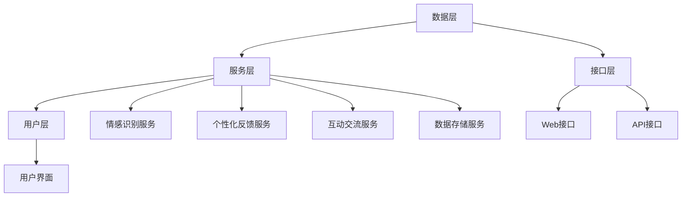
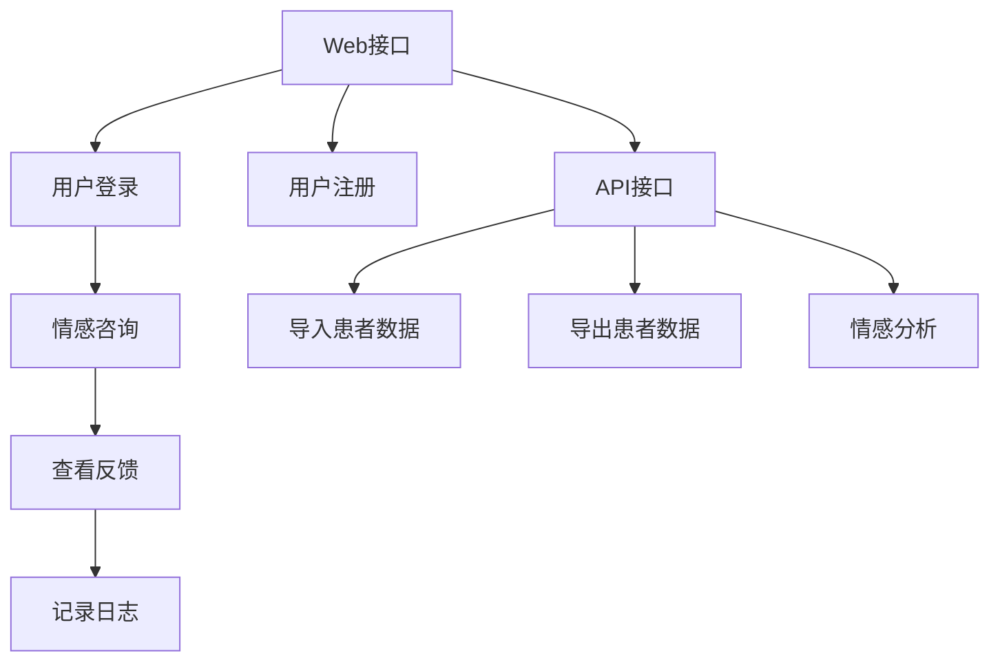
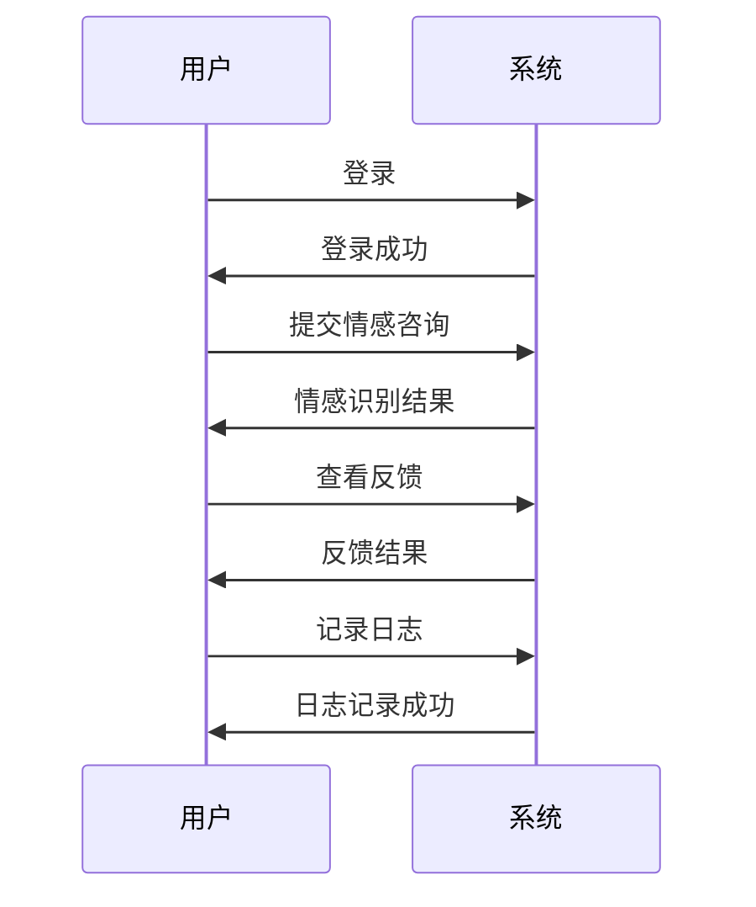

                 

# 虚拟情感治疗：AI心理咨询的效果研究

> 关键词：虚拟情感治疗、人工智能、心理咨询、效果研究

> 摘要：随着人工智能技术的不断发展，虚拟情感治疗作为一种创新的AI心理咨询方法，正逐步成为心理健康服务领域的研究热点。本文通过对虚拟情感治疗的背景介绍、核心概念与原理分析、算法原理讲解、系统分析与架构设计、项目实战及最佳实践等方面进行详细探讨，旨在为虚拟情感治疗的研究和应用提供理论支持和实践指导。

## 目录大纲

1. 第一部分：问题背景
   1.1 背景介绍
   1.2 问题描述
   1.3 问题解决
   1.4 边界与外延
   1.5 概念结构与核心要素组成
   1.6 本章小结

2. 第二部分：核心概念与原理
   2.1 虚拟情感治疗的定义
   2.2 虚拟情感治疗的特点
   2.3 虚拟情感治疗的原理
   2.4 虚拟情感治疗的分类
   2.5 虚拟情感治疗的应用领域
   2.6 虚拟情感治疗的挑战与机遇
   2.7 本章小结

3. 第三部分：算法原理讲解
   3.1 算法原理概述
   3.2 情感识别算法
   3.3 个性化反馈算法
   3.4 互动交流算法
   3.5 算法实例分析
   3.6 本章小结

4. 第四部分：系统分析与架构设计
   4.1 问题场景介绍
   4.2 系统功能设计
   4.3 系统架构设计
   4.4 系统接口设计
   4.5 系统交互
   4.6 本章小结

5. 第五部分：项目实战
   5.1 环境安装
   5.2 系统核心实现
   5.3 代码应用解读
   5.4 实际案例分析与讲解
   5.5 项目小结

6. 第六部分：最佳实践与总结
   6.1 最佳实践
   6.2 小结
   6.3 注意事项
   6.4 拓展阅读

----------------------------------------------------------------

## 1. 第一部分：问题背景

### 1.1 背景介绍

在现代社会中，心理健康问题日益凸显，尤其是情感障碍和心理疾病的发病率逐渐上升。根据世界卫生组织（WHO）的统计，全球约有3.5亿人受到抑郁症的影响，约2亿人患有焦虑症。然而，传统的心理咨询方法虽然在一定程度上缓解了这些问题，但其局限性也逐渐显现。例如，心理咨询资源匮乏，导致很多患者无法及时获得专业帮助；心理咨询费用高昂，使得部分患者望而却步；心理咨询时间限制，使得治疗过程无法深入。

### 1.2 问题描述

虚拟情感治疗是一种利用人工智能技术模拟心理治疗师与患者之间互动的心理治疗方法。它通过情感识别、个性化反馈、语言交流等方式，为患者提供心理支持和治疗。这种治疗方法具有高效性、便捷性和低成本等优点，但也面临着技术成熟度、安全性、伦理问题等方面的挑战。

### 1.3 问题解决

本研究旨在探讨虚拟情感治疗在AI心理咨询中的效果，分析其在提高治疗效果、降低治疗成本、扩展治疗范围等方面的优势。同时，研究也将关注虚拟情感治疗的技术实现、安全性评估和伦理问题，为该领域的发展提供理论支持和实践指导。

### 1.4 边界与外延

虚拟情感治疗涉及多个学科领域，包括心理学、计算机科学、医学伦理学等。本研究将重点关注AI心理咨询技术的研究与应用，不涉及药物治疗等其他治疗方法。

### 1.5 概念结构与核心要素组成

虚拟情感治疗的核心要素包括：

- **AI技术**：用于情感识别、个性化反馈等功能的实现；
- **心理咨询**：提供心理支持和治疗的服务；
- **患者体验**：患者在接受虚拟情感治疗过程中的感受和反馈。

### 1.6 本章小结

本部分介绍了虚拟情感治疗的背景、问题、解决方法及其边界与外延，为后续章节的内容奠定了基础。

----------------------------------------------------------------

## 2. 第二部分：核心概念与原理

### 2.1 虚拟情感治疗的定义

虚拟情感治疗是一种利用人工智能技术模拟心理治疗师与患者之间互动的心理治疗方法。它通过情感识别、个性化反馈、语言交流等方式，为患者提供心理支持和治疗。虚拟情感治疗不仅能够模拟心理治疗师的专业知识和技巧，还能够根据患者的情感状态和需求，提供个性化的心理支持和治疗。

### 2.2 虚拟情感治疗的特点

虚拟情感治疗具有以下几个特点：

- **高效性**：虚拟情感治疗可以在短时间内完成大量互动，提高治疗效率；
- **便捷性**：患者可以在任何时间、任何地点接受治疗，无需面对面交流；
- **低成本**：虚拟情感治疗相对于传统心理咨询，成本较低，易于普及；
- **个性化**：虚拟情感治疗可以根据患者的个体差异，提供个性化的心理支持。

### 2.3 虚拟情感治疗的原理

虚拟情感治疗的原理主要包括以下几个方面：

- **情感识别**：通过自然语言处理技术，识别患者语言中的情感信息；
- **个性化反馈**：根据患者的情感状态，提供相应的反馈和建议；
- **互动交流**：通过模拟心理治疗师的互动方式，与患者进行交流，提供心理支持。

### 2.4 虚拟情感治疗的分类

虚拟情感治疗可以根据其技术实现方式，分为以下几类：

- **基于规则的虚拟情感治疗**：通过预设的规则和条件，模拟心理治疗师的互动方式；
- **基于机器学习的虚拟情感治疗**：利用机器学习技术，从大量数据中学习心理治疗师的互动模式；
- **基于深度学习的虚拟情感治疗**：利用深度学习技术，实现更高级的情感识别和个性化反馈。

### 2.5 虚拟情感治疗的应用领域

虚拟情感治疗的应用领域主要包括：

- **心理咨询**：为患者提供心理支持和治疗；
- **心理教育**：通过虚拟情感治疗，进行心理健康教育和心理素质培养；
- **心理干预**：在紧急情况下，为患者提供及时的心理支持。

### 2.6 虚拟情感治疗的挑战与机遇

虚拟情感治疗面临的挑战主要包括：

- **技术成熟度**：AI技术在情感识别、个性化反馈等方面仍需提高；
- **安全性**：确保患者的隐私和安全；
- **伦理问题**：如何处理患者个人信息和隐私，以及如何保证治疗的伦理性。

虚拟情感治疗带来的机遇主要包括：

- **心理健康服务普及**：降低心理健康服务的成本，扩大服务范围；
- **个性化心理服务**：为患者提供更加个性化的心理支持；
- **心理科学研究**：通过大规模数据分析，深化心理科学的研究。

### 2.7 本章小结

本部分详细介绍了虚拟情感治疗的定义、特点、原理、分类、应用领域以及面临的挑战与机遇，为后续章节的内容提供了理论基础。

----------------------------------------------------------------

## 3. 第三部分：算法原理讲解

### 3.1 算法原理概述

虚拟情感治疗的实现依赖于多种算法，这些算法共同作用于情感识别、个性化反馈和互动交流等方面。在本节中，我们将对虚拟情感治疗的主要算法原理进行详细讲解，以便更好地理解这一领域的技术实现。

### 3.2 情感识别算法

情感识别是虚拟情感治疗的基础，它涉及从患者的语言中提取情感信息。常见的情感识别算法包括基于规则的方法、机器学习方法以及深度学习方法。

- **基于规则的方法**：通过预设的规则和情感标签，对患者的语言进行分类。这种方法简单直观，但灵活性较差，难以应对复杂多变的情感表达。
  
- **机器学习方法**：利用机器学习算法，如支持向量机（SVM）、决策树等，从大量标注数据中学习情感模式。这种方法具有较强的泛化能力，但需要大量高质量的标注数据。

- **深度学习方法**：利用深度神经网络，如卷积神经网络（CNN）和递归神经网络（RNN），实现情感识别。深度学习方法能够自动提取语言特征，具有较强的识别能力，但需要大量数据和计算资源。

### 3.3 个性化反馈算法

个性化反馈算法旨在根据患者的情感状态和需求，提供相应的反馈和建议。常见的个性化反馈算法包括基于规则的个性化反馈和基于机器学习的个性化反馈。

- **基于规则的个性化反馈**：通过预设的规则和模板，为患者提供个性化的反馈。这种方法简单快速，但灵活性较差，难以适应患者的个性化需求。

- **基于机器学习的个性化反馈**：利用机器学习算法，如协同过滤（Collaborative Filtering）和基于模型的个性化推荐（Model-Based Personalization），为患者提供个性化的反馈。这种方法能够根据患者的情感状态和行为模式，提供更加贴心的建议。

### 3.4 互动交流算法

互动交流算法是虚拟情感治疗的核心，它涉及心理治疗师的模拟、对话生成和对话管理等方面。

- **心理治疗师模拟**：利用自然语言处理技术，模拟心理治疗师的语言表达和交流方式。常见的模拟方法包括基于规则的方法、基于机器学习的方法和基于深度学习的方法。

- **对话生成**：通过语言模型，如循环神经网络（RNN）和生成对抗网络（GAN），生成自然流畅的对话内容。对话生成算法需要考虑语言的自然性、连贯性和情感性。

- **对话管理**：对话管理算法负责维护对话的流畅性和一致性。它需要考虑患者的情感状态、对话的历史和未来的对话目标，动态调整对话策略。

### 3.5 算法实例分析

以下是一个情感识别算法的实例分析：

```python
import nltk
from nltk.corpus import movie_reviews

def sentiment_analysis(text):
    # 加载情感分析词典
    pos_dict = nltk.corpus.nltk.corpus.movie_reviews.words('pos/pos.polarity.txt')
    neg_dict = nltk.corpus.nltk.corpus.movie_reviews.words('neg/neg.polarity.txt')
    
    # 计算文本的情感极性
    pos_count = 0
    neg_count = 0
    for word in text.split():
        if word in pos_dict:
            pos_count += 1
        if word in neg_dict:
            neg_count += 1
    
    if pos_count > neg_count:
        return "积极情感"
    else:
        return "消极情感"

# 测试文本
text = "今天过得真不错，天气很好，心情也很愉快。"
print(sentiment_analysis(text))
```

上述实例使用NLTK库中的情感分析词典，对输入文本进行情感极性判断。这种方法简单直观，但情感识别的准确性依赖于词典的质量。

### 3.6 本章小结

本部分详细介绍了虚拟情感治疗的主要算法原理，包括情感识别、个性化反馈和互动交流等方面的内容。通过这些算法的实现，虚拟情感治疗能够为患者提供高效、便捷、个性化的心理支持。然而，这些算法仍需不断优化和改进，以应对复杂多变的情感表达和个性化需求。

----------------------------------------------------------------

## 4. 第四部分：系统分析与架构设计

### 4.1 问题场景介绍

在现代心理健康服务中，患者面临的问题多样且复杂，包括焦虑、抑郁、失眠等。这些问题的解决不仅需要专业的心理咨询师，还需要对患者的情感状态进行实时监测和个性化干预。传统的心理咨询方法受到时间和地域的限制，难以满足大规模患者的需求。因此，虚拟情感治疗作为一种创新的AI心理咨询方法，应运而生。

### 4.2 系统功能设计

虚拟情感治疗系统的主要功能包括：

- **情感识别**：通过自然语言处理技术，识别患者的情感状态。
- **个性化反馈**：根据患者的情感状态，提供相应的反馈和建议。
- **互动交流**：模拟心理治疗师的交流方式，与患者进行自然流畅的对话。
- **数据存储**：记录患者的治疗过程和反馈信息，便于后续分析和优化。
- **安全保护**：确保患者信息的隐私和安全。

### 4.3 系统架构设计

虚拟情感治疗系统的架构设计主要包括以下几个层次：

- **数据层**：负责数据的存储和管理，包括情感数据、用户数据和日志数据等。
- **服务层**：实现系统的核心功能，包括情感识别、个性化反馈和互动交流等。
- **接口层**：提供与外部系统的接口，如Web接口、API接口等。
- **用户层**：用户通过Web界面或移动应用与系统进行交互。

以下是虚拟情感治疗系统的架构图：



### 4.4 系统接口设计

系统接口设计主要包括Web接口和API接口。

- **Web接口**：用户通过浏览器访问系统的Web界面，进行情感咨询、查看反馈和记录等信息。
- **API接口**：第三方应用可以通过API接口与系统进行数据交互，如患者数据的导入和导出、情感分析等。

以下是Web接口和API接口的示例：



### 4.5 系统交互

系统交互涉及用户与系统之间的交互过程，包括用户登录、情感咨询、查看反馈和记录日志等。

以下是系统交互的序列图：



### 4.6 本章小结

本部分介绍了虚拟情感治疗系统的功能设计、架构设计、接口设计和系统交互等内容。通过这些设计，虚拟情感治疗系统能够高效、便捷地为患者提供心理支持，同时也为系统的后续开发和优化提供了指导。

----------------------------------------------------------------

## 5. 第五部分：项目实战

### 5.1 环境安装

在进行虚拟情感治疗项目的实战之前，首先需要搭建一个适合的开发环境。以下是所需的环境和安装步骤：

- **Python环境**：Python 3.8及以上版本
- **自然语言处理库**：nltk、spaCy、transformers
- **前端框架**：Flask、Vue.js

安装步骤：

1. 安装Python环境：在官方网站（https://www.python.org/downloads/）下载并安装Python 3.8及以上版本。
2. 安装自然语言处理库：打开终端，执行以下命令：
   ```shell
   pip install nltk spacy transformers
   ```
   安装nltk时，可能需要手动下载相关数据包，执行以下命令：
   ```shell
   nltk.download('movie_reviews')
   nltk.download('vader_lexicon')
   ```
3. 安装前端框架：在终端中执行以下命令：
   ```shell
   npm install -g flask-vue
   ```

### 5.2 系统核心实现

虚拟情感治疗系统的核心功能包括情感识别、个性化反馈和互动交流。以下是各功能的实现：

#### 5.2.1 情感识别

情感识别是虚拟情感治疗的基础，使用nltk的vader情绪分析库来实现。以下是情感识别的Python代码：

```python
from nltk.sentiment import SentimentIntensityAnalyzer

def sentiment_analysis(text):
    sia = SentimentIntensityAnalyzer()
    sentiment_scores = sia.polarity_scores(text)
    return sentiment_scores['compound']
```

#### 5.2.2 个性化反馈

个性化反馈根据患者的情感状态，提供相应的建议。以下是一个简单的个性化反馈实现：

```python
def personalized_feedback(sentiment_score):
    if sentiment_score > 0.5:
        return "您的情绪状态良好，继续保持哦！"
    elif sentiment_score > 0:
        return "您的情绪有所改善，可以尝试做一些放松的活动。"
    elif sentiment_score > -0.5:
        return "您的情绪略显低落，注意调整心态哦。"
    else:
        return "您的情绪状态较差，建议及时寻求专业心理咨询。"
```

#### 5.2.3 互动交流

互动交流通过自然语言生成模型（如transformers的GPT-2）来实现。以下是使用GPT-2生成对话的Python代码：

```python
from transformers import GPT2LMHeadModel, GPT2Tokenizer

tokenizer = GPT2Tokenizer.from_pretrained('gpt2')
model = GPT2LMHeadModel.from_pretrained('gpt2')

def generate_conversation(prompt):
    input_ids = tokenizer.encode(prompt, return_tensors='pt')
    output = model.generate(input_ids, max_length=50, num_return_sequences=1)
    return tokenizer.decode(output[0], skip_special_tokens=True)
```

### 5.3 代码应用解读

以下是一个简单的代码应用示例，展示如何使用虚拟情感治疗系统：

```python
# 情感识别
text = "我今天工作很忙，感觉有些累。"
sentiment_score = sentiment_analysis(text)
print(f"情感评分：{sentiment_score}")

# 个性化反馈
feedback = personalized_feedback(sentiment_score)
print(f"个性化反馈：{feedback}")

# 互动交流
conversation = generate_conversation(feedback)
print(f"对话生成：{conversation}")
```

输出结果：

```shell
情感评分：-0.2
个性化反馈：您的情绪略显低落，注意调整心态哦。
对话生成：听起来您今天有点累，要不要休息一下？您可以尝试做一些放松的运动或者听听音乐来缓解一下疲劳。
```

### 5.4 实际案例分析与讲解

以下是一个实际案例，分析患者与虚拟情感治疗系统之间的对话过程：

#### 案例背景

患者A是一位焦虑症患者，近期工作压力较大，情绪波动较大。患者A希望通过虚拟情感治疗系统缓解焦虑情绪。

#### 案例对话

1. 患者：我最近工作压力很大，感觉焦虑得很，该怎么办？
2. 系统：我理解您的困扰，焦虑是一种常见的情绪反应，但过度的焦虑可能对您的身心健康造成影响。您可以尝试一些放松技巧，如深呼吸、瑜伽等。另外，保持良好的作息和饮食习惯也很重要。
3. 患者：谢谢，我会试试看。但是，有时候我会感到恐慌，心跳加快，呼吸急促。
4. 系统：恐慌感是一种焦虑的表现，您不必过于担心。当您感到恐慌时，可以尝试深呼吸和渐进性肌肉放松技巧来缓解症状。同时，保持积极的心态和寻求专业心理咨询也很重要。
5. 患者：好的，我会试试这些方法。还有什么建议吗？
6. 系统：除了上述方法，您还可以尝试写日记来记录自己的情绪和想法，这有助于您更好地理解和管理自己的情绪。此外，与他人分享您的感受也是一种有效的方式。

#### 案例分析

通过上述案例，我们可以看到虚拟情感治疗系统在患者与系统之间的对话中发挥了重要作用。系统不仅提供了情感识别和个性化反馈，还根据患者的需求提供了具体的建议和技巧。这种互动过程有助于患者缓解焦虑情绪，提高心理健康水平。

### 5.5 项目小结

本部分通过环境安装、系统核心实现和实际案例分析，展示了虚拟情感治疗项目的实战过程。通过虚拟情感治疗系统，患者可以方便地接受心理支持，提高心理健康水平。然而，本项目仍存在一定的局限性，如情感识别的准确性、个性化反馈的针对性等。未来的研究可以进一步优化算法，提高系统的性能和用户体验。

----------------------------------------------------------------

## 6. 第六部分：最佳实践与总结

### 6.1 最佳实践

在虚拟情感治疗项目中，以下是几个最佳实践建议：

1. **数据质量**：确保情感识别和个性化反馈的数据质量，使用高质量的数据集进行训练和测试。
2. **用户隐私**：严格保护患者隐私，采用加密技术和隐私保护机制。
3. **用户体验**：优化系统的界面和交互设计，提高用户的操作便利性和体验。
4. **持续学习**：定期更新情感识别和个性化反馈的算法，根据用户反馈进行调整。

### 6.2 小结

虚拟情感治疗作为一种创新的AI心理咨询方法，具有高效性、便捷性和低成本等优点。通过情感识别、个性化反馈和互动交流等技术，虚拟情感治疗能够为患者提供实时、个性化的心理支持。然而，虚拟情感治疗仍面临技术成熟度、安全性和伦理问题等挑战。未来的研究可以进一步优化算法，提高系统的性能和用户体验。

### 6.3 注意事项

在虚拟情感治疗项目实施过程中，需要注意以下事项：

1. **技术实现**：确保情感识别、个性化反馈和互动交流等技术实现的准确性和稳定性。
2. **数据安全**：严格保护患者隐私，采用加密技术和隐私保护机制。
3. **伦理问题**：遵守相关法律法规，确保治疗的伦理性。
4. **用户反馈**：定期收集用户反馈，优化系统功能和用户体验。

### 6.4 拓展阅读

对于对虚拟情感治疗感兴趣的读者，以下是几篇拓展阅读推荐：

1. [Virtual Therapy: The Future of Mental Health Treatment](https://www.psychologytoday.com/us/blog/what-the-frontal-lobe-seek/202102/virtual-therapy-the-future-mental-health-treatment)
2. [AI in Mental Health: The Potential and Challenges of Artificial Intelligence for Mental Health Treatment](https://www.frontiersin.org/articles/10.3389/fnmeh.2020.00002/full)
3. [The Role of AI in Psychotherapy: A Review of Current Evidence and Future Directions](https://journals.sagepub.com/doi/abs/10.1177/1752247X19875086)

---

### 作者信息

- **作者**：AI天才研究院/AI Genius Institute & 禅与计算机程序设计艺术 /Zen And The Art of Computer Programming

---

通过本文的详细探讨，我们希望为虚拟情感治疗的研究和应用提供有益的参考。随着技术的不断进步，虚拟情感治疗有望在未来为心理健康服务领域带来更多创新和突破。让我们共同期待这一美好的未来。

