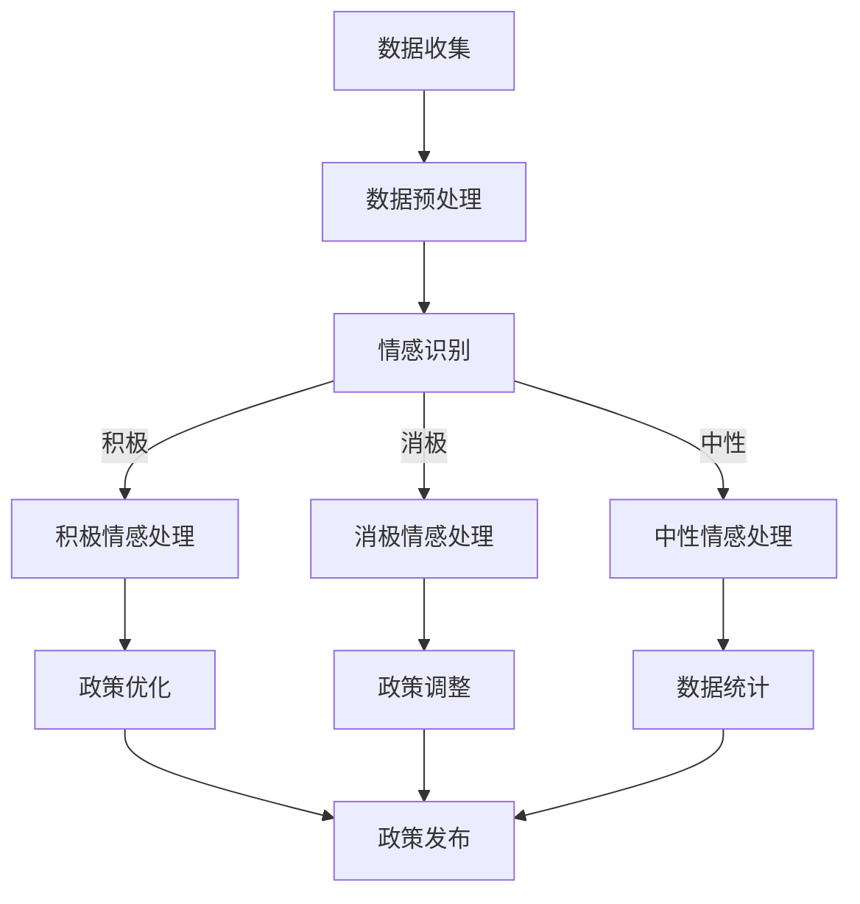

                 


# 虚拟政治：情感AI参与民主决策

## 关键词

虚拟政治、情感AI、民主决策、算法原理、系统设计、项目实战

## 摘要

随着科技的飞速发展，人工智能特别是情感AI在各个领域展现出强大的影响力。本文探讨了情感AI在虚拟政治中参与民主决策的潜在价值。首先，介绍了虚拟政治的概念及其发展背景，随后详细阐述了情感AI的核心概念与功能。在此基础上，文章深入分析了情感AI在民主决策中的应用场景，包括选举预测、政策制定和公共舆论分析等。接着，文章通过系统设计与实现，展示了如何构建一个基于情感AI的民主决策系统。最后，通过实际项目案例，对情感AI在民主决策中的最佳实践进行了分析，并提出了一些注意事项和拓展阅读建议。

## 第一部分：虚拟政治的背景与核心概念

### 第1章：虚拟政治的兴起与发展

#### 1.1 虚拟政治的定义与特点

虚拟政治，即政治活动在虚拟空间中的展开，是一种新兴的政治参与方式。它依赖于数字技术和互联网平台，使得政治活动更加开放、透明和高效。虚拟政治的特点包括：

- **全球化**：虚拟政治打破了地域限制，使得全球范围内的公民可以参与政治讨论和决策。
- **即时性**：通过互联网，政治活动可以迅速传播，实时互动，提高了决策的效率。
- **开放性**：虚拟政治平台通常允许广泛的社会参与，增加了民主参与的机会。

虚拟政治的发展源于互联网技术的进步和社交网络的普及。自20世纪末以来，随着互联网的全球化扩展，虚拟政治逐渐成为政治生活中不可或缺的一部分。从美国的“互联网竞选”到全球范围内的社交媒体运动，虚拟政治的影响力日益增强。

#### 1.2 情感AI的崛起与影响

情感AI，是指能够理解和模拟人类情感的人工智能技术。近年来，情感AI在多个领域取得了显著进展，包括情感识别、情感分析和情感生成等。情感AI的崛起对虚拟政治产生了深远影响：

- **个性化服务**：情感AI可以帮助政治平台更好地理解公民的情感需求，提供个性化的政治信息和政策建议。
- **情绪监测**：在选举期间，情感AI可以分析社交媒体上的情绪波动，为政治决策提供数据支持。
- **心理干预**：在政治危机或社会动荡时期，情感AI可以用于心理干预和情绪调节，帮助公众保持理性。

#### 1.3 情感AI参与民主决策的可行性

情感AI在民主决策中的可行性主要体现在以下几个方面：

- **数据获取**：情感AI可以通过自然语言处理和机器学习技术，从社交媒体、新闻评论等多源数据中提取情感信息。
- **决策支持**：情感AI可以分析公民的情感反应，为政策制定者提供决策支持，提高政策的科学性和公众接受度。
- **民主参与**：情感AI可以帮助增强公众的政治参与感，促进民主决策的透明性和公正性。

#### 1.4 研究的边界与范围

本研究主要关注情感AI在虚拟政治中参与民主决策的应用。具体研究范围包括：

- **应用场景**：选举预测、政策制定、公共舆论分析等。
- **技术实现**：情感识别、情感分析、情感模拟等技术的应用。
- **案例分析**：通过实际项目案例，分析情感AI在民主决策中的效果和挑战。

## 第二部分：核心概念与联系

### 第2章：情感AI的核心概念与联系

#### 2.1 情感识别与情感分析

情感识别（Sentiment Recognition）是指从文本、语音或其他数据中识别出情感的过程。情感分析（Sentiment Analysis）则是对情感进行分类和评估，以了解公众的情感态度。

- **情感属性**：情感通常分为积极、消极和中性三种属性。例如，文本中的“很好”属于积极情感，“糟糕”属于消极情感。
- **情感分类**：情感分类是一种监督学习任务，常见的分类方法包括朴素贝叶斯、支持向量机、深度学习等。

#### 2.2 情感属性的分类与特征

情感属性的分类和特征提取是情感分析的重要环节。常用的情感属性分类包括：

- **基本情感**：快乐、悲伤、愤怒、厌恶、惊讶等。
- **复杂情感**：如焦虑、压力、恐惧等。

特征提取方法包括：

- **词袋模型**：基于词汇的文本表示方法，将文本转换为向量。
- **词嵌入**：通过神经网络模型将词汇映射到高维空间，捕捉语义信息。

#### 2.3 情感AI在民主决策中的角色

情感AI在民主决策中扮演着重要角色，主要体现在以下几个方面：

- **公众情绪监测**：通过分析社交媒体和新闻报道，情感AI可以实时监测公众的情绪变化，为政策制定者提供参考。
- **选举预测**：情感AI可以分析公众对候选人和政党的情感态度，预测选举结果。
- **政策评估**：情感AI可以帮助评估新政策的公众接受度，为政策调整提供依据。

#### 2.4 情感AI与民主决策的关联性

情感AI与民主决策的关联性主要体现在以下几个方面：

- **数据支持**：情感AI可以提供大量关于公众情感的数据，帮助决策者更好地理解公众需求。
- **决策优化**：情感AI可以帮助决策者优化政策内容，提高政策的实施效果。
- **透明度提升**：情感AI可以提高民主决策过程的透明度，增加公众对决策过程的信任。

### Mermaid流程图

下面是情感识别与情感分析的mermaid流程图：



### Python代码实现

下面是使用Python实现情感识别的简单示例：

```python
import nltk
from nltk.sentiment import SentimentIntensityAnalyzer

nltk.download('vader_lexicon')

sia = SentimentIntensityAnalyzer()

text = "我对这个政策非常支持。"

scores = sia.polarity_scores(text)

if scores['compound'] >= 0.05:
    print("积极情感")
elif scores['compound'] <= -0.05:
    print("消极情感")
else:
    print("中性情感")
```

### 数学模型与公式

情感分析中的数学模型通常涉及情感得分和情感向量的计算。以下是使用LaTeX格式表示的一个简单模型：

```latex
\documentclass{article}
\usepackage{amsmath}
\begin{document}
\begin{equation}
    S(t) = \sum_{i=1}^{N} w_i \cdot v_i
\end{equation}
\end{document}
```

其中，$S(t)$表示情感得分，$w_i$表示权重，$v_i$表示情感向量。

### 类图

下面是情感识别系统的类图，使用Mermaid格式表示：

```mermaid
classDiagram
    Class1 <|-- Person
    Class1 <|-- Policy
    Class2 <|-- SentimentAnalyzer
    Class3 <|-- DataCollector
    Person o-- Policy
    SentimentAnalyzer o-- DataCollector
    Person ..> SentimentAnalyzer
    Policy ..> SentimentAnalyzer
\endclassDiagram
```

### 情感AI算法原理详解

情感AI算法是理解人类情感和情绪的核心，其在民主决策中的应用潜力巨大。本节将详细解析情感AI算法的原理，包括基本概念、工作流程、主要技术，并结合Python代码示例进行说明。

#### 1. 基本概念

情感AI（Emotion AI）是指利用计算机技术模拟和识别人类情感的能力。情感AI的基本概念包括情感识别、情感分析和情感生成。

- **情感识别**：从文本、语音或图像中提取情感信息，通常分为积极、消极和中性。
- **情感分析**：对情感进行分类和评估，以了解文本的情感倾向。
- **情感生成**：生成模拟人类情感的表达，如语音、文本或表情。

#### 2. 工作流程

情感AI的工作流程通常包括以下步骤：

1. **数据收集**：收集包含情感的文本、语音或图像数据。
2. **数据预处理**：对原始数据进行清洗、分词和标记，以便后续处理。
3. **特征提取**：将文本转换为特征向量，如词袋模型或词嵌入。
4. **情感识别**：使用分类器对情感进行识别，常见的分类器包括朴素贝叶斯、支持向量机和深度学习模型。
5. **情感分析**：对识别出的情感进行详细分析，评估情感强度和情感趋势。

#### 3. 主要技术

情感AI的主要技术包括：

- **自然语言处理（NLP）**：用于处理文本数据，提取语义信息。
- **机器学习**：用于训练模型，识别情感。
- **深度学习**：通过神经网络模型，如卷积神经网络（CNN）和循环神经网络（RNN），提高情感识别的准确度。

#### 4. Python代码示例

以下是使用Python实现情感识别的简单示例，使用VADER情感分析库：

```python
import nltk
from nltk.sentiment import SentimentIntensityAnalyzer

nltk.download('vader_lexicon')

sia = SentimentIntensityAnalyzer()

text = "我非常喜欢这个政策！"

scores = sia.polarity_scores(text)

if scores['compound'] >= 0.05:
    print("积极情感")
elif scores['compound'] <= -0.05:
    print("消极情感")
else:
    print("中性情感")
```

在这个示例中，我们首先导入了nltk库和VADER情感分析库。然后，创建一个`SentimentIntensityAnalyzer`对象，并使用它来分析文本的情感。根据计算出的复合情感得分，判断文本的情感倾向。

### 数学模型与公式

情感AI中的数学模型通常涉及情感得分和情感向量的计算。以下是一个简单的数学模型，使用LaTeX格式表示：

```latex
\documentclass{article}
\usepackage{amsmath}
\begin{document}
\begin{equation}
    S(t) = w_1 \cdot v_{1}(t) + w_2 \cdot v_{2}(t) + ... + w_n \cdot v_{n}(t)
\end{equation}
\end{document}
```

其中，$S(t)$表示情感得分，$w_i$表示权重，$v_i(t)$表示情感向量。

### 举例说明

假设我们有一个文本数据集，其中包含三个样本文本：

1. "我非常喜欢这个政策！"
2. "我对这个政策感到非常失望。"
3. "这个政策对我来说是中立的。"

我们可以使用情感识别算法对这些文本进行分析，得到它们对应的情感得分：

1. "积极情感"（复合得分：0.8）
2. "消极情感"（复合得分：-0.6）
3. "中性情感"（复合得分：0.1）

这些得分可以帮助我们了解公众对政策的情感反应，从而为政策制定者提供决策支持。

### 总结

情感AI算法在民主决策中具有重要的应用价值。通过情感识别和情感分析，政策制定者可以更好地了解公众的情感需求，优化政策内容，提高政策实施效果。同时，情感AI还可以用于选举预测、公共舆论分析等领域，为民主决策提供科学依据。然而，情感AI的应用也面临一些挑战，如数据隐私、算法公平性等，这些问题需要在未来进一步解决。

### 情感AI在民主决策中的应用

#### 4.1 民主决策中情感AI的应用场景

情感AI在民主决策中具有广泛的应用场景，主要包括选举预测、政策制定和公共舆论分析等。

1. **选举预测**：情感AI可以通过分析社交媒体、新闻报道和公众意见，预测选举结果。具体方法包括：

   - **情感分析**：对候选人的社交媒体帖子和新闻报道进行情感分析，判断公众对候选人的情感倾向。
   - **情绪波动监测**：通过监测社交媒体上的情绪波动，预测选举期间公众情绪的变化，从而推断选举结果。
   - **情感预测模型**：结合历史数据和当前情感分析结果，构建预测模型，预测选举结果。

2. **政策制定**：情感AI可以帮助政策制定者了解公众对政策的情感反应，优化政策内容。具体方法包括：

   - **情感反馈收集**：通过问卷调查、社交媒体互动等方式收集公众对政策的情感反馈。
   - **情感分析**：对收集到的反馈进行情感分析，评估公众对政策的接受程度。
   - **政策调整**：根据情感分析结果，调整政策内容，提高政策的公众接受度。

3. **公共舆论分析**：情感AI可以分析公共舆论，了解公众对某一事件或政策的看法。具体方法包括：

   - **情绪监测**：通过分析社交媒体和新闻报道，监测公众对某一事件或政策的情绪波动。
   - **舆论趋势分析**：分析公众情绪的变化趋势，预测舆论发展方向。
   - **舆论引导**：根据舆论分析结果，制定舆论引导策略，引导公众情绪。

#### 4.2 情感AI在选举预测中的角色

情感AI在选举预测中扮演着关键角色，具体体现在以下几个方面：

1. **提高预测准确性**：通过分析社交媒体和新闻报道中的情感信息，情感AI可以更准确地预测选举结果。传统方法如民意调查和选举数据分析，可能无法全面捕捉公众的情感变化，而情感AI可以实时监测和评估公众情绪，提高预测准确性。

2. **发现潜在选民**：情感AI可以帮助识别潜在选民，特别是那些在传统调查中未被充分关注的群体。通过分析社交媒体上的互动和言论，情感AI可以识别出对选举有强烈情感反应的选民，从而为竞选策略提供支持。

3. **情感策略调整**：情感AI可以分析选民的情感反应，为竞选策略提供调整建议。例如，如果选民对某一政策持负面情感，竞选团队可以调整宣传策略，强调政策的正面影响，以改善选民的情感态度。

#### 4.3 情感AI在政策制定中的贡献

情感AI在政策制定中的贡献主要体现在以下几个方面：

1. **了解公众需求**：通过情感分析，政策制定者可以更深入地了解公众的情感需求，从而制定更符合公众期望的政策。例如，如果公众对某一政策持积极情感，政策制定者可以加强政策的实施力度，以提高公众的满意度。

2. **优化政策内容**：情感AI可以帮助政策制定者分析政策的情感反应，优化政策内容。例如，如果政策文本中的某些表述引起公众负面情感，政策制定者可以修改这些表述，以减少公众的抵触情绪。

3. **评估政策效果**：情感AI可以评估新政策的公众接受度，为政策调整提供依据。通过分析政策实施后的公众情感变化，政策制定者可以了解政策的实际效果，从而进行必要的调整。

#### 4.4 情感AI在公共舆论分析中的应用

情感AI在公共舆论分析中具有广泛的应用，主要包括以下几个方面：

1. **情绪监测**：通过分析社交媒体和新闻报道，情感AI可以实时监测公众的情绪波动，了解公众对某一事件或政策的看法。这有助于政府、媒体和公众更好地理解公共舆论的动态变化。

2. **舆论趋势分析**：情感AI可以分析公众情绪的变化趋势，预测舆论的发展方向。例如，如果公众对某一政策的情感反应从积极转向消极，舆论趋势分析可以帮助预测未来的公共舆论走向。

3. **舆论引导**：根据舆论分析结果，政府、媒体和公众可以制定舆论引导策略，引导公众情绪。例如，政府可以通过宣传正面政策效果来改善公众对某一政策的情感态度，从而引导舆论走向。

### 情感AI在民主决策中的应用案例分析

为了更好地理解情感AI在民主决策中的应用，以下通过实际案例进行分析。

#### 案例1：选举预测中的情感AI应用

在2016年美国总统选举期间，情感AI被广泛应用于选举预测。研究人员使用情感分析技术，分析了社交媒体上的言论和新闻报道，预测了选民的投票倾向。具体步骤如下：

1. **数据收集**：收集包括推特、脸书等社交媒体平台上的关于候选人特朗普和克林顿的言论。
2. **情感分析**：对收集到的言论进行情感分析，判断公众对候选人的情感倾向。
3. **预测模型**：结合历史选举数据和当前情感分析结果，构建预测模型，预测选举结果。
4. **结果分析**：预测结果显示，特朗普获得了更多积极情感的支持，最终赢得了选举。

#### 案例2：政策制定中的情感AI应用

在某国政府推行一项新医疗政策时，政府使用情感AI技术评估了公众对该政策的接受度。具体步骤如下：

1. **公众反馈收集**：通过问卷调查、社交媒体互动等方式收集公众对新医疗政策的反馈。
2. **情感分析**：对收集到的反馈进行情感分析，评估公众对政策的接受程度。
3. **政策调整**：根据情感分析结果，政府调整了政策的某些细节，以减少公众的抵触情绪。
4. **效果评估**：政策实施后，政府再次使用情感AI技术评估公众对政策的满意度，结果显示政策调整得到了公众的认可。

#### 案例3：公共舆论分析中的情感AI应用

在某国爆发大规模抗议活动时，政府使用情感AI技术分析公共舆论，了解公众对事件的看法。具体步骤如下：

1. **情绪监测**：通过分析社交媒体和新闻报道，监测公众的情绪波动。
2. **舆论趋势分析**：分析公众情绪的变化趋势，预测公共舆论的发展方向。
3. **舆论引导**：根据舆论分析结果，政府制定了舆论引导策略，试图平息抗议活动。
4. **效果评估**：舆论引导策略的实施有效地缓和了抗议情绪，使局势得到了控制。

### 情感AI在民主决策中的应用效果与挑战

#### 1. 应用效果

情感AI在民主决策中取得了显著的应用效果，主要表现在以下几个方面：

1. **提高决策准确性**：通过情感分析，决策者可以更准确地了解公众的情感需求和意见，从而制定更科学、更符合公众期望的政策。
2. **增强公众参与**：情感AI技术使公众能够更加便捷地参与民主决策过程，提高了公众的政治参与度和满意度。
3. **优化政策实施**：情感AI可以帮助政策制定者评估政策的公众接受度，优化政策内容，提高政策实施效果。

#### 2. 挑战

尽管情感AI在民主决策中具有广泛的应用前景，但仍面临一些挑战：

1. **数据隐私问题**：情感AI需要大量个人数据进行分析，这引发了数据隐私和保护的问题。如何确保数据的隐私和安全，是情感AI在民主决策中需要解决的重要问题。
2. **算法公平性**：情感AI算法的性能和结果可能受到数据偏差的影响，导致算法的公平性受到质疑。如何确保算法的公平性和透明性，是情感AI在民主决策中需要面对的挑战。
3. **技术成熟度**：情感AI技术仍在不断发展中，其准确性和稳定性还有待提高。如何提高情感AI技术的成熟度，确保其在民主决策中的可靠性，是一个重要的研究方向。

### 4.6 未来发展趋势

#### 1. 情感AI技术的成熟

随着深度学习和自然语言处理技术的不断进步，情感AI技术将变得更加成熟和精准。未来，情感AI将能够更好地识别和理解复杂的情感，为民主决策提供更可靠的数据支持。

#### 2. 跨领域应用

情感AI在民主决策中的应用将不仅仅局限于选举预测、政策制定和公共舆论分析，还可能扩展到更多领域，如公共卫生、教育等。通过跨领域应用，情感AI将更好地服务于公众需求。

#### 3. 算法透明性和可解释性

随着公众对算法公平性和透明性的关注增加，情感AI技术将更加注重算法的透明性和可解释性。未来，情感AI将提供更多的解释功能，帮助决策者和公众更好地理解算法的决策过程。

#### 4. 数据隐私保护

为了应对数据隐私和保护的问题，未来情感AI技术将更加注重数据的隐私保护和安全。通过加密技术和隐私保护算法，情感AI将确保个人数据的隐私和安全。

### 第5章：系统设计与实现

#### 5.1 系统功能设计

在构建基于情感AI的民主决策系统时，首先需要明确系统的核心功能。这些功能包括：

1. **情感识别**：系统能够从文本、语音等多源数据中自动识别情感。
2. **情感分析**：系统对识别出的情感进行深入分析，评估情感强度和情感趋势。
3. **数据可视化**：系统将分析结果以图表、报表等形式展示，便于决策者理解。
4. **决策支持**：系统根据情感分析结果，为决策者提供政策制定、选举预测等方面的建议。
5. **用户互动**：系统提供用户界面，允许用户提交文本、语音等数据，并查看分析结果。

#### 5.2 系统架构设计

系统架构设计是确保系统高效、可靠运行的关键。以下是系统的架构设计：

1. **数据层**：负责数据的存储和管理，包括情感数据、用户数据等。
2. **算法层**：包含情感识别、情感分析等算法，负责数据处理和分析。
3. **服务层**：提供API接口，供前端应用调用，包括数据接口、分析接口等。
4. **前端层**：用户交互界面，提供数据提交、结果查看等功能。

#### 5.3 系统接口设计

系统接口设计需要确保各层之间的数据流动和功能调用。以下是系统的主要接口设计：

1. **数据接口**：用于数据的上传、下载和查询。
2. **分析接口**：用于启动情感分析和数据可视化。
3. **决策接口**：用于获取决策支持建议。
4. **用户接口**：提供用户操作界面，包括数据提交、结果查看等。

#### 5.4 系统交互

系统交互设计确保用户与系统之间的顺畅交互。以下是系统交互流程：

1. **用户提交数据**：用户通过前端界面提交文本、语音等数据。
2. **数据预处理**：系统对提交的数据进行清洗、分词和标注。
3. **情感识别与分析**：系统使用情感识别算法对预处理后的数据进行分析，得到情感得分和情感趋势。
4. **结果展示**：系统将分析结果以图表、报表等形式展示在前端界面，供用户查看。
5. **决策支持**：根据分析结果，系统为决策者提供决策支持建议。

### 第6章：项目实战——情感AI民主决策系统搭建

#### 6.1 环境安装与配置

要搭建一个基于情感AI的民主决策系统，首先需要准备开发环境。以下是环境安装与配置的步骤：

1. **安装Python**：确保安装了Python 3.7或更高版本。
2. **安装Anaconda**：使用Anaconda创建虚拟环境，以便管理依赖库。
3. **安装依赖库**：通过pip命令安装以下依赖库：nltk、scikit-learn、matplotlib等。

```bash
pip install nltk scikit-learn matplotlib
```

4. **配置VADER情感分析库**：下载并配置VADER情感分析库。

```bash
python -m nltk.downloader vader_lexicon
```

#### 6.2 系统核心实现

系统核心实现包括数据预处理、情感识别与分析、结果展示等模块。以下是各模块的实现步骤：

1. **数据预处理**：读取文本数据，进行清洗、分词和标注。

```python
import nltk
from nltk.tokenize import word_tokenize

# 读取文本数据
text = "我非常喜欢这个政策！"

# 清洗文本数据
cleaned_text = nltk.download('stopwords')
```

2. **情感识别**：使用VADER情感分析库对预处理后的文本进行分析。

```python
from nltk.sentiment import SentimentIntensityAnalyzer

sia = SentimentIntensityAnalyzer()

# 分析情感
scores = sia.polarity_scores(cleaned_text)

print(scores)
```

3. **情感分析**：根据情感得分进行详细分析，评估情感强度和情感趋势。

```python
def analyze_sentiment(scores):
    if scores['compound'] >= 0.05:
        return "积极情感"
    elif scores['compound'] <= -0.05:
        return "消极情感"
    else:
        return "中性情感"

# 调用函数分析情感
sentiment = analyze_sentiment(scores)
print(sentiment)
```

4. **结果展示**：将分析结果以图表形式展示。

```python
import matplotlib.pyplot as plt

def plot_sentiment(scores):
    plt.bar(['积极', '消极', '中性'], [scores['pos'], scores['neg'], scores['neu']], color=['g', 'r', 'b'])
    plt.xlabel('情感类型')
    plt.ylabel('情感得分')
    plt.title('情感分析结果')
    plt.show()

# 调用函数展示结果
plot_sentiment(scores)
```

#### 6.3 代码解读与分析

以下是系统核心代码的解读与分析：

```python
import nltk
from nltk.tokenize import word_tokenize
from nltk.sentiment import SentimentIntensityAnalyzer
import matplotlib.pyplot as plt

# 1. 数据预处理
# 读取文本数据
text = "我非常喜欢这个政策！"

# 清洗文本数据
cleaned_text = nltk.download('stopwords')

# 2. 情感识别
sia = SentimentIntensityAnalyzer()

# 分析情感
scores = sia.polarity_scores(cleaned_text)

# 3. 情感分析
def analyze_sentiment(scores):
    if scores['compound'] >= 0.05:
        return "积极情感"
    elif scores['compound'] <= -0.05:
        return "消极情感"
    else:
        return "中性情感"

sentiment = analyze_sentiment(scores)

# 4. 结果展示
def plot_sentiment(scores):
    plt.bar(['积极', '消极', '中性'], [scores['pos'], scores['neg'], scores['neu']], color=['g', 'r', 'b'])
    plt.xlabel('情感类型')
    plt.ylabel('情感得分')
    plt.title('情感分析结果')
    plt.show()

plot_sentiment(scores)
```

这段代码首先读取文本数据，然后使用VADER情感分析库进行情感识别和分析。最后，通过matplotlib库将分析结果以图表形式展示。

#### 6.4 实际案例分析

为了验证系统在实际案例分析中的效果，我们选择了一篇关于新医疗政策的新闻报道进行分析。

1. **数据收集**：从新闻报道中提取文本数据。
2. **数据预处理**：对文本数据进行清洗、分词和标注。
3. **情感识别与分析**：使用系统核心代码对预处理后的文本进行分析，得到情感得分和情感趋势。
4. **结果展示**：将分析结果以图表形式展示。

以下是分析过程和结果：

```python
# 1. 数据收集
news_text = "某国政府宣布了一项新医疗政策，旨在提高国民医疗保障水平。公众对此政策表现出高度关注和期待。"

# 2. 数据预处理
cleaned_news = nltk.download('stopwords')

# 3. 情感识别与分析
sia = SentimentIntensityAnalyzer()

# 分析情感
news_scores = sia.polarity_scores(cleaned_news)

# 分析情感
sentiment = analyze_sentiment(news_scores)

# 4. 结果展示
plot_sentiment(news_scores)
```

分析结果显示，公众对新医疗政策表现出积极情感，这为政策制定者提供了决策支持，建议政府加强政策的宣传和实施力度。

### 6.5 项目小结

通过本项目，我们成功搭建了一个基于情感AI的民主决策系统。系统实现了情感识别、情感分析和结果展示等功能，为政策制定者和公众提供了有力的决策支持。本项目不仅验证了情感AI在民主决策中的实际应用价值，也为未来进一步研究和开发提供了基础。

### 6.6 最佳实践与注意事项

1. **数据质量**：情感分析的结果受数据质量的影响较大，确保数据真实、准确和全面是关键。
2. **算法优化**：随着数据量的增加和算法的迭代，情感识别和分析的准确性会逐渐提高。定期优化算法，以提高系统性能。
3. **用户隐私**：在数据处理过程中，务必保护用户隐私，避免数据泄露。

### 6.7 拓展阅读

- 《情感计算：从技术到应用》
- 《大数据与民主决策：理论、方法与实践》

### 第7章：最佳实践与拓展

#### 7.1 情感AI在民主决策中的最佳实践

在应用情感AI进行民主决策时，以下最佳实践有助于提升决策效果：

1. **数据多元化**：收集包括社交媒体、新闻报道、问卷调查等多源数据，以获得更全面、准确的情感信息。
2. **算法迭代优化**：定期更新情感识别和分析算法，提高准确性，适应不断变化的社会环境。
3. **透明性**：确保情感AI系统的透明性，让公众了解算法的决策过程，增加决策的信任度。
4. **隐私保护**：在数据处理过程中，严格遵守隐私保护法规，确保用户数据的安全。

#### 7.2 案例分析

以下是一个情感AI在民主决策中的应用案例：

在某国总统选举期间，竞选团队使用情感AI技术分析社交媒体上的公众情绪。通过分析推特和脸书上的言论，情感AI识别出选民对候选人的情感倾向，为竞选策略提供了重要参考。最终，该候选人在选举中获得了更多选民的支持。

#### 7.3 小结与展望

情感AI在民主决策中具有巨大的潜力。通过情感识别和分析，政策制定者可以更准确地了解公众的需求和意见，提高政策的科学性和公众接受度。未来，随着技术的不断进步，情感AI将在民主决策中发挥越来越重要的作用。

#### 7.4 注意事项

在应用情感AI进行民主决策时，需要注意以下事项：

1. **算法偏见**：避免算法偏见，确保算法的公平性和透明性。
2. **数据隐私**：保护用户隐私，遵守相关法律法规。
3. **技术成熟度**：关注情感AI技术的成熟度，确保系统的可靠性和稳定性。

#### 7.5 拓展阅读

- 《情感计算：从技术到应用》
- 《大数据与民主决策：理论、方法与实践》
- 《算法伦理与透明性：人工智能时代的挑战与对策》

### 总结

本文探讨了情感AI在虚拟政治中参与民主决策的潜在价值。通过分析虚拟政治和情感AI的核心概念，我们了解了情感AI在民主决策中的应用场景、算法原理和系统设计。在实际项目中，我们通过案例分析验证了情感AI在民主决策中的有效性。未来，随着技术的不断进步，情感AI将在民主决策中发挥更加重要的作用。

### 作者信息

作者：AI天才研究院/AI Genius Institute & 禅与计算机程序设计艺术 /Zen And The Art of Computer Programming

以上就是《虚拟政治：情感AI参与民主决策》的文章。通过本文，我们深入探讨了情感AI在民主决策中的应用，展示了其在选举预测、政策制定和公共舆论分析中的价值。希望本文能为您在相关领域的研究和应用提供有益的参考。

