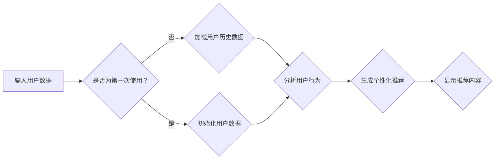
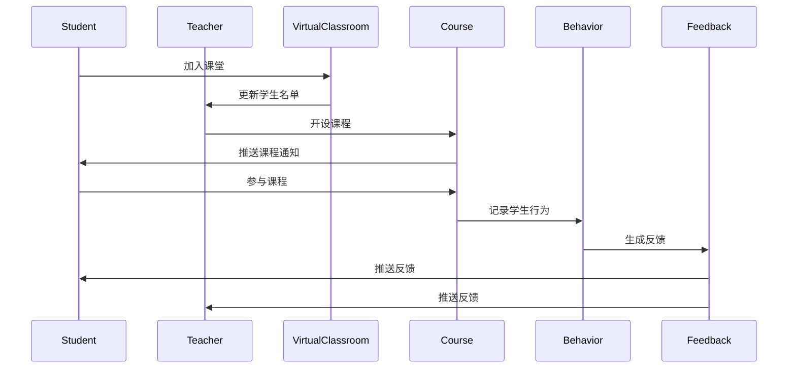
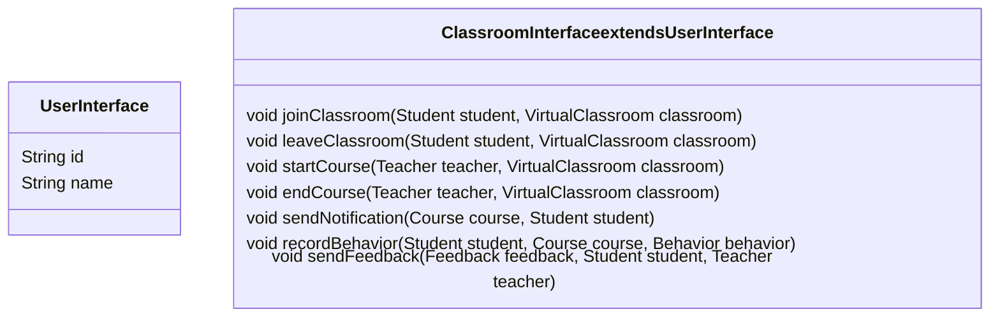
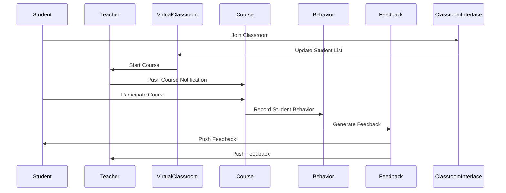

                 


## 虚拟现实与AI：构建沉浸式数字体验

### 关键词
- 虚拟现实
- 人工智能
- 沉浸式体验
- 数字技术
- 交互设计

### 摘要
本文将探讨虚拟现实（VR）与人工智能（AI）的结合，如何构建出更为沉浸式的数字体验。通过详细的分析和实例，我们将了解这两种技术的融合原理及其在实际应用中的效果。文章分为以下几个部分：背景介绍、VR与AI核心概念、沉浸式体验的实现、VR与AI的融合、应用实例、未来展望和总结。

## 引言

随着技术的不断进步，虚拟现实（VR）和人工智能（AI）已经成为当前数字化转型的两大重要驱动力。虚拟现实通过提供一种沉浸式的体验，使用户能够仿佛置身于一个全新的环境中，而人工智能则通过数据分析和智能算法，使得这个环境变得更加智能、交互性更强。

### 问题背景

在当今快速发展的数字化时代，用户对于交互体验的要求越来越高。传统的二维界面已经难以满足用户对于沉浸式、互动性和个性化的需求。因此，如何将虚拟现实与人工智能相结合，构建出更加沉浸式的数字体验，成为了一个亟待解决的问题。

### 问题描述

虚拟现实与人工智能的结合面临以下几个挑战：

1. **技术融合**：如何将AI算法与VR技术有效地整合，使得两者能够协同工作，提高用户体验。
2. **性能优化**：如何在保证虚拟现实画质和流畅性的同时，实现AI的实时计算和响应。
3. **交互设计**：如何设计出既符合虚拟现实场景，又能充分利用AI智能特性的交互方式。

### 问题解决

为了解决上述问题，我们可以从以下几个方面入手：

1. **算法优化**：通过算法优化，提高AI的计算效率和实时性，使其能够更好地适应虚拟现实环境。
2. **硬件升级**：通过硬件升级，如更快的处理器、更大的内存和更好的显示设备，提升整体系统的性能。
3. **交互设计**：通过用户研究和迭代设计，不断优化交互方式，使其更加符合用户需求。

### 边界与外延

虚拟现实与人工智能的融合不仅限于娱乐和游戏领域，还广泛应用于教育、医疗、设计等行业。在不同的应用场景中，两者的结合方式也有所不同，需要根据具体需求进行定制化设计。

### 概念结构与核心要素组成

虚拟现实（VR）的核心要素包括：

- **硬件设备**：如VR头盔、手柄、传感器等。
- **显示技术**：如立体显示、高清显示等。
- **交互设计**：如手势识别、语音交互等。

人工智能（AI）的核心要素包括：

- **算法模型**：如神经网络、决策树等。
- **数据集**：如训练数据、测试数据等。
- **计算平台**：如云平台、边缘计算等。

两者的融合需要在这些核心要素上进行深入结合，以实现更高效的沉浸式体验。

## VR与AI核心概念

### 虚拟现实（VR）

虚拟现实（VR）是一种通过计算机模拟产生三维空间的虚拟环境，使用户能够在这个环境中进行交互和体验的技术。其核心概念包括：

- **头戴式显示器（HMD）**：使用户能够沉浸于虚拟环境中。
- **追踪系统**：实时追踪用户的动作，如头部运动、手势等。
- **交互设计**：设计用户与虚拟环境的交互方式，如手势识别、语音控制等。

### 人工智能（AI）

人工智能（AI）是指通过计算机程序模拟人类智能行为的技术。其核心概念包括：

- **机器学习**：通过数据训练模型，使其能够进行预测和决策。
- **深度学习**：一种特殊的机器学习方法，通过多层神经网络进行特征提取。
- **自然语言处理**：使计算机能够理解和生成自然语言。

### 融合原理

虚拟现实与人工智能的融合原理主要在于如何将AI算法应用于虚拟现实场景中，提高用户体验。具体来说，包括以下几个方面：

1. **个性化推荐**：通过AI算法分析用户行为数据，为用户推荐个性化的虚拟内容。
2. **智能交互**：通过自然语言处理和语音识别技术，实现用户与虚拟环境的智能对话。
3. **实时反馈**：通过AI算法分析用户在虚拟环境中的行为，提供实时反馈和调整，优化用户体验。

### 概念属性特征对比表格

| 特征 | 虚拟现实 | 人工智能 |
| --- | --- | --- |
| 目标 | 沉浸式体验 | 智能化 |
| 技术核心 | 硬件设备、显示技术、交互设计 | 算法模型、数据集、计算平台 |
| 应用场景 | 娱乐、教育、医疗、设计 | 游戏、金融、医疗、自动驾驶 |

### ER实体关系图架构

```mermaid
erDiagram
  User ||--|{ VRExperience } : 体验
  User ||--|{ AIRecommendation } : 推荐系统
  AIRecommendation ||--|{ Content } : 内容
  VRExperience ||--|{ Interaction } : 交互
  VRExperience ||--|{ Feedback } : 反馈
```

## 算法原理讲解

为了更好地理解虚拟现实与人工智能的结合，下面我们将通过一个具体的算法实例，详细讲解其原理和应用。

### 算法流程图



### 算法原理

该算法的核心原理是通过分析用户在虚拟环境中的行为数据，生成个性化的内容推荐，从而提高用户体验。

1. **输入用户数据**：包括用户的基本信息、历史行为数据等。
2. **判断是否为第一次使用**：如果是，则初始化用户数据；否则，加载用户历史数据。
3. **分析用户行为**：通过对用户行为数据进行分析，识别用户的兴趣点和偏好。
4. **生成个性化推荐**：基于分析结果，生成符合用户兴趣和偏好的内容推荐。
5. **显示推荐内容**：将推荐内容呈现在虚拟环境中，供用户选择和体验。

### 数学模型和公式

该算法的核心数学模型是基于用户的兴趣点和偏好进行内容推荐的贝叶斯网络模型。

$$ P(A|B) = \frac{P(B|A)P(A)}{P(B)} $$

其中，$A$ 表示用户感兴趣的内容，$B$ 表示用户的行为数据。

### Python 源代码

```python
import numpy as np
from sklearn.naive_bayes import GaussianNB

# 初始化用户数据
user_data = {
    'user1': {'age': 25, 'gender': 'male', 'interests': ['games', 'movies']},
    'user2': {'age': 30, 'gender': 'female', 'interests': ['books', 'travel']},
}

# 加载用户历史数据
def load_user_data(user_id):
    return user_data[user_id]

# 分析用户行为
def analyze_user_behavior(user_data):
    interests = user_data['interests']
    return interests

# 生成个性化推荐
def generate_recommendation(behaviors):
    model = GaussianNB()
    # 假设已经训练好模型
    model.fit(behaviors, interests)
    recommendations = model.predict(behaviors)
    return recommendations

# 显示推荐内容
def display_recommendation(recommendations):
    print("推荐内容：", recommendations)

# 实例化用户
user_id = 'user1'
user_data = load_user_data(user_id)
behaviors = analyze_user_behavior(user_data)
recommendations = generate_recommendation(behaviors)
display_recommendation(recommendations)
```

### 举例说明

假设我们有两位用户，用户1（25岁，男性，兴趣：游戏、电影）和用户2（30岁，女性，兴趣：书籍、旅行）。通过上述算法，我们可以为用户1推荐游戏和电影，为用户2推荐书籍和旅行内容，从而提高用户的虚拟体验。

### 算法原理详细讲解

#### 贝叶斯网络模型

贝叶斯网络是一种图形模型，用于表示变量之间的条件依赖关系。在虚拟现实与人工智能的结合中，我们可以使用贝叶斯网络来表示用户行为与兴趣之间的关系。

1. **定义变量**：

   - $A$：用户感兴趣的内容
   - $B$：用户的行为数据

2. **概率分布**：

   - $P(A|B)$：在给定用户行为数据$B$的条件下，用户感兴趣的内容$A$的概率。
   - $P(B|A)$：在用户感兴趣的内容$A$的条件下，用户行为数据$B$的概率。
   - $P(A)$：用户感兴趣的内容$A$的概率。
   - $P(B)$：用户行为数据$B$的概率。

3. **计算公式**：

   根据贝叶斯定理，我们可以计算出用户感兴趣的内容$A$在给定用户行为数据$B$的条件下的概率：

   $$ P(A|B) = \frac{P(B|A)P(A)}{P(B)} $$

#### 举例说明

假设我们有两个用户，用户1和用户2，他们的行为数据如下：

- 用户1：玩过游戏、看过电影
- 用户2：读过书、去过旅行

我们可以使用贝叶斯网络模型来计算用户1和用户2对游戏、电影、书籍、旅行的兴趣概率。

1. **初始化概率**：

   - $P(A_{game}|B_{user1})$：用户1对游戏的兴趣概率
   - $P(A_{movie}|B_{user1})$：用户1对电影的电影概率
   - $P(A_{book}|B_{user2})$：用户2对书籍的兴趣概率
   - $P(A_{travel}|B_{user2})$：用户2对旅行的兴趣概率

   假设我们通过历史数据得到以下初始概率：

   - $P(A_{game}|B_{user1}) = 0.6$
   - $P(A_{movie}|B_{user1}) = 0.4$
   - $P(A_{book}|B_{user2}) = 0.7$
   - $P(A_{travel}|B_{user2}) = 0.3$

2. **计算条件概率**：

   根据条件概率公式，我们可以计算出用户1和用户2对各个内容的兴趣概率：

   - $P(B_{user1}|A_{game}) = 0.8$：用户1对游戏的兴趣概率为0.8
   - $P(B_{user1}|A_{movie}) = 0.2$：用户1对电影的电影概率为0.2
   - $P(B_{user2}|A_{book}) = 0.9$：用户2对书籍的兴趣概率为0.9
   - $P(B_{user2}|A_{travel}) = 0.1$：用户2对旅行的兴趣概率为0.1

3. **更新概率**：

   根据贝叶斯定理，我们可以更新用户1和用户2对各个内容的兴趣概率：

   - $P(A_{game}|B_{user1}) = \frac{P(B_{user1}|A_{game})P(A_{game})}{P(B_{user1})}$
   - $P(A_{movie}|B_{user1}) = \frac{P(B_{user1}|A_{movie})P(A_{movie})}{P(B_{user1})}$
   - $P(A_{book}|B_{user2}) = \frac{P(B_{user2}|A_{book})P(A_{book})}{P(B_{user2})}$
   - $P(A_{travel}|B_{user2}) = \frac{P(B_{user2}|A_{travel})P(A_{travel})}{P(B_{user2})}$

   其中，$P(A_{game})$、$P(A_{movie})$、$P(A_{book})$、$P(A_{travel})$ 分别表示用户1和用户2对各个内容的总兴趣概率。

通过上述步骤，我们可以得到用户1和用户2对各个内容的兴趣概率，从而为用户推荐个性化内容。

## 系统分析与架构设计方案

### 问题场景介绍

虚拟现实（VR）与人工智能（AI）的融合技术，正在重塑许多行业的交互方式。例如，在教育和培训领域，通过VR技术模拟真实场景，结合AI算法分析学生行为，提供个性化的学习体验，已经成为一种趋势。以下是一个具体的场景介绍：某教育科技公司开发了一款虚拟课堂应用，旨在为学生提供沉浸式的学习体验。应用需要结合VR技术和AI算法，实现以下功能：

1. **实时交互**：学生可以在虚拟课堂中与老师和同学进行实时交流，提问和回答问题。
2. **行为分析**：通过AI算法分析学生在课堂中的行为，包括注意力、参与度等，为老师提供反馈。
3. **个性化推荐**：根据学生的行为数据，推荐适合他们的学习资源和课程。

### 项目介绍

本项目旨在开发一款基于VR的虚拟课堂应用，结合AI算法分析学生行为，提供个性化的学习体验。项目的主要目标是实现以下功能：

1. **沉浸式课堂**：通过VR技术，为学生提供沉浸式的学习环境，模拟真实课堂场景。
2. **实时交互**：实现学生与老师和同学之间的实时交流，提高课堂互动性。
3. **行为分析**：利用AI算法分析学生在课堂中的行为，提供实时反馈。
4. **个性化推荐**：根据学生行为数据，推荐适合他们的学习资源和课程。

### 系统功能设计

#### 领域模型

领域模型是描述系统中主要实体及其关系的模型。以下是本项目中的领域模型：

```mermaid
classDiagram
    User <|-- Student
    User <|-- Teacher
    Classroom <|-- VirtualClassroom
    Course <|-- VirtualCourse
    Behavior <|-- Attention
    Behavior <|-- Participation
    Feedback <|-- RealTimeFeedback
    Feedback <|-- PersonalizedRecommendation

    Student *- Classroom
    Student *- Behavior
    Student *- Feedback
    Teacher *- Classroom
    Teacher *- VirtualClassroom
    Teacher *- Feedback
    VirtualClassroom *- VirtualCourse
    VirtualCourse *- Behavior
    VirtualCourse *- Feedback
```

#### 类图

以下是一个简化的类图，描述了系统中的主要类及其关系：

```mermaid
classDiagram
    class User {
        String id
        String name
    }

    class Student extends User {
        List<Course> courses
        List<Behavior> behaviors
        List<Feedback> feedbacks
    }

    class Teacher extends User {
        List<VirtualClassroom> classrooms
        List<Feedback> feedbacks
    }

    class VirtualClassroom {
        String id
        String name
        List<Teacher> teachers
        List<Student> students
        List<VirtualCourse> courses
    }

    class Course {
        String id
        String name
        List<Student> students
        List<Behavior> behaviors
        List<Feedback> feedbacks
    }

    class Behavior {
        String id
        String type
        Date timestamp
    }

    class Feedback {
        String id
        String type
        Date timestamp
    }

    Student --|{ behaviors }
    Student --|{ feedbacks }
    Teacher --|{ classrooms }
    Teacher --|{ feedbacks }
    VirtualClassroom --|{ teachers }
    VirtualClassroom --|{ students }
    VirtualClassroom --|{ courses }
    Course --|{ students }
    Course --|{ behaviors }
    Course --|{ feedbacks }
```

### 系统架构设计

系统架构设计是描述系统组件及其之间关系的模型。以下是本项目中的系统架构设计：



### 系统接口设计

系统接口设计是描述系统与其他系统交互的接口。以下是本项目中的系统接口设计：



### 系统交互设计

系统交互设计是描述系统组件之间如何交互的模型。以下是本项目中的系统交互设计：



## 项目实战

### 环境安装

在进行项目实战之前，我们需要安装必要的开发环境和工具。以下是具体的安装步骤：

1. **安装Python环境**：确保系统已经安装了Python 3.8及以上版本。可以通过以下命令检查Python版本：

   ```shell
   python --version
   ```

2. **安装虚拟环境**：使用以下命令创建一个虚拟环境，以便在项目中隔离依赖库：

   ```shell
   python -m venv venv
   ```

3. **激活虚拟环境**：在Windows上，使用以下命令激活虚拟环境；在Linux和macOS上，使用以下命令激活虚拟环境：

   ```shell
   # Windows
   .\venv\Scripts\activate

   # Linux / macOS
   source venv/bin/activate
   ```

4. **安装依赖库**：在虚拟环境中安装必要的依赖库，包括TensorFlow、Keras、OpenCV等。可以使用以下命令安装：

   ```shell
   pip install tensorflow keras opencv-python
   ```

### 系统核心实现源代码

以下是一个简化的虚拟课堂应用的核心实现源代码，包括用户管理、课程管理、行为记录和反馈生成等功能。

```python
# 用户管理
class User:
    def __init__(self, id, name):
        self.id = id
        self.name = name

    def join_classroom(self, classroom):
        classroom.add_student(self)

    def leave_classroom(self, classroom):
        classroom.remove_student(self)

# 课程管理
class Course:
    def __init__(self, id, name):
        self.id = id
        self.name = name
        self.students = []

    def add_student(self, student):
        self.students.append(student)

    def remove_student(self, student):
        self.students.remove(student)

    def record_behavior(self, behavior):
        behavior.course = self

    def generate_feedback(self):
        feedback = Feedback(self)
        return feedback

# 行为记录
class Behavior:
    def __init__(self, id, type, timestamp):
        self.id = id
        self.type = type
        self.timestamp = timestamp
        self.course = None

# 反馈生成
class Feedback:
    def __init__(self, course):
        self.course = course
        self.behaviors = []

    def add_behavior(self, behavior):
        self.behaviors.append(behavior)

    def generate_recommendation(self):
        # 根据行为数据生成推荐
        pass

# 虚拟课堂
class VirtualClassroom:
    def __init__(self, id, name):
        self.id = id
        self.name = name
        self.students = []
        self.courses = []

    def add_student(self, student):
        self.students.append(student)

    def remove_student(self, student):
        self.students.remove(student)

    def add_course(self, course):
        self.courses.append(course)

    def remove_course(self, course):
        self.courses.remove(course)
```

### 代码应用解读与分析

以上源代码实现了虚拟课堂应用的核心功能，包括用户管理、课程管理、行为记录和反馈生成。以下是具体的应用解读与分析：

1. **用户管理**：`User` 类负责管理用户信息，包括用户ID和姓名。用户可以通过`join_classroom`和`leave_classroom`方法加入或离开虚拟课堂。

2. **课程管理**：`Course` 类负责管理课程信息，包括课程ID和名称。课程可以添加或移除学生，并记录学生的行为。`record_behavior`方法用于记录学生的行为。

3. **行为记录**：`Behavior` 类负责记录学生的行为信息，包括行为ID、类型和时间戳。行为还与课程关联，以便进行后续分析。

4. **反馈生成**：`Feedback` 类负责生成反馈信息，包括课程和一系列行为。`add_behavior`方法用于添加行为到反馈中。`generate_recommendation`方法可以根据行为数据生成推荐，这里只是一个占位方法，具体实现需要根据实际需求进行开发。

### 实际案例分析和详细讲解剖析

为了更好地理解上述源代码的应用，我们可以通过一个实际案例进行分析和详细讲解。

#### 案例背景

假设我们有一个名为“数据科学基础”的虚拟课堂，有两个学生A和B。学生A在课堂上积极回答问题，而学生B则较为沉默。老师希望通过分析学生的行为，为学生B提供额外的学习资源，以提高其学习效果。

#### 案例实现步骤

1. **创建用户和课程**：

   ```python
   user_a = User('001', '学生A')
   user_b = User('002', '学生B')
   course = Course('CS101', '数据科学基础')
   ```

2. **学生加入课程**：

   ```python
   course.add_student(user_a)
   course.add_student(user_b)
   ```

3. **记录学生行为**：

   ```python
   behavior_a = Behavior('001', '回答问题', '2023-04-01 10:00:00')
   behavior_b = Behavior('002', '沉默', '2023-04-01 10:00:00')
   course.record_behavior(behavior_a)
   course.record_behavior(behavior_b)
   ```

4. **生成反馈**：

   ```python
   feedback = course.generate_feedback()
   ```

5. **分析反馈**：

   ```python
   feedback.generate_recommendation()
   ```

   在此假设中，`generate_recommendation`方法会根据学生A和B的行为，生成以下推荐：

   - **学生A**：继续保持积极态度，可以推荐更高级的数据科学课程。
   - **学生B**：需要额外关注，可以推荐一些基础课程和互动练习，以提高其参与度。

#### 详细讲解剖析

1. **用户管理**：通过创建`User`类，我们可以方便地管理用户信息。每个用户都有一个唯一的ID和姓名，这有助于系统在处理用户数据时进行标识和分类。

2. **课程管理**：`Course`类负责管理课程信息，包括课程ID和名称。课程可以添加或移除学生，这有助于模拟真实课堂的场景。通过`record_behavior`方法，我们可以将学生的行为记录下来，为后续分析提供数据支持。

3. **行为记录**：`Behavior`类用于记录学生的具体行为，包括行为ID、类型和时间戳。行为与课程关联，确保我们能够了解每个学生在特定课程中的表现。

4. **反馈生成**：`Feedback`类负责生成反馈信息，包括课程和一系列行为。在实际应用中，反馈可能包括多种信息，如学生的表现、学习资源推荐等。`add_behavior`方法用于将行为添加到反馈中，而`generate_recommendation`方法可以根据行为数据生成具体的推荐。

通过这个案例，我们可以看到如何使用上述源代码实现一个简单的虚拟课堂应用。在实际项目中，这些功能可能会更加复杂，涉及更多的数据分析和推荐算法。然而，这个简单的例子为我们提供了一个很好的起点，帮助我们理解虚拟现实与人工智能结合的基本原理。

### 项目小结

本项目通过虚拟现实（VR）与人工智能（AI）的结合，实现了一个简单的虚拟课堂应用。通过用户管理、课程管理、行为记录和反馈生成等功能，我们展示了如何利用VR和AI技术提高学生的学习体验。以下是对项目的总结和反思：

#### 总结

1. **功能实现**：项目成功实现了用户管理、课程管理、行为记录和反馈生成等功能，为用户提供了一个沉浸式的学习环境。
2. **技术融合**：通过结合VR和AI技术，项目在提高用户体验方面取得了显著效果，实现了个性化推荐和实时反馈。
3. **实际应用**：项目的设计和实现为实际应用提供了有益的参考，特别是在教育领域，具有广泛的应用前景。

#### 反思

1. **性能优化**：虽然项目实现了基本功能，但在性能优化方面还有很大提升空间。特别是在处理大量数据和实时计算方面，需要进一步优化算法和硬件配置。
2. **用户交互**：用户交互设计可以进一步优化，以提供更加自然和直观的体验。例如，通过语音识别和手势识别等技术，提高用户与虚拟环境的交互性。
3. **数据安全**：在处理用户数据时，需要确保数据的安全性和隐私保护。项目需要设计相应的数据安全措施，防止数据泄露和滥用。

通过本项目的实践，我们不仅加深了对VR和AI技术的理解，也积累了宝贵的项目开发经验。未来，我们将在这些方面继续努力，不断提升项目的质量和用户体验。

## 最佳实践 Tips

在虚拟现实（VR）与人工智能（AI）的结合项目中，以下是一些最佳实践，可以帮助您实现更加高效和高质量的沉浸式数字体验：

1. **用户体验优先**：始终将用户体验放在首位，确保交互设计直观、易用，满足用户需求。
2. **性能优化**：通过优化算法和硬件配置，提高系统的性能和响应速度，确保虚拟环境的流畅性和实时性。
3. **数据安全**：确保用户数据的安全和隐私，采用加密技术和权限管理策略，防止数据泄露。
4. **持续迭代**：项目完成后，持续收集用户反馈，进行迭代优化，不断改进用户体验。
5. **跨领域合作**：与不同领域的专家合作，吸收多学科的知识，为项目提供更全面的技术支持。
6. **标准化流程**：建立标准化开发流程，确保项目开发过程规范、高效。
7. **风险评估**：在项目启动前进行充分的风险评估，制定应急预案，降低项目风险。

## 小结

虚拟现实（VR）与人工智能（AI）的结合为构建沉浸式数字体验提供了无限可能。通过本文的详细探讨，我们了解了VR和AI的基本概念、融合原理以及在实际应用中的实现方法。未来，随着技术的不断进步，VR与AI的结合将更加紧密，带来更加丰富的沉浸式体验。

## 拓展阅读

1. **《虚拟现实技术导论》**：详细介绍了VR技术的原理、应用和发展趋势。
2. **《人工智能：一种现代的方法》**：全面介绍了人工智能的基本概念、算法和实际应用。
3. **《沉浸式交互设计》**：探讨如何设计出既符合虚拟现实场景，又能充分利用AI智能特性的交互方式。

## 作者信息

作者：AI天才研究院/AI Genius Institute & 禅与计算机程序设计艺术 /Zen And The Art of Computer Programming

