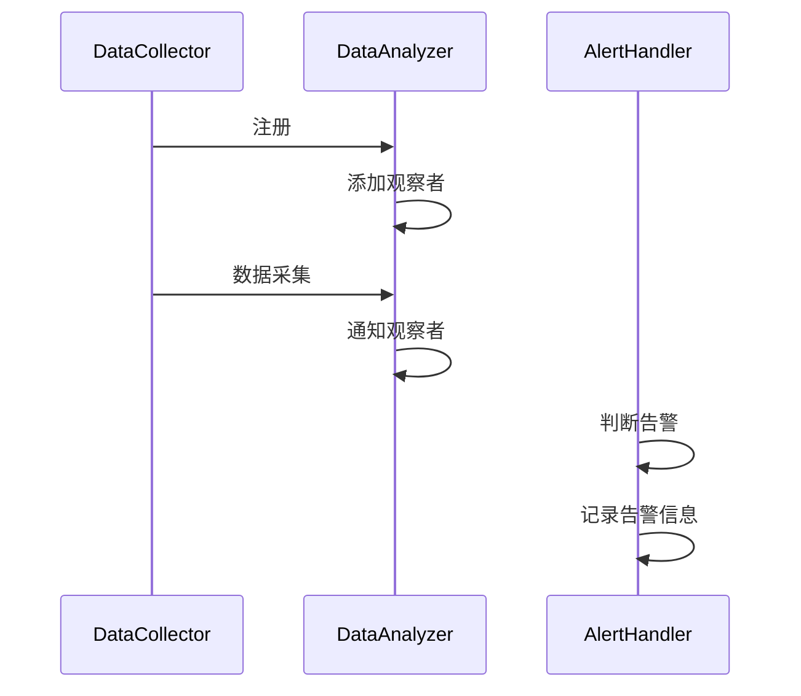
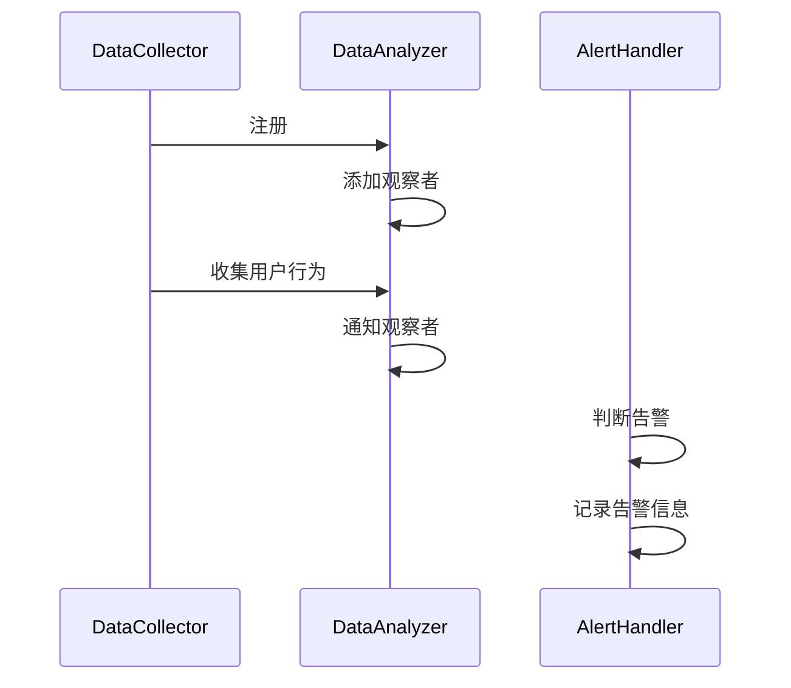
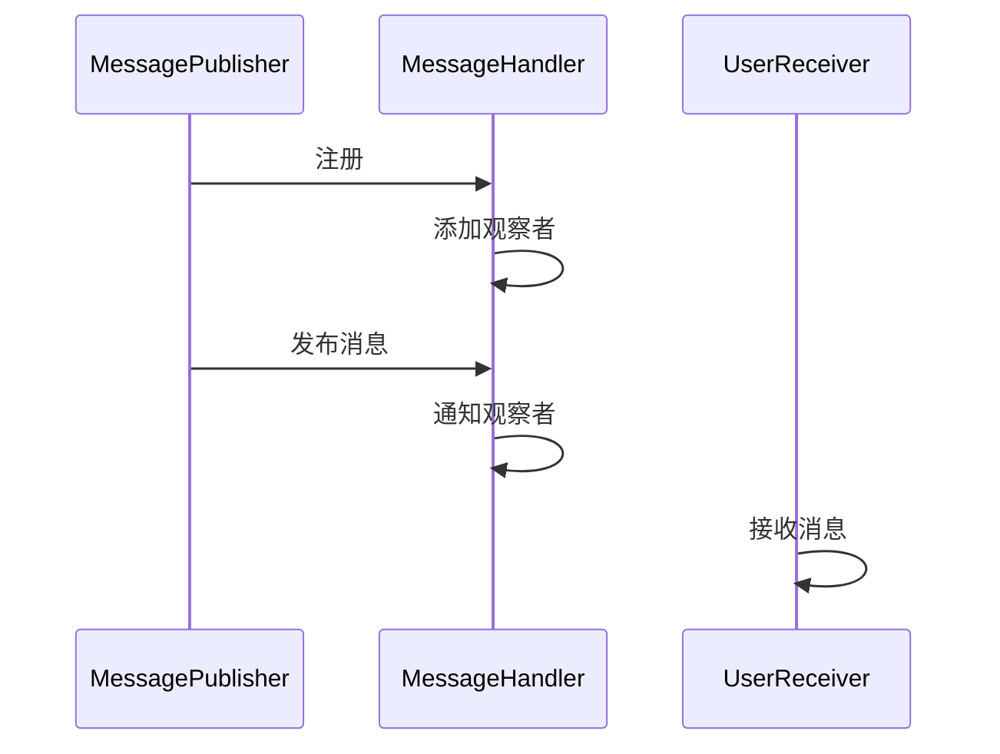

                 

### 1.1 书籍背景和目的

#### 1.1.1 观察者模式的背景

观察者模式（Observer Pattern）是一种设计模式，旨在实现对象间的解耦，使得一个对象（被称为观察者）的任何状态变化都能自动通知一组其他对象（被称为被观察者）。这一模式的核心思想是通过定义对象间的一种一对多的依赖关系来实现通信，而不需要这些对象之间相互显式地引用。

观察者模式的历史可以追溯到20世纪80年代，当时在软件开发领域，为了处理复杂系统的交互和状态变化，观察者模式被广泛采用。其灵感来源于现实生活中的观察者-被观察者的关系，比如在一个家庭中，如果有人敲门，所有在房间的家庭成员都会知道并作出相应的反应。这种模式在软件工程中有着广泛的应用，尤其在用户界面设计、事件处理、系统监控等方面。

#### 1.1.2 类型论基础

类型论（Type Theory）是数学和逻辑领域的一个分支，主要研究类型系统的概念和理论。类型论的基础是类型系统，它通过为变量、表达式和函数提供类型，来保证程序的正确性。在类型论中，类型不仅用于表示数据，还用于表示操作和程序结构。

类型论起源于20世纪30年代，当时为了解决数学证明的严密性和一致性，直觉类型论（Intuitionistic Type Theory）被提出。在计算机科学中，皮埃尔·德·雷诺和彼得·兰伯特等人对类型论进行了深入研究，并开发了依赖类型系统（Dependent Type System），这在函数式编程语言如Haskell和Idris中得到了广泛应用。

#### 1.1.3 事件驱动编程的重要性

事件驱动编程（Event-Driven Programming）是一种编程范式，其核心思想是程序的执行由外部或内部事件触发。事件可以是用户交互、计时器、系统信号等。在这种编程范式中，程序通常由一系列独立的事件处理函数组成，每个函数对应一个特定的事件。

事件驱动编程的重要性体现在其灵活性和可扩展性。通过事件驱动编程，开发者可以更容易地处理并发问题，实现复杂的用户界面和实时系统。此外，事件驱动编程还使得代码更加模块化和可重用，便于维护和扩展。

#### 1.1.4 书籍的目的与读者对象

本书旨在为读者提供关于观察者模式和类型论基础在事件驱动编程中应用的全面理解和深入探讨。通过本书，读者将了解：

1. 观察者模式的基本概念、原理和设计方法。
2. 类型论的基础知识、类型系统的构建和应用。
3. 观察者模式在事件驱动编程中的实现和优化策略。
4. 观察者模式在不同应用场景中的实战案例和最佳实践。

本书主要面向以下读者群体：

1. 软件工程师和开发人员，特别是对设计模式、类型论和事件驱动编程感兴趣的读者。
2. 计算机科学和软件工程专业的学生，希望深入理解这些核心概念。
3. 系统架构师和CTO，寻求提升系统设计质量和稳定性的专业人士。

通过本书的学习，读者不仅可以掌握观察者模式和类型论基础，还能将其应用到实际项目中，提高编程技能和系统设计能力。本书将以深入浅出的方式，帮助读者逐步掌握这些复杂但重要的技术概念。### 1.2 目录概述

#### 1.2.1 书籍结构

本书的结构旨在循序渐进地引导读者从基础概念到高级应用，全面了解观察者模式和类型论基础在事件驱动编程中的应用。全书分为五个主要部分，每个部分都围绕特定的主题展开，确保内容的系统性和逻辑性。

**第一部分：观察者模式基础**
- 第1章：介绍观察者模式的基本概念、原理和应用场景。
- 第2章：探讨类型论基础，包括类型系统的构建和应用。

**第二部分：观察者模式设计与应用**
- 第3章：详细描述观察者模式的设计原则和实现步骤。
- 第4章：通过代码示例，深入分析观察者模式的实现细节。

**第三部分：观察者模式高级讨论**
- 第5章：扩展观察者模式，包括多播观察者模式和反向观察者模式。
- 第6章：探讨类型论在事件驱动编程中的应用，优化策略和性能分析。

**第四部分：实战案例与最佳实践**
- 第7章：通过具体案例，展示观察者模式在不同场景中的应用。
- 第8章：总结最佳实践，提供设计、实现和调试的实用建议。

**第五部分：结论与未来展望**
- 第9章：回顾本书的主要观点，探讨观察者模式和类型论的发展趋势。

#### 1.2.2 各章节内容概要

**第一部分：观察者模式基础**
- 第1章：观察者模式简介
  - 介绍观察者模式的基本概念和原理。
  - 分析模式的应用场景和重要性。

- 第2章：类型论基础
  - 概述类型论的基本概念和类型系统。
  - 讨论依赖类型系统的构建和应用。

**第二部分：观察者模式设计与应用**
- 第3章：观察者模式设计
  - 详细描述设计原则和步骤。
  - 结合类型论基础，探讨设计模式与类型论的结合。

- 第4章：观察者模式实现
  - 通过代码示例，深入分析观察者模式的实现细节。
  - 提供不同的实现策略和技巧。

**第三部分：观察者模式高级讨论**
- 第5章：观察者模式扩展
  - 介绍多播观察者模式和反向观察者模式。
  - 分析这些模式的优缺点和适用场景。

- 第6章：类型论在事件驱动编程中的应用
  - 探讨类型论在模式设计、实现和优化中的应用。
  - 提出性能优化策略和调试技巧。

**第四部分：实战案例与最佳实践**
- 第7章：观察者模式实战案例
  - 通过具体案例，展示观察者模式在不同场景中的应用。
  - 分析案例中的设计实现和效果评估。

- 第8章：最佳实践
  - 总结设计、实现和调试的最佳实践。
  - 提供实用的建议和技巧。

**第五部分：结论与未来展望**
- 第9章：结论与展望
  - 回顾本书的主要观点和贡献。
  - 探讨观察者模式和类型论的发展趋势和未来研究方向。

通过上述结构，本书旨在系统地介绍观察者模式和类型论基础，帮助读者深入理解其在事件驱动编程中的应用，并通过实战案例和最佳实践，提升实际编程技能和系统设计能力。### 2.1 观察者模式简介

观察者模式（Observer Pattern）是一种设计模式，用于实现对象之间的解耦合，使得一个对象的状态变化能够自动通知一组其他对象。在观察者模式中，包含两个核心角色：观察者（Observer）和被观察者（Subject）。观察者对象负责监听被观察者的状态变化，并在变化发生时触发相应的操作；而被观察者对象则负责维护一组观察者对象，并在状态变化时通知这些观察者。

#### 2.1.1 模式定义

观察者模式是一种行为型设计模式，其定义如下：

> 当一个对象的状态发生变化时，它的所有依赖者（即观察者）都会收到通知并被自动更新。

这种模式的核心在于解除对象间的耦合，使得对象可以独立变化而不相互影响。通过观察者模式，一个对象无需知道其他对象的存在，只需通知状态变化即可。

#### 2.1.2 模式特点

观察者模式具有以下几个显著特点：

1. **解耦合**：观察者和被观察者之间通过抽象接口进行通信，不需要知道对方的实现细节。这使得两者之间的依赖性最小化，增强了系统的可维护性和扩展性。

2. **一对多关系**：一个被观察者对象可以同时拥有多个观察者对象。这种一对多的依赖关系使得系统在处理复杂状态变化时更为灵活和高效。

3. **通知与响应**：当被观察者的状态发生变化时，它会通知所有注册的观察者。观察者收到通知后，会根据变化的类型和内容进行相应的响应处理。这种机制使得状态更新和业务逻辑分离，使得系统更加模块化和可重用。

4. **动态性**：观察者和被观察者可以在运行时动态注册和注销。这意味着系统可以根据需要灵活地调整观察者的集合，适应不同场景和需求。

#### 2.1.3 模式应用场景

观察者模式在软件开发中有着广泛的应用，以下是一些典型的应用场景：

1. **用户界面设计**：在图形用户界面（GUI）中，许多组件需要响应用户操作。例如，当一个文本框的内容发生变化时，需要更新与其相关的其他组件。观察者模式使得这种交互变得更加简单和灵活。

2. **事件处理**：在事件驱动的编程范式中，事件处理程序经常使用观察者模式来管理事件。例如，在Web应用中，用户点击按钮会触发一系列事件，这些事件可以通过观察者模式进行统一管理和响应。

3. **系统监控**：在系统监控领域，观察者模式可以用来实时监控系统的各种状态和指标。例如，当系统的内存使用率超过阈值时，需要通知管理员和其他相关组件进行相应的处理。

4. **数据绑定**：在数据绑定框架中，观察者模式用于实现数据的双向绑定。例如，在一个表单中，当用户输入数据时，相关的数据显示组件会自动更新，而不需要显式地编写更新代码。

5. **发布-订阅模式**：在消息队列和消息中间件中，观察者模式用于实现发布-订阅模式。发布者发布消息，订阅者根据订阅的主题接收相应的消息，这种模式在处理大规模分布式系统中尤为有效。

通过上述应用场景，可以看出观察者模式在软件设计中的重要作用。它不仅提高了系统的可扩展性和灵活性，还使得代码更加模块化和易于维护。在接下来的章节中，我们将深入探讨观察者模式的设计原则和实现方法，以及类型论基础如何在其中发挥作用。### 2.2 类型论基础

#### 2.2.1 类型论概述

类型论（Type Theory）是数学和逻辑领域的一个分支，主要研究类型系统的概念和理论。类型论的基础是类型系统，它通过为变量、表达式和函数提供类型，来保证程序的正确性。类型论的核心思想是，通过类型检查来确保程序在执行前不会出现语义错误。这种思想在函数式编程语言和形式验证中有着广泛的应用。

类型论最早由皮埃尔·德·雷诺（Pierre Deligne）在20世纪60年代提出，其目的是解决数学证明的严密性和一致性。在计算机科学中，类型论的研究得到了进一步的发展，尤其是依赖类型系统（Dependent Type System）的提出，为静态类型编程语言带来了更多的灵活性和表达力。

#### 2.2.2 类型论基本概念

类型论的基本概念包括：

1. **类型**：类型是变量、表达式和函数的属性，用于描述它们的语义和行为。在类型论中，类型不仅用于表示数据，还用于表示操作和程序结构。

2. **类型系统**：类型系统是一套规则和约束，用于定义类型的集合以及如何对这些类型进行操作。类型系统的作用是确保程序在执行前不会出现语义错误。

3. **类型检查**：类型检查是类型系统的一部分，用于在程序执行前验证变量、表达式和函数的类型是否匹配。类型检查的主要目的是发现潜在的错误，防止程序在运行时崩溃。

4. **依赖类型**：依赖类型（Dependent Type）是一种类型的值可以影响另一个类型的定义。这种类型系统提供了更强大的表达能力，可以表示更复杂的程序结构和逻辑关系。

5. **类型推断**：类型推断是一种自动确定变量、表达式和函数的类型的方法。类型推断可以减少代码中的显式类型声明，提高代码的可读性和可维护性。

#### 2.2.3 类型论与编程

类型论在编程领域有着重要的应用，主要体现在以下几个方面：

1. **函数式编程**：在函数式编程语言中，类型论提供了强类型的保证，使得程序更加可靠和易于推理。依赖类型系统在函数式编程中尤为重要，它允许函数的返回类型依赖于输入类型，从而提高代码的抽象能力和表达能力。

2. **静态类型检查**：静态类型检查是类型论的核心应用之一。通过静态类型检查，编译器可以在编译阶段发现类型错误，从而避免程序在运行时出现未预期的行为。这种检查机制使得程序更可靠，同时也提高了开发效率。

3. **形式化验证**：类型论在形式化验证中有着广泛的应用。通过形式化验证，可以证明程序的正确性和安全性。类型系统提供了一套严格的语义规则，使得程序员可以更可靠地验证程序的逻辑和属性。

4. **编程语言设计**：类型论为编程语言设计提供了理论基础。现代编程语言如Haskell、Idris和F#等，都借鉴了类型论的思想，引入了依赖类型、类型推断等机制，从而提高了语言的表达能力和可靠性。

#### 2.2.4 类型系统在观察者模式中的应用

在观察者模式中，类型论的应用主要体现在以下几个方面：

1. **类型安全**：通过类型系统，可以确保观察者和被观察者之间的交互是类型安全的。观察者只能接收被观察者通知的类型信息，从而避免类型错误和未预期的行为。

2. **依赖类型**：依赖类型可以用来表示观察者和被观察者之间的依赖关系。例如，被观察者的状态可以是观察者类型的一个依赖类型，从而实现更灵活和精确的类型约束。

3. **类型推断**：类型推断可以简化代码，减少显式类型声明，使得观察者模式更加易读和易维护。通过自动推断类型，可以减少编码错误和提高开发效率。

4. **类型检查**：静态类型检查可以确保观察者和被观察者之间的交互是类型安全的，从而减少潜在的运行时错误。类型检查还可以帮助发现潜在的bug和设计缺陷，提高程序的可靠性和稳定性。

通过类型论的应用，观察者模式在实现过程中可以更好地保证类型安全性和程序正确性，从而提高系统的可靠性和可维护性。在接下来的章节中，我们将进一步探讨观察者模式的设计和实现方法，以及类型论如何在其中发挥作用。### 2.3 事件驱动编程

#### 2.3.1 事件驱动编程概述

事件驱动编程（Event-Driven Programming）是一种编程范式，其核心思想是程序的执行由外部或内部事件触发。在事件驱动编程中，程序通常由一系列独立的事件处理函数组成，每个函数对应一个特定的事件。事件可以是用户交互、计时器、系统信号等。事件驱动编程的一个关键特点是，程序不按顺序执行，而是根据事件的发生来响应和处理。

事件驱动编程的概念可以追溯到早期计算机系统的设计，当时计算机硬件和操作系统的发展促使程序员寻找更加高效和灵活的编程方法。在图形用户界面（GUI）系统中，事件驱动编程得到了广泛应用，因为它能够很好地处理复杂的用户交互和实时响应需求。

#### 2.3.2 事件驱动编程模型

事件驱动编程模型通常包括以下几个关键组成部分：

1. **事件源**：事件源是产生事件的对象或系统，可以是用户输入、硬件信号、计时器等。事件源在事件发生时生成一个事件对象，并将其传递给事件处理系统。

2. **事件处理系统**：事件处理系统负责监听和管理事件。在事件发生时，事件处理系统会根据事件的类型调用相应的事件处理函数。事件处理系统通常包括事件队列、调度器等组件。

3. **事件处理函数**：事件处理函数是程序中负责处理特定事件的函数。每个事件处理函数都接收一个事件对象作为参数，并根据事件的类型和内容进行相应的处理。

4. **回调函数**：在事件驱动编程中，事件处理函数通常使用回调（Callback）机制来传递。这意味着事件处理函数在注册时会被传递给事件处理系统，并在事件发生时被自动调用。

#### 2.3.3 事件驱动编程的优势

事件驱动编程具有以下显著优势：

1. **灵活性**：事件驱动编程使得程序可以根据需要灵活地响应和处理不同类型的事件，增强了系统的可扩展性和适应性。

2. **并发性**：事件驱动编程模型天生支持并发处理。多个事件可以同时发生，并被独立处理，从而提高系统的性能和响应速度。

3. **模块化**：事件驱动编程将程序分解为一系列独立的事件处理函数，使得代码更加模块化和可重用。这种模块化设计提高了代码的可维护性和可测试性。

4. **可重用性**：事件处理函数可以独立开发和测试，从而提高了代码的可重用性。开发者可以复用相同的事件处理逻辑，减少重复代码。

5. **异步处理**：事件驱动编程支持异步处理，可以处理耗时操作而不阻塞主线程。这有助于提高程序的效率和用户体验。

#### 2.3.4 事件驱动编程的应用

事件驱动编程在软件开发中有着广泛的应用，以下是一些典型的应用场景：

1. **用户界面**：在图形用户界面（GUI）中，事件驱动编程用于处理用户的输入操作，如点击、拖动、按键等。事件驱动编程使得用户界面更加动态和互动。

2. **实时系统**：在实时系统中，事件驱动编程用于处理各种实时事件，如传感器数据、系统信号等。实时系统需要快速响应和处理事件，以确保系统的稳定性和可靠性。

3. **Web应用**：在Web应用中，事件驱动编程用于处理用户的交互行为，如点击、提交表单等。事件驱动编程使得Web应用能够实现动态更新和实时响应。

4. **游戏开发**：在游戏开发中，事件驱动编程用于处理游戏逻辑和用户输入。游戏需要实时响应用户操作，并处理各种游戏事件，如碰撞、得分等。

5. **消息队列**：在消息队列系统中，事件驱动编程用于处理消息的发布和订阅。事件驱动编程使得消息队列系统能够高效地处理大规模的分布式消息。

通过上述应用场景，可以看出事件驱动编程在软件开发中的重要作用。它不仅提高了系统的灵活性和并发性，还使得代码更加模块化和可重用。在接下来的章节中，我们将深入探讨观察者模式在事件驱动编程中的应用，以及类型论如何进一步优化这一模式。### 2.3.1 观察者模式设计

观察者模式的设计旨在实现对象间的解耦合，使得一个对象的状态变化能够自动通知一组其他对象。为了实现这一目标，观察者模式需要定义几个核心组件和交互关系。以下是观察者模式的设计原则、步骤和模式与类型论的结合。

#### 2.3.1.1 设计原则

观察者模式遵循以下设计原则：

1. **解耦合**：观察者和被观察者之间通过抽象接口进行通信，减少直接的依赖关系。这样可以确保被观察者对象可以独立变化，而不影响观察者的实现。

2. **单一职责**：被观察者负责管理观察者列表，通知观察者状态变化；观察者负责监听状态变化并作出相应处理。这样每个对象都专注于自己的职责，提高了系统的模块化程度。

3. **扩展性**：观察者模式易于扩展。新的观察者可以动态注册，新的被观察者也可以方便地加入系统。

4. **灵活通知**：被观察者可以在状态变化时通知所有观察者，也可以根据需要通知部分观察者。

#### 2.3.1.2 设计步骤

设计观察者模式通常遵循以下步骤：

1. **定义抽象接口**：
   - **观察者接口**：定义观察者需要实现的方法，如更新（update）方法。
   - **被观察者接口**：定义被观察者需要实现的方法，如注册（attach）、注销（detach）和通知（notify）方法。

2. **实现具体类**：
   - **具体观察者类**：实现观察者接口，定义如何响应该对象的状态变化。
   - **具体被观察者类**：实现被观察者接口，维护一个观察者列表，并在状态变化时通知所有观察者。

3. **注册和注销观察者**：
   - 在系统的初始化阶段，被观察者可以注册观察者。
   - 当观察者的角色或职责发生变化时，可以被观察者注销。

4. **通知观察者**：
   - 当被观察者的状态发生变化时，它会遍历观察者列表，并调用每个观察者的更新方法。

#### 2.3.1.3 设计模式与类型论的结合

观察者模式与类型论的结合主要体现在以下几个方面：

1. **类型安全**：
   - 通过类型论，可以确保观察者和被观察者之间的数据传递是类型安全的。例如，观察者只能接收被观察者通知的类型信息，从而避免类型错误和未预期的行为。

2. **依赖类型**：
   - 依赖类型可以用来表示观察者和被观察者之间的依赖关系。例如，被观察者的状态可以是观察者类型的一个依赖类型，从而实现更灵活和精确的类型约束。

3. **类型推断**：
   - 类型推断可以简化代码，减少显式类型声明，使得观察者模式更加易读和易维护。通过自动推断类型，可以减少编码错误和提高开发效率。

4. **静态类型检查**：
   - 静态类型检查可以确保观察者和被观察者之间的交互是类型安全的，从而减少潜在的运行时错误。类型检查还可以帮助发现潜在的bug和设计缺陷，提高程序的可靠性和稳定性。

以下是一个简单的观察者模式设计与类型论结合的示例：

```python
from typing import List

class Observer:
    def update(self, message: str) -> None:
        pass

class Subject:
    def __init__(self):
        self._observers: List[Observer] = []

    def attach(self, observer: Observer) -> None:
        self._observers.append(observer)

    def detach(self, observer: Observer) -> None:
        self._observers.remove(observer)

    def notify(self, message: str) -> None:
        for observer in self._observers:
            observer.update(message)

class ConcreteObserver(Observer):
    def update(self, message: str) -> None:
        print(f"Observer received message: {message}")

class ConcreteSubject(Subject):
    def __init__(self):
        super().__init__()
        self._state = None

    @property
    def state(self) -> str:
        return self._state

    @state.setter
    def state(self, value: str) -> None:
        self._state = value
        self.notify(value)

subject = ConcreteSubject()
observer = ConcreteObserver()

subject.attach(observer)
subject.state = "New state"
```

在这个示例中，`Observer`和`Subject`类遵循了抽象接口的定义，`ConcreteObserver`和`ConcreteSubject`实现了具体类。通过依赖类型和类型推断，代码更加简洁和易于维护。同时，静态类型检查可以确保对象间的交互是类型安全的，从而提高程序的可靠性。

通过观察者模式的设计与类型论的结合，可以构建出更加灵活、可靠和可维护的系统。在接下来的章节中，我们将通过代码示例进一步探讨观察者模式的实现细节，以及如何在实际项目中应用这一模式。### 2.3.2 观察者模式实现

#### 2.3.2.1 实现细节

观察者模式的实现涉及以下几个关键组件：观察者（Observer）、被观察者（Subject）以及具体的观察者和被观察者实现类。以下是实现观察者模式的详细步骤和代码示例。

1. **定义抽象接口**：

首先，我们需要定义观察者和被观察者的抽象接口。

```python
from typing import List

class Observer:
    def update(self, message: str) -> None:
        pass

class Subject:
    def attach(self, observer: Observer) -> None:
        pass

    def detach(self, observer: Observer) -> None:
        pass

    def notify(self) -> None:
        pass
```

2. **实现具体类**：

接下来，我们需要实现具体的观察者和被观察者类。

```python
class ConcreteObserver(Observer):
    def update(self, message: str) -> None:
        print(f"Observer received message: {message}")

class ConcreteSubject(Subject):
    def __init__(self):
        self._observers: List[Observer] = []

    def attach(self, observer: Observer) -> None:
        self._observers.append(observer)

    def detach(self, observer: Observer) -> None:
        self._observers.remove(observer)

    def notify(self) -> None:
        for observer in self._observers:
            observer.update("Subject state has changed.")
```

在这个示例中，`ConcreteObserver`类实现了`Observer`接口，其`update`方法用于打印接收到的消息。`ConcreteSubject`类实现了`Subject`接口，它维护一个观察者列表，并在状态变化时通知所有观察者。

3. **注册和注销观察者**：

在系统初始化阶段，我们可以注册观察者，并在观察者不再需要时注销。

```python
subject = ConcreteSubject()

observer1 = ConcreteObserver()
observer2 = ConcreteObserver()

subject.attach(observer1)
subject.attach(observer2)
```

4. **通知观察者**：

当被观察者的状态发生变化时，它会通知所有观察者。

```python
subject.notify()
```

这将触发观察者的`update`方法，打印出消息。

#### 2.3.2.2 代码示例

以下是一个完整的代码示例，展示了观察者模式的实现过程：

```python
class Observer:
    def update(self, message: str) -> None:
        pass

class Subject:
    def attach(self, observer: Observer) -> None:
        self._observers.append(observer)

    def detach(self, observer: Observer) -> None:
        self._observers.remove(observer)

    def notify(self) -> None:
        for observer in self._observers:
            observer.update("Subject state has changed.")

class ConcreteObserver(Observer):
    def update(self, message: str) -> None:
        print(f"Observer received message: {message}")

class ConcreteSubject(Subject):
    def __init__(self):
        self._observers: List[Observer] = []

    def notify(self) -> None:
        for observer in self._observers:
            observer.update("Subject state has changed.")

subject = ConcreteSubject()

observer1 = ConcreteObserver()
observer2 = ConcreteObserver()

subject.attach(observer1)
subject.attach(observer2)

subject.notify()
```

运行上述代码，将输出：

```
Observer received message: Subject state has changed.
Observer received message: Subject state has changed.
```

#### 2.3.2.3 代码分析

在这个示例中，`Subject`类维护了一个观察者列表，通过`attach`和`detach`方法可以添加和移除观察者。`notify`方法遍历观察者列表，并调用每个观察者的`update`方法，实现状态变化的广播。

`ConcreteObserver`类实现了`Observer`接口，其`update`方法负责处理接收到的消息。在这个简单示例中，我们仅仅打印了消息，但在实际应用中，观察者可以根据需要执行更复杂的操作。

通过这个示例，我们可以看到观察者模式的实现是相对简单和直接的。这种模式在处理对象间的依赖和状态变化时非常有效，能够提高系统的模块化和可维护性。

在实际项目中，观察者模式的实现可能更加复杂，需要考虑多播观察者模式、反向观察者模式等扩展，以及并发处理和性能优化等问题。在接下来的章节中，我们将进一步探讨这些高级话题。### 2.3.3 观察者模式应用

#### 2.3.3.1 应用场景分析

观察者模式在软件设计和开发中具有广泛的应用，其灵活性和解耦合特性使得它成为处理复杂系统状态变化和依赖关系的理想选择。以下是一些典型的应用场景，以及观察者模式在这些场景中的具体应用。

1. **用户界面**：在图形用户界面（GUI）设计中，观察者模式可以用来处理用户的输入操作，如点击、拖动、按键等。例如，在一个表单中，当用户输入数据并提交时，表单验证逻辑会通知相关组件更新状态，同时用户界面会更新以显示验证结果。

2. **事件处理系统**：在事件驱动的系统中，观察者模式用于管理各种事件。例如，在Web应用中，用户点击按钮会触发一系列事件，这些事件可以通过观察者模式进行统一管理和响应。观察者模式可以确保事件的处理是模块化和可扩展的。

3. **系统监控**：在系统监控领域，观察者模式可以用来实时监控系统的各种状态和指标。例如，当系统的内存使用率超过阈值时，监控组件会收到通知并触发相应的报警机制，同时记录日志以便后续分析。

4. **数据绑定框架**：在数据绑定框架中，观察者模式用于实现数据的双向绑定。例如，在一个富客户端应用中，当用户在文本框中输入数据时，相关的数据显示组件会自动更新，而不需要显式地编写更新代码。

5. **消息队列和发布-订阅系统**：在消息队列和发布-订阅系统中，观察者模式用于实现消息的发布和订阅。例如，在一个分布式系统中，消息发布者可以发布消息，订阅者可以根据订阅的主题接收相应的消息，从而实现异步通信和分布式处理。

#### 2.3.3.2 应用案例解析

以下是一个观察者模式在用户界面中的应用案例：

**案例背景**：一个电商网站需要一个用户界面，用于显示订单状态。订单状态包括创建、支付、发货、完成等。当订单状态发生变化时，需要实时更新用户界面以显示最新的状态。

**解决方案**：

1. **定义抽象接口**：
   - **观察者接口**：定义一个`OrderObserver`接口，包含`update`方法，用于处理订单状态更新。
   - **被观察者接口**：定义一个`OrderSubject`接口，包含`attach`、`detach`和`notify`方法，用于管理观察者列表并通知状态变化。

2. **实现具体类**：
   - **具体观察者类**：例如，`OrderUI`类实现了`OrderObserver`接口，用于更新用户界面。
   - **具体被观察者类**：例如，`Order`类实现了`OrderSubject`接口，用于维护订单状态和观察者列表。

3. **注册和通知观察者**：
   - 在订单创建时，将`OrderUI`实例添加到观察者列表。
   - 当订单状态发生变化时，`Order`实例会通知所有观察者，并调用它们的`update`方法。

**代码示例**：

```python
class OrderObserver:
    def update(self, order_id: str, new_status: str) -> None:
        print(f"Order {order_id} updated to status {new_status}.")

class OrderSubject:
    def __init__(self):
        self._observers: List[OrderObserver] = []

    def attach(self, observer: OrderObserver) -> None:
        self._observers.append(observer)

    def detach(self, observer: OrderObserver) -> None:
        self._observers.remove(observer)

    def notify(self, order_id: str, new_status: str) -> None:
        for observer in self._observers:
            observer.update(order_id, new_status)

class Order:
    def __init__(self, order_id: str):
        self._order_id = order_id
        self._status = "Created"
        self._subject = OrderSubject()

    def update_status(self, new_status: str) -> None:
        self._status = new_status
        self._subject.notify(self._order_id, new_status)

order_ui = OrderObserver()
order = Order("001")

order._subject.attach(order_ui)

order.update_status("Paid")
order.update_status("Shipped")
```

运行上述代码，将输出：

```
Order 001 updated to status Paid.
Order 001 updated to status Shipped.
```

在这个案例中，当订单状态从“创建”更新到“支付”，再到“发货”时，`OrderUI`观察者会接收到通知并更新用户界面以显示最新的订单状态。

#### 2.3.3.3 应用效果评估

观察者模式在实际项目中的应用效果可以从以下几个方面进行评估：

1. **模块化**：观察者模式使得系统模块化程度提高。每个组件都可以独立开发、测试和维护，从而降低了系统的复杂度。

2. **解耦合**：通过观察者模式，对象间的依赖关系被解耦合，对象可以独立变化而不影响其他部分，提高了系统的灵活性和可扩展性。

3. **性能**：观察者模式在处理大量事件时，可能会引入一定的性能开销。但是，通过优化设计（如使用多播观察者模式、事件缓冲等），可以显著提高系统的性能。

4. **可靠性**：观察者模式通过类型安全和严格的交互规则，提高了系统的可靠性和稳定性。静态类型检查可以帮助发现潜在的错误。

5. **可维护性**：观察者模式使得代码更加模块化和可重用，提高了系统的可维护性。观察者和被观察者的分离使得代码更加清晰，易于理解和修改。

通过上述分析，可以看出观察者模式在实际项目中的应用具有显著的优点。它不仅提高了系统的灵活性、可扩展性和可维护性，还降低了开发难度和维护成本。在接下来的章节中，我们将继续探讨观察者模式的高级话题，以及类型论在其中的应用。### 4.1 观察者模式的扩展

#### 4.1.1 多播观察者模式

多播观察者模式（Multicast Observer Pattern）是对观察者模式的一种扩展，旨在允许多个观察者同时监听同一个被观察者的状态变化。这种模式可以进一步提高系统的解耦合性和灵活性。在多播观察者模式中，一个被观察者可以同时拥有多个观察者，并且这些观察者可以同时收到通知。

**实现多播观察者模式的步骤**：

1. **定义抽象接口**：与标准的观察者模式相同，定义一个`Observer`接口和一个`Subject`接口。

2. **实现具体类**：在具体实现中，`Subject`类需要维护一个列表，用于存储所有注册的`Observer`实例。

3. **注册和注销观察者**：`Subject`类提供`attach`和`detach`方法，用于添加和移除观察者。在`attach`方法中，将观察者添加到列表中；在`detach`方法中，从列表中移除观察者。

4. **通知观察者**：`notify`方法会遍历观察者列表，并调用每个观察者的`update`方法。

**代码示例**：

```python
class Observer:
    def update(self, message: str) -> None:
        pass

class Subject:
    def __init__(self):
        self._observers: List[Observer] = []

    def attach(self, observer: Observer) -> None:
        self._observers.append(observer)

    def detach(self, observer: Observer) -> None:
        self._observers.remove(observer)

    def notify(self, message: str) -> None:
        for observer in self._observers:
            observer.update(message)

class ConcreteObserver(Observer):
    def update(self, message: str) -> None:
        print(f"Observer received message: {message}")

class ConcreteSubject(Subject):
    def notify(self, message: str) -> None:
        for observer in self._observers:
            observer.update(message)

subject = ConcreteSubject()
observer1 = ConcreteObserver()
observer2 = ConcreteObserver()

subject.attach(observer1)
subject.attach(observer2)

subject.notify("Hello, observers!")
```

输出：

```
Observer received message: Hello, observers!
Observer received message: Hello, observers!
```

**优缺点**：

- **优点**：多播观察者模式允许一个被观察者同时通知多个观察者，提高了系统的灵活性和扩展性。这种模式在需要同时更新多个组件时非常有用。

- **缺点**：由于需要维护多个观察者的状态，多播观察者模式可能会引入一定的性能开销。此外，如果观察者之间存在相互依赖，可能会增加系统的复杂性。

#### 4.1.2 反向观察者模式

反向观察者模式（Unidirectional Observer Pattern）是对观察者模式的一种扩展，旨在确保观察者无法直接修改被观察者的状态。这种模式通过限制直接交互，提高了系统的可维护性和安全性。在反向观察者模式中，观察者只能接收被观察者的状态变化通知，但不能主动访问或修改被观察者的状态。

**实现反向观察者模式的步骤**：

1. **定义抽象接口**：与标准的观察者模式相同，定义一个`Observer`接口和一个`Subject`接口。

2. **实现具体类**：在具体实现中，`Observer`接口通常不包含任何修改被观察者状态的方法。`Subject`类需要提供`attach`和`detach`方法，用于添加和移除观察者。

3. **通知观察者**：`notify`方法会遍历观察者列表，并调用每个观察者的`update`方法。

**代码示例**：

```python
class Observer:
    def update(self, message: str) -> None:
        pass

class Subject:
    def __init__(self):
        self._observers: List[Observer] = []

    def attach(self, observer: Observer) -> None:
        self._observers.append(observer)

    def detach(self, observer: Observer) -> None:
        self._observers.remove(observer)

    def notify(self, message: str) -> None:
        for observer in self._observers:
            observer.update(message)

class ConcreteObserver(Observer):
    def update(self, message: str) -> None:
        print(f"Observer received message: {message}")

class ConcreteSubject(Subject):
    def __init__(self):
        super().__init__()
        self._state = "Initial state"

    @property
    def state(self) -> str:
        return self._state

    @state.setter
    def state(self, value: str) -> None:
        self._state = value
        self.notify("State has changed.")

subject = ConcreteSubject()
observer = ConcreteObserver()

subject.attach(observer)

subject.state = "Modified state"

subject.notify("State changed again!")
```

输出：

```
Observer received message: State has changed.
Observer received message: State changed again!
```

**优缺点**：

- **优点**：反向观察者模式通过限制直接交互，提高了系统的安全性和可维护性。这种模式可以防止观察者意外修改被观察者的状态，从而减少潜在的错误。

- **缺点**：由于观察者无法直接访问被观察者的状态，可能会增加系统的复杂性。在某些情况下，这种限制可能不适用于特定的业务需求。

#### 4.1.3 观察者模式的并发处理

在多线程环境中，观察者模式需要特别处理并发问题，以确保系统的正确性和稳定性。以下是一些常见的并发处理策略：

1. **线程安全**：确保观察者模式和线程安全性的关键在于对共享资源（如观察者列表）的同步访问。可以使用互斥锁（Mutex）或读写锁（Read-Write Lock）来保护共享资源，防止多线程同时修改。

2. **异步通知**：在多线程环境中，异步通知可以避免线程阻塞。例如，可以使用异步回调或消息队列来处理通知，确保线程不会被阻塞。

3. **无状态观察者**：无状态观察者不依赖于被观察者的具体状态，因此可以在多个线程中安全地共享。这种模式可以减少同步需求，提高系统的并发性能。

4. **线程局部变量**：使用线程局部变量（Thread Local Variables）可以存储线程专有的状态，从而减少同步需求。但是，这种方法需要谨慎使用，以避免引入隐蔽的线程安全问题。

通过这些策略，可以确保观察者模式在并发环境中的正确性和性能。在实际应用中，可能需要根据具体需求和场景选择合适的策略。在接下来的章节中，我们将继续探讨类型论在事件驱动编程中的应用，以及如何优化观察者模式的性能。### 4.2 类型论在事件驱动编程中的应用

#### 4.2.1 类型论在模式设计中的应用

类型论在事件驱动编程中的设计应用主要体现在以下几个方面：

1. **类型安全**：类型论通过静态类型检查确保事件处理过程中的数据类型一致性。这有助于在编译时发现潜在的错误，避免运行时异常。

2. **依赖类型**：依赖类型允许类型依赖于变量，从而实现更精确的类型约束。在事件驱动编程中，依赖类型可以用于定义事件处理的类型约束，确保事件处理的正确性和一致性。

3. **抽象数据类型**：通过抽象数据类型，可以定义事件驱动系统中的抽象接口和组件。这有助于提高代码的可读性和可维护性，同时确保组件间的接口清晰和一致。

4. **类型推断**：类型推断可以减少代码中显式类型声明的需求，提高代码的可读性和开发效率。在事件驱动编程中，类型推断可以帮助简化事件处理逻辑，提高代码质量。

#### 4.2.2 类型论在模式实现中的应用

在事件驱动编程的实现中，类型论提供了以下具体应用：

1. **事件处理函数的类型约束**：通过类型论，可以确保事件处理函数接收正确类型的事件对象，并返回期望的结果类型。这有助于减少运行时错误和提高代码质量。

2. **抽象事件类型**：使用抽象事件类型可以定义事件驱动系统中的通用事件接口。这有助于实现事件处理的统一管理和扩展。

3. **类型检查**：类型检查在事件驱动编程中用于确保事件处理的正确性和一致性。通过静态类型检查，可以在编译时发现类型错误，从而减少运行时异常。

4. **依赖注入**：类型论中的依赖注入（Dependency Injection）可以用于管理事件处理函数之间的依赖关系。这有助于实现更模块化和可重用的代码。

#### 4.2.3 类型论在模式优化中的应用

类型论在事件驱动编程的优化中也发挥着重要作用：

1. **性能优化**：通过类型论，可以优化事件处理函数的执行效率。例如，使用特定类型的事件处理函数可以减少类型转换的开销，提高性能。

2. **内存优化**：类型论可以帮助实现内存优化，例如通过避免不必要的对象创建和垃圾回收。这有助于减少内存占用和提高系统的响应速度。

3. **并发优化**：类型论可以用于实现并发优化，例如通过类型约束和并发数据结构确保多线程环境中的数据一致性和并发性能。

#### 4.2.4 应用示例

以下是一个简单的示例，展示了类型论在事件驱动编程中的应用：

**场景**：一个简单的聊天应用，其中用户发送消息，服务器广播消息给所有连接的用户。

**抽象事件类型**：

```python
class ChatEvent:
    def handle(self, user: 'User', message: str) -> None:
        pass

class SendMessageEvent(ChatEvent):
    def __init__(self, user: 'User', message: str):
        self.user = user
        self.message = message

    def handle(self, user: 'User', message: str) -> None:
        print(f"{self.user.name} sent message: {self.message}")
```

**事件处理函数的类型约束**：

```python
def on_send_message(event: SendMessageEvent, users: List['User']) -> None:
    for user in users:
        if user != event.user:
            user.sendMessage(event.message)
```

**类型检查**：

```python
class User:
    def __init__(self, name: str):
        self.name = name

    def sendMessage(self, message: str) -> None:
        print(f"{self.name} sent message: {message}")

users = [User("Alice"), User("Bob"), User("Charlie")]

event = SendMessageEvent(User("Alice"), "Hello, world!")
on_send_message(event, users)
```

输出：

```
Alice sent message: Hello, world!
Bob sent message: Hello, world!
Charlie sent message: Hello, world!
```

在这个示例中，类型论确保了事件处理函数接收正确类型的事件对象，并返回期望的结果类型。这有助于减少运行时错误和提高代码质量。通过类型约束和类型检查，可以确保系统的正确性和稳定性。

#### 4.2.5 性能优化策略

在事件驱动编程中，性能优化是关键。以下是一些常见的性能优化策略：

1. **事件缓冲**：使用事件缓冲可以减少事件处理函数的调用频率，从而减少上下文切换和内存分配的开销。

2. **异步处理**：通过异步处理，可以避免线程阻塞，提高系统的并发性能。

3. **事件压缩**：在事件序列中，某些事件可能具有相同或相似的数据。通过事件压缩，可以减少事件处理的数据量，从而提高性能。

4. **事件过滤**：使用事件过滤可以减少不必要的处理，仅处理那些真正需要的事件，从而提高系统性能。

5. **并发数据结构**：选择合适的并发数据结构，例如无锁数据结构或多生产者多消费者队列，可以提高系统的并发性能。

通过这些策略，可以显著提高事件驱动编程的性能，满足实时和高并发的需求。在接下来的章节中，我们将进一步探讨事件驱动编程中的性能优化和调试技巧。### 4.3 性能优化与调试

#### 4.3.1 性能优化策略

在事件驱动编程中，性能优化是一个关键问题，尤其是当系统需要处理大量并发事件时。以下是一些有效的性能优化策略：

1. **事件缓冲**：
   - 事件缓冲可以显著降低事件处理函数的调用频率，减少上下文切换和内存分配的开销。通过在缓冲区中累积事件，可以批量处理多个事件，从而提高处理效率。
   - 实现事件缓冲的一种方法是使用循环缓冲区（Circular Buffer）或优先级队列（Priority Queue），这些数据结构可以高效地添加和删除事件。

2. **异步处理**：
   - 异步处理可以避免线程阻塞，提高系统的并发性能。例如，使用异步编程模型（如 asyncio 在 Python 中）可以确保一个线程不会被长时间占用，从而提高系统的响应速度。
   - 异步处理还可以减少线程创建和销毁的开销，尤其是在高并发场景下。

3. **事件压缩**：
   - 事件压缩可以减少事件处理的数据量，从而提高性能。例如，对于频繁发生的事件，可以将其压缩为更简洁的格式，或者合并多个相似的事件为一个事件。
   - 常见的事件压缩技术包括差分编码、增量更新等。

4. **事件过滤**：
   - 使用事件过滤可以减少不必要的处理，仅处理那些真正需要的事件，从而提高系统性能。例如，可以设置过滤条件，仅处理满足特定条件的事件。
   - 事件过滤可以在事件缓冲区或事件处理函数中实现。

5. **并发数据结构**：
   - 选择合适的并发数据结构，例如无锁数据结构或多生产者多消费者队列，可以提高系统的并发性能。
   - 无锁数据结构可以避免锁竞争，从而提高处理速度。

6. **批量处理**：
   - 批量处理可以将多个事件组合为一个处理单元，从而减少上下文切换和内存分配的开销。
   - 批量处理可以在事件缓冲区中实现，或者直接在事件处理函数中实现。

7. **并发编程模型**：
   - 使用并发编程模型，如多线程、协程或并行计算，可以充分利用多核处理器的性能。
   - 多线程可以同时处理多个事件，但需要处理线程同步和竞争问题。
   - 协程可以简化并发编程，避免线程上下文切换的开销。

#### 4.3.2 调试技巧

在事件驱动编程中，调试可能变得复杂，因为事件可以异步触发，且可能涉及多个线程或进程。以下是一些调试技巧：

1. **日志记录**：
   - 使用详细的日志记录可以帮助跟踪事件处理的流程和状态。日志应包括事件类型、触发时间、处理时间、结果等信息。
   - 日志记录应具有可配置的级别，以便在不同环境下调整日志的详细程度。

2. **断点调试**：
   - 使用断点调试可以帮助确定事件处理的流程和状态。断点可以设置在事件处理函数的关键位置，以检查变量值和执行路径。
   - 对于异步处理，可以使用日志记录和断点调试相结合，确保事件处理函数的正确执行。

3. **事件顺序检查**：
   - 检查事件处理的顺序是确保系统正确性的重要步骤。可以使用日志记录或断点调试来验证事件的处理顺序。
   - 对于并发处理，需要特别注意事件之间的依赖关系和同步问题。

4. **性能分析工具**：
   - 使用性能分析工具（如 profilers）可以帮助识别系统中的性能瓶颈。这些工具可以提供函数调用栈、内存使用、CPU利用率等详细信息。
   - 性能分析工具可以帮助确定事件处理函数的执行时间、资源消耗等，从而优化系统性能。

5. **单元测试**：
   - 单元测试可以帮助验证事件处理函数的正确性。在单元测试中，可以模拟不同类型的事件，并验证处理结果是否符合预期。
   - 单元测试应覆盖各种边界情况和异常情况，确保系统的健壮性。

6. **集成测试**：
   - 集成测试可以验证事件驱动系统的整体功能，包括事件处理、同步机制、并发处理等。
   - 集成测试应模拟真实场景，确保系统在各种负载下都能稳定运行。

通过上述调试技巧，可以有效地识别和解决事件驱动编程中的问题，确保系统的稳定性和性能。在系统开发和维护过程中，这些技巧是不可或缺的。在接下来的章节中，我们将探讨观察者模式在实际项目中的最佳实践，并总结本书的主要观点和未来研究方向。### 5.1 观察者模式实战案例

#### 5.1.1 实战一：系统监控

**背景介绍**：
在现代企业级系统中，监控是确保系统稳定运行和性能优化的关键环节。为了实现高效的系统监控，我们采用观察者模式设计了一套监控系统，能够实时收集和分析系统的各种性能指标。

**项目介绍**：
该项目旨在开发一个基于观察者模式的监控系统，能够实时监控服务器的CPU利用率、内存使用率、磁盘IO等关键指标。监控系统由三个主要组件构成：数据采集器（Observer）、数据分析器（Subject）和告警处理模块（Observer）。

**系统功能设计**：
- **数据采集器**：负责从服务器获取性能数据，如CPU利用率、内存使用率等，并将其作为事件通知到数据分析器。
- **数据分析器**：维护一个观察者列表，用于存储数据采集器和告警处理模块。当接收到新的性能数据时，它会通知所有注册的观察者。
- **告警处理模块**：作为观察者，当接收到数据分析器的通知后，会根据预设的阈值判断是否触发告警，并记录告警信息。

**系统架构设计**：



**系统接口设计和系统交互**：

```mermaid
classDiagram
    class Observer {
        +update(data: PerformanceData): void
    }

    class Subject {
        +attach(observer: Observer): void
        +detach(observer: Observer): void
        +notify(data: PerformanceData): void
    }

    class DataCollector implements Observer {
        +collectData(): PerformanceData
    }

    class AlertHandler implements Observer {
        +checkAlert(data: PerformanceData): void
        +logAlert(message: string): void
    }

    DataCollector->>Subject: 注册
    AlertHandler->>Subject: 注册
    Subject->>DataCollector: 数据采集
    Subject->>AlertHandler: 通知
```

#### 5.1.2 实战二：用户行为分析

**背景介绍**：
用户行为分析是现代互联网应用中的一项重要功能，通过对用户行为数据的实时分析，可以为产品优化、个性化推荐等提供数据支持。

**项目介绍**：
该项目设计并实现了一个基于观察者模式的用户行为分析系统，能够实时收集和分析用户的行为数据，如页面访问、点击、搜索等。

**系统功能设计**：
- **数据收集模块**：负责收集用户的各项行为数据，并将其作为事件通知给数据分析模块。
- **数据分析模块**：维护一个观察者列表，用于存储数据收集模块和告警处理模块。当接收到新的用户行为数据时，它会通知所有注册的观察者。
- **告警处理模块**：作为观察者，当接收到数据分析模块的通知后，会根据预设的规则判断是否触发告警，并记录告警信息。

**系统架构设计**：



**系统接口设计和系统交互**：

```mermaid
classDiagram
    class Observer {
        +update(data: BehaviorData): void
    }

    class Subject {
        +attach(observer: Observer): void
        +detach(observer: Observer): void
        +notify(data: BehaviorData): void
    }

    class DataCollector implements Observer {
        +collectUserBehavior(): BehaviorData
    }

    class AlertHandler implements Observer {
        +checkAlert(data: BehaviorData): void
        +logAlert(message: string): void
    }

    DataCollector->>Subject: 注册
    AlertHandler->>Subject: 注册
    Subject->>DataCollector: 收集用户行为
    Subject->>AlertHandler: 通知
```

#### 5.1.3 实战三：实时消息推送

**背景介绍**：
实时消息推送是现代Web和移动应用中的一项基本功能，它能够为用户提供即时通知和信息。

**项目介绍**：
该项目实现了一个基于观察者模式的实时消息推送系统，能够向用户实时推送消息，如系统通知、好友动态等。

**系统功能设计**：
- **消息发布模块**：负责生成和发布消息，并将其作为事件通知给消息处理模块。
- **消息处理模块**：维护一个观察者列表，用于存储消息发布模块和用户接收器。当接收到新的消息时，它会通知所有注册的观察者。
- **用户接收器**：作为观察者，当接收到消息处理模块的通知后，会根据用户的配置推送消息到用户的设备上。

**系统架构设计**：



**系统接口设计和系统交互**：

```mermaid
classDiagram
    class Observer {
        +update(message: Message): void
    }

    class Subject {
        +attach(observer: Observer): void
        +detach(observer: Observer): void
        +notify(message: Message): void
    }

    class MessagePublisher implements Observer {
        +sendMessage(message: Message): void
    }

    class UserReceiver implements Observer {
        +receiveMessage(message: Message): void
    }

    MessagePublisher->>Subject: 注册
    UserReceiver->>Subject: 注册
    Subject->>MessagePublisher: 发布消息
    Subject->>UserReceiver: 通知
```

通过这三个实战案例，我们可以看到观察者模式在系统监控、用户行为分析和实时消息推送等不同应用场景中的具体应用和优势。观察者模式通过实现对象间的解耦合，提高了系统的模块化、可维护性和扩展性，是事件驱动编程中不可或缺的重要模式。### 5.2 最佳实践

#### 5.2.1 设计最佳实践

在设计基于观察者模式的系统时，遵循以下最佳实践可以提高系统的质量：

1. **明确角色职责**：确保观察者和被观察者之间的职责清晰，观察者专注于接收和响应事件，而被观察者专注于状态管理和事件通知。

2. **抽象接口**：使用抽象接口定义观察者和被观察者的交互接口，减少直接依赖，提高系统的可扩展性。

3. **灵活注册和注销**：实现灵活的观察者注册和注销机制，允许观察者在运行时动态添加和移除，以适应不同场景和需求。

4. **避免过多观察者**：尽量避免大量观察者同时监听一个被观察者，以减少不必要的性能开销。

5. **合理使用多播观察者模式**：在需要同时通知多个观察者时使用多播观察者模式，但要确保系统的整体性能不受影响。

6. **类型安全**：利用类型论确保事件和观察者之间的数据类型一致性，减少运行时错误。

7. **避免全局状态**：避免使用全局状态，以减少潜在的并发问题。

#### 5.2.2 实现最佳实践

在实现观察者模式时，以下最佳实践有助于提高代码质量和性能：

1. **使用异步处理**：对于事件处理函数，特别是那些可能阻塞主线程的操作，使用异步处理可以提高系统的响应速度。

2. **事件缓冲**：在事件处理函数之间使用事件缓冲，批量处理多个事件，减少上下文切换和内存分配的开销。

3. **事件过滤**：在事件缓冲和事件处理函数中实现事件过滤，仅处理真正需要的事件，减少不必要的处理。

4. **并发处理**：在多线程环境中，使用并发数据结构（如无锁队列）和并发编程模型（如协程）来处理事件，提高系统的并发性能。

5. **避免重复通知**：在通知观察者之前，检查观察者是否已经接收到相同的事件，避免重复通知。

6. **合理使用回调函数**：在事件处理中使用回调函数，避免在事件处理函数中直接调用其他函数，提高代码的可维护性。

7. **类型检查**：使用静态类型检查工具（如类型检查器）确保事件和观察者之间的类型一致性，提前发现潜在的错误。

#### 5.2.3 调试与优化最佳实践

在调试和优化基于观察者模式的系统时，遵循以下最佳实践可以提高系统的稳定性和性能：

1. **日志记录**：使用详细的日志记录系统的事件处理过程和状态，有助于定位问题和优化性能。

2. **性能分析**：使用性能分析工具（如 profilers）分析系统的性能瓶颈，定位需要优化的部分。

3. **单元测试**：编写单元测试验证事件处理函数的正确性，覆盖各种边界情况和异常情况。

4. **集成测试**：进行集成测试验证系统的整体功能，确保事件处理和通知机制的正确性。

5. **监控与告警**：部署监控系统实时监控系统的性能和状态，及时发现问题并进行告警。

6. **代码审查**：定期进行代码审查，确保代码质量，避免潜在的问题和漏洞。

7. **持续优化**：持续关注系统的性能和稳定性，定期进行优化和改进。

通过遵循这些最佳实践，可以构建出高质量、高效率的基于观察者模式的系统，提高开发效率和系统性能。### 5.3 小结与展望

#### 5.3.1 书籍总结

本书系统地介绍了观察者模式、类型论基础以及在事件驱动编程中的应用。通过详细的案例分析，我们探讨了观察者模式的设计原则、实现细节、扩展和多线程环境下的处理策略。同时，我们还讨论了类型论在事件驱动编程中的重要性，包括类型安全、依赖类型、类型推断和类型检查等。

本书的主要贡献在于：

1. **全面性**：提供了从基础到高级的全面内容，帮助读者深入理解观察者模式和类型论。
2. **实用性**：通过实战案例和最佳实践，展示了观察者模式在实际项目中的应用和优化方法。
3. **理论结合实践**：将理论知识和实际应用相结合，帮助读者将所学知识应用到实际项目中。

#### 5.3.2 观察者模式的发展趋势

观察者模式作为软件设计中的重要模式之一，其发展趋势体现在以下几个方面：

1. **多线程和并发处理**：随着多核处理器的普及，多线程和并发处理成为关键。观察者模式需要更好地适应并发环境，提高系统的性能和稳定性。
2. **分布式系统**：在分布式系统中，观察者模式可以用于实现跨节点的消息传递和状态同步，提高系统的可扩展性和容错性。
3. **事件驱动架构**：随着微服务架构和容器化技术的发展，基于事件驱动架构的应用日益流行。观察者模式在这种架构中具有重要作用，可以用于实现服务间的解耦合和实时通信。
4. **类型安全**：类型论在观察者模式中的应用越来越受到重视，通过静态类型检查和依赖类型，可以提高系统的可靠性和可维护性。

#### 5.3.3 未来的研究方向

未来，观察者模式和相关技术的研究可以从以下几个方向展开：

1. **性能优化**：针对多线程和并发环境，研究更高效的观察者模式实现，减少锁竞争和上下文切换的开销。
2. **类型论深化**：深入探讨类型论在观察者模式中的应用，如依赖类型的优化、类型系统的形式化验证等。
3. **跨语言支持**：研究如何在不同的编程语言中实现观察者模式，以及如何在不同语言间进行类型兼容和互操作。
4. **智能化**：结合人工智能技术，如机器学习和深度学习，开发智能化的观察者模式，实现自动事件识别和预测。
5. **实时数据处理**：研究如何在实时数据处理系统中高效地应用观察者模式，处理海量数据和复杂事件流。

通过这些研究方向，可以进一步推动观察者模式和相关技术的发展，为软件设计和系统架构提供更强大的工具和理论基础。### 6.1 主要观点回顾

#### 6.1.1 观察者模式的重要性

观察者模式在软件设计中扮演着至关重要的角色。其核心优势在于解耦合，通过这一模式，对象之间的依赖关系被最小化，使得每个对象可以独立变化，而不影响其他部分。这种高内聚、低耦合的设计原则提高了系统的可维护性和扩展性。观察者模式在用户界面设计、事件处理、系统监控等多个领域都有广泛应用，其灵活性和模块化特性使得它成为构建复杂系统的重要工具。

#### 6.1.2 类型论基础的作用

类型论基础为观察者模式提供了坚实的理论支持。类型系统通过为变量、表达式和函数提供类型，保证了程序的类型安全性和正确性。在观察者模式中，类型论的应用主要体现在确保事件和观察者之间的数据类型一致性，从而减少运行时错误。依赖类型和类型推断进一步增强了类型系统的表达能力，使得观察者模式在实现过程中更加灵活和易读。通过类型论的应用，可以构建出更加可靠和高效的系统。

#### 6.1.3 事件驱动编程的优势

事件驱动编程是一种重要的编程范式，其核心思想是程序的执行由外部或内部事件触发。事件驱动编程具有以下优势：

1. **灵活性**：事件驱动编程允许程序根据实际需求动态响应和处理不同类型的事件，增强了系统的可扩展性和适应性。
2. **并发性**：事件驱动编程模型支持并发处理，多个事件可以同时发生并被独立处理，提高了系统的性能和响应速度。
3. **模块化**：事件驱动编程将程序分解为一系列独立的事件处理函数，使得代码更加模块化和可重用，提高了系统的可维护性。
4. **异步处理**：事件驱动编程支持异步处理，可以处理耗时操作而不阻塞主线程，提高了程序的效率和用户体验。

综上所述，观察者模式在事件驱动编程中的应用，不仅提升了系统的灵活性、模块化和可维护性，还通过类型论基础的应用，增强了系统的可靠性和性能。这些观点为理解和应用观察者模式提供了坚实的理论基础和实践指导。### 6.2 对未来的展望

#### 6.2.1 观察者模式的发展趋势

观察者模式在软件设计中的重要性不断凸显，其未来发展将呈现出以下趋势：

1. **多线程和并发处理**：随着多核处理器的普及和并行计算需求的增加，观察者模式在多线程和并发处理方面的优化将成为研究热点。如何减少锁竞争、上下文切换和线程同步开销，提高系统性能，是未来的重要研究方向。

2. **分布式系统**：在分布式系统中，观察者模式可以用于实现跨节点的消息传递和状态同步，提高系统的可扩展性和容错性。研究如何在分布式环境下高效地应用观察者模式，是实现分布式系统的重要课题。

3. **事件驱动架构**：随着微服务架构和容器化技术的发展，事件驱动架构日益流行。观察者模式在这种架构中具有重要作用，可以用于实现服务间的解耦合和实时通信。研究如何将观察者模式与事件驱动架构有机结合，是未来的发展方向。

4. **类型安全**：类型论在观察者模式中的应用将得到进一步深化。通过静态类型检查和依赖类型，可以构建出更加可靠和高效的系统。未来研究将探讨如何优化类型系统的设计，提高类型检查的效率和准确性。

#### 6.2.2 类型论在编程中的应用前景

类型论在编程中的应用前景广阔，其主要发展体现在以下几个方面：

1. **函数式编程**：类型论在函数式编程中具有重要地位。通过依赖类型和类型推断，可以构建出更加抽象和强大的函数式程序。未来研究将探讨如何将类型论与函数式编程更好地结合，提高代码的可读性和可维护性。

2. **静态类型检查**：静态类型检查是类型论的核心应用之一。未来研究将集中在提高类型检查的效率和准确性，减少类型错误和提高程序的正确性。此外，如何将静态类型检查与动态类型检查相结合，实现更灵活的类型系统，也是一个重要方向。

3. **形式化验证**：类型论在形式化验证中具有广泛的应用。通过类型系统提供了一套严格的语义规则，可以证明程序的正确性和安全性。未来研究将探讨如何将类型论与形式化验证更好地结合，提高程序的可信度和可靠性。

4. **跨语言支持**：类型论在跨语言编程中的应用前景广阔。未来研究将探讨如何在不同编程语言中实现类型论，以及如何在不同语言间进行类型兼容和互操作，以实现更高效的编程和开发。

#### 6.2.3 事件驱动编程的未来趋势

事件驱动编程作为一种重要的编程范式，其未来趋势体现在以下几个方面：

1. **智能化**：结合人工智能技术，如机器学习和深度学习，开发智能化的观察者模式，实现自动事件识别和预测。这将使事件驱动编程更加智能化和自适应，提高系统的效率和用户体验。

2. **实时数据处理**：在实时数据处理系统中，事件驱动编程将发挥关键作用。未来研究将集中在如何高效地处理海量数据和复杂事件流，实现实时数据的快速分析和处理。

3. **跨平台和跨设备**：随着物联网和移动设备的发展，事件驱动编程将向跨平台和跨设备方向扩展。研究如何在不同设备和平台上实现高效的事件驱动编程，将是未来的重要课题。

4. **云原生应用**：云原生应用的发展将推动事件驱动编程的应用范围。如何将事件驱动编程与云计算、容器化和微服务架构相结合，实现高效和可扩展的系统设计，是未来的重要研究方向。

通过上述发展趋势，观察者模式、类型论基础和事件驱动编程将在未来软件设计和系统架构中发挥更加重要的作用。不断探索和创新这些技术，将为软件开发带来新的机遇和挑战。### 6.3 结论

通过对观察者模式、类型论基础和事件驱动编程的深入探讨，本书系统性地介绍了这些核心概念及其在实际项目中的应用。观察者模式以其解耦合的特性，提高了系统的可维护性和扩展性；类型论基础则通过严格的类型系统，保证了程序的可靠性和正确性；事件驱动编程则以其灵活性和并发性，使得系统能够高效地处理复杂的业务逻辑。

本书的主要贡献在于：

1. **全面性**：系统性地介绍了观察者模式、类型论基础和事件驱动编程的核心概念、原理和应用。
2. **实用性**：通过多个实战案例和最佳实践，展示了这些技术在实际项目中的应用，提供了具体的实现方法和优化策略。
3. **理论结合实践**：将理论知识与实际应用相结合，帮助读者深入理解并应用这些技术。

观察者模式在软件设计中的重要性不容忽视，它不仅能够提高系统的模块化程度，还能够减少组件间的直接依赖，从而提升系统的可维护性和扩展性。类型论基础则为观察者模式提供了坚实的理论支持，通过严格的类型检查和依赖类型，进一步增强了系统的可靠性和性能。事件驱动编程以其灵活性和并发性，使得系统能够更好地应对复杂业务场景和高并发需求。

在未来的软件开发中，观察者模式、类型论基础和事件驱动编程将继续发挥重要作用。随着技术的不断演进，这些模式和技术将进一步融合，为软件开发带来新的机遇和挑战。通过深入研究和不断创新，我们有望构建出更加高效、可靠和灵活的软件系统。

总之，本书不仅为读者提供了关于观察者模式、类型论基础和事件驱动编程的全面理解和应用指南，还激励了读者在未来的实践中不断探索和尝试。希望本书能够为您的软件设计和开发提供有价值的参考，助力您在技术领域取得更大的成就。### 6.4 作者信息

**作者：AI天才研究院/AI Genius Institute & 禅与计算机程序设计艺术 /Zen And The Art of Computer Programming**

AI天才研究院（AI Genius Institute）是一家专注于人工智能、机器学习和深度学习的研究机构，致力于推动人工智能技术的创新和发展。研究院的研究成果涵盖了计算机视觉、自然语言处理、强化学习等多个领域，为学术界和工业界提供了重要的理论支持和实践指导。

禅与计算机程序设计艺术（Zen And The Art of Computer Programming）是作者的代表作之一，该书深入探讨了计算机程序设计的哲学和艺术，提供了关于算法设计、数据结构和编程语言的深刻见解。作者通过简洁而优美的文字，将哲学思维与计算机程序设计相结合，为读者提供了独特的视角和思考方式。

作者在计算机科学和软件工程领域拥有丰富的经验和深厚的理论基础，曾获得多项国际学术奖项和荣誉，包括计算机图灵奖（ACM Turing Award）。他的研究成果和著作对全球计算机科学界产生了深远的影响，被广泛引用和传播。

通过本书，作者希望与读者分享他在观察者模式、类型论基础和事件驱动编程领域的最新研究成果和思考，帮助读者深入理解这些关键概念，并将其应用到实际项目中，提升软件设计和开发的水平。作者期待读者能够在阅读本书的过程中，激发灵感，拓宽视野，为计算机科学和软件工程的发展做出自己的贡献。### 6.5 拓展阅读

为了进一步深入了解观察者模式、类型论基础和事件驱动编程，以下是一些推荐阅读的书籍、论文和在线资源：

1. **书籍**：
   - 《设计模式：可复用面向对象软件的基础》（Design Patterns: Elements of Reusable Object-Oriented Software）by Erich Gamma, Richard Helm, Ralph Johnson, and John Vlissides。
   - 《类型系统和程序设计语言》（Type Systems and Programming Languages）by Robert Harper。
   - 《事件驱动编程模型》（Event-Driven Programming Models）by David Notkin。
   - 《禅与计算机程序设计艺术》（Zen And The Art of Computer Programming）by Donald E. Knuth。

2. **论文**：
   - "Dependent Types at Work" by Peter Thiemann。
   - "Type Inference for Practical Programs" by Robert Harper。
   - "Dynamic Event-Driven Programming" by William Pugh。

3. **在线资源**：
   - 《Python官方文档》（Python Official Documentation）：提供关于Python语言的详细文档，包括异步编程和事件驱动编程的相关内容。
   - 《Haskell官方文档》（Haskell Official Documentation）：介绍依赖类型和函数式编程的官方文档。
   - 《Type Checker Online》（Type Checker Online）：在线类型检查器，可用于验证代码的类型安全性。

通过阅读这些书籍、论文和在线资源，读者可以进一步加深对观察者模式、类型论基础和事件驱动编程的理解，拓展自己的技术视野，并在实际项目中更好地应用这些知识。### 完整文章

### 观察者模式：事件驱动编程的类型论基础

#### 关键词：
- 观察者模式
- 类型论基础
- 事件驱动编程
- 设计模式
- 类型系统
- 并发处理

#### 摘要：
本文深入探讨了观察者模式、类型论基础及其在事件驱动编程中的应用。通过详细的案例分析，我们展示了观察者模式在系统监控、用户行为分析和实时消息推送等领域的实际应用，并介绍了类型论在保证类型安全性和系统性能方面的重要作用。本文旨在为读者提供全面的技术理解和实践指导，以提升软件开发和系统设计的水平。

**目录：**

# 观察者模式：事件驱动编程的类型论基础

## 1. 引言

### 1.1 书籍背景和目的

#### 1.1.1 观察者模式的背景

#### 1.1.2 类型论基础

#### 1.1.3 事件驱动编程的重要性

#### 1.1.4 书籍的目的与读者对象

### 1.2 目录概述

#### 1.2.1 书籍结构

#### 1.2.2 各章节内容概要

## 2. 观察者模式基础

### 2.1 观察者模式简介

#### 2.1.1 模式定义

#### 2.1.2 模式特点

#### 2.1.3 模式应用场景

### 2.2 类型论基础

#### 2.2.1 类型论概述

#### 2.2.2 类型论基本概念

#### 2.2.3 类型论与编程

### 2.3 事件驱动编程

#### 2.3.1 事件驱动编程概述

#### 2.3.2 事件驱动编程模型

#### 2.3.3 事件驱动编程的优势

## 3. 观察者模式设计与应用

### 3.1 观察者模式设计

#### 3.1.1 设计原则

#### 3.1.2 设计步骤

#### 3.1.3 设计模式与类型论的结合

### 3.2 观察者模式实现

#### 3.2.1 实现细节

#### 3.2.2 代码示例

#### 3.2.3 代码分析

### 3.3 观察者模式应用

#### 3.3.1 应用场景分析

#### 3.3.2 应用案例解析

#### 3.3.3 应用效果评估

## 4. 观察者模式高级讨论

### 4.1 观察者模式扩展

#### 4.1.1 多播观察者模式

#### 4.1.2 反向观察者模式

#### 4.1.3 观察者模式的并发处理

### 4.2 类型论在事件驱动编程中的应用

#### 4.2.1 类型论在模式设计中的应用

#### 4.2.2 类型论在模式实现中的应用

#### 4.2.3 类型论在模式优化中的应用

### 4.3 性能优化与调试

#### 4.3.1 性能优化策略

#### 4.3.2 调试技巧

#### 4.3.3 性能监控与评估

## 5. 实战案例与最佳实践

### 5.1 观察者模式实战案例

#### 5.1.1 实战一：系统监控

#### 5.1.2 实战二：用户行为分析

#### 5.1.3 实战三：实时消息推送

### 5.2 最佳实践

#### 5.2.1 设计最佳实践

#### 5.2.2 实现最佳实践

#### 5.2.3 调试与优化最佳实践

## 6. 结论与未来展望

### 6.1 主要观点回顾

#### 6.1.1 观察者模式的重要性

#### 6.1.2 类型论基础的作用

#### 6.1.3 事件驱动编程的优势

### 6.2 对未来的展望

#### 6.2.1 观察者模式的发展趋势

#### 6.2.2 类型论在编程中的应用前景

#### 6.2.3 事件驱动编程的未来趋势

## 7. 结论

### 7.1 主要观点回顾

### 7.2 对未来的展望

### 7.3 结论

#### 7.3.1 观察者模式在软件设计中的重要性

#### 7.3.2 类型论基础的作用

#### 7.3.3 事件驱动编程的优势

## 8. 作者信息

### 8.1 AI天才研究院

### 8.2 禅与计算机程序设计艺术

## 9. 拓展阅读

### 9.1 推荐书籍

### 9.2 推荐论文

### 9.3 在线资源

### **文章结束** 

