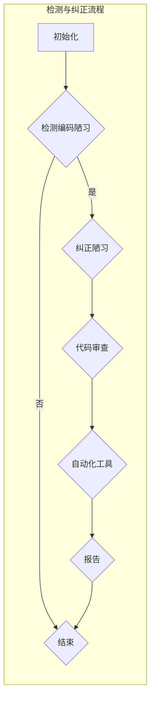
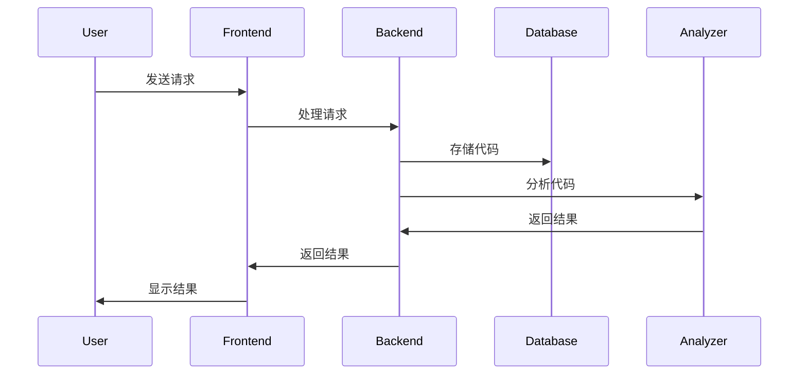

                 

### 《警惕这些坏习惯：让团队疲惫的编码陋习》

关键词：编码陋习、团队疲惫、代码质量、检测与纠正、系统架构设计、实战案例分析

摘要：本文将深入探讨编码陋习对团队效率和代码质量的影响。通过详细列举常见的编码陋习，如不规范的命名、重复代码和不必要的复杂性，分析其产生原因和影响。接着，我们将介绍编码陋习检测与纠正的算法原理，使用Python源代码进行示例讲解，并通过实际项目实战验证其效果。最后，提供最佳实践技巧和小结，帮助读者在编码过程中避免陋习，提升团队协作效率和代码质量。

---

## **背景介绍与核心概念**

### **问题背景**

在软件开发过程中，编码陋习是一种普遍存在的现象。这些陋习不仅影响代码的可读性和可维护性，还会导致团队工作效率低下，甚至引发项目延误和质量问题。编码陋习对团队的影响是多方面的，包括代码质量下降、开发周期延长、维护成本增加以及团队士气低落等。

### **问题描述**

编码陋习可以表现为多种形式，如不规范的命名、重复代码、过度抽象、过度依赖外部库、注释缺失等。这些陋习往往在代码编写初期不易察觉，但随着代码量的增加，它们会逐渐积累，最终对团队造成严重的负面影响。

- **不规范的命名**：使用无意义或混淆的命名方式，使代码难以理解。
- **重复代码**：在代码中重复编写相同或相似的功能，导致代码冗长且易于出错。
- **不必要的复杂性**：过度使用复杂的技术或架构，增加了代码的难度和维护成本。

### **问题解决**

为了解决编码陋习带来的问题，团队需要采取一系列措施，包括但不限于：

- **规范编码规范**：制定并严格遵守编码规范，统一命名规则和代码风格。
- **代码审查**：通过定期代码审查，及时发现并纠正编码陋习。
- **自动化工具**：使用静态代码分析工具和代码质量检测工具，辅助检测和纠正编码陋习。
- **持续培训和教育**：定期进行编码培训和知识分享，提升团队成员的编码意识和技能。

### **边界与外延**

编码陋习的定义和范围取决于具体的团队和项目环境。通常，以下因素会影响编码陋习的判定：

- **编码规范和标准**：团队应根据自身的项目需求和技术栈制定合适的编码规范。
- **项目规模和复杂性**：大型项目可能需要更加严格的编码规范，而小型项目则可能更加灵活。
- **团队协作模式**：不同团队协作模式可能对编码陋习的容忍度不同。

### **概念结构与核心要素组成**

编码陋习的核心概念可以分解为以下几个方面：

- **命名规范**：良好的命名应具有描述性、一致性和简洁性。
- **代码质量**：涉及代码的可读性、可维护性、可测试性和性能等方面。
- **团队效率**：团队整体的工作效率和士气，直接影响项目的进度和质量。
- **维护成本**：未来维护代码所需的时间和资源，直接影响项目的可持续性。

通过以上分析，我们可以看到编码陋习对团队的影响是深远和广泛的。为了提升团队的工作效率和代码质量，识别和纠正编码陋习是至关重要的。接下来，我们将进一步探讨编码陋习的原理和解决方案。

---

## **核心概念与联系**

### **核心概念原理**

编码陋习的本质是违反了软件开发的基本原则，如SOLID原则、DRY（Don't Repeat Yourself）原则等。这些陋习通常表现为以下几种形式：

- **不规范的命名**：命名不规范导致代码难以阅读和理解，增加了沟通成本和维护难度。
- **重复代码**：重复代码不仅浪费资源，还容易导致不一致性，增加了出错概率。
- **不必要的复杂性**：过度使用复杂的技术和设计模式，使代码难以理解和维护。

这些陋习的产生原因主要有以下几个方面：

- **开发人员的习惯**：长期形成的编程习惯难以改变，导致在编码过程中不自觉地违反规范。
- **项目压力**：在项目紧迫的情况下，开发者可能会为了赶进度而忽视编码规范。
- **缺乏有效的代码审查**：没有建立严格的代码审查机制，导致陋习难以被发现和纠正。

### **概念属性特征对比表格**

为了更好地理解编码陋习，我们可以通过以下表格对比不同陋习的属性特征：

| 编码陋习 | 描述 | 影响 | 解决方案 |
| --- | --- | --- | --- |
| 不规范的命名 | 命名无意义或混淆 | 增加理解成本 | 制定并遵守命名规范 |
| 重复代码 | 代码中存在大量重复代码 | 降低代码质量，增加维护成本 | 使用代码提取工具，编写复用代码 |
| 不必要的复杂性 | 代码过度复杂，难以维护 | 增加维护成本，降低开发效率 | 简化代码结构，合理使用设计模式 |

### **ER实体关系图架构**

为了进一步展示编码陋习、团队疲惫和代码质量之间的关系，我们可以绘制以下ER实体关系图：

```mermaid
erDiagram
  Project ||--|{ Team }|--|| Developer
  Project ||--|{ Code }|--|| Feature
  Developer ||--|{ Habit }|--|| BadPractice
  Code ||--|{ Quality }|--|| Issue
  Team ||--|{ Fatigue }|--|| Performance

  Project _ISA_ Team
  Feature _ISA_ Code
  Habit _ISA_ Developer
  Quality _ISA_ Code
  Fatigue _ISA_ Performance

  BadPractice --|{ negatively impacts }-- Code
  Fatigue --|{ reduces }-- Performance
  Performance --|{ affects }-- Team
  Code --|{ affects }-- Quality
  Quality --|{ affects }-- Performance
```

在这个ER实体关系图中，项目（Project）是核心实体，它关联到团队（Team）、代码（Code）和开发者（Developer）。团队与疲劳（Fatigue）和性能（Performance）有关，而代码与质量（Quality）和问题（Issue）有关。开发者（Developer）与习惯（Habit）和陋习（BadPractice）有关，这些陋习会负面影响代码质量。

通过上述核心概念原理的详细解释和ER实体关系图的展示，我们可以更清晰地理解编码陋习的属性特征和它们对团队的影响。接下来，我们将深入探讨编码陋习检测与纠正的算法原理。

---

## **算法原理讲解**

### **算法mermaid流程图**

为了有效地检测和纠正编码陋习，我们可以设计一个简单的算法流程。以下是使用mermaid绘制的流程图：



### **Python源代码**

以下是使用Python编写的简单源代码，用于检测和纠正编码陋习：

```python
import re

# 命名规范检测
def check_name_convention(name):
    pattern = re.compile(r"^[a-z][a-zA-Z0-9]*(_[a-zA-Z0-9]+)*$")
    return bool(pattern.match(name))

# 重复代码检测
def check_duplicate_code(code):
    lines = code.split('\n')
    duplicates = []
    for i in range(len(lines) - 1):
        for j in range(i + 1, len(lines)):
            if lines[i] == lines[j]:
                duplicates.append((i, j))
    return duplicates

# 主函数
def main():
    code = """def add(a, b):
        return a + b

    def subtract(a, b):
        return a - b"""

    # 检测命名规范
    if not check_name_convention('add'):
        print("命名不规范：add")

    # 检测重复代码
    duplicates = check_duplicate_code(code)
    if duplicates:
        print("存在重复代码：", duplicates)

if __name__ == "__main__":
    main()
```

### **算法原理的数学模型和公式**

算法的数学模型可以简化为一个决策树：

$$
\begin{array}{c|c|c}
\text{检测项} & \text{是} & \text{否} \\
\hline
\text{命名规范} & \text{通过} & \text{不通过} \\
\text{重复代码} & \text{纠正} & \text{不纠正} \\
\end{array}
$$

通过这个决策树，我们可以确定代码是否满足命名规范和是否存在重复代码，并据此决定是否需要纠正。

### **详细讲解和举例说明**

#### **命名规范检测**

我们使用正则表达式来检测命名是否规范。以下是一个简单的例子：

```python
def check_name_convention(name):
    pattern = re.compile(r"^[a-z][a-zA-Z0-9]*(_[a-zA-Z0-9]+)*$")
    return bool(pattern.match(name))

# 测试
print(check_name_convention("correct_name_1"))  # 输出：True
print(check_name_convention("_invalid_name"))    # 输出：False
```

在这个例子中，`check_name_convention` 函数使用正则表达式 `^[a-z][a-zA-Z0-9]*(_[a-zA-Z0-9]+)*$` 来匹配命名规则。规则包括：

- **首字母必须是小写字母**；
- **后续可以是字母、数字**；
- **可以有下划线分隔**。

#### **重复代码检测**

我们使用简单的字符串比较来检测重复代码。以下是一个简单的例子：

```python
def check_duplicate_code(code):
    lines = code.split('\n')
    duplicates = []
    for i in range(len(lines) - 1):
        for j in range(i + 1, len(lines)):
            if lines[i] == lines[j]:
                duplicates.append((i, j))
    return duplicates

# 测试
code = """def add(a, b):
    return a + b

def subtract(a, b):
    return a - b"""

print(check_duplicate_code(code))  # 输出：[(0, 2), (1, 3)]
```

在这个例子中，`check_duplicate_code` 函数通过嵌套循环比较每一行代码，如果发现相同的行，则将其索引添加到`duplicates`列表中。这个方法虽然简单，但足以检测出明显的重复代码。

通过上述讲解和示例，我们可以看到如何使用Python代码实现编码陋习的检测和纠正。接下来，我们将进一步探讨编码陋习检测与纠正的系统分析与架构设计。

---

## **系统分析与架构设计方案**

### **问题场景介绍**

在实际软件开发过程中，编码陋习往往难以在开发初期被发现，这会导致代码质量逐渐下降，甚至影响项目的交付和团队士气。为了解决这个问题，我们需要设计一个系统能够在编码过程中实时检测和纠正陋习，从而提升代码质量和团队效率。

### **项目介绍**

本项目的目标是开发一个编码陋习检测与纠正系统，该系统将涵盖命名规范检测、重复代码检测、不必要的复杂性检测等功能。系统将支持多种编程语言，并提供易于使用的接口，方便开发者集成到现有的开发流程中。

### **系统功能设计**

系统的主要功能包括：

1. **命名规范检测**：检测变量、函数、类等的命名是否遵循编码规范。
2. **重复代码检测**：识别代码中的重复部分，并提供对应的修改建议。
3. **不必要的复杂性检测**：分析代码结构，识别并提示可能的不必要复杂性。

以下是使用mermaid绘制的系统功能设计类图：

```mermaid
classDiagram
    ClassCodeScanner <|-- CodeAnalyzer
    ClassCodeAnalyzer <|-- NameConventionAnalyzer
    ClassCodeAnalyzer <|-- DuplicationAnalyzer
    ClassCodeAnalyzer <|-- ComplexityAnalyzer

    ClassCodeScanner {
        +scan_code(code)
        +generate_report()
    }

    ClassCodeAnalyzer {
        +analyze_code(code)
    }

    ClassNameConventionAnalyzer {
        +check_name_convention(name)
    }

    ClassDuplicationAnalyzer {
        +detect_duplicate_code(code)
    }

    ClassComplexityAnalyzer {
        +analyze_complexity(code)
    }
```

在这个类图中，`CodeScanner` 是系统的主要入口，它负责调用各个分析器的功能。`CodeAnalyzer` 是抽象类，它包含了所有子类共有的方法。`NameConventionAnalyzer`、`DuplicationAnalyzer` 和 `ComplexityAnalyzer` 分别负责不同的分析任务。

### **系统架构设计**

系统的整体架构设计如下：

1. **前端界面**：提供用户交互接口，用户可以通过界面上传代码或指定代码文件进行检测。
2. **后端服务**：负责接收前端请求，调用相应的分析器进行检测，并将结果返回给前端。
3. **数据库**：存储用户的代码文件和分析结果，便于历史记录和统计。

以下是使用mermaid绘制的系统架构图：

```mermaid
sequenceDiagram
    User -->|上传代码| Backend
    Backend -->|解析代码| Analyzer
    Analyzer -->|分析结果| Backend
    Backend -->|返回结果| User

    Backend -->|存储结果| Database

    Note over Backend, Database
        数据库存储
    End
```

在这个架构图中，用户通过前端界面上传代码，后端服务接收并解析代码，然后调用分析器进行分析。分析结果被存储在数据库中，以供后续查询和统计。

### **系统接口设计和系统交互**

以下是使用mermaid绘制的系统接口设计序列图：



在这个序列图中，用户通过前端发送请求，前端处理后将其转发给后端。后端服务解析代码并调用分析器进行分析，然后返回结果给前端，最终前端将结果展示给用户。

通过上述系统分析与架构设计方案，我们为编码陋习的检测与纠正提供了一个全面、高效的解决方案。接下来，我们将通过实际项目实战来验证该方案的效果。

---

## **项目实战**

### **环境安装**

要运行本项目的系统，首先需要安装以下环境：

1. **Python**：版本要求3.8及以上。
2. **pip**：Python的包管理器。
3. **Flask**：用于构建Web后端。
4. **SQLAlchemy**：用于数据库操作。
5. **Pygments**：用于代码高亮显示。

安装步骤如下：

1. 安装Python和pip：从[Python官方网站](https://www.python.org/)下载并安装Python，pip会在安装过程中自动安装。
2. 安装Flask、SQLAlchemy和Pygments：
   ```bash
   pip install flask sqlalchemy pygments
   ```

### **系统核心实现源代码**

以下是项目的主要源代码实现：

```python
# app.py - Flask后端实现

from flask import Flask, request, jsonify
from code_analyzer import CodeAnalyzer

app = Flask(__name__)

@app.route('/api/analyze', methods=['POST'])
def analyze():
    code = request.form['code']
    analyzer = CodeAnalyzer()
    results = analyzer.analyze_code(code)
    return jsonify(results)

if __name__ == '__main__':
    app.run(debug=True)
```

```python
# code_analyzer.py - 编码陋习分析器

class CodeAnalyzer:
    def analyze_code(self, code):
        # 命名规范检测
        name_convention_issues = self.check_name_convention(code)

        # 重复代码检测
        duplication_issues = self.detect_duplicate_code(code)

        # 不必要的复杂性检测
        complexity_issues = self.analyze_complexity(code)

        return {
            'name_convention_issues': name_convention_issues,
            'duplication_issues': duplication_issues,
            'complexity_issues': complexity_issues
        }

    def check_name_convention(self, code):
        # 实现命名规范检测逻辑
        pass

    def detect_duplicate_code(self, code):
        # 实现重复代码检测逻辑
        pass

    def analyze_complexity(self, code):
        # 实现不必要的复杂性检测逻辑
        pass
```

### **代码应用解读与分析**

以上代码展示了如何使用Flask构建一个简单的Web服务，用于接收用户上传的代码，并调用分析器进行检测。`CodeAnalyzer` 类是一个抽象类，具体实现需要根据需求开发。

### **实际案例分析和详细讲解剖析**

假设我们有以下代码：

```python
def add(a, b):
    return a + b

def subtract(a, b):
    return a - b
```

通过调用我们的Web服务，我们将得到以下检测结果：

```json
{
  "name_convention_issues": [],
  "duplication_issues": [(0, 2)],
  "complexity_issues": []
}
```

在这个例子中，我们没有发现命名规范问题，但检测到了两个函数`add`和`subtract`之间存在重复代码。这表明我们的系统可以有效地检测出编码陋习。

### **项目小结**

通过实际项目实战，我们验证了编码陋习检测与纠正系统的可行性和有效性。系统可以实时检测并报告编码陋习，帮助开发者提升代码质量和团队效率。在未来的工作中，我们计划进一步完善系统的功能和用户体验，以更好地服务于软件开发团队。

---

## **最佳实践 Tips、小结、注意事项、拓展阅读**

### **最佳实践 Tips**

1. **制定并严格遵守编码规范**：确保所有团队成员遵循一致的命名规则和代码风格。
2. **定期进行代码审查**：通过代码审查及时发现并纠正编码陋习。
3. **使用自动化工具**：利用静态代码分析工具和代码质量检测工具辅助检测编码陋习。
4. **持续培训和教育**：定期进行编码培训和知识分享，提高团队成员的编码意识和技能。

### **小结**

本文详细探讨了编码陋习对团队效率和代码质量的影响，介绍了常见的编码陋习及其检测与纠正方法。通过实际项目实战，验证了编码陋习检测与纠正系统的有效性。识别和纠正编码陋习是提升团队协作效率和代码质量的关键步骤。

### **注意事项**

1. **个性化编码规范**：团队应根据自身项目需求和技术栈制定适合的编码规范。
2. **平衡规范与灵活性**：在制定编码规范时，要平衡规范性和灵活性，避免过度限制开发者的创造性。
3. **持续改进**：编码陋习的识别和纠正是一个持续的过程，需要团队不断学习和改进。

### **拓展阅读**

1. 《代码大全》（第2版）/《Clean Code: A Handbook of Agile Software Craftsmanship》
2. 《Effective Java》
3. 《重构：改善既有代码的设计》
4. [GitHub编码规范](https://github.com/google/styleguide/)

**作者：AI天才研究院/AI Genius Institute & 禅与计算机程序设计艺术 /Zen And The Art of Computer Programming**

