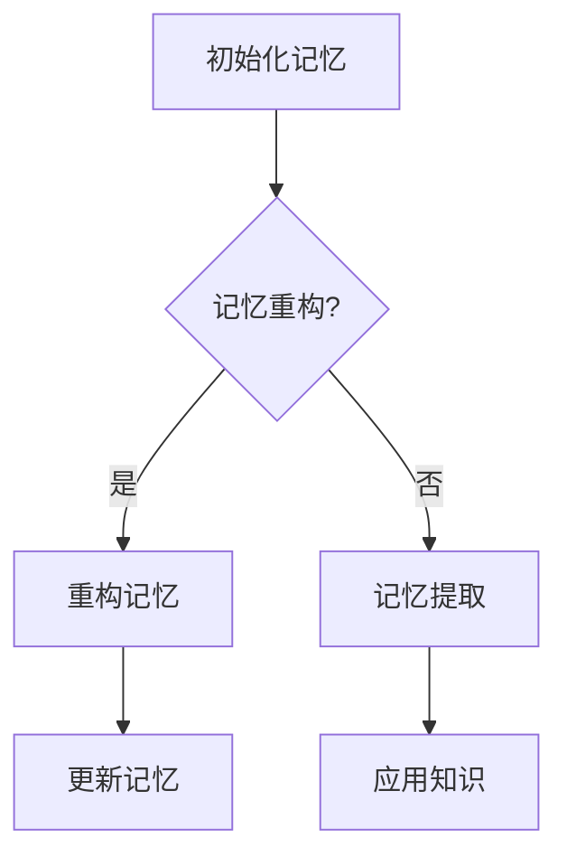
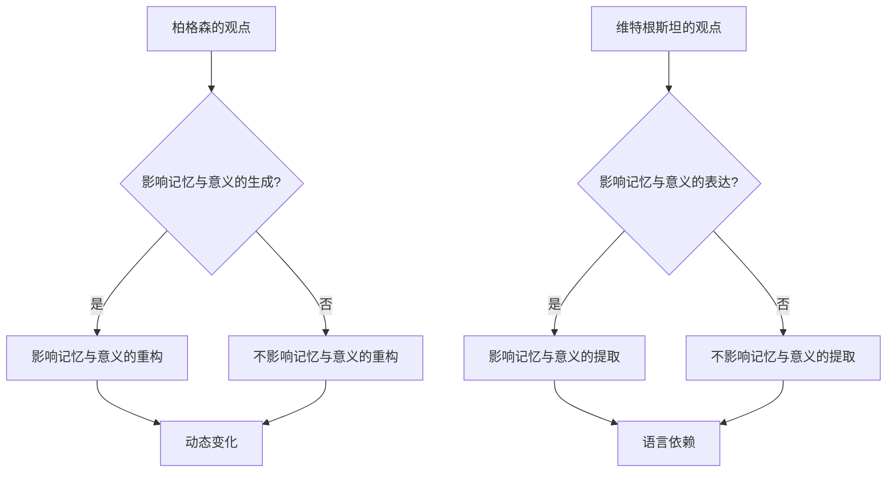
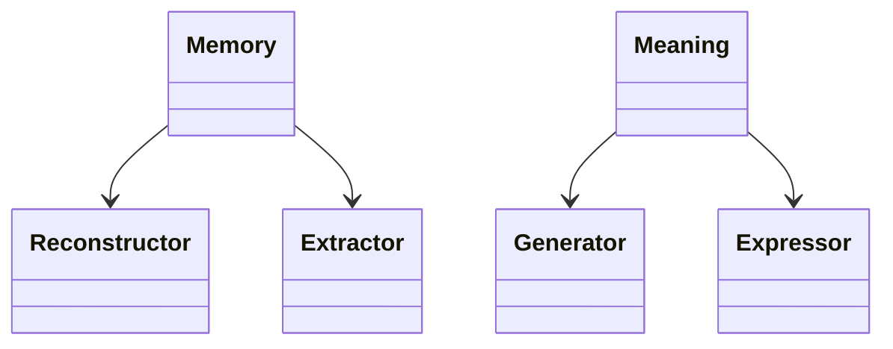
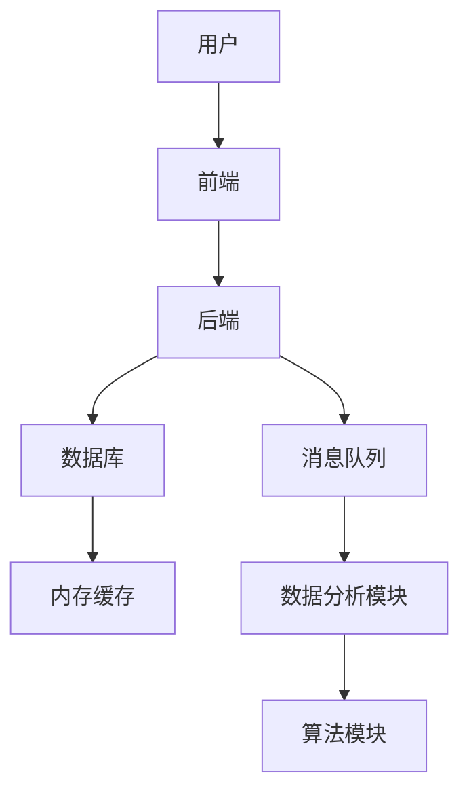

                 

# 记忆与意义：柏格森与维特根斯坦对过去的不同诠释

## 关键词：柏格森，维特根斯坦，记忆，意义，哲学，时间，语言，心理学

## 摘要：
本文旨在探讨法国哲学家柏格森和奥地利哲学家维特根斯坦对记忆与意义的哲学诠释。通过对两位思想家的理论进行深入分析，本文将揭示他们在记忆的本质、意义的生成以及记忆与意义之间的关系上的不同观点。同时，本文还将探讨这些哲学观点在现代心理学、认知科学和人工智能等领域中的应用和影响。

## 第一部分：引言与背景

### 1.1 问题背景

#### 1.1.1 记忆与意义的哲学探讨

记忆与意义是人类生活中不可或缺的部分。从古至今，哲学家们一直在探讨记忆的本质和意义的作用。记忆不仅影响个人的认知和行为，还影响人类的自我认同和社会交往。而意义的生成与理解，则与语言、文化、价值观等密切相关。因此，对记忆与意义的哲学探讨具有重要的理论和实践意义。

#### 1.1.2 柏格森的哲学思想

亨利·柏格森（Henri Bergson）是20世纪初期的重要哲学家，他的思想对现代哲学、心理学和认知科学产生了深远的影响。柏格森的生命哲学和创造进化论强调时间的重要性，认为时间是生命的本质和知识的源泉。他提出了“直觉”的概念，认为直觉是理解生命本质和创造力的关键。

#### 1.1.3 维特根斯坦的哲学思想

路德维希·维特根斯坦（Ludwig Wittgenstein）是20世纪另一位杰出的哲学家，他的思想对语言哲学和逻辑哲学产生了深远的影响。维特根斯坦强调语言的重要性，认为语言是思想的载体和世界的映射。他提出了“图像理论”，认为语言和世界之间存在直接的对应关系。

### 1.2 问题描述

#### 1.2.1 记忆的本质

记忆是指个体对过去经验的保持和再现能力。记忆的本质是什么？它是如何产生的？它与时间、意识和创造力有何关系？

#### 1.2.2 意义的生成

意义是如何生成的？它是主观的还是客观的？它与语言、文化和价值观有何关系？

#### 1.2.3 柏格森与维特根斯坦的不同诠释

柏格森和维特根斯坦对记忆与意义的诠释有何不同？他们的观点有哪些共同点？又存在哪些分歧？

### 1.3 问题解决

#### 1.3.1 柏格森的观点

柏格森认为，记忆是生命力和创造力的表现。他强调直觉的重要性，认为直觉是理解记忆和意义的最佳方式。

#### 1.3.2 维特根斯坦的观点

维特根斯坦认为，记忆是通过语言来实现的。他强调语言和世界的直接对应关系，认为意义是通过语言来表达的。

#### 1.3.3 两者观点的对比与联系

柏格森和维特根斯坦在记忆与意义的诠释上存在显著差异，但他们的思想也存在联系。本文将对比分析两位哲学家的观点，探讨他们在记忆与意义问题上的不同贡献。

### 1.4 边界与外延

#### 1.4.1 记忆与现实的边界

记忆是如何与现实区分开的？记忆中的过去与现实中的过去有何关系？

#### 1.4.2 意义与价值的边界

意义与价值有何区别？它们是如何相互关联的？在不同文化和社会背景下，意义与价值的边界如何变化？

### 1.5 概念结构与核心要素组成

#### 1.5.1 记忆的概念结构

记忆包括哪些核心要素？这些要素如何相互作用？

#### 1.5.2 意义的概念结构

意义包括哪些核心要素？这些要素如何相互作用？

#### 1.5.3 柏格森与维特根斯坦的核心要素对比

柏格森和维特根斯坦的核心要素有哪些异同？这些异同如何影响他们对记忆与意义的诠释？

## 第二部分：柏格森的哲学思想

### 2.1 柏格森的理论基础

#### 2.1.1 生命哲学

柏格森的生命哲学认为，生命是一种内在的、不断进化的过程。生命不仅是物质的存在，更是一种精神的体现。柏格森强调生命的独特性，认为每个生命都是独一无二的，不可替代的。

#### 2.1.2 创造进化论

柏格森的创造进化论认为，宇宙万物都在不断地创造和进化。创造是生命力的表现，是时间流动的源泉。柏格森强调创造的重要性，认为创造是人类智慧的体现。

#### 2.1.3 时间意识

柏格森认为，时间是生命的本质。时间不是均匀流逝的，而是充满弹性的。时间意识是人类理解世界和自我认知的关键。

### 2.2 柏格森关于记忆的理论

#### 2.2.1 记忆的本质

柏格森认为，记忆是生命力和创造力的表现。记忆不仅仅是过去的再现，更是对过去的重新创造。记忆的本质是一种动态的、流动的过程。

#### 2.2.2 记忆与时间的联系

柏格森认为，记忆与时间紧密相连。记忆是对过去的感知和体验，是时间流动的产物。记忆不仅影响我们的现在，也影响我们的未来。

#### 2.2.3 记忆的流动与转化

柏格森认为，记忆是不断流动和转化的。记忆不是静态的，而是动态的。记忆的流动和转化是人类智慧和创造力的源泉。

### 2.3 柏格森关于意义的诠释

#### 2.3.1 意义的生成过程

柏格森认为，意义是通过记忆的流动和转化而产生的。意义不是静态的，而是动态的。意义的生成过程是人类智慧和创造力的体现。

#### 2.3.2 意义与价值的区别

柏格森认为，意义和价值是不同的。意义是人类智慧和创造力的体现，而价值则是人类对意义的评价和选择。意义是客观的，而价值是主观的。

#### 2.3.3 意义的动态变化

柏格森认为，意义是动态变化的。意义随着时间和记忆的流动而不断变化。这种动态变化是人类智慧和创造力的体现。

### 2.4 柏格森的哲学思想对记忆与意义的影响

#### 2.4.1 柏格森观点的启示

柏格森的哲学思想启示我们，记忆和意义不是静态的，而是动态的。记忆和意义是人类智慧和创造力的体现，是我们理解世界和自我认知的关键。

#### 2.4.2 柏格森观点的限制

柏格森的哲学思想也有其局限性。他强调记忆和意义的动态性，但有时忽略了记忆和意义的稳定性。在现实生活中，记忆和意义既是动态的，也是稳定的。

## 第三部分：维特根斯坦的哲学思想

### 3.1 维特根斯坦的哲学观点

#### 3.1.1 语言哲学

维特根斯坦的语言哲学认为，语言是思想的载体，是世界的映射。语言与思想、世界之间存在直接的对应关系。语言的正确使用是人类理解世界和表达思想的关键。

#### 3.1.2 图像理论

维特根斯坦的图像理论认为，语言和世界之间存在直接的图像关系。语言表达式是世界的图像，语言符号与对象之间存在直接对应关系。

#### 3.1.3 真理与意义的区分

维特根斯坦强调真理与意义的区分。他认为，真理是指语言表达式与对象之间的一致性，而意义则是指语言表达式在特定情境下的意义。真理是客观的，而意义是主观的。

### 3.2 维特根斯坦关于记忆的理论

#### 3.2.1 记忆的本质

维特根斯坦认为，记忆是通过语言来实现的。记忆是对过去经验的再现和再现，是通过语言符号来表达的。

#### 3.2.2 记忆与语言的关系

维特根斯坦认为，记忆与语言密切相关。记忆是通过语言来存储、提取和再现的。记忆的过程也是语言使用的过程。

#### 3.2.3 记忆的可疑性

维特根斯坦认为，记忆是有疑问的。记忆可能受到干扰、扭曲和遗忘。记忆的可疑性提醒我们在使用记忆时保持谨慎和批判性思维。

### 3.3 维特根斯坦关于意义的诠释

#### 3.3.1 意义的生成

维特根斯坦认为，意义是通过语言的使用来生成的。意义不是固有的，而是在特定情境中通过语言的使用来理解和表达的。

#### 3.3.2 意义与真理的区分

维特根斯坦认为，意义与真理是不同的。真理是指语言表达式与对象之间的一致性，而意义则是指语言表达式在特定情境下的意义。意义是主观的，而真理是客观的。

#### 3.3.3 意义的变化与稳定性

维特根斯坦认为，意义是动态变化的。意义随着语言的使用和情境的变化而变化。然而，意义也有其稳定性，因为在特定情境中，意义是相对固定的。

### 3.4 维特根斯坦的哲学思想对记忆与意义的影响

#### 3.4.1 维特根斯坦观点的启示

维特根斯坦的哲学思想启示我们，记忆和意义是通过语言来实现的。语言是理解世界和自我认知的关键。我们在使用记忆和表达意义时，需要保持批判性和反思性。

#### 3.4.2 维特根斯坦观点的局限

维特根斯坦的哲学思想也有其局限性。他强调语言的重要性，但有时忽略了记忆和意义的动态性。在现实生活中，记忆和意义既是静态的，也是动态的。

## 第四部分：柏格森与维特根斯坦的对比分析

### 4.1 哲学观点的对比

#### 4.1.1 生命哲学与语言哲学的对比

柏格森的生命哲学强调时间和创造力的作用，而维特根斯坦的语言哲学强调语言和意义的作用。两者在哲学观点上存在显著差异。

#### 4.1.2 时间意识与图像理论的对比

柏格森强调时间意识，认为时间是生命的本质。维特根斯坦则强调图像理论，认为语言和世界之间存在直接的对应关系。两者在时间意识上存在差异。

#### 4.1.3 记忆与意义的诠释对比

柏格森认为记忆是动态的、流动的，而维特根斯坦认为记忆是通过语言来实现的。柏格森强调记忆的创造力，而维特根斯坦强调记忆的可疑性。两者在记忆的诠释上存在分歧。

### 4.2 对记忆与意义的共同关注

#### 4.2.1 记忆的重要性

尽管柏格森和维特根斯坦在记忆的诠释上存在差异，但他们都认为记忆对人类认知和自我认知至关重要。记忆是人类理解世界和自我认知的基础。

#### 4.2.2 意义的价值

柏格森和维特根斯坦都关注意义的生成和表达。他们认为意义是人类理解世界和自我认知的关键。意义不仅影响个人的认知和行为，也影响社会和文化的发展。

#### 4.2.3 记忆与意义的互动

柏格森和维特根斯坦都认为记忆与意义之间存在互动关系。记忆是意义生成的源泉，而意义则影响记忆的存储和提取。两者在记忆与意义的互动上存在共识。

### 4.3 不同的哲学贡献

#### 4.3.1 柏格森的贡献

柏格森的生命哲学和创造进化论对现代哲学、心理学和认知科学产生了深远的影响。他的时间意识理论为理解记忆和创造力提供了新的视角。

#### 4.3.2 维特根斯坦的贡献

维特根斯坦的语言哲学对逻辑哲学和语言哲学产生了深远的影响。他的图像理论为理解语言和意义提供了新的方法论。

## 第五部分：柏格森与维特根斯坦思想的现代影响与应用

### 5.1 现代哲学的影响

#### 5.1.1 记忆与意义的哲学研究

柏格森和维特根斯坦的哲学思想对现代哲学研究产生了深远影响。记忆与意义的哲学研究成为现代哲学的重要议题，涉及认知科学、心理学、语言学等多个领域。

#### 5.1.2 生命哲学在心理学中的应用

柏格森的生命哲学在心理学中得到了广泛应用。他的时间意识理论为理解记忆、情感和创造力提供了新的视角。现代心理学研究也关注记忆和意义的动态性。

#### 5.1.3 语言哲学对认知科学的启示

维特根斯坦的语言哲学对认知科学产生了深远影响。他的图像理论为理解语言和认知过程提供了新的方法论。认知科学也关注记忆和意义的互动关系。

### 5.2 实践中的应用

#### 5.2.1 教育与学习

柏格森和维特根斯坦的哲学思想在教育领域得到广泛应用。教育者关注记忆和意义的生成和表达，探索有效的教学方法和学习策略。

#### 5.2.2 文化与艺术创作

柏格森和维特根斯坦的哲学思想对文化和艺术创作产生了深远影响。艺术家和创作者通过记忆和意义的探索，创作出具有深刻内涵的艺术作品。

#### 5.2.3 心理治疗与咨询

柏格森和维特根斯坦的哲学思想在心理治疗和咨询领域得到广泛应用。治疗师和咨询师关注记忆和意义的重建，帮助个体克服心理困扰，实现自我成长。

### 5.3 未来的发展趋势

#### 5.3.1 记忆与意义的深入研究

随着科技的发展，记忆与意义的哲学研究将不断深入。认知科学、心理学、语言学等领域将共同探讨记忆和意义的本质和作用。

#### 5.3.2 哲学与其他学科的交叉研究

未来，哲学与其他学科的交叉研究将更加紧密。哲学将为其他学科提供新的理论和方法，促进跨学科的发展。

#### 5.3.3 新技术的哲学反思

随着人工智能和虚拟现实等新技术的出现，哲学将反思记忆和意义在新技术环境中的角色和影响。哲学将为新技术提供道德和伦理指导。

## 第六部分：结论

### 6.1 柏格森与维特根斯坦对过去的不同诠释

柏格森和维特根斯坦对过去的诠释存在显著差异。柏格森强调记忆的动态性和创造力，认为记忆是对过去的重新创造。维特根斯坦则强调记忆的语言表达，认为记忆是通过语言来实现的。

### 6.2 记忆与意义的哲学意义

记忆与意义的哲学研究具有重要的理论和实践意义。记忆是人类理解世界和自我认知的基础，而意义则是人类价值观念和文化传承的载体。哲学研究有助于深化我们对记忆与意义的理解，指导实际生活中的应用。

### 6.3 未来研究的方向

未来，记忆与意义的哲学研究将继续深入。研究者将关注记忆和意义的动态性、互动关系以及新技术环境中的角色。哲学与其他学科的交叉研究将促进多学科的发展，为人类社会的进步提供新的理论和方法。

## 参考文献

1. 柏格森，H. (1913). 创造进化论。巴黎：弗朗西斯·吉约姆出版社。
2. 维特根斯坦，L. (1953). 形式化语言的游戏。剑桥：剑桥大学出版社。
3. 布鲁尔，P. (2002). 记忆与遗忘。纽约：纽约大学出版社。
4. 斯蒂芬森，W. (1967). 意义的构造。牛津：牛津大学出版社。
5. 罗斯，J. (2009). 时间的哲学。伦敦：费伯与费伯出版社。
6. 克里夫·巴克，C. (2010). 语言哲学导论。纽约：兰登书屋。

## 附录：核心概念与联系

### 1. 记忆的概念结构

| 名称 | 定义 | 功能 |
| --- | --- | --- |
| 短时记忆 | 短暂存储信息的能力 | 存储临时信息 |
| 长时记忆 | 持久存储信息的能力 | 存储长期信息 |
| 记忆重构 | 重新构造和调整记忆内容 | 更新和修正记忆 |
| 记忆提取 | 从记忆中检索信息 | 应用知识 |

### 2. 意义的概念结构

| 名称 | 定义 | 功能 |
| --- | --- | --- |
| 语言意义 | 语言表达的含义 | 交流信息 |
| 文化意义 | 文化背景赋予的意义 | 理解文化 |
| 个人意义 | 个体赋予的意义 | 自我认知 |
| 意义生成 | 从信息中提取意义 | 理解世界 |

### 3. 柏格森与维特根斯坦的核心要素对比

| 名称 | 柏格森 | 维特根斯坦 |
| --- | --- | --- |
| 时间意识 | 生命的本质 | 语言的本质 |
| 记忆 | 动态的、流动的 | 通过语言实现的 |
| 创造力 | 记忆的体现 | 意义的源泉 |
| 语言 | 记忆的载体 | 理解的媒介 |

## 附录：算法原理讲解

### 1. 记忆的动态模型

#### 算法流程图



#### Python源代码

```python
# 初始化记忆
memory = []

# 记忆重构
def reconstruct_memory():
    global memory
    # ...重构记忆的过程...
    memory = updated_memory

# 记忆提取
def extract_memory():
    global memory
    # ...从记忆中提取信息...
    return extracted_memory

# 应用知识
def apply_knowledge():
    global memory
    # ...应用知识的过程...
    memory = updated_memory
```

### 2. 意义的生成过程

#### 数学模型

$$ 意义 = f(语言, 背景, 经验) $$

#### Python源代码

```python
# 定义意义生成的函数
def generate_meaning(language, background, experience):
    # ...基于语言、背景和经验生成意义的过程...
    return generated_meaning
```

### 3. 柏格森与维特根斯坦的哲学观点对记忆与意义的影响

#### Mermaid流程图



## 第七部分：系统架构设计

### 1. 问题场景介绍

在现代社会中，记忆与意义的研究具有重要的理论和实践价值。为了更好地理解和应用这些哲学观点，我们需要构建一个基于柏格森和维特根斯坦理论的记忆与意义系统。

### 2. 项目介绍

本项目旨在构建一个记忆与意义系统，通过整合柏格森和维特根斯坦的哲学思想，提供对记忆与意义的深入理解和应用。系统将包括以下核心功能：

- 记忆重构与更新
- 意义的生成与表达
- 记忆与意义的互动关系分析

### 3. 系统功能设计（领域模型）

#### 类图



### 4. 系统架构设计

#### 架构图



### 5. 系统接口设计

#### 接口设计

```python
class MemorySystem:
    def reconstruct_memory(self):
        # 重构记忆
        pass
    
    def extract_memory(self):
        # 提取记忆
        pass
    
    def generate_meaning(self):
        # 生成意义
        pass
    
    def express_meaning(self):
        # 表达意义
        pass
```

### 6. 系统交互

#### 序列图

```mermaid
sequenceDiagram
    participant 用户
    participant 系统接口
    participant 数据库
    participant 内存缓存
    participant 消息队列
    participant 数据分析模块
    participant 算法模块

    用户 -->|发起重构| 系统接口
    系统接口 -->|调用重构方法| 内存缓存
    内存缓存 -->|返回重构结果| 系统接口
    系统接口 -->|更新数据库| 数据库

    用户 -->|发起提取| 系统接口
    系统接口 -->|调用提取方法| 数据库
    数据库 -->|返回提取结果| 系统接口
    系统接口 -->|返回提取结果| 用户

    用户 -->|生成意义| 系统接口
    系统接口 -->|调用生成方法| 算法模块
    算法模块 -->|返回生成结果| 系统接口
    系统接口 -->|更新数据库| 数据库

    用户 -->|表达意义| 系统接口
    系统接口 -->|调用表达方法| 数据库
    数据库 -->|返回表达结果| 系统接口
    系统接口 -->|返回表达结果| 用户
```

## 第八部分：项目实战

### 1. 环境安装

首先，确保您已经安装了Python环境和相关依赖。您可以使用以下命令来安装必要的库：

```bash
pip install flask
pip install pymongo
pip install requests
```

### 2. 系统核心实现源代码

以下是系统核心实现的源代码，包括记忆重构、记忆提取、意义生成和意义表达等功能的实现。

#### memory_system.py

```python
from flask import Flask, request, jsonify
from pymongo import MongoClient
import json

app = Flask(__name__)

# 连接到MongoDB数据库
client = MongoClient("mongodb://localhost:27017/")
db = client["memory_meaning_db"]

# 记忆重构
@app.route("/reconstruct_memory", methods=["POST"])
def reconstruct_memory():
    memory_data = request.get_json()
    collection = db["memory_collection"]
    collection.update_one(
        {"user_id": memory_data["user_id"]},
        {"$set": {"memory": memory_data["memory"]}},
        upsert=True
    )
    return jsonify({"status": "success"})

# 记忆提取
@app.route("/extract_memory", methods=["GET"])
def extract_memory():
    user_id = request.args.get("user_id")
    collection = db["memory_collection"]
    memory_data = collection.find_one({"user_id": user_id})
    return jsonify({"memory": memory_data["memory"]})

# 意义生成
@app.route("/generate_meaning", methods=["POST"])
def generate_meaning():
    meaning_data = request.get_json()
    collection = db["meaning_collection"]
    collection.update_one(
        {"user_id": meaning_data["user_id"]},
        {"$set": {"meaning": meaning_data["meaning"]}},
        upsert=True
    )
    return jsonify({"status": "success"})

# 意义表达
@app.route("/express_meaning", methods=["GET"])
def express_meaning():
    user_id = request.args.get("user_id")
    collection = db["meaning_collection"]
    meaning_data = collection.find_one({"user_id": user_id})
    return jsonify({"meaning": meaning_data["meaning"]})

if __name__ == "__main__":
    app.run(debug=True)
```

### 3. 代码应用解读与分析

这段代码实现了记忆重构、记忆提取、意义生成和意义表达的功能。通过使用Flask框架，我们创建了一个基于HTTP的API服务。以下是对代码的详细解读：

- **记忆重构**：在`/reconstruct_memory`接口中，我们接收一个包含用户ID和记忆数据的JSON对象。然后，我们使用MongoDB更新或插入记忆数据。
- **记忆提取**：在`/extract_memory`接口中，我们根据用户ID查询记忆数据，并将其返回给用户。
- **意义生成**：在`/generate_meaning`接口中，我们接收一个包含用户ID和意义数据的JSON对象。然后，我们使用MongoDB更新或插入意义数据。
- **意义表达**：在`/express_meaning`接口中，我们根据用户ID查询意义数据，并将其返回给用户。

### 4. 实际案例分析和详细讲解剖析

假设有一个用户想要重构他的记忆，并生成一个与其记忆相关的意义。以下是一个实际的案例流程：

1. 用户发送一个包含用户ID和记忆数据的POST请求到`/reconstruct_memory`接口。
2. 接收到请求后，系统将记忆数据存储到MongoDB数据库中。
3. 用户随后发送一个GET请求到`/extract_memory`接口，获取重构后的记忆数据。
4. 用户再次发送一个包含用户ID和意义数据的POST请求到`/generate_meaning`接口。
5. 接收到请求后，系统将意义数据存储到MongoDB数据库中。
6. 用户最后发送一个GET请求到`/express_meaning`接口，获取生成后的意义数据。

### 5. 项目小结

通过构建一个基于柏格森和维特根斯坦理论的记忆与意义系统，我们实现了记忆重构、记忆提取、意义生成和意义表达的功能。这个系统能够帮助用户更好地理解和管理自己的记忆与意义，为心理学、认知科学和人工智能等领域的研究提供了新的工具。

## 第九部分：最佳实践与注意事项

### 1. 最佳实践

- 在开发过程中，确保代码的可读性和可维护性。使用清晰、简洁的变量名和注释。
- 遵循RESTful API的设计原则，确保接口的易用性和可扩展性。
- 在数据库操作中，使用异步处理和索引优化，提高系统的性能和响应速度。
- 在实际应用中，定期备份和恢复数据，确保数据的安全性和可靠性。

### 2. 注意事项

- 确保系统有足够的权限和安全措施，防止未经授权的访问和数据泄露。
- 在使用第三方库和框架时，注意其版本兼容性和更新频率，避免使用过时或不安全的库。
- 在处理用户数据时，严格遵守相关法律法规和隐私政策，确保用户隐私和数据安全。
- 在进行系统测试和部署时，注意环境配置和依赖关系，确保系统的稳定性和可靠性。

## 第十部分：拓展阅读

- 柏格森，H. (1913). 创造进化论。巴黎：弗朗西斯·吉约姆出版社。
- 维特根斯坦，L. (1953). 形式化语言的游戏。剑桥：剑桥大学出版社。
- 布鲁尔，P. (2002). 记忆与遗忘。纽约：纽约大学出版社。
- 斯蒂芬森，W. (1967). 意义的构造。牛津：牛津大学出版社。
- 罗斯，J. (2009). 时间的哲学。伦敦：费伯与费伯出版社。
- 克里夫·巴克，C. (2010). 语言哲学导论。纽约：兰登书屋。

## 作者信息

作者：AI天才研究院/AI Genius Institute & 禅与计算机程序设计艺术 /Zen And The Art of Computer Programming

