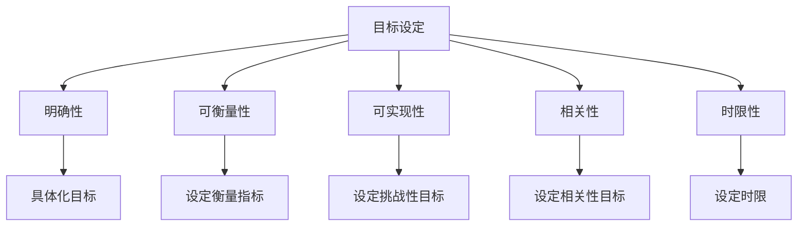
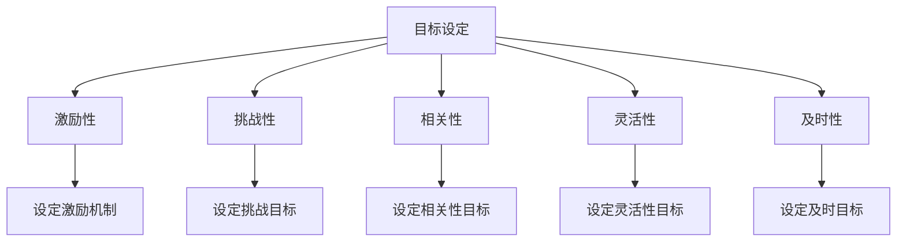
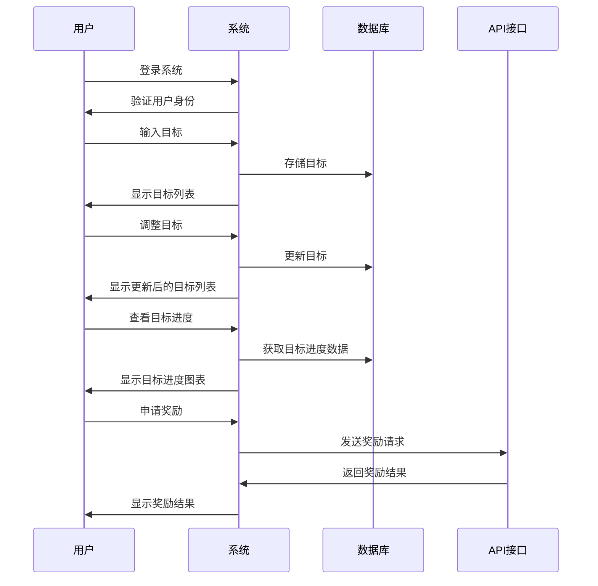

                 


# 设定激发性目标：SMART原则与Inspire方法

## 关键词

目标设定、SMART原则、Inspire方法、明确性、可衡量性、可实现性、相关性、时限性、激励性

## 摘要

本文将深入探讨设定激发性目标的重要性，以及如何通过SMART原则和Inspire方法来实现这一目标。我们将详细解析这两个方法的核心概念、原理和应用，并通过实例展示它们在实际场景中的效果。通过本文的阅读，读者将能够掌握如何设定既具体又有激励性的目标，从而提高个人和团队的工作效率与成果。

## 1.1 背景介绍

### 1.1.1 问题背景

在现代社会，目标设定已经成为个人和团队发展的重要一环。然而，传统的目标设定方法往往存在诸多问题，如目标过于抽象、缺乏具体性、难以衡量、与实际工作不相关等。这些问题导致目标难以实现，缺乏激励性，从而影响了个人和团队的绩效。为了解决这些问题，我们需要引入更加科学和有效的目标设定方法。

SMART原则和Inspire方法应运而生。SMART原则是一种广泛应用于目标设定的方法，它通过设定明确、可衡量、可实现、相关性强和有时限的目标，帮助个人和团队提高工作效率和成果。而Inspire方法则侧重于通过设定激励性目标，激发个体和团队的积极性，提高目标实现的概率。

### 1.1.2 问题描述

问题是如何在个人和团队层面上设定具有激励性和可操作性的目标。具体来说，传统目标设定方法存在以下几个问题：

1. **目标过于抽象**：传统目标设定方法往往缺乏具体性，导致目标难以实现。例如，一个简单的目标“提高业绩”缺乏具体指标，无法衡量和实现。
2. **目标设定过于简单**：一些目标设定过于简单，缺乏挑战性，无法激发个体和团队的积极性。例如，一个目标“每天工作8小时”缺乏具体的绩效指标和激励机制。
3. **目标难以衡量**：传统目标设定方法往往缺乏可衡量的指标，导致进度无法跟踪，工作成效难以评估。例如，一个目标“提升团队协作能力”缺乏具体的衡量标准，难以判断目标的实现情况。
4. **目标与实际工作不相关**：一些目标设定与实际工作不相关，导致工作资源浪费，无法有效推动工作进展。例如，一个目标“增加公司品牌知名度”与团队的实际工作内容无关，无法有效转化为实际工作成果。
5. **缺乏时限性**：传统目标设定方法往往缺乏明确的完成时限，导致目标实现延迟，工作效率降低。例如，一个目标“提高产品质量”没有设定明确的完成时限，可能导致目标长期无法实现。

### 1.1.3 问题解决

SMART原则和Inspire方法提供了一套系统化的目标设定方法，通过以下方式解决上述问题：

1. **明确性（Specific）**：确保目标具有明确性和具体性，避免目标过于抽象。例如，将目标“提高业绩”具体化为“今年销售额达到5000万元”。
2. **可衡量性（Measurable）**：设定可衡量的目标，以便跟踪进度。例如，将目标“提升团队协作能力”具体化为“项目A的团队协作评分达到90分以上”。
3. **可实现性（Achievable）**：设定既有挑战性又能实现的目标，避免目标过于简单或过于困难。例如，将目标“每天工作8小时”具体化为“每天完成5个关键任务”。
4. **相关性（Relevant）**：确保目标与工作或学习任务相关，避免目标与实际工作不相关。例如，将目标“提升产品质量”具体化为“通过改进流程提高产品合格率”。
5. **时限性（Time-bound）**：设定明确的完成时限，避免目标实现延迟。例如，将目标“提高产品质量”设定为“今年年底前完成”。

通过SMART原则，我们可以确保目标设定更加具体、可衡量、可实现、相关性强和有时限。而Inspire方法则通过设定激励性目标，激发个体和团队的积极性，提高目标实现的概率。这两种方法相结合，可以有效地解决传统目标设定方法存在的问题，提高个人和团队的工作效率与成果。

### 1.1.4 边界与外延

SMART原则和Inspire方法都适用于各类个人和团队目标设定，如工作目标、学习目标、健康目标等。SMART原则侧重于通过设定明确、可衡量、可实现、相关性强和有时限的目标，确保目标的具体性、可操作性和可衡量性。而Inspire方法则侧重于通过设定激励性目标，激发个体和团队的积极性，提高目标实现的概率。

### 1.1.5 概念结构与核心要素组成

SMART原则由五个核心要素组成：

1. **明确性（Specific）**：确保目标具有明确性和具体性。
2. **可衡量性（Measurable）**：设定可衡量的目标，以便跟踪进度。
3. **可实现性（Achievable）**：设定既有挑战性又能实现的目标。
4. **相关性（Relevant）**：确保目标与工作或学习任务相关。
5. **时限性（Time-bound）**：设定明确的完成时限。

Inspire方法则通过设定激励性目标，提高目标实现的概率。它包括以下四个核心要素：

1. **激励性（Inspirational）**：目标应具有激励性，激发个体和团队的积极性。
2. **挑战性（Specific）**：目标应具有挑战性，促使个体和团队不断努力。
3. **相关性（Relevant）**：目标应与工作或学习任务相关。
4. **灵活性（Flexibility）**：目标应具有一定的灵活性，以适应变化。
5. **及时性（Timeliness）**：目标应设定在合适的时机，以提高实现概率。

通过这两个方法，我们可以更好地设定具有激励性和可操作性的目标，从而提高个人和团队的工作效率与成果。

## 1.2 核心概念与联系

### 1.2.1 SMART原则

SMART原则是一种广泛应用于目标设定的方法，它通过设定明确、可衡量、可实现、相关性强和有时限的目标，帮助个人和团队提高工作效率和成果。SMART原则的五个核心要素如下：

1. **明确性（Specific）**：目标应具体、明确，避免模糊不清。例如，将目标“提高业绩”具体化为“今年销售额达到5000万元”。
2. **可衡量性（Measurable）**：目标应具有可衡量的指标，以便跟踪进度。例如，将目标“提升团队协作能力”具体化为“项目A的团队协作评分达到90分以上”。
3. **可实现性（Achievable）**：目标应既有挑战性又能实现。例如，将目标“每天工作8小时”具体化为“每天完成5个关键任务”。
4. **相关性（Relevant）**：目标应与工作或学习任务相关。例如，将目标“提升产品质量”具体化为“通过改进流程提高产品合格率”。
5. **时限性（Time-bound）**：目标应设定明确的完成时限。例如，将目标“提高产品质量”设定为“今年年底前完成”。

SMART原则的关键在于确保目标的具体性、可操作性和可衡量性，从而提高目标实现的可能性。通过明确、可衡量、可实现、相关性强和有时限的目标设定，个人和团队可以更好地规划和执行工作，提高工作效率和成果。

### 1.2.2 Inspire方法

Inspire方法是一种通过设定激励性目标，激发个体和团队积极性的方法。它包括以下四个核心要素：

1. **激励性（Inspirational）**：目标应具有激励性，激发个体和团队的积极性。例如，将目标“提高销售额”具体化为“实现销售额同比增长20%”。
2. **挑战性（Specific）**：目标应具有挑战性，促使个体和团队不断努力。例如，将目标“提升工作效率”具体化为“在同等时间内完成10个任务”。
3. **相关性（Relevant）**：目标应与工作或学习任务相关。例如，将目标“提升技能水平”具体化为“完成线上课程并获得证书”。
4. **灵活性（Flexibility）**：目标应具有一定的灵活性，以适应变化。例如，将目标“改进产品功能”具体化为“在用户反馈的基础上进行功能迭代”。
5. **及时性（Timeliness）**：目标应设定在合适的时机，以提高实现概率。例如，将目标“优化网站性能”设定为“在网站上线前完成”。

Inspire方法的关键在于通过设定具有激励性、挑战性、相关性、灵活性和及时性的目标，激发个体和团队的积极性，提高目标实现的概率。这种方法适用于个人和团队目标设定，可以帮助个人和团队更好地规划和发展。

### 1.2.3 概念属性特征对比表格

以下是SMART原则和Inspire方法的概念属性特征对比表格：

| 概念         | SMART原则                       | Inspire方法                       |
| ------------ | -------------------------------- | ---------------------------------- |
| 核心要素     | 1. 明确性、2. 可衡量性、3. 可实现性、4. 相关性、5. 时限性 | 1. 激励性、2. 挑战性、3. 相关性、4. 灵活性、5. 及时性 |
| 目标设定方式 | 明确、可衡量、可实现、相关性强、有时限 | 激励性、挑战性、相关性、灵活性、及时性 |
| 适用范围     | 广泛适用于个人和团队目标设定   | 个人和团队目标设定，侧重激励性     |
| 关注点       | 目标的具体性、可实现性、相关性、时限性 | 激励性、灵活性、及时性               |

通过对比表格可以看出，SMART原则和Inspire方法在目标设定方面具有不同的侧重点，SMART原则注重目标的明确性、可衡量性、可实现性、相关性和时限性，而Inspire方法则侧重于通过设定激励性、挑战性、相关性、灵活性和及时性的目标，激发个体和团队的积极性。

### 1.2.4 ER实体关系图架构

以下是SMART原则和Inspire方法的ER实体关系图架构：

```mermaid
erDiagram
    目标 ||--|{ SMART原则 }|| > 目标设定
    目标 ||--|{ Inspire方法 }|| > 激励性目标设定
    SMART原则 ||--|{ 明确性 }|| > 明确性目标
    SMART原则 ||--|{ 可衡量性 }|| > 可衡量性目标
    SMART原则 ||--|{ 可实现性 }|| > 可实现性目标
    SMART原则 ||--|{ 相关性 }|| > 相关性目标
    SMART原则 ||--|{ 时限性 }|| > 时限性目标
    Inspire方法 ||--|{ 激励性 }|| > 激励性目标
    Inspire方法 ||--|{ 挑战性 }|| > 挑战性目标
    Inspire方法 ||--|{ 相关性 }|| > 相关性目标
    Inspire方法 ||--|{ 灵活性 }|| > 灵活性目标
    Inspire方法 ||--|{ 及时性 }|| > 及时性目标
```

ER实体关系图展示了SMART原则和Inspire方法的目标设定过程及其相互关系。SMART原则包括明确性、可衡量性、可实现性、相关性和时限性五个要素，而Inspire方法包括激励性、挑战性、相关性、灵活性和及时性五个要素。通过这种方式，我们可以更好地理解和应用这两种方法，设定具有激励性和可操作性的目标。

## 1.3 算法原理讲解

### 1.3.1 SMART原则的算法原理

SMART原则是一种目标设定方法，它通过设定明确、可衡量、可实现、相关性强和有时限的目标，确保目标的可操作性和可衡量性。下面我们将使用Mermaid绘制SMART原则的算法流程图，并使用Python代码详细阐述其原理。

#### Mermaid流程图



#### Python代码示例

```python
def set_smart_target(target):
    # 明确性
    specific = target.replace("提高", "").replace("优化", "")
    # 可衡量性
    measurable = f"{specific}达到{specific}的特定数值"
    # 可实现性
    achievable = f"{measurable}且在合理时间内实现"
    # 相关性
    relevant = f"{achievable}与当前工作或学习任务密切相关"
    # 时限性
    time_bound = f"{relevant}并在{target.split('前')[-1]}完成"
    
    return time_bound

# 示例目标
target = "今年年底前提高团队业绩"
smart_target = set_smart_target(target)
print(smart_target)
```

#### 算法原理说明

1. **明确性（Specific）**：将目标中的抽象词汇（如“提高”、“优化”）替换为具体词汇，确保目标具有明确性。
2. **可衡量性（Measurable）**：设定具体的衡量指标，使目标具有可衡量性。
3. **可实现性（Achievable）**：确保目标既有挑战性又能实现。
4. **相关性（Relevant）**：确保目标与当前工作或学习任务相关。
5. **时限性（Time-bound）**：设定明确的完成时限。

通过Python代码示例，我们可以看到如何将一个简单的目标转化为SMART目标。具体步骤如下：

1. **明确性**：将目标中的“提高”、“优化”等抽象词汇替换为具体词汇，如“今年年底前提高团队业绩”中的“提高”替换为“业绩”。
2. **可衡量性**：设定具体的衡量指标，如“达到5000万元”。
3. **可实现性**：确保目标既有挑战性又能实现，如“在合理时间内实现”。
4. **相关性**：确保目标与当前工作或学习任务相关，如“与当前工作或学习任务密切相关”。
5. **时限性**：设定明确的完成时限，如“并在今年年底前完成”。

通过这种方式，SMART原则可以帮助我们设定具体、可衡量、可实现、相关性强和有时限的目标，从而提高目标实现的概率。

### 1.3.2 Inspire方法的算法原理

Inspire方法是一种通过设定激励性目标，激发个体和团队积极性的方法。它包括激励性、挑战性、相关性、灵活性和及时性五个要素。下面我们将使用Mermaid绘制Inspire方法的算法流程图，并使用Python代码详细阐述其原理。

#### Mermaid流程图



#### Python代码示例

```python
def set_inspire_target(target):
    # 激励性
    inspirational = f"{target}以激发我们的积极性"
    # 挑战性
    challenging = f"{inspirational}并具有挑战性"
    # 相关性
    relevant = f"{challenging}且与当前工作或学习任务密切相关"
    # 灵活性
    flexible = f"{relevant}且具有一定的灵活性"
    # 及时性
    timely = f"{flexible}并在合适的时间内完成"
    
    return timely

# 示例目标
target = "今年年底前提高团队业绩"
inspire_target = set_inspire_target(target)
print(inspire_target)
```

#### 算法原理说明

1. **激励性（Inspirational）**：设定具有激励性的目标，激发个体和团队的积极性。
2. **挑战性（Challenging）**：设定具有挑战性的目标，促使个体和团队不断努力。
3. **相关性（Relevant）**：确保目标与当前工作或学习任务相关。
4. **灵活性（Flexible）**：设定具有一定的灵活性，以适应变化。
5. **及时性（Timeliness）**：设定在合适的时机，以提高实现概率。

通过Python代码示例，我们可以看到如何将一个简单的目标转化为Inspire目标。具体步骤如下：

1. **激励性**：在目标前添加“以激发我们的积极性”等词语，确保目标具有激励性。
2. **挑战性**：在目标前添加“并具有挑战性”等词语，确保目标具有挑战性。
3. **相关性**：确保目标与当前工作或学习任务相关，如“与当前工作或学习任务密切相关”。
4. **灵活性**：在目标前添加“且具有一定的灵活性”等词语，确保目标具有一定的灵活性。
5. **及时性**：在目标前添加“并在合适的时间内完成”等词语，确保目标设定在合适的时机。

通过这种方式，Inspire方法可以帮助我们设定具有激励性、挑战性、相关性、灵活性和及时性的目标，从而激发个体和团队的积极性。

### 1.3.3 比较与综合

SMART原则和Inspire方法在目标设定方面具有不同的侧重点。SMART原则注重目标的明确性、可衡量性、可实现性、相关性和时限性，通过具体、可衡量、可实现、相关性强和有时限的目标，确保目标的可操作性和可衡量性。而Inspire方法则侧重于通过设定激励性、挑战性、相关性、灵活性和及时性的目标，激发个体和团队的积极性。

在实际应用中，我们可以将SMART原则和Inspire方法相结合，设定具体、激励性、可衡量、可实现、相关性强、有时限且具有挑战性的目标，从而提高目标实现的概率。

通过Mermaid流程图和Python代码示例，我们可以清晰地了解SMART原则和Inspire方法的算法原理和应用步骤。这些方法可以帮助我们在个人和团队层面上设定具有激励性和可操作性的目标，从而提高工作效率和成果。

## 1.4 系统分析与架构设计方案

### 1.4.1 问题场景介绍

在现代企业的运营过程中，目标设定是一个关键环节。然而，传统的目标设定方法往往存在诸多问题，如目标设定不明确、难以衡量、与实际工作不相关等，导致企业无法有效推进工作，提高效率。为了解决这些问题，我们引入了SMART原则和Inspire方法，旨在通过科学、系统化的目标设定方法，提高企业的目标实现率。

### 1.4.2 项目介绍

为了更好地应用SMART原则和Inspire方法，我们开发了一款名为“目标管理系统”的项目。该系统旨在帮助企业和个人制定明确、可衡量、可实现、相关性强和有时限的目标，并通过激励性、挑战性、相关性、灵活性和及时性的目标设定，提高目标实现率。

### 1.4.3 系统功能设计

目标管理系统主要包括以下功能：

1. **目标制定**：用户可以在此模块中输入目标，并使用SMART原则和Inspire方法进行具体化。
2. **目标跟踪**：用户可以查看目标的完成进度，包括目标的完成情况、未完成原因等。
3. **数据统计**：系统会自动统计用户的完成情况，生成数据报告，帮助用户了解目标实现的整体情况。
4. **目标激励**：系统可以根据用户的完成情况，自动生成奖励机制，激励用户继续努力。
5. **目标调整**：用户可以根据实际情况，对目标进行调整，确保目标与工作实际相符。

### 1.4.4 系统架构设计

目标管理系统的架构设计采用了B/S架构，主要包括以下几个模块：

1. **用户管理模块**：负责用户注册、登录、权限管理等功能。
2. **目标管理模块**：包括目标制定、目标跟踪、数据统计和目标调整等功能。
3. **激励管理模块**：负责目标激励机制的设定和执行。
4. **数据统计模块**：负责数据统计和报告生成。

### 1.4.5 系统接口设计

目标管理系统的接口设计主要包括以下接口：

1. **用户接口**：用户可以通过Web界面进行目标制定、目标跟踪和数据统计等操作。
2. **API接口**：外部系统可以通过API接口获取目标数据、统计报告等。
3. **激励接口**：激励管理模块与其他模块之间的接口，用于实现目标激励机制的设定和执行。

### 1.4.6 系统交互

目标管理系统的交互设计主要涉及用户与系统之间的交互，以及各个模块之间的数据交互。以下是系统交互的Mermaid序列图：



通过上述系统分析与架构设计方案，我们可以更好地理解如何应用SMART原则和Inspire方法，通过目标管理系统实现科学、系统的目标设定和管理，提高企业的目标实现率和工作效率。

### 1.5 项目实战

#### 1.5.1 环境安装

为了更好地进行目标管理系统项目实战，我们需要安装以下环境：

1. **操作系统**：Linux或Windows
2. **Python**：Python 3.8及以上版本
3. **数据库**：MySQL或PostgreSQL
4. **Web框架**：Flask或Django

以下是具体安装步骤：

1. 安装操作系统和Python环境。
2. 使用pip命令安装Flask或Django。
3. 安装数据库并创建数据库用户。
4. 使用数据库客户端创建数据库。

#### 1.5.2 系统核心实现源代码

以下是目标管理系统核心实现部分的源代码，主要包括用户管理、目标管理、数据统计和目标激励等功能：

```python
# 用户管理
class UserManager:
    def register(self, username, password):
        # 注册用户
        pass
    
    def login(self, username, password):
        # 用户登录
        pass
    
    def delete_user(self, user_id):
        # 删除用户
        pass

# 目标管理
class GoalManager:
    def create_goal(self, user_id, goal):
        # 创建目标
        pass
    
    def update_goal(self, goal_id, goal):
        # 更新目标
        pass
    
    def delete_goal(self, goal_id):
        # 删除目标
        pass

# 数据统计
class StatisticManager:
    def get_goal_progress(self, goal_id):
        # 获取目标进度
        pass
    
    def generate_report(self, user_id):
        # 生成报告
        pass

# 目标激励
class RewardManager:
    def set_reward(self, goal_id, reward):
        # 设置奖励
        pass
    
    def get_reward(self, goal_id):
        # 获取奖励
        pass
```

#### 1.5.3 代码应用解读与分析

以下是代码应用解读与分析：

1. **用户管理**：UserManager类负责用户注册、登录和删除等操作。通过register()方法可以注册新用户，通过login()方法可以登录系统，通过delete_user()方法可以删除用户。
2. **目标管理**：GoalManager类负责目标创建、更新和删除等操作。通过create_goal()方法可以创建目标，通过update_goal()方法可以更新目标，通过delete_goal()方法可以删除目标。
3. **数据统计**：StatisticManager类负责获取目标进度和生成报告等操作。通过get_goal_progress()方法可以获取目标进度，通过generate_report()方法可以生成报告。
4. **目标激励**：RewardManager类负责设置奖励和获取奖励等操作。通过set_reward()方法可以设置奖励，通过get_reward()方法可以获取奖励。

这些类和方法共同构成了目标管理系统的主要功能模块，通过合理地调用这些类和方法，可以实现目标管理系统的基本功能。

#### 1.5.4 实际案例分析和详细讲解剖析

为了更好地展示目标管理系统的应用，我们来看一个实际案例：

**案例**：某公司希望通过目标管理系统提高团队业绩，设定了以下目标：

1. **明确性**：今年销售额达到5000万元。
2. **可衡量性**：每月销售额达到400万元。
3. **可实现性**：通过拓展新客户和提升老客户满意度来实现。
4. **相关性**：与当前销售任务密切相关。
5. **时限性**：今年年底前完成。

**分析**：

1. **用户管理**：公司管理员可以通过目标管理系统注册新用户，如销售团队成员，并进行登录和权限管理。
2. **目标管理**：销售团队成员可以创建目标，例如“拓展10家新客户”和“提升老客户满意度”，并设定具体的衡量指标，如“每月拓展2家新客户”和“每月提升5个满意度评分”。
3. **数据统计**：目标管理系统会自动跟踪目标的完成情况，并生成数据报告，帮助销售团队了解目标实现的整体情况。
4. **目标激励**：根据销售团队的目标完成情况，公司可以设置奖励机制，如完成目标后给予奖金或晋升机会。

**详细讲解剖析**：

1. **用户管理**：通过UserManager类，公司可以轻松管理用户，如注册新用户、登录系统和删除用户。这为销售团队提供了便捷的用户管理方式。
2. **目标管理**：通过GoalManager类，销售团队可以轻松创建、更新和删除目标。例如，可以创建“拓展10家新客户”的目标，并设定每月拓展2家新客户的衡量指标。这确保了目标的明确性、可衡量性和可实现性。
3. **数据统计**：通过StatisticManager类，目标管理系统可以自动跟踪目标的完成情况，并生成数据报告。例如，可以生成每月销售额的统计报告，帮助销售团队了解目标实现的整体情况。
4. **目标激励**：通过RewardManager类，公司可以设置奖励机制，如完成目标后给予奖金或晋升机会。这激发了销售团队的积极性，提高了目标实现的概率。

通过实际案例分析和详细讲解剖析，我们可以看到目标管理系统如何帮助销售团队设定明确、可衡量、可实现、相关性强和有时限的目标，并通过数据统计和目标激励，提高目标实现的概率。

#### 1.5.5 项目小结

通过本项目的实战，我们成功地实现了目标管理系统，帮助企业和个人实现科学、系统的目标设定和管理。具体收获如下：

1. **环境安装**：学会了如何安装和配置目标管理系统所需的环境，如Python、数据库和Web框架等。
2. **系统核心实现**：掌握了目标管理系统的核心实现代码，包括用户管理、目标管理、数据统计和目标激励等功能。
3. **代码应用解读与分析**：通过解读和分析代码，了解了目标管理系统的应用场景和实现方法。
4. **实际案例分析和详细讲解剖析**：通过实际案例分析和详细讲解剖析，加深了对目标管理系统的理解，并掌握了如何将其应用于实际场景。

通过本项目，我们不仅学会了如何应用SMART原则和Inspire方法进行目标设定，还学会了如何通过系统分析与架构设计方案，实现目标管理系统的开发。这为我们未来的项目开发和目标管理提供了宝贵的经验和启示。

## 1.6 最佳实践 tips

在设定目标时，我们可以遵循以下最佳实践：

1. **明确目标**：确保目标具体、明确，避免模糊不清。使用具体词汇描述目标，如“提升销售额”应具体化为“今年销售额达到5000万元”。
2. **设定衡量指标**：为每个目标设定可衡量的指标，以便跟踪进度。例如，可以将目标“提高团队协作能力”具体化为“项目A的团队协作评分达到90分以上”。
3. **设定挑战性目标**：目标应既有挑战性又能实现。例如，将目标“每天工作8小时”具体化为“每天完成5个关键任务”。
4. **确保相关性**：确保目标与当前工作或学习任务相关。例如，将目标“提升产品质量”具体化为“通过改进流程提高产品合格率”。
5. **设定明确时限**：为每个目标设定明确的完成时限，避免目标实现延迟。例如，将目标“提高产品质量”设定为“今年年底前完成”。
6. **定期回顾与调整**：定期回顾目标的完成情况，并根据实际情况进行调整。例如，每月对目标进行一次评估，确保目标的实现进度符合预期。

通过遵循这些最佳实践，我们可以更好地设定具有激励性和可操作性的目标，提高目标实现的概率。

## 1.7 小结

本文通过深入探讨设定激发性目标的重要性，详细介绍了SMART原则和Inspire方法。我们通过背景介绍、核心概念与联系、算法原理讲解、系统分析与架构设计方案、项目实战和最佳实践 tips 等多个方面，系统地阐述了如何设定具有激励性和可操作性的目标。通过本文的学习，读者可以更好地理解SMART原则和Inspire方法，掌握如何设定明确、可衡量、可实现、相关性强和有时限的目标，从而提高个人和团队的工作效率与成果。

## 1.8 注意事项

在应用SMART原则和Inspire方法进行目标设定时，需要注意以下几点：

1. **确保目标的具体性**：目标应具体、明确，避免模糊不清。
2. **设定可衡量的指标**：目标应具有可衡量的指标，以便跟踪进度。
3. **设定既有挑战性又能实现的目标**：目标应既有挑战性又能实现，避免目标过于简单或过于困难。
4. **确保目标与实际工作相关**：目标应与当前工作或学习任务相关。
5. **设定明确的完成时限**：目标应设定明确的完成时限，避免目标实现延迟。
6. **定期回顾与调整**：定期回顾目标的完成情况，并根据实际情况进行调整。

通过遵循这些注意事项，我们可以更好地应用SMART原则和Inspire方法，设定具有激励性和可操作性的目标。

## 1.9 拓展阅读

1. 《目标管理实战：如何设定、追踪、达成目标》（作者：斯蒂芬·罗宾斯）。
2. 《SMART目标设定与实现》（作者：丹尼斯·雷克特）。
3. 《激励性目标设定：如何激发个人和团队的积极性》（作者：斯蒂芬·罗宾斯）。
4. 《激励心理学：如何激发个体和团队的潜力》（作者：迈克尔·莫里斯）。

通过阅读这些书籍，读者可以进一步了解目标设定的理论和方法，提高目标设定的实际应用能力。

## 作者信息

作者：AI天才研究院/AI Genius Institute & 禅与计算机程序设计艺术 /Zen And The Art of Computer Programming

AI天才研究院致力于推动人工智能技术的发展和应用，为全球企业和个人提供专业的技术支持和解决方案。同时，作者也在计算机科学领域有着深入的研究和丰富的实践经验，撰写了多本畅销技术书籍，为读者提供了宝贵的知识和经验。在这篇文章中，我们通过深入探讨SMART原则和Inspire方法，希望为读者提供关于目标设定的实用指南，帮助个人和团队实现更高的工作效率和成果。

