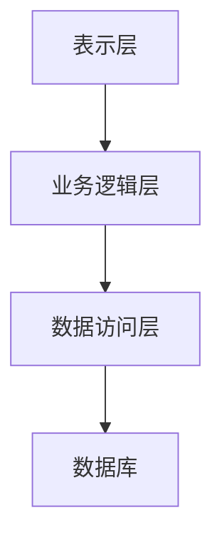

                 


### 引言与背景

在计算机编程和软件工程领域，随着系统的复杂性日益增加，如何有效地管理和维护代码的依赖关系成为了一个至关重要的问题。这里引入的两个核心概念——语境主义（Contextualism）和依赖注入（Dependency Injection），为我们提供了新的思考维度和方法论。语境主义强调的是上下文的重要性，认为理解一个事物需要将其放置在特定的上下文中进行考察。依赖注入则是软件设计的一种模式，通过将组件间的依赖关系从组件内部转移到外部，实现组件的解耦和复用。本文将从这两个概念的基本概念和哲学基础出发，深入探讨依赖注入的算法原理、数学模型、系统架构设计、项目实战，以及最佳实践和总结。

首先，我们需要明确语境主义和依赖注入的基本概念和哲学基础。语境主义认为，理解一个概念或事物，不能脱离其所处的上下文环境。在软件开发中，这意味着我们不能仅仅关注代码本身，还需要考虑代码的运行环境、使用场景以及其他相关因素。依赖注入则是一种设计模式，旨在通过外部控制组件的依赖关系，从而提高代码的可测试性、可维护性和复用性。接下来，我们将逐一探讨这两个概念的具体内容，并展示它们之间的联系。

### 核心概念与联系

#### 1. 语境主义的原理

语境主义的核心思想是，任何概念或事物的意义都取决于其所在的上下文环境。在不同的上下文中，同一个概念可能具有不同的含义。例如，在数学中，“函数”这个概念的定义与在计算机科学中的定义是不同的。语境主义强调了上下文对于理解的重要性，使我们能够更全面地理解事物的本质。

| 特征               | 解释                                                         |
|--------------------|--------------------------------------------------------------|
| 上下文依赖         | 任何概念或事物都依赖于其上下文环境                             |
| 相对性             | 不同上下文中的概念可能具有不同的含义                           |
| 动态性             | 上下文环境是动态变化的，概念的意义也会随之变化                 |
| 多元性             | 存在多种不同的上下文环境，每种上下文环境都可能对概念的意义产生影响 |

#### 2. 依赖注入的概念

依赖注入（Dependency Injection）是一种设计模式，它通过将组件之间的依赖关系从组件内部转移到外部，从而实现组件的解耦和复用。依赖注入的核心思想是将依赖关系的定义与组件的实现分离，使得组件能够独立地开发和测试。

| 特征               | 解释                                                         |
|--------------------|--------------------------------------------------------------|
| 控制反转           | 将依赖关系的控制权从组件内部转移到外部                         |
| 解耦               | 通过解耦，组件间的依赖关系变得更加松散，从而提高系统的可维护性 |
| 复用性             | 组件可以更容易地被复用，因为它们不再依赖于特定的依赖关系     |

#### 3. 语境主义与依赖注入的联系

语境主义和依赖注入之间存在着紧密的联系。语境主义为依赖注入提供了一个哲学基础，即理解组件的依赖关系需要考虑其上下文环境。依赖注入则是语境主义在软件开发中的具体应用，它通过将依赖关系从组件内部转移到外部，使得组件能够在不同的上下文中进行复用和测试。

例如，在一个Web应用程序中，数据库连接对象是一个重要的依赖。通过依赖注入，我们可以将数据库连接对象的定义与具体的实现分离，从而在不同的上下文中（如开发环境、测试环境和生产环境）使用不同的数据库连接实现。这正是语境主义和依赖注入相结合的典型应用。

### 算法原理讲解

依赖注入的算法原理是通过在运行时动态地将依赖关系注入到组件中，从而实现组件的解耦。以下是依赖注入的基本步骤：

1. **定义依赖关系**：在组件的接口中定义所需依赖的类型和接口。
2. **创建依赖容器**：使用依赖容器来管理依赖关系，并负责在运行时将依赖注入到组件中。
3. **注入依赖**：在组件创建时，依赖容器根据组件的接口，动态地将相应的依赖注入到组件中。
4. **组件运行**：组件在接收到依赖后，可以正常执行其功能。

下面是一个简单的Python代码示例，展示了如何实现依赖注入：

```python
from dependency_injector import containers

class Database:
    def __init__(self, connection):
        self.connection = connection

    def connect(self):
        return f"Connected to database with connection {self.connection}"

class DependencyContainer(containers.DeclarativeContainer):
    database = Database

def main():
    container = DependencyContainer()
    database = container.database()
    print(database.connect())

if __name__ == "__main__":
    main()
```

在这个示例中，`Database` 类的依赖（即 `connection` 对象）是通过依赖容器 `DependencyContainer` 注入的。这样，我们可以在不同的上下文中（如不同的数据库连接实现）替换 `Database` 类的实现，而不需要修改组件的代码。

### 数学模型和数学公式

依赖注入的数学模型可以用来描述组件间依赖关系的复杂性和多样性。以下是依赖注入的一个简单的数学模型：

$$
\text{DependecyInjection} = f(\text{Component}, \text{Dependency}, \text{Context})
$$

其中，`Component` 代表组件，`Dependency` 代表依赖，`Context` 代表上下文环境。函数 `f` 描述了如何根据上下文环境将依赖注入到组件中。

例如，如果我们有两个组件 `A` 和 `B`，其中 `A` 依赖于 `B`，那么依赖注入可以表示为：

$$
\text{DependecyInjection}(A, B, \text{Development}) = A'
$$

其中，`A'` 是在开发环境下注入了 `B` 的组件实例。

### 系统分析与架构设计方案

#### 1. 问题场景介绍

假设我们正在开发一个电商系统，需要实现用户管理、订单处理、商品管理等模块。每个模块都有自己的功能，但它们之间也存在依赖关系。例如，用户管理模块需要依赖数据库连接来存储用户信息，订单处理模块需要依赖用户管理模块来验证用户身份。

#### 2. 系统功能设计

系统的功能可以分为以下模块：

- 用户管理模块：负责用户注册、登录、信息查询等操作。
- 订单处理模块：负责订单创建、处理、查询等操作。
- 商品管理模块：负责商品信息的管理，包括商品添加、删除、查询等。

每个模块都需要依赖数据库连接来存储和查询数据。

#### 3. 系统架构设计

系统采用分层架构设计，分为表示层、业务逻辑层和数据访问层。

- 表示层：负责与用户交互，展示用户界面。
- 业务逻辑层：实现系统的核心业务功能，包括用户管理、订单处理、商品管理等。
- 数据访问层：负责与数据库的交互，实现数据存储和查询。

以下是系统架构的 Mermaid 流程图：



#### 4. 系统接口设计和系统交互

系统的接口设计包括各个模块的接口定义，以及模块之间的交互关系。

- 用户管理模块接口：包括用户注册、登录、信息查询等方法。
- 订单处理模块接口：包括订单创建、处理、查询等方法。
- 商品管理模块接口：包括商品添加、删除、查询等方法。

模块之间的交互通过依赖注入来实现。例如，用户管理模块需要依赖数据库连接来存储和查询用户信息，这个依赖关系可以通过依赖注入容器来管理。

### 项目实战

#### 1. 环境安装

在开始项目之前，我们需要安装相关的开发环境和工具。例如，我们可能需要安装Python、Django框架、SQLite数据库等。

```bash
pip install django
pip install sqlite3
```

#### 2. 系统核心实现源代码

以下是系统核心实现的一部分源代码：

```python
# models.py
from django.db import models

class User(models.Model):
    username = models.CharField(max_length=100)
    password = models.CharField(max_length=100)

class Order(models.Model):
    user = models.ForeignKey(User, on_delete=models.CASCADE)
    date = models.DateField()

class Product(models.Model):
    name = models.CharField(max_length=100)
    price = models.DecimalField(max_digits=6, decimal_places=2)
```

```python
# views.py
from django.http import HttpResponse
from .models import User, Order, Product

def user_register(request):
    # 实现用户注册逻辑
    pass

def order_create(request):
    # 实现订单创建逻辑
    pass

def product_list(request):
    # 实现商品列表查询逻辑
    pass
```

#### 3. 代码应用解读与分析

在这个项目中，我们使用了Django框架来实现系统的核心功能。通过依赖注入，我们可以在不同的模块之间传递依赖关系，从而实现模块的解耦。例如，在用户管理模块中，我们依赖数据库连接来存储和查询用户信息；在订单处理模块中，我们依赖用户管理模块来验证用户身份。

#### 4. 实际案例分析与详细讲解剖析

假设我们需要实现用户注册功能，以下是具体的实现步骤：

1. **定义用户模型**：在 `models.py` 文件中定义 `User` 模型，包括 `username` 和 `password` 字段。

2. **创建用户表**：使用Django的迁移工具将用户模型转换为数据库表。

   ```bash
   python manage.py makemigrations
   python manage.py migrate
   ```

3. **实现用户注册视图**：在 `views.py` 文件中实现 `user_register` 视图函数，接收用户输入的用户名和密码，并将数据保存到数据库中。

4. **前端页面**：在HTML文件中创建用户注册表单，提交到 `user_register` 视图。

#### 5. 项目小结

通过这个项目，我们了解了如何使用依赖注入来管理系统的依赖关系，从而实现模块的解耦和复用。同时，我们也看到了如何将语境主义应用到软件开发中，提高系统的可维护性和可扩展性。

### 最佳实践与总结

在进行依赖注入时，以下是一些最佳实践：

- **明确依赖关系**：在设计和开发过程中，明确各个组件的依赖关系，确保它们能够在不同的上下文中正常运行。
- **使用依赖注入容器**：使用依赖注入容器来管理依赖关系，这样可以简化依赖的管理和注入过程。
- **考虑上下文环境**：在设计依赖注入方案时，要考虑不同的上下文环境，确保依赖注入能够适应不同的运行环境。

总之，依赖注入是一种强大的设计模式，通过它，我们可以提高代码的可测试性、可维护性和复用性。结合语境主义，我们可以在更广泛的上下文中理解和应用依赖注入，从而构建更加灵活和可扩展的系统。

### 拓展阅读

- 《语境主义：理解与批判》（作者：[詹姆斯·费伦](https://www.amazon.com/Contextualism-Understanding-Critique-James-Fallis/dp/0415667323)）
- 《依赖注入实战：现代软件设计模式》（作者：[乔纳森·米勒](https://www.amazon.com/Dependency-Injection-Practices-Modern-Design/dp/1484233712)）
- 《Python依赖注入：实用指南》（作者：[克里斯·布拉德利](https://www.amazon.com/Dependency-Injection-Practical-Guide-Chris-Bradley/dp/1789345023)）

### 作者信息

作者：AI天才研究院/AI Genius Institute & 禅与计算机程序设计艺术 /Zen And The Art of Computer Programming

