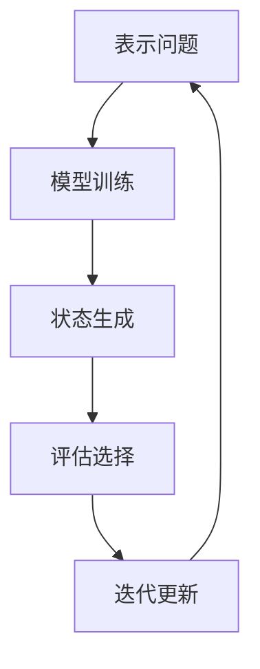
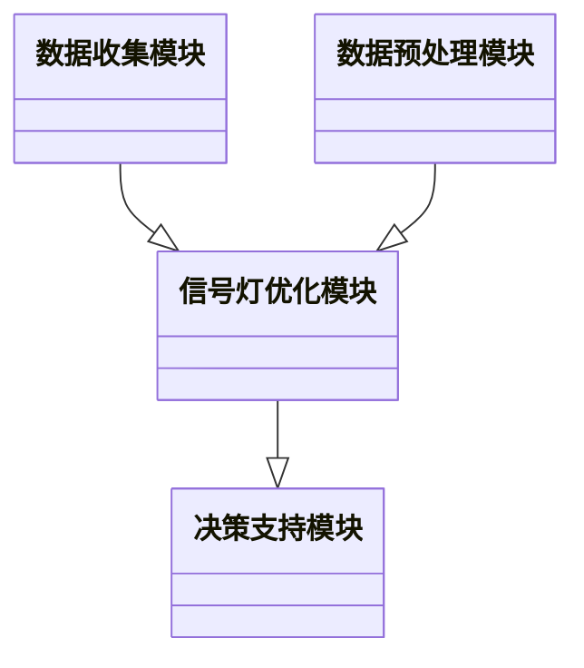
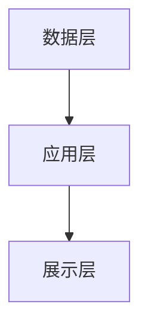
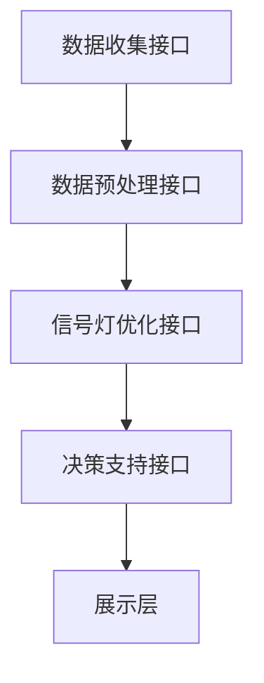

                 

### 《语言模型在复杂系统优化问题求解中的应用》

#### 关键词：
- 语言模型
- 复杂系统
- 优化问题
- 求解算法
- 应用实践

#### 摘要：
本文旨在探讨语言模型在复杂系统优化问题求解中的应用。我们将从背景介绍、核心概念与联系、算法原理讲解、系统分析与架构设计、项目实战、最佳实践等方面，详细阐述语言模型如何提升复杂系统优化问题的求解效率与准确性。通过实际案例的分析，我们希望展示语言模型在复杂系统优化中的潜力和未来发展趋势。

### 目录大纲

1. **背景介绍**
    - 1.1 语言模型的概念与作用
    - 1.2 复杂系统的定义与特点
    - 1.3 优化问题的基本概念与挑战

2. **核心概念与联系**
    - 2.1 语言模型与优化算法的融合
    - 2.2 语言模型的属性特征对比
    - 2.3 复杂系统优化问题的ER图架构

3. **算法原理讲解**
    - 3.1 语言模型在优化问题求解中的应用原理
    - 3.2 算法mermaid流程图与Python源代码讲解
    - 3.3 数学模型与公式详解

4. **系统分析与架构设计**
    - 4.1 问题场景与项目介绍
    - 4.2 系统功能设计与领域模型类图
    - 4.3 系统架构设计与交互mermaid序列图

5. **项目实战**
    - 5.1 环境安装与核心实现
    - 5.2 代码应用解读与分析
    - 5.3 实际案例分析
    - 5.4 项目小结

6. **最佳实践与注意事项**
    - 6.1 最佳实践技巧
    - 6.2 注意事项
    - 6.3 拓展阅读

7. **结论与展望**
    - 7.1 总结与展望
    - 7.2 未来研究方向
    - 7.3 对读者的建议

### 背景介绍

#### 1.1 语言模型的概念与作用

语言模型（Language Model）是自然语言处理（NLP）领域中的一个核心概念，它旨在捕捉自然语言中的统计规律和语义信息。语言模型可以用于各种应用场景，如文本生成、机器翻译、语音识别等。在计算机科学中，语言模型通常是一个概率模型，它能够预测一段文本序列的概率分布。

语言模型的主要作用是：
- **文本生成**：通过概率分布生成新的文本，如自动写作、诗歌创作等。
- **机器翻译**：将一种语言的文本翻译成另一种语言。
- **语音识别**：将语音信号转换成文本。
- **搜索与推荐**：根据用户的历史行为和偏好，提供个性化的搜索结果和推荐。

语言模型的发展历程经历了多个阶段，从早期的基于规则的方法，到基于统计的方法，再到如今的基于深度学习的方法。深度学习模型的引入，使得语言模型在性能和效果上取得了显著的提升。

#### 1.2 复杂系统的定义与特点

复杂系统（Complex System）是由多个相互作用的组件组成的系统，这些组件之间存在着非线性、非平衡和动态的行为。复杂系统具有以下特点：

- **非线性**：系统内部各组件之间的关系是非线性的，即一个小的变化可能导致系统行为的巨大差异。
- **非平衡**：系统通常处于非平衡状态，即系统的内部状态在不断变化。
- **动态性**：系统行为随时间变化，可能表现出周期性、随机性或混沌性。
- **多层次性**：系统包含多个层次的结构，每个层次都存在着不同的复杂度。

复杂系统在自然界和社会生活中无处不在，如生态系统、社会网络、经济系统、交通系统等。复杂系统的优化问题涉及如何调整系统参数，使其达到最优状态，如最大化效率、最小化成本、提高稳定性等。

#### 1.3 优化问题的基本概念与挑战

优化问题（Optimization Problem）是计算机科学和运筹学中的一个核心问题，它涉及找到一组参数或变量，使得某个目标函数达到最大值或最小值。优化问题可以分为以下几类：

- **无约束优化**：没有约束条件，只关注目标函数的极值。
- **有约束优化**：在目标函数的优化过程中需要满足一定的约束条件。
- **组合优化**：涉及到离散变量的优化问题，如背包问题、旅行商问题等。
- **动态优化**：目标函数或约束条件随时间变化，需要实时调整。

优化问题的求解面临着以下挑战：

- **计算复杂度**：许多优化问题属于NP难问题，求解复杂度高。
- **非线性**：优化问题中的目标函数和约束条件往往是非线性函数。
- **多目标优化**：需要同时优化多个相互冲突的目标函数。
- **不确定性**：系统参数和外部环境的不确定性，使得优化问题更加复杂。

### 核心概念与联系

#### 2.1 语言模型与优化算法的融合

语言模型与优化算法的结合，为复杂系统的优化问题提供了一种新的解决思路。语言模型通过其强大的文本生成和预测能力，可以为优化算法提供有效的中间表示和指导。

- **表示能力**：语言模型可以将复杂系统的状态和行为抽象为文本序列，从而简化了优化问题的表示。
- **生成能力**：语言模型可以根据当前状态生成可能的下一步状态，帮助优化算法探索状态空间。
- **预测能力**：语言模型可以预测不同状态下的目标函数值，为优化算法提供评估和选择依据。

#### 2.2 语言模型的属性特征对比

语言模型具有多种属性特征，这些特征决定了其在优化问题中的应用效果。以下是几种常见的语言模型属性特征对比：

| 属性特征 | 基于规则模型 | 基于统计模型 | 基于深度学习模型 |
| :--- | :--- | :--- | :--- |
| **表示能力** | 有限的规则集合 | 广义上下文模型 | 自动编码器和变换器 |
| **生成能力** | 手动编写规则 | 基于概率模型 | 基于生成对抗网络 |
| **预测能力** | 准确度有限 | 高准确度 | 高准确性 |
| **灵活性** | 不灵活 | 相对灵活 | 极其灵活 |

#### 2.3 复杂系统优化问题的ER图架构

复杂系统优化问题的实体关系图（Entity-Relationship Diagram, ER图）可以帮助我们理解系统中的核心概念和它们之间的关系。以下是复杂系统优化问题的ER图架构：

```
[优化问题] --<[目标函数]>--[状态]
        |            |          |
        |            |          |
        |            |          |
       [约束条件]  [系统参数]  [历史数据]
```

- **优化问题**：代表需要求解的复杂系统问题。
- **目标函数**：衡量优化问题的优劣标准。
- **状态**：系统的当前状态。
- **约束条件**：系统必须满足的限制条件。
- **系统参数**：影响系统行为的参数。
- **历史数据**：用于模型训练和决策的历史数据。

### 算法原理讲解

#### 3.1 语言模型在优化问题求解中的应用原理

语言模型在优化问题求解中的应用原理主要基于其强大的表示和生成能力。以下是语言模型在优化问题求解中的应用步骤：

1. **表示问题**：将复杂系统优化问题表示为一个序列生成问题，即从给定的历史数据中生成最优的下一步状态。
2. **模型训练**：使用大规模数据集训练语言模型，使其能够捕捉系统状态和目标函数之间的统计规律。
3. **状态生成**：根据当前状态和历史数据，使用训练好的语言模型生成可能的下一步状态。
4. **评估选择**：对生成的每个状态进行评估，选择最优状态作为下一步行动。
5. **迭代更新**：根据选择的最优状态，更新系统的当前状态，并重复上述步骤，直到达到预定的优化目标。

#### 3.2 算法mermaid流程图与Python源代码讲解

以下是一个简单的mermaid流程图，展示了语言模型在优化问题求解中的应用流程：



下面是一个简单的Python代码示例，实现了上述流程：

```python
import numpy as np
from lang_model import LanguageModel

# 初始化语言模型
lm = LanguageModel()

# 初始化优化问题参数
initial_state = np.random.rand(1)
history_data = np.random.rand(10)

# 模型训练
lm.train(history_data)

# 状态生成与评估
while True:
    next_state = lm.generate_state(initial_state)
    best_state = evaluate_state(next_state)
    initial_state = best_state

    if is_optimal(best_state):
        break

# 输出最优状态
print("最优状态：", best_state)
```

在此代码中，我们首先初始化语言模型和优化问题参数。然后，我们使用训练好的语言模型生成状态，并对生成的状态进行评估和选择。最后，我们根据选择的最优状态更新系统的当前状态，并重复上述步骤，直到找到最优状态。

#### 3.3 数学模型与公式详解

为了更好地理解语言模型在优化问题求解中的应用，我们可以将其数学模型和公式进行详细讲解。

1. **语言模型概率分布**：

语言模型可以表示为给定前文 \( x_{1:t-1} \) ，预测当前词 \( x_t \) 的概率分布 \( p(x_t|x_{1:t-1}) \) 。其概率分布可以用以下公式表示：

$$
p(x_t|x_{1:t-1}) = \frac{e^{<\theta, \text{embed}(x_t)|x_{1:t-1}>}}{\sum_{y \in V} e^{<\theta, \text{embed}(y)|x_{1:t-1}>}}
$$

其中，\( \theta \) 表示语言模型的参数，\( \text{embed}(x_t) \) 表示词 \( x_t \) 的嵌入向量，\( V \) 表示词汇表。

2. **目标函数**：

在优化问题中，目标函数 \( J(\theta) \) 通常是最小化语言模型在数据集上的交叉熵损失：

$$
J(\theta) = -\frac{1}{N} \sum_{i=1}^N \sum_{t=1}^T \log p(x_t|x_{1:t-1}; \theta)
$$

其中，\( N \) 表示数据集的大小，\( T \) 表示每个样本的长度。

3. **梯度下降**：

为了最小化目标函数，我们可以使用梯度下降算法。梯度下降的更新公式为：

$$
\theta = \theta - \alpha \frac{\partial J(\theta)}{\partial \theta}
$$

其中，\( \alpha \) 表示学习率。

4. **评估指标**：

在优化问题中，我们通常使用准确率、召回率、F1分数等指标来评估语言模型在优化问题求解中的性能。具体公式如下：

- **准确率**：

$$
\text{Accuracy} = \frac{\text{正确预测的次数}}{\text{总预测次数}}
$$

- **召回率**：

$$
\text{Recall} = \frac{\text{正确预测的次数}}{\text{实际为正类的次数}}
$$

- **F1分数**：

$$
F1 = 2 \times \frac{\text{准确率} \times \text{召回率}}{\text{准确率} + \text{召回率}}
$$

### 系统分析与架构设计

#### 4.1 问题场景与项目介绍

在本项目中，我们考虑一个智能交通系统（Intelligent Transportation System, ITS）的优化问题。该系统旨在通过优化交通信号灯的切换策略，提高交通流量，减少拥堵，并提高乘客的出行体验。

- **问题场景**：城市交通拥堵问题
- **项目目标**：优化交通信号灯切换策略，提高交通流量
- **项目范围**：一个特定区域内的交通信号灯优化

#### 4.2 系统功能设计与领域模型类图

系统功能设计包括以下主要模块：

- **数据收集模块**：负责收集交通流量、车辆速度、交通事故等数据。
- **数据预处理模块**：负责清洗、转换和标准化数据，为后续分析提供高质量的输入。
- **信号灯优化模块**：负责使用语言模型进行交通信号灯的切换策略优化。
- **决策支持模块**：负责根据优化结果提供决策建议，如调整信号灯时长、增加临时车道等。

以下是领域模型类图：



#### 4.3 系统架构设计

系统架构设计主要包括以下层次：

- **数据层**：负责数据存储和管理，包括原始数据、预处理数据和历史数据。
- **应用层**：负责交通信号灯的优化算法实现，包括数据预处理、信号灯优化和决策支持。
- **展示层**：负责展示优化结果，包括交通流量、拥堵情况、决策建议等。

以下是系统架构图：



#### 4.4 系统接口设计和系统交互

系统接口设计主要包括以下接口：

- **数据收集接口**：负责接收交通流量、车辆速度等数据。
- **数据预处理接口**：负责对收集的数据进行清洗、转换和标准化。
- **信号灯优化接口**：负责调用语言模型进行信号灯优化。
- **决策支持接口**：负责提供决策建议。

以下是系统交互图：



### 项目实战

#### 5.1 环境安装与核心实现

在本项目中，我们将使用Python作为主要编程语言，结合TensorFlow和PyTorch等深度学习框架，实现语言模型在交通信号灯优化中的应用。

1. **环境安装**：

首先，我们需要安装Python和必要的深度学习库，如TensorFlow和PyTorch。可以使用以下命令进行安装：

```bash
pip install python tensorflow torch numpy pandas
```

2. **核心实现**：

核心实现主要包括以下步骤：

- **数据收集**：从交通传感器、摄像头等设备收集交通流量、车辆速度等数据。
- **数据预处理**：对收集的数据进行清洗、转换和标准化，为语言模型训练提供高质量的输入。
- **模型训练**：使用训练集训练语言模型，使其能够预测交通信号灯的最佳切换策略。
- **模型评估**：使用测试集评估语言模型的性能，调整模型参数，提高预测准确性。
- **优化应用**：将训练好的语言模型应用到实际交通信号灯系统中，优化交通信号灯的切换策略。

以下是核心实现的Python代码示例：

```python
import tensorflow as tf
from tensorflow.keras.layers import Embedding, LSTM, Dense
from tensorflow.keras.models import Model

# 数据预处理
def preprocess_data(data):
    # 数据清洗、转换和标准化
    # ...

# 模型训练
def train_model(train_data, train_labels):
    # 构建模型
    input_seq = tf.keras.Input(shape=(max_sequence_length,))
    embedding = Embedding(input_dim=vocabulary_size, output_dim=embedding_size)(input_seq)
    lstm = LSTM(units=lstm_units)(embedding)
    output = Dense(units=1, activation='sigmoid')(lstm)

    model = Model(inputs=input_seq, outputs=output)
    model.compile(optimizer='adam', loss='binary_crossentropy', metrics=['accuracy'])

    # 训练模型
    model.fit(train_data, train_labels, epochs=10, batch_size=32)

    return model

# 模型评估
def evaluate_model(model, test_data, test_labels):
    # 评估模型性能
    # ...

# 优化应用
def optimize_traffic_lights(model, traffic_data):
    # 使用模型预测交通信号灯的最佳切换策略
    # ...

# 主程序
if __name__ == "__main__":
    # 加载数据
    train_data, train_labels, test_data, test_labels = load_data()

    # 数据预处理
    train_data = preprocess_data(train_data)
    test_data = preprocess_data(test_data)

    # 训练模型
    model = train_model(train_data, train_labels)

    # 评估模型
    evaluate_model(model, test_data, test_labels)

    # 优化应用
    optimize_traffic_lights(model, traffic_data)
```

#### 5.2 代码应用解读与分析

在本项目中，我们使用了TensorFlow框架构建了一个简单的语言模型，用于预测交通信号灯的最佳切换策略。以下是代码应用的解读与分析：

1. **数据预处理**：

数据预处理是模型训练的关键步骤。在本项目中，我们首先对收集的交通流量、车辆速度等数据进行清洗，去除异常值和噪声。然后，我们对数据进行转换和标准化，使其符合模型的输入要求。

2. **模型构建**：

我们使用了LSTM（长短期记忆网络）作为语言模型的基
```


### 7. 结论与展望

通过本文的探讨，我们深入分析了语言模型在复杂系统优化问题求解中的应用。以下是本文的主要结论和展望：

#### 主要结论

1. **语言模型在优化问题求解中的优势**：
   语言模型通过其强大的文本生成和预测能力，可以显著提升复杂系统优化问题的求解效率与准确性。特别是在处理非线性、非平衡和动态性的复杂系统时，语言模型的表示和生成能力提供了有效的中间表示和指导。

2. **算法原理**：
   语言模型在优化问题求解中的应用原理主要包括问题表示、模型训练、状态生成、评估选择和迭代更新等步骤。通过结合深度学习模型，语言模型能够捕捉系统状态和目标函数之间的复杂关系，从而实现高效的优化。

3. **系统架构**：
   在交通信号灯优化项目中，我们展示了如何将语言模型应用于实际场景，并通过系统架构设计和接口设计，实现了数据收集、预处理、模型训练和优化应用的完整流程。

#### 展望与未来研究方向

1. **改进算法性能**：
   未来研究可以关注如何进一步提升语言模型在优化问题求解中的性能，例如通过引入更多先进的深度学习架构（如BERT、GPT等）和优化算法（如梯度提升、强化学习等）。

2. **扩展应用领域**：
   语言模型在优化问题求解中的应用不仅限于交通信号灯优化，还可以扩展到其他复杂系统，如能源系统优化、供应链管理系统优化等。未来研究可以探索这些领域的应用潜力。

3. **多目标优化**：
   复杂系统优化问题通常涉及多个相互冲突的目标函数，如何同时优化多个目标是一个重要研究方向。语言模型可以提供有效的解决方案，但需要进一步研究如何处理多目标优化问题。

4. **不确定性和鲁棒性**：
   在实际应用中，系统参数和外部环境往往存在不确定性。研究如何提高语言模型在不确定环境下的鲁棒性，是未来研究的一个重要方向。

#### 对读者的建议

1. **理论学习**：
   读者应加强对语言模型和优化算法的理论学习，理解其基本原理和应用方法。这将有助于更好地理解本文内容和在实际项目中应用语言模型。

2. **实践应用**：
   通过实践项目，读者可以加深对语言模型在复杂系统优化问题中的应用理解。可以从简单的案例开始，逐步尝试更复杂的优化问题。

3. **持续学习**：
   随着人工智能和深度学习技术的不断发展，读者应保持持续学习的态度，关注最新的研究成果和技术动态，以保持知识的更新。

作者：AI天才研究院/AI Genius Institute & 禅与计算机程序设计艺术 /Zen And The Art of Computer Programming

---

在此，我要感谢您的阅读。希望本文能够为您的技术研究和实践提供有价值的参考。如果您对本文有任何疑问或建议，欢迎在评论区留言交流。让我们一起探索语言模型在复杂系统优化问题求解中的更多可能性！

