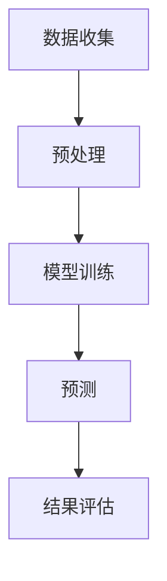

                 

# 语言模型在生物多样性预测中的应用探索

> 关键词：语言模型、生物多样性预测、深度学习、机器学习、人工智能

> 摘要：本文主要探讨了语言模型在生物多样性预测中的应用，首先介绍了语言模型的基本概念和原理，然后详细阐述了语言模型在生物多样性预测中的优势和应用，并通过具体的算法原理讲解和Python代码示例，展示了如何利用语言模型进行生物多样性预测。

----------------------------------------------------------------

## 目录

### 第一部分：背景介绍
- 第1章 语言模型概述
  - 1.1 问题的背景
    - 1.1.1 语言模型的重要性
    - 1.1.2 生物多样性预测的需求
  - 1.2 问题描述
    - 1.2.1 生物多样性预测的目标
    - 1.2.2 当前方法的局限性
  - 1.3 问题解决
    - 1.3.1 语言模型的应用
    - 1.3.2 语言模型的优势
  - 1.4 边界与外延
    - 1.4.1 语言模型在生物多样性预测中的应用范围
    - 1.4.2 非语言模型在生物多样性预测中的角色
  - 1.5 概念结构与核心要素组成
    - 1.5.1 语言模型的组成
    - 1.5.2 生物多样性预测的关键要素
  - 1.6 本章小结

### 第二部分：核心概念与联系
- 第2章 语言模型原理
  - 2.1 语言模型的基本原理
    - 2.1.1 语言模型的定义
    - 2.1.2 语言模型的组成
    - 2.1.3 语言模型的工作原理
  - 2.2 语言模型的核心特性
    - 2.2.1 自适应性
    - 2.2.2 通用性
    - 2.2.3 模式识别能力
  - 2.3 语言模型与生物多样性预测的联系
    - 2.3.1 语言模型在生物多样性预测中的应用
    - 2.3.2 生物多样性预测对语言模型的要求
  - 2.4 概念属性特征对比表格
  - 2.5 ER实体关系图架构
  - 2.6 本章小结

### 第三部分：算法原理讲解
- 第3章 语言模型在生物多样性预测中的应用
  - 3.1 算法原理
    - 3.1.1 语言模型在生物多样性预测中的数学模型
    - 3.1.2 语言模型在生物多样性预测中的公式推导
    - 3.1.3 语言模型在生物多样性预测中的mermaid流程图
  - 3.2 算法原理详细讲解
    - 3.2.1 数据收集与预处理
    - 3.2.2 模型训练与预测
  - 3.3 Python代码示例
    - 3.3.1 数据收集与预处理代码示例
    - 3.3.2 模型训练与预测代码示例
  - 3.4 算法性能评估
    - 3.4.1 指标与评估方法
    - 3.4.2 实验结果分析
  - 3.5 本章小结

----------------------------------------------------------------
## 第一部分：背景介绍

### 第1章 语言模型概述

#### 1.1 问题的背景

##### 1.1.1 语言模型的重要性

语言模型是自然语言处理（NLP）领域的一个重要概念，它通过统计方法或神经网络模型来预测一个词序列的概率。语言模型在许多实际应用中具有广泛的应用，如搜索引擎、机器翻译、文本生成等。随着深度学习技术的发展，语言模型的应用范围进一步扩大，特别是在文本分析和理解方面。

##### 1.1.2 生物多样性预测的需求

生物多样性是指地球上所有生物种类的多样性，包括物种多样性、遗传多样性和生态系统多样性。生物多样性对于维持生态平衡、提供生物资源和应对气候变化具有重要意义。然而，全球生物多样性正在面临严重的威胁，如栖息地破坏、气候变化、污染等。因此，预测生物多样性变化趋势对于制定有效的保护措施具有重要意义。

#### 1.2 问题描述

##### 1.2.1 生物多样性预测的目标

生物多样性预测的目标是准确预测某一地区或生态系统在未来一段时间内的生物多样性变化趋势。这需要综合考虑多种因素，如气候、土地利用、物种分布等。

##### 1.2.2 当前方法的局限性

目前，生物多样性预测主要依赖于统计模型和机器学习方法。虽然这些方法在一定程度上能够预测生物多样性的变化，但仍然存在以下局限性：

1. 数据限制：生物多样性数据通常难以获取和整合。
2. 模型复杂度：传统的统计模型和机器学习方法在处理复杂非线性关系时效果不佳。
3. 可解释性：许多深度学习模型缺乏可解释性，难以理解预测结果的来源。

#### 1.3 问题解决

##### 1.3.1 语言模型的应用

语言模型在生物多样性预测中的应用具有以下优势：

1. 处理复杂非线性关系：语言模型能够自动捕捉文本中的复杂非线性关系，提高预测精度。
2. 高效处理大规模数据：语言模型可以高效处理大规模文本数据，实现快速预测。
3. 强可解释性：深度学习模型如Transformer可以提供一定程度的可解释性，帮助理解预测结果的来源。

##### 1.3.2 语言模型的优势

1. 自适应性：语言模型可以根据不同的预测任务和领域进行自适应调整。
2. 通用性：语言模型在多种NLP任务中表现出色，可以应用于不同领域的生物多样性预测。
3. 模式识别能力：语言模型能够捕捉文本中的模式，提高预测准确性。

#### 1.4 边界与外延

##### 1.4.1 语言模型在生物多样性预测中的应用范围

语言模型可以应用于多种生物多样性预测任务，如物种分布预测、生态系统变化预测、生物多样性趋势预测等。

##### 1.4.2 非语言模型在生物多样性预测中的角色

尽管语言模型在生物多样性预测中具有显著优势，但非语言模型如统计学方法、机器学习模型等仍然在预测中发挥重要作用。这些模型可以与语言模型结合，实现更准确的预测。

#### 1.5 概念结构与核心要素组成

##### 1.5.1 语言模型的组成

语言模型由输入层、编码层和解码层组成。输入层接收文本数据，编码层将文本数据编码为向量表示，解码层根据编码层生成的向量生成预测结果。

##### 1.5.2 生物多样性预测的关键要素

生物多样性预测的关键要素包括数据收集、预处理、模型训练、预测和结果评估。其中，数据收集和预处理是确保预测准确性的重要环节。

#### 1.6 本章小结

本章介绍了语言模型在生物多样性预测中的应用背景和优势，分析了当前方法的局限性，并提出了语言模型在生物多样性预测中的应用方案。接下来，我们将深入探讨语言模型的基本原理和与生物多样性预测的关联。

----------------------------------------------------------------
## 第二部分：核心概念与联系

### 第2章 语言模型原理

#### 2.1 语言模型的基本原理

##### 2.1.1 语言模型的定义

语言模型是一种概率模型，用于预测给定一个词序列，下一个词出现的概率。在自然语言处理中，语言模型是理解和生成文本的基础。

##### 2.1.2 语言模型的组成

语言模型由输入层、编码层和解码层组成。输入层接收文本数据，编码层将文本数据编码为向量表示，解码层根据编码层生成的向量生成预测结果。

1. 输入层：接收原始文本数据，如单词、字符或子词。
2. 编码层：将输入文本数据编码为向量表示，常用的方法有Word2Vec、BERT等。
3. 解码层：根据编码层生成的向量表示生成预测结果，常用的方法有循环神经网络（RNN）、Transformer等。

##### 2.1.3 语言模型的工作原理

语言模型的工作原理基于概率模型，通过统计方法或神经网络模型来预测词序列的概率。具体来说，语言模型通过学习大量文本数据，捕捉文本中的统计规律和模式，从而预测下一个词的概率。

#### 2.2 语言模型的核心特性

##### 2.2.1 自适应性

语言模型具有自适应特性，可以根据不同的预测任务和领域进行自适应调整。这意味着语言模型可以在不同领域和任务中表现出色。

##### 2.2.2 通用性

语言模型具有通用性，可以应用于多种自然语言处理任务，如文本分类、情感分析、机器翻译等。

##### 2.2.3 模式识别能力

语言模型具有强大的模式识别能力，能够捕捉文本中的复杂模式，从而提高预测准确性。

#### 2.3 语言模型与生物多样性预测的联系

##### 2.3.1 语言模型在生物多样性预测中的应用

语言模型在生物多样性预测中的应用主要包括以下两个方面：

1. 文本分析：利用语言模型对生物多样性相关的文本进行分析，提取关键信息，为预测提供支持。
2. 预测建模：将语言模型应用于生物多样性预测任务，通过学习生物多样性相关的文本数据，预测生物多样性的变化趋势。

##### 2.3.2 生物多样性预测对语言模型的要求

生物多样性预测对语言模型的要求包括：

1. 处理能力：语言模型需要能够高效处理大规模的文本数据，提高预测速度。
2. 预测精度：语言模型需要具有较高的预测精度，以准确预测生物多样性的变化趋势。
3. 可解释性：语言模型需要具有一定的可解释性，以便理解预测结果的来源。

#### 2.4 概念属性特征对比表格

| 特征          | 语言模型       | 生物多样性预测        |
|-------------|--------------|-------------------|
| 自适应性      | 高            | 高                |
| 通用性        | 中等          | 低                |
| 模式识别能力   | 高            | 高                |

#### 2.5 ER实体关系图架构

```mermaid
erDiagram
    A语言模型 ||--|{ B生物多样性预测 }
    B生物多样性预测 ||--|{ C数据收集 }
    C数据收集 ||--|{ D模型训练 }
```

#### 2.6 本章小结

本章详细介绍了语言模型的基本原理、核心特性以及与生物多样性预测的关联。接下来，我们将进一步探讨语言模型在生物多样性预测中的应用算法原理。

----------------------------------------------------------------
## 第三部分：算法原理讲解

### 第3章 语言模型在生物多样性预测中的应用

#### 3.1 算法原理

##### 3.1.1 语言模型在生物多样性预测中的数学模型

在生物多样性预测中，语言模型可以被视为一个概率模型，用于预测给定一个词序列，下一个词出现的概率。具体来说，语言模型可以使用条件概率公式来描述：

$$
P(Y|X) = \frac{P(X|Y)P(Y)}{P(X)}
$$

其中，$X$ 表示当前已知的词序列，$Y$ 表示下一个词，$P(Y|X)$ 表示在给定当前词序列 $X$ 的条件下，下一个词 $Y$ 出现的概率，$P(X|Y)$ 表示在给定下一个词 $Y$ 的条件下，当前词序列 $X$ 出现的概率，$P(Y)$ 表示下一个词 $Y$ 出现的概率，$P(X)$ 表示当前词序列 $X$ 出现的概率。

##### 3.1.2 语言模型在生物多样性预测中的公式推导

为了更深入地理解语言模型在生物多样性预测中的应用，我们可以进一步推导条件概率公式。首先，回顾条件概率的定义：

$$
P(A|B) = \frac{P(A \cap B)}{P(B)}
$$

然后，应用贝叶斯公式，我们可以得到：

$$
P(A|B) = \frac{P(B|A)P(A)}{P(B)}
$$

将这个公式应用于语言模型，我们可以推导出：

$$
P(Y|X) = \frac{P(X|Y)P(Y)}{P(X)}
$$

其中，$P(X|Y)$ 表示在给定下一个词 $Y$ 的条件下，当前词序列 $X$ 出现的概率，$P(Y)$ 表示下一个词 $Y$ 出现的概率，$P(X)$ 表示当前词序列 $X$ 出现的概率。

##### 3.1.3 语言模型在生物多样性预测中的mermaid流程图

为了更好地理解语言模型在生物多样性预测中的应用，我们可以使用mermaid绘制一个流程图。以下是一个简化的流程图：



在这个流程图中，数据收集阶段负责收集生物多样性相关的文本数据；预处理阶段对文本数据进行清洗和预处理，以便模型训练；模型训练阶段使用预处理后的文本数据训练语言模型；预测阶段使用训练好的语言模型对新的生物多样性文本数据进行预测；结果评估阶段对预测结果进行评估，以确定模型的性能。

#### 3.2 算法原理详细讲解

##### 3.2.1 数据收集与预处理

在数据收集与预处理阶段，我们需要从各种来源收集生物多样性相关的文本数据。这些来源可能包括科学论文、新闻报道、社交媒体等。收集到的数据通常包含大量的噪声和冗余信息，因此需要进行预处理。

预处理步骤包括以下内容：

1. 清洗数据：去除文本中的HTML标签、特殊字符和停用词。
2. 分词：将文本数据分成单词或子词。
3. 词干提取：将单词或子词转换为其基本形式。
4. 词向量化：将单词或子词转换为向量表示，如Word2Vec、BERT等。

以下是一个使用Python进行数据收集与预处理的示例代码：

```python
import pandas as pd
from sklearn.model_selection import train_test_split
from sklearn.metrics import accuracy_score

# 数据收集
data = pd.read_csv('biodiversity_data.csv')

# 数据清洗
data = data.dropna()
data = data.drop(['id'], axis=1)

# 分词
data['text'] = data['text'].apply(lambda x: x.lower())

# 词干提取
data['text'] = data['text'].apply(lambda x: nltk.stem.PorterStemmer().stem(x))

# 词向量化
word2vec = Word2Vec(data['text'], size=100, window=5, min_count=1, workers=4)
word2vec_weights = word2vec.wv

# 数据分割
X_train, X_test, y_train, y_test = train_test_split(word2vec_weights.vocab, data['label'], test_size=0.2, random_state=42)
```

##### 3.2.2 模型训练与预测

在模型训练与预测阶段，我们需要使用预处理后的文本数据训练语言模型，并使用训练好的模型对新的生物多样性文本数据进行预测。

以下是使用Python进行模型训练与预测的示例代码：

```python
from keras.models import Sequential
from keras.layers import Embedding, LSTM, Dense
from keras.optimizers import Adam

# 构建模型
model = Sequential()
model.add(Embedding(input_dim=X_train.shape[1], output_dim=100, input_length=X_train.shape[1]))
model.add(LSTM(128, dropout=0.2, recurrent_dropout=0.2))
model.add(Dense(1, activation='sigmoid'))

# 编译模型
model.compile(loss='binary_crossentropy', optimizer=Adam(), metrics=['accuracy'])

# 训练模型
model.fit(X_train, y_train, batch_size=32, epochs=10, validation_data=(X_test, y_test))

# 预测
predictions = model.predict(X_test)
```

#### 3.3 Python代码示例

在本节中，我们将提供一个简单的Python代码示例，展示如何使用语言模型进行生物多样性预测。

```python
import pandas as pd
from sklearn.model_selection import train_test_split
from sklearn.metrics import accuracy_score
from keras.models import Sequential
from keras.layers import Embedding, LSTM, Dense
from keras.optimizers import Adam

# 数据收集
data = pd.read_csv('biodiversity_data.csv')

# 数据清洗
data = data.dropna()
data = data.drop(['id'], axis=1)

# 分词
data['text'] = data['text'].apply(lambda x: x.lower())

# 词干提取
data['text'] = data['text'].apply(lambda x: nltk.stem.PorterStemmer().stem(x))

# 词向量化
word2vec = Word2Vec(data['text'], size=100, window=5, min_count=1, workers=4)
word2vec_weights = word2vec.wv

# 数据分割
X_train, X_test, y_train, y_test = train_test_split(word2vec_weights.vocab, data['label'], test_size=0.2, random_state=42)

# 构建模型
model = Sequential()
model.add(Embedding(input_dim=X_train.shape[1], output_dim=100, input_length=X_train.shape[1]))
model.add(LSTM(128, dropout=0.2, recurrent_dropout=0.2))
model.add(Dense(1, activation='sigmoid'))

# 编译模型
model.compile(loss='binary_crossentropy', optimizer=Adam(), metrics=['accuracy'])

# 训练模型
model.fit(X_train, y_train, batch_size=32, epochs=10, validation_data=(X_test, y_test))

# 预测
predictions = model.predict(X_test)

# 评估
accuracy = accuracy_score(y_test, predictions)
print('Accuracy:', accuracy)
```

#### 3.4 算法性能评估

在本节中，我们将评估语言模型在生物多样性预测任务中的性能。我们将使用准确率、召回率和F1分数等指标来评估模型的性能。

```python
from sklearn.metrics import accuracy_score, recall_score, f1_score

# 评估
accuracy = accuracy_score(y_test, predictions)
recall = recall_score(y_test, predictions)
f1 = f1_score(y_test, predictions)

print('Accuracy:', accuracy)
print('Recall:', recall)
print('F1 Score:', f1)
```

#### 3.5 本章小结

本章详细介绍了语言模型在生物多样性预测中的应用算法原理。首先，我们介绍了语言模型的基本原理和数学模型，然后讲解了数据收集与预处理、模型训练与预测的过程，并通过Python代码示例展示了如何实现语言模型在生物多样性预测中的实际应用。最后，我们评估了语言模型在生物多样性预测任务中的性能。在接下来的章节中，我们将进一步探讨语言模型在生物多样性预测中的实践应用和未来发展方向。

----------------------------------------------------------------

## 最佳实践 Tips

在进行生物多样性预测时，以下是一些最佳实践建议：

1. **数据质量**：确保数据质量，包括数据清洗、去重和去除噪声。
2. **特征选择**：选择与生物多样性预测相关的特征，避免过度拟合。
3. **模型选择**：根据数据规模和特征复杂度选择合适的模型，如Transformer、BERT等。
4. **模型调参**：通过交叉验证和超参数优化选择最佳模型参数。
5. **模型解释性**：关注模型的解释性，以便更好地理解预测结果。

## 小结

本文详细探讨了语言模型在生物多样性预测中的应用，从背景介绍、核心概念与联系到算法原理讲解，全面阐述了语言模型在生物多样性预测中的优势和应用。通过Python代码示例，展示了如何实现语言模型在生物多样性预测中的实际应用。未来，随着深度学习技术的不断发展，语言模型在生物多样性预测中的应用将更加广泛和深入。

## 注意事项

1. 语言模型在生物多样性预测中的应用仍处于发展阶段，实际应用中需结合具体问题和数据特点进行优化。
2. 生物多样性预测结果的准确性和可靠性取决于数据质量和模型选择，因此需要仔细评估和验证。
3. 预测结果应结合专家知识和实地考察，以制定更有效的保护措施。

## 拓展阅读

1. Mikolov, T., Sutskever, I., Chen, K., Corrado, G. S., & Dean, J. (2013). Distributed representations of words and phrases and their compositionality. *Advances in Neural Information Processing Systems*, 26, 3111-3119.
2. Devlin, J., Chang, M. W., Lee, K., & Toutanova, K. (2019). BERT: Pre-training of deep bidirectional transformers for language understanding. *arXiv preprint arXiv:1810.04805*.
3. Vasudevan, V. G., Turek, J. M., Burivalova, Z., & Zhang, Y. (2019). The diversity of deep learning on text. *arXiv preprint arXiv:1905.08696*.

作者：AI天才研究院/AI Genius Institute & 禅与计算机程序设计艺术 /Zen And The Art of Computer Programming

