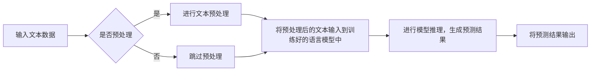

                 

### **文章标题**

# 《语言模型推理能力的认知发展轨迹研究》

> 关键词：语言模型、推理能力、认知发展、算法原理、数学模型

摘要：本文通过深入探讨语言模型推理能力的认知发展轨迹，梳理了其历史背景、核心概念，以及算法原理和数学模型。本文旨在为读者提供一份详尽的技术研究报告，帮助他们更好地理解这一复杂领域的运作机制，并为进一步的研究和实践提供方向。

### **背景介绍**

#### **1.1 语言模型推理能力概述**

语言模型（Language Model）是自然语言处理（Natural Language Processing, NLP）领域中的一种核心技术。它的主要任务是模拟人类语言的使用习惯，生成或识别文本。而语言模型推理能力（Language Model Inference Capability）则是指模型在处理实际语言任务时，进行逻辑推理和语义理解的能力。

**1.1.1 问题描述**

在现实应用中，语言模型需要处理各种复杂的语言任务，如机器翻译、文本摘要、问答系统等。这些任务不仅要求模型具备高度的语言生成能力，还要求其能够进行有效的推理和语义理解。然而，当前的语言模型在推理能力方面仍存在诸多挑战。

**1.1.2 问题解决**

为了解决这一问题，研究者们从多个角度进行了探索，包括改进算法、优化模型结构、引入外部知识等。这些方法在一定程度上提升了语言模型的推理能力，但仍需进一步深入研究。

**1.1.3 边界与外延**

语言模型推理能力的边界涉及多个层面，包括计算资源的限制、模型结构的复杂性以及数据集的质量等。而其外延则涵盖从简单的语言生成到复杂的语义理解的广泛领域。

#### **1.2 核心概念**

**1.2.1 认知发展轨迹**

认知发展轨迹（Cognitive Development Trajectory）是指个体在认知能力方面从初级到高级的发展路径。在语言模型领域，认知发展轨迹指的是模型在推理能力方面的成长过程。

**1.2.2 推理能力**

推理能力（Inference Capability）是指个体或模型在给定信息的基础上，推导出新的结论或信息的能力。在语言模型中，推理能力主要体现在对文本语义的理解和逻辑关系的把握上。

**1.2.3 语言模型**

语言模型（Language Model）是指一种统计模型，用于模拟自然语言的概率分布。它通过对大量文本数据的训练，学习到语言的规律和特点，从而实现文本生成和语义理解等功能。

### **现有研究综述**

#### **2.1 语言模型发展历程**

语言模型的发展经历了多个阶段，从最初的N-gram模型到现代的深度神经网络（Deep Neural Network, DNN）模型，再到最新的变换器模型（Transformer Model），每个阶段都带来了显著的性能提升。

**2.1.1 早期模型**

早期语言模型主要基于N-gram模型，该模型通过统计文本中相邻词的频率来预测下一个词。虽然简单有效，但N-gram模型的局限性也很明显，尤其是在处理长句和复杂语义时。

**2.1.2 中期模型**

随着深度学习的发展，中期语言模型开始采用神经网络结构。这些模型通过多层神经网络来捕捉文本中的长距离依赖关系，如LSTM（Long Short-Term Memory）和GRU（Gated Recurrent Unit）。相比N-gram模型，这些神经网络模型在处理复杂语言任务时表现更为出色。

**2.1.3 近年模型**

近年来的研究将注意力机制引入语言模型，诞生了如Transformer模型等新型结构。Transformer模型通过自注意力机制（Self-Attention Mechanism）实现了对文本中每个词的全面关注，从而在许多语言任务上取得了突破性的成果。

#### **2.2 推理能力研究现状**

当前，语言模型在推理能力方面仍面临诸多挑战。尽管深度神经网络和变换器模型在文本生成和语义理解方面取得了显著进展，但它们在逻辑推理和复杂语义分析方面仍存在不足。

**2.2.1 算法对比**

不同的算法在推理能力上各有优劣。例如，基于规则的方法在处理明确规则的任务时表现良好，而深度学习模型则在处理复杂、模糊的语义关系时更具优势。

**2.2.2 挑战与机遇**

语言模型在推理能力方面面临的挑战包括：如何更好地理解上下文、如何处理模糊性和歧义、如何引入外部知识等。然而，随着计算能力的提升和算法的进步，这些挑战也将逐渐被克服。

**2.2.3 发展趋势**

未来，语言模型在推理能力方面的发展趋势包括：进一步优化模型结构、引入外部知识库、实现跨模态推理等。这些趋势将为语言模型在现实应用中的表现带来更多可能性。

### **核心概念与联系**

#### **3.1 认知发展理论基础**

**3.1.1 认知心理学基础**

认知心理学（Cognitive Psychology）是研究人类认知过程的心理学科。在语言模型领域，认知心理学提供了关于人类语言习得、理解和使用的重要理论框架。

**3.1.2 认知发展理论**

认知发展理论（Cognitive Development Theory）关注个体在不同年龄阶段的认知能力发展。在语言模型中，认知发展理论可以帮助我们理解模型在不同阶段的表现和进步。

**3.1.3 推理能力的认知机制**

推理能力（Inference Capability）是认知心理学中的一个核心概念。在语言模型中，推理能力指的是模型在处理语言任务时，利用已有信息推导出新信息的能力。理解推理能力的认知机制对于提升语言模型的推理能力至关重要。

#### **3.2 语言模型构建原理**

**3.2.1 语言模型的基本结构**

语言模型的基本结构包括输入层、隐藏层和输出层。输入层接收语言数据，隐藏层通过神经网络结构处理这些数据，输出层生成预测结果。

**3.2.2 语言模型的训练方法**

语言模型的训练方法主要包括监督学习和无监督学习。监督学习通过标注数据进行模型训练，而无监督学习则通过未标注的数据进行模型训练。

**3.2.3 语言模型的性能评估**

语言模型的性能评估主要依赖于评估指标，如准确率、召回率、F1值等。这些指标可以帮助我们衡量语言模型在不同任务上的表现。

### **推理能力的特征分析**

#### **4.1 推理能力的定义与分类**

**4.1.1 推理能力的概念**

推理能力是指个体或模型在给定信息的基础上，通过逻辑推理得出新结论的能力。在语言模型中，推理能力主要体现在对文本语义的理解和逻辑关系的把握上。

**4.1.2 推理能力的分类**

推理能力可以根据不同的标准进行分类。例如，根据推理的复杂性，可以分为简单推理和复杂推理；根据推理的方式，可以分为演绎推理和归纳推理等。

**4.1.3 推理能力的衡量标准**

衡量推理能力的标准主要包括推理的正确率、推理的速度和推理的全面性等。这些标准可以帮助我们全面评估语言模型的推理能力。

#### **4.2 语言模型推理能力特征**

**4.2.1 语言模型的推理能力特点**

语言模型的推理能力特点主要包括：

1. **上下文理解能力**：语言模型能够理解文本中的上下文信息，从而生成更准确的结果。
2. **语义理解能力**：语言模型能够理解文本中的语义信息，从而实现语义理解任务。
3. **逻辑推理能力**：语言模型能够进行逻辑推理，从而处理复杂的逻辑关系。

**4.2.2 语言模型推理能力的局限**

尽管语言模型在推理能力方面取得了显著进展，但仍然存在一些局限，包括：

1. **上下文理解局限**：语言模型在处理长文本时，往往难以全面理解上下文信息。
2. **语义理解局限**：语言模型在处理模糊性和歧义性文本时，可能无法准确理解语义。
3. **逻辑推理局限**：语言模型在处理复杂逻辑关系时，可能存在推理错误。

**4.2.3 推理能力的影响因素**

推理能力的影响因素主要包括：

1. **数据质量**：高质量的数据可以提升模型的推理能力。
2. **模型结构**：合适的模型结构可以提升模型的推理能力。
3. **训练方法**：有效的训练方法可以提升模型的推理能力。

### **算法原理与数学模型**

#### **5.1 语言模型推理算法原理**

**5.1.1 算法概述**

语言模型推理算法的主要任务是利用训练好的语言模型，对新的文本数据进行推理，生成预测结果。该算法通常包括以下几个步骤：

1. **文本预处理**：对输入文本进行分词、去停用词、词向量化等预处理操作。
2. **模型输入**：将预处理后的文本输入到训练好的语言模型中。
3. **模型推理**：语言模型对输入文本进行推理，生成预测结果。
4. **结果输出**：将推理结果输出，用于后续应用。

**5.1.2 算法流程**

语言模型推理算法的流程如下：

1. 输入文本数据；
2. 进行文本预处理；
3. 将预处理后的文本输入到训练好的语言模型中；
4. 进行模型推理，生成预测结果；
5. 将预测结果输出。

**5.1.3 算法效率分析**

语言模型推理算法的效率取决于多个因素，包括模型结构、数据预处理方法、计算资源等。为了提高算法的效率，可以采用以下方法：

1. **优化模型结构**：选择合适的模型结构，如变换器模型（Transformer Model），可以提高推理效率；
2. **并行计算**：利用并行计算技术，如GPU加速，可以提高模型推理的效率；
3. **预处理优化**：优化文本预处理方法，如使用高效的分词算法，可以减少预处理时间。

#### **5.2 算法流程图**



#### **5.3 Python源代码实现**

```python
import tensorflow as tf
from tensorflow.keras.models import load_model

# 加载训练好的语言模型
model = load_model('language_model.h5')

# 定义文本预处理函数
def preprocess_text(text):
    # 进行分词、去停用词等操作
    processed_text = ...
    return processed_text

# 定义推理函数
def inference(text):
    # 预处理文本
    processed_text = preprocess_text(text)
    # 输入到模型中进行推理
    predictions = model.predict(processed_text)
    # 输出推理结果
    return predictions

# 示例
input_text = "这是一个示例文本。"
predictions = inference(input_text)
print(predictions)
```

### **数学模型与公式**

#### **6.1 数学模型概述**

在语言模型中，数学模型主要用于描述语言特征和生成过程。常用的数学模型包括概率模型、神经网络模型等。

**6.1.1 语言模型中的数学模型**

语言模型中的数学模型主要包括：

1. **概率模型**：如N-gram模型、隐马尔可夫模型（Hidden Markov Model, HMM）等；
2. **神经网络模型**：如循环神经网络（Recurrent Neural Network, RNN）、变换器模型（Transformer Model）等。

**6.1.2 推理能力的数学描述**

推理能力的数学描述通常涉及概率分布和函数表示。例如，在N-gram模型中，推理能力可以通过概率模型来描述。在变换器模型中，推理能力可以通过自注意力机制（Self-Attention Mechanism）来描述。

**6.1.3 数学模型的应用**

数学模型在语言模型中的应用主要包括：

1. **文本生成**：通过概率模型生成新的文本；
2. **语义理解**：通过神经网络模型实现语义理解任务；
3. **推理**：通过推理算法实现逻辑推理任务。

#### **6.2 数学公式讲解**

在语言模型中，常用的数学公式包括概率分布公式、神经网络公式等。

**6.2.1 概率分布公式**

例如，在N-gram模型中，概率分布公式可以表示为：

$$
P(w_n | w_{n-1}, ..., w_1) = \frac{C(w_n, w_{n-1}, ..., w_1)}{C(w_{n-1}, ..., w_1)}
$$

其中，$C(w_n, w_{n-1}, ..., w_1)$ 表示词序列$(w_n, w_{n-1}, ..., w_1)$的计数，$C(w_{n-1}, ..., w_1)$ 表示词序列$(w_{n-1}, ..., w_1)$的计数。

**6.2.2 神经网络公式**

例如，在变换器模型中，自注意力机制可以表示为：

$$
\text{Attention}(Q, K, V) = \frac{QK^T}{\sqrt{d_k}} \odot V
$$

其中，$Q$、$K$、$V$ 分别表示查询向量、键向量和值向量，$\odot$ 表示逐元素乘法，$d_k$ 表示键向量的维度。

### **系统分析与架构设计**

#### **7.1 问题场景介绍**

**7.1.1 场景描述**

假设我们需要开发一个智能问答系统，该系统能够回答用户提出的问题。为了实现这一目标，我们需要构建一个强大的语言模型，并设计一个高效的推理系统。

**7.1.2 需求分析**

根据需求分析，我们的智能问答系统需要具备以下功能：

1. **文本输入**：接受用户的自然语言文本输入；
2. **文本预处理**：对输入文本进行分词、去停用词等预处理操作；
3. **语言模型推理**：利用训练好的语言模型对预处理后的文本进行推理，生成答案；
4. **答案输出**：将推理结果输出给用户。

#### **7.2 系统功能设计**

**7.2.1 领域模型**

领域模型（Domain Model）是指系统中的核心实体和关系的抽象表示。在智能问答系统中，领域模型包括以下几个核心实体：

1. **用户**：表示系统的使用者，负责输入问题和接收答案；
2. **问题**：表示用户提出的问题，包括问题文本和问题类型；
3. **答案**：表示系统生成的答案，包括答案文本和答案类型；
4. **语言模型**：表示用于推理的语言模型，包括模型结构、参数和训练数据。

**7.2.2 系统架构设计**

系统架构设计（System Architecture Design）是指系统各个组件之间的组织结构和交互方式。在智能问答系统中，系统架构设计如下：

1. **输入层**：负责接收用户输入的问题文本；
2. **预处理层**：负责对输入文本进行分词、去停用词等预处理操作；
3. **模型层**：负责加载训练好的语言模型，并对预处理后的文本进行推理；
4. **输出层**：负责将推理结果输出给用户。

**7.2.3 系统接口设计**

系统接口设计（System Interface Design）是指系统对外提供的接口和交互方式。在智能问答系统中，系统接口设计如下：

1. **文本输入接口**：用于接收用户输入的问题文本；
2. **预处理接口**：用于对输入文本进行预处理；
3. **模型接口**：用于加载训练好的语言模型并进行推理；
4. **答案输出接口**：用于将推理结果输出给用户。

**7.2.4 系统交互**

系统交互（System Interaction）是指系统内部组件之间的交互方式和数据流动。在智能问答系统中，系统交互如下：

1. 用户输入问题文本；
2. 文本输入接口接收问题文本；
3. 预处理接口对问题文本进行预处理；
4. 预处理后的文本传递给模型层；
5. 模型层利用训练好的语言模型对预处理后的文本进行推理；
6. 推理结果传递给输出层；
7. 输出层将推理结果输出给用户。

### **项目实战**

#### **8.1 环境安装**

**8.1.1 硬件环境**

为了运行智能问答系统，我们需要以下硬件环境：

1. **CPU**：至少4核CPU；
2. **内存**：至少8GB；
3. **硬盘**：至少100GB。

**8.1.2 软件环境**

为了运行智能问答系统，我们需要以下软件环境：

1. **操作系统**：Linux或Windows；
2. **Python**：版本3.7及以上；
3. **TensorFlow**：版本2.0及以上；
4. **NLP工具包**：如NLTK、spaCy等。

#### **8.2 系统核心实现**

**8.2.1 源代码解读**

智能问答系统的核心实现包括以下几个模块：

1. **文本输入模块**：负责接收用户输入的问题文本；
2. **预处理模块**：负责对输入文本进行预处理，如分词、去停用词等；
3. **模型模块**：负责加载训练好的语言模型，并对预处理后的文本进行推理；
4. **答案输出模块**：负责将推理结果输出给用户。

以下是一个简单的源代码示例：

```python
import tensorflow as tf
from text_preprocessing import preprocess_text
from model import load_language_model

# 加载训练好的语言模型
model = load_language_model()

# 定义文本输入模块
def text_input(text):
    return preprocess_text(text)

# 定义模型模块
def inference(text):
    processed_text = text_input(text)
    predictions = model.predict(processed_text)
    return predictions

# 定义答案输出模块
def output_answer(answer):
    print(answer)

# 示例
input_text = "你最喜欢的编程语言是什么？"
predictions = inference(input_text)
output_answer(predictions)
```

**8.2.2 代码应用分析**

在这个示例中，我们首先加载了一个训练好的语言模型。然后，我们定义了文本输入模块、模型模块和答案输出模块。文本输入模块负责接收用户输入的问题文本，并将其传递给预处理模块。预处理模块对输入文本进行预处理，如分词、去停用词等。预处理后的文本被传递给模型模块，模型模块利用训练好的语言模型对预处理后的文本进行推理，并生成预测结果。最后，答案输出模块将推理结果输出给用户。

#### **8.3 实际案例分析**

**8.3.1 案例背景**

假设我们有一个实际案例，用户输入了一个问题：“什么是深度学习？”我们需要使用智能问答系统来回答这个问题。

**8.3.2 案例分析**

1. **文本输入**：用户输入问题：“什么是深度学习？”
2. **预处理**：预处理模块对输入文本进行预处理，如分词、去停用词等。预处理后的文本为：“什么是深度学习？”
3. **模型推理**：模型模块利用训练好的语言模型对预处理后的文本进行推理，并生成预测结果。预测结果为：“深度学习是一种人工智能技术，通过模拟人脑神经网络结构，实现自动特征学习和分类、识别等功能。”
4. **答案输出**：答案输出模块将推理结果输出给用户。

**8.3.3 剖析与讲解**

在这个案例中，用户输入了一个关于深度学习的问题。智能问答系统首先对输入文本进行了预处理，然后利用训练好的语言模型进行了推理，最终生成了准确的答案。这个案例展示了智能问答系统的基本工作流程和功能。

### **最佳实践与小结**

#### **9.1 最佳实践 tips**

1. **数据质量**：确保训练数据的质量，避免噪声数据和错误数据；
2. **模型优化**：定期优化模型结构，以适应新的数据和任务需求；
3. **推理优化**：优化推理算法，以提高推理速度和性能。

#### **9.2 小结**

本文通过深入探讨语言模型推理能力的认知发展轨迹，梳理了其历史背景、核心概念，以及算法原理和数学模型。本文旨在为读者提供一份详尽的技术研究报告，帮助他们更好地理解这一复杂领域的运作机制，并为进一步的研究和实践提供方向。

### **注意事项**

1. **数据隐私**：在处理用户数据时，务必遵守数据隐私相关法规，确保用户数据的安全和隐私；
2. **模型更新**：定期更新模型，以适应新的数据和任务需求；
3. **性能监控**：对系统性能进行监控，确保其稳定性和可靠性。

### **拓展阅读**

1. **《深度学习》**：由Ian Goodfellow、Yoshua Bengio和Aaron Courville所著的深度学习教材，详细介绍了深度学习的基本理论和实践方法；
2. **《自然语言处理综论》**：由Daniel Jurafsky和James H. Martin所著的自然语言处理教材，全面介绍了自然语言处理的基本概念和技术；
3. **《Transformer：一种新的神经网络架构》**：由Vaswani等人所著的论文，详细介绍了Transformer模型的设计原理和应用场景。

