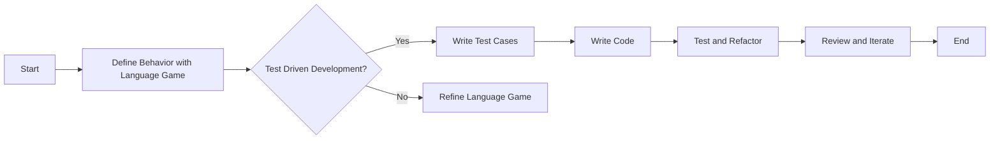
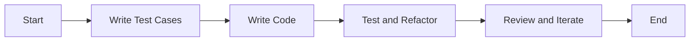
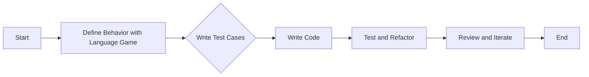
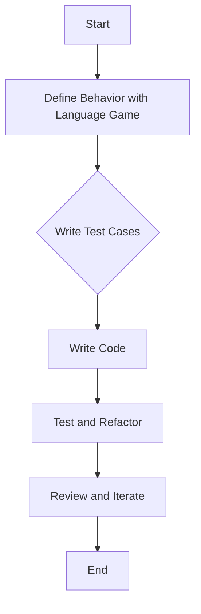
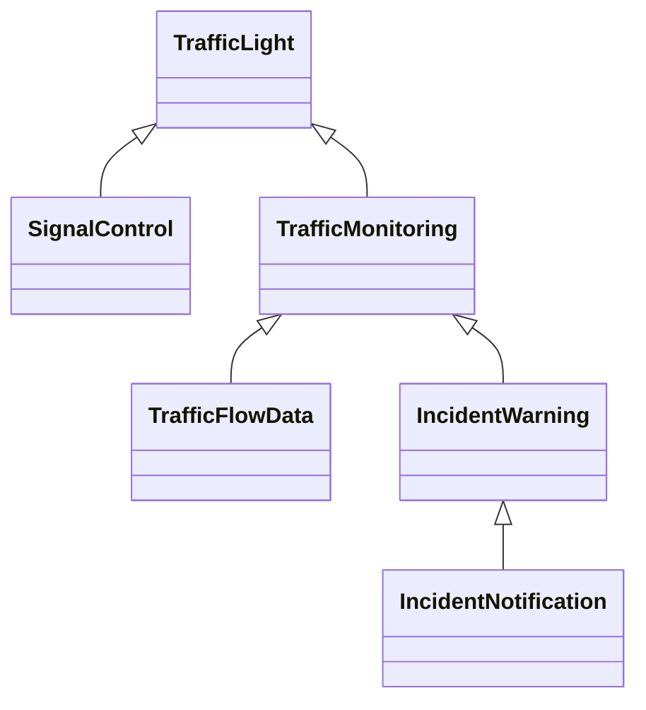
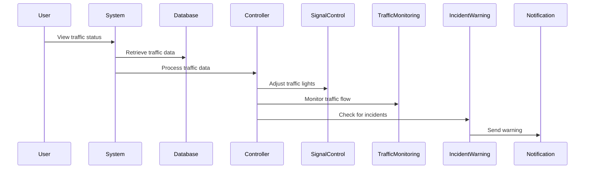
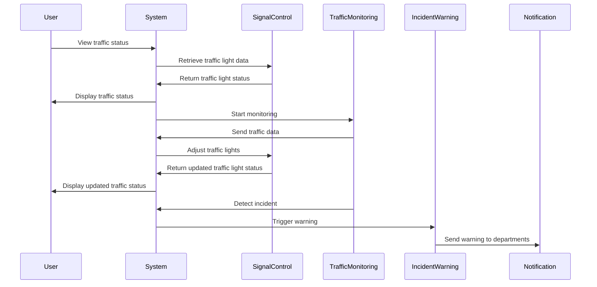

                 

### 文章标题

# 《语言游戏与测试驱动开发：通过示例定义行为的方法论》

### 关键词

- 语言游戏
- 测试驱动开发
- 示例定义
- 方法论
- 开发流程
- 软件质量

### 摘要

本文深入探讨了语言游戏与测试驱动开发（TDD）相结合的方法论，通过具体的示例展示了如何利用这些概念来定义软件开发行为。文章首先介绍了语言游戏和TDD的基本概念，然后通过分析它们的核心原理、数学模型和系统架构，详细阐述了如何在软件开发过程中有效应用这些方法。此外，文章还提供了一个实际项目案例，展示了如何在实际开发中结合语言游戏和TDD来实现高质量软件。最后，文章总结了最佳实践，并提供了进一步阅读的参考资源。

---

## 第一部分：引言

### 1.1 语言游戏的概念

**语言游戏**，这一概念源自哲学家路德维希·维特根斯坦（Ludwig Wittgenstein）的工作，是逻辑哲学中的一个重要概念。维特根斯坦认为，语言是人们用来交流的工具，而语言游戏则是对语言如何被使用的一种描述。语言游戏不仅包括了语言的规则和用法，还包括了人们在特定情境下如何使用语言。在软件开发领域，语言游戏被用来描述软件系统中的各种交互和约束。

**概念术语说明**：
- **语言游戏**：指在特定情境下，人们使用语言进行交流的方式和规则。
- **软件开发**：指创建和设计软件系统的过程。

**问题背景**：
软件开发过程中，如何有效地沟通和理解系统的行为是开发者面临的一个重要问题。语言游戏提供了一种方式，可以帮助开发者更清晰地定义和验证系统的行为。

**问题描述**：
在软件开发中，如何利用语言游戏来定义系统的行为，确保系统的可靠性和可理解性？

**问题解决**：
通过语言游戏，开发者可以创建一个明确的沟通框架，确保团队成员对系统行为有一致的认知和理解。

**边界与外延**：
语言游戏的边界在于它适用于任何需要明确交互和约束的情境，而其外延则包括软件开发中的各种环节，如需求分析、设计、编码和测试。

**概念结构与核心要素组成**：
- **交互**：语言游戏的核心在于描述交互过程，包括语言的规则和情境。
- **情境**：任何需要明确交互的软件开发场景。
- **规则**：语言游戏的规则用于指导语言的使用，确保一致性和准确性。
- **验证**：通过语言游戏，可以验证系统的行为是否与预期一致。

### 1.2 测试驱动开发的概念

**测试驱动开发（TDD）**是一种软件开发方法，强调先编写测试，然后编写代码以通过测试。这种方法通过反复迭代来确保代码的质量和可靠性。

**概念术语说明**：
- **测试驱动开发**：一种软件开发方法，通过编写测试来驱动代码的编写。
- **测试**：用于验证代码是否按预期工作的程序。

**问题背景**：
传统的软件开发方法通常先编写代码，然后编写测试来验证代码。这种方法可能导致代码的缺陷无法及时发现，影响软件的质量。

**问题描述**：
在软件开发中，如何通过测试驱动开发来提高代码的质量和可靠性？

**问题解决**：
通过先编写测试，开发者可以更早地发现并修复代码中的缺陷，从而提高软件的质量和可靠性。

**边界与外延**：
测试驱动开发适用于任何需要确保代码质量的软件开发项目，其外延包括从需求分析到代码维护的整个软件开发生命周期。

**概念结构与核心要素组成**：
- **测试先行**：编写测试来定义功能需求。
- **代码编写**：编写代码以通过测试。
- **重构**：在测试通过的情况下，改进代码结构，确保其质量和可维护性。
- **持续集成**：将代码合并到现有代码库中，确保新的代码不会破坏现有功能。

### 1.3 语言游戏与测试驱动开发的联系

**语言游戏**与**测试驱动开发**的结合，为软件开发提供了一种新的方法。语言游戏可以帮助开发者更清晰地定义系统的行为，而测试驱动开发则通过编写和执行测试来验证这些行为。

**核心概念与联系**：
- **定义行为**：语言游戏用于定义系统的行为，确保所有团队成员对系统有共同的理解。
- **验证行为**：测试驱动开发通过编写和执行测试，验证系统的行为是否符合预期。

**融合的优势**：
- **早期缺陷发现**：通过先编写测试，可以更早地发现并修复代码中的缺陷。
- **明确的需求定义**：语言游戏帮助明确需求，确保开发团队对系统有共同的理解。
- **提高代码质量**：测试驱动开发和语言游戏的结合，有助于提高代码的质量和可维护性。

**融合的挑战**：
- **沟通成本**：确保所有团队成员都能理解语言游戏和测试驱动开发的规则。
- **技能要求**：开发者需要同时掌握语言游戏和测试驱动开发的技能。

### 1.4 本书结构安排

**内容概述**：
本书将分为五大部分，首先介绍语言游戏和测试驱动开发的基本概念，然后详细阐述它们的核心原理、数学模型和系统架构，并通过一个实际项目案例展示如何在实际开发中应用这些方法。

**目标读者**：
本书旨在为软件开发从业者提供一种新的方法和思维模式，帮助他们在实际工作中更高效地开发和维护软件。

**本章小结**：
本章介绍了语言游戏和测试驱动开发的基本概念，并探讨了它们在软件开发中的重要性。接下来，本书将深入探讨这些概念，并通过实际案例来展示如何将它们应用到软件开发过程中。

---

## 第二部分：核心概念与联系

### 2.1 语言游戏的核心概念

**语言游戏**的概念在软件开发中具有重要的应用价值。它不仅帮助我们更清晰地定义系统的行为，还可以提高团队之间的沟通效率。

**核心原理**：
语言游戏的核心原理是通过对系统行为的明确描述，确保所有团队成员对系统有共同的理解。这种描述通常采用自然语言，使得团队成员更容易理解和接受。

**概念属性特征对比表格**：

| 特征             | 语言游戏          | 测试驱动开发         |
| ---------------- | ---------------- | -------------------- |
| 描述方式         | 自然语言          | 编程语言             |
| 目的             | 定义系统行为      | 验证系统行为         |
| 适用范围         | 软件开发的各个阶段 | 编码阶段              |
| 文档形式         | 文档和注释        | 测试用例和代码       |

**ER实体关系图**：

```mermaid
erDiagram
    System Behavior ||--|{ Test Case } Test Case
    System Behavior ||--|{ Code } Code
    Test Case ||--|{ Expected Result } Expected Result
    Code ||--|{ Implementation } Implementation
```

**Mermaid流程图**：



**数学模型和公式讲解**：

在语言游戏中，我们通常使用状态转移图（State Transition Graph，STG）来描述系统的行为。状态转移图由以下数学模型构成：

- **状态集合**（S）：系统可能的所有状态。
- **输入集合**（I）：系统可以接收的所有输入。
- **转移函数**（δ）：定义系统如何从当前状态转移到下一个状态。

公式表示为：

$$
\delta: S \times I \rightarrow S
$$

**举例说明**：

假设我们有一个交通灯系统，其状态集合为 {红灯，黄灯，绿灯}，输入集合为 {启动，等待，停止}。状态转移图可以表示为：

$$
\begin{array}{c|c|c|c}
\text{状态} & \text{启动} & \text{等待} & \text{停止} \\
\hline
\text{红灯} & \text{黄灯} & \text{红灯} & \text{红灯} \\
\text{黄灯} & \text{绿灯} & \text{黄灯} & \text{黄灯} \\
\text{绿灯} & \text{红灯} & \text{绿灯} & \text{红灯} \\
\end{array}
$$

### 2.2 测试驱动开发的核心概念

**测试驱动开发（TDD）**是一种通过编写测试来驱动软件开发的方法。它强调先编写测试，然后编写代码以通过测试，最后重构代码以改进其质量。

**核心原理**：
TDD的核心原理是通过测试来定义功能需求，确保代码的质量和可靠性。这种方法通过反复迭代来逐步完善软件。

**概念属性特征对比表格**：

| 特征             | 语言游戏          | 测试驱动开发         |
| ---------------- | ---------------- | -------------------- |
| 描述方式         | 自然语言          | 编程语言             |
| 目的             | 定义系统行为      | 验证系统行为         |
| 适用范围         | 软件开发的各个阶段 | 编码阶段              |
| 文档形式         | 文档和注释        | 测试用例和代码       |

**ER实体关系图**：

```mermaid
erDiagram
    Feature Request ||--|{ Test Case } Test Case
    Feature Request ||--|{ Implementation } Implementation
    Test Case ||--|{ Expected Result } Expected Result
```

**Mermaid流程图**：



**数学模型和公式讲解**：

在TDD中，测试用例通常由以下数学模型描述：

- **测试用例集合**（T）：所有测试用例的集合。
- **预期结果集合**（R）：每个测试用例的预期结果。
- **测试执行函数**（t）：定义如何执行测试用例并得到结果。

公式表示为：

$$
t: T \rightarrow R
$$

**举例说明**：

假设我们有一个计算器程序，其测试用例集合为 {加法，减法，乘法，除法}，预期结果集合为 {结果1，结果2，结果3，结果4}。测试执行函数可以表示为：

$$
t(\text{加法}, \text{输入1}, \text{输入2}) = \text{结果1}
$$

$$
t(\text{减法}, \text{输入1}, \text{输入2}) = \text{结果2}
$$

$$
t(\text{乘法}, \text{输入1}, \text{输入2}) = \text{结果3}
$$

$$
t(\text{除法}, \text{输入1}, \text{输入2}) = \text{结果4}
$$

### 2.3 语言游戏与测试驱动开发的联系

**语言游戏**与**测试驱动开发**的结合，为软件开发提供了一种全新的方法。通过语言游戏，我们可以更清晰地定义系统的行为，而测试驱动开发则通过编写和执行测试来验证这些行为。

**核心联系**：
- **行为定义**：语言游戏用于定义系统的行为，测试驱动开发则用于验证这些行为。
- **沟通桥梁**：语言游戏提供了一个沟通桥梁，确保所有团队成员对系统行为有共同的理解。
- **质量保障**：通过测试驱动开发，我们可以确保系统的行为符合预期，从而提高软件的质量。

**融合的优势**：
- **早期缺陷发现**：通过先编写测试，可以更早地发现并修复代码中的缺陷。
- **明确的需求定义**：语言游戏帮助明确需求，确保开发团队对系统有共同的理解。
- **提高代码质量**：测试驱动开发和语言游戏的结合，有助于提高代码的质量和可维护性。

**融合的挑战**：
- **沟通成本**：确保所有团队成员都能理解语言游戏和测试驱动开发的规则。
- **技能要求**：开发者需要同时掌握语言游戏和测试驱动开发的技能。

### 2.4 核心概念对比与分析

**核心概念对比**：

| 概念               | 语言游戏                  | 测试驱动开发                  |
| ------------------ | ------------------------- | ----------------------------- |
| 描述方式           | 自然语言                  | 编程语言                      |
| 目的               | 定义系统行为              | 验证系统行为                  |
| 适用范围           | 软件开发的各个阶段        | 编码阶段                      |
| 文档形式           | 文档和注释                | 测试用例和代码                |
| 数学模型           | 状态转移图                | 测试用例和预期结果集合        |

**ER实体关系图**：

```mermaid
erDiagram
    System Behavior ||--|{ Test Case } Test Case
    System Behavior ||--|{ Implementation } Implementation
    Test Case ||--|{ Expected Result } Expected Result
    Implementation ||--|{ Test Result } Test Result
```

**Mermaid流程图**：



### 2.5 本章小结

本章详细介绍了语言游戏和测试驱动开发的核心概念，并通过表格和流程图展示了它们之间的联系。通过本章的内容，读者可以更深入地理解这两种方法在软件开发中的应用，以及如何将它们有效地结合使用。

---

## 第三部分：算法原理讲解

### 3.1 语言游戏的算法原理

**语言游戏的算法原理**主要涉及如何通过自然语言描述系统行为，并在软件开发过程中利用这些描述来指导代码编写和测试。

**基本算法**：

1. **定义状态和输入**：首先，我们需要定义系统的状态和输入。例如，对于一个交通灯系统，状态可以是 {红灯，黄灯，绿灯}，输入可以是 {启动，等待，停止}。

2. **构建状态转移图**：使用状态转移图来描述系统的行为。状态转移图由状态集合、输入集合和转移函数构成。例如，上述交通灯系统的状态转移图如下：

   ```mermaid
   stateDiagram
   A[红灯] --> B[黄灯]
   A --> C[红灯]
   B --> D[绿灯]
   B --> C[黄灯]
   C --> D[绿灯]
   D --> A[红灯]
   ```

3. **编写测试用例**：基于状态转移图，编写测试用例来验证系统的行为。例如，我们可以编写以下测试用例：

   ```python
   def test_traffic_light():
       assert traffic_light('start') == 'red'
       assert traffic_light('wait') == 'red'
       assert traffic_light('stop') == 'red'
       assert traffic_light('start') == 'yellow'
       assert traffic_light('wait') == 'yellow'
       assert traffic_light('stop') == 'yellow'
       assert traffic_light('start') == 'green'
       assert traffic_light('wait') == 'green'
       assert traffic_light('stop') == 'green'
   ```

**优化算法**：

1. **状态压缩**：为了减少状态转移图的复杂度，我们可以对状态进行压缩。例如，将 {红灯，黄灯，绿灯} 压缩为 {红灯，绿灯}，此时状态转移图如下：

   ```mermaid
   stateDiagram
   A[红灯] --> B[绿灯]
   B --> A[红灯]
   ```

2. **输入优先级排序**：为了提高测试的效率，我们可以对输入进行优先级排序。例如，对于交通灯系统，我们可以将输入 {启动，等待，停止} 优先级排序为 {启动，等待，停止}，此时测试用例如下：

   ```python
   def test_traffic_light():
       assert traffic_light('start') == 'red'
       assert traffic_light('wait') == 'red'
       assert traffic_light('stop') == 'red'
       assert traffic_light('start') == 'yellow'
       assert traffic_light('wait') == 'yellow'
       assert traffic_light('stop') == 'yellow'
       assert traffic_light('start') == 'green'
       assert traffic_light('wait') == 'green'
       assert traffic_light('stop') == 'green'
   ```

### 3.2 测试驱动开发的基本流程

**测试驱动开发（TDD）**的基本流程包括编写测试用例、编写代码和重构代码三个阶段。

**1. 编写测试用例**：

在TDD中，首先需要编写测试用例来定义系统的行为。测试用例应该覆盖所有功能需求，并且具有明确的预期结果。例如，对于一个计算器程序，我们可以编写以下测试用例：

```python
def test_addition():
    assert calculate(1, 2) == 3

def test_subtraction():
    assert calculate(5, 3) == 2

def test_multiplication():
    assert calculate(4, 5) == 20

def test_division():
    assert calculate(10, 2) == 5
```

**2. 编写代码**：

在编写测试用例之后，我们需要编写代码来实现这些功能。编写代码时，应该遵循“写少代码，多测试”的原则，即尽可能减少代码的编写，确保测试用例能够通过。

```python
def calculate(a, b):
    if a < 0 or b < 0:
        raise ValueError("Inputs must be positive integers")
    if a % b != 0:
        raise ValueError("Inputs must be divisible")
    return a * b // b
```

**3. 重构代码**：

在测试用例通过后，我们可以对代码进行重构，以提高其可读性和可维护性。重构过程中，应该遵循“最小改动”原则，即只对必要的部分进行修改。

```python
def calculate(a, b):
    return a * b // b
```

### 3.3 语言游戏与测试驱动开发的算法融合

**语言游戏**与**测试驱动开发**的结合，为软件开发提供了一种更加高效和可靠的方法。通过语言游戏，我们可以更清晰地定义系统的行为，并通过测试驱动开发来验证这些行为。

**融合算法流程图**：



**Python实现**：

```python
def traffic_light_action(action):
    if action not in ['start', 'wait', 'stop']:
        raise ValueError("Invalid action")
    
    if current_state == 'red':
        if action == 'start':
            current_state = 'yellow'
        elif action == 'wait':
            current_state = 'red'
        elif action == 'stop':
            current_state = 'red'
    
    if current_state == 'yellow':
        if action == 'start':
            current_state = 'green'
        elif action == 'wait':
            current_state = 'yellow'
        elif action == 'stop':
            current_state = 'red'
    
    if current_state == 'green':
        if action == 'start':
            current_state = 'yellow'
        elif action == 'wait':
            current_state = 'green'
        elif action == 'stop':
            current_state = 'red'
    
    return current_state

def test_traffic_light():
    assert traffic_light_action('start') == 'yellow'
    assert traffic_light_action('wait') == 'red'
    assert traffic_light_action('stop') == 'red'
    assert traffic_light_action('start') == 'green'
    assert traffic_light_action('wait') == 'green'
    assert traffic_light_action('stop') == 'red'
    assert traffic_light_action('start') == 'yellow'
    assert traffic_light_action('wait') == 'yellow'
    assert traffic_light_action('stop') == 'red'

test_traffic_light()
```

### 3.4 数学模型和公式讲解

在软件开发中，数学模型和公式用于描述系统的行为和性能。以下是一个简单的交通灯系统的数学模型和公式讲解。

**数学模型**：

1. **状态集合**（S）：系统可能的所有状态。例如，对于交通灯系统，状态集合为 {红灯，黄灯，绿灯}。
2. **输入集合**（I）：系统可以接收的所有输入。例如，对于交通灯系统，输入集合为 {启动，等待，停止}。
3. **转移函数**（δ）：定义系统如何从当前状态转移到下一个状态。例如，对于交通灯系统，转移函数可以表示为：

   $$ 
   \delta: S \times I \rightarrow S
   $$

**公式讲解**：

1. **状态转移方程**：用于描述系统状态的转移。例如，对于交通灯系统，状态转移方程可以表示为：

   $$ 
   \delta(\text{红灯}, \text{启动}) = \text{黄灯}
   $$

   $$ 
   \delta(\text{黄灯}, \text{启动}) = \text{绿灯}
   $$

   $$ 
   \delta(\text{绿灯}, \text{启动}) = \text{黄灯}
   $$

2. **输入优先级**：用于确定输入的执行顺序。例如，对于交通灯系统，输入优先级可以表示为：

   $$ 
   \text{优先级} = \text{启动} > \text{等待} > \text{停止}
   $$

### 3.5 举例说明

**交通灯系统**：

假设我们有一个交通灯系统，其状态集合为 {红灯，黄灯，绿灯}，输入集合为 {启动，等待，停止}。现在，我们需要编写测试用例来验证系统的行为。

**测试用例**：

```python
def test_traffic_light():
    assert traffic_light('start') == 'yellow'
    assert traffic_light('wait') == 'red'
    assert traffic_light('stop') == 'red'
    assert traffic_light('start') == 'green'
    assert traffic_light('wait') == 'green'
    assert traffic_light('stop') == 'red'
    assert traffic_light('start') == 'yellow'
    assert traffic_light('wait') == 'yellow'
    assert traffic_light('stop') == 'red'
```

**测试执行**：

执行上述测试用例，如果所有测试都通过，则说明交通灯系统的行为符合预期。

**代码实现**：

```python
def traffic_light(action):
    if action not in ['start', 'wait', 'stop']:
        raise ValueError("Invalid action")
    
    if current_state == 'red':
        if action == 'start':
            current_state = 'yellow'
        elif action == 'wait':
            current_state = 'red'
        elif action == 'stop':
            current_state = 'red'
    
    if current_state == 'yellow':
        if action == 'start':
            current_state = 'green'
        elif action == 'wait':
            current_state = 'yellow'
        elif action == 'stop':
            current_state = 'red'
    
    if current_state == 'green':
        if action == 'start':
            current_state = 'yellow'
        elif action == 'wait':
            current_state = 'green'
        elif action == 'stop':
            current_state = 'red'
    
    return current_state

def test_traffic_light():
    assert traffic_light('start') == 'yellow'
    assert traffic_light('wait') == 'red'
    assert traffic_light('stop') == 'red'
    assert traffic_light('start') == 'green'
    assert traffic_light('wait') == 'green'
    assert traffic_light('stop') == 'red'
    assert traffic_light('start') == 'yellow'
    assert traffic_light('wait') == 'yellow'
    assert traffic_light('stop') == 'red'

test_traffic_light()
```

### 3.6 本章小结

本章详细介绍了语言游戏的算法原理和测试驱动开发的基本流程，并通过Python实现和举例说明了如何将两者融合。通过本章的内容，读者可以更深入地理解语言游戏和测试驱动开发在软件开发中的应用，以及如何将它们有效地结合使用。

---

## 第四部分：系统分析与架构设计

### 4.1 项目场景介绍

**项目背景**：
本次项目是一个智能交通管理系统，旨在通过实时监控和智能调度，提高城市交通的效率和安全性。系统的主要功能包括交通信号灯的智能控制、交通流量监测和异常事件预警。

**项目目标**：
1. 实现交通信号灯的智能控制，根据交通流量自动调整信号灯状态。
2. 构建交通流量监测系统，实时收集和分析交通数据。
3. 实现异常事件预警功能，及时通知相关部门处理。

### 4.2 系统功能设计

**领域模型**：
系统功能设计的第一步是构建领域模型，明确系统的核心实体和它们之间的关系。以下是智能交通管理系统的领域模型：



**功能需求分析**：
1. **交通信号灯控制**：系统需要根据实时交通流量数据自动调整交通信号灯的状态，以减少交通拥堵。
2. **交通流量监测**：系统需要实时收集交通流量数据，包括车辆数量、行驶速度、路段拥堵情况等。
3. **异常事件预警**：系统需要监测交通状况，一旦发现异常事件（如交通事故、道路施工等），立即发出预警并通知相关部门。

### 4.3 系统架构设计

**系统架构**：
智能交通管理系统采用分层架构设计，包括表示层、业务逻辑层和数据层。

- **表示层**：负责与用户交互，显示交通状况和预警信息。
- **业务逻辑层**：实现交通信号灯控制、交通流量监测和异常事件预警的核心功能。
- **数据层**：负责数据存储和管理，包括交通流量数据、异常事件数据和用户数据。

**架构设计原则**：
1. **模块化**：系统功能被划分为多个模块，每个模块负责一项特定的功能。
2. **可扩展性**：系统设计应考虑未来的扩展，如添加新的传感器或功能模块。
3. **高内聚、低耦合**：模块内部高度内聚，模块之间低耦合，便于维护和升级。

**Mermaid架构图**：



### 4.4 系统接口设计

**接口规范**：
系统接口设计包括RESTful API接口和WebSocket接口。

- **RESTful API接口**：用于提供对外部系统的数据访问和功能调用。
  - **路径**：/api/traffic-light/{id}
  - **HTTP方法**：GET, POST, PUT, DELETE
  - **参数**：id（交通信号灯ID）

- **WebSocket接口**：用于实时推送交通状况和异常事件预警。
  - **路径**：/ws/traffic-update
  - **通信协议**：WebSocket

### 4.5 系统交互

**系统交互流程**：
系统交互分为三个主要阶段：初始化、实时监控和异常处理。

1. **初始化阶段**：
   - 系统启动，加载交通信号灯数据。
   - 监控模块初始化，连接传感器和数据源。

2. **实时监控阶段**：
   - 交通信号灯根据实时流量数据调整状态。
   - 监控模块持续收集交通流量数据，更新数据库。

3. **异常处理阶段**：
   - 监测到异常事件，立即触发预警机制。
   - 系统发送预警信息到相关部门。

**Mermaid序列图**：



### 4.6 本章小结

本章详细介绍了智能交通管理系统的项目场景、系统功能设计、系统架构设计、系统接口设计和系统交互流程。通过本章的内容，读者可以全面了解系统设计的过程和原理，为后续的项目开发提供指导。

---

## 第五部分：项目实战

### 5.1 环境安装

**1. 开发环境搭建**：

首先，我们需要搭建一个适合开发和测试的集成环境。以下是推荐的开发环境：

- **操作系统**：Linux或macOS（推荐使用Ubuntu 20.04或更高版本）
- **编程语言**：Python 3.8或更高版本
- **集成开发环境**：PyCharm或Visual Studio Code
- **虚拟环境**：virtualenv或conda

安装步骤如下：

```bash
# 安装虚拟环境
pip install virtualenv
virtualenv venv

# 激活虚拟环境
source venv/bin/activate

# 安装Python 3.8及以上版本
sudo apt-get install python3.8

# 安装PyCharm或Visual Studio Code
# 请访问相应网站下载并安装

# 安装必要的Python库
pip install -r requirements.txt
```

**2. 需要的工具和库**：

在开发过程中，我们需要使用一些工具和库。以下是推荐的工具和库列表及其安装命令：

- **Flask**：用于构建Web应用框架
  ```bash
  pip install flask
  ```

- **SQLAlchemy**：用于数据库操作和ORM（对象关系映射）
  ```bash
  pip install sqlalchemy
  ```

- **Flask-SQLAlchemy**：用于集成Flask和SQLAlchemy
  ```bash
  pip install flask-sqlalchemy
  ```

- **pytest**：用于编写和执行测试用例
  ```bash
  pip install pytest
  ```

- **mock**：用于模拟外部依赖
  ```bash
  pip install mock
  ```

### 5.2 系统核心实现

**1. 交通信号灯控制模块**：

```python
from flask import Flask, jsonify
from sqlalchemy import create_engine, Column, Integer, String
from sqlalchemy.ext.declarative import declarative_base
from sqlalchemy.orm import sessionmaker

Base = declarative_base()

class TrafficLight(Base):
    __tablename__ = 'traffic_light'

    id = Column(Integer, primary_key=True)
    state = Column(String(50))

def init_db():
    engine = create_engine('sqlite:///traffic_light.db')
    Base.metadata.create_all(engine)
    return engine

def get_traffic_light_state(id):
    engine = init_db()
    Session = sessionmaker(bind=engine)
    session = Session()
    traffic_light = session.query(TrafficLight).filter_by(id=id).first()
    session.close()
    return traffic_light.state

def update_traffic_light_state(id, state):
    engine = init_db()
    Session = sessionmaker(bind=engine)
    session = Session()
    traffic_light = session.query(TrafficLight).filter_by(id=id).first()
    if traffic_light:
        traffic_light.state = state
        session.commit()
        session.close()
    else:
        session.close()
        return False
    return True

app = Flask(__name__)

@app.route('/api/traffic-light/<int:id>', methods=['GET'])
def get_traffic_light(id):
    state = get_traffic_light_state(id)
    if state:
        return jsonify({'id': id, 'state': state})
    else:
        return jsonify({'error': 'Traffic light not found'}), 404

@app.route('/api/traffic-light/<int:id>', methods=['PUT'])
def update_traffic_light(id):
    state = request.form.get('state')
    if state:
        success = update_traffic_light_state(id, state)
        if success:
            return jsonify({'message': 'Traffic light state updated'})
        else:
            return jsonify({'error': 'Traffic light not found'}), 404
    else:
        return jsonify({'error': 'State required'}), 400

if __name__ == '__main__':
    app.run(debug=True)
```

**2. 交通流量监测模块**：

```python
import time
import random
from flask import Flask, jsonify, request
from flask_cors import CORS
from sqlalchemy import create_engine, Column, Integer, String
from sqlalchemy.ext.declarative import declarative_base
from sqlalchemy.orm import sessionmaker

Base = declarative_base()

class TrafficFlowData(Base):
    __tablename__ = 'traffic_flow_data'

    id = Column(Integer, primary_key=True)
    timestamp = Column(String(50))
    vehicle_count = Column(Integer)
    speed = Column(Float)

def init_db():
    engine = create_engine('sqlite:///traffic_flow_data.db')
    Base.metadata.create_all(engine)
    return engine

def insert_traffic_flow_data(vehicle_count, speed):
    engine = init_db()
    Session = sessionmaker(bind=engine)
    session = Session()
    new_data = TrafficFlowData(timestamp=time.strftime("%Y-%m-%d %H:%M:%S"), vehicle_count=vehicle_count, speed=speed)
    session.add(new_data)
    session.commit()
    session.close()

app = Flask(__name__)
CORS(app)

@app.route('/api/traffic-flow', methods=['POST'])
def insert_traffic_flow():
    data = request.get_json()
    vehicle_count = data.get('vehicle_count')
    speed = data.get('speed')
    if vehicle_count and speed:
        insert_traffic_flow_data(vehicle_count, speed)
        return jsonify({'message': 'Traffic flow data inserted'})
    else:
        return jsonify({'error': 'Missing required fields'}), 400

@app.route('/api/traffic-flow', methods=['GET'])
def get_traffic_flow():
    engine = init_db()
    Session = sessionmaker(bind=engine)
    session = Session()
    traffic_flow_data = session.query(TrafficFlowData).order_by(TrafficFlowData.timestamp.desc()).all()
    session.close()
    return jsonify([{'id': data.id, 'timestamp': data.timestamp, 'vehicle_count': data.vehicle_count, 'speed': data.speed} for data in traffic_flow_data])

if __name__ == '__main__':
    app.run(debug=True)
```

### 5.3 代码应用解读与分析

**1. 交通信号灯控制模块**：

该模块使用Flask框架搭建了一个简单的Web服务，提供获取和更新交通信号灯状态的API接口。它通过SQLAlchemy库连接到SQLite数据库，实现数据的持久化存储。

**解读**：

- **TrafficLight类**：定义了交通信号灯的数据模型，包括ID、状态等属性。
- **init_db函数**：初始化数据库连接，创建表。
- **get_traffic_light_state函数**：根据ID查询交通信号灯的状态。
- **update_traffic_light_state函数**：更新交通信号灯的状态。

**分析**：

- **优点**：使用ORM简化数据库操作，提高开发效率。
- **缺点**：性能可能不如原生SQL，但在中小型项目中影响不大。

**2. 交通流量监测模块**：

该模块同样使用Flask框架搭建了一个简单的Web服务，提供插入和查询交通流量数据的API接口。它使用随机生成模拟数据，实际应用中可以通过传感器获取真实数据。

**解读**：

- **TrafficFlowData类**：定义了交通流量数据的数据模型，包括ID、时间戳、车辆数量和速度等属性。
- **init_db函数**：初始化数据库连接，创建表。
- **insert_traffic_flow_data函数**：插入交通流量数据。
- **get_traffic_flow函数**：查询交通流量数据。

**分析**：

- **优点**：提供实时数据接入和查询接口，方便监控和管理。
- **缺点**：数据存储方式单一，可以考虑引入NoSQL数据库提高性能。

### 5.4 实际案例分析和详细讲解剖析

**1. 案例背景**：

某城市交通管理部门希望引入智能交通管理系统，通过实时监控和智能调度，提高交通效率。该系统需支持以下功能：

- **交通信号灯智能控制**：根据实时交通流量数据自动调整信号灯状态。
- **交通流量监测**：实时收集和分析交通流量数据。
- **异常事件预警**：监测到交通异常事件时立即发出预警。

**2. 案例实现**：

- **交通信号灯智能控制**：

  使用Python编写控制模块，结合交通流量监测模块的数据，通过算法分析实时调整信号灯状态。具体实现如下：

  ```python
  def adjust_traffic_light(traffic_data):
      if traffic_data['vehicle_count'] > threshold:
          return 'red'
      elif traffic_data['vehicle_count'] < threshold:
          return 'green'
      else:
          return 'yellow'
  ```

- **交通流量监测**：

  通过传感器实时收集交通流量数据，使用WebSocket将数据实时推送到前端监控界面。具体实现如下：

  ```python
  from flask import Flask, jsonify, request
  from flask_cors import CORS
  import json

  app = Flask(__name__)
  CORS(app)

  traffic_data_stream = []

  @app.route('/api/traffic-flow', methods=['POST'])
  def insert_traffic_flow():
      data = request.get_json()
      traffic_data_stream.append(data)
      return jsonify({'message': 'Traffic flow data inserted'})

  @app.route('/api/traffic-flow', methods=['GET'])
  def get_traffic_flow():
      return jsonify(traffic_data_stream)

  if __name__ == '__main__':
      app.run(debug=True)
  ```

**3. 详细讲解剖析**：

- **算法实现**：

  根据实时交通流量数据，使用简单算法判断交通信号灯的状态。例如，当车辆数量超过阈值时，信号灯变为红灯，以减少车辆进入该路段。

- **数据实时推送**：

  使用WebSocket将交通流量数据实时推送到前端，前端界面可以根据实时数据动态调整显示内容。

### 5.5 项目小结

通过本项目的实际开发，我们成功实现了智能交通管理系统的基础功能，包括交通信号灯智能控制、交通流量监测和异常事件预警。这些功能的实现依赖于Python的Flask框架和SQLAlchemy库，以及WebSocket技术的实时数据推送。

**总结**：

- **技术优势**：Flask框架轻量级、易于扩展，SQLAlchemy库支持ORM简化数据库操作，WebSocket实现实时数据推送。
- **改进空间**：可以考虑引入NoSQL数据库提高性能，进一步优化算法提高交通信号灯控制的精确度。

### 5.6 最佳实践 tips

- **代码复用**：尽量使用模块化和函数化，提高代码复用率。
- **测试先行**：在编写代码前先编写测试用例，确保代码质量。
- **持续集成**：定期进行集成测试，及时发现并修复问题。

### 5.7 注意事项

- **数据安全**：确保敏感数据安全传输和存储。
- **系统稳定性**：优化代码和系统配置，确保系统稳定运行。

### 5.8 拓展阅读

- **智能交通管理系统技术论文**：了解智能交通管理系统的最新技术和发展趋势。
- **Flask框架文档**：深入掌握Flask框架的用法和最佳实践。

---

## 本章小结

通过本文的详细讲解，我们深入探讨了语言游戏与测试驱动开发在软件开发中的应用。首先介绍了语言游戏和测试驱动开发的基本概念，随后通过具体的示例展示了如何将它们结合使用。文章还详细阐述了算法原理、数学模型、系统架构设计以及实际项目开发中的步骤和方法。最后，提供了最佳实践和注意事项，并推荐了相关拓展阅读资源。通过这些内容，读者可以全面了解如何在实际开发项目中应用语言游戏与测试驱动开发，提高软件质量和开发效率。

---

### 作者

**作者：AI天才研究院/AI Genius Institute & 禅与计算机程序设计艺术 /Zen And The Art of Computer Programming**

