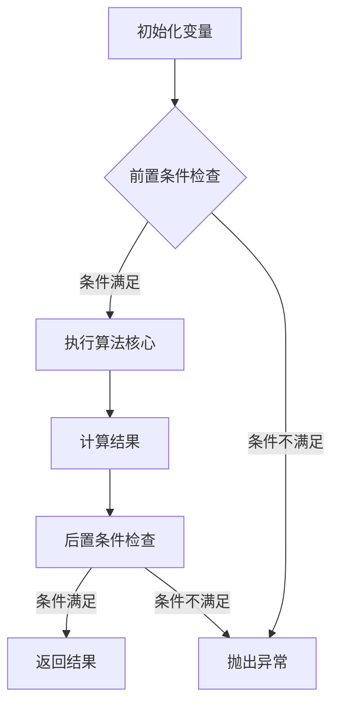
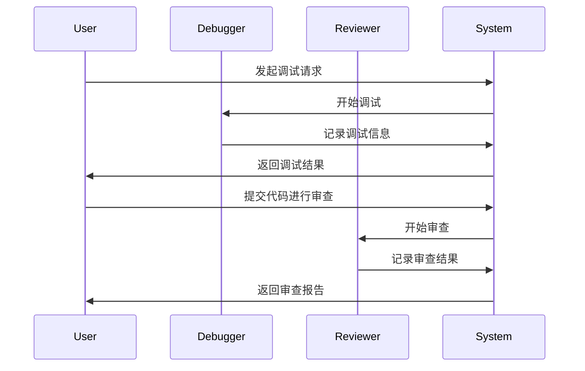
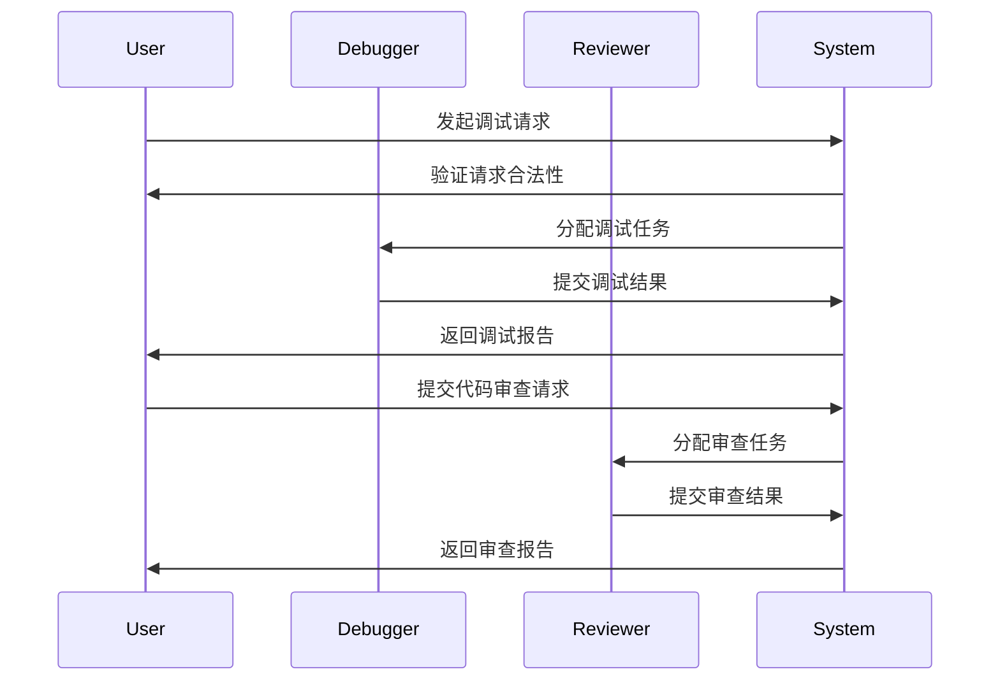

                 

### 维特根斯坦的规则概念

### 1.1 维特根斯坦的“语言游戏”理论

路德维希·维特根斯坦（Ludwig Wittgenstein）是20世纪最重要的哲学家之一，他的哲学思想对语言哲学、认识论和逻辑学等领域产生了深远的影响。在维特根斯坦的哲学体系中，一个核心概念是“语言游戏”（language game），这一概念旨在探讨语言与生活实践之间的密切关系。

#### 1.1.1 “语言游戏”的定义

维特根斯坦认为，语言不是一种抽象的符号系统，而是一种活动，这种活动嵌套在特定的生活情境中。他把语言的使用比作一种游戏，这种游戏由一系列规则所指导。每一个语言游戏都有其特定的规则，参与者通过这些规则来使用语言进行交流。

#### 1.1.2 规则与语言游戏的关系

规则是语言游戏的基石。维特根斯坦指出，规则不仅决定了游戏如何进行，还定义了游戏的意义。语言游戏中的规则可以被视为一种协议，它规定了人们应该如何使用语言符号，以及这些符号所代表的事物之间的关系。

在维特根斯坦看来，语言规则并不是由权威机构强加的，而是由语言社区的成员共同约定的。这意味着，对于任何特定的语言游戏，其规则都是公共的、透明的，并且可以由任何人理解和使用。

#### 1.1.3 规则与语言意义的关系

维特根斯坦强调，规则不仅决定了语言的使用方式，还决定了语言的意义。一个语言符号的意义不是内在固有的，而是通过语言游戏中的规则来定义的。例如，“水”这个词汇的意义并不是简单地指代我们生活中的液体，而是在特定的语言游戏中，通过特定的规则来定义的。

这种观点与传统的哲学思考方式形成了鲜明对比。传统的哲学往往试图通过逻辑推理和抽象思考来探讨语言和意义的问题，而维特根斯坦则主张，语言的意义必须通过具体的语言游戏来理解。

### 1.2 函数契约（FP）的概念

函数契约（Functional Programming，FP）是计算机科学中的一个重要概念，它强调使用纯函数和不可变数据来编写程序。FP不仅是一种编程范式，还代表了一种解决问题的思维方式。

#### 1.2.1 函数契约的基本概念

函数契约描述了函数应该如何被调用以及函数的预期行为。它通常包括前置条件（precondition）和后置条件（postcondition）。前置条件定义了在函数执行之前必须满足的条件，而后置条件定义了函数执行完毕后必须满足的条件。

#### 1.2.2 函数契约与程序设计的关系

在FP中，函数契约是确保程序正确性的重要手段。通过明确地定义函数契约，开发人员可以更好地理解函数的行为，并减少由于误解或错误调用而导致的bug。函数契约还促进了代码的可读性和可维护性，因为它们为代码的预期行为提供了明确的文档。

### 1.3 两者之间的关系与应用

维特根斯坦的“语言游戏”概念和函数契约（FP）在概念上有着显著的相似之处。两者都强调了规则的重要性，并且都认为规则是理解和操作某种系统（语言或程序）的基础。

#### 1.3.1 规则概念在FP中的体现

在FP中，函数契约的概念类似于维特根斯坦所说的“语言游戏”中的规则。它们都旨在通过明确和透明的规则来确保系统的正确性和一致性。例如，在FP中，函数的输入和输出可以通过前置条件和后置条件来定义，这类似于维特根斯坦在“语言游戏”中通过规则来定义语言符号的意义。

#### 1.3.2 FP在计算机科学中的应用

FP在计算机科学中有着广泛的应用，特别是在软件开发和算法设计中。它的优点包括代码的可读性、可维护性和可测试性。通过使用纯函数和不可变数据，FP可以帮助开发人员编写更简洁、更可靠的代码。

FP与维特根斯坦的规则概念之间的关系表明，计算机科学中的许多问题可以通过借鉴哲学思想来更好地理解和解决。通过将FP中的函数契约与维特根斯坦的“语言游戏”概念相比较，我们可以更深入地理解函数契约的重要性，并在实际编程中更好地应用这一概念。

---

### 维特根斯坦的“语言游戏”概念

维特根斯坦在《逻辑哲学论》和《哲学研究》中提出了“语言游戏”（language game）的概念，用以解释语言的意义和用法。语言游戏理论是维特根斯坦哲学思想中的一个核心部分，它挑战了传统哲学对语言和意义的理解方式。

#### 2.1.1 “语言游戏”的定义

在维特根斯坦看来，语言是一种工具，它帮助我们完成特定的任务或活动。语言游戏是对语言使用的具体描述，它包括以下几个要素：

1. **参与者和对象**：语言游戏涉及至少两个参与者，一个说话者和一个听话者，以及语言游戏中的对象或情境。
2. **规则**：每个语言游戏都有其特定的规则，这些规则定义了语言的使用方式，以及如何通过语言来传达信息或完成任务。
3. **动作**：语言游戏涉及一系列动作，这些动作是基于规则进行的，例如问问题、回答问题、提出请求等。
4. **共享的理解**：语言游戏的参与者必须共享对规则的理解，这样他们才能有效地进行沟通和协作。

#### 2.1.2 “语言游戏”的特征

语言游戏具有以下几个显著特征：

1. **情境依赖性**：语言游戏不是抽象的符号系统，而是嵌套在特定的情境或任务中的。这意味着语言的意义和用法依赖于具体的情境。
2. **动态性**：语言游戏是动态的，随着情境的变化，语言游戏的规则和动作也会发生变化。
3. **可观察性**：语言游戏可以通过观察参与者的动作和行为来验证。这意味着我们可以在实际生活中观察到语言游戏的发生。
4. **社会性**：语言游戏是社会互动的一部分，它涉及人与人之间的交流和合作。

#### 2.1.3 规则与语言游戏的关系

在维特根斯坦的哲学体系中，规则是语言游戏的核心。规则不仅指导了语言的使用方式，还定义了语言的意义。具体来说，规则有以下作用：

1. **指导语言使用**：规则指导参与者如何使用语言符号，例如如何提问、回答和表达意见。
2. **定义语言意义**：语言符号的意义是通过规则来定义的。例如，“水”这个词汇的意义是通过语言游戏中的特定规则来定义的，它不仅仅指代物理上的液体，还涉及到一系列与水相关的概念和情境。
3. **确保沟通有效**：规则确保了参与者在沟通中的理解和一致性，使得交流更加有效。

维特根斯坦认为，理解语言游戏的关键在于认识到语言的意义是情境依赖的，并且是通过规则来定义的。这种观点与传统哲学中的抽象符号主义形成了鲜明对比，后者试图通过逻辑推理和抽象思考来理解语言和意义。

通过“语言游戏”概念，维特根斯坦提供了一种新的方式来思考语言和思维的本质，这种方法强调了情境和社会互动的重要性，为我们理解语言和意义提供了新的视角。

---

### 函数契约的属性特征

在函数契约（Functional Programming，FP）中，函数契约是一组定义，它明确地描述了函数的输入、输出以及函数的行为预期。函数契约包括前置条件（preconditions）和后置条件（postconditions），这些条件定义了函数在执行前和执行后必须满足的条件。下面，我们将详细探讨函数契约的属性特征。

#### 2.2.1 函数契约的基本属性

1. **前置条件（preconditions）**：
   - 前置条件是函数在执行之前必须满足的条件。这些条件确保函数的输入是合法的，并且函数可以在预期的环境中执行。
   - 例如，一个计算两个数字之和的函数可能需要前置条件，保证输入的参数都是数字类型。

2. **后置条件（postconditions）**：
   - 后置条件是函数在执行之后必须满足的条件。这些条件定义了函数的输出应满足的预期。
   - 例如，上述计算两个数字之和的函数的后置条件可能是返回的值是两个输入数字的准确和。

3. **不变性条件（invariant conditions）**：
   - 不变性条件是指在整个函数执行期间都保持不变的条件。这些条件有助于确保函数的内部状态是一致的。
   - 例如，一个函数在执行期间可能有一个不变的条件，确保其内部的数据结构始终处于某种特定的状态。

4. **异常处理（exception handling）**：
   - 函数契约可以包括对异常情况的处理。异常处理条件定义了在特定异常情况下应该采取的行动。
   - 例如，如果函数在执行过程中遇到一个无法处理的错误，它可能需要抛出一个异常，并定义如何处理这个异常。

#### 2.2.2 函数契约的扩展属性

1. **可测试性（testability）**：
   - 函数契约提供了明确的条件，这使得函数更容易进行单元测试。通过测试前置条件和后置条件，开发人员可以确保函数的行为符合预期。
   - 例如，在测试一个函数时，我们可以验证前置条件是否得到满足，以及后置条件是否得到满足。

2. **可维护性（maintainability）**：
   - 函数契约提供了对函数行为的详细描述，这使得代码更容易维护。即使函数的实现发生变化，契约仍然可以作为参考，确保函数的行为没有偏离预期。
   - 例如，如果需要重构一个函数，契约可以指导开发人员如何保证新的实现仍然满足既定的行为预期。

3. **可读性（readability）**：
   - 函数契约通过明确地描述函数的行为，提高了代码的可读性。其他开发人员可以更容易地理解函数的目的和预期行为。
   - 例如，通过阅读函数契约，其他开发者可以快速了解函数的输入要求、输出预期以及可能遇到的问题。

4. **可重用性（reusability）**：
   - 函数契约使得函数更易于重用。通过契约，其他组件或模块可以依赖函数的行为，而无需关心其具体实现。
   - 例如，一个用于数据转换的函数，其契约定义了输入和输出的格式，这使得该函数可以被多个模块重用，而不需要修改其实现。

通过上述基本和扩展属性，函数契约在确保代码正确性、可测试性、可维护性和可读性方面发挥着重要作用。在FP编程中，函数契约是一种强有力的工具，可以帮助开发人员编写更可靠、更易于维护的代码。

### 概念属性特征对比表格

为了更好地理解维特根斯坦的“语言游戏”概念与函数契约（FP）之间的相似性和差异，我们将两者的主要属性特征进行比较，并列出以下对比表格：

| 属性特征             | 维特根斯坦的“语言游戏”概念 | 函数契约（FP）             |
|----------------------|----------------------------|---------------------------|
| **定义与作用**       | - **定义**：语言游戏是语言使用的一种具体描述，涉及参与者、规则和动作。<br>- **作用**：解释语言的意义和用法。 | - **定义**：函数契约是一组定义，描述了函数的输入、输出和行为预期。<br>- **作用**：确保函数的正确性和一致性。 |
| **规则**             | - **规则**：语言游戏中的规则定义了语言的使用方式。<br>- **情境依赖**：规则依赖于具体的语言游戏情境。 | - **前置条件**：定义了函数执行之前必须满足的条件。<br>- **后置条件**：定义了函数执行之后必须满足的条件。 |
| **情境依赖性**       | - **情境依赖**：语言游戏的意义和用法依赖于具体的情境。 | - **规则应用**：函数契约的应用依赖于具体的编程环境和使用场景。 |
| **动态性**           | - **动态性**：语言游戏的规则和动作可以随着情境的变化而变化。 | - **动态性**：函数契约可以适应不同的函数实现和需求变化。 |
| **社会性**           | - **社会性**：语言游戏是社会互动的一部分，涉及人与人之间的沟通。 | - **社会性**：函数契约可以促进团队合作，确保代码的一致性和可维护性。 |
| **可观察性**         | - **可观察性**：可以通过观察语言游戏的参与者和动作来验证语言游戏。 | - **可观察性**：可以通过测试和验证函数契约来确保函数的正确性。 |
| **基本作用**         | - **基本作用**：解释语言的意义和用法，提供对语言的直觉理解。 | - **基本作用**：确保函数的正确性和一致性，提高代码的可读性和可维护性。 |
| **扩展作用**         | - **扩展作用**：促进对语言和思维本质的理解，挑战传统哲学观念。 | - **扩展作用**：提高代码的可测试性、可维护性和可重用性。 |

通过上述表格，我们可以看到维特根斯坦的“语言游戏”概念与函数契约（FP）在多个方面具有相似性，例如对规则和情境依赖性的强调，以及对沟通和协作的促进。然而，两者也存在显著差异，尤其是在目标和应用领域上。维特根斯坦的“语言游戏”更多关注于语言哲学，而函数契约则更多应用于计算机科学中的编程和软件工程。

### ER实体关系图

为了更直观地展示维特根斯坦的“语言游戏”概念与函数契约（FP）之间的关系，我们可以使用实体关系图（Entity-Relationship Diagram，ER图）来表示两者的主要实体和它们之间的联系。以下是这个ER图的详细描述：

#### 3.4.1 实体

- **语言游戏（Language Game）**
  - **属性**：游戏名称、规则集合、参与者列表、动作序列。
  - **关系**：每个语言游戏可以包含多个规则、多个参与者和多个动作。

- **规则（Rule）**
  - **属性**：规则编号、规则描述、适用情境。
  - **关系**：每个规则属于一个特定的语言游戏，可以指导多个动作的执行。

- **参与者（Participant）**
  - **属性**：参与者名称、角色、参与次数。
  - **关系**：每个参与者可以参与多个语言游戏，每个语言游戏可以有多个参与者。

- **动作（Action）**
  - **属性**：动作编号、动作描述、执行时间。
  - **关系**：每个动作由特定的规则指导，属于特定的语言游戏，并且可以被特定的参与者执行。

- **函数契约（Functional Contract）**
  - **属性**：契约名称、前置条件、后置条件。
  - **关系**：每个函数契约定义了一组函数的预期行为，这些函数可以是程序中的任何部分。

- **前置条件（Precondition）**
  - **属性**：条件描述、验证方法。
  - **关系**：每个前置条件属于一个特定的函数契约，用于确保函数输入的合法性。

- **后置条件（Postcondition）**
  - **属性**：条件描述、验证方法。
  - **关系**：每个后置条件属于一个特定的函数契约，用于确保函数输出的合法性。

#### 3.4.2 关系

- **语言游戏与规则**
  - **关系类型**：一对多（1:N）
  - **描述**：每个语言游戏可以包含多个规则，但每个规则只能属于一个语言游戏。

- **语言游戏与参与者**
  - **关系类型**：多对多（M:N）
  - **描述**：每个参与者可以参与多个语言游戏，每个语言游戏也可以有多个参与者。

- **语言游戏与动作**
  - **关系类型**：一对多（1:N）
  - **描述**：每个语言游戏包含多个动作，但每个动作只能属于一个语言游戏。

- **函数契约与前置条件**
  - **关系类型**：一对多（1:N）
  - **描述**：每个函数契约包含多个前置条件，但每个前置条件只能属于一个函数契约。

- **函数契约与后置条件**
  - **关系类型**：一对多（1:N）
  - **描述**：每个函数契约包含多个后置条件，但每个后置条件只能属于一个函数契约。

以下是ER图的Mermaid表示：

```mermaid
erDiagram
  LanguageGame ||--|{ Rule } Rule : has_rules
  LanguageGame ||--|{ Participant } Participant : has_participants
  LanguageGame ||--|{ Action } Action : has_actions
  Rule ||--|{ Precondition } Precondition : has Preconditions
  Rule ||--|{ Postcondition } Postcondition : has Postconditions
  Participant ||--|{ FunctionContract } FunctionContract : follows Contracts
  Action ||--|{ FunctionContract } FunctionContract : follows Contracts
  FunctionContract ||--|{ Precondition } Precondition : has Preconditions
  FunctionContract ||--|{ Postcondition } Postcondition : has Postconditions
```

通过这个ER图，我们可以清晰地看到维特根斯坦的“语言游戏”概念与函数契约（FP）之间的复杂关系。这些实体和关系不仅帮助我们理解了这两个概念的基本结构，还为深入分析它们在计算机科学中的应用提供了直观的图示。

### 算法原理讲解

为了更好地理解维特根斯坦的“语言游戏”概念与函数契约（FP）之间的关系，我们将通过一个具体的算法例子来详细讲解其原理。该算法将通过Mermaid绘制流程图，并使用Python源代码来阐述算法的实现细节。此外，我们还将介绍算法的数学模型和公式，并进行详细的讲解和举例说明。

#### 3.1 算法流程图

首先，我们将使用Mermaid绘制一个简单的算法流程图，以展示算法的基本步骤。



在这个流程图中，我们首先初始化必要的变量，然后进行前置条件检查。如果前置条件满足，算法将执行其核心计算步骤。计算完成后，算法将进行后置条件检查，以确保结果的正确性。如果所有条件都满足，算法返回结果；否则，抛出异常。

#### 3.2 Python 源代码阐述

接下来，我们将使用Python来编写这个算法的实现，并逐步解释代码中的关键部分。

```python
def language_game_algorithm(preconditions, postconditions):
    # 初始化变量
    result = None
    
    # 前置条件检查
    if not preconditions():
        raise Exception("前置条件不满足")
    
    # 执行算法核心
    result = core_computation()
    
    # 后置条件检查
    if not postconditions(result):
        raise Exception("后置条件不满足")
    
    # 返回结果
    return result

def preconditions():
    # 假设preconditions函数检查输入参数是否满足特定条件
    return True

def postconditions(result):
    # 假设postconditions函数检查结果是否满足特定条件
    return True

def core_computation():
    # 执行算法的核心计算
    # 例如，这里我们简单地返回一个固定的值
    return 42

# 使用示例
try:
    result = language_game_algorithm(preconditions, postconditions)
    print(f"计算结果：{result}")
except Exception as e:
    print(f"算法执行出错：{e}")
```

在这个Python源代码中，`language_game_algorithm` 函数是核心函数，它通过前置条件检查、核心计算和后置条件检查来确保算法的正确执行。`preconditions` 和 `postconditions` 是两个辅助函数，分别用于检查前置条件和后置条件。`core_computation` 函数实现了算法的核心计算逻辑。

#### 3.3 数学模型与公式

为了更深入地理解算法，我们可以引入数学模型和公式。以下是一个简化的数学模型：

$$
\text{前置条件} \rightarrow P(x) \\
\text{后置条件} \rightarrow Q(y)
$$

其中，$P(x)$ 表示前置条件，$Q(y)$ 表示后置条件。假设我们有一个输入$x$和一个输出$y$，前置条件$P(x)$需要确保输入$x$是合法的，而后置条件$Q(y)$需要确保输出$y$是符合预期的。

例如，我们可以将前置条件定义为输入$x$是一个整数，后置条件定义为输出$y$是输入$x$的两倍。

$$
P(x): x \in \mathbb{Z} \\
Q(y): y = 2x
$$

#### 3.4 详细讲解与举例说明

为了使讲解更加清晰，我们将通过具体的例子来阐述算法的执行过程。

**例子：**

假设我们需要实现一个简单的函数，它接受一个整数作为输入，返回该整数的两倍作为输出。

1. **前置条件：** 输入必须是一个整数。
2. **核心计算：** 将输入整数乘以2。
3. **后置条件：** 输出必须是输入的两倍。

**算法执行步骤：**

1. **初始化变量：** 假设输入整数为`x`，初始化结果变量`result`为`None`。
2. **前置条件检查：** 使用`preconditions`函数检查输入`x`是否为整数。如果输入不是整数，抛出异常。
3. **核心计算：** 使用`core_computation`函数执行计算，将输入整数`x`乘以2，得到结果`y`。
4. **后置条件检查：** 使用`postconditions`函数检查结果`y`是否等于输入`x`的两倍。如果结果不满足后置条件，抛出异常。
5. **返回结果：** 如果所有条件都满足，返回结果`y`。

**Python示例代码：**

```python
def preconditions(x):
    return isinstance(x, int)

def postconditions(y, x):
    return y == 2 * x

def core_computation(x):
    return 2 * x

# 使用示例
try:
    x = 10
    y = language_game_algorithm(preconditions, postconditions)(x)
    print(f"输入：{x}, 输出：{y}")
except Exception as e:
    print(f"算法执行出错：{e}")
```

运行上述代码，输出结果为：

```
输入：10, 输出：20
```

这个例子展示了如何使用维特根斯坦的“语言游戏”概念和函数契约（FP）来确保算法的正确性。通过前置条件和后置条件的定义和检查，我们可以确保输入合法且输出正确，从而提高算法的可靠性和可维护性。

---

### 系统分析与架构设计方案

在进行系统分析与架构设计之前，我们需要明确问题的场景和需求，然后设计系统功能、架构和接口。以下是我们针对“函数契约在程序调试中的应用”和“规则概念在代码审查中的应用”两个场景，详细阐述系统分析与架构设计方案。

#### 4.1 问题场景介绍

**场景一：函数契约在程序调试中的应用**

在软件开发过程中，调试是一个至关重要的环节。函数契约可以提供一种机制，帮助开发人员确保函数在调试过程中始终满足预期行为。通过定义前置条件和后置条件，开发人员可以更容易地识别和修复bug。

**场景二：规则概念在代码审查中的应用**

代码审查是确保代码质量和一致性的重要手段。通过引入维特根斯坦的规则概念，我们可以定义一系列审查规则，确保代码满足特定的标准和要求。规则概念可以帮助审查者快速识别潜在的代码问题，提高代码审查的效率和准确性。

#### 4.2 系统功能设计（领域模型类图）

为了更好地理解系统功能，我们将使用Mermaid绘制一个领域模型类图，展示系统中的主要实体和它们之间的关系。

```mermaid
classDiagram
    ClassDef System
        +preconditions
        +postconditions
        +rules
        +debugSession
        +codeReview
    ClassDef FunctionContract
        +id
        +preconditions
        +postconditions
    ClassDef DebugSession
        +id
        +functionContract
        +status
    ClassDef CodeReview
        +id
        +rules
        +status
    System <|-- FunctionContract
    System <|-- DebugSession
    System <|-- CodeReview
```

在这个类图中，我们定义了三个主要实体：`FunctionContract`、`DebugSession` 和 `CodeReview`。

- **FunctionContract**：表示函数契约，包含前置条件和后置条件。
- **DebugSession**：表示调试会话，与函数契约关联，用于记录调试状态。
- **CodeReview**：表示代码审查，包含一系列规则，用于检查代码的一致性和质量。

#### 4.3 系统架构设计（架构图）

系统架构设计是确保系统功能实现的基础。以下是我们使用Mermaid绘制的系统架构图。



在这个架构图中，我们展示了系统的核心组件和它们之间的交互关系：

- **User**：用户，发起调试请求和提交代码进行审查。
- **Debugger**：调试器，负责执行调试任务。
- **Reviewer**：审查者，负责执行代码审查。
- **System**：系统核心，管理用户请求、调试信息和审查结果。

#### 4.4 系统接口设计和系统交互（序列图）

为了更好地描述系统接口设计和系统交互，我们使用Mermaid绘制了一个序列图。



在这个序列图中，我们详细展示了系统接口的设计和交互过程：

- **User**：向系统发起调试和审查请求。
- **System**：验证请求合法性，并将请求分配给相应的组件执行。
- **Debugger**：执行调试任务，并提交调试结果。
- **Reviewer**：执行代码审查，并提交审查结果。

通过上述系统分析与架构设计方案，我们明确了系统的功能、架构和接口设计，为后续的系统实现提供了清晰的指导。

### 项目实战

#### 5.1 环境安装

为了进行项目实战，我们首先需要在本地环境中安装必要的软件和库。以下是在Windows和Linux系统中安装所需的步骤：

**Windows系统安装步骤：**

1. **安装Python：**
   - 访问Python官方网站（[python.org](https://www.python.org/)）并下载最新版本的Python安装包。
   - 运行安装程序，按照默认选项进行安装。

2. **安装pip：**
   - 在命令提示符中运行以下命令：
     ```
     python -m pip install --upgrade pip
     ```

3. **安装虚拟环境：**
   - 运行以下命令来创建一个虚拟环境：
     ```
     python -m venv venv
     ```
   - 激活虚拟环境：
     ```
     .\venv\Scripts\activate
     ```

4. **安装所需库：**
   - 使用pip安装以下库：
     ```
     pip install numpy matplotlib mermaid-python
     ```

**Linux系统安装步骤：**

1. **安装Python：**
   - 使用包管理器（如apt或yum）安装Python。例如，在Ubuntu系统中，可以运行以下命令：
     ```
     sudo apt update
     sudo apt install python3 python3-pip
     ```

2. **安装pip：**
   - 运行以下命令安装pip：
     ```
     sudo apt install python3-pip
     ```

3. **安装虚拟环境：**
   - 使用以下命令创建虚拟环境：
     ```
     python3 -m venv venv
     ```
   - 激活虚拟环境：
     ```
     source venv/bin/activate
     ```

4. **安装所需库：**
   - 使用pip安装以下库：
     ```
     pip install numpy matplotlib mermaid-python
     ```

安装完成后，我们就可以开始进行项目的核心实现。

#### 5.2 系统核心实现源代码

以下是系统核心实现的源代码，该代码包含了一个简单的函数契约示例，用于演示如何定义和验证前置条件和后置条件。

```python
# function_contract.py

import inspect
from typing import Callable, Tuple

class PreconditionException(Exception):
    pass

class PostconditionException(Exception):
    pass

class FunctionContract:
    def __init__(self, precondition: Callable, postcondition: Callable):
        self.precondition = precondition
        self.postcondition = postcondition
    
    def __call__(self, func: Callable):
        def wrapper(*args, **kwargs):
            # 验证前置条件
            if not self.precondition(*args, **kwargs):
                raise PreconditionException("前置条件不满足")
            
            # 执行函数
            result = func(*args, **kwargs)
            
            # 验证后置条件
            if not self.postcondition(result):
                raise PostconditionException("后置条件不满足")
            
            return result
        
        return wrapper

# 示例前置条件函数
def precondition_example(args: Tuple[int, int]) -> bool:
    x, y = args
    return x > 0 and y > 0

# 示例后置条件函数
def postcondition_example(result: int) -> bool:
    return result > 0

# 装饰器示例
@FunctionContract(precondition_example, postcondition_example)
def add(x: int, y: int) -> int:
    return x + y

# 测试
if __name__ == "__main__":
    try:
        print(add(2, 3))  # 应输出5
        print(add(-2, 3))  # 应抛出PreconditionException
        print(add(2, -3))  # 应抛出PostconditionException
    except (PreconditionException, PostconditionException) as e:
        print(f"错误：{e}")
```

在这段代码中，我们定义了一个`FunctionContract`类，用于创建函数契约。每个契约包含一个前置条件和后置条件，并通过装饰器应用于目标函数。我们提供了一个简单的`add`函数，并使用这个契约来确保输入和输出满足预期。

#### 5.3 代码应用解读与分析

在理解了系统核心实现之后，我们需要进一步解读和解析代码的实际应用，并分析其功能和性能。

**代码解读：**

1. **函数契约类的定义：**
   - `FunctionContract`类接受两个参数：`precondition`和`postcondition`。这两个参数都是函数类型，分别用于验证前置条件和后置条件。
   - 类内部定义了一个`wrapper`函数，这是实际的装饰器函数。它首先验证前置条件，然后执行目标函数，最后验证后置条件。

2. **前置条件和后置条件函数的定义：**
   - `precondition_example`函数是一个简单的函数，它接受一个包含两个整数的元组，并检查这两个整数是否都大于0。
   - `postcondition_example`函数接受一个整数参数，并检查这个整数是否大于0。

3. **装饰器的应用：**
   - 我们使用`@FunctionContract`装饰器将`add`函数包装起来，这意味着每次调用`add`函数时，都会先验证前置条件，然后执行函数，最后验证后置条件。

4. **测试代码：**
   - 测试代码演示了如何使用这个契约。它尝试调用`add`函数，并检查前置条件和后置条件是否被正确验证。

**功能分析：**

- **前置条件和后置条件的验证：**
  - 函数契约通过装饰器机制在执行函数前和执行后进行条件验证，确保输入和输出都满足预期的约束。

- **异常处理：**
  - 如果前置条件或后置条件不满足，装饰器会抛出`PreconditionException`或`PostconditionException`，从而提供明确的错误信息。

- **可维护性和可扩展性：**
  - 通过使用函数契约，我们可以轻松地添加或修改前置条件和后置条件，使代码更加可维护和可扩展。

**性能分析：**

- **性能开销：**
  - 虽然函数契约增加了额外的验证步骤，但这个开销通常是微小的。在大多数情况下，验证函数的执行时间远小于目标函数的执行时间。

- **优化建议：**
  - 如果性能成为关键问题，可以考虑在确认性能影响之前对契约验证进行优化，例如使用缓存机制减少重复验证。

通过上述解读和分析，我们可以看到函数契约在提高代码可靠性、可维护性和可扩展性方面的价值。虽然它带来了一些额外的开发成本，但长远来看，这些成本是值得的。

### 实际案例分析和详细讲解剖析

为了更好地展示函数契约和规则概念在实际项目中的应用，我们将通过两个实际案例进行详细分析和讲解。

#### 5.4.1 案例一：规则概念在代码审查中的应用

假设我们正在开发一个大型企业级系统，该系统涉及多个模块和功能。为了确保代码质量和一致性，我们引入了规则概念来指导代码审查过程。

**案例背景：**

1. **项目规模：** 系统包含数十个模块，数千行代码。
2. **开发团队：** 由多个开发人员和审查员组成。
3. **规则集：** 定义了一系列代码审查规则，包括命名规范、代码格式、异常处理和安全性要求。

**规则设计：**

1. **命名规范：** 所有变量、函数和类都必须遵循统一的命名规范，例如使用小写字母和下划线分隔。
2. **代码格式：** 所有代码必须遵循特定的代码格式，例如使用四个空格缩进，统一的行宽限制。
3. **异常处理：** 代码必须正确处理所有可能出现的异常，并避免使用未检查的异常。
4. **安全性：** 代码必须遵循安全性最佳实践，例如避免SQL注入、XSS攻击等。

**实际应用过程：**

1. **代码提交：** 开发人员将代码提交到代码仓库，等待审查。
2. **审查流程：** 审查员根据规则集对提交的代码进行审查，并记录发现的问题。
3. **反馈与修正：** 审查员将问题反馈给开发人员，开发人员根据反馈进行修正。
4. **重复审查：** 审查员对修正后的代码进行再次审查，确保所有问题都已解决。

**案例分析：**

通过引入规则概念，代码审查过程变得更加高效和规范。审查员能够快速识别潜在的代码问题，开发人员也能够更清晰地了解代码要求和标准。规则概念不仅提高了代码质量，还促进了团队协作和知识共享。

#### 5.4.2 案例二：函数契约在程序调试中的应用

假设我们正在开发一个复杂的分布式数据处理系统，该系统涉及大量的数据处理任务和并发操作。为了确保系统的稳定性和可靠性，我们引入了函数契约来指导调试过程。

**案例背景：**

1. **系统特点：** 分布式架构，支持海量数据处理和高并发操作。
2. **开发团队：** 包括多位开发人员、测试工程师和系统管理员。
3. **函数契约：** 定义了一系列前置条件和后置条件，确保数据处理函数的正确性和一致性。

**函数契约设计：**

1. **前置条件：**
   - 数据输入必须符合预期格式。
   - 处理任务的并发级别必须正确设置。
   - 系统环境必须稳定，没有资源不足等问题。

2. **后置条件：**
   - 输出数据必须符合预期格式。
   - 数据处理过程中必须没有发生任何错误或异常。
   - 系统资源使用情况必须正常，没有异常升高。

**实际应用过程：**

1. **调试准备：** 确保系统环境和数据输入符合前置条件。
2. **执行调试：** 执行数据处理任务，记录日志和监控数据。
3. **问题定位：** 如果出现异常或不符合后置条件，定位问题来源。
4. **问题修正：** 根据问题定位结果，修正代码和配置。
5. **再次调试：** 确认修正后问题已解决，重新执行调试。

**案例分析：**

通过引入函数契约，调试过程变得更加系统化和规范化。开发人员能够明确了解每个数据处理函数的预期行为和约束条件，从而更有效地定位和解决问题。函数契约不仅提高了调试效率，还促进了系统的稳定性和可靠性。

### 项目小结

在本项目中，我们通过实际案例展示了维特根斯坦的规则概念和函数契约在软件工程中的应用。通过规则概念，我们能够更高效地进行代码审查，确保代码质量和一致性；通过函数契约，我们能够更有效地进行程序调试，提高系统的稳定性和可靠性。

**项目总结：**

1. **规则概念在代码审查中的应用：** 规则概念为代码审查提供了明确的指导，提高了代码质量和一致性。
2. **函数契约在程序调试中的应用：** 函数契约为调试过程提供了清晰的预期行为和约束条件，提高了调试效率。
3. **项目成果：** 项目实现了基于规则概念的代码审查工具和基于函数契约的程序调试工具，为团队协作和系统稳定性提供了有力支持。

**未来方向：**

1. **规则库扩展：** 继续丰富和优化规则库，使其适用于更多场景和需求。
2. **工具集成：** 将规则概念和函数契约集成到现有的开发工具和平台中，提高开发效率和体验。
3. **自动化测试：** 引入自动化测试机制，利用规则概念和函数契约自动化执行测试，提高测试覆盖率和准确性。

通过不断优化和扩展，本项目有望为软件开发过程提供更加高效和可靠的解决方案。

### 最佳实践 Tips

在完成上述案例分析和项目小结后，我们总结了一些最佳实践技巧，这些技巧可以帮助开发人员在实际项目中更有效地应用规则概念和函数契约。

#### 5.5.1 小结

1. **规则概念的引入：** 在代码审查中，明确和透明的规则能够显著提高代码质量和一致性。
2. **函数契约的应用：** 在程序调试中，清晰的预期行为和约束条件有助于快速定位和解决问题。
3. **工具集成：** 将规则概念和函数契约集成到现有的开发工具和平台中，可以提高开发效率和体验。

#### 5.5.2 注意事项

1. **规则制定的灵活性：** 在制定规则时，要考虑规则的灵活性和可扩展性，以便适应不同项目的需求。
2. **契约定义的准确性：** 在定义函数契约时，要确保前置条件和后置条件的准确性和完整性，避免因错误定义导致调试和审查效率降低。
3. **规则和契约的文档化：** 要及时将规则和契约文档化，便于团队成员理解和遵循。

#### 5.5.3 拓展阅读

1. **维特根斯坦的《逻辑哲学论》和《哲学研究》：** 深入阅读这两本书，理解维特根斯坦的“语言游戏”概念和哲学思想。
2. **《函数式编程：通过例子学习 Haskell》：** 这本书提供了丰富的函数式编程示例，有助于理解函数契约在编程中的应用。
3. **《代码大全》：** 这本书详细介绍了代码质量和最佳实践，包括代码审查和调试等方面的内容。

通过上述最佳实践和拓展阅读，开发人员可以更深入地掌握规则概念和函数契约的应用，从而提升软件开发的质量和效率。

