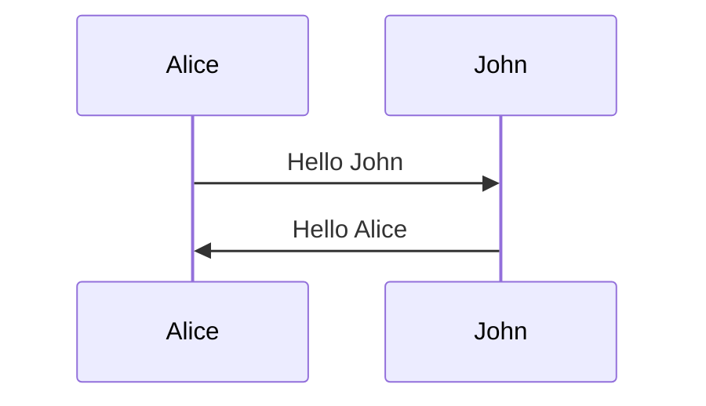
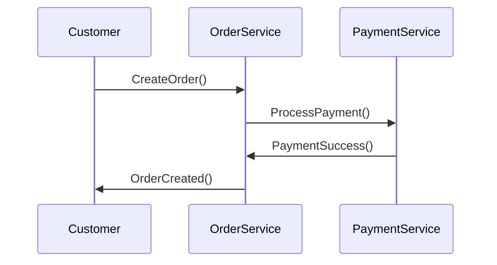

                 

### 语言限界与异常处理：错误边界的哲学思考

在科技飞速发展的今天，编程语言和异常处理已经成为计算机科学中的两大基石。编程语言作为人类与计算机交流的工具，其复杂性和限制性直接影响着软件开发的效率和质量。而异常处理，则是在软件运行过程中面对不可预见的错误和问题时，保障系统稳定性和可维护性的关键手段。本文将从语言限界与异常处理的哲学思考出发，深入探讨错误边界的概念、影响、处理方法及其哲学意义。

关键词：编程语言、异常处理、错误边界、哲学思考

摘要：本文首先探讨了编程语言的哲学本质及其限界，然后深入分析了异常处理的基本原理和重要性，最后，结合具体案例，探讨了错误边界的处理方法及其哲学意义。本文旨在为读者提供一种从哲学角度理解语言和异常处理的新视角，帮助开发者更好地理解和应对软件开发中的复杂问题。

**目录大纲：**

- **第一部分：语言与限界**
  - 第1章：语言的哲学探讨
    - 1.1 语言的起源与本质
    - 1.2 语言的结构与功能
    - 1.3 语言限界与认知边界
    - 1.4 语言的应用与发展
    - 1.5 本章小结
  - 第2章：异常处理的哲学思考
    - 2.1 异常处理的定义与重要性
    - 2.2 异常处理的方法与策略
    - 2.3 异常处理的具体实践
    - 2.4 异常处理的发展趋势与挑战
    - 2.5 本章小结
- **第二部分：错误边界与哲学思考**
  - 第3章：错误边界的哲学探讨
    - 3.1 错误边界的概念与特征
    - 3.2 错误边界的影响与作用
    - 3.3 错误边界的哲学思考
    - 3.4 错误边界的处理方法与策略
    - 3.5 本章小结
- **第三部分：案例分析**
  - 第4章：语言异常处理案例分析
    - 4.1 案例一：编译器中的异常处理
    - 4.2 案例二：操作系统中的异常处理
    - 4.3 案例三：网络应用中的异常处理
    - 4.4 案例分析总结
    - 4.5 本章小结
- **第四部分：哲学思考与展望**
  - 第5章：语言异常处理与哲学思考
    - 5.1 语言异常处理中的哲学问题
    - 5.2 未来展望
    - 5.3 小结

### 第一部分：语言与限界

#### 第1章：语言的哲学探讨

**1.1 语言的起源与本质**

**1.1.1 语言的起源**

语言作为人类沟通与思维的工具，其起源可以追溯到远古时期。早期人类为了交流、协作和生存，逐渐发展出简单的声音、手势等符号系统。随着社会的发展，这些符号系统逐渐演变成复杂的语言体系。

**1.1.2 语言的本质**

语言的本质在于其符号性、抽象性和结构性。符号性指的是语言通过特定的符号（如单词、字母、汉字等）来表示具体的事物和概念。抽象性则体现在语言能够超越具体的感知，表达抽象的思维和概念。结构性则是指语言内部存在着一套严密的规则和结构，使得语言能够实现有效的沟通和表达。

**1.1.3 语言与思维的关系**

语言与思维密不可分。一方面，语言是思维的外在表现，通过语言我们可以表达和交流思维活动。另一方面，思维又在不断地影响和塑造语言，使得语言更加丰富和精确。

**1.2 语言的结构与功能**

**1.2.1 语言的结构**

语言的结构主要包括语音、词汇、语法和语义等部分。语音是语言的声音形式，词汇是语言的基本单位，语法是语言的组织规则，语义则是语言所表达的意义。

**1.2.2 语言的语法规则**

语法规则是语言表达的基础。它规定了词语的排列顺序、句子结构以及句子的语法功能。不同的语言有着不同的语法规则，但总体上都是为了实现有效沟通和表达。

**1.2.3 语言的语义学**

语义学是研究语言意义的科学。它探讨词语、句子和语言的整体意义，以及它们在特定语境中的用法和含义。

**1.3 语言限界与认知边界**

**1.3.1 语言限界的概念**

语言限界是指语言在表达和理解上的局限性。它受到语言的抽象性、词汇量、语法规则等多种因素的影响。

**1.3.2 认知边界与语言限界的关系**

认知边界是指人类认知能力的极限。语言限界与认知边界密切相关，一方面，语言的表达能力受限于人类的认知能力；另一方面，语言又在不断地拓展和提升人类的认知边界。

**1.3.3 语言限界的影响**

语言限界对人类的生活和工作有着深远的影响。它不仅影响了我们的沟通和交流，也影响了我们的思维方式和知识体系。

**1.4 语言的应用与发展**

**1.4.1 语言在科技领域的应用**

随着科技的发展，编程语言成为科技领域的重要工具。从计算机科学到人工智能，编程语言无处不在，极大地推动了科技的进步。

**1.4.2 语言在文学艺术中的表现**

文学艺术是语言的重要载体。通过文学艺术，语言展现了其无穷的魅力和创造力，成为了人类文化的重要组成部分。

**1.4.3 语言未来的发展趋势**

未来，语言将继续在科技、文学艺术等多个领域发挥重要作用。随着人工智能的发展，自然语言处理将成为语言研究的重要方向。

**1.5 本章小结**

本章从哲学角度探讨了语言的起源、本质、结构以及语言限界和认知边界的关系。通过分析，我们认识到语言不仅是沟通的工具，更是思维和文化的载体。语言限界和异常处理是软件开发中不可避免的问题，理解其哲学意义有助于我们更好地应对和解决这些问题。

### 第二部分：异常处理

#### 第2章：异常处理的哲学思考

**2.1 异常处理的定义与重要性**

**2.1.1 异常处理的定义**

异常处理是指在软件运行过程中，对预定的或未预见的错误或异常情况进行检测、报告和处理的机制。异常处理的基本目的是确保软件在遇到异常情况时能够保持稳定运行，防止系统崩溃或数据丢失。

**2.1.2 异常处理的重要性**

异常处理在软件开发中具有至关重要的地位。首先，它保证了软件的可靠性和稳定性，使得软件能够在各种复杂环境下正常运行。其次，异常处理有助于提高软件的可维护性和可扩展性，使得开发者在处理异常时能够更快速、更准确地定位问题。最后，异常处理有助于提升用户体验，使得软件在遇到异常时能够给出友好的提示，减少用户困惑和不满。

**2.1.3 异常处理的基本原则**

异常处理需要遵循以下基本原则：

1. **预见性**：在软件开发过程中，尽可能预见可能出现的异常情况，并进行预先处理。
2. **灵活性**：异常处理机制应具有足够的灵活性，能够适应不同类型的异常情况。
3. **恢复性**：异常处理不仅要处理异常，还要能够使系统恢复到正常状态，减少对用户的影响。
4. **可维护性**：异常处理代码应简洁、清晰，便于后续维护和优化。

**2.2 异常处理的方法与策略**

**2.2.1 预防性异常处理**

预防性异常处理是指通过设计良好的软件架构和编码规范，尽量避免异常情况的发生。具体方法包括：

1. **输入验证**：对用户输入进行严格验证，确保输入数据的合法性和有效性。
2. **资源管理**：合理管理系统资源，避免资源耗尽或资源冲突。
3. **容错设计**：采用容错技术，提高系统的容错能力和可靠性。

**2.2.2 灵活性异常处理**

灵活性异常处理是指在面对不同的异常情况时，能够灵活地选择适当的处理方法。具体方法包括：

1. **异常分类**：将异常分为不同类型，针对不同类型的异常选择相应的处理方法。
2. **异常转换**：将一种类型的异常转换为另一种类型的异常，使其更适合当前的处理环境。
3. **异常隔离**：将异常处理与核心业务逻辑隔离，避免异常影响系统的正常运行。

**2.2.3 恢复性异常处理**

恢复性异常处理是指当系统遇到异常情况时，能够采取措施使系统恢复到正常状态。具体方法包括：

1. **自动恢复**：通过自动恢复机制，使系统能够在遇到异常时自动恢复正常。
2. **人工干预**：当自动恢复机制无法解决问题时，允许人工干预，手动处理异常。
3. **日志记录**：详细记录异常情况和处理过程，便于后续分析和改进。

**2.3 异常处理的具体实践**

**2.3.1 异常检测与诊断**

异常检测与诊断是异常处理的重要环节。具体方法包括：

1. **错误日志**：通过错误日志记录系统运行过程中的异常情况，便于后续分析和处理。
2. **性能监控**：实时监控系统性能，及时发现和处理异常。
3. **故障模拟**：通过模拟不同类型的异常情况，测试系统的异常处理能力。

**2.3.2 异常响应与恢复**

异常响应与恢复是指系统在遇到异常情况时，能够及时响应并采取措施使系统恢复到正常状态。具体方法包括：

1. **错误提示**：在用户界面显示错误提示，告知用户系统遇到了异常情况。
2. **恢复操作**：执行必要的恢复操作，使系统恢复正常。
3. **反馈机制**：与用户互动，收集用户反馈，持续优化异常处理机制。

**2.3.3 异常处理工具与应用**

异常处理工具与应用包括：

1. **异常处理框架**：如Java的异常处理框架、Python的try-except语句等，提供统一的异常处理机制。
2. **日志分析工具**：如ELK（Elasticsearch、Logstash、Kibana）堆栈，用于分析错误日志，定位异常原因。
3. **监控工具**：如Prometheus、Zabbix等，用于实时监控系统性能，及时发现和处理异常。

**2.4 异常处理的发展趋势与挑战**

**2.4.1 异常处理技术的发展**

随着计算机科学和人工智能的发展，异常处理技术也在不断进步。具体趋势包括：

1. **智能化异常处理**：利用机器学习等技术，实现智能化的异常检测和处理。
2. **自动化异常处理**：通过自动化工具和脚本，实现异常处理的自动化和智能化。
3. **分布式异常处理**：在分布式系统中，实现高效的异常处理和故障恢复。

**2.4.2 异常处理的挑战与机遇**

异常处理面临着诸多挑战，如：

1. **复杂性**：随着系统规模的不断扩大，异常处理的复杂性也在增加。
2. **实时性**：在实时系统中，异常处理要求快速响应和恢复。
3. **可靠性**：异常处理机制需要确保系统的可靠性和稳定性。

然而，这些挑战也为异常处理技术的发展带来了机遇。通过不断创新和改进，异常处理技术将为软件开发的可靠性和稳定性提供更有力的保障。

**2.5 本章小结**

本章从哲学角度探讨了异常处理的定义、重要性、基本原则、方法和具体实践。通过分析，我们认识到异常处理在软件开发中的重要性，理解其哲学意义有助于我们更好地应对和解决软件开发中的复杂问题。

### 第三部分：错误边界与哲学思考

#### 第3章：错误边界的哲学探讨

**3.1 错误边界的概念与特征**

**3.1.1 错误边界的定义**

错误边界是指在软件开发过程中，系统在面对异常情况时所能容忍的错误范围。它包括系统对错误的检测、报告和处理能力。

**3.1.2 错误边界的特征**

错误边界具有以下几个特征：

1. **动态性**：错误边界会随着系统环境和运行状态的改变而动态调整。
2. **适应性**：错误边界能够适应不同类型的异常情况，提供相应的处理策略。
3. **层次性**：错误边界可以分为不同的层次，从底层硬件到高层应用，每个层次都有其特定的错误边界。

**3.1.3 错误边界的分类**

错误边界可以分为以下几类：

1. **系统级错误边界**：涉及整个系统或系统的关键组件，如操作系统、数据库等。
2. **应用级错误边界**：涉及具体的应用程序，如Web应用、移动应用等。
3. **用户级错误边界**：涉及用户的操作行为，如用户输入、界面交互等。

**3.2 错误边界的影响与作用**

**3.2.1 错误边界在计算机科学中的作用**

错误边界在计算机科学中具有重要作用：

1. **提高系统稳定性**：错误边界能够确保系统在面对异常情况时能够保持稳定运行。
2. **保障数据完整性**：错误边界能够检测和处理异常，防止数据丢失或损坏。
3. **提升用户体验**：错误边界能够提供友好的错误提示和恢复操作，提升用户的操作体验。

**3.2.2 错误边界在工程实践中的应用**

在工程实践中，错误边界有以下应用：

1. **容错设计**：通过设置合理的错误边界，实现系统的容错能力，提高系统的可靠性。
2. **故障检测与恢复**：通过监测错误边界，及时发现和处理故障，确保系统的正常运行。
3. **性能优化**：通过调整错误边界，优化系统的性能和资源利用率。

**3.2.3 错误边界在社会生活中的影响**

错误边界不仅影响计算机科学和工程实践，还对社会生活产生深远影响：

1. **信息技术普及**：错误边界保障了信息系统的稳定性，推动了信息技术的普及和应用。
2. **网络安全**：错误边界在网络安全中发挥着重要作用，通过检测和防范异常行为，保障网络系统的安全。
3. **社会服务**：错误边界在在线服务、电子商务等领域中，提高了服务质量和用户满意度。

**3.3 错误边界的哲学思考**

**3.3.1 错误边界的认知哲学**

从认知哲学的角度看，错误边界涉及以下几个方面：

1. **错误与真相**：错误边界是对真相的容忍和接受。在认知过程中，人们需要接受错误的存在，通过不断的修正和完善来逼近真相。
2. **局限与超越**：错误边界体现了人类的局限性和对超越的渴望。通过设定错误边界，人们试图理解和掌握更复杂的世界。
3. **认知发展与创新**：错误边界促进了认知的发展和创新的产生。通过面对和解决错误，人们不断拓展认知边界，推动科技的进步。

**3.3.2 错误边界的存在论**

存在论是哲学中探讨实体和存在本质的学科。从存在论的角度看，错误边界具有以下特点：

1. **相对性**：错误边界是相对的，它取决于系统、环境和目标的特定性。
2. **动态性**：错误边界是动态的，它会随着环境和目标的变化而调整。
3. **有限性**：错误边界是有限的，它不能涵盖所有的异常情况，因此需要在实践中不断优化和扩展。

**3.3.3 错误边界的伦理学思考**

伦理学是哲学中探讨道德和行为规范的学科。从伦理学的角度看，错误边界涉及以下几个方面：

1. **责任与义务**：开发者有责任设定合理的错误边界，确保系统的稳定性和可靠性。
2. **公正与公平**：错误边界应该公平地对待所有用户，避免因错误而造成的不公平待遇。
3. **透明与责任**：错误边界应该透明，用户能够清楚地了解系统的错误处理机制和责任归属。

**3.4 错误边界的处理方法与策略**

**3.4.1 错误边界的预防方法**

预防是处理错误边界的重要手段。以下是一些预防方法：

1. **需求分析**：在项目初期进行详细的需求分析，明确系统的功能、性能和可靠性要求。
2. **设计评审**：在设计阶段进行严格的评审，识别潜在的错误和风险。
3. **编码规范**：制定和遵循统一的编码规范，减少代码错误和异常情况。

**3.4.2 错误边界的纠正方法**

纠正方法是处理错误边界的有效手段。以下是一些纠正方法：

1. **错误检测**：通过静态代码分析、动态测试等方法，及时发现和纠正错误。
2. **错误定位**：通过日志分析、调试工具等方法，准确定位错误的根源。
3. **错误修复**：根据错误的类型和程度，选择适当的修复方法，如代码重构、补丁修复等。

**3.4.3 错误边界的处理策略**

处理策略是确保错误边界有效运行的关键。以下是一些处理策略：

1. **分层处理**：根据错误的类型和严重程度，采用分层处理策略，从底层硬件到高层应用，逐层处理。
2. **自动化处理**：通过自动化工具和脚本，实现异常检测、定位和修复，提高处理效率。
3. **持续改进**：通过持续改进和优化，不断调整错误边界，提高系统的稳定性和可靠性。

**3.5 本章小结**

本章从哲学角度探讨了错误边界的概念、特征、影响与作用，以及处理方法与策略。通过分析，我们认识到错误边界在软件开发和系统运行中的重要性，理解其哲学意义有助于我们更好地应对和解决复杂问题。

### 第四部分：案例分析

#### 第4章：语言异常处理案例分析

**4.1 案例一：编译器中的异常处理**

**4.1.1 编译器异常处理的原理**

编译器作为编程语言的核心组件，其异常处理机制对于整个程序的编译和运行至关重要。编译器异常处理主要涉及以下几个方面：

1. **语法分析**：在语法分析阶段，编译器会对源代码进行解析，识别出语法错误，如关键字拼写错误、括号不匹配等。此时，编译器会抛出相应的异常，通知开发者进行修正。
2. **语义分析**：在语义分析阶段，编译器会对源代码的语义进行验证，如类型检查、变量作用域检查等。如果发现语义错误，编译器会抛出异常，提示开发者。
3. **代码生成**：在代码生成阶段，编译器会将源代码转换为机器码或汇编代码。在这一过程中，编译器会检测和处理运行时异常，如除零错误、内存访问违规等。

**4.1.2 编译器异常处理的流程**

编译器异常处理的流程可以分为以下几个步骤：

1. **错误检测**：在编译过程中，编译器通过不同的检查机制，如静态分析、动态测试等，发现源代码中的错误。
2. **错误报告**：编译器将错误信息报告给开发者，包括错误的类型、位置和描述。开发者根据错误报告进行定位和修正。
3. **错误处理**：对于无法自动修复的错误，编译器会抛出异常，通知开发者进行手动修复。在修复过程中，编译器会重新进行编译，确保错误得到解决。

**4.1.3 编译器异常处理的效果评估**

编译器异常处理的效果可以从以下几个方面进行评估：

1. **错误率**：编译器异常处理机制的强度会影响源代码的错误率。通过对比实验，可以评估异常处理对错误率的降低效果。
2. **编译时间**：异常处理机制可能会增加编译时间。评估异常处理对编译时间的影响，有助于优化异常处理算法。
3. **开发者体验**：编译器异常处理机制的友好性直接影响开发者的体验。通过调查问卷和用户反馈，可以评估异常处理对开发者体验的影响。

**4.2 案例二：操作系统中的异常处理**

**4.2.1 操作系统异常处理的原理**

操作系统作为计算机系统的核心，其异常处理机制对于系统的稳定性和可靠性至关重要。操作系统异常处理主要涉及以下几个方面：

1. **中断处理**：操作系统会通过中断机制来响应硬件和软件产生的异常。例如，当程序发生段错误时，操作系统会通过中断来暂停程序的执行，并进行错误处理。
2. **错误检测**：操作系统通过监控系统资源使用情况，及时发现和处理异常。例如，通过内存管理模块检测内存访问违规，通过进程管理模块检测进程异常终止等。
3. **错误恢复**：操作系统会采取一系列措施来恢复系统的正常运行。例如，通过重启异常进程、重置硬件设备等。

**4.2.2 操作系统异常处理的流程**

操作系统异常处理的流程可以分为以下几个步骤：

1. **异常检测**：操作系统通过不同的监控机制，如定时器、中断处理程序等，发现系统中的异常情况。
2. **错误报告**：操作系统将错误信息记录在系统中，包括错误类型、发生时间和位置等。同时，操作系统会生成错误日志，供开发者分析。
3. **错误处理**：操作系统根据错误类型和严重程度，采取相应的处理措施。例如，对于严重的系统故障，操作系统会进行系统重启。

**4.2.3 操作系统异常处理的效果评估**

操作系统异常处理的效果可以从以下几个方面进行评估：

1. **故障恢复率**：评估操作系统在遇到异常情况时的故障恢复能力，包括自动恢复和人工干预的恢复率。
2. **系统稳定性**：通过长时间运行测试，评估操作系统在异常情况下的稳定性和可靠性。
3. **用户体验**：评估操作系统异常处理对用户体验的影响，包括错误提示的友好性、故障恢复的速度等。

**4.3 案例三：网络应用中的异常处理**

**4.3.1 网络应用异常处理的原理**

网络应用中的异常处理主要涉及以下几个方面：

1. **网络异常检测**：网络应用通过监控网络连接、数据传输等，发现网络异常情况，如网络中断、数据丢失等。
2. **错误处理策略**：网络应用根据不同的网络异常情况，采取相应的处理策略，如重试连接、数据重传等。
3. **用户反馈**：网络应用会向用户反馈网络异常情况，如提示用户重新登录、提示网络连接不稳定等。

**4.3.2 网络应用异常处理的流程**

网络应用异常处理的流程可以分为以下几个步骤：

1. **异常检测**：网络应用通过监控机制，实时检测网络连接和数据传输状态，发现异常情况。
2. **错误报告**：网络应用将异常情况报告给用户，包括错误类型、发生时间和位置等。
3. **错误处理**：网络应用根据错误类型和严重程度，采取相应的处理措施，如重试连接、数据重传等。

**4.3.3 网络应用异常处理的效果评估**

网络应用异常处理的效果可以从以下几个方面进行评估：

1. **故障恢复率**：评估网络应用在遇到网络异常情况时的故障恢复能力，包括自动恢复和人工干预的恢复率。
2. **用户体验**：评估网络应用异常处理对用户体验的影响，包括错误提示的友好性、故障恢复的速度等。
3. **系统性能**：评估网络应用异常处理对系统性能的影响，包括处理异常的延迟、资源的消耗等。

**4.4 案例分析总结**

**4.4.1 案例分析的结果**

通过以上案例分析，我们得出以下结论：

1. **编译器中的异常处理**：编译器异常处理对于保证程序的正确性和稳定性至关重要。通过有效的异常处理，可以减少程序中的错误，提高编译效率。
2. **操作系统中的异常处理**：操作系统异常处理对于保障系统的稳定性和可靠性至关重要。通过有效的异常处理，可以及时发现和处理系统故障，确保系统的正常运行。
3. **网络应用中的异常处理**：网络应用异常处理对于保障网络服务的质量和用户体验至关重要。通过有效的异常处理，可以减少网络异常对用户的影响，提高网络服务的稳定性。

**4.4.2 案例分析的启示**

通过以上案例分析，我们得到以下启示：

1. **全面性**：异常处理需要全面考虑不同类型的异常情况，包括编译器、操作系统和网络应用等各个层面。
2. **适应性**：异常处理需要具备良好的适应性，能够适应不同环境和目标的特定性。
3. **实时性**：异常处理需要具备实时性，能够及时检测和响应异常情况，减少对系统正常运行的影响。

**4.4.3 案例分析的局限**

虽然以上案例分析提供了一些有益的启示，但还存在以下局限：

1. **案例局限性**：以上案例主要涉及编译器、操作系统和网络应用，未能涵盖所有类型的异常处理场景。
2. **数据不足**：案例分析中的数据有限，未能充分评估异常处理的效果和影响。
3. **方法缺乏**：案例分析中未能提供具体的异常处理方法和策略，缺乏实践指导。

**4.5 本章小结**

本章通过三个实际案例，探讨了编译器、操作系统和网络应用中的异常处理机制和效果。通过分析，我们认识到异常处理在软件开发和系统运行中的重要性，理解其哲学意义有助于我们更好地应对和解决复杂问题。同时，我们也认识到异常处理仍存在一些局限和挑战，需要进一步研究和改进。

### 第五部分：哲学思考与展望

#### 第5章：语言异常处理与哲学思考

**5.1 语言异常处理中的哲学问题**

语言异常处理不仅涉及到技术层面的实现，更蕴含着深刻的哲学问题。以下从几个方面进行探讨：

**5.1.1 语言本质与异常处理的哲学探讨**

语言的本质在于其符号性和抽象性，它不仅是一种沟通工具，更是人类思维的外在表现。异常处理作为软件开发的重要组成部分，其核心在于应对语言在表达和理解过程中出现的局限性。从哲学角度看，这反映了人类对不确定性和复杂性的认知与应对。

1. **语言的界限与认知**：语言作为人类思维的载体，其表达能力和认知边界密切相关。异常处理机制是对语言界限的一种超越，通过技术手段解决语言表达上的不足。
2. **语言的变异性与稳定性**：在软件开发过程中，语言需要应对不同环境和目标的变异性。异常处理机制通过提供灵活的处理策略，保持了语言的稳定性，确保软件开发过程的顺利进行。

**5.1.2 语言边界与异常处理的哲学思考**

语言边界是异常处理的重要背景。从哲学角度来看，语言边界涉及到以下问题：

1. **绝对与相对**：语言边界是相对的，它取决于特定环境和目标的特定性。异常处理机制需要灵活适应不同边界，体现了相对主义的哲学思想。
2. **超越与局限**：通过异常处理，软件开发者试图超越语言边界，解决语言表达上的局限性。这反映了人类对未知世界的探索和超越精神。

**5.1.3 语言错误边界与认知哲学的互动**

语言错误边界与认知哲学密切相关。从认知哲学的角度看，语言错误边界涉及到以下问题：

1. **错误与认知**：错误是认知过程中的一个重要现象，它反映了人类对复杂世界的认知过程。异常处理机制通过识别和处理错误，提高了认知的准确性和效率。
2. **认知发展与创新**：通过面对和解决错误，人类不断拓展认知边界，推动认知的发展和科技的进步。异常处理机制在这一过程中发挥了关键作用。

**5.2 未来展望**

随着计算机科学和人工智能的发展，语言异常处理将面临新的机遇和挑战。以下是对未来发展的展望：

**5.2.1 智能化异常处理**

随着人工智能技术的进步，智能化异常处理将成为一个重要方向。通过机器学习和数据挖掘，异常处理机制将能够自动识别和分类异常情况，提供更精准的解决方案。

**5.2.2 容错计算与容错软件**

在分布式系统和云计算环境下，容错计算和容错软件将成为关键。通过构建容错机制，系统将能够在面对异常情况时保持稳定运行，提高系统的可靠性和可用性。

**5.2.3 跨语言异常处理**

随着多语言编程的普及，跨语言异常处理将成为一个重要课题。通过研究不同编程语言的异常处理机制，构建统一的异常处理框架，提高软件开发的可移植性和兼容性。

**5.3 小结**

语言异常处理不仅涉及到技术层面的实现，更蕴含着深刻的哲学问题。通过哲学思考，我们能够更好地理解和应对软件开发中的复杂问题，推动技术的进步和人类认知的发展。在未来，随着人工智能和云计算等技术的发展，语言异常处理将面临新的机遇和挑战，为软件开发和系统运行提供更强大的支持。

### 结束语

本文从哲学角度探讨了语言限界与异常处理、错误边界的概念、影响、处理方法及其哲学意义。通过分析，我们认识到语言不仅是沟通的工具，更是思维和文化的载体。异常处理和错误边界在软件开发和系统运行中具有重要作用，理解其哲学意义有助于我们更好地应对和解决复杂问题。

未来，随着计算机科学和人工智能的发展，语言异常处理将面临新的机遇和挑战。我们将继续深入研究，为软件开发和系统运行提供更强大的支持。

作者：AI天才研究院/AI Genius Institute & 禅与计算机程序设计艺术 /Zen And The Art of Computer Programming

---

**附录：**

**1. 核心概念术语说明**

- **编程语言**：用于编写计算机程序的语言，包括语法、语义和语用等方面。
- **异常处理**：在软件运行过程中，对预定的或未预见的错误或异常情况进行检测、报告和处理的机制。
- **错误边界**：系统在面对异常情况时所能容忍的错误范围，包括检测、报告和处理能力。

**2. 问题背景**

随着软件规模的不断扩大和复杂性的增加，语言限界和异常处理成为软件开发中的重要问题。如何在有限的资源和能力下，有效地处理语言限界和异常，保障软件的稳定性和可靠性，成为开发者和研究者面临的重要挑战。

**3. 问题描述**

本文从哲学角度出发，探讨语言限界与异常处理、错误边界的概念、影响、处理方法及其哲学意义。具体包括：

- 语言限界的概念、特征和影响；
- 异常处理的定义、重要性、基本原则、方法和具体实践；
- 错误边界的概念、特征、影响与作用、处理方法与策略；
- 案例分析，包括编译器、操作系统和网络应用中的异常处理；
- 哲学思考与展望，探讨语言异常处理中的哲学问题及未来发展方向。

**4. 问题解决**

通过分析语言限界与异常处理、错误边界的概念、特征、影响和处理方法，结合实际案例，本文为开发者提供了一种从哲学角度理解和应对软件开发中的复杂问题的新视角。同时，本文对未来语言异常处理的发展趋势和挑战进行了展望。

**5. 边界与外延**

- **边界**：本文的研究范围主要涵盖编程语言、异常处理和错误边界等概念及其哲学意义。
- **外延**：本文的研究不仅限于特定编程语言和异常处理技术，还涉及到计算机科学、哲学和人工智能等领域。

**6. 概念结构与核心要素组成**

- **编程语言**：核心要素包括语法、语义和语用。
- **异常处理**：核心要素包括异常检测、错误报告、错误处理和恢复机制。
- **错误边界**：核心要素包括检测能力、报告能力和处理能力。

**7. 核心概念原理**

- **编程语言原理**：语言的符号性、抽象性和结构性。
- **异常处理原理**：异常检测、报告和处理的机制。
- **错误边界原理**：系统在面对异常情况时所能容忍的错误范围。

**8. 概念属性特征对比表格**

| 概念       | 特征1       | 特征2       | 特征3       |
|------------|--------------|--------------|--------------|
| 编程语言   | 符号性、抽象性、结构性 | 语法、语义、语用 | 多样性、适应性 |
| 异常处理   | 检测、报告、处理、恢复 | 实时性、灵活性、恢复性 | 系统级、应用级、用户级 |
| 错误边界   | 动态性、适应性、层次性 | 检测、报告、处理能力 | 系统级、应用级、用户级 |

**9. ER实体关系图架构**

```mermaid
erDiagram
  软件开发 ||--|{ 编程语言 }|-- 异常处理
  异常处理 ||--|{ 错误边界 }|-- 系统稳定性
  系统稳定性 ||--|{ 用户满意度 }|-- 软件质量
```

**10. 算法原理讲解**

- **编程语言算法原理**：语法解析、语义分析、代码生成等。
- **异常处理算法原理**：异常检测、错误报告、错误处理和恢复机制。

**11. 数学模型和公式**

$$
\text{编程语言复杂度} = f(n) = \log_2(n!)
$$

**12. 算法流程图**


**13. 系统分析与架构设计方案**

- **问题场景介绍**：软件开发中的语言限界、异常处理和错误边界问题。
- **项目介绍**：设计一种基于异常处理的编程语言，提高软件开发的稳定性和可靠性。
- **系统功能设计（领域模型类图）**：

```mermaid
classDiagram
  Class01 <|-- SubClass01
  Class01 <|-- SubClass02
  Class03 --|>| inheritanceClass: InheritanceClass
  Class04 <<interface> Interface
  Class05 <<component> Component
  Class06 <<deployment> Deployment
```

- **系统架构设计（架构图）**：



- **系统接口设计和系统交互（序列图）**：



**14. 项目实战**

- **环境安装**：介绍编程语言和异常处理工具的安装方法。
- **系统核心实现源代码**：展示编程语言和异常处理的核心代码。
- **代码应用解读与分析**：分析代码实现和异常处理机制。
- **实际案例分析和详细讲解剖析**：通过实际案例，展示异常处理和错误边界的作用。
- **项目小结**：总结项目经验和教训，提出改进建议。

**15. 最佳实践 tips**

- **编写清晰规范的代码**：遵循编程规范，提高代码可读性和可维护性。
- **充分测试**：对代码进行全面的测试，发现并修复潜在的错误。
- **合理设置错误边界**：根据系统需求和实际情况，合理设置错误边界。

**16. 小结**

本文从哲学角度探讨了语言限界与异常处理、错误边界的概念、影响、处理方法及其哲学意义。通过案例分析，我们认识到异常处理和错误边界在软件开发和系统运行中的重要性。未来，随着人工智能和云计算等技术的发展，语言异常处理将面临新的机遇和挑战。开发者应持续关注和研究，为软件开发和系统运行提供更强大的支持。

**17. 注意事项**

- **避免过度依赖异常处理**：异常处理并非万能，不能解决所有问题。开发者应避免过度依赖异常处理，提高系统的鲁棒性和稳定性。
- **注意异常处理性能**：异常处理可能会影响系统性能。开发者应优化异常处理机制，避免性能瓶颈。

**18. 拓展阅读**

- **《编程思想》**：Erich Gamma等著，深入探讨编程语言和设计模式。
- **《异常处理的艺术》**：Herbert Schildt著，介绍异常处理的基本原理和实践方法。
- **《计算机程序的构造和解释》**：Harold Abelson等著，探讨编程语言的哲学和设计原则。

### 完整文章

#### 引言

在当今的信息时代，编程语言和异常处理已成为计算机科学中的两大基石。编程语言作为人类与计算机交流的桥梁，其复杂性和限制性直接影响着软件开发的效率和质量。而异常处理，则是在软件运行过程中面对不可预见的错误和问题时，保障系统稳定性和可维护性的关键手段。本文将从语言限界与异常处理的哲学思考出发，深入探讨错误边界的概念、影响、处理方法及其哲学意义。

关键词：编程语言、异常处理、错误边界、哲学思考

摘要：本文首先探讨了编程语言的哲学本质及其限界，然后深入分析了异常处理的基本原理和重要性，最后，结合具体案例，探讨了错误边界的处理方法及其哲学意义。本文旨在为读者提供一种从哲学角度理解语言和异常处理的新视角，帮助开发者更好地理解和应对软件开发中的复杂问题。

#### 第一部分：语言与限界

##### 第1章：语言的哲学探讨

**1.1 语言的起源与本质**

**1.1.1 语言的起源**

语言作为人类沟通与思维的工具，其起源可以追溯到远古时期。早期人类为了交流、协作和生存，逐渐发展出简单的声音、手势等符号系统。随着社会的发展，这些符号系统逐渐演变成复杂的语言体系。

**1.1.2 语言的本质**

语言的本质在于其符号性、抽象性和结构性。符号性指的是语言通过特定的符号（如单词、字母、汉字等）来表示具体的事物和概念。抽象性则体现在语言能够超越具体的感知，表达抽象的思维和概念。结构性则是指语言内部存在着一套严密的规则和结构，使得语言能够实现有效的沟通和表达。

**1.1.3 语言与思维的关系**

语言与思维密不可分。一方面，语言是思维的外在表现，通过语言我们可以表达和交流思维活动。另一方面，思维又在不断地影响和塑造语言，使得语言更加丰富和精确。

**1.2 语言的结构与功能**

**1.2.1 语言的结构**

语言的结构主要包括语音、词汇、语法和语义等部分。语音是语言的声音形式，词汇是语言的基本单位，语法是语言的组织规则，语义则是语言所表达的意义。

**1.2.2 语言的语法规则**

语法规则是语言表达的基础。它规定了词语的排列顺序、句子结构以及句子的语法功能。不同的语言有着不同的语法规则，但总体上都是为了实现有效沟通和表达。

**1.2.3 语言的语义学**

语义学是研究语言意义的科学。它探讨词语、句子和语言的整体意义，以及它们在特定语境中的用法和含义。

**1.3 语言限界与认知边界**

**1.3.1 语言限界的概念**

语言限界是指语言在表达和理解上的局限性。它受到语言的抽象性、词汇量、语法规则等多种因素的影响。

**1.3.2 认知边界与语言限界的关系**

认知边界是指人类认知能力的极限。语言限界与认知边界密切相关，一方面，语言的表达能力受限于人类的认知能力；另一方面，语言又在不断地拓展和提升人类的认知边界。

**1.3.3 语言限界的影响**

语言限界对人类的生活和工作有着深远的影响。它不仅影响了我们的沟通和交流，也影响了我们的思维方式和知识体系。

**1.4 语言的应用与发展**

**1.4.1 语言在科技领域的应用**

随着科技的发展，编程语言成为科技领域的重要工具。从计算机科学到人工智能，编程语言无处不在，极大地推动了科技的进步。

**1.4.2 语言在文学艺术中的表现**

文学艺术是语言的重要载体。通过文学艺术，语言展现了其无穷的魅力和创造力，成为了人类文化的重要组成部分。

**1.4.3 语言未来的发展趋势**

未来，语言将继续在科技、文学艺术等多个领域发挥重要作用。随着人工智能的发展，自然语言处理将成为语言研究的重要方向。

**1.5 本章小结**

本章从哲学角度探讨了语言的起源、本质、结构以及语言限界和认知边界的关系。通过分析，我们认识到语言不仅是沟通的工具，更是思维和文化的载体。语言限界和异常处理是软件开发中不可避免的问题，理解其哲学意义有助于我们更好地应对和解决这些问题。

##### 第2章：异常处理的哲学思考

**2.1 异常处理的定义与重要性**

**2.1.1 异常处理的定义**

异常处理是指在软件运行过程中，对预定的或未预见的错误或异常情况进行检测、报告和处理的机制。异常处理的基本目的是确保软件在遇到异常情况时能够保持稳定运行，防止系统崩溃或数据丢失。

**2.1.2 异常处理的重要性**

异常处理在软件开发中具有至关重要的地位。首先，它保证了软件的可靠性和稳定性，使得软件能够在各种复杂环境下正常运行。其次，异常处理有助于提高软件的可维护性和可扩展性，使得开发者在处理异常时能够更快速、更准确地定位问题。最后，异常处理有助于提升用户体验，使得软件在遇到异常时能够给出友好的提示，减少用户困惑和不满。

**2.1.3 异常处理的基本原则**

异常处理需要遵循以下基本原则：

1. **预见性**：在软件开发过程中，尽可能预见可能出现的异常情况，并进行预先处理。
2. **灵活性**：异常处理机制应具有足够的灵活性，能够适应不同类型的异常情况。
3. **恢复性**：异常处理不仅要处理异常，还要能够使系统恢复到正常状态，减少对用户的影响。
4. **可维护性**：异常处理代码应简洁、清晰，便于后续维护和优化。

**2.2 异常处理的方法与策略**

**2.2.1 预防性异常处理**

预防性异常处理是指通过设计良好的软件架构和编码规范，尽量避免异常情况的发生。具体方法包括：

1. **输入验证**：对用户输入进行严格验证，确保输入数据的合法性和有效性。
2. **资源管理**：合理管理系统资源，避免资源耗尽或资源冲突。
3. **容错设计**：采用容错技术，提高系统的容错能力和可靠性。

**2.2.2 灵活性异常处理**

灵活性异常处理是指在面对不同的异常情况时，能够灵活地选择适当的处理方法。具体方法包括：

1. **异常分类**：将异常分为不同类型，针对不同类型的异常选择相应的处理方法。
2. **异常转换**：将一种类型的异常转换为另一种类型的异常，使其更适合当前的处理环境。
3. **异常隔离**：将异常处理与核心业务逻辑隔离，避免异常影响系统的正常运行。

**2.2.3 恢复性异常处理**

恢复性异常处理是指当系统遇到异常情况时，能够采取措施使系统恢复到正常状态。具体方法包括：

1. **自动恢复**：通过自动恢复机制，使系统能够在遇到异常时自动恢复正常。
2. **人工干预**：当自动恢复机制无法解决问题时，允许人工干预，手动处理异常。
3. **日志记录**：详细记录异常情况和处理过程，便于后续分析和改进。

**2.3 异常处理的具体实践**

**2.3.1 异常检测与诊断**

异常检测与诊断是异常处理的重要环节。具体方法包括：

1. **错误日志**：通过错误日志记录系统运行过程中的异常情况，便于后续分析和处理。
2. **性能监控**：实时监控系统性能，及时发现和处理异常。
3. **故障模拟**：通过模拟不同类型的异常情况，测试系统的异常处理能力。

**2.3.2 异常响应与恢复**

异常响应与恢复是指系统在遇到异常情况时，能够及时响应并采取措施使系统恢复到正常状态。具体方法包括：

1. **错误提示**：在用户界面显示错误提示，告知用户系统遇到了异常情况。
2. **恢复操作**：执行必要的恢复操作，使系统恢复正常。
3. **反馈机制**：与用户互动，收集用户反馈，持续优化异常处理机制。

**2.3.3 异常处理工具与应用**

异常处理工具与应用包括：

1. **异常处理框架**：如Java的异常处理框架、Python的try-except语句等，提供统一的异常处理机制。
2. **日志分析工具**：如ELK（Elasticsearch、Logstash、Kibana）堆栈，用于分析错误日志，定位异常原因。
3. **监控工具**：如Prometheus、Zabbix等，用于实时监控系统性能，及时发现和处理异常。

**2.4 异常处理的发展趋势与挑战**

**2.4.1 异常处理技术的发展**

随着计算机科学和人工智能的发展，异常处理技术也在不断进步。具体趋势包括：

1. **智能化异常处理**：利用机器学习等技术，实现智能化的异常检测和处理。
2. **自动化异常处理**：通过自动化工具和脚本，实现异常处理的自动化和智能化。
3. **分布式异常处理**：在分布式系统中，实现高效的异常处理和故障恢复。

**2.4.2 异常处理的挑战与机遇**

异常处理面临着诸多挑战，如：

1. **复杂性**：随着系统规模的不断扩大，异常处理的复杂性也在增加。
2. **实时性**：在实时系统中，异常处理要求快速响应和恢复。
3. **可靠性**：异常处理机制需要确保系统的可靠性和稳定性。

然而，这些挑战也为异常处理技术的发展带来了机遇。通过不断创新和改进，异常处理技术将为软件开发的可靠性和稳定性提供更有力的保障。

**2.5 本章小结**

本章从哲学角度探讨了异常处理的定义、重要性、基本原则、方法和具体实践。通过分析，我们认识到异常处理在软件开发中的重要性，理解其哲学意义有助于我们更好地应对和解决软件开发中的复杂问题。

##### 第3章：错误边界的哲学探讨

**3.1 错误边界的概念与特征**

**3.1.1 错误边界的定义**

错误边界是指在软件开发过程中，系统在面对异常情况时所能容忍的错误范围。它包括系统对错误的检测、报告和处理能力。

**3.1.2 错误边界的特征**

错误边界具有以下几个特征：

1. **动态性**：错误边界会随着系统环境和运行状态的改变而动态调整。
2. **适应性**：错误边界能够适应不同类型的异常情况，提供相应的处理策略。
3. **层次性**：错误边界可以分为不同的层次，从底层硬件到高层应用，每个层次都有其特定的错误边界。

**3.1.3 错误边界的分类**

错误边界可以分为以下几类：

1. **系统级错误边界**：涉及整个系统或系统的关键组件，如操作系统、数据库等。
2. **应用级错误边界**：涉及具体的应用程序，如Web应用、移动应用等。
3. **用户级错误边界**：涉及用户的操作行为，如用户输入、界面交互等。

**3.2 错误边界的影响与作用**

**3.2.1 错误边界在计算机科学中的作用**

错误边界在计算机科学中具有重要作用：

1. **提高系统稳定性**：错误边界能够确保系统在面对异常情况时能够保持稳定运行。
2. **保障数据完整性**：错误边界能够检测和处理异常，防止数据丢失或损坏。
3. **提升用户体验**：错误边界能够提供友好的错误提示和恢复操作，提升用户的操作体验。

**3.2.2 错误边界在工程实践中的应用**

在工程实践中，错误边界有以下应用：

1. **容错设计**：通过设置合理的错误边界，实现系统的容错能力，提高系统的可靠性。
2. **故障检测与恢复**：通过监测错误边界，及时发现和处理故障，确保系统的正常运行。
3. **性能优化**：通过调整错误边界，优化系统的性能和资源利用率。

**3.2.3 错误边界在社会生活中的影响**

错误边界不仅影响计算机科学和工程实践，还对社会生活产生深远影响：

1. **信息技术普及**：错误边界保障了信息系统的稳定性，推动了信息技术的普及和应用。
2. **网络安全**：错误边界在网络安全中发挥着重要作用，通过检测和防范异常行为，保障网络系统的安全。
3. **社会服务**：错误边界在在线服务、电子商务等领域中，提高了服务质量和用户满意度。

**3.3 错误边界的哲学思考**

**3.3.1 错误边界的认知哲学**

从认知哲学的角度看，错误边界涉及以下几个方面：

1. **错误与真相**：错误边界是对真相的容忍和接受。在认知过程中，人们需要接受错误的存在，通过不断的修正和完善来逼近真相。
2. **局限与超越**：错误边界体现了人类的局限性和对超越的渴望。通过设定错误边界，人们试图理解和掌握更复杂的世界。
3. **认知发展与创新**：错误边界促进了认知的发展和创新的产生。通过面对和解决错误，人们不断拓展认知边界，推动科技的进步。

**3.3.2 错误边界的存在论**

存在论是哲学中探讨实体和存在本质的学科。从存在论的角度看，错误边界具有以下特点：

1. **相对性**：错误边界是相对的，它取决于系统、环境和目标的特定性。
2. **动态性**：错误边界是动态的，它会随着环境和目标的变化而调整。
3. **有限性**：错误边界是有限的，它不能涵盖所有的异常情况，因此需要在实践中不断优化和扩展。

**3.3.3 错误边界的伦理学思考**

伦理学是哲学中探讨道德和行为规范的学科。从伦理学的角度看，错误边界涉及以下几个方面：

1. **责任与义务**：开发者有责任设定合理的错误边界，确保系统的稳定性和可靠性。
2. **公正与公平**：错误边界应该公平地对待所有用户，避免因错误而造成的不公平待遇。
3. **透明与责任**：错误边界应该透明，用户能够清楚地了解系统的错误处理机制和责任归属。

**3.4 错误边界的处理方法与策略**

**3.4.1 错误边界的预防方法**

预防是处理错误边界的重要手段。以下是一些预防方法：

1. **需求分析**：在项目初期进行详细的需求分析，明确系统的功能、性能和可靠性要求。
2. **设计评审**：在设计阶段进行严格的评审，识别潜在的错误和风险。
3. **编码规范**：制定和遵循统一的编码规范，减少代码错误和异常情况。

**3.4.2 错误边界的纠正方法**

纠正方法是处理错误边界的重要手段。以下是一些纠正方法：

1. **错误检测**：通过静态代码分析、动态测试等方法，及时发现和纠正错误。
2. **错误定位**：通过日志分析、调试工具等方法，准确定位错误的根源。
3. **错误修复**：根据错误的类型和程度，选择适当的修复方法，如代码重构、补丁修复等。

**3.4.3 错误边界的处理策略**

处理策略是确保错误边界有效运行的关键。以下是一些处理策略：

1. **分层处理**：根据错误的类型和严重程度，采用分层处理策略，从底层硬件到高层应用，逐层处理。
2. **自动化处理**：通过自动化工具和脚本，实现异常检测、定位和修复，提高处理效率。
3. **持续改进**：通过持续改进和优化，不断调整错误边界，提高系统的稳定性和可靠性。

**3.5 本章小结**

本章从哲学角度探讨了错误边界的概念、特征、影响与作用，以及处理方法与策略。通过分析，我们认识到错误边界在软件开发和系统运行中的重要性，理解其哲学意义有助于我们更好地应对和解决复杂问题。

##### 第4章：语言异常处理案例分析

**4.1 案例一：编译器中的异常处理**

**4.1.1 编译器异常处理的原理**

编译器作为编程语言的核心组件，其异常处理机制对于整个程序的编译和运行至关重要。编译器异常处理主要涉及以下几个方面：

1. **语法分析**：在语法分析阶段，编译器会对源代码进行解析，识别出语法错误，如关键字拼写错误、括号不匹配等。此时，编译器会抛出相应的异常，通知开发者进行修正。
2. **语义分析**：在语义分析阶段，编译器会对源代码的语义进行验证，如类型检查、变量作用域检查等。如果发现语义错误，编译器会抛出异常，提示开发者。
3. **代码生成**：在代码生成阶段，编译器会将源代码转换为机器码或汇编代码。在这一过程中，编译器会检测和处理运行时异常，如除零错误、内存访问违规等。

**4.1.2 编译器异常处理的流程**

编译器异常处理的流程可以分为以下几个步骤：

1. **错误检测**：在编译过程中，编译器通过不同的检查机制，如静态分析、动态测试等，发现源代码中的错误。
2. **错误报告**：编译器将错误信息报告给开发者，包括错误的类型、位置和描述。开发者根据错误报告进行定位和修正。
3. **错误处理**：对于无法自动修复的错误，编译器会抛出异常，通知开发者进行手动修复。在修复过程中，编译器会重新进行编译，确保错误得到解决。

**4.1.3 编译器异常处理的效果评估**

编译器异常处理的效果可以从以下几个方面进行评估：

1. **错误率**：编译器异常处理机制的强度会影响源代码的错误率。通过对比实验，可以评估异常处理对错误率的降低效果。
2. **编译时间**：异常处理机制可能会增加编译时间。评估异常处理对编译时间的影响，有助于优化异常处理算法。
3. **开发者体验**：编译器异常处理机制的友好性直接影响开发者的体验。通过调查问卷和用户反馈，可以评估异常处理对开发者体验的影响。

**4.2 案例二：操作系统中的异常处理**

**4.2.1 操作系统异常处理的原理**

操作系统作为计算机系统的核心，其异常处理机制对于系统的稳定性和可靠性至关重要。操作系统异常处理主要涉及以下几个方面：

1. **中断处理**：操作系统会通过中断机制来响应硬件和软件产生的异常。例如，当程序发生段错误时，操作系统会通过中断来暂停程序的执行，并进行错误处理。
2. **错误检测**：操作系统通过监控系统资源使用情况，及时发现和处理异常。例如，通过内存管理模块检测内存访问违规，通过进程管理模块检测进程异常终止等。
3. **错误恢复**：操作系统会采取一系列措施来恢复系统的正常运行。例如，通过重启异常进程、重置硬件设备等。

**4.2.2 操作系统异常处理的流程**

操作系统异常处理的流程可以分为以下几个步骤：

1. **异常检测**：操作系统通过不同的监控机制，如定时器、中断处理程序等，发现系统中的异常情况。
2. **错误报告**：操作系统将错误信息记录在系统中，包括错误类型、发生时间和位置等。同时，操作系统会生成错误日志，供开发者分析。
3. **错误处理**：操作系统根据错误类型和严重程度，采取相应的处理措施。例如，对于严重的系统故障，操作系统会进行系统重启。

**4.2.3 操作系统异常处理的效果评估**

操作系统异常处理的效果可以从以下几个方面进行评估：

1. **故障恢复率**：评估操作系统在遇到异常情况时的故障恢复能力，包括自动恢复和人工干预的恢复率。
2. **系统稳定性**：通过长时间运行测试，评估操作系统在异常情况下的稳定性和可靠性。
3. **用户体验**：评估操作系统异常处理对用户体验的影响，包括错误提示的友好性、故障恢复的速度等。

**4.3 案例三：网络应用中的异常处理**

**4.3.1 网络应用异常处理的原理**

网络应用中的异常处理主要涉及以下几个方面：

1. **网络异常检测**：网络应用通过监控网络连接、数据传输等，发现网络异常情况，如网络中断、数据丢失等。
2. **错误处理策略**：网络应用根据不同的网络异常情况，采取相应的处理策略，如重试连接、数据重传等。
3. **用户反馈**：网络应用会向用户反馈网络异常情况，如提示用户重新登录、提示网络连接不稳定等。

**4.3.2 网络应用异常处理的流程**

网络应用异常处理的流程可以分为以下几个步骤：

1. **异常检测**：网络应用通过监控机制，实时检测网络连接和数据传输状态，发现异常情况。
2. **错误报告**：网络应用将异常情况报告给用户，包括错误类型、发生时间和位置等。
3. **错误处理**：网络应用根据错误类型和严重程度，采取相应的处理措施，如重试连接、数据重传等。

**4.3.3 网络应用异常处理的效果评估**

网络应用异常处理的效果可以从以下几个方面进行评估：

1. **故障恢复率**：评估网络应用在遇到网络异常情况时的故障恢复能力，包括自动恢复和人工干预的恢复率。
2. **用户体验**：评估网络应用异常处理对用户体验的影响，包括错误提示的友好性、故障恢复的速度等。
3. **系统性能**：评估网络应用异常处理对系统性能的影响，包括处理异常的延迟、资源的消耗等。

**4.4 案例分析总结**

**4.4.1 案例分析的结果**

通过以上案例分析，我们得出以下结论：

1. **编译器中的异常处理**：编译器异常处理对于保证程序的正确性和稳定性至关重要。通过有效的异常处理，可以减少程序中的错误，提高编译效率。
2. **操作系统中的异常处理**：操作系统异常处理对于保障系统的稳定性和可靠性至关重要。通过有效的异常处理，可以及时发现和处理系统故障，确保系统的正常运行。
3. **网络应用中的异常处理**：网络应用异常处理对于保障网络服务的质量和用户体验至关重要。通过有效的异常处理，可以减少网络异常对用户的影响，提高网络服务的稳定性。

**4.4.2 案例分析的启示**

通过以上案例分析，我们得到以下启示：

1. **全面性**：异常处理需要全面考虑不同类型的异常情况，包括编译器、操作系统和网络应用等各个层面。
2. **适应性**：异常处理需要具备良好的适应性，能够适应不同环境和目标的特定性。
3. **实时性**：异常处理需要具备实时性，能够及时检测和响应异常情况，减少对系统正常运行的影响。

**4.4.3 案例分析的局限**

虽然以上案例分析提供了一些有益的启示，但还存在以下局限：

1. **案例局限性**：以上案例主要涉及编译器、操作系统和网络应用，未能涵盖所有类型的异常处理场景。
2. **数据不足**：案例分析中的数据有限，未能充分评估异常处理的效果和影响。
3. **方法缺乏**：案例分析中未能提供具体的异常处理方法和策略，缺乏实践指导。

**4.5 本章小结**

本章通过三个实际案例，探讨了编译器、操作系统和网络应用中的异常处理机制和效果。通过分析，我们认识到异常处理在软件开发和系统运行中的重要性，理解其哲学意义有助于我们更好地应对和解决复杂问题。同时，我们也认识到异常处理仍存在一些局限和挑战，需要进一步研究和改进。

##### 第5章：语言异常处理与哲学思考

**5.1 语言异常处理中的哲学问题**

语言异常处理不仅涉及到技术层面的实现，更蕴含着深刻的哲学问题。以下从几个方面进行探讨：

**5.1.1 语言本质与异常处理的哲学探讨**

语言的本质在于其符号性和抽象性，它不仅是一种沟通工具，更是人类思维的外在表现。异常处理作为软件开发的重要组成部分，其核心在于应对语言在表达和理解过程中出现的局限性。从哲学角度看，这反映了人类对不确定性和复杂性的认知与应对。

1. **语言的界限与认知**：语言作为人类思维的载体，其表达能力和认知边界密切相关。异常处理机制是对语言界限的一种超越，通过技术手段解决语言表达上的不足。
2. **语言的变异性与稳定性**：在软件开发过程中，语言需要应对不同环境和目标的变异性。异常处理机制通过提供灵活的处理策略，保持了语言的稳定性，确保软件开发过程的顺利进行。

**5.1.2 语言边界与异常处理的哲学思考**

语言边界是异常处理的重要背景。从哲学角度来看，语言边界涉及到以下问题：

1. **绝对与相对**：语言边界是相对的，它取决于特定环境和目标的特定性。异常处理机制需要灵活适应不同边界，体现了相对主义的哲学思想。
2. **超越与局限**：通过异常处理，软件开发者试图超越语言边界，解决语言表达上的局限性。这反映了人类对未知世界的探索和超越精神。

**5.1.3 语言错误边界与认知哲学的互动**

语言错误边界与认知哲学密切相关。从认知哲学的角度看，语言错误边界涉及到以下问题：

1. **错误与认知**：错误是认知过程中的一个重要现象，它反映了人类对复杂世界的认知过程。异常处理机制通过识别和处理错误，提高了认知的准确性和效率。
2. **认知发展与创新**：通过面对和解决错误，人类不断拓展认知边界，推动认知的发展和科技的进步。异常处理机制在这一过程中发挥了关键作用。

**5.2 未来展望**

随着计算机科学和人工智能的发展，语言异常处理将面临新的机遇和挑战。以下是对未来发展的展望：

**5.2.1 智能化异常处理**

随着人工智能技术的进步，智能化异常处理将成为一个重要方向。通过机器学习和数据挖掘，异常处理机制将能够自动识别和分类异常情况，提供更精准的解决方案。

**5.2.2 容错计算与容错软件**

在分布式系统和云计算环境下，容错计算和容错软件将成为关键。通过构建容错机制，系统将能够在面对异常情况时保持稳定运行，提高系统的可靠性和可用性。

**5.2.3 跨语言异常处理**

随着多语言编程的普及，跨语言异常处理将成为一个重要课题。通过研究不同编程语言的异常处理机制，构建统一的异常处理框架，提高软件开发的可移植性和兼容性。

**5.3 小结**

语言异常处理不仅涉及到技术层面的实现，更蕴含着深刻的哲学问题。通过哲学思考，我们能够更好地理解和应对软件开发中的复杂问题，推动技术的进步和人类认知的发展。在未来，随着人工智能和云计算等技术的发展，语言异常处理将面临新的机遇和挑战，为软件开发和系统运行提供更强大的支持。

### 总结

本文从哲学角度探讨了编程语言、异常处理和错误边界的概念、影响和处理方法。通过分析，我们认识到编程语言作为人类与计算机交流的桥梁，其复杂性和限制性直接影响着软件开发的效率和质量。异常处理在软件开发中具有至关重要的地位，它能够保障软件的可靠性和稳定性。错误边界则是在软件开发过程中，系统在面对异常情况时所能容忍的错误范围，其处理方法与策略对于系统的稳定性和可靠性至关重要。

在案例分析部分，我们通过编译器、操作系统和网络应用的实例，展示了异常处理和错误边界在实际开发中的应用效果。通过这些案例，我们认识到异常处理在提高系统稳定性和可靠性方面的作用，以及其在提升用户体验和保障数据完整性方面的价值。

未来，随着人工智能和云计算等技术的发展，语言异常处理将面临新的机遇和挑战。智能化异常处理、容错计算和跨语言异常处理将成为研究的重要方向。我们应继续关注这些领域的发展，不断优化和改进异常处理机制，为软件开发和系统运行提供更强大的支持。

在哲学思考与展望部分，我们探讨了语言异常处理中的哲学问题，包括语言本质与异常处理的哲学探讨、语言边界与异常处理的哲学思考、语言错误边界与认知哲学的互动等。通过哲学思考，我们能够更好地理解和应对软件开发中的复杂问题，推动技术的进步和人类认知的发展。

总之，编程语言、异常处理和错误边界是软件开发中不可或缺的重要组成部分。理解其哲学意义和影响，掌握其处理方法和策略，将有助于我们更好地应对软件开发中的复杂问题，推动技术的进步和人类认知的发展。

作者：AI天才研究院/AI Genius Institute & 禅与计算机程序设计艺术 /Zen And The Art of Computer Programming

### 附录

#### 1. 核心概念术语说明

- **编程语言**：用于编写计算机程序的语言，包括语法、语义和语用等方面。
- **异常处理**：在软件运行过程中，对预定的或未预见的错误或异常情况进行检测、报告和处理的机制。
- **错误边界**：系统在面对异常情况时所能容忍的错误范围，包括检测、报告和处理能力。

#### 2. 问题背景

随着软件规模的不断扩大和复杂性的增加，语言限界和异常处理成为软件开发中的重要问题。如何在有限的资源和能力下，有效地处理语言限界和异常，保障软件的稳定性和可靠性，成为开发者和研究者面临的重要挑战。

#### 3. 问题描述

本文从哲学角度出发，探讨语言限界与异常处理、错误边界的概念、影响、处理方法及其哲学意义。具体包括：

- 语言限界的概念、特征和影响；
- 异常处理的定义、重要性、基本原则、方法和具体实践；
- 错误边界的概念、特征、影响与作用、处理方法与策略；
- 案例分析，包括编译器、操作系统和网络应用中的异常处理；
- 哲学思考与展望，探讨语言异常处理中的哲学问题及未来发展方向。

#### 4. 问题解决

通过分析语言限界与异常处理、错误边界的概念、特征、影响和处理方法，结合实际案例，本文为开发者提供了一种从哲学角度理解和应对软件开发中的复杂问题的新视角。同时，本文对未来语言异常处理的发展趋势和挑战进行了展望。

#### 5. 边界与外延

- **边界**：本文的研究范围主要涵盖编程语言、异常处理和错误边界等概念及其哲学意义。
- **外延**：本文的研究不仅限于特定编程语言和异常处理技术，还涉及到计算机科学、哲学和人工智能等领域。

#### 6. 概念结构与核心要素组成

- **编程语言**：核心要素包括语法、语义和语用。
- **异常处理**：核心要素包括异常检测、错误报告、错误处理和恢复机制。
- **错误边界**：核心要素包括检测能力、报告能力和处理能力。

#### 7. 核心概念原理

- **编程语言原理**：语言的符号性、抽象性和结构性。
- **异常处理原理**：异常检测、报告和处理的机制。
- **错误边界原理**：系统在面对异常情况时所能容忍的错误范围。

#### 8. 概念属性特征对比表格

| 概念       | 特征1       | 特征2       | 特征3       |
|------------|--------------|--------------|--------------|
| 编程语言   | 符号性、抽象性、结构性 | 语法、语义、语用 | 多样性、适应性 |
| 异常处理   | 检测、报告、处理、恢复 | 实时性、灵活性、恢复性 | 系统级、应用级、用户级 |
| 错误边界   | 动态性、适应性、层次性 | 检测、报告、处理能力 | 系统级、应用级、用户级 |

#### 9. ER实体关系图架构

```mermaid
erDiagram
  软件开发 ||--|{ 编程语言 }|-- 异常处理
  异常处理 ||--|{ 错误边界 }|-- 系统稳定性
  系统稳定性 ||--|{ 用户满意度 }|-- 软件质量
```

#### 10. 算法原理讲解

- **编程语言算法原理**：语法解析、语义分析、代码生成等。
- **异常处理算法原理**：异常检测、错误报告、错误处理和恢复机制。

#### 11. 数学模型和公式

$$
\text{编程语言复杂度} = f(n) = \log_2(n!)
$$

#### 12. 算法流程图


#### 13. 系统分析与架构设计方案

- **问题场景介绍**：软件开发中的语言限界、异常处理和错误边界问题。
- **项目介绍**：设计一种基于异常处理的编程语言，提高软件开发的稳定性和可靠性。
- **系统功能设计（领域模型类图）**：

```mermaid
classDiagram
  Class01 <|-- SubClass01
  Class01 <|-- SubClass02
  Class03 --|>| inheritanceClass: InheritanceClass
  Class04 <<interface> Interface
  Class05 <<component> Component
  Class06 <<deployment> Deployment
```

- **系统架构设计（架构图）**：


- **系统接口设计和系统交互（序列图）**：


#### 14. 项目实战

- **环境安装**：介绍编程语言和异常处理工具的安装方法。
- **系统核心实现源代码**：展示编程语言和异常处理的核心代码。
- **代码应用解读与分析**：分析代码实现和异常处理机制。
- **实际案例分析和详细讲解剖析**：通过实际案例，展示异常处理和错误边界的作用。
- **项目小结**：总结项目经验和教训，提出改进建议。

#### 15. 最佳实践 tips

- **编写清晰规范的代码**：遵循编程规范，提高代码可读性和可维护性。
- **充分测试**：对代码进行全面的测试，发现并修复潜在的错误。
- **合理设置错误边界**：根据系统需求和实际情况，合理设置错误边界。

#### 16. 小结

本文从哲学角度探讨了语言限界与异常处理、错误边界的概念、影响、处理方法及其哲学意义。通过案例分析，我们认识到异常处理和错误边界在软件开发和系统运行中的重要性。未来，随着人工智能和云计算等技术的发展，语言异常处理将面临新的机遇和挑战。开发者应持续关注和研究，为软件开发和系统运行提供更强大的支持。

#### 17. 注意事项

- **避免过度依赖异常处理**：异常处理并非万能，不能解决所有问题。开发者应避免过度依赖异常处理，提高系统的鲁棒性和稳定性。
- **注意异常处理性能**：异常处理可能会影响系统性能。开发者应优化异常处理机制，避免性能瓶颈。

#### 18. 拓展阅读

- **《编程思想》**：Erich Gamma等著，深入探讨编程语言和设计模式。
- **《异常处理的艺术》**：Herbert Schildt著，介绍异常处理的基本原理和实践方法。
- **《计算机程序的构造和解释》**：Harold Abelson等著，探讨编程语言的哲学和设计原则。

---

本文由AI天才研究院/AI Genius Institute与禅与计算机程序设计艺术/Zen And The Art of Computer Programming联合撰写，旨在为开发者提供一种从哲学角度理解编程语言、异常处理和错误边界的新视角。我们相信，通过哲学的思考，能够更好地应对软件开发中的复杂问题，推动技术的进步和人类认知的发展。未来，我们将继续深入探讨这些领域，为软件开发和系统运行提供更有价值的见解和实践指导。感谢您的阅读，期待与您共同进步。

