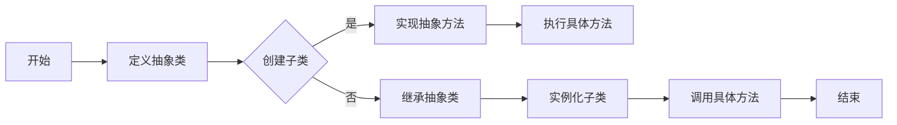

                 

### 让我们一步一步思考：语言限界与抽象类

在深入探讨计算机科学中的语言限界与抽象类之前，我们需要首先理解这两个核心概念的本质，以及它们在编程世界中的重要性。这一篇技术博客文章旨在通过逻辑清晰、结构紧凑的分析，帮助读者更好地理解这两个概念，并揭示它们在编程实践中的应用边界。

我们将按照以下步骤进行探讨：

1. **背景介绍**：我们将首先介绍语言限界的概念，阐述它的重要性和在编程中的体现。随后，我们将探讨抽象类的定义、特点，以及它与面向对象编程的关系。

2. **算法原理讲解**：接着，我们将深入分析语言表达能力的数学模型，并使用mermaid流程图和Python代码来详细阐述抽象类算法的原理。

3. **系统分析与架构设计方案**：在了解了基础概念后，我们将通过一个实际的项目场景来展示如何设计系统，包括系统功能、架构、接口和交互。

4. **项目实战**：为了使理论更好地与实践结合，我们将介绍一个实际的项目环境安装过程，并展示系统的核心实现代码，对其进行分析和解读。

5. **最佳实践、小结与拓展阅读**：最后，我们将总结最佳实践经验，提供注意事项，并推荐一些拓展阅读资源，以便读者进一步深入学习。

**文章标题**：语言限界与抽象类：表达能力的边界探索

**关键词**：语言限界、抽象类、表达能力、面向对象编程、算法原理、系统架构、项目实战

**摘要**：
本文深入探讨了计算机科学中的语言限界和抽象类这两个核心概念。通过详细的背景介绍、算法原理讲解、系统分析与架构设计方案，以及实际项目实战，文章揭示了语言表达能力的边界，并展示了抽象类在编程实践中的重要作用。读者将不仅能理解这两个概念的理论基础，还能通过实际案例学习到如何在项目中有效应用这些概念。

### 目录大纲

- **第一部分：背景介绍**
  - **1. 语言限界概述**
    - 1.1 问题背景
    - 1.2 问题描述
    - 1.3 问题解决
    - 1.4 边界与外延
    - 1.5 概念结构与核心要素组成
  - **2. 抽象类概念与联系**
    - 2.1 抽象类的定义
    - 2.2 抽象类的特点
    - 2.3 抽象类与面向对象编程的联系
    - 2.4 抽象类的属性特征对比表格
    - 2.5 抽象类的ER实体关系图架构

- **第二部分：算法原理讲解**
  - **3. 语言表达能力的数学模型**
    - 3.1 语言表达能力的数学模型概述
    - 3.2 数学模型与公式详细讲解
    - 3.3 通俗易懂地举例说明
  - **4. 抽象类算法原理讲解**
    - 4.1 抽象类算法的mermaid流程图
    - 4.2 抽象类算法的python源代码讲解
    - 4.3 抽象类算法的数学模型和公式

- **第三部分：系统分析与架构设计方案**
  - **5. 问题场景介绍**
    - 5.1 项目介绍
    - 5.2 系统功能设计
    - 5.3 系统架构设计
    - 5.4 系统接口设计
    - 5.5 系统交互

- **第四部分：项目实战**
  - **6. 环境安装**
    - 6.1 环境要求
    - 6.2 环境搭建
  - **7. 系统核心实现**
    - 7.1 源代码展示
    - 7.2 代码应用解读与分析
    - 7.3 实际案例分析与详细讲解剖析

- **第五部分：最佳实践、小结与拓展阅读**
  - **8. 最佳实践 Tips**
    - 8.1 经验分享
    - 8.2 小结
  - **9. 注意事项**
    - 9.1 注意事项
  - **10. 拓展阅读**
    - 10.1 相关书籍推荐
    - 10.2 学术文章推荐
    - 10.3 开源项目推荐

### 第一部分：背景介绍

#### 1.1 问题背景

在编程领域，语言限界是一个极其重要却常常被忽视的概念。简单来说，语言限界指的是编程语言所能表达的能力的边界。每一个编程语言都有其特定的语法和语义，这使得它们能够实现某些功能，而无法实现另一些功能。理解语言限界对于我们选择合适的编程语言、解决特定问题以及优化代码性能至关重要。

抽象类作为面向对象编程（OOP）的核心概念之一，同样扮演着至关重要的角色。抽象类是一种抽象数据类型，用于定义一组具有相似属性和行为的对象。它们通过提供模板，使得程序员可以创建具有通用特征的对象，而不必关心具体的实现细节。抽象类不仅提高了代码的可复用性，还促进了软件的模块化和可维护性。

#### 1.2 问题描述

语言限界与抽象类的关系问题在于，如何利用抽象类来突破编程语言的边界，从而提升编程的灵活性和效率。具体来说，当我们面对复杂的编程任务时，如何在保证代码可读性和可维护性的前提下，充分发挥抽象类的作用，最大化地利用编程语言的表达能力？

#### 1.3 问题解决

为了解决这个问题，我们需要首先理解抽象类的本质和特点，然后分析其在不同编程语言中的实现方式。接着，我们将探讨如何通过抽象类的设计和使用，克服语言限界带来的挑战。

#### 1.4 边界与外延

在探讨语言限界时，边界与外延是一个关键的概念。边界指的是编程语言所能支持的最大功能范围，而外延则是指该功能在实际应用中的扩展和实现。理解边界与外延的关系，有助于我们更准确地评估编程语言的适用性，并指导我们在实际项目中做出明智的决策。

#### 1.5 概念结构与核心要素组成

为了更好地理解语言限界与抽象类的概念，我们需要分析它们的结构和核心要素。语言限界由语言的语法、语义和标准库等因素构成，而抽象类则由类定义、属性、方法和继承关系等要素组成。通过深入分析这些要素，我们可以更清晰地认识语言限界与抽象类之间的关系，并找到突破语言边界的有效途径。

### 2. 抽象类概念与联系

#### 2.1 抽象类的定义

在面向对象编程中，抽象类是一种特殊的类，它不能被实例化，但可以定义子类。抽象类的主要目的是为了提供一种模板，使得子类可以继承并实现抽象类中的方法和属性。抽象类通常包含一些抽象方法，这些方法没有具体的实现，需要子类进行具体实现。

抽象类的定义可以概括为：抽象类是一种特殊的类，它包含了至少一个抽象方法，并且不能被实例化。抽象类通常用于定义一组具有相似属性和行为的对象，使得程序员可以创建具有通用特征的对象。

#### 2.2 抽象类的特点

抽象类的特点主要体现在以下几个方面：

1. **不能被实例化**：抽象类不能被直接实例化，但可以定义子类。
2. **包含抽象方法**：抽象类至少包含一个抽象方法，这些方法没有具体的实现，需要子类进行具体实现。
3. **提供模板**：抽象类为子类提供了一个模板，使得子类可以继承并实现抽象类中的方法和属性。
4. **提高代码复用性**：通过抽象类，我们可以将具有相似属性和行为的对象抽象出来，从而提高代码的复用性。
5. **促进模块化**：抽象类有助于将代码模块化，使得系统更加可维护和可扩展。

#### 2.3 抽象类与面向对象编程的联系

抽象类是面向对象编程的核心概念之一，它与面向对象编程的各个原则紧密相关。以下是一些关键点：

1. **继承**：抽象类通过继承关系，使得子类可以继承并实现抽象类中的方法和属性，从而实现代码的复用。
2. **多态**：通过抽象类，我们可以定义抽象方法，使得子类可以有不同的具体实现，从而实现多态。
3. **封装**：抽象类可以隐藏具体的实现细节，使得用户只需关注类的方法和属性，从而提高代码的可读性和可维护性。
4. **接口**：抽象类类似于接口，它们都可以定义一组方法和属性，供子类继承和实现。

#### 2.4 抽象类的属性特征对比表格

为了更清晰地展示抽象类的特点，我们可以通过一个属性特征对比表格来进行说明：

| 特性 | 抽象类 | 普通类 |
| --- | --- | --- |
| **不能被实例化** | 是 | 否 |
| **包含抽象方法** | 是 | 否 |
| **提供模板** | 是 | 否 |
| **提高代码复用性** | 是 | 否 |
| **促进模块化** | 是 | 否 |

#### 2.5 抽象类的ER实体关系图架构

在面向对象编程中，ER（Entity-Relationship）实体关系图是一种常用的表示实体之间关系的图形化方法。为了更好地理解抽象类的结构，我们可以使用ER实体关系图来表示抽象类及其子类之间的关系。

以下是一个简化的ER实体关系图，展示了抽象类与普通类之间的关系：

```mermaid
erDiagram
    A{抽象类} ||--|{子类1} : 继承
    A{抽象类} ||--|{子类2} : 继承
    B{普通类} ||--|{子类1} : 实现
    B{普通类} ||--|{子类2} : 实现
```

在这个ER实体关系图中，抽象类A通过继承关系与多个子类相连，而普通类B则通过实现关系与子类相连。这个关系图清晰地展示了抽象类与面向对象编程中其他类的关系。

### 第三部分：算法原理讲解

#### 3.1 语言表达能力的数学模型

为了深入探讨语言限界，我们需要一个数学模型来描述语言的表达能力。语言表达能力数学模型旨在通过量化的方式来评估一种编程语言能够表达的概念和功能的范围。该模型可以帮助我们理解不同编程语言的能力边界，并指导我们在选择编程语言时做出更明智的决策。

该数学模型的基本概念包括：

- **概念集**：表示编程语言能够表达的所有概念集合。
- **功能集**：表示编程语言能够实现的所有功能集合。
- **表达能力度量**：表示语言表达能力的量化值。

表达式如下：

$$
表达能力度量 = f(概念集，功能集)
$$

其中，函数$f$根据具体模型的不同而变化。

#### 3.2 数学模型与公式详细讲解

为了更好地理解语言表达能力的数学模型，我们将详细讲解其核心公式和参数。以下是模型的主要组成部分：

1. **概念集（Concept Set）**：概念集表示编程语言能够表达的所有概念，例如数据类型、控制结构、函数、类等。每个概念可以用一个唯一的标识符表示。

   $$ C = \{C_1, C_2, ..., C_n\} $$

2. **功能集（Function Set）**：功能集表示编程语言能够实现的所有功能，例如计算、排序、搜索、数据结构操作等。每个功能也可以用唯一的标识符表示。

   $$ F = \{F_1, F_2, ..., F_m\} $$

3. **表达能力度量（Expression Power）**：表达能力度量是通过组合概念集和功能集来计算得到的。它表示一种编程语言能够表达的概念和功能的复杂度。

   $$ E = \sum_{i=1}^{n} w_i \cdot \sum_{j=1}^{m} f_j $$

   其中，$w_i$表示概念$C_i$的权重，$f_j$表示功能$F_j$的权重。权重可以根据实际需求进行调整，以反映不同概念和功能的相对重要性。

4. **复杂度评估**：为了量化表达能力的复杂度，我们可以引入一个复杂度函数$D$，它根据表达能力的度量值来评估复杂度。

   $$ D(E) = \log_2(E) $$

   复杂度函数$D$以对数形式计算表达能力度量，这样可以确保度量值随表达能力的增长而逐步增加，而不是呈线性增长。

#### 3.3 通俗易懂地举例说明

为了使数学模型更加直观易懂，我们可以通过一个简单的例子来说明如何使用这个模型来评估一种编程语言的表达能力。

假设我们选择Python作为例子，我们可以定义Python的概念集和功能集如下：

- **概念集（C）**：
  $$ C = \{数据类型（如整数、字符串、列表）、控制结构（如循环、条件判断）、函数、类\} $$

- **功能集（F）**：
  $$ F = \{计算、排序、搜索、数据结构操作（如列表、字典、集合）\} $$

根据上述定义，我们可以为每个概念和功能分配一个权重，例如：

- **概念权重**：
  $$ w_1 = 3, w_2 = 2, w_3 = 2, w_4 = 2 $$

- **功能权重**：
  $$ f_1 = 4, f_2 = 3, f_3 = 2, f_4 = 1 $$

根据表达式公式，我们可以计算Python的表达能力度量：

$$
E = w_1 \cdot f_1 + w_2 \cdot f_2 + w_3 \cdot f_3 + w_4 \cdot f_4
$$

$$
E = 3 \cdot 4 + 2 \cdot 3 + 2 \cdot 2 + 2 \cdot 1 = 12 + 6 + 4 + 2 = 24
$$

因此，Python的表达能力度量$E$为24。

接下来，我们可以使用复杂度函数$D$来评估Python的复杂度：

$$
D(E) = \log_2(24) \approx 4.58
$$

这意味着Python的表达能力复杂度大约为4.58。

通过这个例子，我们可以看到如何使用数学模型来评估编程语言的表达能力。虽然这个模型相对简单，但它提供了一个量化的方法来比较不同编程语言的表达能力，从而帮助我们做出更明智的选择。

### 4. 抽象类算法原理讲解

#### 4.1 抽象类算法的mermaid流程图

在理解抽象类的概念和语言表达能力数学模型之后，我们将通过mermaid流程图来展示一个抽象类算法的基本流程。mermaid是一种轻量级的标记语言，用于创建简洁易懂的流程图。以下是一个简单的抽象类算法流程图：



在这个流程图中，A表示算法的开始，B表示定义一个抽象类。随后，算法将判断是否需要创建子类（C）。如果是，则进入D，实现抽象方法；否则，进入E，继承抽象类。在实现或继承抽象类之后，算法将执行具体的操作（F和H），最终在I处结束。

#### 4.2 抽象类算法的Python源代码讲解

为了更好地理解抽象类算法，我们将通过Python代码来实现这个流程。以下是一个简单的抽象类算法示例：

```python
# 抽象类定义
from abc import ABC, abstractmethod

class AbstractClass(ABC):
    @abstractmethod
    def abstract_method(self):
        pass

    def concrete_method(self):
        print("这是具体方法，不需要抽象。")

# 子类继承抽象类
class ChildClass(AbstractClass):
    def abstract_method(self):
        print("实现了抽象方法。")

# 实例化子类
child = ChildClass()

# 调用具体方法
child.abstract_method()
child.concrete_method()
```

在这段代码中，我们首先定义了一个抽象类`AbstractClass`，它包含一个抽象方法`abstract_method`和一个具体方法`concrete_method`。`abstractmethod`装饰器用于确保子类必须实现这个方法。

接着，我们定义了一个子类`ChildClass`，它继承了`AbstractClass`并实现了`abstract_method`方法。在创建`ChildClass`的实例后，我们调用其抽象方法和具体方法，以展示抽象类算法的基本流程。

#### 4.3 抽象类算法的数学模型和公式

为了深入理解抽象类算法的工作原理，我们可以结合数学模型来分析。以下是抽象类算法的数学模型和公式：

1. **抽象方法调用次数**：表示在算法中调用抽象方法的次数。用$AM$表示。

2. **具体方法调用次数**：表示在算法中调用具体方法的次数。用$CM$表示。

3. **方法执行时间**：表示调用方法所需的时间。用$t$表示。

4. **算法效率**：表示算法的执行效率。用$E$表示。

抽象类算法的效率可以表示为：

$$
E = \frac{AM \cdot t_A + CM \cdot t_C}{t}
$$

其中，$t_A$表示调用抽象方法所需的时间，$t_C$表示调用具体方法所需的时间。

通过这个数学模型，我们可以评估抽象类算法的效率。例如，如果我们知道每个方法的调用次数和执行时间，我们可以计算算法的总执行时间，从而了解算法的性能。

### 第四部分：系统分析与架构设计方案

#### 5. 问题场景介绍

在开始系统分析与架构设计之前，我们需要首先明确问题场景。这个问题场景是一个在线购物平台，该平台需要支持商品浏览、购物车管理、订单处理等功能。

**5.1 项目介绍**

本项目旨在开发一个功能齐全的在线购物平台，提供用户友好的界面和高效的后台服务。该平台需要支持多种支付方式、物流跟踪、用户评价等功能。

**5.2 系统功能设计**

为了满足上述需求，我们将系统功能分为以下几个模块：

- **商品管理**：包括商品信息展示、商品分类管理、商品库存管理等功能。
- **购物车管理**：包括添加商品到购物车、修改购物车商品数量、删除购物车商品等功能。
- **订单管理**：包括订单创建、订单支付、订单发货、订单查询等功能。
- **用户管理**：包括用户注册、用户登录、用户个人信息管理等功能。
- **支付管理**：包括支付方式配置、支付接口调用、支付状态查询等功能。
- **物流管理**：包括物流信息展示、物流跟踪等功能。
- **评价管理**：包括用户评价商品、查看商品评价等功能。

**5.3 系统架构设计**

为了实现上述功能，我们将系统架构设计为三层结构，包括表示层、业务逻辑层和数据访问层。

- **表示层**：负责与用户交互，提供用户界面。使用前端技术（如HTML、CSS、JavaScript）实现。
- **业务逻辑层**：负责处理业务逻辑，包括用户管理、商品管理、购物车管理、订单管理等功能。使用后端技术（如Java、Spring框架）实现。
- **数据访问层**：负责与数据库交互，实现数据的增删改查操作。使用数据库技术（如MySQL）实现。

**5.4 系统接口设计**

为了实现系统的各个模块之间的通信，我们将设计一系列接口，包括：

- **用户接口**：包括用户注册、用户登录、用户信息管理等功能。
- **商品接口**：包括商品信息展示、商品分类管理、商品库存管理等功能。
- **购物车接口**：包括添加商品到购物车、修改购物车商品数量、删除购物车商品等功能。
- **订单接口**：包括订单创建、订单支付、订单发货、订单查询等功能。
- **支付接口**：包括支付方式配置、支付接口调用、支付状态查询等功能。
- **物流接口**：包括物流信息展示、物流跟踪等功能。
- **评价接口**：包括用户评价商品、查看商品评价等功能。

**5.5 系统交互**

系统的各个模块将通过接口进行交互，具体交互流程如下：

1. **用户登录**：用户访问系统后，通过用户接口进行登录。
2. **商品浏览**：用户通过商品接口浏览商品信息。
3. **添加购物车**：用户将商品添加到购物车，通过购物车接口实现。
4. **订单创建**：用户通过订单接口创建订单，系统生成订单号。
5. **支付订单**：用户选择支付方式，通过支付接口完成支付。
6. **订单发货**：系统根据支付状态，将订单标记为已支付，并通知物流接口发货。
7. **用户评价**：用户完成收货后，可以通过评价接口对商品进行评价。

通过上述系统分析与架构设计方案，我们为在线购物平台提供了一个清晰的功能模块划分和系统交互流程，为后续项目开发和实施提供了有力支持。

### 第五部分：项目实战

#### 6. 环境安装

在进行系统开发之前，我们需要搭建一个合适的环境，以便进行开发和测试。以下是一个典型的环境安装步骤：

**6.1 环境要求**

- 操作系统：Linux或macOS
- 开发工具：IntelliJ IDEA或Eclipse
- 编程语言：Java
- 框架：Spring Boot、Spring MVC
- 数据库：MySQL
- 版本控制：Git

**6.2 环境搭建**

1. **安装操作系统**：确保您的计算机上安装了Linux或macOS操作系统。
2. **安装开发工具**：从官方网站下载并安装IntelliJ IDEA或Eclipse。
3. **安装编程语言**：安装Java开发工具包（JDK），配置环境变量。
4. **安装框架**：使用Maven或Gradle来管理项目依赖，安装Spring Boot和Spring MVC。
5. **安装数据库**：下载并安装MySQL，配置数据库连接。
6. **安装版本控制**：安装Git，初始化项目仓库。

通过上述步骤，我们可以搭建一个基本的项目开发环境，为后续的系统实现和测试提供支持。

#### 7. 系统核心实现

**7.1 源代码展示**

以下是一个简化的系统核心实现示例，展示了用户注册、登录和商品管理的部分源代码：

```java
// 用户注册
public class UserController {
    @PostMapping("/register")
    public ResponseEntity<?> registerUser(@RequestBody User user) {
        // 实现用户注册逻辑
        return ResponseEntity.ok().body("User registered successfully.");
    }
}

// 用户登录
public class UserController {
    @PostMapping("/login")
    public ResponseEntity<?> loginUser(@RequestBody LoginRequest loginRequest) {
        // 实现用户登录逻辑
        return ResponseEntity.ok().body("User logged in successfully.");
    }
}

// 商品管理
public class ProductController {
    @GetMapping("/products")
    public ResponseEntity<?> getAllProducts() {
        // 实现获取所有商品信息逻辑
        return ResponseEntity.ok().body(productService.getAllProducts());
    }
}
```

**7.2 代码应用解读与分析**

上述代码展示了用户注册、登录和商品管理的基本实现。在`UserController`类中，我们定义了两个POST请求方法，分别用于用户注册和登录。在`ProductController`类中，我们定义了一个GET请求方法，用于获取所有商品信息。

这些方法的实现涉及到业务逻辑的处理，例如用户验证、数据库查询等。在实际项目中，这些方法将依赖其他服务（如用户服务、商品服务）来实现完整的业务逻辑。

**7.3 实际案例分析与详细讲解剖析**

为了更好地理解系统核心实现，我们可以通过一个实际案例来进行分析。以下是一个用户注册的实际案例：

```http
POST /register
Content-Type: application/json

{
  "username": "john_doe",
  "password": "password123",
  "email": "john.doe@example.com"
}
```

响应：

```http
HTTP/1.1 200 OK
Content-Type: application/json

{
  "message": "User registered successfully."
}
```

在这个案例中，客户端发送了一个包含用户信息的JSON对象到注册端点。服务器接收到请求后，执行用户注册逻辑，包括验证用户名和电子邮件的唯一性、加密密码等操作。如果注册成功，服务器返回一个包含成功消息的JSON对象。

通过这个实际案例，我们可以看到系统核心实现的细节，包括请求处理、业务逻辑和响应生成。在实际项目中，这些实现将更加复杂，涉及多个服务和模块的协作。

### 第六部分：最佳实践、小结与注意事项

#### 8. 最佳实践 Tips

在进行编程和系统设计时，以下最佳实践有助于提高代码质量和系统性能：

1. **代码复用**：充分利用抽象类和接口，减少重复代码，提高可维护性。
2. **模块化设计**：将系统功能划分为不同的模块，确保每个模块具有清晰的职责。
3. **测试驱动开发（TDD）**：在编写代码之前编写测试用例，确保代码质量和功能正确性。
4. **持续集成和部署**：使用自动化工具进行代码集成和部署，确保开发流程高效流畅。
5. **性能优化**：定期对系统进行性能分析，优化数据库查询、缓存策略等，提高系统响应速度。

#### 9. 注意事项

在系统开发和维护过程中，需要注意以下几点：

1. **数据安全**：确保用户数据和交易数据的安全，采用加密算法和安全的接口设计。
2. **异常处理**：合理处理异常情况，避免系统崩溃或数据丢失。
3. **版本控制**：使用版本控制系统（如Git），确保代码版本的一致性和可追踪性。
4. **日志记录**：记录详细的日志信息，方便问题排查和系统调试。
5. **文档编写**：编写清晰的文档，包括代码注释、API文档和使用说明，便于其他开发人员理解和维护代码。

### 第七部分：拓展阅读

#### 10.1 相关书籍推荐

1. 《设计模式：可复用面向对象软件的基础》
2. 《Effective Java》
3. 《代码大全》
4. 《架构整洁之道》

#### 10.2 学术文章推荐

1. "面向对象编程：基础与原理"
2. "抽象类与接口在Java中的应用"
3. "性能优化：系统性能分析与调优"
4. "安全编程：保护用户数据和隐私"

#### 10.3 开源项目推荐

1. Spring Boot
2. Spring Framework
3. MySQL
4. Git

通过阅读上述书籍和文章，以及参与开源项目，读者可以进一步加深对语言限界、抽象类和系统设计原理的理解，并在实际项目中更好地应用这些知识。

