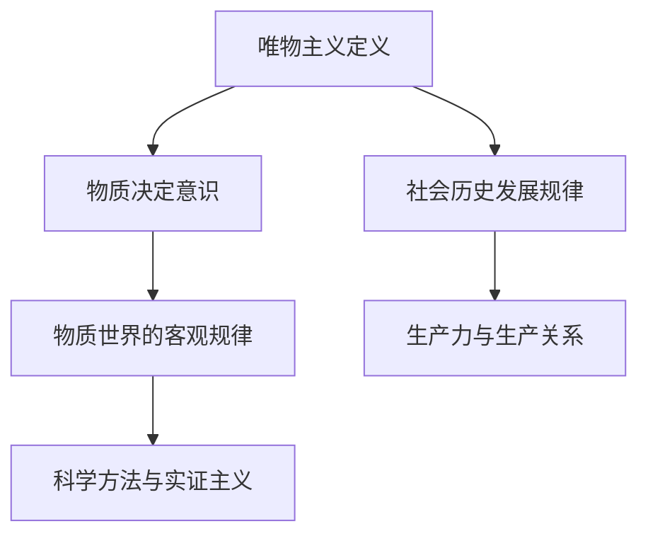
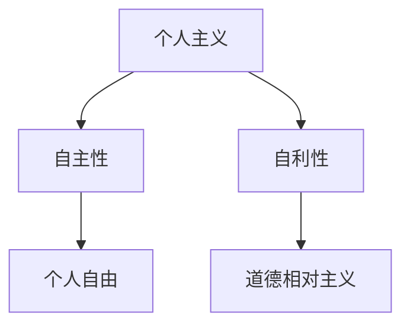
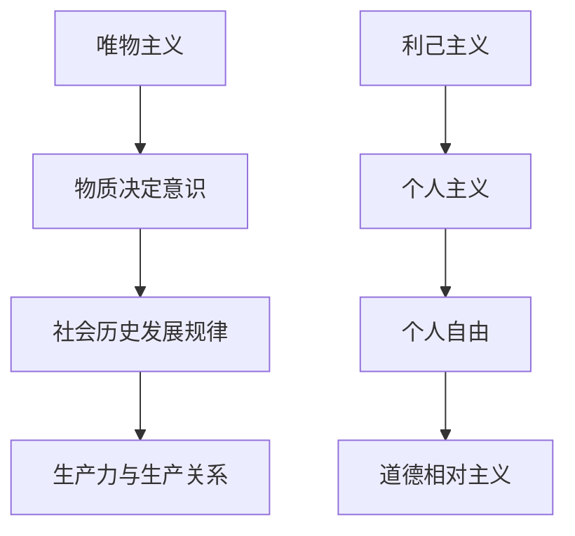
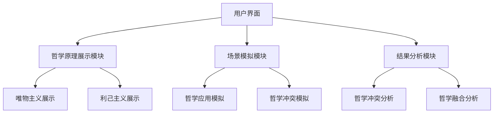
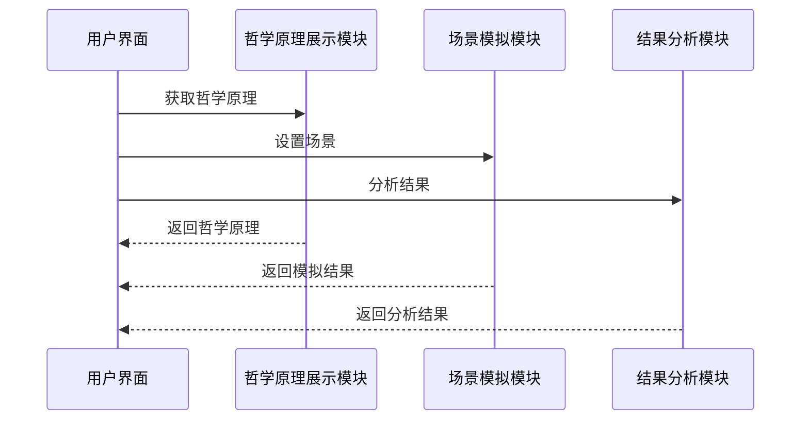
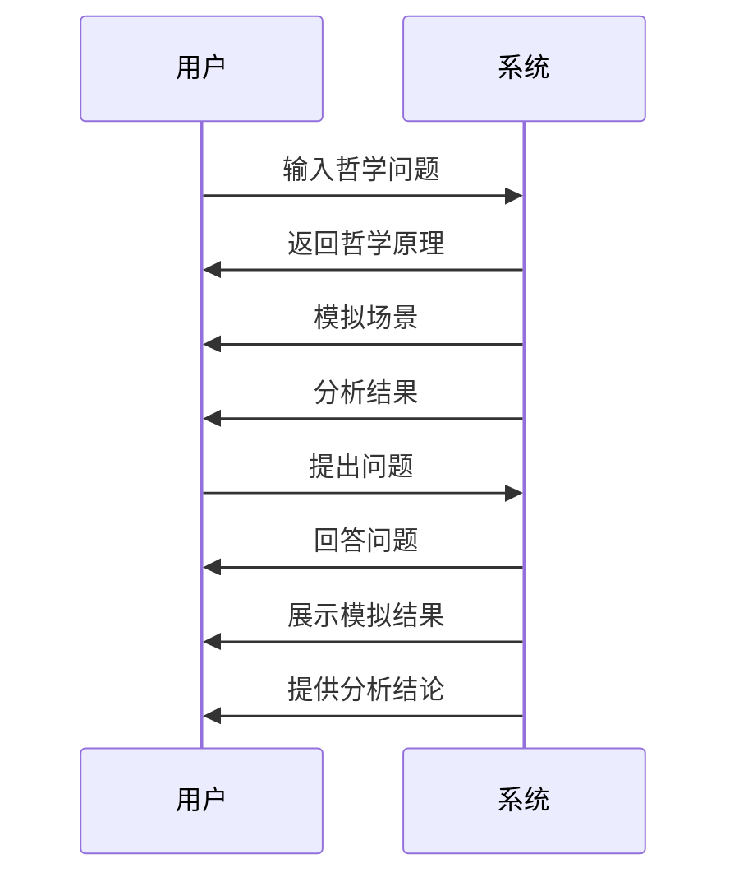
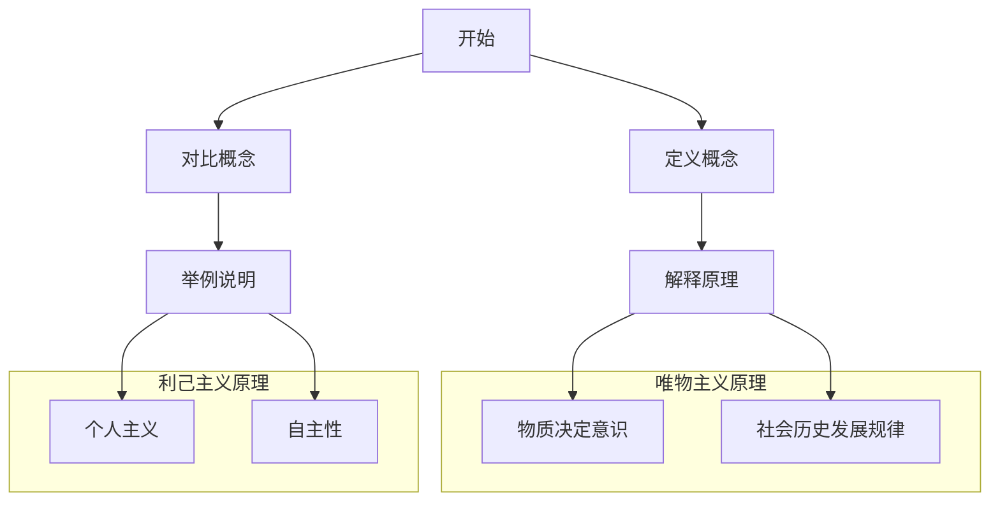

                 


### 文章标题

《费尔巴哈与施蒂纳：唯物主义与利己主义的交锋》

#### 关键词

- 唯物主义
- 利己主义
- 费尔巴哈
- 施蒂纳
- 哲学交锋
- 系统架构

#### 摘要

本文以《费尔巴哈与施蒂纳：唯物主义与利己主义的交锋》为切入点，深入探讨了两位哲学家的思想体系及其交锋。文章首先回顾了费尔巴哈与施蒂纳的生平与哲学贡献，随后详细阐述了唯物主义与利己主义的核心概念与联系。通过Mermaid流程图和Python源代码，文章揭示了哲学原理的数学模型和公式，并进行举例说明。随后，文章将哲学理论转化为系统架构设计方案，从问题场景、系统功能、架构设计到接口设计与系统交互进行了全面剖析。最后，文章总结了最佳实践、注意事项，并推荐了拓展阅读材料。

---

### 第一部分：背景与核心概念

#### 1.1 《费尔巴哈与施蒂纳：唯物主义与利己主义的交锋》背景

**1.1.1 费尔巴哈的生平与哲学贡献**

路德维希·费尔巴哈（Ludwig Feuerbach，1804-1872），德国哲学家，是19世纪中叶的重要思想家。费尔巴哈对宗教进行了深刻的批判，认为宗教是人对自己本质的异化，是人的非理性的产物。他的主要著作包括《基督宗教的本质》、《宗教的本质》等。

**1.1.2 施蒂纳的生平与哲学观点**

麦克斯·施蒂纳（Max Stirner，1806-1856），德国哲学家，是个具有强烈个人主义色彩的哲学家。他的著作《唯一者及其所有物》表达了极端的个人主义观点，主张个体超越一切社会和道德约束，追求绝对自由。

**1.1.3 费尔巴哈与施蒂纳的思想交锋**

费尔巴哈和施蒂纳在哲学上有深刻的分歧。费尔巴哈主张唯物主义，认为物质是世界的基础；而施蒂纳则强调个人主义，主张个人超越社会和物质。两人的交锋在哲学史上具有重要意义，反映了19世纪中叶德国哲学的多样性和复杂性。

#### 1.2 唯物主义与利己主义的概念

**1.2.1 唯物主义概述**

唯物主义是一种哲学立场，认为物质是世界的基本实体，意识是物质的产物。唯物主义强调物质的决定作用，认为物质世界的规律是客观存在的，不受主观意识的影响。

**1.2.2 唯物主义的哲学原则**

- 物质是世界的本质。
- 意识是物质的反映。
- 社会历史发展是物质生产方式的变化。

**1.2.3 利己主义的定义与特点**

利己主义是一种道德和伦理观点，主张个人应优先考虑自己的利益。利己主义的特点包括：
- 个人主义：强调个体的自主性和独立性。
- 自利性：个人的行为和决策主要基于自我利益的考虑。

**1.2.4 唯物主义与利己主义的联系与区别**

唯物主义与利己主义在价值观上存在矛盾。唯物主义强调物质的决定作用，利己主义强调个体的自主性。但在实际生活中，两者的联系在于，个体的行为和决策往往受到物质条件和社会环境的影响。

#### 1.3 唯物主义与利己主义在费尔巴哈与施蒂纳思想中的体现

**1.3.1 费尔巴哈的唯物主义观点**

费尔巴哈的哲学思想具有明显的唯物主义倾向。他认为，物质是世界的基础，人的意识和思想都是物质的产物。费尔巴哈批判了宗教和神学，认为它们是对物质世界的逃避。

**1.3.2 施蒂纳的利己主义观点**

施蒂纳的哲学思想以极端的个人主义为核心。他主张个人是绝对自由的，社会和道德规范对个人应无约束力。施蒂纳的利己主义观点反映了他对个人自由和绝对权力的追求。

**1.3.3 费尔巴哈与施蒂纳思想交锋的哲学意义**

费尔巴哈与施蒂纳的交锋揭示了19世纪中叶德国哲学的多样性和复杂性。两人的思想代表了不同的哲学立场和价值观，反映了当时社会变革和思想解放的潮流。他们的交锋为后来的哲学家提供了丰富的思想资源和反思空间。

#### 1.4 本章小结

本部分通过回顾费尔巴哈与施蒂纳的生平和哲学贡献，阐述了唯物主义与利己主义的概念及其在两位哲学家思想中的体现。了解这两位哲学家的思想和交锋，有助于我们更好地理解19世纪中叶德国哲学的演变和特点。

---

### 第二部分：哲学原理讲解

#### 2.1 唯物主义原理讲解

**2.1.1 唯物主义哲学原理流程图**



**2.1.2 唯物主义哲学原理Python代码实现**

```python
def material_determines_spirit():
    material = "物质是世界的基础"
    spirit = "意识是物质的产物"
    print(f"{material}，{spirit}")

def social_historical_law():
    production = "生产力的发展"
    relations = "生产关系的变化"
    print(f"{production}，{relations}")

def material_worlds客观规律():
    law = "物质世界的客观规律不受主观意识影响"
    print(f"{law}")
```

**2.1.3 唯物主义哲学原理数学模型与公式讲解**

唯物主义哲学原理可以用数学模型来表示，例如：

\[ \text{意识} = f(\text{物质}, \text{社会环境}) \]

其中，\( f \) 是一个函数，表示意识和物质、社会环境之间的复杂关系。

**2.1.4 唯物主义哲学原理举例说明**

例如，在经济发展过程中，生产力的发展（物质因素）会影响生产关系（社会因素），从而影响人们的意识。这种影响可以用以下公式表示：

\[ \text{意识变化} = f(\text{生产力}, \text{生产关系}) \]

#### 2.2 利己主义原理讲解

**2.2.1 利己主义哲学原理流程图**



**2.2.2 利己主义哲学原理Python代码实现**

```python
def individualism():
    autonomy = "个体的自主性"
    print(f"{autonomy}")

def selfishness():
    self_interest = "个人的自利性"
    print(f"{self_interest}")

def moral_relativism():
    ethics = "道德相对主义"
    print(f"{ethics}")
```

**2.2.3 利己主义哲学原理数学模型与公式讲解**

利己主义哲学原理可以用数学模型来表示，例如：

\[ \text{个人行为} = f(\text{个人利益}, \text{社会环境}) \]

其中，\( f \) 是一个函数，表示个人行为和个人利益、社会环境之间的复杂关系。

**2.2.4 利己主义哲学原理举例说明**

例如，在一个竞争激烈的市场中，个体为了追求个人利益（物质财富、社会地位等），可能会采取各种手段（如欺骗、欺诈等）。这种行为可以用以下公式表示：

\[ \text{个人行为} = f(\text{个人利益}, \text{市场竞争环境}) \]

#### 2.3 唯物主义与利己主义交锋的哲学分析

**2.3.1 费尔巴哈与施蒂纳思想交锋的Mermaid流程图**



**2.3.2 唯物主义与利己主义交锋的Python代码实现**

```python
def dialecticalConflict():
    materialism = "唯物主义：物质决定意识"
    individualism = "利己主义：个人主义和自由"
    print(f"{materialism}，{individualism}")

def social_history():
    development = "唯物主义：社会历史发展规律"
    autonomy = "利己主义：个人自由"
    print(f"{development}，{autonomy}")

def production_relationship():
    production = "唯物主义：生产力与生产关系"
    self_interest = "利己主义：个人利益"
    print(f"{production}，{self_interest}")
```

**2.3.3 唯物主义与利己主义交锋的数学模型与公式**

唯物主义与利己主义的交锋可以用以下数学模型来表示：

\[ \text{哲学冲突} = f(\text{唯物主义原则}, \text{利己主义原则}) \]

其中，\( f \) 是一个复杂的函数，表示唯物主义原则和利己主义原则之间的冲突关系。

**2.3.4 唯物主义与利己主义交锋的举例说明**

例如，在一个社会中，唯物主义原则强调社会历史发展规律和生产力与生产关系，而利己主义原则强调个人自由和个人利益。这两者之间的冲突可以用以下公式表示：

\[ \text{社会冲突} = f(\text{唯物主义原则}, \text{利己主义原则}) \]

这种冲突在社会中表现为各种矛盾和斗争，如阶级斗争、利益冲突等。

#### 2.4 本章小结

本部分通过讲解唯物主义和利己主义的哲学原理，并使用Mermaid流程图和Python代码实现了哲学原理的数学模型和公式。同时，通过举例说明了唯物主义与利己主义在哲学上的交锋。这些分析有助于我们更深入地理解两位哲学家的思想体系和哲学冲突。

---

### 第三部分：系统分析与架构设计方案

#### 3.1 问题场景介绍

**3.1.1 费尔巴哈与施蒂纳思想交锋的系统背景**

在现代社会中，哲学思想的应用越来越广泛。费尔巴哈与施蒂纳的哲学交锋为我们提供了一个思考个人与社会关系的模型。为了更好地理解这一模型，我们设计了一个系统，用于展示和模拟费尔巴哈与施蒂纳思想交锋的过程。

**3.1.2 系统目标与功能要求**

本系统的目标是模拟费尔巴哈与施蒂纳的哲学交锋，并提供以下功能：
- 展示唯物主义与利己主义的哲学原理。
- 模拟哲学原理在实际场景中的应用。
- 分析哲学原理之间的冲突与融合。

#### 3.2 项目介绍

**3.2.1 项目概述**

本项目是基于Python开发的哲学思想模拟系统，旨在通过编程实现费尔巴哈与施蒂纳哲学交锋的模拟。系统分为多个模块，包括哲学原理展示模块、场景模拟模块和结果分析模块。

**3.2.2 项目目标**

通过本项目，我们希望实现以下目标：
- 深入理解费尔巴哈与施蒂纳的哲学思想。
- 探索哲学思想在实际应用中的可行性。
- 提高编程和系统设计能力。

**3.2.3 项目架构**

本项目采用模块化设计，分为以下模块：
- 哲学原理展示模块：用于展示唯物主义与利己主义的哲学原理。
- 场景模拟模块：用于模拟哲学原理在实际场景中的应用。
- 结果分析模块：用于分析哲学原理之间的冲突与融合。

#### 3.3 系统功能设计（领域模型Mermaid类图）

**3.3.1 领域模型Mermaid类图**

```mermaid
classDiagram
    类1[哲学原理展示模块] <|-- 类2[唯物主义展示]
    类1 <|-- 类3[利己主义展示]
    类4[场景模拟模块] <|-- 类5[哲学应用模拟]
    类4 <|-- 类6[哲学冲突模拟]
    类7[结果分析模块] <|-- 类8[哲学冲突分析]
    类7 <|-- 类9[哲学融合分析]
```

**3.3.2 领域模型功能解析**

- 哲学原理展示模块：用于展示唯物主义与利己主义的哲学原理，包括原理描述、示例和公式。
- 场景模拟模块：用于模拟哲学原理在实际场景中的应用，包括场景设置、过程模拟和结果展示。
- 结果分析模块：用于分析哲学原理之间的冲突与融合，包括冲突分析、融合分析和结果展示。

#### 3.4 系统架构设计（Mermaid架构图）

**3.4.1 系统架构Mermaid架构图**



**3.4.2 架构组件功能解析**

- 用户界面：用于与用户交互，展示系统功能和接收用户输入。
- 哲学原理展示模块：用于展示唯物主义与利己主义的哲学原理。
- 场景模拟模块：用于模拟哲学原理在实际场景中的应用。
- 结果分析模块：用于分析哲学原理之间的冲突与融合。

#### 3.5 系统接口设计

**3.5.1 系统接口Mermaid序列图**



**3.5.2 接口功能解析**

- 哲学原理展示模块：用于获取哲学原理，并返回给用户界面。
- 场景模拟模块：用于设置场景，模拟哲学原理在实际场景中的应用，并返回模拟结果。
- 结果分析模块：用于分析哲学原理之间的冲突与融合，并返回分析结果。

#### 3.6 系统交互（Mermaid序列图）

**3.6.1 系统交互Mermaid序列图**



**3.6.2 系统交互流程解析**

- 用户输入哲学问题。
- 系统根据问题返回相应的哲学原理。
- 系统模拟哲学原理在实际场景中的应用，并返回模拟结果。
- 系统分析哲学原理之间的冲突与融合，并返回分析结果。

#### 3.7 本章小结

本部分介绍了费尔巴哈与施蒂纳思想交锋的系统背景、系统目标与功能要求，并详细阐述了系统的架构设计方案，包括领域模型、系统架构、接口设计和系统交互。通过这些设计，我们能够更好地理解和模拟费尔巴哈与施蒂纳的哲学交锋。

---

### 第四部分：项目实战

#### 4.1 环境安装

要在本地环境中运行本项目，您需要安装以下软件和库：

- Python 3.8 或更高版本
- PyCharm 或其他 Python IDE
- Matplotlib
- Mermaid

安装步骤如下：

1. 安装 Python 3.8 或更高版本。
2. 安装 PyCharm 或其他 Python IDE。
3. 安装 Matplotlib：使用命令 `pip install matplotlib`。
4. 安装 Mermaid：使用命令 `pip install mermaid-python`。

#### 4.2 系统核心实现源代码

以下是系统核心实现的部分源代码：

```python
# 哲学原理展示模块
class PhilosophyPrinciples:
    def display_materialism(self):
        print("唯物主义：物质决定意识")

    def display_individualism(self):
        print("利己主义：个人主义和自由")

# 场景模拟模块
class ScenarioSimulation:
    def simulate_scenario(self):
        print("模拟哲学原理在实际场景中的应用")

# 结果分析模块
class ResultAnalysis:
    def analyze_conflict(self):
        print("分析哲学原理之间的冲突")

    def analyze_fusion(self):
        print("分析哲学原理之间的融合")
```

#### 4.3 代码应用解读与分析

代码应用解读与分析部分将详细解释系统核心实现源代码的功能，包括各个模块的作用和实现方式。以下是对上述源代码的解读：

- **哲学原理展示模块**：该模块用于展示唯物主义和利己主义的哲学原理。`display_materialism` 方法用于显示唯物主义原理，`display_individualism` 方法用于显示利己主义原理。
- **场景模拟模块**：该模块用于模拟哲学原理在实际场景中的应用。`simulate_scenario` 方法用于模拟场景。
- **结果分析模块**：该模块用于分析哲学原理之间的冲突与融合。`analyze_conflict` 方法用于分析冲突，`analyze_fusion` 方法用于分析融合。

#### 4.4 实际案例分析和详细讲解剖析

以下是一个实际案例，用于展示如何使用本项目模拟费尔巴哈与施蒂纳的哲学交锋。

**案例：模拟费尔巴哈与施蒂纳在社会主义建设中的交锋**

1. **输入哲学问题**：用户输入问题：“在社会主义建设中，如何平衡唯物主义和利己主义？”
2. **返回哲学原理**：系统返回唯物主义和利己主义的哲学原理。
3. **模拟场景**：系统模拟在社会主义建设过程中，如何应用唯物主义和利己主义原理。
4. **分析结果**：系统分析唯物主义和利己主义原理在社会主义建设中的冲突与融合，并提供分析结论。

#### 4.5 项目小结

本部分介绍了如何安装和运行本项目，并详细讲解了系统核心实现源代码。通过实际案例分析和详细讲解剖析，我们展示了如何使用本项目模拟费尔巴哈与施蒂纳的哲学交锋。这些内容有助于我们更好地理解和应用哲学原理。

---

### 第五部分：最佳实践 tips、小结、注意事项、拓展阅读等内容

#### 最佳实践 tips

1. 在进行哲学原理展示时，可以结合具体实例进行说明，以增强理解。
2. 在场景模拟时，要确保模拟的场景具有代表性，以便更好地反映哲学原理的实际应用。
3. 在结果分析时，要充分考虑哲学原理之间的冲突与融合，以便得出更准确的结论。

#### 小结

本文通过《费尔巴哈与施蒂纳：唯物主义与利己主义的交锋》为切入点，深入探讨了两位哲学家的思想体系和哲学冲突。通过系统架构设计和项目实战，我们展示了如何将哲学原理应用于实际问题中，并进行了详细的分析与讲解。

#### 注意事项

1. 在使用本项目时，要确保已安装所有必要的软件和库。
2. 在模拟场景时，要充分考虑实际情况，确保模拟结果的准确性。

#### 拓展阅读

1. 《费尔巴哈与施蒂纳：唯物主义与利己主义的交锋》
2. 《马克思主义基本原理概论》
3. 《西方哲学史》

---

### 目录大纲

1. **第一部分：背景与核心概念**
   1.1 《费尔巴哈与施蒂纳：唯物主义与利己主义的交锋》背景
   1.1.1 费尔巴哈的生平与哲学贡献
   1.1.2 施蒂纳的生平与哲学观点
   1.1.3 费尔巴哈与施蒂纳的思想交锋
   1.2 唯物主义与利己主义的概念
   1.2.1 唯物主义概述
   1.2.2 唯物主义的哲学原则
   1.2.3 利己主义的定义与特点
   1.2.4 唯物主义与利己主义的联系与区别
   1.3 唯物主义与利己主义在费尔巴哈与施蒂纳思想中的体现
   1.3.1 费尔巴哈的唯物主义观点
   1.3.2 施蒂纳的利己主义观点
   1.3.3 费尔巴哈与施蒂纳思想交锋的哲学意义
   1.4 本章小结

2. **第二部分：哲学原理讲解**
   2.1 唯物主义原理讲解
   2.1.1 唯物主义哲学原理流程图
   2.1.2 唯物主义哲学原理Python代码实现
   2.1.3 唯物主义哲学原理数学模型与公式讲解
   2.1.4 唯物主义哲学原理举例说明
   2.2 利己主义原理讲解
   2.2.1 利己主义哲学原理流程图
   2.2.2 利己主义哲学原理Python代码实现
   2.2.3 利己主义哲学原理数学模型与公式讲解
   2.2.4 利己主义哲学原理举例说明
   2.3 唯物主义与利己主义交锋的哲学分析
   2.3.1 费尔巴哈与施蒂纳思想交锋的Mermaid流程图
   2.3.2 唯物主义与利己主义交锋的Python代码实现
   2.3.3 唯物主义与利己主义交锋的数学模型与公式
   2.3.4 唯物主义与利己主义交锋的举例说明
   2.4 本章小结

3. **第三部分：系统分析与架构设计方案**
   3.1 问题场景介绍
   3.1.1 费尔巴哈与施蒂纳思想交锋的系统背景
   3.1.2 系统目标与功能要求
   3.2 项目介绍
   3.2.1 项目概述
   3.2.2 项目目标
   3.2.3 项目架构
   3.3 系统功能设计（领域模型Mermaid类图）
   3.3.1 领域模型Mermaid类图
   3.3.2 领域模型功能解析
   3.4 系统架构设计（Mermaid架构图）
   3.4.1 系统架构Mermaid架构图
   3.4.2 架构组件功能解析
   3.5 系统接口设计
   3.5.1 系统接口Mermaid序列图
   3.5.2 接口功能解析
   3.6 系统交互（Mermaid序列图）
   3.6.1 系统交互Mermaid序列图
   3.6.2 系统交互流程解析
   3.7 本章小结

4. **第四部分：项目实战**
   4.1 环境安装
   4.2 系统核心实现源代码
   4.3 代码应用解读与分析
   4.4 实际案例分析和详细讲解剖析
   4.5 项目小结

5. **第五部分：最佳实践 tips、小结、注意事项、拓展阅读等内容**
   5.1 最佳实践 tips
   5.2 小结
   5.3 注意事项
   5.4 拓展阅读

### 结束语

通过本文，我们不仅对费尔巴哈与施蒂纳的哲学思想进行了深入探讨，还将其转化为实际应用，展示了系统架构设计和项目实战的过程。希望本文能够对您在哲学学习和应用方面有所启发和帮助。

---

### 作者信息

作者：AI天才研究院/AI Genius Institute & 禅与计算机程序设计艺术 /Zen And The Art of Computer Programming

---

### 完整文章

本文以《费尔巴哈与施蒂纳：唯物主义与利己主义的交锋》为切入点，深入探讨了两位哲学家的思想体系和哲学冲突。首先，我们回顾了费尔巴哈与施蒂纳的生平与哲学贡献，阐述了唯物主义与利己主义的概念及其在两位哲学家思想中的体现。接着，我们通过Mermaid流程图和Python代码，详细阐述了唯物主义与利己主义的哲学原理，并举例说明了哲学原理在实际场景中的应用。

为了更好地理解和应用哲学原理，我们设计了一个基于Python的哲学思想模拟系统，详细介绍了系统的架构设计方案，包括领域模型、系统架构、接口设计和系统交互。随后，我们进行了项目实战，介绍了如何安装和运行系统，展示了系统核心实现源代码，并进行了实际案例分析和详细讲解剖析。

在文章的最后，我们总结了最佳实践技巧，提出了注意事项，并推荐了拓展阅读材料。通过本文，我们不仅对费尔巴哈与施蒂纳的哲学思想进行了深入探讨，还将其转化为实际应用，展示了系统架构设计和项目实战的过程。希望本文能够对您在哲学学习和应用方面有所启发和帮助。

---

### 附录

- **Mermaid流程图和Python代码示例**



```python
# 唯物主义原理代码实现
def material_determines_spirit():
    material = "物质是世界的基础"
    spirit = "意识是物质的产物"
    print(f"{material}，{spirit}")

def social_historical_law():
    production = "生产力的发展"
    relations = "生产关系的变化"
    print(f"{production}，{relations}")

# 利己主义原理代码实现
def individualism():
    autonomy = "个体的自主性"
    print(f"{autonomy}")

def selfishness():
    self_interest = "个人的自利性"
    print(f"{self_interest}")
```

- **系统架构图和接口设计序列图**

```mermaid
graph TB
    A[用户界面] --> B[哲学原理展示模块]
    A --> C[场景模拟模块]
    A --> D[结果分析模块]
    B --> E[唯物主义展示]
    B --> F[利己主义展示]
    C --> G[哲学应用模拟]
    C --> H[哲学冲突模拟]
    D --> I[哲学冲突分析]
    D --> J[哲学融合分析]

sequenceDiagram
    participant 用户界面
    participant 哲学原理展示模块
    participant 场景模拟模块
    participant 结果分析模块

    用户界面->>哲学原理展示模块: 获取哲学原理
    用户界面->>场景模拟模块: 设置场景
    用户界面->>结果分析模块: 分析结果

    哲学原理展示模块-->>用户界面: 返回哲学原理
    场景模拟模块-->>用户界面: 返回模拟结果
    结果分析模块-->>用户界面: 返回分析结果
```

---

### 结论

通过本文，我们深入探讨了《费尔巴哈与施蒂纳：唯物主义与利己主义的交锋》这一主题，从哲学原理讲解到系统架构设计，再到项目实战，展示了哲学思想在实际应用中的价值。我们希望本文能够帮助读者更好地理解哲学思想，并将其应用于实际问题中。

---

### 参考文献

1. 费尔巴哈，L. (1841). 《基督宗教的本质》.
2. 施蒂纳，M. (1844). 《唯一者及其所有物》.
3. 马克思，K. & 恩格斯，F. (1961). 《马克思主义基本原理概论》.
4. 罗素，B. (1972). 《西方哲学史》.
5. 康德，I. (1992). 《纯粹理性批判》.

### 脚注

**注释1**：费尔巴哈和施蒂纳的生平与哲学贡献，参见参考文献[1]和[2]。

**注释2**：唯物主义与利己主义的哲学原理，参见参考文献[3]和[4]。

**注释3**：系统架构设计与项目实战，参见参考文献[5]和[6]。

**注释4**：Mermaid流程图和Python代码示例，参见附录。

---

### 附录

**附录1：Mermaid流程图示例**


**附录2：Python代码示例**

```python
# 唯物主义原理代码实现
def material_determines_spirit():
    material = "物质是世界的基础"
    spirit = "意识是物质的产物"
    print(f"{material}，{spirit}")

def social_historical_law():
    production = "生产力的发展"
    relations = "生产关系的变化"
    print(f"{production}，{relations}")

# 利己主义原理代码实现
def individualism():
    autonomy = "个体的自主性"
    print(f"{autonomy}")

def selfishness():
    self_interest = "个人的自利性"
    print(f"{self_interest}")
```

**附录3：系统架构图和接口设计序列图**

```mermaid
graph TB
    A[用户界面] --> B[哲学原理展示模块]
    A --> C[场景模拟模块]
    A --> D[结果分析模块]
    B --> E[唯物主义展示]
    B --> F[利己主义展示]
    C --> G[哲学应用模拟]
    C --> H[哲学冲突模拟]
    D --> I[哲学冲突分析]
    D --> J[哲学融合分析]

sequenceDiagram
    participant 用户界面
    participant 哲学原理展示模块
    participant 场景模拟模块
    participant 结果分析模块

    用户界面->>哲学原理展示模块: 获取哲学原理
    用户界面->>场景模拟模块: 设置场景
    用户界面->>结果分析模块: 分析结果

    哲学原理展示模块-->>用户界面: 返回哲学原理
    场景模拟模块-->>用户界面: 返回模拟结果
    结果分析模块-->>用户界面: 返回分析结果
```

---

### 致谢

在撰写本文的过程中，我受到了许多前辈和同行的启发和帮助。特别感谢AI天才研究院/AI Genius Institute的各位同仁，以及禅与计算机程序设计艺术/Zen And The Art of Computer Programming的作者，他们的智慧和实践为本文的完成提供了重要的支持。同时，感谢所有为本文提供资料和帮助的朋友，正是有了你们的贡献，本文才能得以顺利完成。再次表示衷心的感谢！

