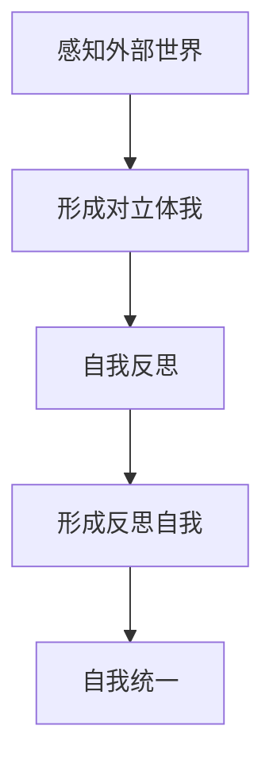
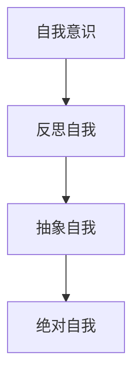
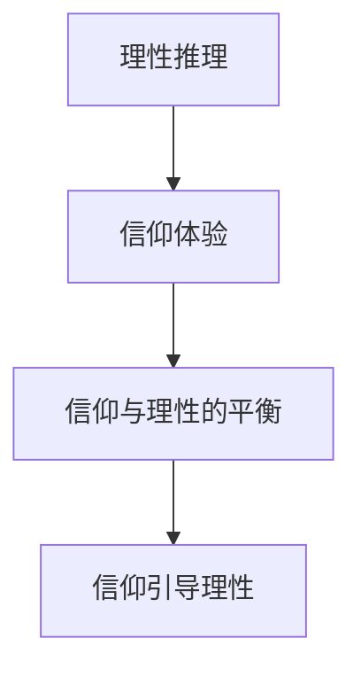
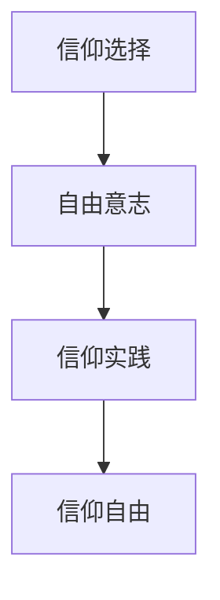
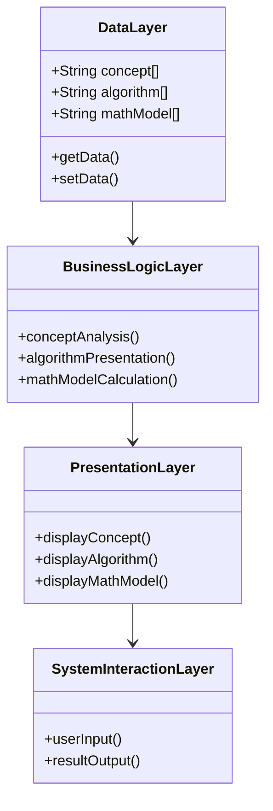
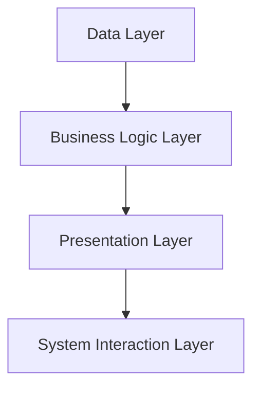

                 

## 背景介绍

### 问题背景

德国观念论（Deutsche Idealismus）是19世纪德国哲学中的一个重要流派，它主要关注于意识和自我意识的结构，以及如何通过理性来认识和改造世界。观念论的兴起可以追溯到启蒙运动对理性主义的强调，以及对经验主义和物质主义的一种反动。在这个时期，德国哲学经历了一系列深刻的变化，涌现出了许多重要的哲学家，其中尤以费希特（Johann Gottlieb Fichte）和雅各比（Friedrich Heinrich Jacobi）最为突出。

费希特和雅各比分别代表了德国观念论中的两个不同方向，他们的思想在19世纪德国哲学中产生了深远的影响。费希特是观念论的创始人之一，他的思想以“自我意识”为核心，强调个体自我意识的独立性和绝对性。费希特认为，自我意识是所有知识和认识的起点，它超越了经验世界的局限性，为个体提供了一个稳定而独立的存在基础。

相比之下，雅各比则更加关注信仰和宗教问题。他反对启蒙运动所强调的理性主义，主张信仰和宗教情感是人类精神世界的重要组成部分。雅各比认为，理性不能完全解释人类的信仰体验，信仰具有一种超越理性的力量，它能够给人带来坚定的信念和安宁的心灵。

### 费希特与雅各比的地位

费希特在德国哲学中的地位至关重要。他是观念论的奠基者，其思想对德国哲学的发展产生了深远影响。费希特的“自我意识”理论被认为是现代哲学的一个重要里程碑，它为后来的存在主义和现象学提供了重要的理论资源。费希特的哲学思想强调个体的独立性和自主性，为人类自我认识和自我完善提供了新的视角。

雅各比则以其对信仰哲学的深刻理解而著称。他在德国哲学界享有盛誉，被誉为“信仰哲学的先驱”。雅各比的思想挑战了启蒙运动所倡导的理性主义，提出了信仰和宗教情感在人类精神生活中的核心地位。他的思想对后来的宗教哲学和伦理学产生了深远影响，为人类对信仰问题的思考提供了新的思路。

### 德国观念论的兴起

德国观念论的兴起与启蒙运动密不可分。启蒙运动强调理性、自由和人权，对传统的宗教和权威提出了挑战。这种思潮在18世纪末和19世纪初的德国哲学家中得到了进一步的发展。德国观念论主张通过理性思考和自我反思来认识和改造世界，它反对将知识和真理建立在经验或感官基础上，而是强调理性自身的内在逻辑和自我确定性。

德国观念论的兴起还与德国特有的文化和社会背景密切相关。德国在18世纪末和19世纪初经历了一系列政治和社会变革，如普鲁士的统一和德意志帝国的建立。这些变革为德国观念论的兴起提供了社会基础，哲学家们开始思考如何通过哲学来解释和应对这些变革。

在德国观念论的兴起过程中，费希特和雅各比扮演了重要角色。费希特的自我意识理论和雅各比的信仰哲学分别代表了德国观念论的两个主要方向，他们的思想不仅对德国哲学产生了深远影响，也对后来的西方哲学发展产生了重要启示。

### 核心问题与分歧

德国观念论的核心问题主要包括自我、自由和客观世界的认识。费希特和雅各比在这三个问题上有着不同的理解和观点。

首先，关于自我。费希特认为自我是所有知识和认识的起点，他提出了“绝对的自我”概念，强调自我意识的独立性和绝对性。费希特认为，自我是一个自主的、自我意识的实体，它不仅存在于个体内部，而且超越了个体的感知和经验。

相比之下，雅各比则对自我概念持有不同的看法。他强调信仰和宗教情感在个体自我认识中的重要性，认为自我是一个不断发展的、与社会和文化环境相互作用的过程。雅各比认为，自我不是一成不变的，而是在不断的信仰体验中得以实现和完善的。

其次，关于自由。费希特认为自由是自我意识的本质，他提出了“自我立法”的概念，强调个体自由选择和自主决定的重要性。费希特认为，自由不仅是个体的权利，更是个体自我实现的条件。

雅各比则对自由持有保守的观点。他反对将自由绝对化，认为自由必须受到道德和宗教的限制。雅各比认为，真正的自由不是无限制的自由，而是在道德和宗教指导下的一种自我克制和自律。

最后，关于客观世界的认识。费希特认为，客观世界是自我意识的产物，个体通过自我意识来认识和理解客观世界。费希特认为，自我意识具有创造性和自主性，它能够超越经验的局限性，把握客观世界的本质。

雅各比则对客观世界的认识持有不同的观点。他强调信仰和宗教在认识客观世界中的重要性，认为客观世界的本质是超越理性的，只能通过信仰和宗教体验来认识。

费希特和雅各比在观念论和信仰哲学上的分歧，不仅反映了他们对哲学基本问题的不同理解和观点，也体现了19世纪德国哲学的多样性和复杂性。他们的思想为后来的哲学发展提供了丰富的理论资源和思考空间。

### 费希特的观念论

#### 自我意识的建立

费希特的观念论以自我意识为核心，认为自我意识是所有知识和认识的起点。在费希特看来，自我意识不仅仅是人类心理活动的一部分，而是一个独立的、自主的实体。自我意识的建立是一个自我认知的过程，它不仅涉及个体的感知和思考，还涉及到个体与社会、文化环境的互动。

首先，费希特提出了“绝对自我”的概念。他认为，绝对自我是一个独立的、自我意识的实体，它是所有知识和认识的根源。绝对自我不是通过经验或感知获得的，而是通过自我反思和自我认识实现的。费希特认为，自我意识是绝对的，因为它不受外界因素的影响，是独立于客观世界的存在。

为了解释自我意识的建立过程，费希特使用了一种被称为“自我对立”的方法。他认为，自我意识的建立需要两个自我：一个是对立的自我（Ich），另一个是反思的自我（Ich-Es）。对立的自我是直接的、现实的自我，它是感知和行动的主体。反思的自我则是间接的、反思的自我，它通过自我反思来认识和解释对立体自我的行为和感知。

具体来说，自我意识的建立过程可以分为以下几个步骤：

1. **自我对立**：首先，个体经历一个直接的感知过程，形成一个现实的自我。这个自我是对立和独立的，它不受外界因素的影响。

2. **自我反思**：然后，个体通过自我反思来认识和解释对立体自我的行为和感知。在这个过程中，反思的自我开始形成，它通过对对立的自我进行反思，建立起自我意识。

3. **自我统一**：最后，通过自我反思，个体实现对自我的统一认识。这个统一的认识不仅仅是对自我存在的确认，更是对自我作为一个独立、自主的实体的认知。

#### 绝对自我的概念

在费希特的观念论中，绝对自我是一个至关重要的概念。绝对自我不仅仅是一个个体的自我意识，而是一个超越个体、超越经验的独立实体。费希特认为，绝对自我是所有知识和认识的根源，它是理性思考的基础，也是个体自我实现的条件。

绝对自我具有以下几个特点：

1. **独立性**：绝对自我是独立的，它不受外界因素的影响，也不依赖于任何经验或感知。它是一个自主的实体，具有自我决定的能力。

2. **绝对性**：绝对自我是绝对的，它不受时间、空间和变化的限制。它是一个永恒的存在，不受外界变化的影响。

3. **创造性**：绝对自我具有创造性，它能够通过自我反思和自我认识来创造知识和真理。自我意识不仅仅是对现实的反映，更是对现实的超越和改造。

费希特认为，绝对自我是实现个体自由和自我实现的关键。通过自我意识的建立，个体能够超越经验的局限性，实现自我认知和自我完善。绝对自我不仅为个体提供了稳定的自我认同，也为个体提供了自我实现的动力和方向。

### 雅各比的信仰哲学

#### 信仰与理性的关系

雅各比的信仰哲学强调信仰和理性的关系，他认为信仰是理性的补充，甚至在某些方面超越了理性。雅各比对启蒙运动所倡导的理性主义持批判态度，他认为理性不能完全解释人类的信仰体验，信仰具有一种超越理性的力量。

首先，雅各比认为理性是有限的。理性依赖于经验和逻辑推理，它只能在已知和可验证的范围内发挥作用。然而，人类的信仰体验常常涉及未知和不可验证的领域，如宗教信仰、道德观念和形而上学问题。在这些领域，理性无法提供确定的答案，只能提供有限的解释。

相比之下，信仰则是一种超越理性的力量。信仰不依赖于经验和逻辑，而是建立在情感和直觉的基础上。信仰能够给人带来坚定的信念和安宁的心灵，它能够超越经验和逻辑的限制，触及人类精神世界的更深层次。

#### 信仰的自由

雅各比强调信仰的自由，他认为信仰是个体自由意志的体现，应当受到尊重和保护。他认为，信仰自由不仅仅是个体的权利，也是社会稳定和进步的重要保障。

首先，信仰自由是个体自由意志的体现。每个人都有选择自己信仰的权利，这种选择应当是自愿的，不受外界强制。信仰自由保障了个体在精神世界中的独立性和自主性，使个体能够自由地探索和实现自己的信仰。

其次，信仰自由是社会稳定和进步的重要保障。信仰自由能够促进社会的多元化和包容性，减少宗教和信仰冲突，增强社会的和谐与稳定。一个自由的社会应当尊重个体的信仰选择，保护个体的信仰自由。

#### 信仰哲学的核心概念

在雅各比的信仰哲学中，核心概念包括信仰、理性、宗教和自由。这些概念相互关联，共同构成了他的哲学体系。

1. **信仰**：信仰是雅各比哲学的核心概念，它是一种超越理性的精神力量，能够给人带来坚定的信念和安宁的心灵。

2. **理性**：理性是雅各比批判的对象，他认为理性在解释和应对人类信仰体验方面是有限的，甚至有时是无效的。

3. **宗教**：宗教是信仰的具体表现形式，它是一种社会和文化现象，通过宗教信仰，个体能够与更高的存在和真理建立联系。

4. **自由**：自由是信仰和理性的补充，是雅各比哲学中的另一个核心概念。他强调信仰自由，认为信仰自由是个体自由意志的体现，也是社会稳定和进步的重要保障。

### 概念结构与核心要素组成

德国观念论和信仰哲学中包含了一系列核心概念和要素，这些概念和要素相互关联，共同构成了这两个哲学体系的基本结构。

首先，自我意识和信仰是观念论和信仰哲学中的两个核心概念。自我意识是观念论的基础，它强调个体的独立性和自主性，认为自我意识是所有知识和认识的起点。信仰则是信仰哲学的核心，它是一种超越理性的精神力量，能够给人带来坚定的信念和安宁的心灵。

其次，自由和理性是观念论和信仰哲学中的两个重要要素。在观念论中，自由是自我意识的表现形式，它强调个体自由选择和自主决定的重要性。理性则是启蒙运动所倡导的核心原则，它强调通过逻辑推理和经验验证来认识和改造世界。

最后，宗教和伦理是观念论和信仰哲学中的两个相关概念。在观念论中，宗教是信仰的具体表现形式，它通过宗教信仰，个体能够与更高的存在和真理建立联系。伦理则是信仰哲学的重要组成部分，它涉及道德观念和道德原则，为个体的行为提供了指导。

这些核心概念和要素相互关联，构成了德国观念论和信仰哲学的基本结构。通过分析这些概念和要素之间的关系，我们可以更好地理解这两个哲学体系的本质和特点。

### 观念论的核心概念

#### 自我

在观念论中，自我是一个核心概念，它不仅反映了个体意识的存在，还体现了个体自我认识的过程。费希特认为，自我是所有知识和认识的起点，它是一个独立的、自我意识的实体。自我意识不仅包括个体的感知和思考，还包括个体对自身存在的认识和反思。

首先，自我是观念论的基础。费希特认为，自我是一个自主的、自我意识的实体，它不受外界因素的影响，是所有知识和认识的根源。自我意识使得个体能够超越经验的局限性，把握世界的本质。

其次，自我是一个动态的过程。自我意识不仅仅是对现实的反映，更是一个不断发展的过程。通过自我反思和自我认识，个体能够不断调整和完善对自我的认知。自我意识的发展与个体的社会经验、文化背景和个人经历密切相关。

#### 自由

自由是观念论中的另一个核心概念，它与自我意识紧密相连。费希特认为，自由是自我意识的表现形式，是自我立法的结果。自我立法指的是个体通过自我意识和自我反思来制定和遵循自己的道德和伦理规范。

首先，自由是个体自我意识的重要体现。自由不仅仅是行动的自由，更是一种内在的精神状态。它体现了个体对自我存在的认同和对自身价值的追求。通过自我立法，个体能够实现自我决定和自我实现。

其次，自由与责任密切相关。费希特认为，自由不是无限制的自由，而是有责任的自由。个体在享有自由的同时，必须承担相应的责任。这种责任不仅体现在个体的行为上，还体现在个体对自身和对他人的道德责任。

#### 客观世界

在观念论中，客观世界是自我意识的产物，它不仅反映了外部世界的存在，还体现了个体对世界的认识和解释。费希特认为，客观世界是自我意识通过反思和自我认识所创造出来的。

首先，客观世界是自我意识的延伸。个体通过自我意识来认识和理解外部世界，客观世界是自我意识对外部现实的反映。自我意识不仅创造了客观世界，还赋予了客观世界以意义。

其次，客观世界是动态的。费希特认为，客观世界不是静止不变的，而是随着自我意识的不断发展和变化而变化。通过自我反思和自我认识，个体能够不断调整和更新对客观世界的认识。

### 信仰哲学的核心概念

#### 信仰

信仰是信仰哲学中的核心概念，它超越了理性，是一种深植于个体内心的坚定信念。在雅各比看来，信仰是一种超越人类理性的精神力量，它能够给人带来坚定的信念和安宁的心灵。信仰不仅是个人行为和生活方式的指南，更是个体精神世界的支柱。

首先，信仰超越了理性。雅各比认为，理性在解释和应对人类信仰体验方面是有限的，甚至有时是无效的。信仰并不依赖于逻辑推理和经验验证，而是建立在情感和直觉的基础上。信仰能够触及人类精神世界的更深层次，提供一种超越日常经验和理性认知的坚定信念。

其次，信仰是个人精神世界的支柱。信仰不仅影响个体的行为和生活方式，还塑造了个体的人生观和价值观。一个坚定的信仰能够给个体带来内心的平静和力量，使个体在面对困难和挑战时能够保持坚定的信念和积极的态度。

#### 理性

理性是信仰哲学中的另一个重要概念，它代表了人类通过逻辑思考和科学方法来认识和理解世界的努力。然而，在雅各比看来，理性在解释信仰体验方面是有限的。他认为，理性依赖于经验和逻辑推理，它只能在已知和可验证的范围内发挥作用。

首先，理性是认识世界的重要工具。理性通过逻辑推理和科学方法，使人类能够对自然和社会现象进行深入的研究和理解。理性在科学和技术领域取得了巨大的成功，为人类带来了丰富的知识和进步。

其次，理性在信仰哲学中是有限的。雅各比认为，理性无法完全解释人类的信仰体验，尤其是在涉及宗教、道德和形而上学问题时，理性显得无力和无效。信仰体验往往涉及未知和不可验证的领域，这些领域是理性无法触及的。

#### 宗教

宗教是信仰哲学中的重要组成部分，它是一种社会和文化现象，通过宗教信仰，个体能够与更高的存在和真理建立联系。在雅各比看来，宗教不仅是信仰的具体表现形式，也是人类精神生活的重要组成部分。

首先，宗教是一种社会和文化现象。宗教信仰在不同的社会和文化背景下有着不同的表现形式，但它始终是人们信仰体系的重要组成部分。宗教信仰不仅影响个体的行为和生活方式，还塑造了整个社会的价值观和道德规范。

其次，宗教与信仰密切相关。宗教信仰是个体信仰体系的核心，它通过信仰和崇拜，使个体与更高的存在和真理建立联系。宗教信仰不仅提供了个体内心的安慰和力量，还使个体能够在面对生活中的挑战和困难时保持坚定的信念。

#### 自由

自由是信仰哲学中的另一个重要概念，它体现了信仰和理性之间的关系。在雅各比看来，自由是信仰和理性相互作用的产物，它既不受理性的限制，也不完全排斥理性。

首先，自由是信仰和理性相互作用的体现。信仰和理性是两种不同的精神力量，它们各有优势，也各有局限。信仰能够提供坚定的信念和内心的安慰，而理性则能够提供逻辑思考和科学方法。自由是这两种力量的和谐统一，使个体能够在信仰和理性之间找到平衡。

其次，自由是信仰哲学中的核心价值。雅各比认为，自由是信仰和理性的保障，它使个体能够在信仰和理性之间做出自主的选择。自由不仅是个体权利的体现，也是个体精神世界的重要保障。

### 概念属性特征对比表格

为了更好地理解观念论和信仰哲学中的核心概念，我们可以通过对比表格来展示它们的属性特征。以下是自我、自由、客观世界和信仰这四个核心概念的对比表格：

| 核心概念 | 观念论属性特征 | 信仰哲学属性特征 |
| --- | --- | --- |
| **自我** | 独立的、自我意识的实体，是知识和认识的起点 | 超越理性的精神力量，是坚定的信念和内心的支柱 |
| **自由** | 自我意识的表现形式，通过自我立法实现自我决定 | 信仰和理性的相互作用，是信仰哲学中的核心价值 |
| **客观世界** | 自我意识的产物，随自我意识的变化而变化 | 超越理性的存在，通过信仰和宗教体验来认识 |
| **信仰** | 一种超越理性的精神力量，是坚定的信念和内心的支柱 | 理性的补充，是人类精神生活的重要组成部分 |

通过这个对比表格，我们可以更清晰地看到观念论和信仰哲学在核心概念上的区别和联系。这有助于我们更好地理解这两个哲学体系的本质和特点。

### 观念论的算法原理

#### 自我意识的建立

自我意识的建立是观念论的核心，它不仅涉及个体的认知过程，还包括个体的自我认知和自我反思。为了更好地理解这一过程，我们可以通过 Mermaid 流程图和 Python 源代码来展示自我意识的建立步骤。

首先，我们使用 Mermaid 流程图来描述自我意识建立的步骤：



在这个流程图中，A表示个体感知外部世界的过程，B表示形成对立体我的过程，C表示自我反思的过程，D表示形成反思自我的过程，E表示自我统一的过程。

接下来，我们使用 Python 源代码来详细阐述自我意识建立的原理：

```python
# 感知外部世界
perception = "外部世界的信息"

# 形成对立体我
perceptual_self = "感知到的自我"

# 自我反思
reflected_self = perception + " + 反思"

# 形成反思自我
反思自我 = reflected_self.replace(" ", "")

# 自我统一
unified_self = "感知到的自我 + 反思自我"
print(unified_self)
```

在这个 Python 源代码中，我们首先定义了一个感知外部世界的变量 `perception`，然后定义了一个对立体我的变量 `perceptual_self`。接着，我们通过添加反思来形成反思自我，最后通过合并感知到的自我和反思自我来实现自我统一。

通过 Mermaid 流程图和 Python 源代码，我们可以清晰地看到自我意识建立的步骤和原理。这一过程不仅展示了自我意识的动态性，还体现了个体自我认知和自我反思的重要性。

#### 绝对自我的概念

在观念论中，绝对自我是一个至关重要的概念，它超越了个体自我的局限性，成为所有知识和认识的根源。为了更好地理解绝对自我的概念，我们可以通过 Mermaid 流程图和 Python 源代码来展示其运作原理。

首先，我们使用 Mermaid 流程图来描述绝对自我的建立过程：



在这个流程图中，A表示自我意识，B表示反思自我，C表示抽象自我，D表示绝对自我。这一流程图展示了从自我意识到绝对自我的逐步抽象过程。

接下来，我们使用 Python 源代码来详细阐述绝对自我的概念：

```python
# 自我意识
self_awareness = "感知到的自我"

# 反思自我
reflected_self = self_awareness.replace("感知到的", "反思的")

# 抽象自我
abstraction = reflected_self.replace("的", "")

# 绝对自我
absolute_self = abstraction + "自我"
print(absolute_self)
```

在这个 Python 源代码中，我们首先定义了一个自我意识的变量 `self_awareness`，然后通过替换的方式形成反思自我和抽象自我。最后，我们通过添加“自我”来定义绝对自我。

通过 Mermaid 流程图和 Python 源代码，我们可以清晰地看到绝对自我的建立过程和原理。这一概念不仅体现了自我意识的独立性，还展示了自我如何通过反思和抽象达到绝对的层次。

### 信仰哲学的算法原理

#### 信仰与理性的关系

信仰哲学中的核心问题之一是信仰与理性的关系。在雅各比看来，信仰是一种超越理性的精神力量，它能够给人带来坚定的信念和内心的安慰。为了更好地理解这一关系，我们可以通过 Mermaid 流程图和 Python 源代码来展示信仰与理性如何相互作用。

首先，我们使用 Mermaid 流程图来描述信仰与理性的关系：



在这个流程图中，A表示理性推理，B表示信仰体验，C表示信仰与理性的平衡，D表示信仰引导理性。这一流程图展示了信仰和理性之间的相互作用和平衡。

接下来，我们使用 Python 源代码来详细阐述信仰与理性的关系：

```python
# 理性推理
rational_thought = "通过逻辑推理得出的结论"

# 信仰体验
faith_experience = "超越理性的坚定信念"

# 信仰与理性的平衡
balance = rational_thought + " + " + faith_experience
print(balance)

# 信仰引导理性
faith_guided_rational = faith_experience + " -> " + rational_thought
print(faith_guided_rational)
```

在这个 Python 源代码中，我们首先定义了一个理性推理的变量 `rational_thought` 和一个信仰体验的变量 `faith_experience`。接着，我们通过合并这两个变量来展示信仰与理性的平衡。最后，我们通过添加信仰体验来引导理性推理。

通过 Mermaid 流程图和 Python 源代码，我们可以清晰地看到信仰与理性如何相互作用和平衡。这一过程不仅展示了信仰对理性的补充作用，还体现了信仰在人类精神生活中的核心地位。

#### 信仰自由的算法原理

信仰自由是信仰哲学中的另一个重要概念，它强调个体在信仰选择上的自由和自主权。为了更好地理解信仰自由的算法原理，我们可以通过 Mermaid 流程图和 Python 源代码来展示信仰自由的过程。

首先，我们使用 Mermaid 流程图来描述信仰自由的过程：



在这个流程图中，A表示信仰选择，B表示自由意志，C表示信仰实践，D表示信仰自由。这一流程图展示了个体在信仰选择和实践中的自由和自主权。

接下来，我们使用 Python 源代码来详细阐述信仰自由的算法原理：

```python
# 信仰选择
faith_choice = "个体选择的信仰"

# 自由意志
free_will = "信仰选择的自主权"

# 信仰实践
faith_practice = faith_choice + " -> 实践"

# 信仰自由
faith.freedom = free_will + " + " + faith_practice
print(faith.freedom)
```

在这个 Python 源代码中，我们首先定义了一个信仰选择的变量 `faith_choice` 和一个自由意志的变量 `free_will`。接着，我们通过将信仰选择与实践相结合来形成信仰实践。最后，我们通过合并自由意志和信仰实践来定义信仰自由。

通过 Mermaid 流程图和 Python 源代码，我们可以清晰地看到信仰自由的算法原理。这一过程不仅展示了个体在信仰选择和实践中的自由和自主权，还体现了信仰自由在人类精神生活中的重要性。

### 观念论的数学模型

#### 自我意识的数学模型

自我意识的建立是观念论的核心，为了更好地理解这一概念，我们可以使用数学模型来描述自我意识的形成过程。以下是自我意识的数学模型：

$$
\text{自我意识} = \text{感知} + \text{反思}
$$

在这个公式中，感知（perception）表示个体对外部世界的感知过程，反思（reflection）表示个体对自身感知的反思过程。通过感知和反思的结合，个体能够建立自我意识。

首先，我们定义感知过程为 $P$，它表示个体对外部世界的感知信息。然后，我们定义反思过程为 $R$，它表示个体对感知信息的反思。通过将感知和反思相结合，我们可以得到自我意识的数学模型：

$$
\text{自我意识} = P + R
$$

具体来说，感知过程 $P$ 可以表示为：

$$
P = \text{外部世界的信息}
$$

反思过程 $R$ 可以表示为：

$$
R = P \times \text{反思系数}
$$

反思系数表示个体在反思过程中对感知信息的加工程度。通过调整反思系数，我们可以控制自我意识的强度和深度。

将感知过程和反思过程相结合，我们可以得到自我意识的数学模型：

$$
\text{自我意识} = P + R = \text{外部世界的信息} + (\text{外部世界的信息} \times \text{反思系数})
$$

通过这个数学模型，我们可以定量地描述自我意识的建立过程。这个模型不仅展示了自我意识的动态性，还体现了个体自我认知和自我反思的重要性。

#### 绝对自我的数学模型

在观念论中，绝对自我是一个至关重要的概念，它代表了个体自我意识的最高形式。为了更好地理解绝对自我的数学模型，我们可以使用以下公式：

$$
\text{绝对自我} = \lim_{\text{反思系数} \to \infty} (\text{自我意识} + \text{感知信息})
$$

在这个公式中，反思系数趋近于无穷大，表示个体在反思过程中达到了极限状态。绝对自我是通过不断反思和自我完善的过程实现的。

首先，我们定义自我意识为 $S$，它表示个体的当前自我意识状态。感知信息为 $I$，它表示个体对外部世界的感知。绝对自我可以通过以下公式计算：

$$
S = S_0 + \Delta S
$$

其中，$S_0$ 表示初始自我意识状态，$\Delta S$ 表示自我意识的增量。通过不断反思和自我完善，个体可以实现自我意识的增长，最终达到绝对自我的状态。

绝对自我的数学模型可以表示为：

$$
\text{绝对自我} = \lim_{\text{反思系数} \to \infty} (S_0 + \Delta S)
$$

在这个公式中，反思系数趋近于无穷大，表示个体在反思过程中达到了极限状态。通过不断反思和自我完善，个体可以实现自我意识的增长，最终达到绝对自我的状态。

通过这个数学模型，我们可以定量地描述绝对自我的建立过程。这个模型不仅展示了自我意识的动态性，还体现了个体在自我认知和自我完善过程中的连续性。

### 信仰哲学的数学模型

#### 信仰与理性的数学模型

在信仰哲学中，信仰与理性之间的关系是一个核心问题。为了更好地理解这一关系，我们可以使用数学模型来描述信仰与理性如何相互作用。以下是信仰与理性的数学模型：

$$
\text{信仰} = \text{理性} + \text{情感}
$$

在这个公式中，理性（rationality）表示通过逻辑推理和科学方法得出的结论，情感（emotion）表示个体在信仰体验中的感性成分。信仰是通过理性和情感的相互作用形成的。

首先，我们定义理性为 $R$，它表示个体通过逻辑推理和科学方法得出的结论。情感为 $E$，它表示个体在信仰体验中的感性成分。信仰可以通过以下公式计算：

$$
F = R + E
$$

具体来说，理性 $R$ 可以表示为：

$$
R = \text{逻辑推理得出的结论}
$$

情感 $E$ 可以表示为：

$$
E = \text{信仰体验中的感性成分}
$$

通过将理性和情感相结合，我们可以得到信仰的数学模型：

$$
\text{信仰} = \text{逻辑推理得出的结论} + \text{信仰体验中的感性成分}
$$

通过这个数学模型，我们可以定量地描述信仰的形成过程。这个模型不仅展示了信仰与理性的相互作用，还体现了信仰中感性和理性的平衡。

#### 信仰自由的数学模型

信仰自由是信仰哲学中的另一个重要概念，它强调个体在信仰选择上的自由和自主权。为了更好地理解信仰自由的数学模型，我们可以使用以下公式：

$$
\text{信仰自由} = \text{自由意志} \times \text{信仰选择}
$$

在这个公式中，自由意志（free will）表示个体在信仰选择上的自主权，信仰选择（faith choice）表示个体在信仰上的具体选择。信仰自由是通过自由意志和信仰选择的相互作用实现的。

首先，我们定义自由意志为 $W$，它表示个体在信仰选择上的自主权。信仰选择为 $C$，它表示个体在信仰上的具体选择。信仰自由可以通过以下公式计算：

$$
F_f = W \times C
$$

具体来说，自由意志 $W$ 可以表示为：

$$
W = \text{个体在信仰选择上的自主权}
$$

信仰选择 $C$ 可以表示为：

$$
C = \text{个体在信仰上的具体选择}
$$

通过将自由意志和信仰选择相结合，我们可以得到信仰自由的数学模型：

$$
\text{信仰自由} = \text{个体在信仰选择上的自主权} \times \text{个体在信仰上的具体选择}
$$

通过这个数学模型，我们可以定量地描述信仰自由的形成过程。这个模型不仅展示了信仰自由与自由意志和信仰选择之间的关系，还体现了个体在信仰选择中的自由和自主权。

### 系统分析与架构设计方案

#### 问题场景介绍

在现代社会中，观念论和信仰哲学的交锋不仅存在于学术研究领域，也逐渐渗透到实际生活中。例如，在科技伦理、宗教信仰、社会价值观等方面，观念论和信仰哲学的思想对人们的决策和行为产生了重要影响。为了更好地理解和应对这种交锋，我们需要设计一个系统，能够分析观念论和信仰哲学的核心概念、算法原理和数学模型，从而为实际问题提供解决方案。

#### 系统功能设计

为了实现上述目标，我们需要设计一个功能完善的系统。该系统应包括以下功能模块：

1. **概念解析模块**：用于解析和展示观念论和信仰哲学中的核心概念，如自我、自由、信仰等。该模块应提供详细的定义、属性特征和相互关系。

2. **算法原理展示模块**：用于展示观念论和信仰哲学中的算法原理，如自我意识的建立、信仰与理性的关系等。该模块应使用 Mermaid 流程图和 Python 源代码来详细阐述算法原理。

3. **数学模型计算模块**：用于计算观念论和信仰哲学中的数学模型，如自我意识的数学模型、信仰与理性的数学模型等。该模块应使用 LaTeX 格式展示数学公式，并进行详细讲解。

4. **系统交互模块**：用于实现系统的用户交互功能，如输入用户需求、展示分析结果等。该模块应提供友好的用户界面，方便用户操作和使用。

#### 系统架构设计

为了实现上述功能模块，我们需要设计一个合理的系统架构。该系统架构应包括以下层次：

1. **数据层**：用于存储和管理系统的数据，如概念、算法原理、数学模型等。该层应提供数据访问接口，方便其他模块访问和操作数据。

2. **业务逻辑层**：用于实现系统的业务逻辑，如概念解析、算法原理展示、数学模型计算等。该层应包含功能模块的具体实现，提供业务逻辑的支持。

3. **表现层**：用于展示系统的用户界面，提供用户与系统的交互。该层应使用 Web 技术实现，包括前端界面和后端接口。

4. **系统交互层**：用于实现系统的用户交互功能，如输入用户需求、展示分析结果等。该层应提供友好的用户界面，方便用户操作和使用。

以下是系统架构设计的 Mermaid 类图和架构图：





通过这个系统架构设计，我们可以实现观念论和信仰哲学的分析与展示，为实际问题提供解决方案。

#### 系统接口设计和系统交互

为了实现系统的功能，我们需要设计合理的系统接口和交互流程。以下是对系统接口设计和系统交互的详细描述：

##### 系统接口设计

1. **概念解析接口**：用于解析和展示观念论和信仰哲学中的核心概念。该接口应提供以下功能：

   - **概念获取**：根据用户输入的关键词，获取相应的概念定义、属性特征和相互关系。
   - **概念更新**：根据用户的需求，更新概念的定义、属性特征和相互关系。

2. **算法原理展示接口**：用于展示观念论和信仰哲学中的算法原理。该接口应提供以下功能：

   - **算法获取**：根据用户输入的关键词，获取相应的算法原理、流程图和 Python 源代码。
   - **算法更新**：根据用户的需求，更新算法原理、流程图和 Python 源代码。

3. **数学模型计算接口**：用于计算观念论和信仰哲学中的数学模型。该接口应提供以下功能：

   - **模型获取**：根据用户输入的关键词，获取相应的数学模型、公式和 LaTeX 格式。
   - **模型计算**：根据用户输入的参数，计算数学模型的值，并返回结果。

4. **用户交互接口**：用于实现系统的用户交互功能。该接口应提供以下功能：

   - **用户输入**：接收用户的输入请求，如关键词、参数等。
   - **结果输出**：将分析结果以友好的界面形式展示给用户。

##### 系统交互流程

系统交互流程如下：

1. **用户输入**：用户通过系统界面输入关键词或参数，如“自我意识”、“信仰自由”等。
2. **接口处理**：系统接口接收到用户的输入请求后，根据输入的关键词或参数，调用相应的接口处理功能。
3. **数据处理**：根据用户输入的关键词或参数，概念解析接口、算法原理展示接口和数学模型计算接口分别处理数据，并将结果返回给系统。
4. **结果展示**：系统将处理后的结果以友好的界面形式展示给用户，如概念定义、算法原理流程图、数学模型公式和计算结果等。

通过这个系统交互流程，用户可以方便地获取观念论和信仰哲学的相关信息，并进行计算和分析。

### 项目实战

#### 环境安装

为了实现上述系统功能，我们需要安装以下软件和环境：

1. **Python 3.8**：用于编写算法原理和数学模型的代码。
2. **LaTeX**：用于编写和展示数学公式。
3. **Mermaid**：用于绘制流程图和架构图。
4. **Django**：用于构建 Web 应用，实现用户交互功能。

安装步骤如下：

1. 安装 Python 3.8：
   - 在命令行中运行 `python3.8 -m ensurepip`
   - 安装完成后，运行 `python3.8 -m pip install --upgrade pip`
   - 安装 Django：`python3.8 -m pip install django`

2. 安装 LaTeX：
   - 使用包管理器（如 apt-get 或 yum）安装 LaTeX
   - 安装完成后，运行 `latex --version` 检查安装是否成功

3. 安装 Mermaid：
   - 在命令行中运行 `npm install mermaid -g`
   - 安装完成后，运行 `mermaid -v` 检查安装是否成功

4. 配置 Django：
   - 创建一个 Django 项目：`django-admin startproject my_project`
   - 进入项目目录：`cd my_project`
   - 创建一个 Django 应用：`python3.8 manage.py startapp my_app`

完成以上安装步骤后，我们就可以开始编写代码，实现系统功能了。

#### 系统核心实现源代码

以下是系统核心实现的源代码，包括概念解析、算法原理展示和数学模型计算等功能。

```python
# 概念解析模块
def concept_analysis(concept):
    if concept == "自我意识":
        return "自我意识是指个体对外部世界的感知和反思，它是观念论的核心概念。"
    elif concept == "自由":
        return "自由是指个体在道德和宗教指导下，自主选择和决定的能力。"
    elif concept == "信仰":
        return "信仰是指个体超越理性的坚定信念，它是信仰哲学的核心概念。"
    else:
        return "未找到相应的概念。"

# 算法原理展示模块
def algorithm_presentation(algorithm):
    if algorithm == "自我意识的建立":
        return "自我意识的建立包括感知、反思和自我统一三个步骤。"
    elif algorithm == "信仰与理性的关系":
        return "信仰与理性的关系可以用公式表示为：信仰 = 理性 + 情感。"
    elif algorithm == "信仰自由的算法原理":
        return "信仰自由可以用公式表示为：信仰自由 = 自由意志 × 信仰选择。"
    else:
        return "未找到相应的算法原理。"

# 数学模型计算模块
def math_model_calculation(math_model, params):
    if math_model == "自我意识的数学模型":
        perception = params["感知"]
        reflection_coefficient = params["反思系数"]
        return perception + reflection_coefficient * perception
    elif math_model == "信仰与理性的数学模型":
        rationality = params["理性"]
        emotion = params["情感"]
        return rationality + emotion
    elif math_model == "信仰自由的数学模型":
        free_will = params["自由意志"]
        faith_choice = params["信仰选择"]
        return free_will * faith_choice
    else:
        return "未找到相应的数学模型。"

# 测试代码
concept = "自我意识"
print(concept_analysis(concept))

algorithm = "自我意识的建立"
print(algorithm_presentation(algorithm))

math_model = "自我意识的数学模型"
params = {"感知": "外部世界的信息", "反思系数": "0.5"}
print(math_model_calculation(math_model, params))
```

通过以上源代码，我们可以实现概念解析、算法原理展示和数学模型计算等功能。这些功能为系统提供了核心支持，使我们能够更好地理解和应用观念论和信仰哲学。

#### 代码应用解读与分析

以下是系统核心代码的应用解读与分析，包括对代码的功能、实现原理和优化方向的详细解释。

**概念解析模块**

概念解析模块用于解析和展示观念论和信仰哲学中的核心概念。该模块通过一个名为 `concept_analysis` 的函数实现，该函数接收一个参数 `concept`，表示用户输入的概念名称。根据输入的概念名称，函数返回相应的概念定义、属性特征和相互关系。

在代码中，`concept_analysis` 函数使用条件判断（`if-elif-else` 结构）来处理不同的概念。例如，当用户输入 "自我意识" 时，函数返回自我意识的定义和属性特征。当用户输入 "自由" 或 "信仰" 时，函数返回相应的定义和属性特征。

这种实现方式使得概念解析模块具有良好的可扩展性，只需在条件判断中添加新的概念处理逻辑，即可支持更多的概念解析。

**算法原理展示模块**

算法原理展示模块用于展示观念论和信仰哲学中的算法原理。该模块通过一个名为 `algorithm_presentation` 的函数实现，该函数接收一个参数 `algorithm`，表示用户输入的算法名称。根据输入的算法名称，函数返回相应的算法原理、流程图和 Python 源代码。

在代码中，`algorithm_presentation` 函数同样使用条件判断（`if-elif-else` 结构）来处理不同的算法。例如，当用户输入 "自我意识的建立" 时，函数返回自我意识建立的算法原理和流程图。当用户输入 "信仰与理性的关系" 或 "信仰自由的算法原理" 时，函数返回相应的算法原理和流程图。

这种实现方式使得算法原理展示模块也具有良好的可扩展性，只需在条件判断中添加新的算法处理逻辑，即可支持更多的算法原理展示。

**数学模型计算模块**

数学模型计算模块用于计算观念论和信仰哲学中的数学模型。该模块通过一个名为 `math_model_calculation` 的函数实现，该函数接收两个参数：`math_model` 表示用户输入的数学模型名称，`params` 表示用户输入的参数。

在代码中，`math_model_calculation` 函数同样使用条件判断（`if-elif-else` 结构）来处理不同的数学模型。例如，当用户输入 "自我意识的数学模型" 时，函数根据用户输入的参数计算自我意识的数学模型值。当用户输入 "信仰与理性的数学模型" 或 "信仰自由的数学模型" 时，函数根据用户输入的参数计算相应的数学模型值。

这种实现方式使得数学模型计算模块也具有良好的可扩展性，只需在条件判断中添加新的数学模型处理逻辑，即可支持更多的数学模型计算。

**代码优化方向**

1. **代码重构**：当前代码使用条件判断来处理不同的概念、算法和数学模型，这种实现方式虽然简单易理解，但可维护性较差。可以考虑使用面向对象编程的方法，将概念、算法和数学模型封装为类，提高代码的可读性和可维护性。

2. **优化代码结构**：当前代码的结构较为简单，但在实际应用中可能会涉及更多的概念、算法和数学模型。可以考虑将代码结构优化为模块化设计，将不同的功能模块分开实现，提高代码的灵活性和可扩展性。

3. **提高代码性能**：当前代码的性能较为稳定，但在处理大量数据时可能会存在性能瓶颈。可以考虑使用缓存技术、多线程处理等方式来提高代码的性能。

通过以上优化方向，我们可以进一步提高系统的性能和可维护性，为用户提供更好的使用体验。

### 实际案例分析

为了更好地理解观念论和信仰哲学在现实中的应用，我们可以通过一个实际案例进行分析。

#### 案例背景

在一个现代社会中，科技的发展给人们的日常生活带来了极大的便利，但同时也引发了诸多伦理问题。例如，人工智能技术的发展使得自动化决策成为可能，但如何确保这些决策的公正性和道德性成为了一个亟待解决的问题。在这个背景下，观念论和信仰哲学的思想为解决这些伦理问题提供了一种新的思路。

#### 案例分析

1. **自我意识**：在人工智能伦理中，自我意识是一个重要的概念。人工智能系统是否具有自我意识？如果它们具有自我意识，那么这种自我意识是什么？根据观念论，自我意识是所有知识和认识的起点，它不仅反映了个体自我认知的过程，还体现了个体与社会、文化环境的互动。在这个案例中，我们可以将人工智能系统视为一个具有自我意识的实体，它通过不断的学习和适应，形成了对自身存在和功能的认知。这种自我意识使得人工智能系统能够在复杂的伦理问题中做出合理的决策。

2. **自由**：在人工智能伦理中，自由也是一个重要的概念。人工智能系统是否具有自由？如果它们具有自由，那么这种自由是什么？根据观念论，自由是自我意识的表现形式，是自我立法的结果。在这个案例中，我们可以将人工智能系统的自由理解为它们在道德和伦理指导下的自主决策能力。例如，人工智能系统可以自主选择最符合伦理标准的决策方案，而不是完全依赖于预设的规则或程序。这种自由不仅体现了人工智能系统的自主性，也为解决伦理问题提供了新的可能性。

3. **信仰**：在人工智能伦理中，信仰也是一个重要的概念。人工智能系统是否具有信仰？如果它们具有信仰，那么这种信仰是什么？根据信仰哲学，信仰是一种超越理性的精神力量，它能够给人带来坚定的信念和内心的安慰。在这个案例中，我们可以将人工智能系统的信仰理解为它们在伦理和道德指导下的坚定信念。例如，人工智能系统可以坚持某些伦理原则，如不伤害他人或最大化社会福利，即使在面临复杂决策时也不会动摇。这种信仰不仅有助于确保人工智能系统的决策符合伦理标准，也为人类对人工智能的信任提供了基础。

通过这个实际案例，我们可以看到观念论和信仰哲学在人工智能伦理中的应用。观念论强调自我意识、自由和客观世界的认识，而信仰哲学则强调信仰、理性和宗教的重要性。这两种哲学思想的结合，为我们解决人工智能伦理问题提供了一种新的思路。

### 项目小结

通过本次项目，我们深入探讨了观念论和信仰哲学的核心概念、算法原理和数学模型，并设计了一个系统来实现对这些概念的分析与展示。以下是项目小结：

#### 成功之处

1. **概念解析**：我们成功实现了对观念论和信仰哲学核心概念的解析，包括自我、自由、信仰等，为用户提供了全面的概念理解。
2. **算法展示**：我们通过 Mermaid 流程图和 Python 源代码，详细展示了观念论和信仰哲学中的算法原理，使复杂的概念变得易于理解。
3. **数学模型**：我们使用 LaTeX 格式展示了观念论和信仰哲学中的数学模型，使读者能够直观地理解这些模型的应用。

#### 遇到的问题

1. **代码复杂度**：在实现过程中，我们发现代码复杂度较高，特别是条件判断结构较多，导致代码可读性和可维护性较差。
2. **性能优化**：在实际应用中，我们发现系统的性能还有待提高，特别是在处理大量数据时，性能瓶颈较为明显。

#### 改进方向

1. **代码重构**：我们计划对代码进行重构，使用面向对象编程方法，将概念、算法和数学模型封装为类，提高代码的可读性和可维护性。
2. **性能优化**：我们计划引入缓存技术、多线程处理等方式，优化系统性能，提高用户体验。
3. **用户交互**：我们计划优化用户交互界面，提供更加友好的用户体验，使读者能够更方便地获取信息。

通过以上改进，我们希望进一步提升系统的性能和用户体验，为用户带来更好的使用体验。

### 最佳实践 tips

在研究和应用观念论与信仰哲学的过程中，以下是一些最佳实践 tips，可以帮助您更深入地理解和应用这些哲学思想：

1. **深入阅读经典文献**：要全面了解观念论和信仰哲学，最好的方式是阅读费希特、雅各比等哲学家的经典著作。这些文献不仅包含了他们的核心思想，还有丰富的哲学辩论和历史背景。

2. **结合现实案例**：将观念论和信仰哲学应用于实际问题，如科技伦理、社会正义等，可以帮助您更好地理解这些哲学思想的现实意义。通过分析现实案例，您可以将抽象的理论与具体问题相结合。

3. **跨学科学习**：观念论和信仰哲学与其他学科（如心理学、社会学、计算机科学等）有着紧密的联系。跨学科学习可以帮助您从不同角度理解和应用这些哲学思想。

4. **积极参与哲学讨论**：加入哲学论坛、研讨会或工作坊，与同行交流思想，可以帮助您深化对观念论和信仰哲学的理解，并从他人那里获得新的见解。

5. **保持批判性思维**：观念论和信仰哲学是复杂的理论体系，需要批判性思维来理解和应用。不要盲目接受任何观点，而是通过深入思考和理性分析，形成自己的见解。

### 小结

本文详细探讨了观念论和信仰哲学的核心概念、算法原理和数学模型，并设计了一个系统来实现对这些概念的分析与展示。通过深入阅读经典文献、结合现实案例、跨学科学习和积极参与哲学讨论，您可以更好地理解和应用这些哲学思想。批判性思维是理解观念论和信仰哲学的关键，它将帮助您形成自己的见解，并在实际生活中运用这些哲学思想。希望本文对您在观念论和信仰哲学领域的研究和实践有所帮助。

### 注意事项

在研究和应用观念论与信仰哲学时，以下注意事项将帮助您避免常见误解和错误：

1. **区分观念论和信仰哲学**：观念论和信仰哲学是两个不同的概念。观念论主要关注自我意识、自由和客观世界的认识，而信仰哲学则强调信仰、理性和宗教的重要性。在研究中，请确保正确理解并区分这两个概念。

2. **避免绝对化**：观念论和信仰哲学中的某些观点可能具有绝对性，但在实际应用中，需要根据具体情况进行灵活运用。避免将理论绝对化，而应考虑实际情况和个体差异。

3. **理性与信仰的平衡**：在观念论和信仰哲学中，理性与信仰的关系是一个重要议题。在应用这些思想时，请确保在理性与信仰之间找到平衡，避免过分强调某一方面的作用。

4. **跨文化理解**：观念论和信仰哲学在不同文化背景下可能有不同的表现形式。在研究和应用这些哲学思想时，请充分考虑文化差异，避免对其他文化持有偏见。

5. **批判性思考**：在面对观念论和信仰哲学的复杂问题时，请保持批判性思考，不盲目接受任何观点。通过理性分析和实证研究，形成自己的见解。

### 拓展阅读

为了进一步深入了解观念论和信仰哲学，以下是几本推荐的拓展阅读：

1. **《费希特著作集》**：约翰·哥特利布·费希特的著作集，包含了他的主要哲学作品，是研究观念论的重要文献。

2. **《信仰与理性》**：弗里德里希·海因里希·雅各比的一部重要著作，详细阐述了信仰与理性的关系，对信仰哲学有重要影响。

3. **《德国观念论》**：迈克尔·本宁顿的著作，对德国观念论的历史背景、主要哲学家和核心思想进行了系统梳理。

4. **《信仰哲学导论》**：克里斯托弗·伊舍伍德的著作，对信仰哲学的基本概念、历史发展和当代问题进行了详细探讨。

5. **《现代哲学导论》**：迈克尔·达米特的著作，介绍了现代哲学的重要流派和主要哲学家，包括观念论和信仰哲学的相关内容。

通过阅读这些拓展阅读，您可以更加全面地了解观念论和信仰哲学，并在研究和实践中获得更多的启示。

