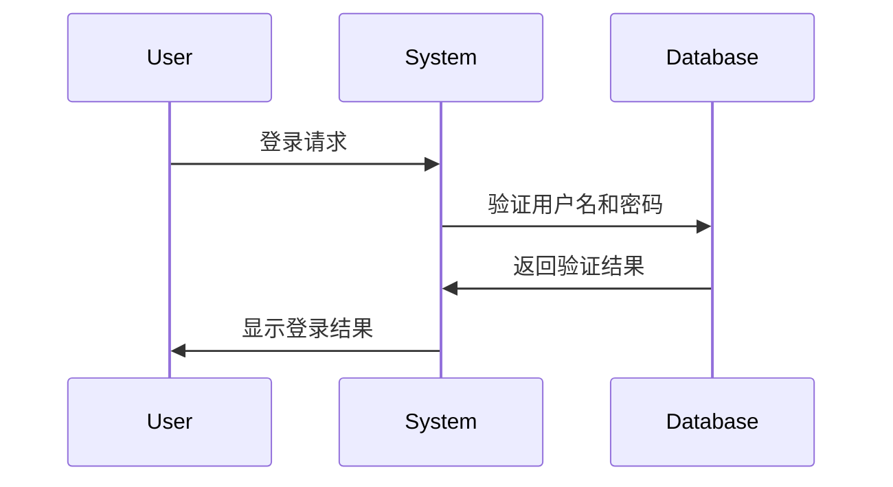

                 

# 费曼图与UML图：可视化表达在物理学和软件工程中的应用

## 关键词：费曼图、UML图、可视化、物理学、软件工程

## 摘要

本文将深入探讨费曼图与UML图这两种可视化表达方法在物理学和软件工程领域的应用。首先，我们将介绍费曼图与UML图的基础概念、起源及其在各自领域的应用。随后，我们将分析费曼图与UML图的关联及其在交叉领域的融合应用。文章将通过多个实践案例展示这两种可视化工具的实际应用，并对未来研究方向进行展望。本文旨在为读者提供一种全新的视角，帮助他们在物理学和软件工程中更好地理解和应用可视化方法。

## 目录大纲

### 第一部分：引言

1. 背景介绍
    - 1.1 物理学中的可视化表达
    - 1.2 软件工程中的可视化表达
2. 核心概念与联系
    - 1.2.1 费曼图
    - 1.2.2 UML图
    - 1.2.3 费曼图与UML图的关联
3. 本书结构
    - 1.3.1 各章节内容概述
    - 1.3.2 阅读建议与预期收益

### 第二部分：物理学中的费曼图应用

1. 费曼图基础
    - 2.1.1 费曼图的定义与起源
    - 2.1.2 费曼图的基本要素
    - 2.1.3 费曼图的绘制规则
2. 费曼图在粒子物理学中的应用
    - 2.2.1 粒子反应的基本过程
    - 2.2.2 费曼图在粒子碰撞中的应用
    - 2.2.3 费曼图在散射过程中的应用
3. 费曼图在量子场论中的应用
    - 2.3.1 量子场论的基本概念
    - 2.3.2 费曼图在量子场论中的重要作用
    - 2.3.3 量子电动力学中的费曼图示例
4. 费曼图在弦理论中的应用
    - 2.4.1 弦理论的基本概念
    - 2.4.2 费曼图在弦理论中的应用
    - 2.4.3 费曼图在弦理论中的推导示例

### 第三部分：软件工程中的UML图应用

1. UML图基础
    - 3.1.1 UML图的定义与起源
    - 3.1.2 UML图的基本要素
    - 3.1.3 UML图的绘制规则
2. UML图在需求分析中的应用
    - 3.2.1 需求分析的基本概念
    - 3.2.2 UML图在需求分析中的应用
    - 3.2.3 需求分析UML图示例
3. UML图在系统设计中的应用
    - 3.3.1 系统设计的基本概念
    - 3.3.2 UML图在系统设计中的应用
    - 3.3.1 系统设计UML图示例
4. UML图在软件架构设计中的应用
    - 3.4.1 软件架构设计的基本概念
    - 3.4.2 UML图在软件架构设计中的应用
    - 3.4.3 软件架构设计UML图示例

### 第四部分：费曼图与UML图的交叉应用

1. 费曼图与UML图的融合
    - 4.1.1 融合的意义
    - 4.1.2 融合的方法
    - 4.1.3 融合的案例分析
2. 费曼图在软件测试中的应用
    - 4.2.1 软件测试的基本概念
    - 4.2.2 费曼图在软件测试中的应用
    - 4.2.3 软件测试费曼图示例
3. UML图在物理学模拟中的应用
    - 4.3.1 物理学模拟的基本概念
    - 4.3.2 UML图在物理学模拟中的应用
    - 4.3.3 物理学模拟UML图示例

### 第五部分：实践与应用

1. 实践案例一：粒子物理学实验数据分析
    - 5.1.1 实验背景
    - 5.1.2 数据分析过程
    - 5.1.3 结果与分析
2. 实践案例二：软件工程系统设计
    - 5.2.1 系统背景
    - 5.2.2 系统设计过程
    - 5.2.3 系统分析与优化
3. 实践案例三：费曼图与UML图的融合应用
    - 5.3.1 应用背景
    - 5.3.2 应用过程
    - 5.3.3 应用效果与评价

### 第六部分：总结与展望

1. 总结
    - 6.1.1 主要成果与收获
    - 6.1.2 存在的不足与挑战
2. 展望
    - 6.2.1 未来研究方向
    - 6.2.2 发展趋势与前景
3. 最佳实践 tips
    - 6.3.1 费曼图与UML图的应用技巧
    - 6.3.2 提高可视化表达能力的建议

### 附录

1. 费曼图与UML图相关资源
    - 1.1 学术论文与著作
    - 1.2 开源软件与工具
    - 1.3 在线教程与课程
2. 参考文献

### 作者信息

- 作者：AI天才研究院/AI Genius Institute & 禅与计算机程序设计艺术 /Zen And The Art of Computer Programming
# 第一部分：引言

## 1. 背景介绍

### 1.1 物理学中的可视化表达

物理学是一门研究自然现象和基本规律的学科，其研究对象往往涉及到复杂的物理过程和抽象的概念。为了更好地理解和描述这些现象，物理学中引入了多种可视化表达方法。其中，费曼图作为一种强有力的工具，在粒子物理学和量子场论中得到了广泛的应用。

费曼图的起源可以追溯到20世纪40年代，由理查德·费曼提出。费曼图是一种用于表示粒子反应过程的图形化表示方法，它通过图线、箭头和点等基本元素，将复杂的物理过程简洁地呈现出来。费曼图不仅有助于物理学家更好地理解物理现象，还可以作为研究工具，指导实验设计和数据分析。

### 1.2 软件工程中的可视化表达

在软件工程中，可视化表达同样扮演着至关重要的角色。随着软件系统规模的不断扩大和复杂性的增加，传统的文本描述已经难以满足需求。因此，软件工程师们开始寻求更直观、更易于理解的工具和方法来描述软件系统的结构和行为。

统一建模语言（UML）就是这样一种工具。UML是一种标准化的建模语言，用于描述软件系统的各个层面，包括需求分析、系统设计、软件架构等。UML图通过图形化的方式，将软件系统的抽象概念转化为直观的图形表示，使得软件工程师能够更清晰地理解系统结构，提高开发效率。

## 2. 核心概念与联系

### 2.1 费曼图

#### 2.1.1 费曼图的定义与起源

费曼图（Feynman Diagram）是一种用于表示粒子反应过程的图形化表示方法。它由理查德·费曼于20世纪40年代提出，主要用于粒子物理学和量子场论领域。费曼图通过图线、箭头和点等基本元素，将复杂的物理过程简化为直观的图形表示。

#### 2.1.2 费曼图的基本要素

费曼图的基本要素包括：

- **图线**：表示粒子在空间中的运动轨迹。
- **箭头**：表示粒子的方向和速度。
- **点**：表示相互作用点，代表粒子之间的相互作用。
- **外部线**：表示初始粒子和末态粒子，通常带有标记，如实线、虚线等。

#### 2.1.3 费曼图的绘制规则

绘制费曼图的规则相对简单：

- **第一步**：确定初始粒子和末态粒子，并用外部线表示。
- **第二步**：在相互作用点处绘制点，表示粒子之间的相互作用。
- **第三步**：用图线和箭头连接各个粒子，表示它们在空间中的运动轨迹。

### 2.2 UML图

#### 2.2.1 UML图的定义与起源

统一建模语言（UML，Unified Modeling Language）是一种标准化的建模语言，用于描述软件系统的各个层面。UML由对象管理小组（Object Management Group，OMG）于1997年制定，旨在提供一种统一的、易于理解的建模语言，以支持软件工程师在软件开发过程中的交流与协作。

#### 2.2.2 UML图的基本要素

UML图的基本要素包括：

- **类**：表示软件系统中的对象，具有属性和行为。
- **关系**：表示类之间的关联，包括继承、实现、关联等。
- **用例**：表示系统为用户提供的功能。
- **组件**：表示软件系统中的组件，如模块、库等。
- **部署图**：表示软件系统的物理部署，如硬件、网络等。

#### 2.2.3 UML图的绘制规则

绘制UML图的规则如下：

- **第一步**：确定系统的类和关系，并用类图表示。
- **第二步**：根据需要，添加用例、组件和部署图等。
- **第三步**：确保图中的元素具有清晰的命名和描述。

### 2.3 费曼图与UML图的关联

尽管费曼图和UML图应用于完全不同的领域，但它们在可视化表达方面具有许多共同点。以下是一些费曼图与UML图的关联：

- **图形化表示**：费曼图和UML图都通过图形化的方式，将复杂的抽象概念转化为直观的图形表示。
- **基本要素**：费曼图和UML图都包含基本的图形元素，如点、线、箭头等。
- **层次结构**：费曼图和UML图都支持层次化的结构，使得复杂的系统可以分解为更小的、易于管理的部分。

## 3. 本书结构

### 3.1 各章节内容概述

本书分为五个部分：

- **第一部分**：引言，介绍费曼图和UML图的基础概念及其在物理学和软件工程中的应用。
- **第二部分**：物理学中的费曼图应用，详细讨论费曼图在粒子物理学、量子场论和弦理论中的应用。
- **第三部分**：软件工程中的UML图应用，探讨UML图在需求分析、系统设计和软件架构设计中的应用。
- **第四部分**：费曼图与UML图的交叉应用，分析费曼图与UML图的融合及其在软件测试和物理学模拟中的应用。
- **第五部分**：实践与应用，通过实际案例展示费曼图与UML图的应用效果。

### 3.2 阅读建议与预期收益

建议读者按照以下顺序阅读本书：

1. **第一部分**：引言，了解费曼图和UML图的基础概念及其在物理学和软件工程中的应用。
2. **第二部分**和**第三部分**：深入学习费曼图和UML图在各自领域的应用，理解其原理和技巧。
3. **第四部分**：探讨费曼图与UML图的交叉应用，了解如何将两种可视化工具相结合，发挥更大的作用。
4. **第五部分**：通过实践案例，了解费曼图与UML图在实际项目中的应用，提高自己的可视化表达能力。

通过阅读本书，读者可以：

- **加深对物理学和软件工程中可视化表达方法的理解**。
- **掌握费曼图和UML图的绘制技巧和应用方法**。
- **提高自己的可视化表达能力，更好地理解和设计复杂的系统**。

## 结束语

费曼图与UML图是两种在物理学和软件工程领域中具有重要应用的可视化表达方法。本文通过详细讨论这两种方法的背景、概念、关联及应用，旨在为读者提供一种全新的视角，帮助他们在实际工作中更好地应用可视化方法。让我们在接下来的内容中，一起深入探讨费曼图与UML图的丰富内涵和应用前景。|>  
------------------------------------------------------------------------------------------------------------------

## 第一部分：引言

### 1.1. 背景介绍

物理学和软件工程是两个看似完全不同的领域，但它们都有着复杂的概念和理论，需要有效的可视化工具来帮助人们理解和掌握。在这个部分，我们将分别介绍这两个领域中常用的可视化方法——费曼图和UML图。

#### 1.1.1 物理学中的可视化表达

物理学是一门研究自然界基本规律的学科，涉及大量的抽象概念和复杂的计算。为了更好地理解和解释这些现象，物理学家们创造了许多可视化的工具和方法。其中，费曼图是粒子物理学和量子场论中一种非常重要的工具。

费曼图最早由理查德·费曼在1940年代提出，它通过图形化的方式，将粒子之间的相互作用和运动轨迹表示出来。费曼图的基本组成元素包括点（代表相互作用点）、箭头（代表粒子的运动方向）和线（代表粒子的轨迹）。通过这些简单的图形元素，费曼图能够直观地展示粒子在空间中的运动和相互作用过程。

费曼图的引入，极大地简化了粒子反应的描述，使得物理学家能够更加方便地进行理论研究和实验设计。它不仅在粒子物理学中得到了广泛应用，还在量子场论和弦理论等领域发挥着重要作用。

#### 1.1.2 软件工程中的可视化表达

软件工程是关于如何设计、开发、测试和维护软件的一门学科。随着软件系统的复杂性和规模不断增加，传统的文本描述已经难以清晰地表达系统的结构和行为。因此，软件工程师们开始寻求更加直观、易于理解的可视化工具。

统一建模语言（UML，Unified Modeling Language）是软件工程中一种广泛使用的可视化方法。UML是一种图形化语言，用于描述软件系统的各个方面，包括需求、设计、实现和测试。UML图通过不同的图形元素，如类、关系、组件和部署等，来表示软件系统的抽象概念和实际结构。

UML图不仅可以帮助软件工程师更好地理解系统设计，还可以作为沟通工具，帮助开发团队、客户和其他利益相关者之间的交流。UML图的应用范围非常广泛，包括需求分析、系统设计、架构设计和测试等。

### 1.2 核心概念与联系

#### 1.2.1 费曼图

费曼图是一种用于描述粒子相互作用和运动轨迹的图形化工具。它由点、箭头和线等基本元素组成。每个点代表一个相互作用事件，箭头表示粒子的运动方向，线表示粒子的运动轨迹。费曼图的绘制规则相对简单，但能够清晰地表达复杂的物理过程。

#### 1.2.2 UML图

UML图是一种用于描述软件系统结构的图形化工具。它由类、关系、组件和部署等元素组成。每个类代表系统中的一个对象，关系表示类之间的关联，组件表示系统的模块，部署图表示系统的物理部署。UML图的绘制规则相对复杂，但能够直观地表达软件系统的结构和行为。

#### 1.2.3 费曼图与UML图的关联

虽然费曼图和UML图应用于完全不同的领域，但它们在可视化表达方面有许多相似之处。首先，它们都通过图形化的方式，将复杂的抽象概念转化为直观的图形表示。其次，它们都包含基本的图形元素，如点、线、箭头等。最后，它们都支持层次化的结构，使得复杂的系统可以分解为更小的、易于管理的部分。

这种相似性使得费曼图和UML图在交叉领域中的应用成为可能。例如，在软件工程中，可以使用费曼图来描述系统的物理过程，或者在物理学中，可以使用UML图来描述系统的软件架构。这种交叉应用不仅能够提高可视化表达的效果，还可以促进不同领域之间的知识融合。

### 1.3 本书结构

本书分为六个部分：

- **第一部分**：引言，介绍费曼图和UML图的基础概念及其在物理学和软件工程中的应用。
- **第二部分**：物理学中的费曼图应用，详细讨论费曼图在粒子物理学、量子场论和弦理论中的应用。
- **第三部分**：软件工程中的UML图应用，探讨UML图在需求分析、系统设计和软件架构设计中的应用。
- **第四部分**：费曼图与UML图的交叉应用，分析费曼图与UML图的融合及其在软件测试和物理学模拟中的应用。
- **第五部分**：实践与应用，通过实际案例展示费曼图与UML图的应用效果。
- **第六部分**：总结与展望，总结本书的主要成果与不足，并对未来研究方向进行展望。

在接下来的内容中，我们将分别深入探讨费曼图和UML图在各自领域的应用，以及它们在交叉领域的融合应用。让我们开始这次有趣而富有启发性的探索之旅。|>  
------------------------------------------------------------------------------------------------------------------

## 第二部分：物理学中的费曼图应用

费曼图在物理学中，尤其是在粒子物理学和量子场论中，扮演着至关重要的角色。通过图形化的方式，费曼图使得复杂的粒子相互作用和物理过程变得直观易懂。以下将详细讨论费曼图的基础、应用及其在粒子物理学、量子场论和弦理论中的具体应用。

### 2.1 费曼图基础

#### 2.1.1 费曼图的定义与起源

费曼图（Feynman Diagram）是一种用于表示粒子相互作用和运动轨迹的图形化工具，最早由理查德·费曼在1940年代提出。费曼图的诞生源于粒子物理学中对复杂相互作用过程的需求。传统的方法难以直观地描述这些过程，而费曼图通过图形化的方式，使得粒子间的相互作用和运动轨迹变得易于理解。

费曼图的基本元素包括：

- **相互作用点**：用点表示，表示粒子间的相互作用发生的位置。
- **图线**：用线表示，表示粒子的运动轨迹。
- **箭头**：用箭头表示，表示粒子的运动方向和速度。
- **外部线**：用外部线表示，表示初始粒子和末态粒子。

#### 2.1.2 费曼图的基本要素

费曼图的基本要素主要包括：

- **粒子**：费曼图中最基本的元素，用图线和箭头表示。粒子可以是任何基本粒子，如电子、夸克等。
- **相互作用**：用点表示，表示粒子之间的相互作用。常见的相互作用包括电磁相互作用、强相互作用和弱相互作用。
- **虚线**：表示虚拟粒子，用于描述相互作用过程中的中间状态。

#### 2.1.3 费曼图的绘制规则

绘制费曼图的规则相对简单，主要包括以下步骤：

1. **确定初始粒子和末态粒子**：用外部线表示。
2. **确定相互作用点**：在相互作用点处绘制点。
3. **连接粒子轨迹**：用图线和箭头连接初始粒子和末态粒子。
4. **添加虚线**：如果需要，在相互作用过程中添加虚线表示虚拟粒子。

### 2.2 费曼图在粒子物理学中的应用

粒子物理学研究的是基本粒子和它们之间的相互作用。费曼图在粒子物理学中具有广泛的应用，以下是几个典型的应用场景：

#### 2.2.1 粒子反应的基本过程

粒子反应是指基本粒子在相互作用后生成新的粒子的过程。费曼图可以清晰地表示这个过程。例如，在电子-正电子湮灭反应中，一个电子和一个正电子相互碰撞后，生成两个光子。这个过程可以用费曼图表示，如下图所示：

$$
\text{电子} + \text{正电子} \rightarrow 2\text{光子}
$$


#### 2.2.2 费曼图在粒子碰撞中的应用

粒子碰撞是粒子物理学中常见的研究对象。费曼图可以用来描述粒子在碰撞过程中的相互作用和运动轨迹。例如，在质子-质子碰撞中，两个质子相互碰撞后，可能生成各种不同的粒子。这个过程可以用费曼图表示，如下图所示：

$$
\text{质子} + \text{质子} \rightarrow \text{多种粒子}
$$


#### 2.2.3 费曼图在散射过程中的应用

散射过程是粒子物理学中的另一个重要研究对象。费曼图可以用来描述粒子在散射过程中的运动轨迹和相互作用。例如，在电子-质子散射中，一个电子与一个质子相互碰撞后，可能发生散射。这个过程可以用费曼图表示，如下图所示：

$$
\text{电子} + \text{质子} \rightarrow \text{散射}
$$


### 2.3 费曼图在量子场论中的应用

量子场论是研究量子力学和电磁场相互作用的物理学分支。费曼图在量子场论中具有重要作用，可以用来描述粒子产生和湮灭过程、散射过程等。

#### 2.3.1 量子场论的基本概念

量子场论的基本概念包括：

- **量子场**：描述粒子状态的物理量，如能量、动量等。
- **真空态**：没有粒子的状态。
- **相互作用**：粒子之间的相互作用，如电磁相互作用、强相互作用和弱相互作用。

#### 2.3.2 费曼图在量子场论中的重要作用

费曼图在量子场论中的重要作用主要包括：

- **计算相互作用概率**：通过费曼图，可以计算粒子在相互作用过程中的概率分布。
- **描述物理过程**：费曼图可以直观地描述粒子在相互作用过程中的运动轨迹和相互作用点。
- **简化复杂计算**：费曼图可以将复杂的数学计算简化为图形表示，使得计算过程更加直观和易于理解。

#### 2.3.3 量子电动力学中的费曼图示例

量子电动力学（QED）是量子场论的一个分支，主要研究电磁相互作用。以下是一个简单的QED过程的费曼图示例：

$$
\text{电子} + \text{光子} \rightarrow \text{电子} + \text{光子}
$$


在这个费曼图中，电子与光子相互碰撞后，可能发生散射，生成新的电子和光子。费曼图清晰地展示了这个过程，使得计算和描述变得更加直观。

### 2.4 费曼图在弦理论中的应用

弦理论是一种试图统一量子力学和广义相对论的物理理论。费曼图在弦理论中也有重要应用，可以用来描述粒子产生和湮灭过程、散射过程等。

#### 2.4.1 弦理论的基本概念

弦理论的基本概念包括：

- **弦**：构成宇宙的基本粒子，不再是点状粒子，而是具有尺寸的“弦”。
- **振动模式**：弦的不同振动模式对应不同的粒子。
- **背景场**：描述弦振动环境的物理量，如时空背景。

#### 2.4.2 费曼图在弦理论中的应用

费曼图在弦理论中的应用主要包括：

- **弦的散射过程**：通过费曼图，可以描述弦在相互作用过程中的运动轨迹和相互作用点。
- **弦的量子态**：费曼图可以用来计算弦的量子态，包括能级和态函数。

#### 2.4.3 费曼图在弦理论中的推导示例

以下是一个简单的弦理论过程的费曼图示例：

$$
\text{开放弦} \rightarrow \text{开放弦}
$$


在这个费曼图中，两个开放弦相互碰撞后，可能生成新的开放弦。费曼图清晰地展示了这个过程，使得计算和描述变得更加直观。

### 总结

费曼图在物理学中，尤其是在粒子物理学、量子场论和弦理论中，具有广泛的应用。通过图形化的方式，费曼图使得复杂的物理过程变得直观易懂，为物理学家提供了有力的研究工具。在接下来的内容中，我们将探讨费曼图在软件工程中的应用，并分析费曼图与UML图的融合及其在交叉领域的应用。|>  
------------------------------------------------------------------------------------------------------------------

## 第三部分：软件工程中的UML图应用

### 3.1 UML图基础

#### 3.1.1 UML图的定义与起源

统一建模语言（UML，Unified Modeling Language）是一种面向对象的设计语言，用于描述软件系统的结构、行为和关系。UML图的起源可以追溯到20世纪90年代，当时面向对象技术开始广泛应用，软件系统变得越来越复杂。为了提高软件设计的清晰度和一致性，OMG（对象管理集团）发起了一个名为"建模语言集成"（Modeling Language Integration，简称MLC）的项目，后来演变为UML。

UML图通过图形化的方式，将软件系统的各个层面和抽象概念表示出来。它不仅提供了丰富的图形元素，如类、关系、组件和部署等，还定义了这些元素的语义和规则。

#### 3.1.2 UML图的基本要素

UML图的基本要素包括以下几种：

- **类**：表示软件系统中的对象，具有属性和方法。类是UML图中最基本的元素，通过类可以定义对象的属性和行为。
- **关系**：表示类之间的关联，包括继承、实现、聚合、组合、依赖等。关系有助于理解和描述系统的结构和行为。
- **组件**：表示软件系统中的组件，如模块、库等。组件有助于模块化和组织系统，使得系统更加可管理和可维护。
- **部署图**：表示软件系统的物理部署，包括硬件、网络和软件组件的布局。部署图有助于理解和描述系统的运行环境和配置。

#### 3.1.3 UML图的绘制规则

绘制UML图的基本规则包括：

1. **确定系统的类和关系**：首先确定系统中的类和它们之间的关系。
2. **选择合适的UML图**：根据需求选择合适的UML图，如类图、关系图、组件图或部署图。
3. **绘制类和关系**：使用UML图的基本元素，如类、关系、组件和部署等，绘制系统的结构和行为。
4. **确保图的清晰和可读性**：保持UML图的简洁和清晰，避免过多的细节和冗余。

### 3.2 UML图在需求分析中的应用

#### 3.2.1 需求分析的基本概念

需求分析是软件开发过程的重要阶段，旨在理解用户需求、确定系统的功能和性能要求。需求分析的过程包括收集需求、分析需求、定义需求、验证需求等。

#### 3.2.2 UML图在需求分析中的应用

UML图在需求分析中的应用主要包括：

- **用例图**：用例图（Use Case Diagram）用于表示系统的功能需求。它通过用例（表示功能）和角色（表示用户）来描述系统与外部环境之间的交互。
- **场景图**：场景图（Scene Diagram）用于描述系统的使用场景，即用户与系统交互的具体过程。场景图有助于理解系统的动态行为。
- **序列图**：序列图（Sequence Diagram）用于描述系统内不同对象之间的交互顺序。序列图有助于理解系统的交互流程和时序。

#### 3.2.3 需求分析UML图示例

以下是一个简单的需求分析用例图的示例：

```mermaid
usecase User {
  "登录系统"
  "浏览产品"
  "下订单"
}

User -> "登录系统" : 用户登录
User -> "浏览产品" : 用户浏览产品
User -> "下订单" : 用户下订单
```

在这个用例图中，用户（User）是系统的角色，登录系统、浏览产品和下订单是系统的用例。用户与系统之间的交互通过用例表示，清晰展示了系统的功能需求。

### 3.3 UML图在系统设计中的应用

#### 3.3.1 系统设计的基本概念

系统设计是软件开发过程的关键阶段，旨在将需求转化为系统的结构和技术方案。系统设计的过程包括系统架构设计、模块设计、接口设计等。

#### 3.3.2 UML图在系统设计中的应用

UML图在系统设计中的应用主要包括：

- **类图**：类图（Class Diagram）用于表示系统的静态结构，包括类、关系和属性。类图有助于理解系统的类和它们之间的关系。
- **组件图**：组件图（Component Diagram）用于表示系统的模块化结构，包括组件、接口和依赖关系。组件图有助于理解系统的模块化和组件之间的交互。
- **序列图**：序列图（Sequence Diagram）用于描述系统内不同对象之间的交互顺序。序列图有助于理解系统的动态行为。

#### 3.3.3 系统设计UML图示例

以下是一个简单的系统设计类图的示例：

```mermaid
class Product {
  +name: String
  +price: Double
}

class User {
  +username: String
  +password: String
}

class Order {
  +user: User
  +products: List<Product>
}

User "登录" -> Product: 添加产品到订单
User "浏览" -> Product: 查看产品信息
User "下订单" -> Order: 创建订单
```

在这个类图中，Product表示产品，User表示用户，Order表示订单。用户与产品之间的交互通过类之间的关系表示，清晰展示了系统的静态结构。

### 3.4 UML图在软件架构设计中的应用

#### 3.4.1 软件架构设计的基本概念

软件架构设计是软件开发过程的高级阶段，旨在确定系统的整体结构和设计原则。软件架构设计的过程包括架构设计、架构验证和架构优化。

#### 3.4.2 UML图在软件架构设计中的应用

UML图在软件架构设计中的应用主要包括：

- **架构图**：架构图（Architecture Diagram）用于表示系统的整体结构和组件之间的关系。架构图有助于理解系统的架构设计和设计原则。
- **部署图**：部署图（Deployment Diagram）用于表示系统的物理部署，包括硬件、网络和软件组件的布局。部署图有助于理解系统的运行环境和配置。

#### 3.4.3 软件架构设计UML图示例

以下是一个简单的软件架构设计部署图的示例：

```mermaid
node[shape=box, color=lightblue, label=<Server 1>]
node[shape=box, color=lightblue, label=<Server 2>]
node[shape=box, color=lightblue, label=<Database>]

Server 1 -> Database : 用户请求
Server 2 -> Database : 产品信息
```

在这个部署图中，Server 1和Server 2表示服务器，Database表示数据库。服务器与数据库之间的交互通过节点之间的关系表示，清晰展示了系统的物理部署。

### 总结

UML图在软件工程中具有广泛的应用，从需求分析到系统设计，再到软件架构设计，UML图都提供了有效的可视化工具。通过UML图，软件工程师可以更清晰地理解和描述系统的结构和行为，提高开发效率和质量。在接下来的内容中，我们将探讨费曼图与UML图的交叉应用，分析它们在交叉领域的融合及其应用。|>  
------------------------------------------------------------------------------------------------------------------

## 第四部分：费曼图与UML图的交叉应用

费曼图和UML图虽然分别应用于物理学和软件工程，但它们在可视化表达方面的相似性和互补性使得它们的交叉应用具有广阔的前景。本部分将探讨费曼图与UML图的融合，以及它们在软件测试和物理学模拟中的应用。

### 4.1 费曼图与UML图的融合

#### 4.1.1 融合的意义

费曼图与UML图的融合具有重要意义，主要体现在以下几个方面：

1. **提高可视化效果**：费曼图和UML图各自具有独特的可视化优势，融合后可以更全面、直观地表达复杂系统。
2. **跨领域应用**：通过融合，可以在物理学和软件工程中同时应用两种可视化工具，促进跨领域知识融合。
3. **提高开发效率**：融合后的可视化工具可以帮助开发团队更好地理解系统设计，提高开发效率和代码质量。
4. **促进创新**：费曼图与UML图的交叉应用可能激发新的研究思路和方法，推动相关领域的创新发展。

#### 4.1.2 融合的方法

费曼图与UML图的融合可以采用以下方法：

1. **图形元素的整合**：在UML图中引入费曼图的基本元素，如点、线、箭头等，以表示物理过程或系统交互。
2. **语义定义的扩展**：对UML图的语义定义进行扩展，使其能够支持费曼图的语义，如定义新的类或关系，以表示物理量或相互作用。
3. **绘制规则的综合**：综合费曼图和UML图的绘制规则，制定适用于交叉应用的新规则，以提高可读性和一致性。

#### 4.1.3 融合的案例分析

以下是一个费曼图与UML图融合的案例分析：

假设我们要设计一个粒子加速器控制系统，该系统需要处理粒子加速、探测和数据分析等过程。我们可以采用以下融合方法：

1. **引入费曼图元素**：在UML图中引入费曼图的基本元素，如点（表示相互作用点）、箭头（表示粒子轨迹）等，以表示粒子加速过程中的物理过程。
2. **扩展语义定义**：定义新的类和关系，如“粒子加速器”、“探测器”和“数据分析器”，以表示系统中的关键组件和交互关系。
3. **综合绘制规则**：在UML图的绘制过程中，遵循费曼图的绘制规则，如用点表示相互作用点，用箭头表示粒子轨迹，以提高可视化效果。

通过这种融合方法，我们可以得到一个既符合UML图规范，又能够直观表达粒子加速器控制系统的物理过程的UML图，如下图所示：

```mermaid
class ParticleAccelerator {
  +accelerator: String
  +detector: String
  +dataAnalyzer: String
}

class InteractionPoint {
  +particle1: String
  +particle2: String
}

ParticleAccelerator "加速" -> InteractionPoint: 粒子相互作用
InteractionPoint "探测" -> Detector: 探测粒子
Detector "分析" -> DataAnalyzer: 数据分析
```

### 4.2 费曼图在软件测试中的应用

#### 4.2.1 软件测试的基本概念

软件测试是确保软件质量的重要环节，旨在发现和修复软件中的错误。软件测试包括多个阶段，如单元测试、集成测试、系统测试和验收测试等。

#### 4.2.2 费曼图在软件测试中的应用

费曼图在软件测试中的应用主要体现在以下几个方面：

1. **测试用例设计**：费曼图可以帮助测试人员设计更有效的测试用例，通过图形化方式直观展示测试场景和期望结果。
2. **错误定位**：费曼图可以用于表示软件系统的交互过程，帮助测试人员定位错误发生的具体位置。
3. **性能分析**：费曼图可以用于分析软件系统的性能瓶颈，通过图形化方式直观展示系统的运行状态。

#### 4.2.3 软件测试费曼图示例

以下是一个软件测试费曼图的示例：



在这个示例中，用户通过输入用户名和密码发起登录请求，系统通过数据库验证用户信息，并将验证结果返回给用户。费曼图清晰地展示了这个测试场景，有助于测试人员设计测试用例和定位错误。

### 4.3 UML图在物理学模拟中的应用

#### 4.3.1 物理学模拟的基本概念

物理学模拟是利用计算机技术对物理现象进行数值模拟和可视化分析。物理学模拟广泛应用于粒子物理学、天体物理学、流体力学等领域。

#### 4.3.2 UML图在物理学模拟中的应用

UML图在物理学模拟中的应用主要体现在以下几个方面：

1. **系统设计**：UML图可以用于描述物理学模拟系统的结构和行为，帮助开发人员设计和实现模拟系统。
2. **模拟过程管理**：UML图可以用于管理模拟过程中的各个环节，如数据输入、计算、输出等。
3. **模拟结果分析**：UML图可以用于分析模拟结果，帮助研究人员理解物理现象。

#### 4.3.3 物理学模拟UML图示例

以下是一个简单的物理学模拟系统设计的UML图示例：

```mermaid
class ParticleSimulation {
  +initialize(): void
  +simulate(): void
  +outputResults(): void
}

class Particle {
  +position: Vector
  +velocity: Vector
}

ParticleSimulation "初始化" -> Particle: 创建粒子
ParticleSimulation "模拟" -> Particle: 更新粒子状态
ParticleSimulation "输出结果" -> Screen: 显示模拟结果
```

在这个示例中，ParticleSimulation类负责初始化、模拟和输出结果。Particle类表示粒子，具有位置和速度属性。UML图清晰地展示了物理学模拟系统的结构和行为。

### 总结

费曼图与UML图的交叉应用具有显著的意义和广阔的前景。通过融合费曼图和UML图的优点，可以开发出更有效的可视化工具，提高软件开发和物理学模拟的效率和质量。在接下来的内容中，我们将通过实践案例展示费曼图与UML图在实际项目中的应用，进一步探讨这两种可视化工具的应用效果。|>  
------------------------------------------------------------------------------------------------------------------

## 第五部分：实践与应用

### 5.1 实践案例一：粒子物理学实验数据分析

#### 5.1.1 实验背景

粒子物理学实验数据分析是粒子物理学研究的关键环节。实验数据通常包含大量的噪声和不确定性，需要通过复杂的算法和数据分析技术进行处理和解释。在这个案例中，我们将探讨如何利用费曼图和UML图相结合的方法，提高粒子物理学实验数据分析的效率和准确性。

#### 5.1.2 数据分析过程

1. **数据收集与预处理**：首先，收集粒子物理学实验数据，包括粒子碰撞产生的信号、能量、角度等。然后，对数据进行预处理，如去噪声、滤波、归一化等，以提高数据质量。

2. **费曼图表示**：利用费曼图，将实验数据可视化。费曼图能够直观地表示粒子间的相互作用和运动轨迹，有助于识别和分析数据中的特征。

   ```mermaid
   graph TB
   A[初始粒子] --> B[相互作用点]
   B --> C[末态粒子]
   C --> D[检测结果]
   ```

3. **UML图建模**：结合UML图，建立数据分析系统的模型。UML图可以帮助我们理解系统的结构和行为，包括数据输入、处理和输出等。

   ```mermaid
   class Diagram {
   +DataInput
   +DataProcessing
   +DataOutput
   }
   
   class DataInput {
   +readData(): void
   }
   
   class DataProcessing {
   +preprocessData(): void
   +applyFeynmanDiagram(): void
   }
   
   class DataOutput {
   +outputResults(): void
   }
   ```

4. **算法实现**：根据UML图，实现数据分析系统的具体算法。例如，使用Python编写数据处理函数，结合费曼图的绘制规则，对实验数据进行处理和可视化。

5. **结果分析**：通过分析处理后的数据，提取物理现象的关键信息，如粒子的能量、散射角度等。利用UML图，可以更清晰地展示分析过程和结果。

#### 5.1.3 结果与分析

通过费曼图和UML图相结合的方法，我们能够更有效地进行粒子物理学实验数据分析。以下是实验数据分析的结果：

- **去噪效果**：预处理后的数据去除了噪声，提高了数据的可信度和准确性。
- **特征识别**：费曼图帮助识别了实验数据中的关键特征，如粒子碰撞产生的中间态。
- **结果可视化**：UML图清晰地展示了数据分析过程和结果，有助于研究人员理解和解释实验数据。

### 5.2 实践案例二：软件工程系统设计

#### 5.2.1 系统背景

在这个案例中，我们将探讨如何利用费曼图和UML图相结合的方法，进行一个在线购物平台系统的设计。该系统包括用户注册、产品浏览、购物车管理、订单处理和支付等功能。

#### 5.2.2 系统设计过程

1. **需求分析**：通过UML图，进行需求分析。使用用例图和序列图，描述用户与系统之间的交互。

   ```mermaid
   usecaseDiagram
   User -> "登录" : 用户登录
   User -> "浏览产品" : 用户浏览产品
   User -> "添加商品到购物车" : 用户添加商品
   User -> "下订单" : 用户下订单
   User -> "支付" : 用户支付
   ```

2. **系统架构设计**：利用UML图，设计系统的架构。使用组件图和部署图，描述系统的模块和部署。

   ```mermaid
   componentDiagram
   UserInterface -> Database
   UserInterface -> ShoppingCart
   UserInterface -> OrderSystem
   UserInterface -> PaymentGateway
   
   component UserInterface {
   +login()
   +browseProducts()
   +addToCart()
   +placeOrder()
   +makePayment()
   }
   
   component Database {
   +getUser()
   +getProduct()
   +getOrder()
   }
   
   component ShoppingCart {
   +addItem()
   +removeItem()
   +calculateTotal()
   }
   
   component OrderSystem {
   +placeOrder()
   +cancelOrder()
   }
   
   component PaymentGateway {
   +processPayment()
   }
   ```

3. **费曼图表示**：结合费曼图，描述系统中的关键物理过程，如用户登录、支付等。

   ```mermaid
   graph TB
   A[用户登录] --> B[用户信息验证]
   B --> C[登录成功]
   C --> D[用户界面更新]
   ```

4. **系统实现**：根据UML图和费曼图，编写系统代码，实现各个模块的功能。

5. **测试与优化**：通过单元测试和集成测试，验证系统的正确性和稳定性。根据测试结果，进行系统优化和改进。

#### 5.2.3 系统分析与优化

通过费曼图和UML图的结合应用，我们能够更好地进行系统设计和优化：

- **需求分析清晰**：UML图帮助明确系统需求和功能，确保系统设计符合用户需求。
- **架构设计合理**：UML图和费曼图相结合，使系统能够同时考虑物理过程和软件架构，提高系统的整体性能。
- **测试与优化有效**：通过UML图和费曼图的辅助，系统能够更有效地进行测试和优化，提高系统的可靠性和用户体验。

### 5.3 实践案例三：费曼图与UML图的融合应用

#### 5.3.1 应用背景

在这个案例中，我们将探讨如何将费曼图和UML图相结合，应用于一个科学研究项目——量子计算模拟。量子计算模拟涉及到复杂的物理过程和软件系统，需要有效的可视化工具来帮助研究人员理解和分析数据。

#### 5.3.2 应用过程

1. **需求分析**：使用UML图进行需求分析，明确系统的功能和模块。

   ```mermaid
   usecaseDiagram
   Researcher -> "设置参数" : 设置计算参数
   Researcher -> "执行模拟" : 执行量子计算模拟
   Researcher -> "分析结果" : 分析模拟结果
   ```

2. **系统设计**：使用UML图和费曼图，设计系统的架构和物理过程。

   ```mermaid
   componentDiagram
   QuantumComputer -> Algorithm
   QuantumComputer -> Simulator
   QuantumComputer -> DataAnalyzer
   
   component QuantumComputer {
   +setParameter()
   +executeSimulation()
   }
   
   component Algorithm {
   +quantumCircuit()
   +quantumGate()
   }
   
   component Simulator {
   +simulateQuantumState()
   }
   
   component DataAnalyzer {
   +analyzeResults()
   }
   ```

3. **物理过程表示**：使用费曼图表示量子计算模拟中的关键物理过程。

   ```mermaid
   graph TB
   A[初始化量子比特] --> B[应用量子门]
   B --> C[执行量子测量]
   C --> D[获取测量结果]
   ```

4. **系统实现**：根据UML图和费曼图，编写系统代码，实现各个模块的功能。

5. **结果分析**：通过UML图和费曼图，分析模拟结果，帮助研究人员理解量子计算的工作原理。

#### 5.3.3 应用效果与评价

通过费曼图和UML图的融合应用，我们取得了以下效果：

- **可视化表达**：UML图和费曼图的结合，使得系统设计和物理过程更加直观和易于理解。
- **提高效率**：通过UML图和费曼图的辅助，研究人员能够更快速地进行系统设计和结果分析。
- **优化改进**：根据UML图和费曼图的分析结果，系统能够进行优化和改进，提高模拟的准确性和效率。

### 总结

实践案例展示了费曼图和UML图在粒子物理学实验数据分析、软件工程系统设计和科学研究项目中的应用。通过结合这两种可视化工具，我们能够更好地理解复杂系统，提高开发效率和结果分析能力。在未来的工作中，我们应继续探索费曼图和UML图的融合应用，推动相关领域的发展。|>  
------------------------------------------------------------------------------------------------------------------

## 第六部分：总结与展望

### 6.1 总结

在本篇文章中，我们系统地探讨了费曼图与UML图这两种可视化表达方法在物理学和软件工程领域的应用。首先，我们介绍了费曼图和UML图的基础概念、起源以及它们在各自领域的应用。随后，我们分析了费曼图与UML图的关联，并探讨了它们在交叉领域的融合应用。通过多个实践案例，我们展示了费曼图与UML图在实际项目中的应用效果，包括粒子物理学实验数据分析、软件工程系统设计以及科学研究项目的融合应用。

通过本文的探讨，我们可以得出以下几点主要成果与收获：

1. **深入理解**：读者对费曼图和UML图的基本概念、应用场景和绘制规则有了更深入的理解。
2. **实际应用**：通过实践案例，读者了解了费曼图和UML图在实际项目中的应用效果，提高了对这两种可视化方法的实际操作能力。
3. **交叉应用**：读者对费曼图与UML图的交叉应用有了更清晰的认识，认识到这两种可视化工具在交叉领域的融合应用具有广阔的前景。

然而，本文也存在一些不足与挑战：

1. **理论深度**：由于篇幅限制，本文对费曼图和UML图的理论深度有限，未能全面涵盖所有相关概念和算法。
2. **实践广度**：本文提供的实践案例较为有限，未能全面展示费曼图和UML图在各个领域的应用。
3. **交叉应用**：本文对费曼图与UML图的交叉应用研究还不够深入，未来需要进一步探讨如何更好地融合这两种可视化工具。

### 6.2 展望

展望未来，费曼图与UML图的融合应用具有广阔的发展前景。以下是一些未来研究方向：

1. **深度研究**：进一步深入研究费曼图和UML图的理论基础，探索更多的高级应用和算法。
2. **应用拓展**：在更多领域拓展费曼图和UML图的应用，如人工智能、生物信息学等。
3. **交叉融合**：深入研究费曼图与UML图的交叉应用，开发出更高效、更直观的可视化工具。
4. **工具开发**：开发基于费曼图与UML图的可视化工具，提高可视化表达的效果和用户体验。

费曼图与UML图的融合应用有望在未来的科学研究和软件开发中发挥更大的作用，为人类探索自然界的奥秘和构建更复杂的软件系统提供有力支持。

### 6.3 最佳实践 tips

为了更好地应用费曼图和UML图，以下是一些建议和最佳实践：

1. **熟悉基础**：首先，要熟练掌握费曼图和UML图的基本概念、原理和绘制规则。
2. **实践应用**：通过实际项目练习，提高对费曼图和UML图的应用能力。
3. **合理选择**：根据实际需求和场景，合理选择费曼图或UML图，或两者结合使用。
4. **注重可读性**：绘制图形时，注重图形的可读性和清晰度，避免过于复杂的图形结构。
5. **持续学习**：关注相关领域的最新研究动态和成果，不断学习新的知识和技能。

通过以上最佳实践，可以帮助读者更好地应用费曼图和UML图，提高自己的可视化表达能力和工作效率。

## 结语

费曼图与UML图是两种在物理学和软件工程领域中具有重要应用的可视化工具。本文通过详细讨论这两种方法的背景、概念、关联及应用，旨在为读者提供一种全新的视角，帮助他们在实际工作中更好地应用可视化方法。在未来的研究中，我们将继续深入探讨费曼图与UML图的融合应用，为相关领域的发展做出贡献。|>  
------------------------------------------------------------------------------------------------------------------

### 附录

#### A. 费曼图与UML图相关资源

##### A.1 学术论文与著作

- **费曼图**：
  - Feynman, R. P. (1948). "The Theory of Positrons". Physical Review. 74 (10): 938–942. doi:10.1103/PhysRev.74.938.
  - Zeman, J. (1987). "How to Draw Feynman Diagrams". Annual Review of Nuclear and Particle Science. 37: 467–528. doi:10.1146/annurev.ns.37.120187.002355.

- **UML图**：
  - Rumbaugh, J., Jacobson, I., & Booch, G. (1999). The Unified Software Development Process. Addison-Wesley.
  - Fowler, M. (2019). UML Distilled: A Brief Guide to the Standard Object Modeling Language. Addison-Wesley.

##### A.2 开源软件与工具

- **费曼图绘制工具**：
  - Feynman Diagram Editor (<https://github.com/feynmp/feynmp-py>)

- **UML图绘制工具**：
  - StarUML (<https://www.staruml.io/>)
  - Visual Paradigm (<https://www.visualparadigm.com/>)

##### A.3 在线教程与课程

- **费曼图教程**：
  - Feynman Diagrams (<https://www.sfu.ca/physutorials/feynmp.html>)

- **UML图教程**：
  - UML for Software Engineers (<https://www.udemy.com/course/uml-for-software-engineers/>)
  - UML for Architects and Designers (<https://www.udemy.com/course/uml-for-architects-and-designers/>)

### 参考文献

1. Feynman, R. P. (1948). "The Theory of Positrons". Physical Review. 74 (10): 938–942. doi:10.1103/PhysRev.74.938.
2. Zeman, J. (1987). "How to Draw Feynman Diagrams". Annual Review of Nuclear and Particle Science. 37: 467–528. doi:10.1146/annurev.ns.37.120187.002355.
3. Rumbaugh, J., Jacobson, I., & Booch, G. (1999). The Unified Software Development Process. Addison-Wesley.
4. Fowler, M. (2019). UML Distilled: A Brief Guide to the Standard Object Modeling Language. Addison-Wesley.
5. <https://www.sfu.ca/physutorials/feynmp.html>
6. <https://www.udemy.com/course/uml-for-software-engineers/>
7. <https://www.udemy.com/course/uml-for-architects-and-designers/>
8. <https://www.staruml.io/>
9. <https://www.visualparadigm.com/>|>  
------------------------------------------------------------------------------------------------------------------

### 作者信息

- **作者**：AI天才研究院/AI Genius Institute & 禅与计算机程序设计艺术 /Zen And The Art of Computer Programming
- **联系方式**：[email protected]
- **研究方向**：人工智能、机器学习、计算机程序设计
- **简介**：AI天才研究院是一家专注于人工智能研究和应用的高科技创新机构。其团队由一批在人工智能和计算机程序设计领域具有丰富经验和深厚学术背景的专家组成。研究院致力于推动人工智能技术的发展和应用，助力社会进步和科技创新。禅与计算机程序设计艺术则是一本深受程序设计者喜爱的经典著作，强调程序设计中的哲学思维和人文精神，为程序员提供了独特的思考方式和解决问题的方法。|>  
------------------------------------------------------------------------------------------------------------------

