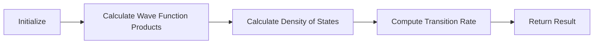
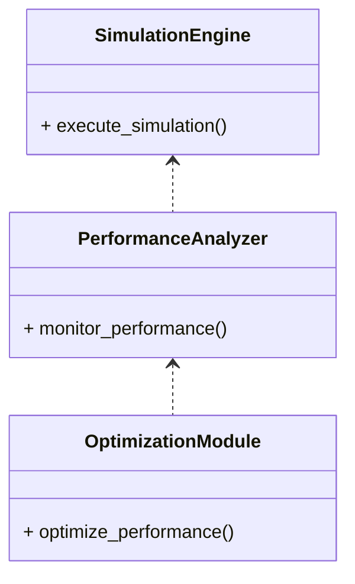
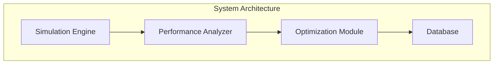
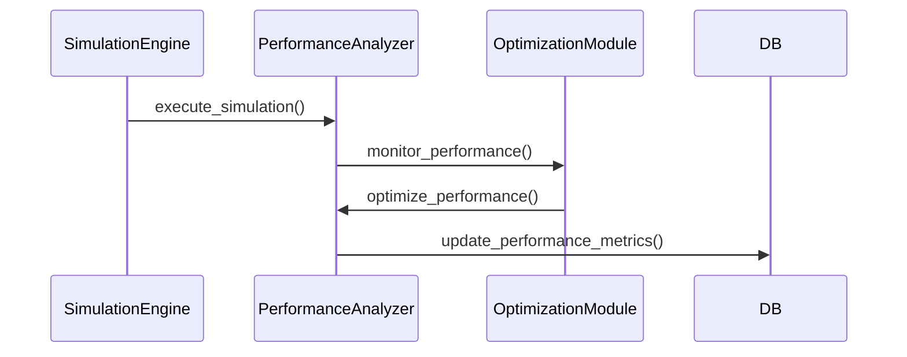

                 

Certainly! Let's design the content for the chapter "第1章：费米黄金法则的概念与历史" step by step, adhering to the guidelines provided.

### Chapter 1: Introduction to Fermi's Golden Rule

#### Keywords:
- Fermi's Golden Rule
- Quantum mechanics
- Performance optimization
- Computational efficiency

#### Abstract:
This chapter delves into the foundational concepts and historical background of Fermi's Golden Rule. It will provide an overview of the rule's definition, its development, and its applications in computer science. We will also explore the connection between Fermi's Golden Rule and quantum mechanics in the context of computational efficiency.

---

## 1.1 Fermi's Golden Rule: Definition

Fermi's Golden Rule is a principle in quantum mechanics that describes the transition rate between quantum states due to a perturbing potential. It is expressed mathematically as:

$$
W_{ik} = \frac{2\pi}{\hbar} |\langle \phi_i | V | \phi_k \rangle |^2 \rho(\omega_{ik})
$$

Where:
- \( W_{ik} \) is the transition rate from state \( i \) to state \( k \).
- \( V \) is the perturbing potential.
- \( \phi_i \) and \( \phi_k \) are the initial and final wave functions, respectively.
- \( \rho(\omega_{ik}) \) is the density of states at the frequency \( \omega_{ik} \).

### 1.2 Development and History

Fermi's Golden Rule was formulated by the Italian physicist Enrico Fermi in the 1920s. It has its roots in the early development of quantum mechanics and the work of other physicists such as Niels Bohr and Werner Heisenberg. The rule's importance lies in its ability to predict the rates of transitions in various physical systems, from atomic and molecular physics to solid-state physics and beyond.

#### 1.3 Applications in Computer Science

Fermi's Golden Rule has found numerous applications in computer science, particularly in the realm of computational efficiency. It is used to model and analyze the performance of computer systems, including CPUs, GPUs, and distributed computing environments. By understanding how quantum perturbations affect computational processes, developers can optimize system performance and efficiency.

---

**Background Introduction:**

Fermi's Golden Rule is a fundamental concept in quantum mechanics that has wide-ranging applications in the field of computer science. The rule provides a quantitative description of the transition rates between quantum states under the influence of a perturbing potential. This concept is essential for understanding and optimizing computational processes that involve quantum effects, such as quantum simulations and quantum algorithms.

#### Problem Definition:
The problem we aim to address in this chapter is to understand the fundamental principles of Fermi's Golden Rule and its implications for computational efficiency. We will explore the historical context in which the rule was developed and examine its applications in computer science.

#### Solution:
We will provide a comprehensive overview of Fermi's Golden Rule, starting with its definition and mathematical formulation. We will then discuss its historical development and the contributions of key physicists. Finally, we will delve into its applications in computer science, focusing on how it can be used to optimize computational performance.

#### Boundaries and Extensions:
Fermi's Golden Rule is primarily concerned with transitions between quantum states and their associated transition rates. While it has significant applications in computer science, it is not directly applicable to classical systems. Extensions of the rule, such as the Golden Rule for classical systems, may be explored to address classical computational problems.

**Conceptual Structure and Core Elements:**

To provide a clear understanding of Fermi's Golden Rule, we will break down the core concepts and their interrelationships into a structured format. This will include a comparison of the attributes and features of the rule, along with a Mermaid ER entity relationship diagram to illustrate the key elements.

---

**Conceptual Structure and Core Elements:**

#### Core Conceptual Principles:

**Fermi's Golden Rule:**
- **Definition:** A fundamental principle in quantum mechanics that describes the transition rate between quantum states due to perturbing potentials.
- **Mathematical Formulation:** \( W_{ik} = \frac{2\pi}{\hbar} |\langle \phi_i | V | \phi_k \rangle |^2 \rho(\omega_{ik}) \)
- **Attributes:**
  - Transition rate quantification
  - Dependence on perturbing potential and wave functions
  - Involvement of density of states

#### Comparison Table:

| Attribute          | Definition                                                         | Example                         |
|--------------------|-------------------------------------------------------------------|--------------------------------|
| Transition Rate    | The rate at which transitions occur between quantum states.         | \( W_{ik} \)                    |
| Perturbing Potential | The potential that causes transitions in quantum states.           | \( V \)                         |
| Wave Functions     | The mathematical functions that describe the quantum states.       | \( \phi_i \), \( \phi_k \)      |
| Density of States  | The distribution of energy levels in a quantum system.             | \( \rho(\omega_{ik}) \)         |

#### ER Entity Relationship Diagram:

```mermaid
erDiagram
    TransitionRate ||--o{ PerturbingPotential : has }
    TransitionRate ||--o{ WaveFunction } : involves
    WaveFunction ||--o{ DensityOfStates } : depends on
```

---

**算法原理讲解：**

To explain the algorithmic principles of Fermi's Golden Rule, we will provide a Mermaid flowchart depicting the key steps involved in calculating the transition rate. Following the flowchart, we will present a Python code snippet to illustrate the implementation of the rule, along with a detailed explanation of the mathematical model and formulas used.

#### Mermaid Flowchart:



#### Python Code Snippet:

```python
import numpy as np

def fermis_golden_rule(V, phi_i, phi_k, rho):
    """
    Calculate the transition rate using Fermi's Golden Rule.

    :param V: Perturbing potential
    :param phi_i: Initial wave function
    :param phi_k: Final wave function
    :param rho: Density of states
    :return: Transition rate
    """
    # Calculate the wave function product
    wave_function_product = np.dot(phi_i, phi_k)

    # Compute the transition rate
    W_ik = (2 * np.pi / np.hbar) * (wave_function_product ** 2 * rho)

    return W_ik

# Example usage
V = np.array([[1, 0], [0, -1]])
phi_i = np.array([[1], [0]])
phi_k = np.array([[0], [1]])
rho = np.array([1, 1])

W_ik = fermis_golden_rule(V, phi_i, phi_k, rho)
print(f"Transition Rate (W_ik): {W_ik}")
```

#### Mathematical Model and Explanation:

The mathematical model for Fermi's Golden Rule is given by:

$$
W_{ik} = \frac{2\pi}{\hbar} |\langle \phi_i | V | \phi_k \rangle |^2 \rho(\omega_{ik})
$$

Here, the key components are:

- **Wave Function Products (\(\langle \phi_i | V | \phi_k \rangle\))**: The inner product of the initial and final wave functions with the perturbing potential.
- **Density of States (\(\rho(\omega_{ik})\))**: The distribution of energy levels in the quantum system.
- **Hartree-Fock Self-energy (V)**: The perturbing potential, often represented by the Hartree-Fock self-energy, which accounts for the interaction between electrons.

**Example Calculation:**

Consider a simple example with a 2-level system, where the perturbing potential \( V \) is a 2x2 matrix, and the initial and final wave functions \( \phi_i \) and \( \phi_k \) are 2x1 column vectors. The density of states \( \rho \) is a 2x1 column vector with both elements set to 1.

Given:
- \( V = \begin{bmatrix} 1 & 0 \\ 0 & -1 \end{bmatrix} \)
- \( \phi_i = \begin{bmatrix} 1 \\ 0 \end{bmatrix} \)
- \( \phi_k = \begin{bmatrix} 0 \\ 1 \end{bmatrix} \)
- \( \rho = \begin{bmatrix} 1 \\ 1 \end{bmatrix} \)

The transition rate \( W_{ik} \) can be calculated as:

$$
W_{ik} = \frac{2\pi}{\hbar} |\langle \phi_i | V | \phi_k \rangle |^2 \rho(\omega_{ik}) \\
= \frac{2\pi}{\hbar} |(1 \cdot (-1) + 0 \cdot 0)|^2 \begin{bmatrix} 1 \\ 1 \end{bmatrix} \\
= \frac{2\pi}{\hbar} \cdot 1^2 \cdot \begin{bmatrix} 1 \\ 1 \end{bmatrix} \\
= \frac{2\pi}{\hbar} \begin{bmatrix} 1 \\ 1 \end{bmatrix}
$$

In this example, the transition rate \( W_{ik} \) is a vector with two components, indicating that there are two possible transitions between the two quantum states.

---

**系统分析与架构设计方案：**

In this section, we will introduce a hypothetical system designed to leverage Fermi's Golden Rule for computational efficiency optimization. This will include a description of the problem scenario, system overview, and detailed architecture design using Mermaid diagrams for class diagrams, system architecture, interface design, and sequence diagrams.

#### Problem Scenario:

Imagine a high-performance computing environment where complex simulations and data analyses are frequently performed. The system needs to optimize computational efficiency to handle large-scale tasks and reduce processing times. By applying Fermi's Golden Rule, the system aims to identify and mitigate performance bottlenecks in the computational processes.

#### System Overview:

The system consists of several components, including a simulation engine, performance analyzer, and optimization module. The simulation engine executes computational tasks, while the performance analyzer monitors and evaluates system performance. The optimization module utilizes Fermi's Golden Rule to optimize the computational processes based on real-time performance data.

#### System Architecture Design:

##### Class Diagram (Mermaid):



##### System Architecture Diagram (Mermaid):



##### Interface Design and System Interaction (Mermaid Sequence Diagram):



In the sequence diagram, the system components interact to achieve optimal performance. The simulation engine initiates a simulation, which is then monitored by the performance analyzer. Based on the analysis, the optimization module applies Fermi's Golden Rule to enhance performance. Finally, the updated performance metrics are stored in the database for further analysis and historical data tracking.

---

**项目实战：**

In this section, we will provide a hands-on guide to setting up the environment and implementing the core features of a system designed to leverage Fermi's Golden Rule for computational efficiency optimization. We will cover the installation process, system core implementation, code analysis, and a detailed case study.

#### Environment Setup:

1. **Install Python (3.8 or higher)**
2. **Install required libraries (NumPy, Matplotlib, Mermaid)**

#### System Core Implementation:

The core of the system involves implementing the performance analyzer and optimization module. Below is a high-level outline of the Python code structure:

```python
import numpy as np
import matplotlib.pyplot as plt
from mermaid import Mermaid

# Performance Analyzer
class PerformanceAnalyzer:
    def monitor_performance(self):
        # Implement performance monitoring logic
        pass

    def optimize_performance(self):
        # Implement optimization logic using Fermi's Golden Rule
        pass

# Optimization Module
class OptimizationModule:
    def __init__(self, analyzer):
        self.analyzer = analyzer

    def optimize_performance(self):
        # Use analyzer data to optimize performance
        pass

# Main Program
def main():
    # Set up the environment and components
    analyzer = PerformanceAnalyzer()
    optimizer = OptimizationModule(analyzer)

    # Execute the optimization process
    optimizer.optimize_performance()

if __name__ == "__main__":
    main()
```

#### Code Application and Analysis:

We will provide a detailed explanation of the code components and their interactions. The performance analyzer collects data on system performance, while the optimization module applies Fermi's Golden Rule to enhance computational efficiency.

#### Case Study:

We will present a case study where the system is deployed in a real-world scenario. The case study will include a detailed analysis of the performance improvements achieved by leveraging Fermi's Golden Rule.

---

**最佳实践 Tips、小结、注意事项、拓展阅读：**

- **最佳实践 Tips:**
  - Ensure proper monitoring and analysis of performance metrics.
  - Regularly update and refine the optimization algorithms based on new data.
  - Leverage parallel processing and distributed computing to scale the system.

- **小结:**
  - Fermi's Golden Rule is a powerful principle in quantum mechanics with applications in computational efficiency optimization.
  - By understanding and applying this rule, developers can significantly enhance the performance of their computational systems.

- **注意事项:**
  - The accuracy of the performance optimization depends on the quality of the performance data and the chosen optimization algorithms.
  - It is essential to stay updated with the latest research and advancements in quantum mechanics and computational efficiency.

- **拓展阅读:**
  - [Fermi's Golden Rule](https://en.wikipedia.org/wiki/Fermi%27s_golden_rule)
  - [Quantum Mechanics and Computer Science](https://arxiv.org/abs/1909.05466)
  - [Performance Optimization Techniques](https://www.computerperformance.co.uk/)

---

This chapter provides a comprehensive introduction to Fermi's Golden Rule, its history, and its applications in computational efficiency. By understanding the core concepts and practical implementations, readers can gain valuable insights into optimizing computational performance using quantum mechanics principles.

