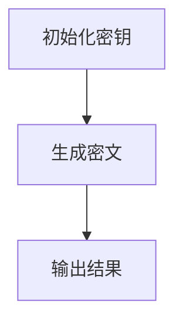
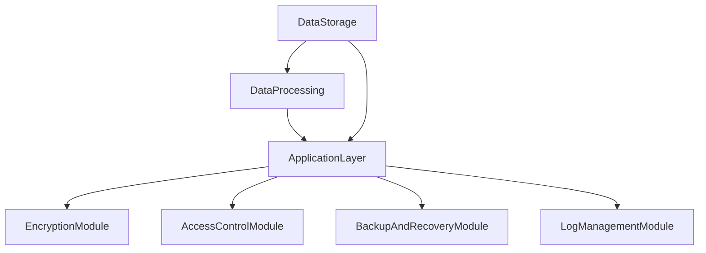
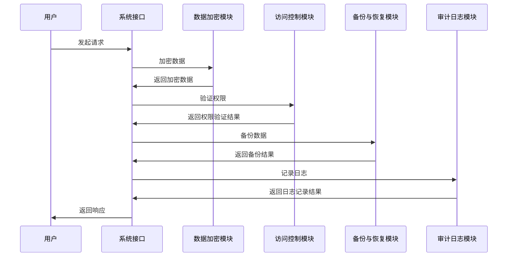
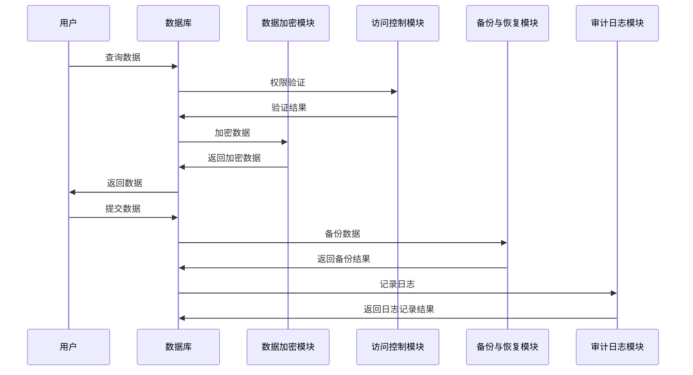

                 

## 资损防控：架构设计中的重要考量

关键词：数据安全，架构设计，资损防控，数据完整性，加密算法，备份恢复

摘要：随着数字化转型的加速，企业对数据安全的需求日益增加。资损防控作为保障数据安全的重要手段，成为架构设计中不可忽视的一环。本文将深入探讨资损防控的背景、核心概念、技术原理及其在实践中的应用，通过案例分析，提供一整套系统化的解决方案，以应对企业面临的数据资损风险。

### 第一部分：资损防控的背景与核心概念

#### 第1章：资损防控的背景介绍

##### 1.1.1 问题背景

在信息化时代，数据已成为企业的重要资产。然而，数据资损问题日益严重，不仅可能导致企业经济损失，还可能损害企业的声誉。数据资损的形式多种多样，包括数据泄露、数据丢失、数据篡改等，给企业带来了巨大的威胁。

- **数据泄露**：企业内部敏感数据被未经授权的人员访问或盗取。
- **数据丢失**：由于硬件故障、软件错误或人为操作失误，导致数据不可恢复。
- **数据篡改**：恶意攻击者篡改数据内容，导致数据失去真实性。

数据资损对企业的影响不可低估，它不仅可能导致直接的经济损失，如交易数据被篡改、客户信息泄露等，还可能引发一系列法律和道德问题。因此，资损防控已成为企业数据安全管理的重要组成部分。

##### 1.1.2 问题描述

资损防控，即在数据生成、存储、传输和使用过程中，采取一系列措施确保数据的完整性、保密性和可用性。具体来说，资损防控包括以下几个方面：

- **数据完整性**：确保数据在存储、传输和处理过程中不被未经授权的修改或破坏。
- **数据保密性**：保护数据不被未经授权的人员访问或泄露。
- **数据可用性**：确保数据在需要时能够被正确、快速地访问和使用。

在实际应用中，资损防控需要面对各种复杂的情况和挑战，如海量数据的高效保护、多维度安全需求的平衡、实时性的数据保护等。因此，理解资损防控的定义和类型对于企业数据安全管理至关重要。

##### 1.1.3 问题解决

目前，企业常采用以下几种资损防控措施：

- **数据加密**：通过加密算法对数据进行加密，确保数据在传输和存储过程中不被窃取或篡改。
- **访问控制**：通过身份验证和权限管理，确保只有授权人员才能访问敏感数据。
- **备份与恢复**：定期备份数据，并制定数据恢复策略，以应对数据丢失或损坏的情况。

这些措施在一定程度上提高了数据的安全性，但仍然存在一些不足。例如，加密算法的安全性可能受到攻击者的破解，访问控制可能存在漏洞，备份策略可能无法满足快速恢复的需求。因此，如何改进这些措施，提高资损防控的效果，是当前研究和实践的重要课题。

##### 1.1.4 边界与外延

资损防控的适用范围广泛，不仅涵盖企业内部的数据管理，还涉及跨企业的数据交换和共享。此外，资损防控不仅关注数据本身的安全，还涉及数据相关的硬件、软件、网络等多个方面。

- **适用范围**：资损防控适用于所有涉及数据的企业和组织，无论是大型企业还是中小型企业。
- **交叉关系**：资损防控与其他安全领域，如网络安全、物理安全等密切相关，需要综合施策。

##### 1.1.5 概念结构与核心要素组成

资损防控涉及多个核心概念和要素，包括数据完整性、保密性、可用性等。这些概念相互关联，共同构成了资损防控的完整体系。

- **数据完整性**：确保数据在生成、存储、传输和处理过程中不被篡改或破坏。核心要素包括数据校验、数据同步等。
- **数据保密性**：保护数据不被未经授权的人员访问或泄露。核心要素包括访问控制、数据加密等。
- **数据可用性**：确保数据在需要时能够被正确、快速地访问和使用。核心要素包括备份与恢复、容错机制等。

理解这些核心概念和要素及其相互关系，有助于企业制定有效的资损防控策略。

#### 第2章：核心概念与联系

##### 2.1.1 资损防控的核心概念

资损防控的核心概念包括数据完整性、保密性和可用性。这些概念是企业确保数据安全的基础。

- **数据完整性**：确保数据在存储、传输和处理过程中不被未经授权的修改或破坏。其关键在于数据校验和一致性保障。
- **数据保密性**：保护数据不被未经授权的人员访问或泄露。其关键在于访问控制和数据加密。
- **数据可用性**：确保数据在需要时能够被正确、快速地访问和使用。其关键在于备份与恢复和容错机制。

##### 2.1.2 概念属性特征对比表格

| 概念       | 定义                                                         | 关键属性特征                                                     |
|------------|--------------------------------------------------------------|----------------------------------------------------------------|
| 数据完整性 | 确保数据在存储、传输和处理过程中不被篡改或破坏               | 数据校验、数据同步、一致性保障                                   |
| 数据保密性 | 保护数据不被未经授权的人员访问或泄露                       | 访问控制、数据加密、安全审计                                     |
| 数据可用性 | 确保数据在需要时能够被正确、快速地访问和使用               | 备份与恢复、容错机制、性能优化                                   |

通过对比表格，我们可以更清晰地理解这些概念的区别和联系，从而更好地应用在资损防控中。

##### 2.1.3 ER实体关系图架构

为了更好地理解资损防控的核心概念及其相互关系，我们可以使用ER（实体关系）图来展示。

```mermaid
erDiagram
  DataIntegrity ||--|{ DataProtection }|| DataPrivacy
  DataIntegrity ||--|{ DataRecovery }|| DataAvailability
  DataPrivacy ||--|{ AccessControl }|| DataIntegrity
  DataPrivacy ||--|{ Encryption }|| DataIntegrity
  DataRecovery ||--|{ Backup }|| DataAvailability
  DataRecovery ||--|{ ErrorHandling }|| DataAvailability
```

通过ER图，我们可以清晰地看到数据完整性、保密性和可用性之间的相互关系，以及它们各自的关键要素。

### 第二部分：资损防控的技术原理与实践

#### 第3章：数据加密与加密算法

##### 3.1.1 数据加密的基本原理

数据加密是资损防控的重要手段，它通过将数据转换为密文，确保数据在传输和存储过程中不被未经授权的人员读取。

- **加密过程**：加密过程包括密钥生成、数据加密和解密。数据加密算法将明文数据与密钥进行运算，生成密文。解密过程则使用相同或不同的密钥将密文还原为明文。
- **加密作用**：加密算法能够防止数据被窃取或篡改，确保数据在传输和存储过程中的安全。

##### 3.1.2 加密算法的原理与应用

常见的加密算法包括对称加密算法和非对称加密算法。对称加密算法使用相同的密钥进行加密和解密，如AES（高级加密标准）；非对称加密算法使用一对密钥，一个用于加密，一个用于解密，如RSA（Rivest-Shamir-Adleman）。

- **对称加密算法**：对称加密算法的优点是加密速度快，但缺点是密钥管理复杂。常见的对称加密算法包括AES、DES（数据加密标准）等。
  - **AES**：AES是一种高速、高效的加密算法，广泛用于现代加密应用。
  - **DES**：DES是一种早期的加密算法，由于密钥长度较短，已逐渐被AES替代。

- **非对称加密算法**：非对称加密算法的优点是密钥管理简单，但加密和解密速度较慢。常见的非对称加密算法包括RSA、ECC（椭圆曲线加密）等。
  - **RSA**：RSA是一种基于大整数分解难题的加密算法，广泛用于数字签名和加密通信。
  - **ECC**：ECC是一种基于椭圆曲线难题的加密算法，具有较高的安全性和效率。

##### 3.1.3 加密算法的Mermaid流程图

下面是AES加密算法的Mermaid流程图：



通过流程图，我们可以清晰地看到AES加密的基本步骤。

##### 3.1.4 加密算法的Python源代码实现

以下是一个简单的AES加密算法Python实现示例：

```python
from Crypto.Cipher import AES
from Crypto.Util.Padding import pad
from Crypto.Random import get_random_bytes

# 生成密钥
key = get_random_bytes(16)  # AES-128位密钥

# 创建AES加密对象
cipher = AES.new(key, AES.MODE_CBC)

# 明文
plaintext = b"Hello, World!"

# 对明文进行填充
padded_plaintext = pad(plaintext, AES.block_size)

# 加密
ciphertext = cipher.encrypt(padded_plaintext)

# 输出结果
print(f"密文: {ciphertext.hex()}")
```

在代码中，我们首先生成一个随机密钥，然后创建AES加密对象，对明文进行填充，最后进行加密。加密后的结果以十六进制形式输出。

### 第三部分：资损防控的实际应用与案例分析

#### 第5章：案例研究一：企业级数据资损防控项目

##### 5.1.1 案例背景

某大型企业在数字化转型过程中，面临着数据资损的巨大风险。企业内部存储了大量的客户数据、财务数据和业务数据，一旦发生数据资损，将严重影响企业的正常运营和声誉。因此，企业决定开展一个企业级数据资损防控项目，以保障数据的安全。

##### 5.1.2 项目目标

该项目的主要目标包括：

- **数据完整性**：确保数据在存储、传输和处理过程中不被篡改或破坏。
- **数据保密性**：保护数据不被未经授权的人员访问或泄露。
- **数据可用性**：确保数据在需要时能够被正确、快速地访问和使用。

##### 5.1.3 系统功能设计

为了实现项目目标，系统设计了以下核心功能模块：

- **数据加密模块**：对敏感数据进行加密，确保数据在传输和存储过程中的安全。
- **访问控制模块**：通过身份验证和权限管理，确保只有授权人员才能访问敏感数据。
- **备份与恢复模块**：定期备份数据，并制定数据恢复策略，以应对数据丢失或损坏的情况。
- **审计日志模块**：记录数据访问和操作日志，以便进行安全审计和故障排查。

以下是领域模型类图，展示了系统的核心功能模块及其关系：

```mermaid
classDiagram
  Class1[DataEncryption] <|-- Class2[AccessControl]
  Class1[DataEncryption] <|-- Class3[BackupAndRecovery]
  Class2[AccessControl] <|-- Class4[UserAuthentication]
  Class3[BackupAndRecovery] <|-- Class5[DataRecovery]
  Class4[UserAuthentication] <|-- Class6[Authorization]
  Class5[DataRecovery] <|-- Class7[LogManagement]
```

通过类图，我们可以清晰地看到各功能模块及其子模块之间的关系。

##### 5.1.4 系统架构设计

系统架构设计采用分布式架构，包括数据存储层、数据处理层和应用层。以下是系统架构图，展示了系统的组成部分和交互关系：



通过架构图，我们可以看到系统的各个组成部分及其交互关系。

##### 5.1.5 系统接口设计

系统设计了多个接口，包括数据加密接口、访问控制接口、备份与恢复接口和审计日志接口。以下是系统接口设计：



通过序列图，我们可以看到系统接口的交互流程。

##### 5.1.6 系统交互Mermaid序列图

以下是系统在不同场景下的交互序列图：



通过序列图，我们可以看到系统在不同场景下的交互流程。

##### 5.1.7 核心实现源代码

以下是项目中的核心实现源代码：

```python
# 加密模块
from Crypto.Cipher import AES
from Crypto.Util.Padding import pad
from Crypto.Random import get_random_bytes

def encrypt_data(data, key):
    cipher = AES.new(key, AES.MODE_CBC)
    padded_data = pad(data, AES.block_size)
    ciphertext = cipher.encrypt(padded_data)
    return ciphertext

# 访问控制模块
from flask import Flask, request, jsonify

app = Flask(__name__)

@app.route('/api/data', methods=['GET', 'POST'])
def data_api():
    if request.method == 'GET':
        # 验证权限
        if request.headers.get('Authorization') == 'Bearer valid_token':
            # 加密数据
            data = encrypt_data(request.args.get('data'), key)
            return jsonify({'data': data.hex()})
        else:
            return jsonify({'error': '权限不足'})
    elif request.method == 'POST':
        # 解密数据
        data = bytes.fromhex(request.json['data'])
        decrypted_data = AES.new(key, AES.MODE_CBC, iv).decrypt(data)
        return jsonify({'data': decrypted_data.decode('utf-8')})

# 备份与恢复模块
import os
import json

def backup_data(data):
    with open('backup.json', 'w') as f:
        json.dump(data, f)

def recover_data():
    with open('backup.json', 'r') as f:
        data = json.load(f)
    return data

# 审计日志模块
import logging

logging.basicConfig(filename='audit.log', level=logging.INFO)

def log_access(access_data):
    logging.info(json.dumps(access_data))
```

在代码中，我们分别实现了数据加密、访问控制和备份与恢复等功能，并对日志进行了记录。

##### 5.1.8 案例分析与讲解

该案例通过数据加密、访问控制和备份与恢复等手段，实现了对企业数据的安全保护。以下是案例的分析和讲解：

- **数据加密**：通过AES加密算法，确保数据在传输和存储过程中的安全。
- **访问控制**：通过身份验证和权限管理，确保只有授权人员才能访问敏感数据。
- **备份与恢复**：定期备份数据，并制定数据恢复策略，以应对数据丢失或损坏的情况。
- **审计日志**：记录数据访问和操作日志，便于进行安全审计和故障排查。

通过该案例，我们可以看到，资损防控需要综合运用多种技术手段，确保数据的安全。同时，案例的实施也展示了资损防控在实际应用中的可行性和效果。

##### 5.1.9 案例小结

该案例的成功实施，为企业提供了一个有效的数据资损防控方案。通过数据加密、访问控制和备份与恢复等手段，企业能够保障数据的完整性、保密性和可用性。同时，案例的实施也为我们提供了宝贵的经验教训，如加密算法的选择、访问控制策略的制定等。在未来的数据安全管理中，我们可以借鉴这些经验，进一步提高数据资损防控的效果。

### 总结与展望

资损防控作为保障数据安全的重要手段，在企业数据安全管理中具有重要地位。本文通过对资损防控的背景、核心概念、技术原理和实践案例的深入探讨，提供了系统化的解决方案。在实际应用中，企业应根据自身需求和特点，综合运用数据加密、访问控制、备份与恢复等技术手段，确保数据的安全。

展望未来，随着数据安全威胁的日益复杂，资损防控将面临新的挑战。我们需要不断探索和创新，如引入区块链、人工智能等技术，进一步提高数据的安全性。同时，企业应加强数据安全意识教育，提高员工的安全意识和技能，共同构建安全的数据环境。

在数据安全领域，资损防控的重要性不言而喻。让我们共同努力，保障数据的安全，为企业的发展保驾护航。

### 作者信息

作者：AI天才研究院/AI Genius Institute & 禅与计算机程序设计艺术 /Zen And The Art of Computer Programming

---

### 最佳实践 Tips

1. **定期评估和更新加密算法**：随着技术的不断发展，加密算法的安全性可能受到威胁。因此，企业应定期评估和更新加密算法，确保数据的安全性。

2. **实施严格的访问控制策略**：确保只有授权人员才能访问敏感数据。通过身份验证和权限管理，减少数据泄露和篡改的风险。

3. **定期备份数据**：制定合理的备份策略，确保数据在发生丢失或损坏时能够及时恢复。同时，定期检查备份的有效性，确保备份数据的安全。

4. **加强数据安全意识教育**：提高员工的数据安全意识，培养良好的数据安全习惯。通过培训和演练，增强员工应对数据安全威胁的能力。

5. **关注法律法规**：了解和遵守相关的数据安全法律法规，确保企业在数据安全方面合规。

### 小结

本文从资损防控的背景、核心概念、技术原理和实践案例等方面进行了全面探讨，强调了资损防控在企业数据安全管理中的重要性。通过数据加密、访问控制、备份与恢复等手段，企业能够有效保障数据的完整性、保密性和可用性。

### 注意事项

1. **加密算法的选择**：选择适合企业需求的加密算法，如AES、RSA等。
2. **密钥管理**：确保密钥的安全存储和有效管理，防止密钥泄露。
3. **备份策略**：制定合理的备份策略，确保备份数据的完整性和可恢复性。

### 拓展阅读

1. 《数据安全法》：了解我国关于数据安全的基本法律法规。
2. 《加密算法原理与应用》：深入了解各种加密算法的原理和应用。
3. 《大数据安全与隐私保护》：探讨大数据环境下数据安全面临的挑战和解决方案。

