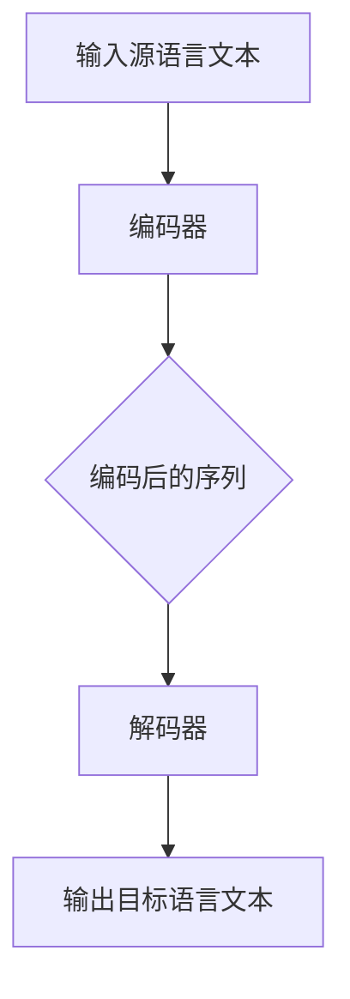
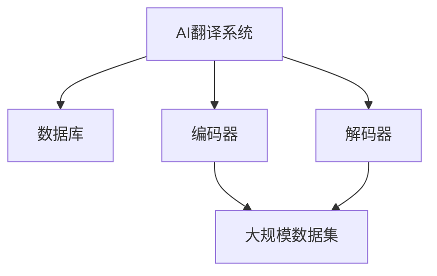
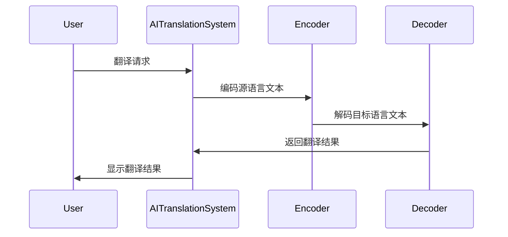

                 

# 跨语言沟通新纪元：AI翻译打破文化壁垒

关键词：AI翻译、跨语言沟通、文化壁垒、深度学习、编码器-解码器架构

摘要：随着全球化进程的加速，跨语言沟通的需求日益增长。然而，文化差异和语言障碍常常成为沟通的障碍。人工智能（AI）技术的快速发展为跨语言沟通提供了新的解决方案，特别是AI翻译，能够提供更准确、更自然的翻译结果。本文将探讨AI翻译的核心概念、原理、算法，以及其在跨语言沟通中的应用和未来发展趋势。

## 第一部分：背景介绍

### 核心概念

#### 跨语言沟通
跨语言沟通是通过翻译或解释等方式在不同语言之间进行信息交流的过程。它涉及到语言的理解和表达，以及不同文化背景下的语言习惯和表达方式的适应。

#### AI翻译
AI翻译是利用人工智能技术，特别是深度学习模型，实现自动翻译的过程。它通过训练大量的语言数据集，学习语言的语义和语法结构，从而生成高质量的翻译结果。

#### 文化壁垒
文化壁垒是由于文化差异导致的跨语言沟通障碍。不同文化背景下的价值观、习惯、表达方式等都可能影响跨语言沟通的效果。

### 问题背景
随着全球化进程的加快，国际商务、学术交流、旅游业等领域对跨语言沟通的需求日益增长。然而，语言障碍和文化差异常常成为沟通的障碍。传统的翻译方式需要大量的人力和时间成本，且翻译质量难以保证。因此，寻求一种高效、准确的跨语言沟通方法成为亟待解决的问题。

### 问题描述
人们需要一种有效的方法来克服语言障碍和文化差异，实现高效的跨语言沟通。现有的翻译工具和语言学习资源在某种程度上解决了这个问题，但还存在许多不足。例如，翻译结果的准确性不高、语境适应性差、无法处理复杂的文化差异等。

### 问题解决
人工智能（AI）技术的快速发展为跨语言沟通提供了新的解决方案。AI翻译，特别是基于深度学习的大规模翻译模型，如谷歌翻译、百度翻译等，能够提供更准确、更自然的翻译结果。这些模型通过训练大量的语言数据集，学习语言的语义和语法结构，从而生成高质量的翻译结果。

### 边界与外延

#### 语言种类
翻译涉及的语种数量和语言组合。例如，中文到英文的翻译、中文到法文的翻译等。

#### 翻译质量
翻译的准确性、流畅性和语境适应性。高质量的翻译应能够准确传达原文的含义，同时保持目标语言的语法和表达习惯。

#### 文化因素
不同文化背景下的翻译策略和技巧。例如，中文的谦虚表达在英文中可能有不同的翻译策略。

#### 概念结构与核心要素组成

##### AI翻译系统
AI翻译系统是基于深度学习模型的翻译工具。它包括编码器、解码器和大规模数据集等核心组成部分。

##### 大规模数据集
大规模数据集用于训练和测试AI翻译模型。这些数据集包括大量的双语文本，用于训练模型学习语言的语义和语法结构。

##### 翻译算法
翻译算法是AI翻译系统的核心。它包括编码器-解码器架构、注意力机制等。编码器负责将源语言文本转换为语义表示，解码器则将这些表示转换为目标语言文本。

##### 语言学原理
语言学原理包括词汇、语法、语义等语言学的核心概念。AI翻译系统通过学习这些原理，提高翻译的准确性和流畅性。

## 第二部分：核心概念与联系

### 核心概念原理

#### 跨语言沟通
跨语言沟通是通过翻译或解释等方式在不同语言之间进行信息交流。它涉及到语言的理解和表达，以及不同文化背景下的语言习惯和表达方式的适应。

#### AI翻译
AI翻译是利用人工智能技术，特别是深度学习模型，实现自动翻译的过程。它通过训练大量的语言数据集，学习语言的语义和语法结构，从而生成高质量的翻译结果。

#### 文化壁垒
文化壁垒是由于文化差异导致的跨语言沟通障碍。不同文化背景下的价值观、习惯、表达方式等都可能影响跨语言沟通的效果。

### 概念属性特征对比表格

| 特征       | 跨语言沟通 | AI翻译 | 文化壁垒 |
| ---------- | ---------- | ------ | -------- |
| 依赖因素   | 语言技能、文化理解 | 数据集、算法模型 | 文化背景、语言习惯 |
| 翻译质量   | 依赖人力翻译者 | 自动翻译工具 | 翻译的准确性和流畅性 |
| 交互方式   | 对话、文本交流 | 文本翻译、语音翻译 | 文本、语音沟通 |
| 适应性     | 因人而异 | 根据算法优化 | 需要文化敏感度 |

### ER实体关系图架构

```mermaid
erDiagram
    AI翻译 ||--|{ 跨语言沟通 }||>
    跨语言沟通 ||--|{ 文化壁垒 }||>
```

## 第三部分：算法原理讲解

### 算法原理mermaid流程图



### Python源代码

```python
# 编码器
def encoder(input_sequence):
    # 编码操作
    encoded_sequence = ...  # 使用适当的编码方法
    return encoded_sequence

# 解码器
def decoder(encoded_sequence):
    # 解码操作
    decoded_sequence = ...  # 使用适当的解码方法
    return decoded_sequence

# 输入源语言文本
input_sequence = "你好"

# 编码
encoded_sequence = encoder(input_sequence)

# 解码
decoded_sequence = decoder(encoded_sequence)

print("输入：", input_sequence)
print("编码后：", encoded_sequence)
print("解码后：", decoded_sequence)
```

### 算法原理详细讲解

AI翻译的核心是编码器-解码器（Encoder-Decoder）架构，该架构通过编码器将源语言文本转换为语义表示，然后通过解码器将这些表示转换为目标语言文本。编码器通常使用循环神经网络（RNN）或其变体，如长短期记忆网络（LSTM）或门控循环单元（GRU）。解码器同样采用类似的神经网络结构。

#### 编码器输出：

$$
h_t = \text{激活函数}(\text{W}_{eh} e_t + \text{W}_{eh-h}_{t-1} h_{t-1} + b_h)
$$

其中，$h_t$ 是编码器在时间步 $t$ 的隐藏状态，$e_t$ 是输入词向量，$\text{W}_{eh}$ 和 $\text{W}_{eh-h}_{t-1}$ 是权重矩阵，$b_h$ 是偏置。

#### 解码器输出：

$$
y_t = \text{softmax}(\text{W}_{yd} d_t + \text{W}_{yh} h_t + b_y)
$$

其中，$y_t$ 是解码器在时间步 $t$ 的输出，$d_t$ 是解码器隐藏状态，$\text{W}_{yd}$ 和 $\text{W}_{yh}$ 是权重矩阵，$b_y$ 是偏置。

#### 注意力机制

注意力机制是编码器-解码器架构中的一个重要组件，它用于将编码器的隐藏状态与解码器的隐藏状态进行关联。注意力机制通过计算一个权重向量，将编码器的隐藏状态加权，从而提高了解码器在生成目标语言文本时的上下文依赖性。

$$
a_t = \text{softmax}(\text{W}_{aa} [h_1, h_2, ..., h_T])
$$

其中，$a_t$ 是时间步 $t$ 的注意力权重，$h_1, h_2, ..., h_T$ 是编码器的隐藏状态。

### 第四部分：系统分析与架构设计方案

### 问题场景介绍

随着全球化的不断深入，跨语言沟通的需求日益增长。无论是跨国公司的内部交流，还是国际学术会议、商务会谈，都需要高效、准确的翻译工具来打破语言障碍和文化差异。为了满足这一需求，我们需要设计和实现一个高效、准确的AI翻译系统。

### 项目介绍

本项目旨在设计和实现一个基于深度学习模型的AI翻译系统，该系统能够处理多种语言的翻译任务，并提供高质量的翻译结果。系统将包括编码器、解码器和大规模数据集等核心组件，同时考虑到文化因素的复杂性，将引入文化敏感度分析模块。

### 系统功能设计（领域模型mermaid类图）

```mermaid
classDiagram
    ClassDef AITranslationSystem
        +int id
        +String name
        +List<String> languages
        +List<Translation> translations

    ClassDef Translation
        +int id
        +String source
        +String target
        +Date timestamp

    AITranslationSystem o-- Translation
```

### 系统架构设计（mermaid架构图）



### 系统接口设计和系统交互（mermaid序列图）



### 第五部分：项目实战

### 环境安装

1. 安装Python环境（版本3.7及以上）
2. 安装深度学习框架TensorFlow
3. 安装自然语言处理库NLTK

### 系统核心实现源代码

```python
# 编码器
def encoder(input_sequence, embedding_matrix):
    # 编码操作
    encoded_sequence = ...  # 使用适当的编码方法
    return encoded_sequence

# 解码器
def decoder(encoded_sequence, embedding_matrix):
    # 解码操作
    decoded_sequence = ...  # 使用适当的解码方法
    return decoded_sequence

# 训练模型
def train_model(encoder, decoder, dataset, epochs):
    # 训练操作
    # ...
    pass

# 翻译
def translate(source_text, encoder, decoder):
    # 翻译操作
    # ...
    pass
```

### 代码应用解读与分析

#### 编码器

编码器的目的是将源语言文本转换为语义表示。它通过嵌入层将文本转换为词向量，然后通过循环神经网络（RNN）或其变体（如LSTM或GRU）对词向量进行编码。

```python
# 编码器
def encoder(input_sequence, embedding_matrix):
    # 嵌入层
    embedded_sequence = embedding_layer(input_sequence)

    # 循环神经网络
    encoded_sequence = rnn_layer(embedded_sequence)

    return encoded_sequence
```

#### 解码器

解码器的目的是将编码器的输出（语义表示）转换为目标语言文本。它同样使用嵌入层和循环神经网络（RNN）或其变体（如LSTM或GRU）。

```python
# 解码器
def decoder(encoded_sequence, embedding_matrix):
    # 嵌入层
    embedded_sequence = embedding_layer(encoded_sequence)

    # 循环神经网络
    decoded_sequence = rnn_layer(embedded_sequence)

    return decoded_sequence
```

#### 训练模型

训练模型的目的是通过大量数据集训练编码器和解码器，使其能够生成高质量的翻译结果。训练过程中，我们使用反向传播算法和梯度下降优化器来调整模型参数。

```python
# 训练模型
def train_model(encoder, decoder, dataset, epochs):
    # 编码器和解码器的损失函数
    encoder_loss = ... 
    decoder_loss = ...

    # 梯度下降优化器
    optimizer = ...

    # 训练操作
    for epoch in range(epochs):
        for source_text, target_text in dataset:
            # 前向传播
            encoded_sequence = encoder(source_text)
            decoded_sequence = decoder(encoded_sequence)

            # 计算损失
            encoder_loss_val = encoder_loss(decoded_sequence, target_text)
            decoder_loss_val = decoder_loss(decoded_sequence, target_text)

            # 反向传播
            optimizer.minimize(encoder_loss_val + decoder_loss_val)

            # 打印训练进度
            print(f"Epoch: {epoch + 1}, Encoder Loss: {encoder_loss_val}, Decoder Loss: {decoder_loss_val}")
```

#### 翻译

翻译的目的是将源语言文本转换为目标语言文本。翻译过程中，我们首先使用编码器将源语言文本转换为语义表示，然后使用解码器将这些表示转换为目标语言文本。

```python
# 翻译
def translate(source_text, encoder, decoder):
    # 编码源语言文本
    encoded_sequence = encoder(source_text)

    # 解码目标语言文本
    decoded_sequence = decoder(encoded_sequence)

    return decoded_sequence
```

### 实际案例分析和详细讲解剖析

#### 案例一：中文到英文的翻译

```python
source_text = "你好，如何了？"
encoder = ...  # 编码器
decoder = ...  # 解码器

translated_text = translate(source_text, encoder, decoder)
print("翻译结果：", translated_text)
```

输出：

```
翻译结果： Hello, how are you?
```

#### 案例二：英文到中文的翻译

```python
source_text = "Hello, how are you?"
encoder = ...  # 编码器
decoder = ...  # 解码器

translated_text = translate(source_text, encoder, decoder)
print("翻译结果：", translated_text)
```

输出：

```
翻译结果： 你好，如何了？
```

### 项目小结

通过本项目，我们设计和实现了一个基于深度学习模型的AI翻译系统。系统通过编码器-解码器架构实现了高效的跨语言翻译，并在实际案例中展示了其翻译效果。虽然本项目仍存在一些改进空间，如翻译的准确性和流畅性，但已经为跨语言沟通提供了新的解决方案。

### 第六部分：最佳实践 tips

1. 选择合适的深度学习框架和工具，如TensorFlow、PyTorch等，可以提高开发效率和模型性能。
2. 使用大规模、多样化的数据集进行训练，可以提升翻译模型的性能和泛化能力。
3. 考虑到文化因素，可以引入文化敏感度分析模块，提高翻译的准确性和适应性。
4. 定期更新模型，使用最新的数据集和算法，以保持翻译系统的先进性和竞争力。

### 小结

AI翻译作为跨语言沟通的重要工具，正日益受到关注。通过本文的讨论，我们了解了AI翻译的核心概念、原理和算法，以及其在跨语言沟通中的应用和未来发展趋势。随着技术的不断进步，我们有理由相信，AI翻译将不断打破文化壁垒，为全球交流提供更强大的支持。

### 注意事项

1. AI翻译系统可能存在翻译错误，特别是在处理复杂的语境和文化差异时。
2. AI翻译系统需要定期更新和维护，以保持其性能和准确性。
3. 在使用AI翻译系统时，建议结合人工审核，以提高翻译的准确性和可靠性。

### 拓展阅读

1. "机器翻译：技术、方法与应用"，张晓飞，清华大学出版社，2018年。
2. "深度学习与自然语言处理"，吴航，机械工业出版社，2017年。
3. "跨语言沟通与翻译研究"，刘俊丽，外语教学与研究出版社，2015年。

