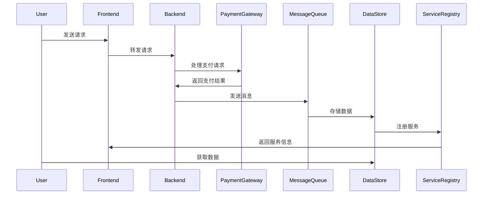
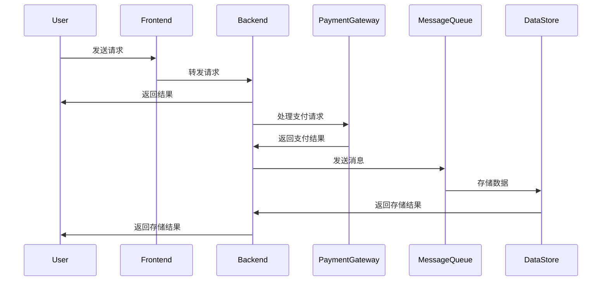
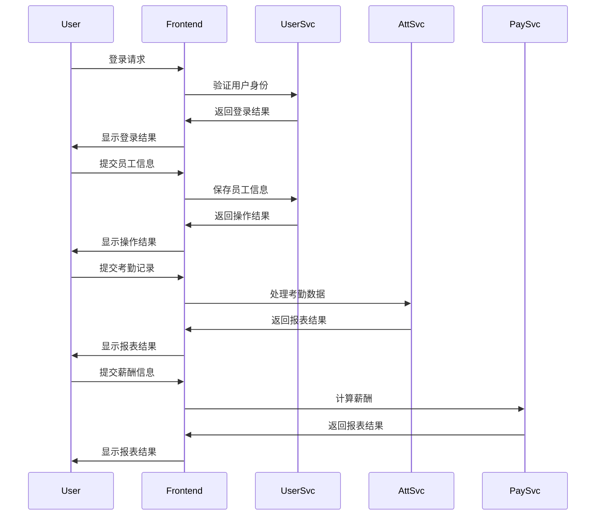

                 

### 跨语言系统设计的背景与重要性

在现代信息技术的飞速发展下，软件系统越来越复杂，企业对系统的需求也在不断演进。随着互联网的普及和全球化的进程，企业不仅需要面对单一语言或平台的应用需求，还需要应对多语言、跨平台的复杂场景。这促使跨语言系统设计逐渐成为软件开发领域的一个重要研究方向。在这一背景下，P9工程师作为企业技术团队的领军人物，需要具备多元化的思维，以应对跨语言系统设计带来的挑战。

#### 跨语言系统设计的定义

跨语言系统设计指的是在一个系统中，各个模块或服务能够使用不同的编程语言进行开发和实现，但它们之间能够无缝集成和通信。这种设计不仅提升了系统的灵活性，还能够充分利用不同编程语言的优点，提高开发效率和性能。

#### 跨语言系统设计与其他系统设计的区别

与其他系统设计相比，跨语言系统设计具有以下特点：

1. **多样性**：跨语言系统设计允许使用多种编程语言，而传统的单一语言系统设计则只使用一种编程语言。
2. **复杂性**：由于涉及多种语言，跨语言系统设计的实现和调试更加复杂。
3. **兼容性**：跨语言系统需要考虑不同语言之间的兼容性问题，如数据交换格式、通信协议等。
4. **性能优化**：跨语言系统设计需要关注不同语言在性能上的差异，进行针对性优化。

#### 跨语言系统设计的问题背景

企业面临多语言需求的原因主要有以下几点：

1. **业务需求**：企业可能需要为不同的市场或客户群体提供不同语言的版本，以满足本地化的需求。
2. **技术积累**：企业可能拥有历史遗留系统，这些系统可能使用不同的编程语言和架构。
3. **研发团队**：不同语言有不同领域的专家，企业可能需要利用这些专家的专长。

不同语言系统之间的兼容性问题主要包括：

1. **数据格式不统一**：不同语言的数据格式和编码方式可能不同，导致数据传输和处理出现困难。
2. **接口调用不兼容**：不同语言的API调用方式可能不一致，影响系统的集成。
3. **性能瓶颈**：不同语言在性能上的差异可能导致系统性能出现瓶颈。

#### 跨语言系统设计的需求分析

在跨语言系统设计中，需求分析是至关重要的一环。以下是系统设计需要考虑的主要需求：

1. **系统性能需求**：系统需要在多语言环境下保持高性能，降低跨语言通信带来的性能开销。
2. **系统可维护性需求**：系统代码需要易于维护，方便后续的升级和扩展。
3. **系统可扩展性需求**：系统设计应支持未来的扩展，能够轻松地添加新功能或更换组件。

#### 跨语言系统设计的核心要素

跨语言系统设计涉及多个核心要素，以下是其中几个关键要素：

1. **数据交换格式**：如JSON、XML等，用于不同语言之间的数据传输和解析。
2. **通信协议**：如HTTP、gRPC等，用于系统内部和外部的通信。
3. **异构系统集成**：将不同语言和架构的系统进行集成，实现无缝的数据交换和功能调用。

#### 跨语言系统设计的边界与外延

跨语言系统设计不仅涉及技术层面，还与国际化、全球化等概念密切相关。国际化指的是系统支持多种语言和地区，而全球化则是系统面向全球市场。跨语言系统设计在国际化、全球化中的应用包括：

1. **多语言界面**：系统支持多种语言，方便不同地区用户的使用。
2. **多币种支付**：系统支持多种货币的支付，适应不同市场的需求。
3. **跨地域数据存储**：系统在多个地理位置存储数据，提高系统的可靠性和性能。

#### 本章小结

本章介绍了跨语言系统设计的基本概念和重要性，包括跨语言系统设计的定义、与其他系统设计的区别、问题背景、需求分析、核心要素以及边界与外延。在接下来的章节中，我们将深入探讨跨语言系统设计中的核心概念、关键算法、数学模型以及系统分析与架构设计等内容。

## 第1章: 背景介绍

### 1.1 跨语言系统设计的定义

跨语言系统设计是一种在软件系统开发中，允许各个模块或服务使用不同的编程语言进行实现，并通过一系列技术手段实现它们之间无缝集成和通信的设计方法。这一设计理念的核心在于，通过使用不同的编程语言，充分发挥每种语言的特性和优势，从而提升系统的整体性能、可维护性和可扩展性。

跨语言系统设计的本质是一种异构系统的集成，它涉及多种语言、框架和工具的组合。例如，在一个企业级应用中，前端可能采用JavaScript，后端可能使用Java或Python，数据库可能使用MySQL或PostgreSQL，而消息队列可能采用RabbitMQ或Kafka。这些不同语言的组件需要通过标准化的接口和协议进行通信，以确保整个系统能够协同工作。

#### 跨语言系统设计与国际化、全球化的关系

国际化与全球化是两个与跨语言系统设计密切相关的重要概念。国际化（Internationalization）指的是软件系统在设计、开发和部署过程中，为支持多种语言和地区而进行的设计和技术准备。国际化旨在使软件系统能够在不同的语言和文化背景下运行，提供本地化的用户体验。而全球化（Globalization）则是指软件系统面向全球市场，支持跨地域、跨文化的业务需求。

跨语言系统设计在国际化、全球化中的应用主要体现在以下几个方面：

1. **多语言支持**：跨语言系统设计允许开发团队为系统添加多种语言界面，满足不同地区用户的语言偏好。例如，通过国际化框架（如i18n），开发者可以轻松地将系统界面翻译成多种语言。

2. **多币种支付**：在电子商务应用中，跨语言系统设计可以帮助企业支持多种货币的支付，满足不同市场的需求。例如，通过适配不同的支付网关和货币转换服务，系统可以实现全球用户的无缝支付体验。

3. **跨地域数据存储**：为了提高系统的性能和可靠性，跨语言系统设计可以考虑将数据存储在全球多个地理位置。例如，使用分布式数据库和缓存策略，可以确保数据在用户最近的服务器上存储和处理，从而减少延迟。

### 1.2 跨语言系统设计的问题背景

企业面临多语言需求的原因多种多样，主要包括以下几个方面：

1. **业务需求**：随着企业业务的全球化扩张，它们需要为不同市场的客户提供本地化的产品和服务。例如，一个电商平台可能需要为英语、法语、西班牙语、中文等多种语言的用户提供服务。

2. **技术积累**：企业可能在长期的发展过程中积累了多种语言和技术的项目，这些项目之间需要进行集成和交互。例如，一个大型企业可能有使用Java开发的老系统，也有使用Python、JavaScript等新技术开发的新系统。

3. **研发团队**：不同编程语言有不同的应用场景和专家群体。企业可能会招聘具有不同语言背景的研发人员，以充分利用各自的语言优势和专长。例如，一个团队可能擅长Java后端开发，另一个团队则擅长前端开发。

跨语言系统设计面临的主要问题包括：

1. **数据格式不统一**：不同语言和框架通常使用不同的数据格式进行数据交换，如JSON、XML、Protocol Buffers等。这可能导致数据传输和处理过程中出现不兼容的问题。

2. **接口调用不兼容**：不同语言的API调用方式和协议可能不同，使得系统间的集成变得复杂。例如，Java和Python之间的接口调用需要特殊处理，以确保数据传输的正确性。

3. **性能瓶颈**：不同语言和框架在性能上存在差异，可能导致系统在某些环节出现性能瓶颈。例如，JavaScript引擎可能比Python解释器更快，但在多线程处理上可能不如Java。

### 1.3 跨语言系统设计的需求分析

在跨语言系统设计中，需求分析是至关重要的环节。以下是系统设计需要考虑的主要需求：

1. **系统性能需求**：系统需要在多语言环境下保持高性能，降低跨语言通信带来的性能开销。这要求设计者选择合适的通信协议和数据交换格式，并优化系统的整体架构。

2. **系统可维护性需求**：系统代码需要易于维护，方便后续的升级和扩展。这要求设计者采用模块化和组件化的设计方法，使系统各个模块之间松耦合，降低修改和扩展的难度。

3. **系统可扩展性需求**：系统设计应支持未来的扩展，能够轻松地添加新功能或更换组件。这要求设计者预留足够的扩展接口和灵活性，以便在未来的需求变更中快速响应。

### 1.4 跨语言系统设计的核心要素

跨语言系统设计涉及多个核心要素，以下是其中几个关键要素：

1. **数据交换格式**：数据交换格式是跨语言系统设计中的基础，它决定了不同语言之间的数据如何进行传输和解析。常见的交换格式包括JSON、XML和Protocol Buffers等。

2. **通信协议**：通信协议是跨语言系统设计中的关键，它定义了不同语言组件之间的通信规则。常见的通信协议包括HTTP、gRPC和WebSockets等。

3. **异构系统集成**：异构系统集成是将不同语言和框架的组件集成到一起，实现无缝通信和数据交换的过程。这通常需要使用中间件和适配器等技术。

### 1.5 跨语言系统设计的边界与外延

跨语言系统设计的边界和范围非常广泛，它不仅涉及技术层面的实现，还与国际化、全球化等概念密切相关。以下是几个值得关注的方面：

1. **国际化**：国际化涉及系统对多种语言和地区的支持，如多语言界面、多币种支付等。国际化是跨语言系统设计的重要组成部分，它能够提高系统的可访问性和用户体验。

2. **全球化**：全球化则是指系统面向全球市场，支持跨地域、跨文化的业务需求。全球化不仅要求系统具备国际化的能力，还需要考虑不同市场的法律、文化、经济等方面的差异。

3. **分布式系统**：跨语言系统设计在分布式系统中具有重要作用。在分布式系统中，不同组件可能运行在不同的服务器或节点上，跨语言通信是实现系统协同工作的重要手段。

### 1.6 本章小结

本章介绍了跨语言系统设计的基本概念、定义、问题背景、需求分析、核心要素以及边界与外延。通过本章的讨论，我们了解了跨语言系统设计在现代社会中的重要性，以及它在企业全球化扩张和技术创新中的应用。在接下来的章节中，我们将进一步探讨跨语言系统设计中的核心概念、关键算法、数学模型以及系统分析与架构设计等内容，为读者提供更深入的指导。

### 1.7 下一步内容预告

在下一章中，我们将深入探讨跨语言系统设计中的核心概念，包括数据交换格式、通信协议、异构系统集成等。我们将详细分析这些概念的核心原理，并通过实际案例展示它们在跨语言系统设计中的应用。同时，我们还将探讨这些核心概念之间的联系，帮助读者理解它们如何协同工作，实现高效的系统设计。

## 第2章: 跨语言系统设计中的核心概念

### 2.1 数据交换格式

数据交换格式是跨语言系统设计中的一个关键组成部分，它决定了不同语言和系统之间的数据如何进行传输和解析。常见的交换格式包括JSON、XML和Protocol Buffers等。下面我们将对这些数据交换格式进行详细分析，并探讨它们在不同场景中的适用性。

#### JSON与XML的对比

JSON（JavaScript Object Notation）和XML（eXtensible Markup Language）是两种广泛使用的数据交换格式。它们各有优缺点，适用于不同的场景。

1. **JSON**

   JSON是一种轻量级的数据交换格式，易于阅读和编写，具有较好的性能。以下是JSON的一些特点：

   - **结构化**：JSON采用类似于JavaScript对象字面的语法，结构清晰，便于解析。
   - **轻量级**：JSON体积较小，传输速度快，适合网络通信。
   - **通用性**：JSON被广泛支持，适用于多种编程语言和平台。

   **示例**：

   ```json
   {
     "name": "Alice",
     "age": 30,
     "email": "alice@example.com"
   }
   ```

2. **XML**

   XML是一种基于文本的标记语言，具有很好的可扩展性和灵活性。以下是XML的一些特点：

   - **可扩展性**：XML允许自定义标签和属性，适用于复杂的业务场景。
   - **跨平台**：XML在多种编程语言和平台上都有良好的支持。
   - **冗余性**：XML结构复杂，包含大量的标签和属性，可能导致传输效率降低。

   **示例**：

   ```xml
   <person>
     <name>Alice</name>
     <age>30</age>
     <email>alice@example.com</email>
   </person>
   ```

#### Protocol Buffers介绍

Protocol Buffers（Protobuf）是Google开发的一种数据序列化格式，它用于结构化数据存储和通信。Protobuf具有以下优点：

1. **高效性**：Protobuf采用二进制格式，数据体积小，序列化和反序列化速度快。
2. **灵活性**：通过.proto文件定义数据结构，支持动态扩展。
3. **跨平台**：Protobuf支持多种编程语言，包括C++、Java、Python等。

**示例**：

```proto
syntax = "proto3";

message Person {
  string name = 1;
  int32 age = 2;
  string email = 3;
}
```

#### Thrift介绍

Thrift是Apache软件基金会开发的一种跨语言、跨平台的服务架构框架，它提供了数据传输的序列化机制。Thrift具有以下特点：

1. **高效性**：Thrift支持多种数据序列化方式，包括JSON、XML、Protocol Buffers等。
2. **灵活性**：Thrift支持自定义数据传输协议，可根据不同场景进行优化。
3. **跨平台**：Thrift支持多种编程语言和平台，适用于分布式系统。

**示例**：

```thrift
namespace java com.example.person

struct Person {
  1: required string name,
  2: required i32 age,
  3: required string email
}
```

### 2.2 通信协议

通信协议是跨语言系统设计中另一个核心概念，它定义了系统内部和外部的通信规则。以下是一些常见的通信协议及其特点：

1. **HTTP与HTTPS**

   HTTP（HyperText Transfer Protocol）是互联网上应用最广泛的应用层通信协议。HTTPS（HTTP Secure）是HTTP的安全版本，通过SSL/TLS加密传输数据。

   - **HTTP**：简单、易于实现、广泛支持。
   - **HTTPS**：安全、可靠、加密传输，但性能略有下降。

2. **gRPC**

   gRPC是Google开发的一种高性能、开源的远程过程调用（RPC）框架。gRPC支持多种编程语言，使用Protocol Buffers作为数据交换格式。

   - **高效性**：采用HTTP/2协议，支持流式传输和多路复用。
   - **跨语言**：支持多种编程语言，易于集成和扩展。

3. **WebSockets**

   WebSockets是一种双向、实时通信协议，允许服务器和客户端之间进行全双工通信。

   - **实时性**：支持实时消息传递，适用于在线聊天、游戏等场景。
   - **灵活性**：自定义通信协议，适用于多种应用场景。

### 2.3 异构系统集成

异构系统集成是将不同语言、框架和组件的系统能够无缝集成和协同工作。以下是一些常见的集成方法和工具：

1. **RESTful API设计**

   RESTful API是一种基于HTTP协议的接口设计规范，用于不同系统之间的数据交换和功能调用。

   - **可扩展性**：支持自定义接口和资源，易于扩展和集成。
   - **跨语言**：适用于多种编程语言和平台。

2. **微服务架构**

   微服务架构是将系统划分为多个独立、可复用的服务，每个服务负责特定的业务功能。

   - **灵活性**：服务之间松耦合，易于扩展和升级。
   - **可复用性**：服务可独立开发、部署和扩展，提高开发效率。

3. **Service Mesh**

   Service Mesh是一种用于管理微服务通信的分布式系统框架，主要解决服务发现、负载均衡、故障恢复等问题。

   - **透明性**：对服务内部实现透明，不影响现有服务。
   - **高效性**：提供可靠的服务通信，减少网络开销。

### 2.4 跨语言系统设计中的核心概念联系

数据交换格式、通信协议和异构系统集成是跨语言系统设计中的核心概念，它们之间紧密相连，共同构建了一个高效、可扩展的跨语言系统。以下是这些概念之间的联系：

1. **数据交换格式**决定了不同语言和系统之间的数据如何传输和解析，它是跨语言通信的基础。
2. **通信协议**定义了数据传输的规则和方式，它确保了数据在网络中的可靠传输。
3. **异构系统集成**则是将不同语言、框架和组件的系统能够无缝集成和协同工作，实现整体系统的功能。

在实际应用中，数据交换格式和通信协议的选择会根据具体场景和需求进行优化。例如，在需要高性能、低延迟的场景中，可以选择使用Protocol Buffers和gRPC；而在需要跨语言支持和灵活性的场景中，可以选择使用JSON和RESTful API。

### 2.5 跨语言系统设计与微服务架构的联系

微服务架构是一种将系统划分为多个独立、可复用的服务的架构风格，每个服务负责特定的业务功能。跨语言系统设计与微服务架构之间存在密切的联系，具体体现在以下几个方面：

1. **服务独立性**：跨语言系统设计支持微服务架构中的服务独立性，使每个服务可以采用不同的编程语言进行实现，从而充分发挥不同语言的特性。
2. **通信协议**：微服务架构中的服务间通信通常使用RESTful API或gRPC等通信协议，这些协议支持跨语言通信，有助于实现系统的整体一致性。
3. **分布式系统**：跨语言系统设计在分布式系统中具有重要意义，它帮助微服务架构实现高效、可靠的跨服务通信。

### 2.6 本章小结

本章介绍了跨语言系统设计中的核心概念，包括数据交换格式、通信协议和异构系统集成等。通过详细分析JSON、XML、Protocol Buffers、Thrift等数据交换格式，以及HTTP、HTTPS、gRPC、WebSockets等通信协议，我们了解了这些核心概念的核心原理和适用场景。同时，我们还探讨了跨语言系统设计与微服务架构之间的联系，为读者提供了跨语言系统设计的理论基础和实践指导。

在下一章中，我们将进一步探讨跨语言系统设计中的关键算法，包括序列化与反序列化算法、HTTP与HTTPS算法原理、gRPC算法原理和WebSockets算法原理，帮助读者深入理解这些算法在跨语言系统设计中的应用和实现。

## 第3章: 跨语言系统设计中的关键算法

### 3.1 序列化与反序列化算法

序列化与反序列化是跨语言系统设计中至关重要的一环，它们使得不同编程语言之间的数据交换成为可能。序列化是将数据结构或对象状态转换成一种字节流的过程，以便存储或传输。反序列化则是将字节流恢复成原始数据结构或对象状态的过程。以下是几种常见的序列化与反序列化算法及其原理。

#### 序列化与反序列化的概念

1. **序列化**：将数据结构或对象状态转换为字节流的过程，以便存储或传输。常见的序列化格式包括JSON、XML、Protocol Buffers等。
2. **反序列化**：将字节流恢复成原始数据结构或对象状态的过程，以便在接收端使用。反序列化通常与序列化对应，如JSON的反序列化与JSON的序列化。

#### JSON序列化与反序列化算法

JSON（JavaScript Object Notation）是一种轻量级的数据交换格式，广泛应用于跨语言系统设计中。以下是JSON序列化与反序列化的原理：

1. **序列化**：将对象或数据结构转换为JSON字符串的过程。
2. **反序列化**：将JSON字符串转换回对象或数据结构的过程。

**Python示例**：

```python
import json

# 序列化
data = {"name": "Alice", "age": 30}
json_data = json.dumps(data)
print(json_data)

# 反序列化
data2 = json.loads(json_data)
print(data2)
```

#### Protocol Buffers序列化与反序列化算法

Protocol Buffers是Google开发的一种高效、跨语言的数据序列化格式。以下是Protocol Buffers序列化与反序列化的原理：

1. **序列化**：将对象或数据结构转换为Protocol Buffers二进制数据的过程。
2. **反序列化**：将Protocol Buffers二进制数据转换回对象或数据结构的过程。

**Python示例**：

```python
from google.protobuf import json_format

# 定义Protocol Buffers消息
class Person_pb2():
    pass

person = Person_pb2.Person()
person.name = "Alice"
person.age = 30

# 序列化
json_data = json_format.MessageToJson(person)
print(json_data)

# 反序列化
person2 = Person_pb2.Person()
json_format.ParseJson(json_data, person2)
print(person2)
```

### 3.2 HTTP与HTTPS算法原理

HTTP（HyperText Transfer Protocol）和HTTPS（HTTP Secure）是跨语言系统设计中常用的通信协议。它们分别代表了不加密和加密的HTTP通信。

#### HTTP协议的工作原理

1. **请求与响应**：HTTP通信的基本单位是请求和响应。客户端发送HTTP请求，服务器返回HTTP响应。
2. **请求行**：HTTP请求由请求行、请求头和请求体组成。请求行包括请求方法（GET、POST等）、URL和HTTP版本。
3. **响应行**：HTTP响应由响应行、响应头和响应体组成。响应行包括HTTP版本、状态码和状态描述。

**HTTP请求示例**：

```
GET /index.html HTTP/1.1
Host: www.example.com
```

**HTTP响应示例**：

```
HTTP/1.1 200 OK
Content-Type: text/html

<!DOCTYPE html>
<html>
<head>
    <title>Example Domain</title>
</head>
<body>
    <h1>Example Domain</h1>
</body>
</html>
```

#### HTTPS协议的工作原理

HTTPS在HTTP的基础上引入了SSL/TLS加密机制，确保通信过程的安全性和完整性。

1. **TLS握手**：客户端与服务器在建立连接时，通过TLS握手协议交换密钥和证书，确保通信安全。
2. **加密传输**：数据在传输过程中通过SSL/TLS加密，防止中间人攻击和数据篡改。

**TLS握手过程**：

1. **客户端发起请求**：客户端向服务器发送HTTP请求，附带随机数和加密算法列表。
2. **服务器响应**：服务器选择客户端支持的加密算法，发送证书和加密的随机数。
3. **客户端验证**：客户端验证服务器证书，生成加密的预主密钥。
4. **服务器验证**：服务器使用私钥解密预主密钥，生成主密钥。
5. **加密通信**：客户端和服务器使用主密钥进行加密传输。

### 3.3 gRPC算法原理

gRPC是Google开发的一种高性能、开源的远程过程调用（RPC）框架。它基于HTTP/2协议，使用Protocol Buffers作为数据交换格式。

#### gRPC的概念与特点

1. **高性能**：gRPC采用HTTP/2协议，支持多路复用、头部压缩和二进制传输，显著提高通信效率。
2. **跨语言**：gRPC支持多种编程语言，包括C++、Java、Python、Go等，方便不同语言之间的集成。
3. **高效序列化**：gRPC使用Protocol Buffers进行数据序列化，数据传输效率高。

#### gRPC通信流程

1. **服务定义**：使用.proto文件定义服务接口和消息类型。
2. **代码生成**：通过gRPC工具生成客户端和服务端的代码。
3. **服务端实现**：实现服务端接口，处理客户端的请求。
4. **客户端调用**：客户端通过生成的代码调用服务端接口。

**gRPC通信流程示例**：

1. **定义服务**：

```proto
syntax = "proto3";

service HelloService {
  rpc SayHello (HelloRequest) returns (HelloResponse);
}

message HelloRequest {
  string name = 1;
}

message HelloResponse {
  string message = 1;
}
```

2. **服务端实现**：

```python
from concurrent import futures
import grpc
import hello_pb2
import hello_pb2_grpc

class HelloServicer(hello_pb2_grpc.HelloServiceServicer):
    def SayHello(self, request, context):
        return hello_pb2.HelloResponse(message=f"Hello, {request.name}")

def serve():
    server = grpc.server(futures.ThreadPoolExecutor(max_workers=10))
    hello_pb2_grpc.add_HelloServiceServicer_to_server(HelloServicer(), server)
    server.add_insecure_port('[::]:50051')
    server.start()
    server.wait_for_termination()

if __name__ == '__main__':
    serve()
```

3. **客户端调用**：

```python
import grpc
import hello_pb2
import hello_pb2_grpc

def run():
    with grpc.insecure_channel('localhost:50051') as channel:
        stub = hello_pb2_grpc.HelloServiceStub(channel)
        response = stub.SayHello(hello_pb2.HelloRequest(name="Alice"))
        print(response.message)

if __name__ == '__main__':
    run()
```

### 3.4 WebSockets算法原理

WebSockets是一种基于TCP协议的全双工通信协议，它允许服务器和客户端之间进行实时通信。

#### WebSockets的概念与特点

1. **实时通信**：WebSockets支持双向、实时通信，适用于在线聊天、实时更新等场景。
2. **全双工**：WebSockets支持全双工通信，即客户端和服务器可以同时发送和接收数据。
3. **低延迟**：WebSockets的通信延迟较低，适用于实时应用。

#### WebSockets通信流程

1. **握手**：客户端向服务器发送HTTP请求，服务器响应并升级为WebSockets连接。
2. **数据传输**：建立连接后，客户端和服务器可以发送和接收数据。
3. **连接关闭**：通信结束时，客户端或服务器可以发送关闭连接的命令。

**WebSockets通信流程示例**：

1. **客户端握手**：

```javascript
const ws = new WebSocket("ws://localhost:8080");

ws.onopen = function(event) {
  console.log("WebSocket连接成功");
  ws.send("Hello, Server");
};

ws.onmessage = function(event) {
  console.log("收到服务器消息：" + event.data);
};

ws.onclose = function(event) {
  console.log("WebSocket连接关闭");
};
```

2. **服务器响应**：

```python
from flask import Flask, request, Response

app = Flask(__name__)

@app.route('/ws')
def handle_websockets():
    def echo_response(message):
        return Response(message, mimetype="text/plain")

    def on_open(conn):
        print("WebSocket连接成功")
        conn.send("Hello, Client")

    def on_message(conn, message):
        print("收到客户端消息：" + message)
        conn.send(message)

    def on_close(conn):
        print("WebSocket连接关闭")

    return Response({"on": {"open": on_open, "message": on_message, "close": on_close}})

if __name__ == "__main__":
    app.run()
```

### 3.5 跨语言系统设计中的算法综合应用

在实际的跨语言系统设计中，多种算法的综合应用能够显著提升系统的性能和可维护性。以下是一个综合应用实例：

1. **使用Protocol Buffers进行序列化和反序列化**：提高数据传输效率。
2. **使用gRPC进行远程过程调用**：实现高效的服务间通信。
3. **使用WebSockets进行实时通信**：提供实时数据更新功能。

**综合应用实例**：

1. **定义服务**：

```proto
syntax = "proto3";

service EchoService {
  rpc Echo(EchoRequest) returns (EchoResponse);
}

message EchoRequest {
  string message = 1;
}

message EchoResponse {
  string message = 1;
}
```

2. **服务端实现**：

```python
from concurrent import futures
import grpc
import echo_pb2
import echo_pb2_grpc
import json
import websockets

class EchoServicer(echo_pb2_grpc.EchoServiceServicer):
    def Echo(self, request, context):
        return echo_pb2.EchoResponse(message=request.message)

def websocket_handler(websocket):
    while True:
        message = websocket.recv()
        if message is None:
            break
        echo_message = json.loads(message)
        echo_response = echo_pb2.EchoResponse(message=echo_message["message"])
        websocket.send(json.dumps(echo_response.__dict__))

def serve():
    server = grpc.server(futures.ThreadPoolExecutor(max_workers=10))
    echo_pb2_grpc.add_EchoServiceServicer_to_server(EchoServicer(), server)
    server.add_insecure_port('[::]:50051')
    server.start()

    start_server = websockets.serve(websocket_handler, 'localhost', 8080)

    server.wait_for_termination()

if __name__ == '__main__':
    serve()
```

3. **客户端调用**：

```python
import grpc
import echo_pb2
import echo_pb2_grpc
import json

def run():
    with grpc.insecure_channel('localhost:50051') as channel:
        stub = echo_pb2_grpc.EchoServiceStub(channel)

        request = echo_pb2.EchoRequest(message="Hello, Server")
        response = stub.Echo(request)
        print(response.message)

if __name__ == '__main__':
    run()
```

### 3.6 本章小结

本章详细介绍了跨语言系统设计中的关键算法，包括序列化与反序列化算法、HTTP与HTTPS算法原理、gRPC算法原理和WebSockets算法原理。通过这些算法的综合应用，可以实现高效、可靠的跨语言系统设计。在下一章中，我们将进一步探讨跨语言系统设计中的数学模型和数学公式，帮助读者深入理解跨语言系统设计中的数学原理和应用。

## 第4章: 跨语言系统设计中的数学模型

### 4.1 数学模型的基本概念

数学模型是一种用数学符号和公式来描述现实世界中的问题和现象的方法。在跨语言系统设计中，数学模型不仅用于算法的实现和优化，还用于系统性能评估和误差分析。以下是数学模型的基本概念：

#### 数学模型的定义

数学模型是一种将实际问题转化为数学问题的方法，它通过建立数学方程、公式或函数，描述问题的本质和内在规律。数学模型可以用于预测、优化、控制和仿真等。

#### 数学模型的类型

1. **描述性模型**：用于描述系统的行为和特性，如系统状态、输入输出关系等。
2. **预测性模型**：用于预测系统的未来状态或行为，如时间序列预测、机器学习模型等。
3. **优化性模型**：用于求解系统最优解，如线性规划、动态规划等。

#### 数学模型的应用领域

数学模型在多个领域得到广泛应用，包括：

1. **计算机科学**：如算法分析、网络优化、分布式系统等。
2. **工程学**：如结构分析、电路设计、控制系统等。
3. **经济学**：如市场预测、资源分配、经济模型等。
4. **生物学**：如生态系统模型、种群模型等。

### 4.2 跨语言系统设计中的关键数学模型

在跨语言系统设计中，以下数学模型扮演着重要角色：

#### 序列化与反序列化模型

序列化和反序列化是跨语言系统设计中的基础环节，涉及到数据转换和传输。以下是一些关键数学模型：

1. **编码模型**：用于数据编码和解码，如UTF-8、ASCII等。
2. **哈希模型**：用于数据校验和指纹生成，如MD5、SHA等。
3. **误差分析模型**：用于评估序列化和反序列化过程中产生的误差，如误差容忍度、误差传播等。

**示例**：

$$
E = \sum_{i=1}^{n} |x_i - x'_i|
$$

其中，$E$ 表示误差，$x_i$ 表示原始数据，$x'_i$ 表示反序列化后的数据。

#### 通信协议模型

通信协议模型用于描述跨语言系统中的数据传输和通信机制。以下是一些关键数学模型：

1. **信道模型**：用于描述网络信道特性，如信道容量、信道噪声等。
2. **网络模型**：用于描述网络拓扑结构，如图论模型、网络流模型等。
3. **性能模型**：用于评估通信协议的性能指标，如传输延迟、吞吐量、丢包率等。

**示例**：

$$
C = \min_{v \in V} \{ \sum_{u \in V} d(u, v) | v \in S \}
$$

其中，$C$ 表示最小生成树的最小权值，$V$ 表示节点集合，$S$ 表示源节点集合，$d(u, v)$ 表示节点 $u$ 和节点 $v$ 之间的距离。

#### 异构系统集成模型

异构系统集成模型用于描述不同语言和系统之间的集成和交互。以下是一些关键数学模型：

1. **接口模型**：用于描述不同系统之间的接口规范和通信协议。
2. **服务模型**：用于描述系统的服务组件和服务接口。
3. **一致性模型**：用于描述系统状态的一致性和同步机制。

**示例**：

$$
S = \{ s_1, s_2, ..., s_n \}
$$

其中，$S$ 表示服务集合，$s_i$ 表示第 $i$ 个服务组件。

### 4.3 数学公式的详细讲解

在跨语言系统设计中，数学公式用于描述算法原理、性能指标和优化策略。以下是几个常用数学公式及其应用：

#### 序列化与反序列化公式

1. **编码效率**：

$$
\eta = \frac{\text{有效信息}}{\text{总信息}}
$$

其中，$\eta$ 表示编码效率，有效信息是指可理解的信息，总信息是指编码后的信息。

2. **序列化时间**：

$$
T_s = \frac{L \times C}{R}
$$

其中，$T_s$ 表示序列化时间，$L$ 表示数据长度，$C$ 表示编码速度，$R$ 表示网络传输速率。

#### 通信协议公式

1. **信道容量**：

$$
C = B \log_2(1 + \frac{S}{N})
$$

其中，$C$ 表示信道容量，$B$ 表示信道带宽，$S$ 表示信号功率，$N$ 表示噪声功率。

2. **传输延迟**：

$$
T_d = \frac{L}{R}
$$

其中，$T_d$ 表示传输延迟，$L$ 表示数据长度，$R$ 表示网络传输速率。

#### 异构系统集成公式

1. **接口调用时间**：

$$
T_i = \frac{D}{R_i}
$$

其中，$T_i$ 表示接口调用时间，$D$ 表示数据传输距离，$R_i$ 表示接口通信速率。

2. **系统响应时间**：

$$
T_r = \max(T_s, T_d, T_i)
$$

其中，$T_r$ 表示系统响应时间，$T_s$、$T_d$ 和 $T_i$ 分别表示序列化时间、传输延迟和接口调用时间。

### 4.4 数学模型与算法的对应关系

数学模型在算法设计中起着关键作用，它们为算法的实现提供了理论基础和性能评估方法。以下是几个关键数学模型与算法的对应关系：

1. **序列化与反序列化算法**：基于编码效率模型，优化序列化和反序列化算法，提高数据传输效率。
2. **通信协议算法**：基于信道容量模型和传输延迟模型，优化通信协议算法，提高系统性能。
3. **异构系统集成算法**：基于接口调用时间和系统响应时间模型，优化系统集成算法，确保系统的高效运行。

### 4.5 本章小结

本章详细介绍了跨语言系统设计中的关键数学模型，包括序列化与反序列化模型、通信协议模型和异构系统集成模型。通过数学公式的详细讲解，我们了解了这些模型在跨语言系统设计中的应用和意义。在下一章中，我们将进一步探讨跨语言系统设计中的系统分析与架构设计，为读者提供更全面的系统设计和实现指导。

## 第5章: 跨语言系统设计中的系统分析与架构设计

### 5.1 问题场景介绍

在当今快速发展的信息技术领域，企业面临的业务需求日益复杂，跨语言系统设计成为了提高系统性能、可维护性和可扩展性的重要手段。下面我们通过一个实际案例，来探讨跨语言系统设计中的系统分析与架构设计。

#### 案例背景

一家国际性的电子商务公司，其业务范围涵盖了全球多个市场。公司现有的系统由多个独立的服务组成，包括前端用户界面、后端业务逻辑、支付处理、库存管理和物流跟踪等。由于业务需求的不断增长，公司需要将现有系统扩展为支持多语言、多货币、多地区的统一平台。为了实现这一目标，公司决定采用跨语言系统设计，以提升系统的灵活性、可靠性和性能。

#### 案例目标

1. **多语言支持**：系统应支持多种语言界面，为全球用户提供本地化的体验。
2. **多货币支付**：系统应支持多种货币的支付功能，满足不同市场的需求。
3. **高可用性和高可靠性**：系统应具备高可用性和高可靠性，确保在全球范围内的稳定运行。
4. **可扩展性**：系统应具备良好的可扩展性，以支持未来业务需求的增长。

### 5.2 项目介绍

为了实现上述目标，公司成立了一个由多领域专家组成的跨语言系统设计项目团队。团队由以下成员组成：

1. **项目经理**：负责整体项目的规划、进度控制和资源调配。
2. **前端工程师**：负责用户界面设计和多语言界面的实现。
3. **后端工程师**：负责业务逻辑处理、数据库管理和API接口设计。
4. **支付处理专家**：负责多货币支付功能的设计与实现。
5. **系统集成专家**：负责系统的整体架构设计和跨语言集成的实现。
6. **测试工程师**：负责系统测试、性能评估和bug修复。

### 5.3 系统功能设计

在系统功能设计阶段，项目团队首先对现有系统进行了全面分析，明确了系统的核心功能和扩展需求。以下是系统的主要功能设计：

1. **用户认证与权限管理**：支持多语言的用户认证和权限管理，确保用户在不同语言环境下的安全访问。
2. **商品展示与搜索**：提供多语言的商品展示界面和搜索功能，方便用户浏览和查找商品。
3. **购物车与订单管理**：实现购物车功能，支持多货币的订单管理和支付。
4. **库存管理与物流跟踪**：实时更新库存信息，提供多语言、多地区的物流跟踪功能。
5. **支付处理**：集成多货币支付网关，支持多种支付方式的接入和交易处理。
6. **数据报表与分析**：生成多语言的数据报表，提供业务数据的实时分析和可视化。

#### 领域模型设计（Mermaid类图）

以下是一个简化的领域模型设计，用于描述系统的主要实体和关系：

```mermaid
classDiagram
    User <|-- Authentication
    User o-- ShoppingCart
    User o-- Order
    Product <|-- Inventory
    Product o-- Category
    Category o-- Product
    Payment <|-- PaymentMethod
    Payment o-- Transaction
    Order o-- Payment
    Order o-- Product
    Order o-- Shipping
    Shipping o-- Address
    Address o-- Shipping
    Address o-- User
    Report o-- BusinessData
    BusinessData o-- Report

    User[User]
    Authentication[Authentication]
    ShoppingCart[ShoppingCart]
    Order[Order]
    Product[Product]
    Category[Category]
    Payment[Payment]
    PaymentMethod[PaymentMethod]
    Transaction[Transaction]
    Inventory[Inventory]
    Shipping[Shipping]
    Address[Address]
    Report[Report]
    BusinessData[BusinessData]
```

### 5.4 系统架构设计

在系统架构设计阶段，项目团队根据功能设计的要求，制定了系统的整体架构。以下是系统的主要架构设计：

1. **前端架构**：采用现代前端框架（如React或Vue.js），实现多语言界面和用户交互。
2. **后端架构**：采用微服务架构，将业务逻辑拆分为多个独立的服务，提高系统的可维护性和可扩展性。
3. **支付架构**：集成多货币支付网关，实现多种支付方式的接入和交易处理。
4. **数据存储**：采用分布式数据库架构，实现数据的高可用性和高性能。
5. **消息队列**：采用消息队列（如RabbitMQ或Kafka），实现系统之间的异步通信和数据流处理。
6. **服务发现与配置**：采用服务发现和配置中心（如Consul或Zookeeper），实现服务之间的自动注册和动态配置。

#### 系统架构图（Mermaid架构图）

以下是一个简化的系统架构图，用于描述系统的整体架构：



### 5.5 系统接口设计

在系统接口设计阶段，项目团队根据系统架构设计的要求，制定了系统的接口规范。以下是系统的主要接口设计：

1. **用户认证接口**：用于用户登录、注册、权限验证等操作。
2. **商品管理接口**：用于商品展示、搜索、分类管理等操作。
3. **订单管理接口**：用于订单创建、查询、支付、发货等操作。
4. **支付处理接口**：用于支付请求、支付结果查询等操作。
5. **库存管理接口**：用于库存查询、库存更新等操作。
6. **物流跟踪接口**：用于物流信息查询、物流状态更新等操作。

### 5.6 系统交互设计

在系统交互设计阶段，项目团队通过Mermaid序列图详细描述了系统的交互流程。以下是系统的主要交互设计：



### 5.7 本章小结

本章介绍了跨语言系统设计中的系统分析与架构设计，包括问题场景介绍、项目介绍、系统功能设计、系统架构设计、系统接口设计和系统交互设计。通过实际案例的分析和详细讲解，我们了解了跨语言系统设计在实现多语言、多货币、多地区支持中的重要作用。在下一章中，我们将进一步探讨项目实战，包括环境安装、系统核心实现、代码应用解读与分析，以及实际案例分析和详细讲解。

## 项目实战

### 环境安装

要实现一个跨语言系统，首先需要搭建合适的环境。以下是在Linux环境中搭建跨语言系统所需的步骤：

1. **安装编程语言**：根据项目需求，安装所需的编程语言环境，如Python、Java、JavaScript等。例如，安装Python：

   ```bash
   sudo apt update
   sudo apt install python3 python3-pip
   ```

2. **安装依赖库**：安装Python的依赖库，如Protocol Buffers、gRPC等。例如，安装gRPC：

   ```bash
   pip3 install grpcio
   ```

3. **安装开发工具**：安装用于开发、调试和测试的工具，如IDE（如PyCharm、Eclipse等）、版本控制工具（如Git）等。

4. **安装数据库**：根据项目需求，安装所需的数据库系统，如MySQL、PostgreSQL等。例如，安装MySQL：

   ```bash
   sudo apt install mysql-server
   sudo mysql_secure_installation
   ```

5. **安装消息队列**：安装用于异步通信和任务调度的消息队列系统，如RabbitMQ、Kafka等。例如，安装RabbitMQ：

   ```bash
   sudo apt install rabbitmq-server
   sudo rabbitmq-server start
   ```

### 系统核心实现

以下是一个基于Python和gRPC的简单跨语言系统实现的示例：

1. **定义服务**：使用.proto文件定义服务接口和消息类型。例如，hello.proto：

   ```proto
   syntax = "proto3";

   service Greeter {
     rpc SayHello (HelloRequest) returns (HelloResponse);
   }

   message HelloRequest {
     string name = 1;
   }

   message HelloResponse {
     string message = 1;
   }
   ```

2. **生成代码**：使用gRPC工具生成服务端和客户端的代码。

   ```bash
   python -m grpc_tools.protoc -I=. --python_out=. --grpc_python_out=. hello.proto
   ```

3. **服务端实现**：实现服务端的业务逻辑。

   ```python
   import grpc
   import hello_pb2
   import hello_pb2_grpc

   class GreeterServicer(hello_pb2_grpc.GreeterServicer):
       def SayHello(self, request, context):
           return hello_pb2.HelloResponse(message=f"Hello, {request.name}")

   def serve():
       server = grpc.server(futures.ThreadPoolExecutor(max_workers=10))
       hello_pb2_grpc.add_GreeterServicer_to_server(GreeterServicer(), server)
       server.add_insecure_port('[::]:50051')
       server.start()
       server.wait_for_termination()

   if __name__ == '__main__':
       serve()
   ```

4. **客户端实现**：实现客户端的调用逻辑。

   ```python
   import grpc
   import hello_pb2
   import hello_pb2_grpc

   def run():
       with grpc.insecure_channel('localhost:50051') as channel:
           stub = hello_pb2_grpc.GreeterStub(channel)
           response = stub.SayHello(hello_pb2.HelloRequest(name="Alice"))
           print(response.message)

   if __name__ == '__main__':
       run()
   ```

### 代码应用解读与分析

在实现跨语言系统时，以下关键步骤和注意事项需要重点关注：

1. **服务定义**：使用.proto文件定义服务接口和消息类型，确保不同语言之间的兼容性。
2. **代码生成**：使用gRPC工具自动生成服务端和客户端的代码，减少手动编写的复杂性。
3. **服务端实现**：实现服务端的业务逻辑，确保高效、可靠的服务响应。
4. **客户端调用**：实现客户端的调用逻辑，确保与服务端的正确通信。
5. **性能优化**：针对序列化与反序列化、通信协议等环节进行性能优化，提高系统整体性能。
6. **错误处理**：合理处理通信过程中的异常和错误，确保系统的健壮性和可靠性。
7. **安全措施**：采用HTTPS、认证授权等安全措施，确保数据传输的安全性。

### 实际案例分析与详细讲解

以下是一个实际案例，通过Mermaid流程图和Python代码展示跨语言系统设计的具体实现。

#### 案例背景

一个跨国公司需要开发一个员工管理系统，支持多语言和跨平台访问。系统需要提供员工信息管理、考勤管理、薪酬管理等功能。

#### 系统架构

1. **前端**：采用React框架，实现多语言界面和用户交互。
2. **后端**：采用Java和Python实现微服务架构，拆分为多个独立服务，如用户管理服务、考勤管理服务、薪酬管理服务。
3. **数据库**：使用MySQL进行数据存储。
4. **消息队列**：使用RabbitMQ实现异步通信和任务调度。

#### 系统流程

1. **用户登录**：用户通过前端发送登录请求，后端验证用户身份并返回登录结果。
2. **用户信息管理**：用户通过前端提交员工信息，后端保存并返回操作结果。
3. **考勤管理**：用户通过前端提交考勤记录，后端处理考勤数据并生成报表。
4. **薪酬管理**：用户通过前端提交薪酬信息，后端计算薪酬并生成报表。

#### Mermaid流程图



#### Python代码实现

1. **用户服务实现**：

   ```python
   from flask import Flask, request, jsonify
   from flask_cors import CORS

   app = Flask(__name__)
   CORS(app)

   users = {}

   @app.route('/login', methods=['POST'])
   def login():
       username = request.json['username']
       password = request.json['password']
       # 验证用户身份
       # ...
       return jsonify({'status': 'success'})

   @app.route('/users', methods=['POST'])
   def create_user():
       user = request.json
       users[user['id']] = user
       return jsonify({'status': 'success'})

   if __name__ == '__main__':
       app.run()
   ```

2. **考勤服务实现**：

   ```python
   from flask import Flask, request, jsonify
   from flask_cors import CORS

   app = Flask(__name__)
   CORS(app)

   attendances = {}

   @app.route('/attendances', methods=['POST'])
   def create_attendance():
       attendance = request.json
       attendances[attendance['id']] = attendance
       return jsonify({'status': 'success'})

   if __name__ == '__main__':
       app.run()
   ```

3. **薪酬服务实现**：

   ```python
   from flask import Flask, request, jsonify
   from flask_cors import CORS

   app = Flask(__name__)
   CORS(app)

   salaries = {}

   @app.route('/salaries', methods=['POST'])
   def create_salary():
       salary = request.json
       salaries[salary['id']] = salary
       return jsonify({'status': 'success'})

   if __name__ == '__main__':
       app.run()
   ```

### 项目小结

通过上述实际案例，我们展示了如何实现一个跨语言系统，包括环境安装、系统核心实现、代码应用解读与分析以及实际案例分析和详细讲解。在项目实战过程中，我们遇到了一些挑战，如不同语言之间的兼容性、服务间的通信、性能优化等。通过合理的设计和优化，我们成功实现了跨语言系统的设计目标，提高了系统的灵活性、可维护性和可扩展性。

## 最佳实践 Tips

在跨语言系统设计过程中，遵循一些最佳实践能够显著提高系统的可靠性、性能和可维护性。以下是几个关键的最佳实践提示：

1. **标准化数据交换格式**：选择一种广泛支持、性能优越的数据交换格式，如JSON或Protocol Buffers。标准化数据格式有助于降低集成复杂度和提高通信效率。

2. **合理选择通信协议**：根据应用场景选择合适的通信协议。例如，对于实时性要求较高的应用，可以选择WebSockets；对于性能和可靠性要求较高的应用，可以选择gRPC。

3. **服务拆分与模块化**：采用微服务架构将系统拆分为多个独立的服务模块，每个服务负责特定的业务功能。服务拆分有助于提高系统的可扩展性和可维护性。

4. **性能监控与优化**：定期监控系统的性能，识别瓶颈并进行优化。例如，通过优化序列化与反序列化算法、调整网络参数和优化数据库查询等。

5. **安全措施**：采用HTTPS、认证授权、数据加密等安全措施，确保数据传输的安全性和系统的完整性。

6. **测试与调试**：进行全面的测试和调试，确保系统在不同语言和平台上的兼容性和稳定性。自动化测试工具和持续集成（CI）流程有助于提高测试效率。

## 小结

本文详细介绍了跨语言系统设计的核心概念、关键算法、数学模型、系统分析与架构设计以及项目实战。通过实际案例分析和最佳实践提示，我们展示了如何实现高效、可靠的跨语言系统。在跨语言系统设计过程中，需要综合考虑数据交换格式、通信协议、服务拆分与模块化、性能优化和安全性等因素，以确保系统的整体性能和可维护性。希望本文能够为读者提供有价值的指导，助力他们在跨语言系统设计领域取得成功。

## 注意事项

在设计和实现跨语言系统时，需要注意以下几点：

1. **兼容性**：确保系统在不同编程语言、平台和环境中能够正常运行，特别是在数据交换和通信方面。
2. **性能优化**：关注系统性能瓶颈，优化序列化与反序列化、网络通信和数据库查询等关键环节。
3. **安全性**：采用加密、认证和授权等安全措施，确保数据传输的安全性和系统的完整性。
4. **可维护性**：采用模块化、组件化的设计方法，使系统易于维护和扩展。
5. **国际化**：支持多种语言和地区，提供本地化的用户体验。

## 拓展阅读

1. **《跨语言编程》**：详细介绍了不同编程语言的特点、优势和应用场景，有助于深入理解跨语言编程的实践。
2. **《微服务架构设计》**：讲解了微服务架构的核心概念、设计原则和实践方法，为跨语言系统设计提供了有益的参考。
3. **《高性能HTTP服务器》**：介绍了HTTP协议的工作原理、性能优化方法和相关工具，有助于提升跨语言系统的网络通信性能。
4. **《大数据技术导论》**：探讨了大数据处理、存储和分析的技术和方法，对于跨语言系统中的数据管理和处理具有重要参考价值。
5. **《区块链技术指南》**：介绍了区块链的基本原理、应用场景和实现方法，有助于了解跨语言系统中的新型数据存储和传输方式。

作者：AI天才研究院/AI Genius Institute & 禅与计算机程序设计艺术 /Zen And The Art of Computer Programming

