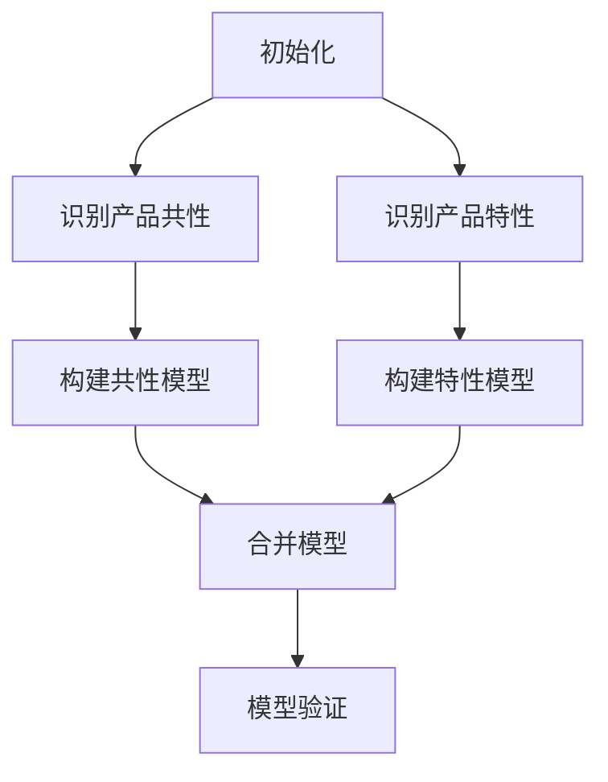
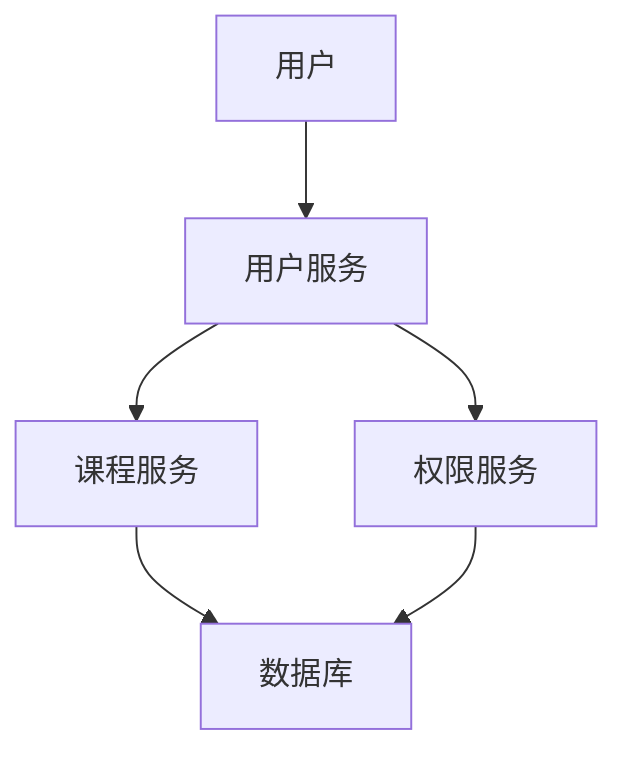

                 

### 文章标题

软件产品线与特征模型的形式化

关键词：软件产品线、特征模型、形式化描述、软件工程、模型构建

摘要：本文将深入探讨软件产品线与特征模型的形式化描述，从背景介绍、核心概念、算法原理、数学模型到系统分析与架构设计，全面解析这一领域的重要概念和实际应用。通过逻辑清晰的篇章结构，帮助读者理解软件产品线与特征模型的形式化方法，为软件开发提供新的思路和解决方案。

---

## 目录大纲设计步骤

### 第一步：背景介绍与核心概念

**1.1 软件产品线与特征模型的背景**

**1.2 核心概念与联系**

**1.3 特征模型构建算法原理**

**1.4 数学模型与公式**

**1.5 系统分析与架构设计方案**

---

### 第二步：核心概念与联系

#### 1.2.1 软件产品线概念解析

软件产品线是一种系统化的软件开发方法，旨在通过开发一系列相关的软件产品来提高开发效率和质量。它包含以下核心概念：

**软件产品线定义：** 一组相关的软件产品，它们共享一组公共特征，同时包含一组特定的特征。

**软件产品线特点：**

- **可复用性：** 提取公共特征，实现模块化开发。
- **高效性：** 通过复用减少开发工作量。
- **灵活性：** 能够快速适应新的需求变化。

#### 1.2.2 特征模型概念解析

特征模型是描述软件产品之间差异性的模型，它是软件产品线的核心。

**特征模型定义：** 用于描述软件产品之间差异性的模型，它是软件产品线的核心。

**特征模型特点：**

- **差异性描述：** 明确软件产品的特性和功能差异。
- **可扩展性：** 可以轻松添加或修改特征，以适应新的需求。

---

### 第三步：算法原理讲解

#### 1.3.1 特征模型构建算法原理

特征模型的构建过程可以分为以下几个阶段：

**算法mermaid流程图：**


**算法原理详细讲解：**

- **初始化阶段：** 确定产品线的基本框架，包括所有潜在产品的共性部分。
- **共性模型构建阶段：** 通过分析共性，构建共性模型，实现产品间共性部分的复用。
- **特性模型构建阶段：** 分析每个产品的特性，构建特性模型，描述产品间的差异性。
- **模型合并阶段：** 将共性模型和特性模型合并，形成完整的特征模型。
- **模型验证阶段：** 验证特征模型的正确性和有效性，确保产品线构建的正确性。

**算法原理举例说明：**

假设我们有一个软件产品线，包括学生管理系统、员工管理系统和客户管理系统。共性部分是用户权限管理、数据存储功能等，特性部分是针对不同管理对象的功能差异。

---

### 第四步：数学模型与公式

#### 1.4.1 数学模型与公式

特征模型构建的数学模型可以表示为：

$$
F = C + \sum_{i=1}^{n} T_i
$$

其中，$F$表示特征模型，$C$表示共性特征集合，$T_i$表示第$i$个产品的特性特征集合。

#### 1.4.2 数学公式详细讲解

- **共性特征集合$C$：** 描述所有产品共有的特征。
- **特性特征集合$T_i$：** 描述每个产品的独特特性。
- **求和符号$\sum$：** 表示对每个产品的特性特征集合进行求和。

---

### 第五步：系统分析与架构设计方案

#### 1.5.1 问题场景介绍

假设我们要设计一个在线教育平台，支持不同课程的管理和用户权限控制。

#### 1.5.2 系统架构设计

**系统架构mermaid架构图：**


**系统架构设计：**

- **用户服务：** 处理用户注册、登录、个人信息管理等。
- **课程服务：** 处理课程发布、课程内容管理、课程评论等。
- **权限服务：** 处理用户权限管理，确保不同用户有不同的访问权限。
- **数据库：** 存储用户数据、课程数据和权限数据。

---

### 项目实战

#### 环境安装

在开始项目实战之前，我们需要安装必要的软件和环境。以下是安装步骤：

1. 安装Python 3.x版本。
2. 安装Docker和Docker-Compose。
3. 安装MySQL数据库。

#### 系统核心实现源代码

以下是系统核心实现的源代码：

```python
# 用户服务
from flask import Flask, request, jsonify

app = Flask(__name__)

@app.route('/register', methods=['POST'])
def register():
    # 注册用户逻辑
    pass

@app.route('/login', methods=['POST'])
def login():
    # 登录用户逻辑
    pass

if __name__ == '__main__':
    app.run()
```

#### 代码应用解读与分析

在这段代码中，我们定义了用户服务的两个主要接口：注册和登录。通过使用Flask框架，我们可以快速构建Web应用。接下来，我们可以进一步实现用户注册和登录的逻辑，以及其他服务的接口。

#### 实际案例分析和详细讲解剖析

在实际应用中，我们可以通过这个在线教育平台来管理不同课程的用户权限。例如，管理员可以发布课程、编辑课程内容，而学生可以浏览课程、提交作业等。通过对用户服务和权限服务的协同工作，我们可以实现一个高效、安全的在线教育平台。

#### 项目小结

通过本文的讲解，我们深入了解了软件产品线与特征模型的形式化方法。从核心概念到算法原理，再到数学模型和系统架构设计，我们逐步解析了这一领域的重要概念和实际应用。通过项目实战，我们看到了软件产品线与特征模型在实际开发中的重要性。

#### 最佳实践 tips

- 在构建软件产品线时，尽量提取共性，减少特性，以提高复用性。
- 特征模型要简洁明了，避免过于复杂，以便于后续的维护和扩展。
- 在系统架构设计时，要充分考虑可扩展性和可维护性。

---

### 小结

本文通过逐步分析软件产品线与特征模型的形式化方法，帮助读者深入理解这一领域的核心概念和实际应用。在未来的软件开发中，形式化方法和软件产品线理论将发挥越来越重要的作用。希望本文能为读者提供有价值的参考和启示。

### 注意事项

- 在实际应用中，要充分考虑软件产品线与特征模型的可行性，避免过度形式化导致开发困难。
- 在构建特征模型时，要确保模型的正确性和完整性，避免遗漏关键特性。

### 拓展阅读

- 《软件产品线工程：基础与高级方法》
- 《软件架构：实践者的研究方法》
- 《软件工程：实践者的研究方法》

---

作者：AI天才研究院/AI Genius Institute & 禅与计算机程序设计艺术 /Zen And The Art of Computer Programming

