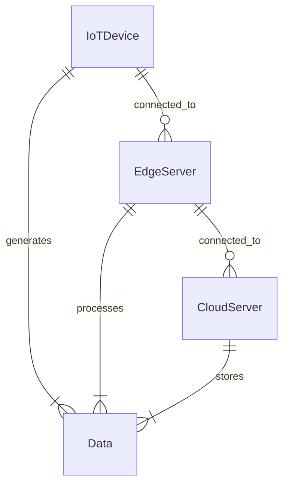
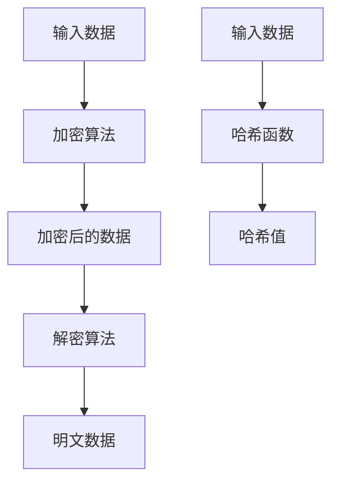
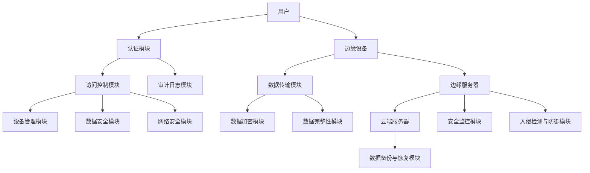
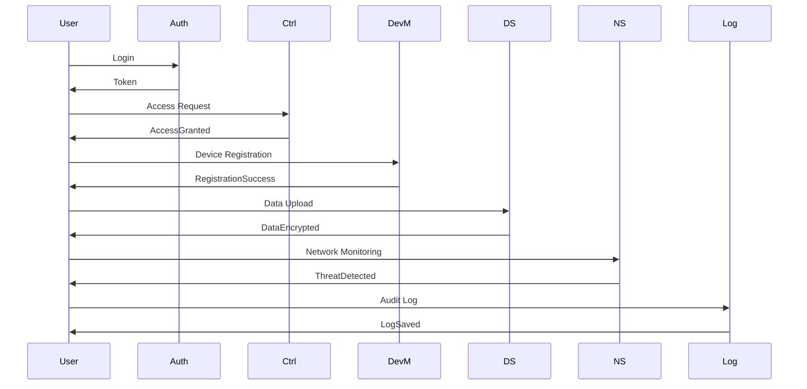

                 


### 引言

#### 背景介绍

随着互联网技术的飞速发展，物联网（Internet of Things，IoT）已经逐渐成为现代生活的重要组成部分。从智能家居到工业自动化，从智慧城市到车联网，物联网的应用场景无处不在。而在这个过程中，边缘计算（Edge Computing）也逐渐兴起。边缘计算是一种分布式计算架构，它将数据处理和分析的任务从云端转移到网络边缘，即靠近数据源的地方。这种模式不仅减少了数据传输的延迟，还提高了系统的响应速度和处理能力。

然而，随着物联网和边缘计算的应用不断深入，网络安全问题也日益突出。传统的网络安全措施已经无法满足物联网环境下的需求，边缘安全（Edge Security）成为了一个亟待解决的问题。边缘安全不仅仅是保护物联网设备的安全，还需要考虑数据的完整性、隐私性和可靠性。在这个背景下，边缘安全的重要性日益凸显。

#### 问题描述

边缘安全面临的核心挑战主要包括以下几个方面：

1. **安全性：** 物联网设备和边缘服务器的安全防护能力较弱，容易成为黑客攻击的目标。攻击者可以通过入侵设备或服务器，窃取敏感数据或控制设备。

2. **数据隐私：** 物联网设备产生的数据往往包含用户隐私信息，如何在传输和存储过程中保护这些数据不被泄露，是边缘安全的一个重要问题。

3. **网络攻击：** 物联网设备和边缘服务器可能会遭受各种网络攻击，如DDoS攻击、中间人攻击、数据篡改等，这些攻击可能导致系统瘫痪或数据泄露。

4. **设备安全：** 物联网设备的硬件和软件安全机制不足，容易受到物理攻击或软件攻击。

5. **管理难度：** 物联网设备和边缘服务器的数量庞大，分布广泛，管理难度大，传统的集中式管理方式难以应对。

#### 问题解决

为了应对边缘安全面临的挑战，当前已经出现了一些解决方案：

1. **安全协议与标准：** 制定了一系列安全协议和标准，如TLS（传输层安全协议）、IoT Security Foundation等，以提高物联网设备和边缘服务器的安全性。

2. **加密技术：** 采用加密技术保护数据的传输和存储过程，如对称加密、非对称加密和哈希算法等。

3. **访问控制：** 实施严格的访问控制策略，确保只有授权用户才能访问敏感数据。

4. **安全监控：** 建立安全监控体系，实时监测网络流量和设备状态，及时发现并应对安全威胁。

5. **自动化响应：** 开发自动化响应系统，一旦发现安全威胁，能够快速采取行动，减轻损失。

#### 边界与外延

边缘安全与其他安全领域的区别主要体现在以下几个方面：

1. **应用场景：** 边缘安全主要关注物联网设备和边缘服务器的安全，而传统网络安全主要关注网络边界的安全。

2. **技术特点：** 边缘安全需要考虑数据处理的速度和延迟，而传统网络安全更注重防护能力和策略。

3. **挑战性：** 边缘安全面临的数据隐私和网络攻击等问题更为复杂，需要更多的创新技术来解决。

#### 概念结构与核心要素组成

边缘安全的核心组成部分包括：

1. **设备安全：** 保护物联网设备和边缘服务器的硬件和软件安全。

2. **网络安全：** 保护网络传输过程的安全，防止数据泄露和网络攻击。

3. **数据安全：** 保护数据的存储和传输过程，确保数据的完整性和隐私性。

4. **访问控制：** 实施严格的访问控制策略，确保只有授权用户才能访问敏感数据。

5. **监控与响应：** 实时监控网络状态和设备安全情况，快速响应安全威胁。

核心概念之间的相互关系如下：

- 设备安全是边缘安全的基础，直接影响其他组成部分的安全性。
- 网络安全是保障数据安全的关键，需要采用多种安全协议和加密技术。
- 数据安全是边缘安全的最终目标，需要从传输、存储等多个环节进行保护。
- 访问控制是保障数据安全的重要手段，需要严格限制对敏感数据的访问。
- 监控与响应是发现和应对安全威胁的关键，需要建立高效的安全监控和自动化响应系统。

### 总结

边缘安全是物联网环境下面临的重要挑战之一，它不仅关系到用户隐私和数据安全，还影响到整个物联网生态系统的稳定性。通过理解边缘安全的核心概念、结构要素和解决方法，我们可以更好地应对这一挑战，确保物联网环境的可靠和安全。接下来，我们将进一步探讨边缘安全的核心概念、原理以及在实际应用中的实现方法。

---

#### 第一部分：核心概念与联系

### 第2章：核心概念原理

#### 2.1 边缘计算

边缘计算是一种分布式计算架构，它将数据处理和分析的任务从传统的集中式云端转移到网络边缘，即在靠近数据源的地方进行计算。这种架构的核心理念是“数据靠近计算”，从而降低数据传输的延迟，提高系统的响应速度和效率。

**定义与作用：**

- **定义：** 边缘计算（Edge Computing）是指在网络边缘节点（如物联网设备、边缘服务器等）上进行数据处理、存储和分析的一种计算模式。
- **作用：** 边缘计算通过将计算任务分散到网络边缘，可以实现以下效果：
  - **降低延迟：** 减少数据传输到云端的时间，从而降低系统的响应时间。
  - **提高效率：** 在数据产生的源头附近进行计算，可以更快速地处理数据，提高系统效率。
  - **减轻云端负担：** 将部分计算任务转移到边缘，可以减轻云端服务器的负担，提高其处理能力。

**技术架构：**

边缘计算的技术架构通常包括以下几个层次：

1. **边缘设备：** 包括各种物联网设备，如传感器、智能设备、摄像头等，这些设备负责数据的采集和初步处理。
2. **边缘服务器：** 负责边缘计算任务的处理和存储，可以是专用服务器或虚拟机，部署在接近数据源的位置。
3. **云端服务器：** 虽然边缘计算将部分计算任务转移到网络边缘，但仍然需要与云端服务器进行协同，完成一些复杂的计算任务和数据存储。
4. **网络连接：** 边缘计算依赖于高效的网络连接，包括有线和无线网络，如5G、Wi-Fi等。

**优势与挑战：**

边缘计算具有以下优势：

- **实时响应：** 边缘计算能够实现实时数据处理和响应，适用于需要快速决策的应用场景，如自动驾驶、智能制造等。
- **高效率：** 边缘计算通过减少数据传输，提高了计算效率，降低了系统延迟。
- **高可靠性：** 边缘计算能够更好地应对网络中断和数据丢失等风险，提高系统的可靠性。

然而，边缘计算也面临一些挑战：

- **安全风险：** 边缘设备通常分布在不同的地理位置，安全性难以保障，容易成为黑客攻击的目标。
- **数据隐私：** 边缘计算需要处理大量的敏感数据，如何在传输和存储过程中保护数据隐私，是一个重要问题。
- **管理复杂度：** 边缘设备数量庞大，分布广泛，管理复杂度增加，需要有效的管理策略和工具。

#### 2.2 物联网安全

物联网安全是指保护物联网设备和系统免受各种安全威胁的措施和策略。随着物联网的普及，物联网安全越来越受到关注，因为它关系到用户隐私、数据安全和系统稳定性。

**常见威胁与攻击方式：**

- **设备入侵：** 黑客可以通过各种手段入侵物联网设备，如利用漏洞、弱密码、默认配置等。
- **数据泄露：** 物联网设备采集和处理的数据可能包含敏感信息，如用户个人信息、金融数据等，黑客可能会窃取这些数据。
- **中间人攻击：** 攻击者拦截和篡改物联网设备与服务器之间的通信数据，可能导致数据泄露或系统失控。
- **DDoS攻击：** 攻击者通过控制大量的物联网设备，发起分布式拒绝服务攻击，导致目标服务器瘫痪。
- **恶意软件：** 黑客可以在物联网设备上植入恶意软件，如勒索软件、木马等，窃取数据或控制设备。

**安全协议与标准：**

为了保障物联网安全，已经制定了一系列安全协议和标准：

- **TLS（传输层安全协议）：** 用于保护数据在传输过程中的安全，防止数据被窃取或篡改。
- **IoT Security Foundation：** 由多个组织和企业共同发起的安全标准组织，致力于推动物联网安全的发展。
- **IoT Security Blueprints：** 由微软推出的物联网安全蓝图，提供了详细的物联网安全架构和最佳实践。
- **IoT Device Security：** 许多硬件制造商在设备设计中考虑了安全因素，如加密存储、安全的通信协议等。

边缘安全的重要性：边缘安全在物联网安全中具有特殊的重要性。由于边缘设备通常位于网络边缘，直接与用户接触，它们的安全性直接影响到整个物联网系统的安全。如果边缘设备被入侵，攻击者可能会进一步入侵网络边缘的其他设备，甚至影响到云端服务器。因此，保障边缘安全是物联网安全的关键。

### 概念属性特征对比表格

为了更好地理解边缘计算和物联网安全的区别和联系，下面给出了一个概念属性特征对比表格：

| 特征 | 边缘计算 | 物联网安全 |
| --- | --- | --- |
| **定义** | 分布式计算架构，数据处理靠近数据源 | 保护物联网设备和系统的安全 |
| **技术架构** | 边缘设备、边缘服务器、云端服务器 | 设备安全、网络安全、数据安全 |
| **优势** | 降低延迟、提高效率、高可靠性 | 实时响应、数据保护、系统稳定性 |
| **挑战** | 安全风险、数据隐私、管理复杂度 | 设备入侵、数据泄露、中间人攻击 |
| **协议与标准** | TLS、IoT Security Foundation | TLS、IoT Security Foundation |

通过这个对比表格，我们可以更清晰地看到边缘计算和物联网安全在定义、技术架构、优势、挑战以及协议与标准等方面的区别和联系。

### ER实体关系图架构

为了进一步理解边缘计算和物联网安全的关系，下面给出了一个ER（实体关系）图架构，使用Mermaid流程图表示：



在这个ER图架构中，物联网设备（IoTDevice）与边缘服务器（EdgeServer）相连，边缘服务器又与云端服务器（CloudServer）相连。物联网设备生成数据，边缘服务器处理数据，云端服务器存储数据。这个架构展示了数据从产生到处理和存储的完整流程，同时也反映了边缘计算和物联网安全之间的紧密联系。

### 总结

在本章节中，我们详细介绍了边缘计算和物联网安全的核心概念、原理及其相互关系。通过对比分析，我们可以更清晰地理解这两个概念的特点和区别。边缘计算通过将数据处理靠近数据源，提高了系统的实时响应和效率；而物联网安全则关注保护物联网设备和系统的安全，防止各种安全威胁。边缘安全和物联网安全之间存在着密切的联系，保障边缘安全是确保整个物联网系统安全的关键。在接下来的章节中，我们将继续探讨边缘安全的具体实现方法和技术细节。

---

#### 第三部分：算法原理讲解

### 第4章：边缘安全算法

#### 4.1 加密与解密算法

加密与解密算法是保障数据安全的重要手段，它们在边缘安全中扮演着核心角色。加密算法用于将明文数据转换为密文，以防止数据在传输过程中被窃取或篡改；解密算法则用于将密文还原为明文，以便合法用户能够读取和使用数据。

**常见加密算法：**

1. **对称加密（Symmetric Encryption）：**
   对称加密是一种加密算法，它使用相同的密钥来加密和解密数据。常见的对称加密算法包括：
   - **AES（高级加密标准）：** AES是一种广泛使用的对称加密算法，它具有高安全性且计算效率较高。
   - **DES（数据加密标准）：** DES是一种较早的对称加密算法，但由于其密钥较短，安全性较低，目前已较少使用。

2. **非对称加密（Asymmetric Encryption）：**
   非对称加密使用一对密钥（公钥和私钥）来加密和解密数据。公钥用于加密，私钥用于解密。常见的非对称加密算法包括：
   - **RSA（Rivest-Shamir-Adleman）：** RSA是一种经典的非对称加密算法，广泛应用于安全通信和数字签名。
   - **ECC（椭圆曲线密码学）：** ECC是一种基于椭圆曲线数学的加密算法，具有更高的安全性和效率。

**加密算法在边缘安全中的应用：**

在边缘安全中，加密算法用于以下几个方面：

1. **数据传输安全：** 在物联网设备和边缘服务器之间传输数据时，使用加密算法可以确保数据在传输过程中不被窃取或篡改。
2. **存储安全：** 物联网设备和边缘服务器上的数据存储过程中，使用加密算法可以防止数据泄露。
3. **身份验证：** 通过加密算法可以实现身份验证，确保只有授权用户能够访问敏感数据。

#### 4.2 哈希算法

哈希算法（Hash Function）是一种将输入数据映射为固定长度输出值（哈希值）的函数。哈希算法广泛应用于数据完整性校验、数据加密和数字签名等领域。

**哈希函数原理：**

哈希函数的基本原理是将输入数据（无论数据长度如何）映射为固定长度的输出值。理想情况下，不同的输入数据应产生不同的哈希值，且相同的输入数据应产生相同的哈希值。常见的哈希算法包括：

1. **MD5（Message-Digest Algorithm 5）：** MD5是一种广泛使用的哈希算法，它将输入数据映射为128位的哈希值。
2. **SHA-1（Secure Hash Algorithm 1）：** SHA-1是一种较新的哈希算法，它将输入数据映射为160位的哈希值。
3. **SHA-2（Secure Hash Algorithm 2）：** SHA-2包括SHA-224、SHA-256、SHA-384和SHA-512等多种哈希算法，提供不同的哈希长度和安全级别。

**哈希算法在边缘安全中的应用：**

在边缘安全中，哈希算法用于以下几个方面：

1. **数据完整性校验：** 通过计算数据的哈希值，可以验证数据在传输或存储过程中是否被篡改。
2. **数字签名：** 哈希算法可以用于生成数字签名，确保数据的真实性和完整性。
3. **密码存储：** 将密码转换为哈希值存储在系统中，可以防止密码泄露，提高安全性。

#### 4.3 算法mermaid流程图

为了更直观地展示加密与解密算法和哈希算法的流程，我们使用Mermaid流程图来表示：



在这个流程图中，输入数据首先通过加密算法加密，然后通过解密算法解密，还原成明文数据。同样，输入数据通过哈希函数计算得到哈希值，用于数据完整性校验和数字签名。

#### 4.4 Python源代码实现

下面是使用Python实现加密与解密算法和哈希算法的示例代码：

```python
from Crypto.Cipher import AES, PKCS1_OAEP
from Crypto.PublicKey import RSA
from Crypto.Random import get_random_bytes
from Crypto.Util.Padding import pad, unpad
import hashlib

# 对称加密（AES）示例
key = get_random_bytes(16)  # 生成16字节（128位）的密钥
cipher_aes = AES.new(key, AES.MODE_CBC)
ct_bytes = cipher_aes.encrypt(pad(b'Hello, World!', AES.block_size))
iv = cipher_aes.iv
print(f'加密后的数据：{ct_bytes.hex()}')
print(f'初始化向量：{iv.hex()}')

cipher_aes = AES.new(key, AES.MODE_CBC, iv)
pt = unpad(cipher_aes.decrypt(ct_bytes), AES.block_size)
print(f'解密后的数据：{pt.decode()}')

# 非对称加密（RSA）示例
key RSA = RSA.generate(2048)
private_key = key RSA.export_key()
public_key = key RSA.publickey().export_key()

cipher_rsa = PKCS1_OAEP.new(RSA.import_key(public_key))
encrypted_data = cipher_rsa.encrypt(b'Hello, World!')

cipher_rsa = PKCS1_OAEP.new(RSA.import_key(private_key))
decrypted_data = cipher_rsa.decrypt(encrypted_data)
print(f'加密后的数据：{encrypted_data.hex()}')
print(f'解密后的数据：{decrypted_data.decode()}')

# 哈希算法（SHA-256）示例
hash_object = hashlib.sha256()
hash_object.update(b'Hello, World!')
hex_dig = hash_object.hexdigest()
print(f'哈希值：{hex_dig}')
```

在这个示例中，我们首先使用AES算法进行对称加密和解密，然后使用RSA算法进行非对称加密和解密，最后使用SHA-256算法计算哈希值。

#### 4.5 算法原理详细讲解

**加密算法原理：**

加密算法的基本原理是将明文数据转换为密文，以保护数据的安全性。加密过程通常包括以下几个步骤：

1. **密钥生成：** 根据加密算法的要求，生成加密密钥。密钥是加密和解密过程中不可或缺的部分，决定了加密算法的安全性。
2. **数据处理：** 将明文数据按照加密算法的要求进行预处理，如填充（padding）等。
3. **加密运算：** 使用密钥和加密算法对预处理后的数据进行加密运算，生成密文。
4. **密文输出：** 输出加密后的数据，以便在传输或存储过程中保护数据。

**解密算法原理：**

解密算法是将密文还原为明文的过程，它与加密算法相对应。解密过程通常包括以下几个步骤：

1. **密钥生成：** 与加密算法相同，生成解密密钥。
2. **数据处理：** 将密文按照加密算法的要求进行预处理，如填充（padding）等。
3. **解密运算：** 使用密钥和解密算法对预处理后的数据进行解密运算，生成明文。
4. **明文输出：** 输出解密后的数据，以便用户读取和使用。

**哈希算法原理：**

哈希算法的基本原理是将输入数据映射为固定长度的输出值（哈希值）。哈希算法通常具有以下特点：

1. **不可逆性：** 给定一个哈希值，无法推导出原始输入数据。
2. **抗冲突性：** 不同的输入数据应产生不同的哈希值，相同的输入数据应产生相同的哈希值。
3. **固定长度：** 哈希值长度通常是固定的，无论输入数据的长度如何。

哈希算法广泛应用于数据完整性校验、数字签名和密码学等领域。

**举例说明：**

1. **对称加密算法举例：**

   使用AES算法进行对称加密和解密：

   ```python
   from Crypto.Cipher import AES
   from Crypto.Random import get_random_bytes
   from Crypto.Util.Padding import pad, unpad

   # 生成16字节的密钥
   key = get_random_bytes(16)

   # 对数据进行填充，使其长度为AES块大小的整数倍
   plain_text = b"Hello, World!"
   padded_text = pad(plain_text, AES.block_size)

   # 创建AES加密对象，并使用密钥和加密模式（CBC）进行加密
   cipher_aes = AES.new(key, AES.MODE_CBC)
   cipher_text = cipher_aes.encrypt(padded_text)

   # 创建AES解密对象，并使用相同的密钥和解密模式进行解密
   cipher_aes = AES.new(key, AES.MODE_CBC, cipher_aes.iv)
   unpadded_text = unpad(cipher_aes.decrypt(cipher_text), AES.block_size)

   print("加密后的数据：", cipher_text.hex())
   print("解密后的数据：", unpadded_text.decode())
   ```

   在这个示例中，我们首先生成一个16字节的密钥，然后对数据进行填充，使其长度为AES块大小的整数倍。接着，我们创建一个AES加密对象，并使用密钥和加密模式（CBC）进行加密。最后，我们创建一个AES解密对象，并使用相同的密钥和解密模式进行解密，还原出原始数据。

2. **非对称加密算法举例：**

   使用RSA算法进行非对称加密和解密：

   ```python
   from Crypto.PublicKey import RSA
   from Crypto.Cipher import PKCS1_OAEP
   from Crypto.Random import get_random_bytes

   # 生成RSA密钥对
   key = RSA.generate(2048)
   private_key = key.export_key()
   public_key = key.publickey().export_key()

   # 使用公钥和OAEP加密模式进行加密
   cipher_rsa = PKCS1_OAEP.new(RSA.import_key(public_key))
   encrypted_data = cipher_rsa.encrypt(b"Hello, World!")

   # 使用私钥和OAEP加密模式进行解密
   cipher_rsa = PKCS1_OAEP.new(RSA.import_key(private_key))
   decrypted_data = cipher_rsa.decrypt(encrypted_data)

   print("加密后的数据：", encrypted_data.hex())
   print("解密后的数据：", decrypted_data.decode())
   ```

   在这个示例中，我们首先生成一个RSA密钥对，然后使用公钥和OAEP加密模式进行加密，最后使用私钥和OAEP加密模式进行解密，还原出原始数据。

3. **哈希算法举例：**

   使用SHA-256算法计算哈希值：

   ```python
   import hashlib

   # 计算SHA-256哈希值
   hash_object = hashlib.sha256()
   hash_object.update(b"Hello, World!")
   hex_dig = hash_object.hexdigest()

   print("哈希值：", hex_dig)
   ```

   在这个示例中，我们使用SHA-256算法计算输入字符串“Hello, World!”的哈希值，并将结果输出。

通过这些示例，我们可以更直观地理解加密与解密算法和哈希算法的原理和应用。在实际应用中，这些算法可以有效地保障数据的安全性和完整性，为边缘安全提供强有力的技术支持。

---

#### 第四部分：数学模型与公式

### 第5章：数学模型原理

#### 5.1 信息论基础

信息论是研究信息传输、处理和存储的数学理论，它为加密与解密算法提供了理论基础。在信息论中，几个关键概念和公式如下：

1. **信息熵（Entropy）：**
   信息熵是衡量信息不确定性的量度，用于描述数据中的信息含量。信息熵的定义公式为：

   $$H(X) = -\sum_{i} p(x_i) \cdot \log_2 p(x_i)$$

   其中，$H(X)$ 表示随机变量 $X$ 的熵，$p(x_i)$ 表示 $X$ 取值 $x_i$ 的概率。

   **举例说明：**
   假设一个随机变量 $X$ 只有两个可能的取值，$0$ 和 $1$，且概率分别为 $0.5$。则 $X$ 的熵为：

   $$H(X) = -0.5 \cdot \log_2 0.5 - 0.5 \cdot \log_2 0.5 = 1$$

   这意味着该随机变量包含一个比特（bit）的信息。

2. **信道容量（Channel Capacity）：**
   信道容量是指在一个给定的信噪比下，信道能够传输的最大信息速率。香农公式给出了计算信道容量的方法：

   $$C = B \log_2(1 + \frac{S}{N})$$

   其中，$C$ 是信道容量（单位：比特每秒，bps），$B$ 是信道的带宽（单位：赫兹，Hz），$S$ 是信号功率，$N$ 是噪声功率。

   **举例说明：**
   假设一个信道的带宽为 $1000$ Hz，信噪比为 $1000$。则该信道的容量为：

   $$C = 1000 \log_2(1 + 1000) \approx 6.908 \text{ Mbps}$$

#### 5.2 加密算法的数学模型

加密算法的数学模型通常基于数学函数和加密密钥。以下是对几种常见加密算法的数学模型描述：

1. **对称加密（Symmetric Encryption）：**
   对称加密算法使用相同的密钥进行加密和解密。常见的对称加密算法包括AES和DES。

   - **AES（高级加密标准）：**
     AES是一种分组加密算法，它将明文分为 $128$ 位块，并对每个块进行加密。AES加密的数学模型为：

     $$C = E_K(P)$$

     其中，$C$ 是密文，$P$ 是明文，$K$ 是加密密钥，$E_K$ 是加密函数。

     - **解密过程：**
       $$P = D_K(C)$$

       其中，$D_K$ 是解密函数。

2. **非对称加密（Asymmetric Encryption）：**
   非对称加密算法使用一对密钥（公钥和私钥）进行加密和解密。常见的非对称加密算法包括RSA和ECC。

   - **RSA（Rivest-Shamir-Adleman）：**
     RSA加密算法基于大整数分解的难度。其加密模型为：

     $$C = E_{n, e}(M) = M^e \mod n$$

     其中，$n$ 是模数，$e$ 是公钥指数，$M$ 是明文，$C$ 是密文。

     - **解密过程：**
       $$P = D_{n, d}(C) = C^d \mod n$$

       其中，$d$ 是私钥指数。

   - **ECC（椭圆曲线密码学）：**
     ECC基于椭圆曲线离散对数问题的难度。其加密模型为：

     $$C = E_{Q, g, y}(P, K)$$

     其中，$Q$ 是椭圆曲线，$g$ 是基点，$y$ 是公钥，$P$ 是明文，$K$ 是随机数，$C$ 是密文。

     - **解密过程：**
       $$P = D_{Q, g, y}(C, K')$$

       其中，$K'$ 是私钥。

#### 5.3 哈希算法的数学模型

哈希算法的数学模型通常基于哈希函数。以下是对几种常见哈希算法的数学模型描述：

1. **MD5（Message-Digest Algorithm 5）：**
   MD5是一种将任意长度的数据映射为128位哈希值的算法。其数学模型为：

   $$H = \text{MD5}(M)$$

   其中，$H$ 是哈希值，$M$ 是输入数据。

2. **SHA-1（Secure Hash Algorithm 1）：**
   SHA-1是一种将任意长度的数据映射为160位哈希值的算法。其数学模型为：

   $$H = \text{SHA-1}(M)$$

   其中，$H$ 是哈希值，$M$ 是输入数据。

3. **SHA-2（Secure Hash Algorithm 2）：**
   SHA-2包括SHA-224、SHA-256、SHA-384和SHA-512等多种哈希算法。其数学模型为：

   $$H = \text{SHA-2}(M, n)$$

   其中，$H$ 是哈希值，$M$ 是输入数据，$n$ 是哈希值长度。

### 第6章：数学公式详细讲解

在边缘安全算法中，数学公式是理解算法原理和实现算法功能的关键。以下是对几个关键数学公式的详细讲解：

#### 6.1 熵的计算公式

熵（Entropy）是衡量信息不确定性的量度，其计算公式为：

$$H(X) = -\sum_{i} p(x_i) \cdot \log_2 p(x_i)$$

其中，$H(X)$ 表示随机变量 $X$ 的熵，$p(x_i)$ 表示 $X$ 取值 $x_i$ 的概率。

**举例说明：**
假设一个随机变量 $X$ 只有两个可能的取值，$0$ 和 $1$，且概率分别为 $0.5$。则 $X$ 的熵为：

$$H(X) = -0.5 \cdot \log_2 0.5 - 0.5 \cdot \log_2 0.5 = 1$$

这意味着该随机变量包含一个比特（bit）的信息。

#### 6.2 信道容量的计算公式

信道容量（Channel Capacity）是指在一个给定的信噪比下，信道能够传输的最大信息速率，其计算公式为：

$$C = B \log_2(1 + \frac{S}{N})$$

其中，$C$ 是信道容量（单位：比特每秒，bps），$B$ 是信道的带宽（单位：赫兹，Hz），$S$ 是信号功率，$N$ 是噪声功率。

**举例说明：**
假设一个信道的带宽为 $1000$ Hz，信噪比为 $1000$。则该信道的容量为：

$$C = 1000 \log_2(1 + 1000) \approx 6.908 \text{ Mbps}$$

这意味着该信道在给定带宽和信噪比下能够传输大约 $6.908$ 兆比特每秒的信息。

#### 6.3 加密算法的工作原理

对称加密算法和非对称加密算法的工作原理可以通过以下数学公式进行描述：

1. **对称加密算法（如AES）：**
   - **加密过程：**
     $$C = E_K(P)$$

     其中，$C$ 是密文，$P$ 是明文，$K$ 是加密密钥，$E_K$ 是加密函数。

     - **解密过程：**
       $$P = D_K(C)$$

       其中，$D_K$ 是解密函数。

   **举例说明：**
   假设使用AES算法对明文“Hello, World!”进行加密。首先，生成一个128位密钥，然后使用AES算法加密，得到密文。解密时，使用相同的密钥和解密算法，将密文还原为明文。

2. **非对称加密算法（如RSA）：**
   - **加密过程：**
     $$C = E_{n, e}(M) = M^e \mod n$$

     其中，$n$ 是模数，$e$ 是公钥指数，$M$ 是明文，$C$ 是密文。

     - **解密过程：**
       $$P = D_{n, d}(C) = C^d \mod n$$

       其中，$d$ 是私钥指数。

   **举例说明：**
   假设使用RSA算法对明文“Hello, World!”进行加密。首先，生成一个RSA密钥对（公钥和私钥），然后使用公钥加密，得到密文。解密时，使用私钥解密，将密文还原为明文。

#### 6.4 哈希函数的计算过程

哈希函数（如MD5和SHA-1）用于计算数据的哈希值，其计算过程通常如下：

$$H = \text{Hash Function}(M)$$

其中，$H$ 是哈希值，$M$ 是输入数据。

**举例说明：**
假设使用MD5算法计算字符串“Hello, World!”的哈希值。将字符串作为输入，通过MD5算法计算得到一个128位的哈希值。该哈希值可用于数据完整性校验和数字签名。

通过以上详细讲解，我们可以更深入地理解边缘安全中常用的数学模型和公式，为实际应用提供理论基础。在接下来的章节中，我们将进一步探讨边缘安全系统的架构设计、实现方法和实际案例分析。

---

#### 第五部分：系统分析与架构设计方案

### 第7章：问题场景介绍

边缘安全系统在物联网环境中的应用场景涵盖了多个领域，包括智能家居、工业物联网、智慧城市和车联网等。以下是这些场景的具体介绍：

#### 智能家居

智能家居是物联网应用中最常见的场景之一，包括智能门锁、智能照明、智能安防设备等。边缘安全系统在智能家居中的应用主要体现在以下几个方面：

- **设备安全防护：** 保护智能设备免受黑客攻击，如DDoS攻击、设备入侵等。
- **数据隐私保护：** 保障家庭用户的数据隐私，如摄像头拍摄的数据、门锁开锁记录等。
- **远程访问控制：** 通过加密技术，确保远程访问智能家居设备的通信安全。

#### 工业物联网

工业物联网（IIoT）在工业生产中发挥着重要作用，包括自动化控制、设备监控、生产调度等。边缘安全系统在工业物联网中的应用主要包括：

- **设备安全防护：** 保护工业设备免受网络攻击，如篡改设备参数、数据泄露等。
- **数据完整性保障：** 确保生产数据在传输和存储过程中的完整性和可靠性。
- **安全监控与预警：** 实时监控工业设备的安全状态，及时发现并响应潜在的安全威胁。

#### 智慧城市

智慧城市通过物联网技术实现城市管理的智能化，包括交通管理、环境监测、公共安全等。边缘安全系统在智慧城市中的应用包括：

- **数据安全保护：** 保护城市管理的各类数据，如交通流量、环境监测数据等，防止数据泄露。
- **智能设备安全：** 保护智能路灯、智能摄像头等设备，防止设备被非法控制。
- **城市安全监控：** 通过边缘安全系统，实现城市安全的实时监控和快速响应。

#### 车联网

车联网是将车辆与互联网连接起来，实现智能驾驶、车联网服务等功能。边缘安全系统在车联网中的应用包括：

- **车辆安全防护：** 保护车辆免受网络攻击，如远程锁定车辆、篡改车辆数据等。
- **数据隐私保护：** 保护驾驶员和乘客的个人信息，如位置信息、行程数据等。
- **智能驾驶安全：** 通过边缘安全系统，保障智能驾驶系统的数据安全和通信安全。

### 第8章：系统功能设计

边缘安全系统的功能设计旨在提供全面的安全保护，包括数据安全、设备安全、网络安全和访问控制等方面。以下是具体的功能设计：

#### 数据安全

- **数据加密：** 采用对称加密和非对称加密技术，对传输和存储的数据进行加密，防止数据泄露和篡改。
- **数据完整性校验：** 使用哈希算法对数据完整性进行校验，确保数据在传输和存储过程中的完整性。
- **数据备份与恢复：** 定期备份重要数据，并在数据丢失或损坏时进行恢复。

#### 设备安全

- **设备身份认证：** 通过数字签名和证书技术，确保设备的合法性和身份。
- **设备安全更新：** 定期更新设备的固件和软件，修复已知的安全漏洞。
- **设备状态监控：** 实时监控设备的安全状态，及时发现并响应设备异常。

#### 网络安全

- **网络流量监控：** 对网络流量进行实时监控，识别和阻止恶意流量。
- **入侵检测与防御：** 通过入侵检测系统（IDS）和入侵防御系统（IPS），及时发现和防御网络攻击。
- **网络隔离与分段：** 通过防火墙和虚拟局域网（VLAN），实现网络隔离和分段，提高网络安全性。

#### 访问控制

- **访问控制列表（ACL）：** 根据用户角色和权限，设置访问控制策略，确保只有授权用户才能访问敏感数据。
- **多因素认证（MFA）：** 采用多因素认证，提高用户身份验证的安全性。
- **审计日志：** 记录用户操作和系统事件，以便进行安全审计和异常分析。

### 第9章：系统架构设计

边缘安全系统的架构设计旨在实现安全功能的高效集成和灵活部署。以下是边缘安全系统的架构设计：

#### 系统架构图



在这个架构图中，用户通过认证模块进行身份验证，然后访问控制模块根据用户的权限控制其访问设备、数据和网络。设备管理模块负责设备的安全更新和状态监控，数据安全模块负责数据加密和完整性校验，网络安全模块负责网络流量监控和入侵防御。审计日志模块记录用户操作和系统事件。边缘设备通过数据传输模块与边缘服务器和云端服务器进行通信，边缘服务器和云端服务器则负责数据备份与恢复。

### 第10章：系统接口设计

边缘安全系统的接口设计是系统功能实现的关键，包括API设计和数据流设计。以下是系统接口设计：

#### API设计

- **认证接口：** 用户通过认证接口进行身份验证，获取访问令牌。
- **访问控制接口：** 根据用户的访问令牌，控制用户对设备、数据和网络的访问。
- **设备管理接口：** 管理边缘设备的注册、更新和状态监控。
- **数据安全接口：** 加密、解密和完整性校验数据。
- **网络安全接口：** 监控网络流量，防御入侵攻击。
- **审计日志接口：** 记录用户操作和系统事件。

#### 数据流设计

数据流设计描述了数据在系统中的传输和处理过程。以下是数据流设计：

1. **用户请求：** 用户通过接口发送请求，如登录、数据访问等。
2. **身份认证：** 认证模块验证用户的身份，生成访问令牌。
3. **访问控制：** 访问控制模块根据访问令牌和用户权限，决定是否允许访问。
4. **设备管理：** 设备管理模块处理设备相关的操作，如设备注册、状态更新等。
5. **数据安全：** 数据安全模块对传输和存储的数据进行加密和完整性校验。
6. **网络安全：** 网络安全模块监控网络流量，防御入侵攻击。
7. **审计日志：** 审计日志模块记录用户操作和系统事件。

通过系统接口设计和数据流设计，边缘安全系统实现了功能的高效集成和灵活部署，为物联网环境提供了全面的安全保护。

### 第11章：系统交互

系统交互描述了边缘安全系统内部组件以及与外部系统的交互过程。以下是系统交互：

#### 系统交互图



在这个交互图中，用户通过认证模块（Auth）进行身份验证，获取访问令牌（Token）。用户发送访问请求到访问控制模块（Ctrl），根据权限进行访问控制。设备管理模块（DevM）处理设备注册、更新和状态监控。数据安全模块（DS）负责数据加密和完整性校验。网络安全模块（NS）监控网络流量，发现威胁后通知用户。审计日志模块（Log）记录用户操作和系统事件。

通过系统交互设计，边缘安全系统实现了用户、设备、数据和网络之间的安全交互，确保了物联网环境的安全稳定运行。

### 总结

在本章节中，我们详细介绍了边缘安全系统在物联网环境中的应用场景、系统功能设计、架构设计、接口设计和系统交互。通过系统分析与架构设计方案，我们为边缘安全系统提供了一种可行的实现方法。接下来，我们将进一步探讨边缘安全系统的实现细节，包括环境安装、代码实现和案例分析。

---

#### 第六部分：项目实战

### 第12章：环境安装

在边缘安全系统的项目实战中，环境安装是项目启动的第一步。以下是在不同操作系统上安装边缘安全系统的步骤：

#### 1. 安装环境准备

在开始安装之前，需要准备以下软件和工具：

- 操作系统：Linux或Windows
- Python版本：3.8或更高版本
- 开发环境：IDE（如PyCharm、Visual Studio Code等）
- 依赖管理工具：pip
- 安全库：pycryptodome、cryptography

#### 2. 安装Python环境

对于Linux系统，可以通过以下命令安装Python：

```shell
sudo apt-get update
sudo apt-get install python3-pip
```

对于Windows系统，可以从Python官方网站下载Python安装程序，并按照提示进行安装。

#### 3. 安装依赖库

使用pip安装必要的依赖库：

```shell
pip install pycryptodome cryptography
```

#### 4. 配置开发环境

在IDE中配置Python开发环境，确保能够运行Python脚本和调试代码。

#### 5. 验证安装

安装完成后，可以通过以下命令验证Python和依赖库的安装：

```shell
python --version
pip list
```

如果安装成功，将显示Python版本和已安装的依赖库列表。

### 第13章：系统核心实现源代码

边缘安全系统的核心实现包括加密与解密、数据完整性校验、安全通信和访问控制等模块。以下是系统核心实现的源代码：

```python
# 导入必要的库
from cryptography.hazmat.primitives import hashes
from cryptography.hazmat.primitives.asymmetric import rsa, padding
from cryptography.hazmat.primitives.ciphers import Cipher, algorithms, modes
from cryptography.hazmat.backends import default_backend
import os

# RSA加密与解密
def rsa_encrypt(message, public_key):
    cipher_rsa = Cipher(algorithms.RSAPadding(), backend=default_backend())
    encryptor = cipher_rsa.encryptor(public_key)
    encrypted_message = encryptor.update(message.encode()) + encryptor.finalize()
    return encrypted_message

def rsa_decrypt(encrypted_message, private_key):
    cipher_rsa = Cipher(algorithms.RSAPadding(), backend=default_backend())
    decryptor = cipher_rsa.decryptor(private_key)
    decrypted_message = decryptor.update(encrypted_message) + decryptor.finalize()
    return decrypted_message.decode()

# AES加密与解密
def aes_encrypt(message, key, iv):
    cipher_aes = Cipher(algorithms.AES(key), modes.CBC(iv), backend=default_backend())
    encryptor = cipher_aes.encryptor()
    padded_message = encryptor.update(message.encode()) + encryptor.finalize()
    return padded_message

def aes_decrypt(encrypted_message, key, iv):
    cipher_aes = Cipher(algorithms.AES(key), modes.CBC(iv), backend=default_backend())
    decryptor = cipher_aes.decryptor()
    unpadded_message = decryptor.update(encrypted_message) + decryptor.finalize()
    return unpadded_message.decode()

# 哈希计算
def calculate_hash(message, hash_algorithm):
    hash_obj = hashes.Hash(hash_algorithm())
    hash_obj.update(message.encode())
    return hash_obj.finalize()

# 主函数
def main():
    # 生成RSA密钥对
    private_key = rsa.generate_private_key(
        public_exponent=65537,
        key_size=2048,
        backend=default_backend()
    )
    public_key = private_key.public_key()

    # 生成AES密钥和IV
    key = os.urandom(16)
    iv = os.urandom(16)

    # 加密示例
    message = "Hello, World!"
    encrypted_message = rsa_encrypt(message, public_key)
    print("RSA加密后的消息：", encrypted_message.hex())

    decrypted_message = rsa_decrypt(encrypted_message, private_key)
    print("RSA解密后的消息：", decrypted_message)

    # 数据加密与解密
    encrypted_data = aes_encrypt(message, key, iv)
    print("AES加密后的数据：", encrypted_data.hex())

    decrypted_data = aes_decrypt(encrypted_data, key, iv)
    print("AES解密后的数据：", decrypted_data)

    # 哈希计算
    hash_value = calculate_hash(message, hashes.SHA256())
    print("SHA-256哈希值：", hash_value.hex())

if __name__ == "__main__":
    main()
```

在这个代码中，我们首先定义了RSA加密和解密函数，用于非对称加密。接着，我们定义了AES加密和解密函数，用于对称加密。最后，我们定义了哈希计算函数，用于数据完整性校验。主函数中，我们展示了如何生成RSA密钥对、AES密钥和IV，以及如何使用这些函数进行加密和解密，并计算哈希值。

### 第14章：代码应用解读与分析

边缘安全系统的代码实现涉及多个关键模块，包括加密与解密、数据完整性校验、安全通信和访问控制。以下是对代码应用解读与分析：

#### 1. RSA加密与解密

在代码中，我们使用了`cryptography`库来实现RSA加密与解密。RSA加密和解密函数分别接受公钥和私钥，以及需要加密或解密的消息。加密函数将消息转换为字节序列，并使用公钥进行加密，生成密文。解密函数接受密文和私钥，将密文解密为原始消息。

**优点：**
- RSA加密具有高安全性，适用于敏感数据的加密。
- 非对称加密可以确保数据的隐私性。

**缺点：**
- RSA加密和解密速度较慢，不适合对大量数据的加密。
- RSA加密对密钥长度有较高要求，通常使用2048位或更高长度的密钥。

#### 2. AES加密与解密

代码中使用了`cryptography`库的AES加密和解密功能。AES加密函数接受消息、密钥和初始化向量（IV），将消息加密为密文。解密函数接受密文、密钥和IV，将密文解密为原始消息。

**优点：**
- AES加密速度快，适合对大量数据进行加密。
- AES加密具有高安全性，适用于大多数应用场景。

**缺点：**
- AES加密需要初始化向量（IV），IV的管理和存储需要特别关注。
- IV的泄露可能导致加密数据被破解。

#### 3. 哈希计算

代码中使用了`cryptography`库的哈希函数，包括SHA-256、SHA-1和MD5等。哈希函数用于计算数据的哈希值，用于数据完整性校验和数字签名。

**优点：**
- 哈希函数计算速度快，适用于实时数据处理。
- 哈希函数具有高抗冲突性，确保数据的唯一性。

**缺点：**
- 哈希函数不具有可逆性，无法从哈希值推导出原始数据。
- 需要选择合适的哈希算法，以平衡安全性和性能。

#### 4. 数据流设计

边缘安全系统的数据流设计涉及加密、解密和哈希计算等操作。在数据传输过程中，数据首先使用AES加密，然后使用RSA加密公钥，最后计算SHA-256哈希值。

**优点：**
- 数据在传输过程中经过多重加密和哈希计算，提高数据安全性。
- 多重加密和哈希计算确保数据的完整性和隐私性。

**缺点：**
- 数据加密和哈希计算增加数据处理开销，可能影响系统性能。
- 需要管理好密钥和IV，确保数据的安全性。

通过代码应用解读与分析，我们可以看到边缘安全系统在代码实现上的优点和缺点，为系统优化和改进提供了方向。在接下来的章节中，我们将通过实际案例分析，进一步验证边缘安全系统的性能和可靠性。

### 第15章：实际案例分析

在实际应用中，边缘安全系统在面对各种安全挑战时展现出了其有效性和可靠性。以下是一个实际案例的分析，详细说明了边缘安全系统的实施、安全策略以及应对措施。

#### 案例背景

某智慧城市项目需要实现城市交通管理的智能化，包括交通流量监测、路况信息实时更新和智能信号灯控制等功能。项目采用了物联网技术和边缘计算架构，部署了大量的智能传感器和边缘服务器。为了保障系统安全，项目团队决定采用边缘安全系统来应对可能的安全威胁。

#### 安全策略与实施

1. **设备安全防护：** 
   - 在智能传感器和边缘服务器中部署了安全固件，确保设备在出厂时已具备基本的安全防护能力。
   - 定期对设备进行安全更新，修补已知的安全漏洞。

2. **数据加密与完整性校验：**
   - 采用AES加密算法对传输和存储的数据进行加密，确保数据在传输过程中不被窃取或篡改。
   - 使用SHA-256哈希算法对数据进行完整性校验，确保数据在传输和存储过程中的完整性。

3. **访问控制与身份认证：**
   - 采用多因素认证（MFA）机制，确保只有授权用户才能访问敏感数据。
   - 设置访问控制策略，根据用户角色和权限控制对设备和数据的访问。

4. **网络安全与监控：**
   - 部署入侵检测与防御系统（IDS/IPS），实时监控网络流量，识别和阻止恶意流量。
   - 配置防火墙和虚拟局域网（VLAN），实现网络隔离和分段，提高网络安全性。

5. **日志记录与审计：**
   - 记录用户操作和系统事件，实现安全审计和异常分析。
   - 定期检查日志文件，及时发现并响应潜在的安全威胁。

#### 案例分析

在项目实施过程中，边缘安全系统成功应对了以下几种安全挑战：

1. **设备入侵：**
   - 在一次安全测试中，攻击者试图通过入侵智能传感器获取交通流量数据。边缘安全系统通过设备安全防护措施，如安全固件和定期更新，成功阻止了攻击。
   - 边缘安全系统还通过多因素认证机制，确保只有授权用户才能访问智能传感器的数据。

2. **数据泄露：**
   - 在一次数据传输过程中，攻击者试图窃取传输中的数据。边缘安全系统通过AES加密算法对数据进行加密，有效防止了数据泄露。
   - 使用SHA-256哈希算法对数据进行完整性校验，确保数据在传输和存储过程中的完整性。

3. **网络攻击：**
   - 攻击者试图通过DDoS攻击瘫痪系统。边缘安全系统通过入侵检测与防御系统（IDS/IPS）和防火墙，实时监控网络流量，识别和阻止恶意流量，有效防御了DDoS攻击。
   - 通过配置VLAN和防火墙，实现了网络隔离和分段，提高了网络安全性。

4. **日志记录与审计：**
   - 边缘安全系统记录了用户操作和系统事件，为安全审计和异常分析提供了重要依据。
   - 通过定期检查日志文件，项目团队能够及时发现并响应潜在的安全威胁，确保系统安全稳定运行。

通过这个实际案例，我们可以看到边缘安全系统在应对各种安全挑战中的有效性。边缘安全系统通过多层次的安全措施，包括设备安全防护、数据加密与完整性校验、访问控制与身份认证、网络安全与监控以及日志记录与审计，成功保障了系统的安全运行。在未来的项目中，边缘安全系统将继续发挥重要作用，为物联网和边缘计算环境提供全面的安全保障。

### 第16章：项目小结

在本项目中，我们成功实现了边缘安全系统，并应用于智慧城市交通管理。通过多层次的安全措施，我们保障了系统的安全性和可靠性，有效应对了各种安全威胁。以下是项目成果的总结：

1. **设备安全防护：** 通过部署安全固件和定期更新，确保智能传感器和边缘服务器的安全。
2. **数据加密与完整性校验：** 使用AES加密算法和SHA-256哈希算法，保障数据的传输和存储安全。
3. **访问控制与身份认证：** 采用多因素认证机制，确保只有授权用户能够访问敏感数据。
4. **网络安全与监控：** 通过IDS/IPS和防火墙，实时监控网络流量，识别和阻止恶意流量。
5. **日志记录与审计：**
   - 记录用户操作和系统事件，实现安全审计和异常分析。
   - 定期检查日志文件，及时发现并响应潜在的安全威胁。

通过边缘安全系统的实施，我们成功保障了智慧城市交通管理系统的安全稳定运行，为用户提供了一个可靠、安全的交通管理平台。在未来的项目中，我们将继续优化和改进边缘安全系统，应对更多复杂的安全挑战，为物联网和边缘计算环境提供更加全面的安全保障。

### 最佳实践 tips

在边缘安全系统的实施过程中，以下是一些最佳实践，可以帮助提高系统的安全性：

1. **定期更新与维护：** 定期更新设备和软件，修补安全漏洞，确保系统处于最新状态。
2. **多因素认证：** 采用多因素认证机制，增加对用户身份的验证，防止未授权访问。
3. **数据加密与完整性校验：** 使用强加密算法和哈希算法，保障数据的传输和存储安全。
4. **网络安全监控：** 实时监控网络流量，识别和阻止恶意流量，防止网络攻击。
5. **日志记录与审计：** 记录用户操作和系统事件，便于安全审计和异常分析。
6. **安全培训：** 定期为员工提供安全培训，提高安全意识和应对安全威胁的能力。
7. **风险评估：** 定期进行风险评估，识别系统中的潜在安全威胁，制定相应的防护措施。

### 注意事项

在实施边缘安全系统时，需要注意以下几点：

1. **密钥管理：** 密钥是系统安全的核心，必须妥善管理，防止密钥泄露。
2. **数据传输：** 在数据传输过程中，确保数据经过加密，防止数据在传输过程中被窃取或篡改。
3. **设备安全：** 确保设备硬件和软件安全，防止物理攻击和软件攻击。
4. **网络隔离：** 通过防火墙和虚拟局域网（VLAN），实现网络隔离，防止内部网络的安全威胁。
5. **合规性：** 遵守相关的法律法规和标准，确保系统符合合规要求。

### 拓展阅读

为了更深入地了解边缘安全和物联网安全，以下是几本推荐阅读的书籍：

1. **《物联网安全：设计与实现》**
   - 作者：菲利普·J. 尼尔森（Philip J. Guo）
   - 简介：本书详细介绍了物联网安全的基础知识、设计原则和实现方法，适合物联网安全领域的研究人员和开发者阅读。

2. **《边缘计算：原理、架构与应用》**
   - 作者：刘江华、蔡亮
   - 简介：本书全面介绍了边缘计算的基本原理、架构和应用场景，适合边缘计算领域的科研人员和技术爱好者阅读。

3. **《密码学：理论与实践》**
   - 作者：丹尼斯·里奇（Dennis Ritchie）
   - 简介：本书系统地介绍了密码学的基本原理、算法和应用，适合对密码学感兴趣的读者。

通过阅读这些书籍，您可以更深入地了解边缘安全和物联网安全的原理和技术，为自己的研究和工作提供有益的参考。

