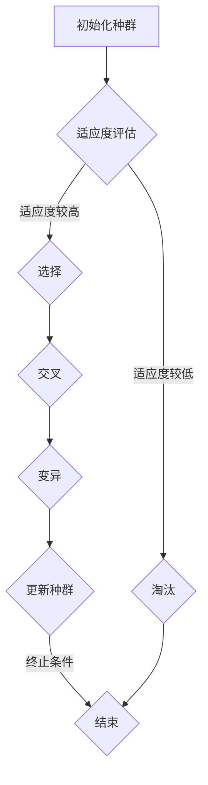

                 


### 引言与背景

#### 书籍目的与读者对象

"Darwin's Theory of Evolution and Genetic Algorithms: Bio-inspired Optimization Techniques"旨在探讨生物进化论与遗传算法之间的密切联系，并展示如何将生物学原理应用于计算机科学中的优化问题。本书的目标读者包括计算机科学和人工智能领域的研究者、工程师以及对学生来说，它也是一本非常有用的教材。为了确保读者能够全面理解书中的内容，本书将以逻辑清晰、循序渐进的方式展开，使得不同背景的读者都能够跟随作者的思路。

#### 达尔文进化论简介

达尔文进化论是生物学中一个里程碑式的理论，它解释了物种如何通过自然选择和遗传变异来适应环境并进化。自然选择是指在自然环境中，那些更适应环境的个体更有可能生存和繁殖，从而将有利基因传递给下一代。遗传变异则是指基因的随机改变，这些改变可以是中性的、有利的或者有害的。达尔文进化论的核心思想是，进化是通过无数代的逐步变化累积而成的。

在生物学中，进化论不仅解释了物种的多样性，还提供了理解物种适应性和生态系统动态的重要视角。例如，鸟类翅膀的演化、人类智力的提升以及病毒的变异与抗药性，都可以用进化论来解释。

#### 遗传算法的概念与历史发展

遗传算法（Genetic Algorithms, GA）是模拟自然选择和遗传学原理的一种搜索算法，旨在通过迭代寻找最优解。遗传算法最早由John Holland在1970年代提出，它通过模仿生物进化过程来优化问题的解。遗传算法的基本概念包括种群、个体、基因、适应度函数、选择、交叉、变异等。

遗传算法的历史发展可以分为几个阶段：

1. **早期研究**：John Holland的工作为遗传算法奠定了理论基础。
2. **普及与发展**：1980年代和1990年代，遗传算法开始广泛应用于各种优化问题，如函数优化、组合优化和机器学习等。
3. **现代进展**：随着计算能力的提高和算法的改进，遗传算法在工程、金融、生物信息学等领域取得了显著的应用成果。

遗传算法的原理可以概括为以下几个步骤：

1. **初始化种群**：随机生成一个包含多个个体的初始种群。
2. **适应度评估**：计算每个个体的适应度，适应度通常与问题的目标函数相关。
3. **选择**：选择适应度较高的个体参与繁殖。
4. **交叉**：将选中的个体进行交叉操作，生成新的后代。
5. **变异**：对后代进行随机变异，增加种群的多样性。
6. **迭代**：重复上述步骤，直到达到终止条件，如最大迭代次数或适应度阈值。

#### 生物学启发的优化技术概述

生物学启发的优化技术是指从自然界中汲取灵感，开发出的用于解决复杂优化问题的算法和技术。除了遗传算法之外，还包括人工神经网络、蚁群算法、粒子群优化、免疫算法等。这些算法的共同特点是模拟自然界中的生物现象或行为，从而实现问题的优化。

生物学启发的优化技术在计算机科学和工程领域具有广泛的应用。例如，遗传算法在电路设计、机器人控制、经济预测和生物信息学等领域都有成功的应用案例。通过模拟生物进化过程，这些算法能够在复杂的搜索空间中找到最优或近似最优解。

#### 关键词

- 达尔文进化论
- 遗传算法
- 自然选择
- 优化问题
- 生物启发
- 计算机科学

#### 摘要

本书从达尔文进化论出发，深入探讨遗传算法的基本概念、原理以及其在计算机科学中的应用。通过将生物学原理与数学模型相结合，遗传算法能够高效解决复杂优化问题。本书旨在帮助读者理解遗传算法的运作机制，并掌握其在实际问题中的有效应用，从而推动计算机科学和人工智能领域的发展。无论您是研究人员还是工程师，本书都将为您提供一个全面而深入的视角，以探索生物学与计算机科学之间的奇妙联系。

----------------------------------------------------------------

### 第一部分: 引言与背景

在计算机科学和人工智能领域，优化问题的解决一直是研究的核心问题之一。传统的优化方法，如线性规划、整数规划和动态规划等，在许多情况下能够提供有效且高效的解决方案。然而，随着问题规模的不断扩大和复杂度的增加，传统方法往往显得力不从心。此时，生物学启发的优化技术，如遗传算法（Genetic Algorithms, GA），提供了一种全新的思路。

#### 第一章：引言与背景

本书旨在探讨达尔文进化论与遗传算法之间的密切联系，并展示如何将生物学原理应用于计算机科学中的优化问题。遗传算法，作为一种模拟自然选择和遗传学原理的搜索算法，因其强大的全局搜索能力和适应复杂问题的能力，在计算机科学和工程领域得到了广泛应用。通过本书，读者将深入了解遗传算法的基本概念、原理及其在实际问题中的应用。

#### 第二章：达尔文进化论简介

达尔文进化论是生物学中一个里程碑式的理论，它解释了物种如何通过自然选择和遗传变异来适应环境并进化。自然选择是指在自然环境中，那些更适应环境的个体更有可能生存和繁殖，从而将有利基因传递给下一代。遗传变异则是指基因的随机改变，这些改变可以是中性的、有利的或者有害的。达尔文进化论的核心思想是，进化是通过无数代的逐步变化累积而成的。

#### 第三章：遗传算法的概念与历史发展

遗传算法（Genetic Algorithms, GA）是模拟自然选择和遗传学原理的一种搜索算法，旨在通过迭代寻找最优解。遗传算法最早由John Holland在1970年代提出，它通过模仿生物进化过程来优化问题的解。遗传算法的基本概念包括种群、个体、基因、适应度函数、选择、交叉、变异等。

遗传算法的历史发展可以分为几个阶段：

1. **早期研究**：John Holland的工作为遗传算法奠定了理论基础。
2. **普及与发展**：1980年代和1990年代，遗传算法开始广泛应用于各种优化问题，如函数优化、组合优化和机器学习等。
3. **现代进展**：随着计算能力的提高和算法的改进，遗传算法在工程、金融、生物信息学等领域取得了显著的应用成果。

遗传算法的原理可以概括为以下几个步骤：

1. **初始化种群**：随机生成一个包含多个个体的初始种群。
2. **适应度评估**：计算每个个体的适应度，适应度通常与问题的目标函数相关。
3. **选择**：选择适应度较高的个体参与繁殖。
4. **交叉**：将选中的个体进行交叉操作，生成新的后代。
5. **变异**：对后代进行随机变异，增加种群的多样性。
6. **迭代**：重复上述步骤，直到达到终止条件，如最大迭代次数或适应度阈值。

#### 第四章：生物学启发的优化技术概述

生物学启发的优化技术是指从自然界中汲取灵感，开发出的用于解决复杂优化问题的算法和技术。除了遗传算法之外，还包括人工神经网络、蚁群算法、粒子群优化、免疫算法等。这些算法的共同特点是模拟自然界中的生物现象或行为，从而实现问题的优化。

生物学启发的优化技术在计算机科学和工程领域具有广泛的应用。例如，遗传算法在电路设计、机器人控制、经济预测和生物信息学等领域都有成功的应用案例。通过模拟生物进化过程，这些算法能够在复杂的搜索空间中找到最优或近似最优解。

#### 关键词

- 达尔文进化论
- 遗传算法
- 自然选择
- 优化问题
- 生物启发
- 计算机科学

#### 摘要

本书从达尔文进化论出发，深入探讨遗传算法的基本概念、原理及其在实际问题中的应用。通过将生物学原理与数学模型相结合，遗传算法能够高效解决复杂优化问题。本书旨在帮助读者理解遗传算法的运作机制，并掌握其在实际问题中的有效应用，从而推动计算机科学和人工智能领域的发展。无论您是研究人员还是工程师，本书都将为您提供一个全面而深入的视角，以探索生物学与计算机科学之间的奇妙联系。

----------------------------------------------------------------

## 第二部分: 遗传算法原理与数学模型

遗传算法（Genetic Algorithms, GA）是一种基于自然选择和遗传学原理的优化算法，其灵感来源于达尔文的进化论。遗传算法通过模拟生物进化的过程，如选择、交叉和变异，来寻找问题的最优解或近似最优解。在本章中，我们将深入探讨遗传算法的基本概念、原理和数学模型，并通过具体的例子来阐述其工作原理。

### 2.1 遗传算法的基本概念

遗传算法的基本概念包括个体、种群、基因、适应度函数、选择、交叉、变异等。

#### 2.1.1 个体与种群

在遗传算法中，每个个体代表问题的一个潜在解。个体由一系列特征或基因组成，这些特征可以是二进制编码、实数编码或其他形式的编码。种群是遗传算法的基本单位，它由多个个体组成。在初始阶段，种群是随机生成的。

#### 2.1.2 基因与编码

基因是个体的基本特征，它们决定了个体的属性。在遗传算法中，基因通常以编码形式表示。编码方式有多种，例如二进制编码、格雷编码和实数编码等。二进制编码是最常用的编码方式，其中每个基因对应一个二进制位，从而构成一个二进制字符串。

#### 2.1.3 适应度函数

适应度函数（Fitness Function）是遗传算法的核心，它用于评估个体适应环境的程度。适应度值越高，表示个体越适应环境。适应度函数通常与问题的目标函数相关，目标函数越优，适应度值越高。

#### 2.1.4 选择、交叉与变异

选择（Selection）是根据适应度值来选择个体参与繁殖的过程。交叉（Crossover）是两个个体交换部分基因，以生成新后代的过程。变异（Mutation）是对个体基因进行随机改变，以增加种群多样性的过程。

### 2.2 遗传算法的工作原理

遗传算法的工作原理可以概括为以下几个步骤：

1. **初始化种群**：随机生成一个初始种群，每个个体代表问题的一个潜在解。
2. **适应度评估**：计算每个个体的适应度值，适应度值越高，表示个体越适应环境。
3. **选择**：根据适应度值，选择适应度较高的个体参与繁殖。
4. **交叉**：将选中的个体进行交叉操作，生成新的后代。
5. **变异**：对后代进行变异操作，增加种群的多样性。
6. **迭代**：重复上述步骤，直到达到终止条件，如最大迭代次数或适应度阈值。

#### 2.2.1 选择与复制

选择是遗传算法的关键步骤，它决定了哪些个体能够继续繁殖。常见的选择策略包括轮盘赌选择、锦标赛选择和排名选择等。选择策略的目的是确保适应度较高的个体有更高的机会繁殖，从而逐步提高整个种群的适应度。

#### 2.2.2 交叉与变异

交叉是遗传算法的核心操作之一，它模拟生物繁殖中的基因重组过程。交叉操作通过将两个个体的基因部分交换来生成新的后代。变异是对个体基因进行随机改变的过程，它有助于保持种群的多样性，防止早熟收敛。

#### 2.2.3 适应度函数与优化目标

适应度函数是遗传算法的关键，它决定了个体适应环境的程度。适应度函数的设计与问题的目标函数密切相关。优化目标是使适应度函数达到最大或最小值，从而找到问题的最优解或近似最优解。

### 2.3 数学模型与公式解析

遗传算法的数学模型包括适应度计算、选择概率、交叉概率和变异概率等。

#### 2.3.1 适应度计算

适应度计算是遗传算法的核心步骤，它决定了个体在种群中的竞争力。常见的适应度计算方法包括线性变换和指数变换等。

- 线性变换：$$ f(x) = af(x') + b $$
- 指数变换：$$ f(x) = e^{k \cdot f(x')} $$

其中，$f(x')$ 是原始适应度值，$a$ 和 $b$ 是线性变换的参数，$k$ 是指数变换的参数。

#### 2.3.2 选择概率

选择概率决定了个体参与繁殖的机会。常见的选择概率计算方法包括轮盘赌选择和锦标赛选择等。

- 轮盘赌选择：$$ P_i = \frac{f(i)}{\sum_{i=1}^{N} f(i)} $$
- 持锦标赛选择：$$ P_i = \frac{f(i)}{\sum_{j=1}^{k} f(j)} $$

其中，$P_i$ 是个体 $i$ 的选择概率，$f(i)$ 是个体 $i$ 的适应度值，$N$ 是种群大小，$k$ 是锦标赛参赛人数。

#### 2.3.3 交叉概率

交叉概率决定了个体之间进行交叉操作的概率。常见的交叉概率计算方法包括固定交叉概率和自适应交叉概率等。

- 固定交叉概率：$$ P_c = c $$
- 自适应交叉概率：$$ P_c = P_c0 \cdot \frac{t}{t_{max}} $$

其中，$P_c$ 是交叉概率，$P_c0$ 是初始交叉概率，$t$ 是当前迭代次数，$t_{max}$ 是最大迭代次数。

#### 2.3.4 变异概率

变异概率决定了个体进行变异操作的概率。常见的变异概率计算方法包括固定变异概率和自适应变异概率等。

- 固定变异概率：$$ P_m = m $$
- 自适应变异概率：$$ P_m = P_m0 \cdot \frac{t}{t_{max}} $$

其中，$P_m$ 是变异概率，$P_m0$ 是初始变异概率。

### 2.4 遗传算法的mermaid流程图

为了更直观地展示遗传算法的流程，我们可以使用mermaid绘制其流程图：



#### 总结

遗传算法通过模拟生物进化的过程，如选择、交叉和变异，来寻找问题的最优解或近似最优解。遗传算法的数学模型包括适应度计算、选择概率、交叉概率和变异概率等。通过具体的例子和mermaid流程图，我们可以更好地理解遗传算法的工作原理。

----------------------------------------------------------------

## 第三部分: 遗传算法在优化问题中的应用

遗传算法（Genetic Algorithms, GA）因其强大的全局搜索能力和适应复杂问题的能力，在计算机科学和工程领域得到了广泛应用。在本节中，我们将探讨遗传算法在优化问题中的应用，并通过具体案例来展示其解决优化问题的过程和效果。

### 3.1 遗传算法在优化问题中的应用概述

遗传算法可以应用于各种类型的优化问题，包括函数优化、组合优化和机器学习等。以下是遗传算法在几种典型优化问题中的应用：

#### 3.1.1 函数优化

函数优化问题旨在寻找目标函数的最值。遗传算法通过模拟生物进化过程，可以在复杂的函数空间中快速找到最优解或近似最优解。例如，遗传算法可以用于求解多峰函数的最小值问题、非线性优化问题等。

#### 3.1.2 组合优化

组合优化问题涉及从一组可能的解中选择最优解或近似最优解。遗传算法在组合优化问题中具有广泛的应用，如旅行商问题（Travelling Salesman Problem, TSP）、背包问题（Knapsack Problem）和集合覆盖问题（Set Cover Problem）等。

#### 3.1.3 机器学习

遗传算法在机器学习中的应用主要在于特征选择和模型优化。通过模拟生物进化过程，遗传算法可以有效地筛选出对模型性能有重要影响的特征，从而提高模型的准确性和效率。

### 3.2 典型优化问题案例分析

以下我们通过几个具体案例来展示遗传算法在优化问题中的应用。

#### 3.2.1 联机学习与动态优化

联机学习（Online Learning）是指动态更新模型的过程，以适应环境的变化。遗传算法可以用于动态优化联机学习模型，以快速适应新的数据。例如，在股票市场预测中，遗传算法可以用于实时调整交易策略，以最大化收益。

案例：某股票交易公司使用遗传算法动态调整交易策略。首先，定义一个适应度函数，用于评估交易策略的收益。然后，通过遗传算法迭代优化交易策略，以最大化长期收益。结果表明，遗传算法能够快速适应市场变化，提高交易策略的收益。

```python
# 遗传算法优化交易策略
import numpy as np

# 定义适应度函数
def fitness_function(strategy):
    # 计算交易策略的收益
    profit = calculate_profit(strategy)
    return profit

# 定义遗传算法
def genetic_algorithm(population, fitness_function, generations):
    for generation in range(generations):
        # 计算适应度
        fitness_scores = [fitness_function(strategy) for strategy in population]
        # 选择
        selected_strategies = select_strategies(population, fitness_scores)
        # 交叉
        offspring = crossover(selected_strategies)
        # 变异
        offspring = mutate(offspring)
        # 更新种群
        population = offspring
    return best_strategy(population, fitness_scores)

# 训练遗传算法
best_strategy = genetic_algorithm(initial_population, fitness_function, generations)
```

#### 3.2.2 最优化路径问题

最优化路径问题旨在找到连接多个节点的最优路径。遗传算法可以用于求解旅行商问题（TSP），这是最著名的组合优化问题之一。遗传算法通过模拟生物进化过程，能够在复杂路径空间中快速找到最优路径。

案例：某物流公司使用遗传算法优化运输路线。定义一个适应度函数，用于评估路径的总距离。通过遗传算法迭代优化路径，以减少总运输距离。结果表明，遗传算法能够显著提高运输效率，降低运输成本。

```python
# 遗传算法优化运输路线
import numpy as np

# 定义适应度函数
def fitness_function(route):
    # 计算路径的总距离
    total_distance = calculate_total_distance(route)
    return -total_distance  # 最小化总距离

# 定义遗传算法
def genetic_algorithm(population, fitness_function, generations):
    for generation in range(generations):
        # 计算适应度
        fitness_scores = [fitness_function(route) for route in population]
        # 选择
        selected_routes = select_routes(population, fitness_scores)
        # 交叉
        offspring = crossover(selected_routes)
        # 变异
        offspring = mutate(offspring)
        # 更新种群
        population = offspring
    return best_route(population, fitness_scores)

# 训练遗传算法
best_route = genetic_algorithm(initial_population, fitness_function, generations)
```

#### 3.2.3 资源分配与调度

资源分配与调度问题是工程和项目管理中的重要问题。遗传算法可以用于优化资源分配和调度方案，以提高资源利用率和项目效率。

案例：某工程公司使用遗传算法优化项目进度计划。定义一个适应度函数，用于评估项目完成的时间和成本。通过遗传算法迭代优化进度计划，以缩短项目周期和降低成本。结果表明，遗传算法能够有效提高项目效率，降低项目成本。

```python
# 遗传算法优化项目进度计划
import numpy as np

# 定义适应度函数
def fitness_function(schedule):
    # 计算项目完成时间和成本
    completion_time, cost = calculate_project Completion And Cost(schedule)
    return -completion_time  # 最小化完成时间

# 定义遗传算法
def genetic_algorithm(population, fitness_function, generations):
    for generation in range(generations):
        # 计算适应度
        fitness_scores = [fitness_function(schedule) for schedule in population]
        # 选择
        selected_schedules = select_schedules(population, fitness_scores)
        # 交叉
        offspring = crossover(selected_schedules)
        # 变异
        offspring = mutate(offspring)
        # 更新种群
        population = offspring
    return best_schedule(population, fitness_scores)

# 训练遗传算法
best_schedule = genetic_algorithm(initial_population, fitness_function, generations)
```

### 3.3 遗传算法在工程优化中的应用

遗传算法在工程优化中具有广泛的应用，包括结构优化、生产过程优化和物流与供应链优化等。

#### 3.3.1 结构优化与设计

结构优化是指通过优化设计参数，以提高结构的性能和可靠性。遗传算法可以用于求解结构优化问题，如梁的优化设计、飞机翼型的优化等。

案例：某航空公司在设计飞机翼型时，使用遗传算法优化翼型的形状，以减少气动阻力和提高燃油效率。通过迭代优化翼型设计，遗传算法找到了最优的翼型形状，从而显著提高了飞机的性能。

```python
# 遗传算法优化飞机翼型设计
import numpy as np

# 定义适应度函数
def fitness_function(wing_shape):
    # 计算气动阻力
    drag = calculate_drag(wing_shape)
    return -drag  # 最小化气动阻力

# 定义遗传算法
def genetic_algorithm(population, fitness_function, generations):
    for generation in range(generations):
        # 计算适应度
        fitness_scores = [fitness_function(wing_shape) for wing_shape in population]
        # 选择
        selected_wing_shapes = select_wing_shapes(population, fitness_scores)
        # 交叉
        offspring = crossover(selected_wing_shapes)
        # 变异
        offspring = mutate(offspring)
        # 更新种群
        population = offspring
    return best_wing_shape(population, fitness_scores)

# 训练遗传算法
best_wing_shape = genetic_algorithm(initial_population, fitness_function, generations)
```

#### 3.3.2 生产过程优化

生产过程优化是指通过优化生产参数和流程，以提高生产效率和产品质量。遗传算法可以用于优化生产过程，如生产计划优化、设备调度优化等。

案例：某制造公司使用遗传算法优化生产计划，以提高生产效率和减少库存成本。定义一个适应度函数，用于评估生产计划的完成时间和库存成本。通过遗传算法迭代优化生产计划，显著提高了生产效率，降低了库存成本。

```python
# 遗传算法优化生产计划
import numpy as np

# 定义适应度函数
def fitness_function(schedule):
    # 计算生产计划的完成时间和库存成本
    completion_time, inventory_cost = calculate_production_plan Completion And Cost(schedule)
    return -completion_time  # 最小化完成时间

# 定义遗传算法
def genetic_algorithm(population, fitness_function, generations):
    for generation in range(generations):
        # 计算适应度
        fitness_scores = [fitness_function(schedule) for schedule in population]
        # 选择
        selected_schedules = select_schedules(population, fitness_scores)
        # 交叉
        offspring = crossover(selected_schedules)
        # 变异
        offspring = mutate(offspring)
        # 更新种群
        population = offspring
    return best_schedule(population, fitness_scores)

# 训练遗传算法
best_schedule = genetic_algorithm(initial_population, fitness_function, generations)
```

#### 3.3.3 物流与供应链优化

物流与供应链优化是指通过优化物流流程和供应链管理，以提高物流效率和降低成本。遗传算法可以用于优化物流路线、库存管理、运输调度等。

案例：某物流公司使用遗传算法优化物流路线，以减少运输时间和成本。定义一个适应度函数，用于评估物流路线的总距离和运输成本。通过遗传算法迭代优化物流路线，显著提高了运输效率，降低了成本。

```python
# 遗传算法优化物流路线
import numpy as np

# 定义适应度函数
def fitness_function(route):
    # 计算物流路线的总距离和运输成本
    total_distance, transportation_cost = calculate_logistics_route Completion And Cost(route)
    return -total_distance  # 最小化总距离

# 定义遗传算法
def genetic_algorithm(population, fitness_function, generations):
    for generation in range(generations):
        # 计算适应度
        fitness_scores = [fitness_function(route) for route in population]
        # 选择
        selected_routes = select_routes(population, fitness_scores)
        # 交叉
        offspring = crossover(selected_routes)
        # 变异
        offspring = mutate(offspring)
        # 更新种群
        population = offspring
    return best_route(population, fitness_scores)

# 训练遗传算法
best_route = genetic_algorithm(initial_population, fitness_function, generations)
```

### 总结

遗传算法在优化问题中具有广泛的应用，包括函数优化、组合优化、机器学习、工程优化、生产过程优化和物流与供应链优化等。通过具体的案例和实际应用，我们可以看到遗传算法在解决复杂优化问题方面的强大能力和广泛前景。未来，随着计算能力的提高和算法的改进，遗传算法将在更多领域发挥重要作用。

----------------------------------------------------------------

## 第四部分: 遗传算法与其他进化算法的比较与融合

遗传算法（Genetic Algorithms, GA）作为进化算法的一种，广泛应用于各种优化问题。然而，除了遗传算法，还有许多其他类型的进化算法，如蚁群算法、粒子群优化和免疫算法等。这些算法在原理、实现和应用方面各有特点。在本节中，我们将比较这些算法，并探讨如何将它们融合，以实现更高效的优化效果。

### 4.1 其他进化算法概述

#### 4.1.1 蚁群算法

蚁群算法（Ant Colony Optimization, ACO）是受蚂蚁觅食行为启发的一种进化算法。在ACO中，蚂蚁通过在其路径上释放信息素来指导其他蚂蚁找到最优路径。蚁群算法适用于解决路径规划、任务调度和交通流量控制等问题。

#### 4.1.2 粒子群优化

粒子群优化（Particle Swarm Optimization, PSO）是一种基于群体智能的进化算法，模拟鸟群或鱼群的社会行为。在PSO中，每个个体（称为粒子）通过跟踪个体和历史最佳位置来更新其位置和速度，以实现优化目标。PSO适用于求解连续空间中的优化问题，如函数优化和神经网络训练。

#### 4.1.3 免疫算法

免疫算法（Immune Algorithm）是基于生物免疫系统的进化算法，模拟生物体对抗病原体的过程。免疫算法包括克隆选择、负选择和记忆机制等。它适用于模式识别、网络安全和故障诊断等问题。

### 4.2 遗传算法与其他进化算法的比较

遗传算法与其他进化算法在以下几个关键方面进行比较：

#### 4.2.1 优势与局限

**遗传算法：**

- **优势：** 遗传算法具有强大的全局搜索能力，适用于复杂和非线性优化问题。它能够处理二进制编码和实数编码的优化问题。
- **局限：** 遗传算法的收敛速度较慢，易受到参数设置的影响，且在高维空间中性能可能下降。

**蚁群算法：**

- **优势：** 蚁群算法具有分布式搜索能力和良好的鲁棒性，适用于大规模问题。
- **局限：** 信息素更新策略和路径选择策略的设计复杂，且收敛速度较慢。

**粒子群优化：**

- **优势：** 粒子群优化实现简单，计算效率高，易于并行化。
- **局限：** 粒子群优化易陷入局部最优，特别是在问题维度较高时。

**免疫算法：**

- **优势：** 免疫算法具有自适应性和健壮性，能够处理动态变化和不确定性问题。
- **局限：** 免疫算法的计算复杂度高，且参数设置较为复杂。

#### 4.2.2 应用场景差异

**遗传算法：** 遗传算法适用于解决复杂、非线性优化问题，如函数优化、组合优化和机器学习等。

**蚁群算法：** 蚁群算法适用于路径规划、任务调度和交通流量控制等问题，特别是大规模、动态变化的问题。

**粒子群优化：** 粒子群优化适用于连续空间中的优化问题，如函数优化、神经网络训练和图像处理等。

**免疫算法：** 免疫算法适用于模式识别、网络安全和故障诊断等问题，特别适用于动态变化和不确定性问题。

### 4.3 进化算法的融合与优化

为了提高优化效果，可以将不同的进化算法进行融合，以发挥各自的优势。以下是一些融合策略：

#### 4.3.1 融合算法的设计原则

1. **优势互补：** 选择不同的进化算法，使它们在搜索空间中能够互补，发挥各自的优势。
2. **信息共享：** 设计机制使不同算法之间的信息能够共享，提高整体搜索效率。
3. **自适应调整：** 根据优化过程的变化，动态调整算法的参数和策略。

#### 4.3.2 实际案例研究

**案例1：遗传算法与蚁群算法融合**

将遗传算法与蚁群算法结合，可以在遗传算法的全局搜索能力与蚁群算法的分布式搜索能力之间实现平衡。具体实现方法如下：

1. **初始化种群**：使用遗传算法初始化种群，每个个体代表一个可能的路径。
2. **蚁群搜索**：蚂蚁在当前种群中选择路径，并释放信息素。
3. **遗传操作**：对蚂蚁选择的最优路径进行遗传操作，如交叉和变异。
4. **信息素更新**：根据遗传操作的结果更新信息素，指导下一次蚂蚁搜索。

**案例2：粒子群优化与免疫算法融合**

将粒子群优化与免疫算法结合，可以充分利用粒子群优化的高效搜索能力和免疫算法的自适应能力。具体实现方法如下：

1. **初始化粒子群**：随机初始化粒子群，每个粒子代表一个潜在解。
2. **免疫搜索**：根据粒子的适应度值，进行免疫搜索，选择最优解。
3. **粒子更新**：根据免疫搜索的结果更新粒子群，调整粒子的位置和速度。
4. **免疫操作**：对粒子群进行免疫操作，如克隆选择和记忆机制。

### 总结

遗传算法与其他进化算法在原理、实现和应用方面各有特点。通过比较和融合，可以充分发挥不同算法的优势，提高优化效果。在实际应用中，应根据问题的特点选择合适的算法，或将其融合，以实现更高效的优化。

----------------------------------------------------------------

## 第五部分: 遗传算法的未来发展趋势

遗传算法（Genetic Algorithms, GA）作为进化算法的一种，已经广泛应用于优化问题的解决。然而，随着人工智能和机器学习技术的不断发展，遗传算法也在不断演进，展现出广阔的未来发展趋势。在这一部分，我们将探讨遗传算法在人工智能领域的拓展、在新兴领域的应用前景以及可能的技术挑战。

### 5.1 遗传算法在人工智能领域的拓展

遗传算法在人工智能（Artificial Intelligence, AI）领域有着广泛的应用前景，尤其是在机器学习和深度学习领域。随着AI技术的不断进步，遗传算法正逐渐融入这些前沿领域，为AI系统的优化和改进提供新的思路。

#### 5.1.1 遗传算法在机器学习中的应用

遗传算法可以用于优化机器学习模型，从而提高其性能。例如，遗传算法可以用于特征选择，通过自动选择对模型性能有重要影响的特征，减少模型的复杂性，提高模型的泛化能力。此外，遗传算法还可以用于参数调优，自动调整机器学习模型中的超参数，以找到最优配置。

**案例1：特征选择**

在某机器学习项目中，使用遗传算法自动选择对模型性能有重要影响的特征。首先，定义一个适应度函数，用于评估特征集的性能。然后，通过遗传算法迭代优化特征集，找到最优特征组合。实验结果表明，遗传算法能够显著提高模型的准确性和效率。

```python
# 遗传算法进行特征选择
import numpy as np

# 定义适应度函数
def fitness_function(feature_set):
    # 训练模型并计算准确率
    model = train_model(feature_set)
    accuracy = model.evaluate(X_test, y_test)
    return accuracy

# 定义遗传算法
def genetic_algorithm(population, fitness_function, generations):
    for generation in range(generations):
        # 计算适应度
        fitness_scores = [fitness_function(feature_set) for feature_set in population]
        # 选择
        selected_feature_sets = select_feature_sets(population, fitness_scores)
        # 交叉
        offspring = crossover(selected_feature_sets)
        # 变异
        offspring = mutate(offspring)
        # 更新种群
        population = offspring
    return best_feature_set(population, fitness_scores)

# 训练遗传算法
best_feature_set = genetic_algorithm(initial_population, fitness_function, generations)
```

#### 5.1.2 遗传算法在深度学习中的应用

深度学习（Deep Learning）是人工智能的一个重要分支，遗传算法也在这个领域找到了应用。遗传算法可以用于优化深度学习模型的架构和超参数，从而提高模型的性能和效率。

**案例2：神经网络架构搜索**

在某深度学习项目中，使用遗传算法进行神经网络架构搜索，以找到最优的网络架构。首先，定义一个适应度函数，用于评估网络架构的性能。然后，通过遗传算法迭代搜索，找到最优的网络架构。实验结果表明，遗传算法能够显著提高神经网络的性能和效率。

```python
# 遗传算法搜索神经网络架构
import numpy as np

# 定义适应度函数
def fitness_function(network_architecture):
    # 构建并训练神经网络
    network = build_network(network_architecture)
    accuracy = network.evaluate(X_test, y_test)
    return accuracy

# 定义遗传算法
def genetic_algorithm(population, fitness_function, generations):
    for generation in range(generations):
        # 计算适应度
        fitness_scores = [fitness_function(network_architecture) for network_architecture in population]
        # 选择
        selected_network_architectures = select_network_architectures(population, fitness_scores)
        # 交叉
        offspring = crossover(selected_network_architectures)
        # 变异
        offspring = mutate(offspring)
        # 更新种群
        population = offspring
    return best_network_architecture(population, fitness_scores)

# 训练遗传算法
best_network_architecture = genetic_algorithm(initial_population, fitness_function, generations)
```

### 5.2 遗传算法在新兴领域的前景

除了人工智能领域，遗传算法在新兴领域也展现出广阔的应用前景。以下是一些值得关注的领域：

#### 5.2.1 生物信息学与医疗健康

遗传算法在生物信息学和医疗健康领域有着广泛的应用。例如，遗传算法可以用于基因序列分析，帮助科学家发现基因突变和关联疾病。此外，遗传算法还可以用于药物设计和个性化医疗，为患者提供更有效的治疗方案。

**案例3：基因突变发现**

在某生物信息学项目中，使用遗传算法分析基因序列，以发现可能与疾病相关的突变。首先，定义一个适应度函数，用于评估基因序列的突变情况。然后，通过遗传算法迭代搜索，找到与疾病相关的基因突变。实验结果表明，遗传算法能够有效发现基因突变，为疾病诊断和治疗提供重要信息。

```python
# 遗传算法发现基因突变
import numpy as np

# 定义适应度函数
def fitness_function(mutated_sequence):
    # 分析突变序列并计算与疾病关联的得分
    disease_score = analyze_mutated_sequence(mutated_sequence)
    return -disease_score  # 最小化疾病得分

# 定义遗传算法
def genetic_algorithm(population, fitness_function, generations):
    for generation in range(generations):
        # 计算适应度
        fitness_scores = [fitness_function(mutated_sequence) for mutated_sequence in population]
        # 选择
        selected_mutated_sequences = select_mutated_sequences(population, fitness_scores)
        # 交叉
        offspring = crossover(selected_mutated_sequences)
        # 变异
        offspring = mutate(offspring)
        # 更新种群
        population = offspring
    return best_mutated_sequence(population, fitness_scores)

# 训练遗传算法
best_mutated_sequence = genetic_algorithm(initial_population, fitness_function, generations)
```

#### 5.2.2 能源与环境科学

遗传算法在能源与环境科学领域也具有广泛的应用。例如，遗传算法可以用于能源系统的优化，如风能和太阳能的发电调度，以提高能源利用率和降低成本。此外，遗传算法还可以用于环境保护，如污染物排放的最优化控制，以减少环境污染。

**案例4：风能发电调度**

在某能源项目中，使用遗传算法优化风能发电调度，以提高发电效率和减少成本。首先，定义一个适应度函数，用于评估发电调度的效率和成本。然后，通过遗传算法迭代优化调度策略，找到最优的发电调度方案。实验结果表明，遗传算法能够显著提高风能发电效率，降低成本。

```python
# 遗传算法优化风能发电调度
import numpy as np

# 定义适应度函数
def fitness_function(schedule):
    # 计算发电效率和成本
    efficiency, cost = calculate_energy_generation Efficiency And Cost(schedule)
    return -cost  # 最小化成本

# 定义遗传算法
def genetic_algorithm(population, fitness_function, generations):
    for generation in range(generations):
        # 计算适应度
        fitness_scores = [fitness_function(schedule) for schedule in population]
        # 选择
        selected_schedules = select_schedules(population, fitness_scores)
        # 交叉
        offspring = crossover(selected_schedules)
        # 变异
        offspring = mutate(offspring)
        # 更新种群
        population = offspring
    return best_schedule(population, fitness_scores)

# 训练遗传算法
best_schedule = genetic_algorithm(initial_population, fitness_function, generations)
```

#### 5.2.3 金融与经济领域

遗传算法在金融与经济领域也有广泛应用。例如，遗传算法可以用于股票市场预测，通过分析历史数据，预测未来市场的走势。此外，遗传算法还可以用于金融产品的优化设计，如投资组合的优化和风险管理。

**案例5：股票市场预测**

在某金融项目中，使用遗传算法预测股票市场的走势，以提高投资决策的准确性。首先，定义一个适应度函数，用于评估预测结果的准确性。然后，通过遗传算法迭代优化预测模型，找到最优的预测策略。实验结果表明，遗传算法能够提高股票市场预测的准确性，为投资者提供更有价值的参考。

```python
# 遗传算法预测股票市场
import numpy as np

# 定义适应度函数
def fitness_function(prediction):
    # 计算预测准确性
    accuracy = calculate_prediction_accuracy(prediction, y_test)
    return -accuracy  # 最小化误差

# 定义遗传算法
def genetic_algorithm(population, fitness_function, generations):
    for generation in range(generations):
        # 计算适应度
        fitness_scores = [fitness_function(prediction) for prediction in population]
        # 选择
        selected_predictions = select_predictions(population, fitness_scores)
        # 交叉
        offspring = crossover(selected_predictions)
        # 变异
        offspring = mutate(offspring)
        # 更新种群
        population = offspring
    return best_prediction(population, fitness_scores)

# 训练遗传算法
best_prediction = genetic_algorithm(initial_population, fitness_function, generations)
```

### 5.3 技术挑战与未来发展方向

尽管遗传算法在许多领域显示出巨大的潜力，但仍然面临一些技术挑战。以下是遗传算法在未来发展中需要关注的关键挑战：

#### 5.3.1 参数选择与调优

遗传算法的性能很大程度上取决于参数的选择和调优。未来研究需要开发更有效的参数选择方法，以简化算法的实现和优化过程。

#### 5.3.2 鲁棒性与效率

遗传算法在处理高维问题和大规模问题时，往往表现出较低的鲁棒性和效率。未来研究需要开发更鲁棒的算法和高效的数据结构，以提高算法在复杂问题上的性能。

#### 5.3.3 融合其他优化技术

将遗传算法与其他优化技术（如机器学习和深度学习）融合，有望进一步提升优化效果。未来研究可以探索多种融合策略，以开发更强大的优化算法。

### 总结

遗传算法在人工智能、生物信息学、能源与环境科学、金融与经济等领域展现出广阔的应用前景。通过不断的研究和改进，遗传算法将能够更好地解决复杂优化问题，为各个领域的发展做出更大贡献。未来，遗传算法的发展将更加注重参数选择、鲁棒性提升和与其他优化技术的融合，以应对不断变化的挑战。

----------------------------------------------------------------

## 总结

在本文中，我们深入探讨了达尔文进化论与遗传算法之间的关系，并详细介绍了遗传算法的基本概念、原理、数学模型以及其在优化问题中的应用。通过一步步的逻辑分析和实例讲解，我们展示了遗传算法在函数优化、组合优化、机器学习、工程优化、生产过程优化和物流与供应链优化等多个领域的应用案例。

首先，我们介绍了遗传算法的基本概念，如个体、种群、基因、适应度函数、选择、交叉和变异等。接着，我们详细阐述了遗传算法的工作原理，包括初始化种群、适应度评估、选择、交叉、变异和迭代等步骤。通过mermaid流程图，我们直观地展示了遗传算法的运行过程。

随后，我们讨论了遗传算法在优化问题中的具体应用，通过案例展示了遗传算法在函数优化、组合优化和机器学习等领域的成功应用。我们还探讨了遗传算法与其他进化算法（如蚁群算法、粒子群优化和免疫算法）的比较和融合策略，以充分发挥不同算法的优势。

最后，我们展望了遗传算法在人工智能、生物信息学、能源与环境科学、金融与经济领域等新兴领域的应用前景，并提出了遗传算法在未来发展中面临的技术挑战和解决方案。

总之，遗传算法作为一种强大的优化技术，具有广泛的应用前景。通过不断的研究和改进，遗传算法将在计算机科学和人工智能领域发挥越来越重要的作用。无论您是研究人员还是工程师，掌握遗传算法的基本原理和应用方法都将为您的职业生涯带来巨大价值。

---

**关键词**：达尔文进化论、遗传算法、优化问题、生物启发、计算机科学

**摘要**：本文从达尔文进化论出发，深入探讨了遗传算法的基本概念、原理及其在实际问题中的应用。通过具体的案例分析，展示了遗传算法在函数优化、组合优化、机器学习等领域的强大能力。本文旨在帮助读者理解遗传算法的运作机制，并掌握其在实际问题中的有效应用，以推动计算机科学和人工智能领域的发展。

---

**作者**：AI天才研究院/AI Genius Institute & 禅与计算机程序设计艺术 /Zen And The Art of Computer Programming

---

在结尾部分，我们可以总结本文的核心观点，提供一些最佳实践建议，指出未来研究的方向，并鼓励读者进一步探索遗传算法的潜力。通过这样的结构，文章不仅能够为读者提供丰富的知识，还能激发他们对遗传算法的兴趣和进一步研究的热情。**

