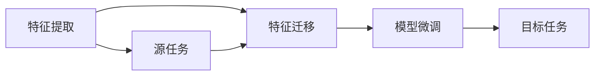
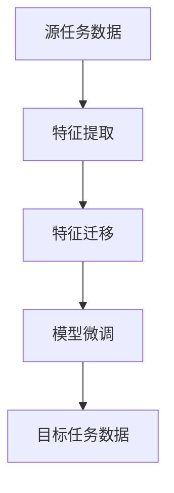

                 

### 迁移学习：利用已学知识解决新问题

> 关键词：迁移学习，机器学习，预训练模型，模型共享，知识复用

> 摘要：
迁移学习是机器学习领域中的一种重要技术，旨在通过利用已训练模型的知识来解决新的任务问题，从而提高学习效率和准确性。本文将深入探讨迁移学习的概念、原理、方法和应用，通过逐步分析，揭示其在现实世界中的巨大潜力和广泛影响。

## 前言

在人工智能和机器学习的迅猛发展过程中，模型训练的时间和计算资源消耗成为一个不可忽视的问题。传统的机器学习方法往往需要大量的数据和计算资源来训练模型，这对于小型团队或初创公司来说，常常是难以负担的。然而，随着迁移学习技术的发展，这一问题得到了有效的缓解。迁移学习允许我们利用已有的模型知识，快速适应新任务，极大地提高了模型的训练效率和实用性。

本文将分以下几个部分进行探讨：

1. 迁移学习的基本概念和起源。
2. 迁移学习的核心原理和理论支持。
3. 常见的迁移学习算法和方法。
4. 迁移学习在实际应用中的案例研究和效果分析。
5. 迁移学习的未来发展趋势和挑战。

希望通过本文的逐步分析，读者能够对迁移学习有更加深入的理解，并能够将其应用于实际问题中，为人工智能领域的发展贡献力量。

## 第1章：迁移学习的概述

### 1.1 迁移学习的起源与发展

迁移学习（Transfer Learning）这一概念最早可以追溯到20世纪50年代。当时，心理学家Noel Clark和Allen Newell在研究人类学习和知识获取的过程中，提出了“迁移”的概念。他们认为，学习一个新任务时，人们会利用之前学到的知识和技能，这就是迁移学习的早期思想。随后，随着计算机科学和人工智能的发展，迁移学习逐渐成为机器学习领域的一个重要研究方向。

在机器学习领域，迁移学习的兴起可以追溯到2006年，当时Hinton等人在神经网络领域提出深度信念网络（DBN）和深度学习理论，为迁移学习的发展奠定了基础。此后，随着深度学习的兴起，迁移学习得到了广泛的关注和应用。特别是2014年，Google提出了使用预训练模型进行迁移学习的ImageNet挑战，迁移学习在这一时期迎来了一个重要的爆发期。

### 1.2 迁移学习的核心概念

迁移学习的核心概念是“知识复用”，即通过将一个任务（源任务）的学习得到的模型知识应用到另一个任务（目标任务）中，从而减少目标任务的训练时间和计算资源消耗。具体来说，迁移学习主要涉及以下几个关键概念：

- **源任务（Source Task）**：源任务是已经完成训练的模型所学习的任务，通常具有较强的泛化能力。
- **目标任务（Target Task）**：目标任务是需要解决的新任务，可能具有与源任务不同的数据分布和任务特征。
- **预训练模型（Pre-trained Model）**：预训练模型是在大规模数据集上预先训练好的模型，通常具有较好的泛化能力。
- **迁移（Transfer）**：迁移是指将预训练模型的知识应用于目标任务中，以优化目标任务的模型性能。

### 1.3 迁移学习的重要性与适用场景

迁移学习的重要性主要体现在以下几个方面：

1. **提高学习效率**：通过迁移学习，我们可以利用已有模型的训练成果，减少新任务的训练时间和计算资源消耗，从而提高学习效率。
2. **解决数据稀缺问题**：在许多实际应用中，获取大量标注数据是非常困难的，而迁移学习可以在数据稀缺的情况下，通过复用已有模型的知识，提高模型的性能。
3. **提升模型泛化能力**：迁移学习通过将源任务的泛化能力应用于目标任务，可以提升模型的泛化能力，使其能够更好地适应新的任务和场景。

迁移学习适用于以下几种场景：

1. **计算机视觉**：在图像分类、目标检测和图像生成等任务中，迁移学习可以帮助模型快速适应新的数据集和任务需求。
2. **自然语言处理**：在文本分类、情感分析和机器翻译等任务中，迁移学习可以借助预训练的语言模型，提高模型在未知数据上的性能。
3. **医学诊断**：在医疗领域，迁移学习可以应用于医学图像分析、疾病预测和基因表达分析等任务，提高诊断准确率和效率。

### 1.4 迁移学习的研究现状与挑战

当前，迁移学习已经成为人工智能领域的一个热点研究方向，吸引了大量学者和企业的关注。随着深度学习和预训练模型的不断发展，迁移学习在实际应用中的效果和影响力不断提升。然而，迁移学习仍面临以下几大挑战：

1. **模型选择与优化**：如何选择合适的预训练模型和优化策略，以最大化迁移效果，是一个亟待解决的问题。
2. **数据分布差异**：源任务和目标任务的数据分布差异可能导致迁移效果不佳，需要研究有效的数据适配和分布迁移方法。
3. **模型解释性**：迁移学习中的模型复杂度高，如何提高模型的可解释性，使其在应用中更加可靠和可信，是一个重要的研究方向。
4. **跨模态迁移学习**：在多模态学习场景中，如何有效地融合不同模态的信息，实现有效的迁移学习，是一个具有挑战性的问题。

### 1.5 本章小结

本章对迁移学习进行了概述，介绍了其起源、核心概念、重要性及适用场景，并讨论了当前研究现状和面临的挑战。通过本章的学习，读者可以初步了解迁移学习的概念和基本原理，为后续章节的深入探讨打下基础。

---

在接下来的章节中，我们将进一步探讨迁移学习的理论基础，详细分析常见的迁移学习算法，并通过实际案例展示其在不同领域的应用效果。敬请期待！

## 第2章：迁移学习的理论基础

### 2.1 迁移学习的核心概念

在深入探讨迁移学习的理论基础之前，我们首先需要明确几个核心概念，以便更好地理解迁移学习的工作原理。

#### 源任务（Source Task）与目标任务（Target Task）

源任务是已经在大量数据上经过训练的任务，其目的是提取和存储通用的特征表示。目标任务则是我们希望通过迁移学习来解决的问题，它可能是一个与源任务完全不同的任务，或者是源任务的变体。例如，一个预训练的图像分类模型可以在多种不同类型的图像分类任务中发挥作用。

#### 预训练模型（Pre-trained Model）

预训练模型通常在大规模的数据集上经过训练，从而学会了捕获通用特征的能力。这些特征对于多种任务都具有通用性，因此可以迁移到不同的任务中。预训练模型的目的是通过在特定领域的大量数据上训练，使其具有较好的泛化能力。

#### 迁移（Transfer）

迁移是指将源任务的模型知识（通常是模型的参数和特征表示）应用于目标任务中，以提高目标任务的学习效果。这一过程通常包括以下几个步骤：

1. **特征提取**：在源任务中，模型通过大量数据学习到了一组特征表示。
2. **特征迁移**：将这些特征表示迁移到目标任务中，作为目标任务的特征输入。
3. **模型微调**：在目标任务上进一步训练模型，利用迁移的特征表示进行学习。

#### 模型泛化能力（Generalization Ability）

模型泛化能力是指模型在未见过的数据上表现出的性能。一个好的迁移学习模型应该具有强的泛化能力，能够在新的任务和数据集上表现出良好的性能。

### 2.2 概念属性特征对比表格

为了更好地理解迁移学习中的核心概念，我们可以通过一个对比表格来展示它们之间的关系和属性特征：

| 概念          | 属性特征                                       | 说明                                                         |
| ------------- | ---------------------------------------------- | ------------------------------------------------------------ |
| 源任务        | 大量数据训练、通用特征提取                     | 为迁移学习提供基础特征表示                                   |
| 目标任务      | 新任务、可能不同的数据分布和任务特征           | 需要迁移学习来提高学习效果                                   |
| 预训练模型    | 大规模数据训练、好的泛化能力、通用特征表示     | 提供迁移学习的模型基础                                       |
| 迁移          | 特征迁移、模型微调、提高目标任务性能           | 迁移学习的主要过程                                           |
| 模型泛化能力  | 在未见过的数据上表现出的性能                   | 评估迁移学习效果的重要指标                                   |

### 2.3 ER实体关系图架构

为了更直观地理解迁移学习中的实体关系，我们可以使用ER（Entity-Relationship）图来描述。ER图是一种用于描述实体及其关系的数据库模型。

在迁移学习中，主要的实体包括：

- **源任务实体（Source Task Entity）**：代表已经完成训练的模型和其提取的特征。
- **目标任务实体（Target Task Entity）**：代表需要解决的新任务和其数据。
- **预训练模型实体（Pre-trained Model Entity）**：代表预先训练好的模型和其参数。

它们之间的关系如下：

1. **源任务实体与预训练模型实体**：源任务实体通过预训练模型实体来提取特征。
2. **目标任务实体与预训练模型实体**：目标任务实体利用预训练模型实体中的特征表示进行学习。

以下是ER图的Mermaid表示：

```mermaid
erDiagram
  SourceTaskEntity ||--|{ Pre-trainedModelEntity : ExtractsFeatures }
  TargetTaskEntity ||--|{ Pre-trainedModelEntity : UsesFeatures }
```

### 2.4 迁移学习的分类

迁移学习可以按照不同的标准进行分类。以下是几种常见的分类方法：

1. **根据迁移方式**：
   - **垂直迁移**：源任务和目标任务的输入特征不同，但它们属于同一任务类型。
   - **水平迁移**：源任务和目标任务的输入特征相似，但属于不同任务类型。
   - **跨模态迁移**：源任务和目标任务的输入特征来自不同模态，如图像和文本。

2. **根据任务类型**：
   - **有监督迁移学习**：在源任务和目标任务上都拥有标注数据。
   - **无监督迁移学习**：在源任务和目标任务上都没有标注数据。
   - **半监督迁移学习**：在源任务和目标任务上只有部分标注数据。

3. **根据迁移对象**：
   - **模型迁移**：迁移整个模型或模型的一部分。
   - **特征迁移**：迁移模型的特征表示，而不是整个模型。

### 2.5 有监督迁移学习

有监督迁移学习是最常见的迁移学习方法，它要求在源任务和目标任务上都拥有标注数据。在这种方法中，首先使用源任务数据训练模型，提取通用特征表示。然后，将这些特征表示迁移到目标任务，利用目标任务的标注数据进一步训练模型。

#### 工作流程

1. **源任务训练**：在源任务数据集上训练模型，提取特征表示。
2. **特征迁移**：将提取的通用特征表示迁移到目标任务。
3. **目标任务训练**：在目标任务数据集上，使用迁移的特征表示进一步训练模型。

### 2.6 无监督迁移学习

无监督迁移学习适用于源任务和目标任务都没有标注数据的情况。在这种方法中，通常使用无监督的方法（如自编码器）在源任务数据集上训练模型，提取特征表示。然后，将这些特征表示应用于目标任务，无需进一步的监督。

#### 工作流程

1. **源任务特征提取**：在源任务数据集上，使用无监督的方法（如自编码器）提取特征表示。
2. **特征迁移**：将提取的特征表示迁移到目标任务。
3. **目标任务建模**：在目标任务数据集上，使用迁移的特征表示进行建模和预测。

### 2.7 半监督迁移学习

半监督迁移学习在源任务和目标任务上只有部分标注数据的情况下使用。这种方法结合了有监督和无监督迁移学习的优势，通过利用未标注的数据来提高模型的泛化能力。

#### 工作流程

1. **源任务训练**：在部分标注数据上训练模型，提取特征表示。
2. **特征迁移**：将提取的通用特征表示迁移到目标任务。
3. **目标任务训练**：在目标任务上，使用迁移的特征表示和部分标注数据进一步训练模型。

### 2.8 迁移学习与其他相关技术的联系

迁移学习与许多其他机器学习和深度学习技术有密切联系。以下是其中几种重要技术的对比：

1. **迁移学习与迁移增强（Transfer Augmentation）**：迁移增强通过混合不同的数据增强技术来增强模型的泛化能力，与迁移学习有类似的目标。
2. **迁移学习与多任务学习（Multi-task Learning）**：多任务学习通过在同一模型上同时训练多个相关任务，从而提高每个任务的性能。
3. **迁移学习与域适应（Domain Adaptation）**：域适应专注于解决源任务和目标任务数据分布差异的问题，是一种特殊的迁移学习方法。

### 2.9 迁移学习与传统机器学习的异同

传统机器学习方法通常依赖于大量的标注数据来训练模型。相比之下，迁移学习通过复用预训练模型的知识，可以在数据稀缺的情况下实现高效学习。以下是迁移学习与传统机器学习的几个关键异同点：

1. **数据需求**：迁移学习在数据稀缺的情况下表现出色，而传统机器学习方法需要大量标注数据。
2. **训练时间**：迁移学习可以显著减少训练时间，因为预训练模型已经提取了大量的特征表示。
3. **泛化能力**：迁移学习通过预训练模型提高了模型的泛化能力，使其在新的任务和数据集上表现出更好的性能。
4. **模型复杂度**：传统机器学习通常需要设计复杂的模型结构，而迁移学习利用预训练模型简化了模型设计。

### 2.10 本章小结

本章介绍了迁移学习的核心概念、属性特征对比表格、ER实体关系图架构以及分类方法。通过这些内容，读者可以初步了解迁移学习的基础知识，为后续章节的深入探讨做好准备。在下一章中，我们将进一步分析常见的迁移学习算法和它们的实现原理。

## 第3章：常见的迁移学习算法

### 3.1 迁移学习的数学模型

迁移学习的核心在于如何将源任务的模型知识（通常是特征表示）有效地迁移到目标任务中。为了实现这一目标，我们需要理解迁移学习的数学模型。

#### 特征表示迁移

特征表示迁移是迁移学习的核心，它主要通过以下步骤实现：

1. **特征提取**：在源任务中，模型通过大量数据学习到了一组特征表示。这些特征表示通常具有较强的泛化能力，可以应用于不同的任务。
2. **特征迁移**：将提取的通用特征表示迁移到目标任务中，作为目标任务的输入特征。
3. **模型微调**：在目标任务上，利用迁移的特征表示进一步训练模型，以优化目标任务的性能。

#### 数学模型

在迁移学习中，常用的数学模型包括线性模型、非线性模型和深度模型。以下是一个简单的线性迁移学习模型：

$$
\hat{y} = W^T f(x)
$$

其中，$\hat{y}$是预测结果，$W$是权重矩阵，$f(x)$是特征表示。$W^T$表示权重矩阵的转置。

#### 模型优化

为了优化目标任务的模型，通常采用以下策略：

1. **梯度下降**：通过梯度下降算法，更新模型的权重参数，以最小化目标函数。
2. **随机梯度下降**（SGD）：相对于梯度下降，随机梯度下降在每次迭代中使用随机选择的样本，以加快收敛速度。
3. **自适应优化器**：如Adam、RMSprop等，这些优化器通过自适应地调整学习率，提高模型的收敛速度。

### 3.2 迁移学习的算法原理

迁移学习的算法原理可以分为以下几个步骤：

1. **特征提取**：在源任务中，利用深度学习等方法提取特征表示。常见的深度模型包括卷积神经网络（CNN）和循环神经网络（RNN）。
2. **特征迁移**：将提取的通用特征表示迁移到目标任务中。这一过程通常涉及以下步骤：
   - **特征选择**：根据目标任务的需求，从源任务的特征表示中选取有用的特征。
   - **特征融合**：如果源任务和目标任务的输入特征不同，可以通过特征融合方法（如拼接、加权平均等）将特征进行整合。
3. **模型微调**：在目标任务上，利用迁移的特征表示进一步训练模型。常见的微调策略包括：
   - **从头开始训练**：在目标任务上重新训练整个模型。
   - **迁移学习微调**：只训练模型的特定部分（如分类器），而保留提取器部分不变。

#### 迁移学习算法mermaid流程图

以下是迁移学习算法的mermaid流程图表示：



### 3.3 算法mermaid流程图

为了更直观地理解迁移学习的算法流程，我们可以使用mermaid画出其流程图。以下是一个简单的迁移学习算法mermaid流程图：



### 3.4 迁移学习的Python实现

为了更好地理解迁移学习的算法原理和实现过程，我们可以使用Python编写一个简单的迁移学习示例。以下是一个基于TensorFlow和Keras的迁移学习实现：

```python
import tensorflow as tf
from tensorflow.keras.applications import VGG16
from tensorflow.keras.preprocessing.image import ImageDataGenerator
from tensorflow.keras.models import Model
from tensorflow.keras.optimizers import Adam

# 加载预训练的VGG16模型，只保留特征提取部分
base_model = VGG16(weights='imagenet', include_top=False, input_shape=(224, 224, 3))

# 将VGG16模型的输出作为特征输入
x = base_model.output

# 添加自定义的顶层全连接层和分类层
x = tf.keras.layers.Flatten()(x)
x = tf.keras.layers.Dense(1024, activation='relu')(x)
predictions = tf.keras.layers.Dense(10, activation='softmax')(x)

# 构建迁移学习模型
model = Model(inputs=base_model.input, outputs=predictions)

# 冻结VGG16模型的权重
for layer in base_model.layers:
    layer.trainable = False

# 编译模型
model.compile(optimizer=Adam(learning_rate=0.0001), loss='categorical_crossentropy', metrics=['accuracy'])

# 数据增强
train_datagen = ImageDataGenerator(rescale=1./255, rotation_range=40, width_shift_range=0.2, height_shift_range=0.2, shear_range=0.2, zoom_range=0.2, horizontal_flip=True, fill_mode='nearest')

# 加载训练数据
train_generator = train_datagen.flow_from_directory(
        'data/train',
        target_size=(224, 224),
        batch_size=32,
        class_mode='categorical')

# 训练迁移学习模型
model.fit(train_generator, epochs=10)

# 解冻部分层的权重，进行微调
for layer in model.layers[:20]:
    layer.trainable = True

# 重新编译模型
model.compile(optimizer=Adam(learning_rate=0.00001), loss='categorical_crossentropy', metrics=['accuracy'])

# 继续训练模型
model.fit(train_generator, epochs=10)
```

#### 迁移学习的数学模型和公式

迁移学习的数学模型主要包括以下几个方面：

1. **损失函数**：在迁移学习中，常用的损失函数有均方误差（MSE）、交叉熵（CE）等。均方误差的公式如下：

   $$
   L = \frac{1}{n}\sum_{i=1}^{n}(\hat{y}_i - y_i)^2
   $$

   其中，$\hat{y}_i$是预测值，$y_i$是真实值。

2. **优化算法**：常用的优化算法有梯度下降（GD）、随机梯度下降（SGD）、Adam等。Adam优化器的公式如下：

   $$
   m_t = \beta_1 m_{t-1} + (1 - \beta_1)(\nabla \theta_t - m_{t-1})
   $$
   $$
   v_t = \beta_2 v_{t-1} + (1 - \beta_2)((\nabla \theta_t - m_{t-1})^2)
   $$
   $$
   \theta_t = \theta_{t-1} - \alpha \frac{m_t}{1 - \beta_1^t}
   $$

   其中，$m_t$和$v_t$分别是第$t$次迭代的梯度估计和方差估计，$\beta_1$和$\beta_2$是Adam优化器的超参数。

3. **特征表示**：在迁移学习中，特征表示通常通过深度神经网络提取。常见的特征提取方法有卷积神经网络（CNN）和循环神经网络（RNN）。卷积神经网络的公式如下：

   $$
   h = \sigma(W \cdot x + b)
   $$

   其中，$h$是特征表示，$W$是权重矩阵，$x$是输入特征，$\sigma$是激活函数，$b$是偏置。

#### 通俗易懂的举例说明

假设我们有一个源任务——动物分类，已经训练好的模型能够识别猫、狗、鸟等动物。现在，我们需要解决一个新的目标任务——植物分类，需要识别玫瑰、梅花、莲花等植物。我们可以利用迁移学习的方法，将源任务的模型知识迁移到目标任务中。

1. **特征提取**：首先，我们使用源任务的预训练模型（如VGG16）提取通用特征表示。例如，VGG16模型提取的特征可以表示为图像的视觉特征。
2. **特征迁移**：然后，我们将提取的通用特征表示应用于目标任务。例如，将提取的特征输入到目标任务的模型中，作为植物分类的输入特征。
3. **模型微调**：最后，我们在目标任务上利用迁移的特征表示进一步训练模型。例如，在植物分类任务上，使用迁移的特征表示和部分标注数据进一步训练模型，以优化目标任务的分类性能。

通过这个简单的例子，我们可以看到迁移学习如何通过复用已有模型的知识，快速适应新的任务，提高学习效率和准确性。

### 3.5 本章小结

本章详细介绍了迁移学习的数学模型、算法原理以及Python实现。通过本章的学习，读者可以了解到迁移学习的基本概念和实现方法，为后续章节的深入学习打下基础。在下一章中，我们将探讨迁移学习在特定领域的应用，通过实际案例展示其效果和潜力。

## 第4章：迁移学习在图像识别中的应用

### 4.1 图像识别的基本概念

图像识别是计算机视觉领域中的一个重要研究方向，其目的是通过计算机算法对图像中的对象进行识别和分类。图像识别的基本概念包括图像数据、特征提取和分类模型。

1. **图像数据**：图像数据是图像识别的基础，通常包括原始图像、标注图像和标签。原始图像是未经处理的图像数据，标注图像是对原始图像中对象的标注，标签是对图像分类结果的标识。

2. **特征提取**：特征提取是图像识别的核心步骤，旨在从图像中提取出能够表征图像内容的特征。常见的特征提取方法有像素级特征提取和区域级特征提取。像素级特征提取包括直方图、颜色直方图等；区域级特征提取包括SIFT、SURF、HOG等。

3. **分类模型**：分类模型是图像识别的关键，其目的是根据提取的特征对图像进行分类。常见的分类模型有线性分类器、支持向量机（SVM）、神经网络等。

### 4.2 图像迁移学习的关键技术

图像迁移学习在计算机视觉领域具有广泛的应用，其关键技术包括预训练模型、特征提取和模型微调。

1. **预训练模型**：预训练模型是在大规模数据集上预先训练好的模型，其目的是提取图像的通用特征表示。常见的预训练模型有VGG16、ResNet、Inception等。

2. **特征提取**：在图像迁移学习中，特征提取是一个关键步骤。通过预训练模型，可以从图像中提取出高层次的抽象特征，这些特征具有较强的泛化能力，可以应用于不同的图像识别任务。

3. **模型微调**：模型微调是指利用迁移的特征表示在目标任务上进行进一步的训练，以优化目标任务的模型性能。常见的微调方法包括从头开始训练、迁移学习微调和半监督迁移学习等。

### 4.3 图像迁移学习的实际案例

以下是一个图像迁移学习的实际案例，该案例使用了预训练的VGG16模型进行猫狗识别任务。

#### 案例背景

猫狗识别是一个典型的图像分类问题，其目的是从大量猫狗图片中区分猫和狗。由于猫狗图片的数据量较大，且标签信息丰富，因此可以作为一个理想的迁移学习应用场景。

#### 案例步骤

1. **数据准备**：首先，我们需要准备猫狗图片数据集，并将其分为训练集和验证集。

2. **加载预训练模型**：使用预训练的VGG16模型，该模型已经在ImageNet数据集上进行了训练，能够提取图像的通用特征表示。

3. **特征提取**：通过VGG16模型，从训练集中的图像中提取特征向量。特征提取过程如下：

   ```python
   from tensorflow.keras.applications import VGG16
   import tensorflow as tf

   # 加载VGG16模型，仅包括特征提取层
   base_model = VGG16(weights='imagenet', include_top=False, input_shape=(224, 224, 3))

   # 定义输入层
   inputs = tf.keras.layers.Input(shape=(224, 224, 3))

   # 提取特征
   features = base_model(inputs)

   # 压平特征
   features = tf.keras.layers.Flatten()(features)

   # 输出层
   outputs = tf.keras.layers.Dense(1, activation='sigmoid')(features)

   # 构建模型
   model = tf.keras.Model(inputs=inputs, outputs=outputs)
   ```

4. **模型微调**：在提取特征后，我们需要在目标任务上进行模型微调。为了提高猫狗识别的准确性，我们可以在特征层上添加一个全连接层，并使用交叉熵损失函数进行训练。

5. **训练模型**：使用训练集对模型进行训练，并在验证集上进行验证。训练过程如下：

   ```python
   from tensorflow.keras.optimizers import Adam
   from tensorflow.keras.callbacks import EarlyStopping

   # 编译模型
   model.compile(optimizer=Adam(learning_rate=0.001), loss='binary_crossentropy', metrics=['accuracy'])

   # 定义早期停止回调函数，以防止过拟合
   early_stopping = EarlyStopping(monitor='val_loss', patience=5)

   # 训练模型
   model.fit(train_images, train_labels, epochs=20, validation_data=(val_images, val_labels), callbacks=[early_stopping])
   ```

6. **评估模型**：在训练完成后，我们可以使用测试集对模型进行评估，以验证模型的泛化能力。

### 4.4 图像迁移学习的前沿趋势

随着深度学习技术的不断发展，图像迁移学习也在不断取得新的突破。以下是图像迁移学习的前沿趋势：

1. **多任务学习**：通过在预训练模型中同时训练多个相关任务，可以提高模型的泛化能力和迁移效果。例如，在ImageNet预训练模型中同时训练分类、检测和分割任务。

2. **跨域迁移学习**：研究如何将跨域的图像迁移学习应用于不同的应用场景，如医疗图像分析、卫星图像处理等。

3. **自适应迁移学习**：研究如何根据目标任务的需求动态调整迁移策略，以实现最优的迁移效果。

4. **可解释性迁移学习**：研究如何提高迁移学习模型的可解释性，使其在应用中更加可靠和可信。

### 4.5 本章小结

本章介绍了图像识别的基本概念、图像迁移学习的关键技术以及实际案例。通过图像迁移学习，我们可以利用预训练模型的知识，快速适应新的图像识别任务，提高模型的训练效率和准确性。在下一章中，我们将探讨迁移学习在自然语言处理领域的应用。

## 第5章：迁移学习在自然语言处理中的应用

### 5.1 自然语言处理的基本概念

自然语言处理（Natural Language Processing，NLP）是人工智能领域的一个重要分支，旨在使计算机能够理解、解释和生成自然语言。自然语言处理的基本概念包括文本数据、特征提取和分类模型。

1. **文本数据**：文本数据是自然语言处理的基础，包括原始文本、标注文本和标签。原始文本是未经处理的自然语言文本，标注文本是对原始文本中的实体、关系和事件进行标注，标签是对文本分类结果的标识。

2. **特征提取**：特征提取是自然语言处理的核心步骤，旨在从文本中提取出能够表征文本内容的特征。常见的特征提取方法有词袋模型、TF-IDF、词嵌入等。

3. **分类模型**：分类模型是自然语言处理的关键，其目的是根据提取的特征对文本进行分类。常见的分类模型有朴素贝叶斯、支持向量机（SVM）、神经网络等。

### 5.2 自然语言处理中的迁移学习

自然语言处理中的迁移学习是指通过利用已训练的语言模型的知识，快速适应新的NLP任务，从而提高模型的训练效率和准确性。迁移学习在自然语言处理中的应用主要包括以下几种：

1. **预训练语言模型**：预训练语言模型是在大规模文本数据集上预先训练好的模型，其目的是提取文本的通用特征表示。常见的预训练语言模型有BERT、GPT、ELMO等。

2. **特征提取**：在迁移学习中，特征提取是一个关键步骤。通过预训练语言模型，可以从文本中提取出高层次的抽象特征，这些特征具有较强的泛化能力，可以应用于不同的NLP任务。

3. **模型微调**：模型微调是指利用迁移的特征表示在目标任务上进行进一步的训练，以优化目标任务的模型性能。常见的微调方法包括从头开始训练、迁移学习微调和半监督迁移学习等。

### 5.3 NLP迁移学习的实例分析

以下是一个NLP迁移学习的实例分析，该实例使用了预训练的BERT模型进行文本分类任务。

#### 案例背景

文本分类是自然语言处理中的一个常见任务，其目的是根据文本内容将其分类到不同的类别中。由于文本分类任务的数据量较大，且标签信息丰富，因此可以作为一个理想的迁移学习应用场景。

#### 案例步骤

1. **数据准备**：首先，我们需要准备文本分类数据集，并将其分为训练集和验证集。

2. **加载预训练模型**：使用预训练的BERT模型，该模型已经在大量文本数据集上进行了训练，能够提取文本的通用特征表示。

3. **特征提取**：通过BERT模型，从训练集中的文本中提取特征向量。特征提取过程如下：

   ```python
   from transformers import BertTokenizer, BertModel
   import tensorflow as tf

   # 加载BERT模型和分词器
   tokenizer = BertTokenizer.from_pretrained('bert-base-uncased')
   model = BertModel.from_pre-trained('bert-base-uncased', output_hidden_states=True)

   # 定义输入层
   inputs = tf.keras.layers.Input(shape=(None,), dtype=tf.string)

   # 分词和编码
   tokenized_inputs = tokenizer(inputs, padding=True, truncation=True, return_tensors='tf')

   # 提取特征
   outputs = model(tokenized_inputs)

   # 取最后一个隐藏层的状态
   last_hidden_state = outputs.last_hidden_state

   # 压平特征
   features = tf.keras.layers.Flatten()(last_hidden_state)

   # 输出层
   outputs = tf.keras.layers.Dense(1, activation='sigmoid')(features)

   # 构建模型
   model = tf.keras.Model(inputs=inputs, outputs=outputs)
   ```

4. **模型微调**：在提取特征后，我们需要在目标任务上进行模型微调。为了提高文本分类的准确性，我们可以在特征层上添加一个全连接层，并使用交叉熵损失函数进行训练。

5. **训练模型**：使用训练集对模型进行训练，并在验证集上进行验证。训练过程如下：

   ```python
   from tensorflow.keras.optimizers import Adam
   from tensorflow.keras.callbacks import EarlyStopping

   # 编译模型
   model.compile(optimizer=Adam(learning_rate=0.001), loss='binary_crossentropy', metrics=['accuracy'])

   # 定义早期停止回调函数，以防止过拟合
   early_stopping = EarlyStopping(monitor='val_loss', patience=5)

   # 训练模型
   model.fit(train_texts, train_labels, epochs=20, validation_data=(val_texts, val_labels), callbacks=[early_stopping])
   ```

6. **评估模型**：在训练完成后，我们可以使用测试集对模型进行评估，以验证模型的泛化能力。

### 5.4 NLP迁移学习的发展方向

随着自然语言处理技术的不断发展，NLP迁移学习也在不断取得新的突破。以下是NLP迁移学习的发展方向：

1. **多语言迁移学习**：研究如何将多语言迁移学习应用于跨语言的文本分类、机器翻译等任务。

2. **自适应迁移学习**：研究如何根据目标任务的需求动态调整迁移策略，以实现最优的迁移效果。

3. **小样本迁移学习**：研究如何在小样本数据集上实现有效的迁移学习，以解决数据稀缺的问题。

4. **可解释性迁移学习**：研究如何提高迁移学习模型的可解释性，使其在应用中更加可靠和可信。

### 5.5 本章小结

本章介绍了自然语言处理的基本概念、迁移学习在自然语言处理中的应用以及实际案例。通过NLP迁移学习，我们可以利用预训练语言模型的知识，快速适应新的自然语言处理任务，提高模型的训练效率和准确性。在下一章中，我们将探讨迁移学习在医学诊断中的应用。

## 第6章：迁移学习在医学诊断中的应用

### 6.1 医学诊断的基本概念

医学诊断是医学领域中的一项重要任务，其目的是通过分析患者的症状、体征和检查结果，确定疾病的类型和严重程度，以便制定合适的治疗方案。医学诊断的基本概念包括疾病分类、数据来源和诊断模型。

1. **疾病分类**：疾病分类是指根据疾病的临床表现、病理特征和治疗方法等将疾病分为不同的类别。常见的疾病分类方法包括临床分类和病理分类。

2. **数据来源**：医学诊断的数据来源主要包括患者的病历记录、体检报告、实验室检查结果和医学影像等。这些数据可以用于训练和评估诊断模型。

3. **诊断模型**：诊断模型是医学诊断的核心，其目的是根据输入的数据预测疾病的类型和严重程度。常见的诊断模型包括规则基模型、机器学习模型和深度学习模型。

### 6.2 迁移学习在医学诊断中的应用

迁移学习在医学诊断中具有广泛的应用前景，可以通过利用预训练模型的知识，提高诊断模型的训练效率和准确性。以下介绍了迁移学习在医学诊断中的应用：

1. **数据稀缺问题**：医学领域通常面临数据稀缺的问题，因为获取大量标注数据是非常困难的。迁移学习可以在数据稀缺的情况下，通过复用已有模型的知识，提高诊断模型的性能。

2. **提高诊断准确率**：通过迁移学习，可以将预训练模型在大量数据上学习的特征表示应用于医学诊断任务，从而提高诊断准确率。

3. **减少模型复杂度**：迁移学习可以简化诊断模型的设计，通过利用预训练模型提取的特征表示，减少模型参数的数量，从而降低计算复杂度和存储需求。

4. **适应新任务**：迁移学习可以快速适应新的医学诊断任务，如新疾病类型的识别、罕见病例的诊断等。

### 6.3 迁移学习在医学图像分析中的应用

医学图像分析是医学诊断中的一个重要领域，涉及各种影像学技术，如X光、CT、MRI和超声等。迁移学习在医学图像分析中的应用主要包括：

1. **图像分类**：通过迁移学习，可以将预训练模型在大型图像数据集上学习的特征表示应用于医学图像分类任务，如癌症分类、器官分割等。

2. **目标检测**：迁移学习可以提高医学图像目标检测的准确性，如肿瘤定位、病变检测等。

3. **图像分割**：迁移学习可以应用于医学图像的分割任务，如肿瘤边界提取、血管分割等。

4. **多模态融合**：迁移学习可以用于融合不同模态的医学图像数据，如将CT和MRI图像融合，以提高诊断的准确性和可靠性。

### 6.4 医学诊断迁移学习的挑战与解决方案

尽管迁移学习在医学诊断中具有广泛的应用前景，但仍面临一些挑战：

1. **数据分布差异**：医学诊断任务的数据分布可能与预训练模型的数据分布存在差异，导致迁移效果不佳。为了解决这一问题，可以采用以下方法：

   - **数据增强**：通过数据增强技术，如旋转、缩放、裁剪等，增加数据多样性，以适应不同的数据分布。
   - **域自适应**：采用域自适应方法，如域适应网络（Domain Adaptation Network）和域自适应深度学习（Domain Adaptation Deep Learning），减小源任务和目标任务之间的数据分布差异。

2. **模型解释性**：医学诊断模型的解释性对于临床医生和患者具有重要意义。迁移学习模型通常具有高复杂度，提高模型的可解释性是一个挑战。为了提高模型解释性，可以采用以下方法：

   - **模型可视化**：通过可视化技术，如激活图（Activation Map）和梯度图（Gradient Map），展示模型在图像上的关注区域。
   - **可解释模型**：采用可解释的机器学习模型，如决策树、线性模型等，以提高模型的解释性。

3. **计算资源消耗**：迁移学习通常需要大量的计算资源，特别是在医学图像分析等任务中。为了降低计算资源消耗，可以采用以下方法：

   - **模型压缩**：通过模型压缩技术，如剪枝（Pruning）和量化（Quantization），减少模型参数的数量，降低计算复杂度和存储需求。
   - **分布式训练**：采用分布式训练技术，如多GPU训练和分布式深度学习，提高训练效率。

### 6.5 本章小结

本章介绍了迁移学习在医学诊断中的应用，包括基本概念、图像分析应用和面临的挑战与解决方案。通过迁移学习，我们可以利用预训练模型的知识，提高医学诊断模型的训练效率和准确性，为医学领域的发展贡献力量。在下一章中，我们将探讨迁移学习的最佳实践和未来展望。

## 第7章：迁移学习的最佳实践与未来展望

### 7.1 迁移学习的最佳实践

在迁移学习的实际应用中，为了获得最佳效果，我们需要遵循一些最佳实践。以下是一些关键的建议：

1. **选择合适的预训练模型**：选择适合目标任务的预训练模型是迁移学习成功的关键。需要根据任务类型、数据量和数据分布等因素进行综合考虑。

2. **数据预处理**：在迁移学习之前，对数据进行适当的预处理可以显著提高迁移效果。包括数据清洗、归一化、标准化和数据增强等。

3. **模型微调策略**：合理的模型微调策略可以提高迁移学习的效果。可以考虑使用预训练模型中的特定层进行微调，或者采用渐进式微调（Fine-tuning），从低层特征开始逐步调整。

4. **正则化和过拟合预防**：在迁移学习过程中，需要防止模型过拟合。可以采用正则化技术，如L1、L2正则化，以及Dropout等方法来减少过拟合。

5. **超参数优化**：超参数的选择对迁移学习效果有很大影响。可以通过网格搜索、随机搜索或贝叶斯优化等方法进行超参数调优。

### 7.2 迁移学习应用中的注意事项

在迁移学习的应用过程中，需要注意以下几点：

1. **数据分布差异**：确保源任务和目标任务的数据分布相似，以避免迁移效果不佳。如果数据分布差异较大，可以采用数据增强、域自适应等方法来缓解。

2. **模型解释性**：在实际应用中，需要关注模型的解释性，特别是对于医学诊断等对解释性有较高要求的应用场景。可以考虑使用可解释的机器学习模型或可视化技术来提高模型的解释性。

3. **计算资源分配**：迁移学习通常需要大量的计算资源。在资源有限的情况下，可以考虑使用轻量级模型、模型压缩技术或分布式训练等方法来降低计算资源消耗。

4. **持续更新**：随着技术的不断发展，预训练模型和算法也在不断更新。为了保持最佳效果，需要定期更新预训练模型和算法。

### 7.3 迁移学习的未来展望

迁移学习在人工智能和机器学习领域具有广阔的发展前景。以下是一些未来的发展趋势和潜在挑战：

1. **多模态迁移学习**：随着多模态数据的广泛应用，多模态迁移学习将成为一个重要的研究方向。未来可能开发出能够有效融合不同模态信息的迁移学习算法。

2. **小样本迁移学习**：在数据稀缺的领域，如医学诊断、生物信息学等，小样本迁移学习将变得至关重要。未来可能会出现更多针对小样本学习问题的迁移学习方法。

3. **跨领域迁移学习**：跨领域迁移学习旨在解决不同领域数据分布差异的问题。未来可能会开发出更加鲁棒的跨领域迁移学习算法。

4. **迁移学习理论**：随着迁移学习应用的深入，对迁移学习理论的研究也将不断推进。未来可能会出现更加完善的迁移学习理论框架，为迁移学习提供更加坚实的理论基础。

5. **可解释性迁移学习**：随着模型复杂度的增加，提高迁移学习模型的可解释性将成为一个重要挑战。未来可能会开发出更多可解释的迁移学习算法和可视化技术。

### 7.4 拓展阅读推荐

为了更深入地了解迁移学习，以下是一些推荐的拓展阅读资源：

1. **书籍**：
   - 《深度学习》（Ian Goodfellow, Yoshua Bengio, Aaron Courville 著）
   - 《迁移学习：算法与应用》（Kelin Li 著）

2. **论文**：
   - "Transfer Learning" by William L. Hamilton
   - "Domain Adaptation by Backpropagation" by Yariv Alaluf and Amnon Shashua

3. **在线课程**：
   - "Deep Learning Specialization" by Andrew Ng（吴恩达）
   - "Transfer Learning in Deep Learning" by fast.ai

4. **开源项目**：
   - Hugging Face Transformers（用于预训练模型和迁移学习）
   - TensorFlow（用于深度学习和迁移学习）

### 7.5 本章小结

本章总结了迁移学习的最佳实践和注意事项，并对未来发展趋势进行了展望。通过遵循最佳实践和持续关注技术发展，我们可以更好地利用迁移学习技术，为人工智能和机器学习领域的发展做出贡献。

---

感谢您的阅读，希望本文能够帮助您更好地理解迁移学习，并在实际应用中取得更好的效果。如果您有任何疑问或建议，欢迎在评论区留言交流。

**作者：AI天才研究院/AI Genius Institute & 禅与计算机程序设计艺术 /Zen And The Art of Computer Programming**

