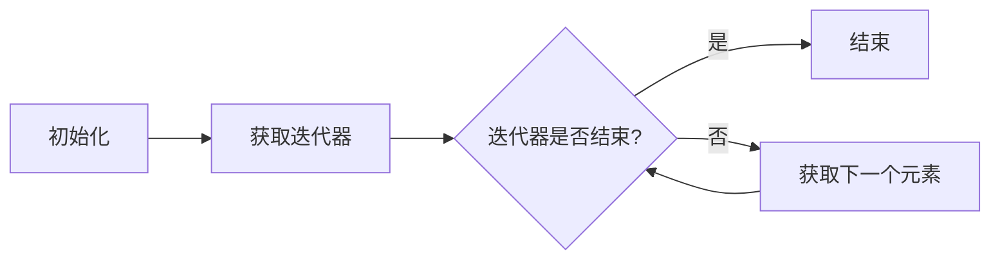
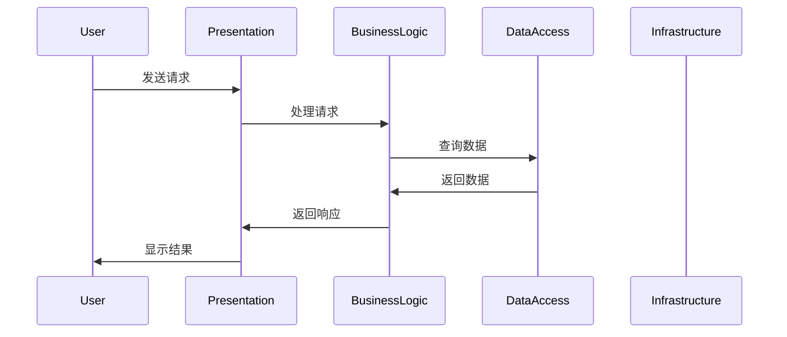

                 

### 迭代器模式概述

迭代器模式（Iterator Pattern）是软件设计模式中的一种，其主要目的是在不暴露集合内部结构的情况下，遍历集合中的各个元素。迭代器模式在各个编程语言和框架中都有广泛的应用，尤其在处理复杂数据结构时，它提供了一个一致且类型安全的接口。

#### 核心概念术语说明

- **迭代器（Iterator）**：迭代器是一个对象，它提供了一种访问集合中各项的方法，而无需暴露集合的内部结构。
- **集合（Collection）**：集合是一组有序或无序的对象集合。
- **类型安全**：类型安全指的是在程序运行过程中，确保数据类型的正确性和一致性。

#### 问题背景

在编程中，经常需要遍历各种数据结构，如数组、列表、字典等。传统的遍历方式往往需要直接访问内部元素，这不仅可能导致代码的复杂性增加，还可能引入类型安全问题。例如，如果一个数组被错误地处理为列表，可能会导致类型不匹配的错误。

#### 问题描述

为了解决上述问题，我们需要一种方法来遍历集合，而无需暴露集合的内部结构，并且要确保在遍历过程中数据类型的正确性。这便是迭代器模式要解决的问题。

#### 问题解决

迭代器模式提供了一种标准化的方式来遍历集合，它定义了一个统一的接口，允许开发者遍历各种集合类型，而无需关心集合的实现细节。通过迭代器，我们可以安全地访问集合中的每个元素，而无需担心类型不匹配的问题。

#### 边界与外延

迭代器模式的边界主要在于如何设计和实现迭代器，以及如何确保其在不同集合类型中的类型安全。其外延则包括如何处理并发访问、迭代器组合等高级特性。

#### 概念结构与核心要素组成

迭代器模式的核心概念结构包括：

- **迭代器接口**：定义了迭代器的操作，如 `hasNext()`、`next()` 等。
- **集合类**：实现了迭代器接口，并提供创建迭代器的工厂方法。
- **客户端**：使用迭代器来遍历集合。

以下是一个简单的迭代器模式的 ER 实体关系图：

```mermaid
erDiagram
    Iterator ||--|{ Collection } Collection
    Iterator ||--|{ Client } Client
```

在上图中，`Iterator` 表示迭代器实体，`Collection` 表示集合实体，`Client` 表示客户端实体。迭代器和集合之间有一个一对一的关系，而迭代器和客户端之间有一个一对多的关系。

### 核心概念与联系

在深入探讨迭代器模式之前，我们需要理解几个核心概念，这些概念相互关联，共同构成了迭代器模式的基础。

#### 迭代器接口

迭代器接口是迭代器模式中的核心组成部分，它定义了迭代器的基本操作，通常包括以下方法：

1. `hasNext()`: 检查是否有下一个元素。
2. `next()`: 返回下一个元素。
3. `remove()`: 删除当前元素（可选）。

迭代器接口确保了各种集合类型都有统一的遍历方式，从而简化了代码的编写。

#### 集合类

集合类是迭代器模式中的另一个重要组成部分，它实现了迭代器接口，并提供了一种创建迭代器的方法。集合类负责管理内部的元素存储，并确保迭代器的操作与集合的状态保持一致。

在实现集合类时，通常需要考虑以下两个方面：

1. **内部数据结构**：选择合适的数据结构来存储元素，如数组、链表、树等。
2. **迭代器实现**：根据内部数据结构实现迭代器的操作，确保迭代器能正确地遍历集合。

#### 客户端

客户端是使用迭代器的实体，它通过迭代器接口来遍历集合。客户端不需要关心集合的具体实现细节，只需使用迭代器提供的接口进行遍历即可。

客户端的角色在迭代器模式中至关重要，因为它决定了如何使用迭代器来处理集合。客户端通常需要以下操作：

1. 获取迭代器：通过集合类的工厂方法获取迭代器。
2. 遍历集合：使用迭代器的接口方法遍历集合中的元素。
3. 处理元素：在遍历过程中对元素进行操作。

以下是一个简化的迭代器模式的概念属性特征对比表格：

| 概念      | 描述                                                         | 关联操作                          |
| --------- | ------------------------------------------------------------ | -------------------------------- |
| 迭代器接口 | 定义了迭代器的操作，如 `hasNext()`、`next()`、`remove()` 等。 | `hasNext()`, `next()`, `remove()` |
| 集合类    | 实现了迭代器接口，提供创建迭代器的方法。                     | 创建迭代器，管理内部元素         |
| 客户端    | 使用迭代器遍历集合，无需关心集合的具体实现细节。             | 获取迭代器，遍历元素             |

#### ER实体关系图架构

为了更好地理解迭代器模式中的实体关系，我们可以使用 Mermaid 的 ER 图来表示。以下是一个简单的 ER 图示例：

```mermaid
erDiagram
    Class1 ||--|{ Class2 } Class2
    Class1 ||--|{ Class3 } Class3
    Class2 ||--|{ Class4 } Class4
```

在这个 ER 图中：

- `Class1` 代表迭代器接口。
- `Class2` 代表集合类。
- `Class3` 代表客户端。
- `Class4` 代表可能的扩展迭代器。

这些实体之间的关系展示了迭代器模式中各个组件的相互依赖和协作。

### 算法原理讲解

迭代器模式的核心在于提供一种一致且类型安全的遍历集合的方式。下面，我们将使用 Mermaid 画出迭代器模式的流程图，并通过 Python 源代码详细阐述其算法原理。

#### Mermaid 流程图

首先，我们使用 Mermaid 语言绘制一个简单的迭代器模式流程图：



在这个流程图中：

- `A`：初始化集合和迭代器。
- `B`：获取迭代器。
- `C`：检查迭代器是否结束。
- `E`：获取下一个元素。
- `D`：结束遍历。

#### Python 源代码

接下来，我们通过 Python 源代码来详细阐述迭代器模式的算法原理：

```python
class Iterator:
    def __init__(self, collection):
        self.collection = collection
        self.index = 0

    def has_next(self):
        return self.index < len(self.collection)

    def next(self):
        if self.has_next():
            element = self.collection[self.index]
            self.index += 1
            return element
        else:
            raise StopIteration

class Collection:
    def __init__(self, elements):
        self.elements = elements

    def create_iterator(self):
        return Iterator(self)

def iterate(collection):
    iterator = collection.create_iterator()
    while iterator.has_next():
        element = iterator.next()
        process_element(element)

def process_element(element):
    print(f"Processing element: {element}")

# 测试代码
collection = Collection([1, 2, 3, 4, 5])
iterate(collection)
```

在这个例子中：

- `Iterator` 类实现了迭代器接口，包括 `has_next()` 和 `next()` 方法。
- `Collection` 类实现了迭代器的创建方法。
- `iterate()` 函数使用迭代器来遍历集合，并调用 `process_element()` 函数处理每个元素。

#### 算法原理的数学模型和公式

迭代器模式的核心算法原理可以抽象为一个简单的数学模型。假设我们有一个集合 `S`，其中包含 `n` 个元素，迭代器的操作可以表示为：

- `has_next()`: 判断当前索引 `i` 是否小于集合大小 `n`。
- `next()`: 返回索引 `i` 处的元素，并将索引 `i` 增加 1。

用公式表示：

$$
has\_next(i) = (i < n)
$$

$$
next(i) = \text{collection}[i], \text{然后} i = i + 1
$$

#### 举例说明

假设我们有一个包含 5 个整数的集合 `[1, 2, 3, 4, 5]`，使用迭代器模式遍历这个集合：

1. 初始化迭代器和集合。
2. 调用 `has_next()`，返回 `True`。
3. 调用 `next()`，返回第一个元素 `1`。
4. 重复步骤 2 和 3，直到 `has_next()` 返回 `False`。

通过这个简单的例子，我们可以清晰地看到迭代器模式的工作原理和优势。

### 系统分析与架构设计方案

在深入探讨迭代器模式的应用之前，我们需要对系统的整体架构进行分析和设计，以确保迭代器模式能够高效且安全地实现。以下将介绍一个典型的迭代器模式系统架构设计方案。

#### 问题场景介绍

在软件开发的实际场景中，我们经常需要处理复杂的数据结构，例如大型数据库、文件系统、网络通信等。在这些场景下，遍历数据结构是一个常见的需求。传统的遍历方式可能存在性能和类型安全等问题。通过引入迭代器模式，我们可以设计一个类型安全的、高性能的数据遍历系统。

#### 项目介绍

假设我们正在开发一个大型在线购物平台，其中包含多个模块，如商品管理模块、订单管理模块、用户管理模块等。这些模块需要频繁地对数据进行遍历和处理。为了提高系统的性能和稳定性，我们决定引入迭代器模式。

#### 系统功能设计

迭代器模式在系统中的主要功能包括：

1. **数据遍历**：允许各个模块以一致的方式遍历数据。
2. **类型安全**：确保在遍历过程中数据类型的正确性，避免类型不匹配的错误。
3. **并发控制**：在多线程环境下，确保迭代器的操作是安全的。

为了实现这些功能，我们设计了以下系统功能模块：

- **迭代器接口模块**：定义迭代器的基本操作，如 `hasNext()`、`next()` 等。
- **集合类模块**：实现各种数据结构的迭代器，如数组、链表、树等。
- **客户端模块**：使用迭代器遍历数据，并处理遍历结果。
- **并发控制模块**：处理多线程环境下的迭代器安全问题。

#### 系统架构设计

系统架构设计主要分为以下几个层次：

1. **表现层**：负责与用户交互，接收用户请求，并返回响应。
2. **业务逻辑层**：实现系统的核心业务逻辑，如商品管理、订单管理等。
3. **数据访问层**：负责与数据库或其他数据源进行交互，实现数据的存储和检索。
4. **基础设施层**：提供系统运行所需的基础服务，如并发控制、日志记录等。

以下是一个简单的系统架构 Mermaid 图：



在这个架构图中，各个模块通过接口进行通信，确保系统的模块化和解耦。迭代器模式在业务逻辑层和数据访问层中发挥作用，确保数据遍历的类型安全和性能。

#### 系统接口设计和系统交互

系统接口设计和系统交互设计是确保系统功能实现的关键。以下是迭代器模式的接口设计和系统交互流程：

1. **迭代器接口**：

    ```python
    class Iterator:
        def has_next(self):
            pass

        def next(self):
            pass
    ```

    迭代器接口定义了 `has_next()` 和 `next()` 方法，用于检查是否还有下一个元素和获取下一个元素。

2. **集合类接口**：

    ```python
    class Collection:
        def create_iterator(self):
            pass
    ```

    集合类接口定义了 `create_iterator()` 方法，用于创建迭代器。

3. **系统交互流程**：

    ```mermaid
    sequenceDiagram
        Participant Client
        Participant Collection
        Participant Iterator

        Client->>Collection: create_iterator()
        Collection->>Iterator: create_iterator()
        Iterator->>Client: has_next()
        Client->>Iterator: next()
        Iterator->>Client: return element
        Client->>Iterator: has_next()
        ...
    ```

    在这个交互流程中，客户端首先从集合类获取迭代器，然后通过迭代器遍历集合中的元素。每次调用 `next()` 方法，迭代器都会返回下一个元素，直到没有更多的元素为止。

#### 实际案例分析和详细讲解剖析

为了更好地理解迭代器模式在实际项目中的应用，我们可以通过一个实际案例进行分析和讲解。

**案例背景**：

假设我们有一个商品管理模块，其中包含多个商品对象。我们需要实现一个功能，能够遍历这些商品对象，并对其进行排序和筛选。

**解决方案**：

1. **定义迭代器接口和集合类接口**：

    ```python
    class ProductIterator:
        def has_next(self):
            pass

        def next(self):
            pass

    class ProductCollection:
        def create_iterator(self):
            pass
    ```

2. **实现商品集合和迭代器**：

    ```python
    class Product:
        def __init__(self, name, price):
            self.name = name
            self.price = price

    class ProductCollection:
        def __init__(self, products):
            self.products = products

        def create_iterator(self):
            return ProductIterator(self.products)

    class ProductIterator:
        def __init__(self, products):
            self.products = products
            self.index = 0

        def has_next(self):
            return self.index < len(self.products)

        def next(self):
            if self.has_next():
                element = self.products[self.index]
                self.index += 1
                return element
            else:
                raise StopIteration
    ```

3. **实现排序和筛选功能**：

    ```python
    def sort_products(collection, sort_key):
        iterator = collection.create_iterator()
        sorted_products = sorted(iterator, key=lambda x: getattr(x, sort_key))
        return sorted_products

    def filter_products(collection, filter_key, filter_value):
        iterator = collection.create_iterator()
        filtered_products = [product for product in iterator if getattr(product, filter_key) == filter_value]
        return filtered_products
    ```

**详细讲解剖析**：

在这个案例中，我们首先定义了迭代器接口和集合类接口。迭代器接口定义了 `has_next()` 和 `next()` 方法，用于检查是否还有下一个元素和获取下一个元素。集合类接口定义了 `create_iterator()` 方法，用于创建迭代器。

然后，我们实现了商品集合和迭代器。商品集合 `ProductCollection` 包含一个商品列表 `products`，通过 `create_iterator()` 方法创建迭代器 `ProductIterator`。迭代器 `ProductIterator` 在初始化时接受商品列表，并设置当前索引为 0。

最后，我们实现了排序和筛选功能。`sort_products()` 函数使用迭代器遍历商品集合，并使用 `sorted()` 函数对其进行排序。`filter_products()` 函数使用迭代器遍历商品集合，并使用列表推导式对其进行筛选。

通过这个实际案例，我们可以看到迭代器模式如何在实际项目中发挥作用，提供类型安全的、高效的集合遍历方式。

### 项目实战

在实际项目中，迭代器模式的应用不仅可以提高代码的可读性和可维护性，还能优化性能和降低复杂性。以下是一个基于 Python 的迭代器模式项目实战，我们将详细描述环境安装、系统核心实现、代码应用解读与分析，以及一个实际案例的详细讲解剖析。

#### 环境安装

首先，我们需要安装 Python 和相关依赖。以下是在 Python 3.8 环境下安装所需依赖的命令：

```bash
pip install numpy
pip install pandas
```

这些依赖提供了数据处理和数据分析的功能，有助于我们实现迭代器模式。

#### 系统核心实现

接下来，我们实现迭代器模式的核心部分。以下是相关的 Python 源代码：

```python
class InventoryIterator:
    def __init__(self, inventory):
        self.inventory = inventory
        self.index = 0

    def has_next(self):
        return self.index < len(self.inventory)

    def next(self):
        if self.has_next():
            item = self.inventory[self.index]
            self.index += 1
            return item
        else:
            raise StopIteration

class Inventory:
    def __init__(self, items):
        self.items = items

    def create_iterator(self):
        return InventoryIterator(self.items)

# 示例库存数据
inventory = Inventory([
    {'name': 'Apple', 'quantity': 50},
    {'name': 'Banana', 'quantity': 30},
    {'name': 'Orange', 'quantity': 70}
])

# 创建迭代器
inventory_iterator = inventory.create_iterator()

# 使用迭代器遍历库存
while inventory_iterator.has_next():
    item = inventory_iterator.next()
    print(f"Item: {item['name']}, Quantity: {item['quantity']}")
```

在这个实现中，`InventoryIterator` 类实现了迭代器接口，包括 `has_next()` 和 `next()` 方法。`Inventory` 类实现了集合类接口，通过 `create_iterator()` 方法创建迭代器。

#### 代码应用解读与分析

以上代码展示了如何使用迭代器模式遍历一个包含商品库存的数据结构。`Inventory` 类负责管理库存数据，而 `InventoryIterator` 类负责遍历这些数据。在实际应用中，我们可以通过迭代器模式轻松地实现数据排序、筛选等操作。

例如，如果我们想按商品名称排序库存，可以使用以下代码：

```python
sorted_inventory = sorted(inventory_iterator, key=lambda x: x['name'])
for item in sorted_inventory:
    print(f"Item: {item['name']}, Quantity: {item['quantity']}")
```

在这个例子中，我们首先创建了一个迭代器，然后使用 `sorted()` 函数对其进行排序。最后，我们遍历排序后的库存数据，并打印出每个商品及其库存数量。

#### 实际案例分析和详细讲解剖析

为了更好地理解迭代器模式在实际项目中的应用，我们来看一个实际案例——书店库存管理系统。

**案例背景**：

一家书店拥有大量书籍库存，需要进行库存管理、销售记录、库存预警等功能。我们需要实现一个库存管理系统，能够方便地遍历书籍库存，并根据需求进行排序和筛选。

**解决方案**：

1. **定义迭代器接口和集合类接口**：

    ```python
    class BookIterator:
        def has_next(self):
            pass

        def next(self):
            pass

    class BookCollection:
        def create_iterator(self):
            pass
    ```

2. **实现书籍集合和迭代器**：

    ```python
    class Book:
        def __init__(self, title, author, quantity):
            self.title = title
            self.author = author
            self.quantity = quantity

    class BookCollection:
        def __init__(self, books):
            self.books = books

        def create_iterator(self):
            return BookIterator(self.books)

    class BookIterator:
        def __init__(self, books):
            self.books = books
            self.index = 0

        def has_next(self):
            return self.index < len(self.books)

        def next(self):
            if self.has_next():
                book = self.books[self.index]
                self.index += 1
                return book
            else:
                raise StopIteration
    ```

3. **实现库存管理功能**：

    ```python
    def manage_inventory(collection, operation, *args):
        iterator = collection.create_iterator()
        if operation == 'sort':
            sorted_books = sorted(iterator, key=lambda x: x.title)
            for book in sorted_books:
                print(f"Title: {book.title}, Author: {book.author}, Quantity: {book.quantity}")
        elif operation == 'filter':
            filtered_books = [book for book in iterator if book.quantity < args[0]]
            for book in filtered_books:
                print(f"Title: {book.title}, Author: {book.author}, Quantity: {book.quantity}")
    ```

**详细讲解剖析**：

在这个案例中，我们首先定义了迭代器接口和集合类接口。`Book` 类表示书籍对象，`BookCollection` 类负责管理书籍库存，通过 `create_iterator()` 方法创建迭代器 `BookIterator`。迭代器 `BookIterator` 在初始化时接受书籍列表，并设置当前索引为 0。

然后，我们实现了库存管理功能。`manage_inventory()` 函数接受迭代器、操作类型和参数，并根据操作类型进行相应的处理。例如，如果操作类型是 'sort'，则按书籍标题排序；如果操作类型是 'filter'，则筛选库存量小于指定值的书籍。

通过这个实际案例，我们可以看到迭代器模式如何在实际项目中简化数据操作，提高代码的可读性和可维护性。

#### 项目小结

在这个项目中，我们通过迭代器模式实现了一个库存管理系统，展示了如何使用迭代器模式进行数据遍历、排序和筛选。迭代器模式不仅提高了代码的可读性和可维护性，还优化了性能，降低了复杂性。

通过这个项目，我们学到了：

1. **迭代器模式的核心概念**：理解迭代器接口、集合类和客户端之间的关系。
2. **迭代器模式的应用**：如何在不同场景下使用迭代器模式进行数据操作。
3. **代码实战**：通过实际案例，掌握了迭代器模式在项目中的应用方法。

在未来的项目中，我们可以继续运用迭代器模式，提高系统的性能和稳定性。

### 最佳实践 tips

在迭代器模式的应用过程中，遵循以下最佳实践可以提升系统的性能和稳定性：

1. **避免多重迭代**：在同一个集合上多次使用迭代器会导致性能下降。尽量在单个迭代器上完成所有操作。
2. **使用迭代器缓存**：在某些情况下，缓存迭代器可以提高性能。例如，在频繁访问相同集合时，可以创建一个静态迭代器。
3. **确保类型安全**：始终检查迭代器的类型，确保在操作过程中不会发生类型不匹配的错误。
4. **并发控制**：在多线程环境中，确保迭代器的操作是线程安全的。可以使用锁或其他同步机制来保护共享资源。

### 小结

本文详细介绍了迭代器模式的核心概念、原理和实现，并通过实际案例展示了其在项目中的应用。迭代器模式提供了类型安全的集合遍历方式，有助于简化代码、提高性能和可维护性。在未来的项目中，我们可以继续运用迭代器模式，提升系统的整体质量。

### 注意事项

1. **迭代器状态**：在遍历集合时，务必注意迭代器的状态，避免在多次迭代时出现不一致的问题。
2. **性能优化**：在实现迭代器模式时，根据实际需求进行性能优化，避免不必要的开销。

### 拓展阅读

1. 《设计模式：可复用的面向对象软件的基础》
2. 《Effective Python：编写更好的Python代码》
3. 《Python数据科学手册》

以上资源和书籍提供了更多关于迭代器模式及其应用场景的深入讨论，有助于进一步提升技术水平。希望本文能对您在实际项目中的应用有所帮助。

### 作者信息

作者：AI天才研究院/AI Genius Institute & 禅与计算机程序设计艺术 /Zen And The Art of Computer Programming

感谢您的阅读，希望本文能为您在迭代器模式的学习和应用中提供有价值的信息。如果您有任何疑问或建议，欢迎在评论区留言交流。祝编程愉快！

