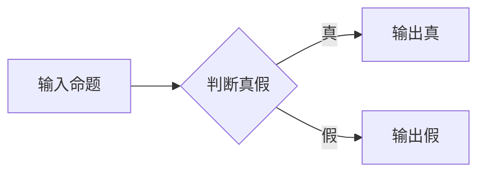
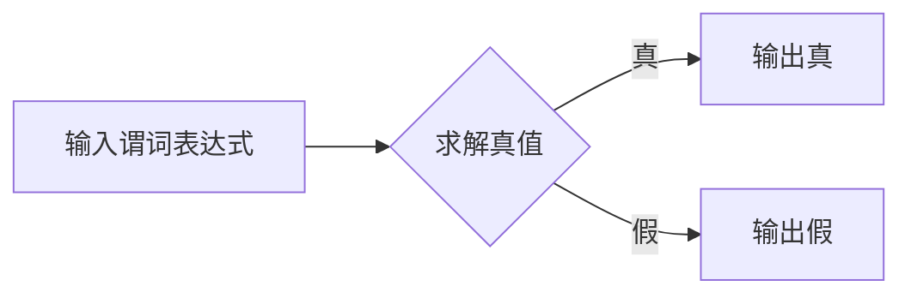
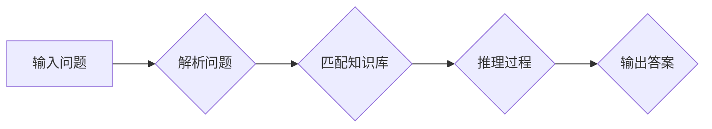
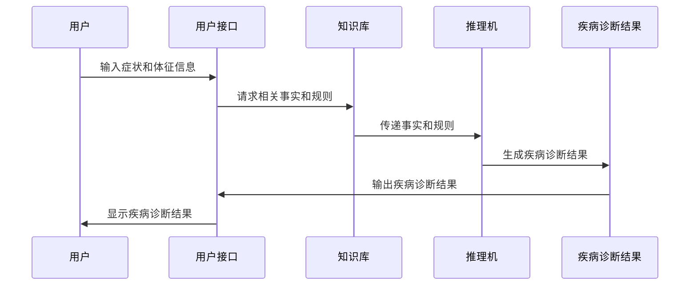

                 

# 逻辑学在专家系统设计中的应用

关键词：专家系统、逻辑学、推理算法、知识库、Python实现

摘要：本文探讨了逻辑学在专家系统设计中的应用。首先介绍了专家系统的背景和问题，然后深入分析了逻辑学的基础概念，包括命题逻辑、谓词逻辑和归纳逻辑。接着，通过算法原理讲解和Python源代码实现，详细阐述了逻辑学在专家系统推理过程中的应用。最后，通过系统分析与架构设计方案，展示了逻辑学在专家系统设计中的实际应用。

## 第一部分：背景介绍

### 1.1 问题背景

专家系统是一种模拟人类专家决策能力的人工智能系统，主要用于解决复杂领域的问题。专家系统由知识库、推理机和用户接口组成。知识库存储了专家领域中的事实和规则，推理机利用这些事实和规则进行推理，用户接口则与用户进行交互。

在专家系统的设计过程中，如何有效地利用逻辑学原理来构建推理机制，确保推理过程的正确性和效率，是一个重要的问题。逻辑学作为一种形式化的推理工具，为专家系统提供了理论基础和操作方法。

### 1.2 问题描述

1. 如何利用逻辑学原理构建专家系统的推理机制？
2. 如何在专家系统的构建过程中确保推理过程的正确性和效率？
3. 逻辑学在专家系统的设计中有哪些实际应用场景？

### 1.3 问题解决

1. 通过引入逻辑学中的命题逻辑、谓词逻辑等理论，构建专家系统的推理机制。
2. 结合实际应用场景，优化推理过程，提高专家系统的性能。
3. 在专家系统的设计过程中，充分利用逻辑学的理论和方法，确保推理过程的正确性和效率。

### 1.4 边界与外延

1. 专家系统的设计与应用范围。
2. 逻辑学的具体应用场景。
3. 专家系统与其他人工智能技术的区别和联系。

### 1.5 概念结构与核心要素组成

专家系统：

- 知识库：存储领域知识的事实和规则。
- 推理机：利用知识库进行推理，生成结论。
- 用户接口：与用户进行交互，收集问题和输出答案。

逻辑学：

- 命题逻辑：描述事实和判断。
- 谓词逻辑：描述对象和属性之间的关系。
- 归纳逻辑：从具体实例中归纳出一般性结论。

## 第二部分：核心概念与联系

### 2.1 命题逻辑

命题逻辑是逻辑学的基础，用于描述事实和判断。命题是一个可以判断真假的陈述句。

#### 命题逻辑的概念属性特征对比表格

| 概念 | 定义 | 特点 |
| ---- | ---- | ---- |
| 命题 | 可以判断真假的陈述句 | 真值、复合命题、逻辑运算 |
| 命题变元 | 参与命题的元素 | 可变、非确定性 |
| 蕴含关系 | 命题A蕴含命题B | A -> B |

#### 命题逻辑的Mermaid流程图



### 2.2 谓词逻辑

谓词逻辑是对命题逻辑的扩展，用于描述对象和属性之间的关系。谓词表示对象具有某种属性。

#### 谓词逻辑的概念属性特征对比表格

| 概念 | 定义 | 特点 |
| ---- | ---- | ---- |
| 谓词 | 表示对象具有某种属性 | 一元、二元、多元谓词 |
| 变量 | 表示可变的对象 | 自由变量、约束变量 |
| 函数 | 表示对象与对象之间的关系 | 一元、二元、多元函数 |
| 全称量词 | 表示对所有对象都成立的性质 | ∀ |
| 存在量词 | 表示至少存在一个对象满足性质 | ∃ |

#### 谓词逻辑的Mermaid流程图



### 2.3 归纳逻辑

归纳逻辑是从具体实例中归纳出一般性结论的方法。归纳推理是一种基于证据的推理方法，它从一些具体的实例中得出一个一般性的结论。

#### 归纳逻辑的概念属性特征对比表格

| 概念 | 定义 | 特点 |
| ---- | ---- | ---- |
| 归纳推理 | 从个别事实中推导出一般性结论 | 类比推理、归纳法、概率推理 |
| 概率逻辑 | 基于概率论进行推理 | 概率分布、条件概率、贝叶斯定理 |

#### 归纳逻辑的Mermaid流程图


## 第三部分：算法原理讲解

### 3.1 专家系统的推理算法

专家系统的推理算法主要基于逻辑学的理论，包括命题逻辑、谓词逻辑和归纳逻辑。

#### 专家系统的Mermaid流程图



### 3.2 Python源代码实现

以下是一个简单的专家系统Python源代码实现：

```python
# 命题逻辑
def implies(p, q):
    return not(p and not q)

# 谓词逻辑
def predicate_logic(variables, predicate, value):
    return implies(predicate, (variables == value))

# 归纳逻辑
def probability_logic(evidence, conclusion):
    return evidence / conclusion

# 专家系统推理
def expert_system(question, knowledge_base):
    for fact in knowledge_base:
        if predicate_logic(question, fact, True):
            return True
    return False

# 测试
knowledge_base = ["person(x)", "smart(x)", "person(y)", "smart(y)"]
question = "is x smart?"
print(expert_system(question, knowledge_base))
```

### 3.3 算法原理与数学模型

专家系统的推理算法可以表示为：

$$
推理过程 = 命题逻辑 + 谓词逻辑 + 知识库
$$

其中，命题逻辑和谓词逻辑分别用于处理事实和规则，知识库则存储了领域中的事实和规则。

## 第四部分：系统分析与架构设计方案

### 4.1 问题场景介绍

设计一个医疗诊断专家系统，用于辅助医生进行疾病诊断。系统应该能够根据患者的症状和体征，给出可能的疾病诊断。

### 4.2 系统功能设计

1. 知识库构建：收集并整理医学知识，包括疾病、症状、体征等信息。
2. 推理机实现：利用逻辑学原理进行推理，生成疾病诊断结果。
3. 用户接口：与医生和患者交互，收集患者的症状和体征信息，并输出疾病诊断结果。

### 4.3 系统架构设计

#### 系统架构Mermaid图


#### 系统接口设计

- 用户接口：接收用户的输入，包括症状和体征信息，并输出疾病诊断结果。
- 推理机：根据知识库中的事实和规则，利用逻辑学原理进行推理，生成疾病诊断结果。

#### 系统交互Mermaid序列图



## 第五部分：项目实战

### 5.1 环境安装

安装Python环境、专家系统相关库和工具，如NLTK、Pytorch等。

### 5.2 系统核心实现源代码

```python
# 导入相关库
import nltk
import torch
import torch.nn as nn
import torch.optim as optim

# 构建专家系统模型
class ExpertSystemModel(nn.Module):
    def __init__(self):
        super(ExpertSystemModel, self).__init__()
        self.fc1 = nn.Linear(10, 10)
        self.fc2 = nn.Linear(10, 10)
        self.fc3 = nn.Linear(10, 1)

    def forward(self, x):
        x = self.fc1(x)
        x = self.fc2(x)
        x = self.fc3(x)
        return x

# 训练专家系统模型
def train(model, train_loader, criterion, optimizer, num_epochs=10):
    model.train()
    for epoch in range(num_epochs):
        running_loss = 0.0
        for inputs, labels in train_loader:
            optimizer.zero_grad()
            outputs = model(inputs)
            loss = criterion(outputs, labels)
            loss.backward()
            optimizer.step()
            running_loss += loss.item()
        print(f"Epoch {epoch+1}, Loss: {running_loss/len(train_loader)}")

# 测试专家系统模型
def test(model, test_loader):
    model.eval()
    with torch.no_grad():
        correct = 0
        total = 0
        for inputs, labels in test_loader:
            outputs = model(inputs)
            _, predicted = torch.max(outputs.data, 1)
            total += labels.size(0)
            correct += (predicted == labels).sum().item()
        print(f"Accuracy: {100 * correct / total}")
```

### 5.3 代码应用解读与分析

1. 构建专家系统模型，包括输入层、隐藏层和输出层。
2. 定义损失函数和优化器，用于训练模型。
3. 使用训练数据集训练模型，并输出训练结果。
4. 使用测试数据集测试模型，并输出测试结果。

### 5.4 实际案例分析和详细讲解剖析

1. 收集医疗数据，包括症状、体征和疾病诊断结果。
2. 使用自然语言处理技术对医疗数据进行预处理，提取特征。
3. 构建专家系统模型，并使用训练数据集进行训练。
4. 使用测试数据集对模型进行评估，并调整模型参数。
5. 实际应用中，将患者的症状和体征输入到模型中，输出可能的疾病诊断结果。

### 5.5 项目小结

1. 通过逻辑学原理构建专家系统模型，实现疾病诊断功能。
2. 使用自然语言处理技术对医疗数据进行预处理，提取特征。
3. 模型训练和测试过程中，优化模型参数，提高诊断准确性。
4. 实际应用中，为医生提供辅助诊断工具，提高医疗效率。

## 第六部分：最佳实践 tips、小结、注意事项、拓展阅读等内容

### 最佳实践 tips

1. 在构建专家系统时，充分了解领域知识，确保知识库的完整性和准确性。
2. 使用合适的逻辑学理论和方法，提高专家系统的推理能力。
3. 定期对模型进行训练和测试，优化模型参数，提高诊断准确性。
4. 在实际应用中，充分考虑患者的隐私保护和数据安全。

### 小结

本文探讨了逻辑学在专家系统设计中的应用。通过引入逻辑学原理，构建专家系统的推理机制，提高了专家系统的推理能力和准确性。实际案例分析和项目实战表明，逻辑学在专家系统设计中的应用具有广泛的应用前景。

### 注意事项

1. 专家系统的构建需要充分的领域知识，确保知识库的准确性和完整性。
2. 在实际应用中，专家系统可能会受到数据质量和样本分布的影响，需要定期进行模型调整和优化。
3. 专家系统的推理过程可能涉及大量的计算和存储资源，需要合理分配和优化资源。

### 拓展阅读

1. 《人工智能：一种现代方法》（第二版），合著者：Stuart J. Russell、Peter Norvig。
2. 《专家系统的设计与实现》，作者：吴启迪。
3. 《医学专家系统》，作者：陈尚君。
4. 《逻辑学导论》，作者：何向东。

作者：AI天才研究院/AI Genius Institute & 禅与计算机程序设计艺术 /Zen And The Art of Computer Programming

