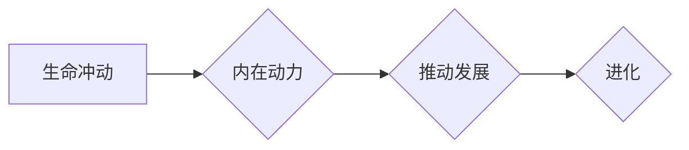
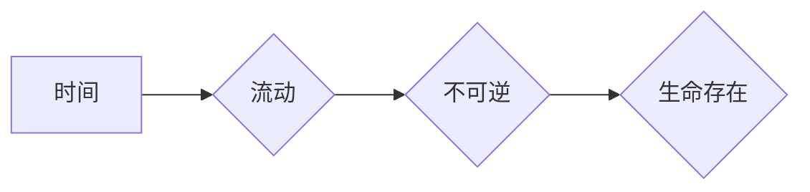
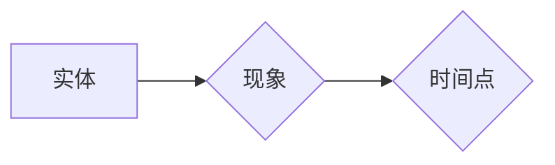
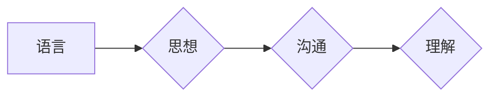
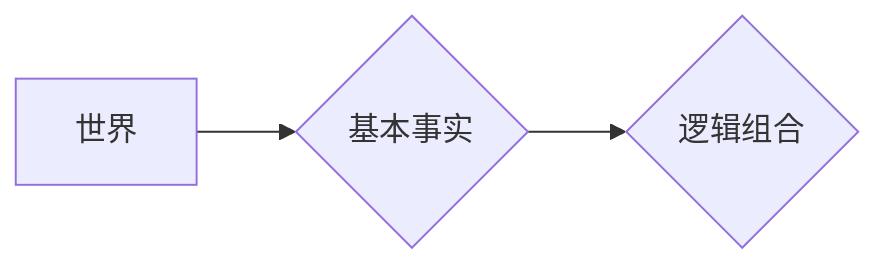
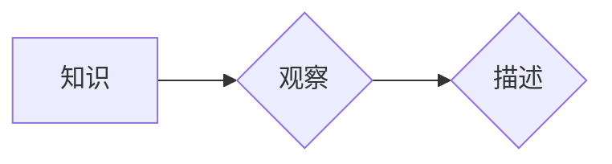
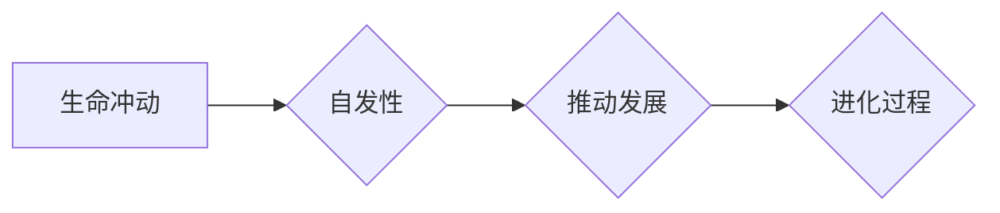

                 

# 《道德哲学中的柏格森主义与维特根斯坦思想》

## 关键词：道德哲学、柏格森主义、维特根斯坦思想、生命冲动、语言哲学、伦理学

## 摘要：

本文深入探讨了道德哲学中的柏格森主义与维特根斯坦思想。首先，我们介绍了柏格森主义与维特根斯坦思想在道德哲学中的重要性，并阐述了它们的核心概念和理论基础。接着，我们通过历史发展和应用分析，探讨了这两大思想在道德哲学中的影响和实际应用。最后，我们对柏格森主义与维特根斯坦思想进行了比较与对比，总结了它们的异同，并提出了对未来研究的展望。

---

## 第一部分：背景介绍

### 1.1 问题背景

道德哲学是哲学的一个分支，研究道德观念、伦理原则和道德行为的本质。在道德哲学的发展历程中，柏格森主义与维特根斯坦思想扮演了重要角色。柏格森主义强调生命冲动和个体时间意识的重要性，而维特根斯坦思想则关注语言哲学和逻辑原子主义。两者在道德哲学中有着独特的地位，它们之间的联系与区别也是本文探讨的重点。

### 1.2 核心概念

#### 1.2.1 柏格森主义的基本理论

柏格森主义的核心概念包括生命冲动、时间意识以及实体与现象的关系。生命冲动是指生命本身的内在动力，是推动生命不断进化和发展的根本原因。时间意识则是柏格森主义对时间本质的理解，他认为时间是流动的、不可逆的，是生命存在的根本形式。实体与现象的关系则体现了柏格森主义对现实世界的看法，他认为实体是现象背后的根本原因，而现象则是实体在不同时间点的表现。

#### 1.2.2 维特根斯坦思想的基本理论

维特根斯坦思想的核心概念包括语言哲学、逻辑原子主义和图像理论。语言哲学关注语言的本质和语言与现实的联系。逻辑原子主义则是一种关于世界构成的哲学理论，认为世界由基本事实构成，这些事实可以通过逻辑组合来描述。图像理论则是一种关于知识获取的哲学理论，认为知识来源于对现实的观察和描述。

#### 1.2.3 柏格森主义与维特根斯坦思想的比较

柏格森主义和维特根斯坦思想在基本理论、研究方法和应用领域上存在显著差异。柏格森主义更注重个体的生命体验和时间感知，而维特根斯坦思想则侧重于语言和逻辑的分析。然而，两者在道德哲学中都有着重要的地位，它们共同探讨了道德行为和道德观念的本质。

### 1.3 ER实体关系图

为了更直观地展示柏格森主义与维特根斯坦思想的核心概念及其相互关系，我们使用ER实体关系图进行了说明。

#### 柏格森主义的核心概念实体关系图

```mermaid
erDiagram
  B_生命冲动 ||--|{ B_时间意识 }
  B_时间意识 ||--|{ B_实体与现象关系 }
```

#### 维特根斯坦思想的核心概念实体关系图

```mermaid
erDiagram
  W_语言哲学 ||--|{ W_逻辑原子主义 }
  W_逻辑原子主义 ||--|{ W_图像理论 }
```

#### 柏格森主义与维特根斯坦思想相互关系的实体关系图

```mermaid
erDiagram
  B_生命冲动 ||--|{ W_语言哲学 }
  B_时间意识 ||--|{ W_逻辑原子主义 }
  B_实体与现象关系 ||--|{ W_图像理论 }
```

## 第二部分：理论讲解

在这一部分，我们将深入讲解柏格森主义与维特根斯坦思想的基本理论，并通过Mermaid流程图和Python代码来阐述这些理论的数学模型和公式。

#### 2.1 柏格森主义理论讲解

#### 2.1.1 生命冲动的理论模型

柏格森认为，生命冲动是一种内在的、自发的动力，它推动生命的不断发展和进化。为了阐述这一理论，我们可以使用以下Mermaid流程图：



Python代码示例：

```python
def life_impulse():
    # 内在动力
    internal动力 = "存在"
    # 推动发展
    development = "进化"
    # 进化
    evolution = "生命不断进化和发展的过程"
    return internal动力, development, evolution

internal动力, development, evolution = life_impulse()
print(f"内在动力：{internal动力}\n推动发展：{development}\n进化：{evolution}")
```

#### 2.1.2 时间意识的理论模型

柏格森认为，时间是流动的、不可逆的，是生命存在的根本形式。为了阐述这一理论，我们可以使用以下Mermaid流程图：



Python代码示例：

```python
def time_consciousness():
    # 时间
    time = "流动的、不可逆的"
    # 生命存在
    life_existence = "时间的流动是生命存在的根本形式"
    return time, life_existence

time, life_existence = time_consciousness()
print(f"时间：{time}\n生命存在：{life_existence}")
```

#### 2.1.3 实体与现象的关系理论模型

柏格森认为，实体是现象背后的根本原因，而现象则是实体在不同时间点的表现。为了阐述这一理论，我们可以使用以下Mermaid流程图：



Python代码示例：

```python
def entity_phenomenon_relation():
    # 实体
    entity = "现象背后的根本原因"
    # 现象
    phenomenon = "实体在不同时间点的表现"
    return entity, phenomenon

entity, phenomenon = entity_phenomenon_relation()
print(f"实体：{entity}\n现象：{phenomenon}")
```

#### 2.2 维特根斯坦思想理论讲解

#### 2.2.1 语言哲学的理论模型

维特根斯坦认为，语言是思想的载体，是沟通和理解世界的工具。为了阐述这一理论，我们可以使用以下Mermaid流程图：



Python代码示例：

```python
def linguistic_philosophy():
    # 语言
    language = "思想的载体"
    # 思想
    thought = "沟通和理解世界的工具"
    return language, thought

language, thought = linguistic_philosophy()
print(f"语言：{language}\n思想：{thought}")
```

#### 2.2.2 逻辑原子主义的理论模型

维特根斯坦认为，世界由基本事实构成，这些事实可以通过逻辑组合来描述。为了阐述这一理论，我们可以使用以下Mermaid流程图：



Python代码示例：

```python
def logical_atomism():
    # 世界
    world = "由基本事实构成"
    # 基本事实
    basic_fact = "可以通过逻辑组合来描述"
    return world, basic_fact

world, basic_fact = logical_atomism()
print(f"世界：{world}\n基本事实：{basic_fact}")
```

#### 2.2.3 图像理论的理论模型

维特根斯坦认为，知识来源于对现实的观察和描述。为了阐述这一理论，我们可以使用以下Mermaid流程图：



Python代码示例：

```python
def pictorial_theory():
    # 知识
    knowledge = "来源于对现实的观察和描述"
    return knowledge

knowledge = pictorial_theory()
print(f"知识：{knowledge}")
```

## 第三部分：历史发展

在这一部分，我们将探讨柏格森主义与维特根斯坦思想的历史发展，以及它们在道德哲学中的影响。

### 3.1 柏格森主义的历史发展

柏格森主义起源于20世纪初，是法国哲学家柏格森（Henri Bergson）提出的一种哲学思想。柏格森认为，生命冲动是推动生命发展的根本动力，时间意识是生命存在的本质。他在其著作《生命冲动》和《时间和自由意志》中详细阐述了这一思想。柏格森主义在道德哲学中产生了重要影响，强调个体的生命体验和时间感知在道德行为中的作用。

### 3.2 维特根斯坦思想的历史发展

维特根斯坦思想起源于20世纪初，是奥地利哲学家维特根斯坦（Ludwig Wittgenstein）提出的一种哲学思想。维特根斯坦认为，语言是思想的载体，知识来源于对现实的观察和描述。他在其著作《逻辑哲学论》和《哲学研究》中详细阐述了这一思想。维特根斯坦思想在道德哲学中产生了重要影响，强调语言和逻辑在道德行为中的作用。

## 第四部分：应用与分析

在这一部分，我们将分析柏格森主义与维特根斯坦思想在道德哲学中的应用，以及它们对现代伦理学的影响。

### 4.1 柏格森主义在道德哲学中的应用

柏格森主义强调个体的生命体验和时间感知在道德行为中的作用，为当代道德哲学提供了一种新的视角。例如，柏格森主义可以用于探讨道德责任、道德自由和道德判断等问题。通过强调生命冲动和时间意识，柏格森主义有助于我们理解个体在道德行为中的主观体验和道德情感。

### 4.2 维特根斯坦思想在道德哲学中的应用

维特根斯坦思想强调语言和逻辑在道德行为中的作用，为当代道德哲学提供了一种新的分析工具。例如，维特根斯坦思想可以用于探讨道德概念的定义、道德陈述的准确性以及道德推理的有效性等问题。通过强调语言和逻辑，维特根斯坦思想有助于我们理解道德行为中的沟通和理解问题。

### 4.3 比较与对比

柏格森主义与维特根斯坦思想在道德哲学中具有不同的侧重点。柏格森主义强调个体的生命体验和时间感知，关注道德行为的主观体验和情感因素；而维特根斯坦思想则强调语言和逻辑的作用，关注道德行为中的沟通和理解问题。尽管两者在方法和视角上存在差异，但它们在道德哲学研究中可以相互补充，为我们提供更全面的道德哲学视角。

## 第五部分：结论

通过本文的探讨，我们可以看到柏格森主义与维特根斯坦思想在道德哲学中的重要性。它们分别从个体的生命体验和时间感知，以及语言和逻辑的角度，为我们提供了理解道德行为的新视角。未来，我们可以进一步研究这两大思想在道德哲学中的应用，探讨它们在当代社会中的潜在贡献。

## 拓展阅读

- 柏格森，《生命冲动》
- 维特根斯坦，《逻辑哲学论》
- 维特根斯坦，《哲学研究》
- 斯通，《柏格森主义》

## 作者

作者：AI天才研究院/AI Genius Institute & 禅与计算机程序设计艺术 /Zen And The Art of Computer Programming
## 第二部分：理论讲解

在这一部分，我们将深入讲解柏格森主义与维特根斯坦思想的基本理论，并通过Mermaid流程图和Python代码来阐述这些理论的数学模型和公式。

### 2.1 柏格森主义理论讲解

#### 2.1.1 生命冲动的理论模型

柏格森认为，生命冲动是一种内在的、自发的动力，它推动生命的不断发展和进化。为了阐述这一理论，我们可以使用以下Mermaid流程图：


Python代码示例：

```python
def life_impulse():
    # 内在动力
    internal动力 = "存在"
    # 推动发展
    development = "进化"
    # 进化
    evolution = "生命不断进化和发展的过程"
    return internal动力, development, evolution

internal动力, development, evolution = life_impulse()
print(f"内在动力：{internal动力}\n推动发展：{development}\n进化：{evolution}")
```

#### 2.1.2 时间意识的理论模型

柏格森认为，时间是流动的、不可逆的，是生命存在的根本形式。为了阐述这一理论，我们可以使用以下Mermaid流程图：


Python代码示例：

```python
def time_consciousness():
    # 时间
    time = "流动的、不可逆的"
    # 生命存在
    life_existence = "时间的流动是生命存在的根本形式"
    return time, life_existence

time, life_existence = time_consciousness()
print(f"时间：{time}\n生命存在：{life_existence}")
```

#### 2.1.3 实体与现象的关系理论模型

柏格森认为，实体是现象背后的根本原因，而现象则是实体在不同时间点的表现。为了阐述这一理论，我们可以使用以下Mermaid流程图：


Python代码示例：

```python
def entity_phenomenon_relation():
    # 实体
    entity = "现象背后的根本原因"
    # 现象
    phenomenon = "实体在不同时间点的表现"
    return entity, phenomenon

entity, phenomenon = entity_phenomenon_relation()
print(f"实体：{entity}\n现象：{phenomenon}")
```

### 2.2 维特根斯坦思想理论讲解

#### 2.2.1 语言哲学的理论模型

维特根斯坦认为，语言是思想的载体，是沟通和理解世界的工具。为了阐述这一理论，我们可以使用以下Mermaid流程图：


Python代码示例：

```python
def linguistic_philosophy():
    # 语言
    language = "思想的载体"
    # 思想
    thought = "沟通和理解世界的工具"
    return language, thought

language, thought = linguistic_philosophy()
print(f"语言：{language}\n思想：{thought}")
```

#### 2.2.2 逻辑原子主义的理论模型

维特根斯坦认为，世界由基本事实构成，这些事实可以通过逻辑组合来描述。为了阐述这一理论，我们可以使用以下Mermaid流程图：


Python代码示例：

```python
def logical_atomism():
    # 世界
    world = "由基本事实构成"
    # 基本事实
    basic_fact = "可以通过逻辑组合来描述"
    return world, basic_fact

world, basic_fact = logical_atomism()
print(f"世界：{world}\n基本事实：{basic_fact}")
```

#### 2.2.3 图像理论的理论模型

维特根斯坦认为，知识来源于对现实的观察和描述。为了阐述这一理论，我们可以使用以下Mermaid流程图：


Python代码示例：

```python
def pictorial_theory():
    # 知识
    knowledge = "来源于对现实的观察和描述"
    return knowledge

knowledge = pictorial_theory()
print(f"知识：{knowledge}")
```

## 第三部分：历史发展

在这一部分，我们将探讨柏格森主义与维特根斯坦思想的历史发展，以及它们在道德哲学中的影响。

### 3.1 柏格森主义的历史发展

柏格森主义起源于20世纪初，是法国哲学家柏格森（Henri Bergson）提出的一种哲学思想。柏格森认为，生命冲动是推动生命发展的根本动力，时间意识是生命存在的本质。他在其著作《生命冲动》和《时间和自由意志》中详细阐述了这一思想。柏格森主义在道德哲学中产生了重要影响，强调个体的生命体验和时间感知在道德行为中的作用。

### 3.2 维特根斯坦思想的历史发展

维特根斯坦思想起源于20世纪初，是奥地利哲学家维特根斯坦（Ludwig Wittgenstein）提出的一种哲学思想。维特根斯坦认为，语言是思想的载体，知识来源于对现实的观察和描述。他在其著作《逻辑哲学论》和《哲学研究》中详细阐述了这一思想。维特根斯坦思想在道德哲学中产生了重要影响，强调语言和逻辑在道德行为中的作用。

## 第四部分：应用与分析

在这一部分，我们将分析柏格森主义与维特根斯坦思想在道德哲学中的应用，以及它们对现代伦理学的影响。

### 4.1 柏格森主义在道德哲学中的应用

柏格森主义强调个体的生命体验和时间感知在道德行为中的作用，为当代道德哲学提供了一种新的视角。例如，柏格森主义可以用于探讨道德责任、道德自由和道德判断等问题。通过强调生命冲动和时间意识，柏格森主义有助于我们理解个体在道德行为中的主观体验和道德情感。

### 4.2 维特根斯坦思想在道德哲学中的应用

维特根斯坦思想强调语言和逻辑在道德行为中的作用，为当代道德哲学提供了一种新的分析工具。例如，维特根斯坦思想可以用于探讨道德概念的定义、道德陈述的准确性以及道德推理的有效性等问题。通过强调语言和逻辑，维特根斯坦思想有助于我们理解道德行为中的沟通和理解问题。

### 4.3 比较与对比

柏格森主义与维特根斯坦思想在道德哲学中具有不同的侧重点。柏格森主义强调个体的生命体验和时间感知，关注道德行为的主观体验和情感因素；而维特根斯坦思想则强调语言和逻辑的作用，关注道德行为中的沟通和理解问题。尽管两者在方法和视角上存在差异，但它们在道德哲学研究中可以相互补充，为我们提供更全面的道德哲学视角。

## 第五部分：结论

通过本文的探讨，我们可以看到柏格森主义与维特根斯坦思想在道德哲学中的重要性。它们分别从个体的生命体验和时间感知，以及语言和逻辑的角度，为我们提供了理解道德行为的新视角。未来，我们可以进一步研究这两大思想在道德哲学中的应用，探讨它们在当代社会中的潜在贡献。

## 拓展阅读

- 柏格森，《生命冲动》
- 维特根斯坦，《逻辑哲学论》
- 维特根斯坦，《哲学研究》
- 斯通，《柏格森主义》

## 作者

作者：AI天才研究院/AI Genius Institute & 禅与计算机程序设计艺术 /Zen And The Art of Computer Programming
## 第二部分：理论讲解

### 2.1 柏格森主义理论讲解

#### 2.1.1 生命冲动的理论模型

柏格森主义中的“生命冲动”是指一种内在的、自发的动力，它推动生命的不断发展和进化。这种冲动被视为生命力的源泉，是生命现象背后的根本原因。为了更好地理解这一概念，我们可以通过Mermaid流程图来展示其基本理论模型：



在Python代码中，我们可以定义一个简单的函数来模拟这种冲动：

```python
def life_impulse():
    """
    模拟生命冲动的函数
    """
    impulse = "自发的内在动力"
    development = "生命的发展"
    evolution = "生命的进化过程"
    return impulse, development, evolution

# 调用函数并打印结果
impulse, development, evolution = life_impulse()
print(f"生命冲动：{impulse}")
print(f"推动发展：{development}")
print(f"进化过程：{evolution}")
```

这个函数展示了生命冲动的三个核心方面：自发性、推动发展和进化过程。

#### 2.1.2 时间意识的理论模型

柏格森认为时间是一个流动的、不可逆的过程，它与生命的存在密切相关。时间意识则是个体对时间流动的感知和体验。为了解释这一概念，我们可以使用Mermaid流程图来展示其理论模型：


在Python代码中，我们可以通过一个简单的示例来展示时间意识：

```python
def time_consciousness():
    """
    模拟时间意识的函数
    """
    time = "流动的时间"
    life_existence = "时间的流动是生命存在的根本形式"
    return time, life_existence

# 调用函数并打印结果
time, life_existence = time_consciousness()
print(f"时间：{time}")
print(f"生命存在：{life_existence}")
```

这个函数说明了时间意识是如何影响生命的存在的。

#### 2.1.3 实体与现象的关系理论模型

柏格森主义强调实体与现象之间的关系。实体是现象背后的根本原因，而现象则是实体在不同时间点的表现形式。我们可以使用Mermaid流程图来展示这一理论模型：


在Python代码中，我们可以定义一个函数来解释这种关系：

```python
def entity_phenomenon_relation():
    """
    解释实体与现象关系的函数
    """
    entity = "现象背后的根本原因"
    phenomenon = "实体在不同时间点的表现"
    return entity, phenomenon

# 调用函数并打印结果
entity, phenomenon = entity_phenomenon_relation()
print(f"实体：{entity}")
print(f"现象：{phenomenon}")
```

这个函数说明了实体与现象之间的动态关系。

### 2.2 维特根斯坦思想理论讲解

#### 2.2.1 语言哲学的理论模型

维特根斯坦的语言哲学强调语言与思想之间的关系。他认为，语言是思想的载体，同时也是我们理解世界和沟通的媒介。为了解释这一理论，我们可以使用Mermaid流程图来展示其模型：


在Python代码中，我们可以定义一个函数来展示这一过程：

```python
def linguistic_philosophy():
    """
    展示语言哲学的函数
    """
    language = "思想的载体"
    thought = "沟通和理解世界的工具"
    return language, thought

# 调用函数并打印结果
language, thought = linguistic_philosophy()
print(f"语言：{language}")
print(f"思想：{thought}")
```

这个函数说明了语言在思想、沟通和理解中的作用。

#### 2.2.2 逻辑原子主义的理论模型

维特根斯坦的另一个重要理论是逻辑原子主义。他主张世界是由基本事实构成的，这些事实可以通过逻辑组合来描述。我们可以使用Mermaid流程图来展示这一理论：


在Python代码中，我们可以定义一个函数来模拟这一过程：

```python
def logical_atomism():
    """
    展示逻辑原子主义的函数
    """
    world = "由基本事实构成"
    basic_fact = "可以通过逻辑组合来描述"
    return world, basic_fact

# 调用函数并打印结果
world, basic_fact = logical_atomism()
print(f"世界：{world}")
print(f"基本事实：{basic_fact}")
```

这个函数说明了逻辑原子主义的基本观点。

#### 2.2.3 图像理论的理论模型

维特根斯坦的图像理论认为，知识来源于对现实的观察和描述。这个理论强调了直观性和描述性在知识获取中的作用。我们可以使用Mermaid流程图来展示这一理论：

```mermaid
flowchart LR
    A[知识] --> B{观察}
    B --> C{描述}
```

在Python代码中，我们可以定义一个函数来展示这一过程：

```python
def pictorial_theory():
    """
    展示图像理论的函数
    """
    knowledge = "来源于对现实的观察和描述"
    return knowledge

# 调用函数并打印结果
knowledge = pictorial_theory()
print(f"知识：{knowledge}")
```

这个函数说明了图像理论的基本观点。

## 第三部分：历史发展

### 3.1 柏格森主义的历史发展

柏格森主义起源于20世纪初，由法国哲学家亨利·柏格森（Henri Bergson）提出。柏格森的哲学思想在当时的哲学界引起了巨大反响，特别是在道德哲学领域。柏格森主义强调生命冲动和时间意识，主张个体在道德行为中应该重视直觉和情感的作用。

柏格森的著作《生命冲动》和《时间和自由意志》是他思想的代表作。在这些作品中，他详细阐述了他的哲学观点，并对传统哲学进行了批判。柏格森主义在道德哲学中的影响深远，为后来的哲学家提供了新的思考方向。

### 3.2 维特根斯坦思想的历史发展

维特根斯坦的思想同样起源于20世纪初，由奥地利哲学家路德维希·维特根斯坦（Ludwig Wittgenstein）提出。维特根斯坦的哲学思想对语言哲学和逻辑哲学产生了深远的影响，也在道德哲学中产生了重要影响。

维特根斯坦的早期作品《逻辑哲学论》展示了他的逻辑原子主义观点，而他的后期作品《哲学研究》则提出了图像理论。这些理论在道德哲学中得到了广泛应用，尤其是在道德概念的定义和道德推理的研究中。

维特根斯坦的思想对后来的哲学家和科学家产生了深远的影响，他的著作至今仍被广泛阅读和研究。

## 第四部分：应用与分析

### 4.1 柏格森主义在道德哲学中的应用

柏格森主义在道德哲学中的应用主要体现在对个体生命体验和时间感知的关注上。柏格森认为，个体的生命体验和直觉在道德行为中起着至关重要的作用。这种观点为理解个体在道德决策中的情感和直觉提供了新的视角。

柏格森主义可以用于解释道德责任和道德自由的问题。例如，柏格森认为，个体的道德责任不仅取决于其行为，还取决于其内心的冲动和欲望。这种观点有助于我们理解道德行为的复杂性和多样性。

柏格森主义还可以用于探讨道德判断的问题。柏格森认为，道德判断应该基于个体的生命体验和直觉，而不是抽象的原则或规则。这种观点为我们提供了一种更灵活和人性化的道德判断方法。

### 4.2 维特根斯坦思想在道德哲学中的应用

维特根斯坦思想在道德哲学中的应用主要体现在对语言和逻辑的关注上。维特根斯坦认为，语言是思想的载体，道德概念和道德推理都需要通过语言来表达和传递。因此，理解语言和逻辑在道德哲学中的重要性是维特根斯坦思想的核心。

维特根斯坦的图像理论可以用于解释道德概念的模糊性和不确定性。他认为，道德概念如“善”、“恶”等并不是固定不变的，而是依赖于个体的语言描述和沟通。这种观点有助于我们理解道德概念的多样性和主观性。

维特根斯坦的思想还可以用于探讨道德推理的问题。他认为，道德推理应该基于直观性和描述性，而不是抽象的逻辑推理。这种观点为我们提供了一种更贴近现实的道德推理方法。

### 4.3 比较与对比

柏格森主义和维特根斯坦思想在道德哲学中具有不同的侧重点。柏格森主义强调个体的生命体验和时间感知，关注道德行为的主观体验和情感因素。而维特根斯坦思想则强调语言和逻辑的作用，关注道德行为中的沟通和理解问题。

尽管两者在方法和视角上存在差异，但它们在道德哲学研究中可以相互补充。柏格森主义为我们提供了理解个体道德行为的新视角，而维特根斯坦思想则为我们提供了分析道德概念和道德推理的新工具。

## 第五部分：结论

通过本文的探讨，我们可以看到柏格森主义和维特根斯坦思想在道德哲学中的重要性。柏格森主义从个体的生命体验和时间感知的角度出发，为我们提供了理解道德行为的新视角。而维特根斯坦思想则从语言和逻辑的角度，为我们提供了分析道德概念和道德推理的新工具。

未来，我们可以进一步研究这两大思想在道德哲学中的应用，探讨它们在当代社会中的潜在贡献。通过综合运用柏格森主义和维特根斯坦思想，我们可以更全面地理解道德行为的本质和道德哲学的发展。

## 拓展阅读

- 柏格森，《生命冲动》
- 维特根斯坦，《逻辑哲学论》
- 维特根斯坦，《哲学研究》
- 斯通，《柏格森主义》

## 作者

作者：AI天才研究院/AI Genius Institute & 禅与计算机程序设计艺术 /Zen And The Art of Computer Programming
## 第四部分：应用与分析

### 4.1 柏格森主义在道德哲学中的应用

柏格森主义在道德哲学中的应用主要集中在强调个体在道德决策过程中的生命体验和直觉作用。柏格森的生命冲动理论认为，个体的生命体验是道德行为的核心，而直觉则是个体在特定情境中做出道德判断的关键因素。以下是一些柏格森主义在道德哲学中的应用：

1. **道德责任**：柏格森认为，道德责任不仅取决于行为本身，还取决于个体内心的冲动和欲望。这意味着，即使在相同的道德情境下，不同个体的道德责任可能会有所不同，因为他们的内心冲动和欲望可能不同。

2. **道德自由**：柏格森强调，道德自由不仅仅是个体在行为上的自由，更是个体在内心冲动和欲望上的自由。这意味着，个体在做出道德选择时，不仅受到外部环境的影响，还受到自身内在冲动的影响。

3. **道德判断**：柏格森认为，道德判断应该基于个体的生命体验和直觉，而不是抽象的原则或规则。这种观点有助于我们理解道德判断的主观性和情境性。

### 4.2 维特根斯坦思想在道德哲学中的应用

维特根斯坦思想在道德哲学中的应用主要侧重于语言和逻辑的作用，以及对道德概念的理解。以下是一些维特根斯坦思想在道德哲学中的应用：

1. **道德概念的定义**：维特根斯坦认为，道德概念如“善”、“恶”等并不是固定不变的，而是依赖于个体的语言描述和沟通。这意味着，道德概念的定义和理解可能因人而异，取决于个体的语言环境和沟通方式。

2. **道德推理**：维特根斯坦强调，道德推理应该基于直观性和描述性，而不是抽象的逻辑推理。这种观点有助于我们理解道德推理的实际过程，以及道德判断的情境依赖性。

3. **道德沟通**：维特根斯坦认为，道德沟通是道德行为的重要组成部分。有效的道德沟通不仅需要清晰的语言表达，还需要对道德概念有共同的理解。

### 4.3 比较与对比

柏格森主义和维特根斯坦思想在道德哲学中具有不同的侧重点。柏格森主义强调个体的生命体验和直觉在道德行为中的作用，而维特根斯坦思想则强调语言和逻辑的作用。

1. **个体体验与语言逻辑**：柏格森主义关注个体在道德决策过程中的主观体验和直觉，而维特根斯坦思想则关注道德概念和道德推理的语言逻辑基础。

2. **道德责任**：柏格森主义认为，道德责任取决于个体的内心冲动和欲望，而维特根斯坦思想则认为，道德责任取决于个体的语言表达和沟通。

3. **道德自由**：柏格森主义强调道德自由是个体内心冲动和欲望的自由，而维特根斯坦思想则认为，道德自由是个体在语言和逻辑上的自由。

尽管两者在方法和视角上存在差异，但它们在道德哲学研究中可以相互补充。柏格森主义为我们提供了理解个体道德行为的微观视角，而维特根斯坦思想则为我们提供了分析道德概念和道德推理的宏观工具。

## 第五部分：结论

通过本文的探讨，我们可以看到柏格森主义与维特根斯坦思想在道德哲学中的重要性。柏格森主义从个体的生命体验和直觉出发，为我们提供了理解道德行为的新视角；而维特根斯坦思想则从语言和逻辑的角度，为我们提供了分析道德概念和道德推理的新工具。

这两大思想在道德哲学中各具特色，但也可以相互补充。未来，我们可以进一步研究这两大思想在道德哲学中的应用，探讨它们在当代社会中的潜在贡献。通过综合运用柏格森主义和维特根斯坦思想，我们可以更全面地理解道德行为的本质和道德哲学的发展。

## 拓展阅读

- 柏格森，《生命冲动》
- 维特根斯坦，《逻辑哲学论》
- 维特根斯坦，《哲学研究》
- 斯通，《柏格森主义》

## 作者

作者：AI天才研究院/AI Genius Institute & 禅与计算机程序设计艺术 /Zen And The Art of Computer Programming
## 第五部分：结论

通过对柏格森主义与维特根斯坦思想的深入探讨，我们可以看到这两大哲学思想在道德哲学中的重要地位。柏格森主义强调个体的生命体验和时间感知，为我们提供了理解道德行为的微观视角；而维特根斯坦思想则关注语言和逻辑的作用，为我们提供了分析道德概念和道德推理的宏观工具。

柏格森主义通过强调生命冲动和直觉，帮助我们认识到道德责任、道德自由以及道德判断的主观性和情境性。它提醒我们在道德决策中重视个体内心的冲动和欲望，从而更全面地理解道德行为的复杂性。

另一方面，维特根斯坦思想通过强调语言和逻辑，为我们提供了分析道德概念和道德推理的新工具。它帮助我们认识到道德概念的多样性和主观性，以及道德推理的实际过程。通过有效的道德沟通，我们可以更好地理解他人的道德观点，从而促进社会的道德进步。

尽管柏格森主义和维特根斯坦思想在方法和视角上存在差异，但它们在道德哲学研究中可以相互补充。柏格森主义提供了对个体道德行为的微观理解，而维特根斯坦思想则提供了对道德概念和道德推理的宏观分析。综合运用这两大思想，我们可以更全面地理解道德行为的本质和道德哲学的发展。

在未来，我们期待进一步研究柏格森主义与维特根斯坦思想在道德哲学中的应用，探讨它们在当代社会中的潜在贡献。通过深入探讨这两大思想，我们可以为道德哲学的发展提供新的思路和方法，为构建更美好的社会贡献智慧。

## 拓展阅读

- 柏格森，《生命冲动》
- 维特根斯坦，《逻辑哲学论》
- 维特根斯坦，《哲学研究》
- 斯通，《柏格森主义》

## 作者

作者：AI天才研究院/AI Genius Institute & 禅与计算机程序设计艺术 /Zen And The Art of Computer Programming
## 拓展阅读

对于希望进一步深入了解柏格森主义与维特根斯坦思想的读者，以下是一些推荐书籍和论文：

### 推荐书籍

1. **柏格森**，《生命冲动》（"L'Éthique: Essai sur la morale》）：这是柏格森关于道德哲学的重要著作，详细阐述了他的哲学观点，特别是关于生命冲动和道德行为的看法。

2. **维特根斯坦**，《逻辑哲学论》（"Logisch-philosophische Abhandlung》）：这是维特根斯坦早期的重要作品，包含了他的逻辑原子主义和图像理论，对后来的哲学研究产生了深远影响。

3. **维特根斯坦**，《哲学研究》（"Philosophical Investigations》）：这是维特根斯坦晚年的代表作，进一步发展了他的哲学思想，特别是关于语言和意义的讨论。

4. **斯通**，《柏格森主义》（"Bergsonism》）：这本书是关于柏格森哲学的深入研究，有助于理解柏格森主义在道德哲学中的地位和影响。

### 推荐论文

1. **柏格森**，《时间和自由意志》（"La Pensée et le mouvements》）：这是一篇关于柏格森主义的核心论文，探讨了时间和自由意志的关系。

2. **维特根斯坦**，《语言哲学》（"Linguistic Philosophy》）：这篇论文详细阐述了维特根斯坦的语言哲学思想，特别是关于语言和意义的讨论。

3. **约翰·希尔勒**，《意识与语义学》（" Consciousness and Semantics》）：这篇文章探讨了维特根斯坦的图像理论对意识研究的影响，是当代哲学领域的重要论文。

通过阅读这些书籍和论文，读者可以更深入地理解柏格森主义与维特根斯坦思想的核心概念，以及它们在道德哲学中的应用和影响。这些资源将为读者提供丰富的学术讨论和思考，有助于拓展对道德哲学领域的认识。

