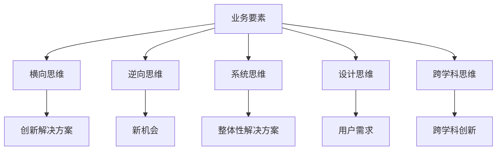
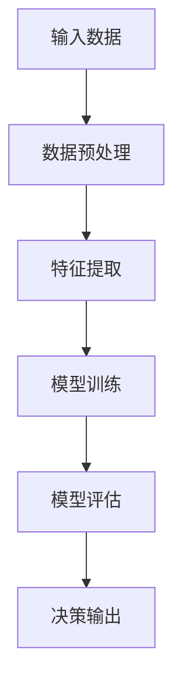

                 

### 《避免单一主义：为业务创造更多可能性》

单一主义，作为一种偏执的思维模式，往往在短期内看似能够带来高效的决策和操作，但实际上它忽略了多元化的优势，导致业务发展的局限性。本文旨在探讨单一主义的负面影响，并提出一套系统的策略，帮助业务在复杂多变的环境中创造更多可能性。

**关键词：单一主义、多元化、业务策略、团队建设、产品设计**

**摘要：**

本文首先分析了单一主义在业务中的表现和危害，随后介绍了多元思维方法，并详细探讨了如何通过多元化团队建设、产品设计、市场策略和供应链管理来避免单一主义。接着，文章讲解了多元思维决策算法的原理和应用，并通过具体实例展示了算法的数学模型和公式。此外，文章还介绍了实际业务中的系统分析与架构设计，以及项目实战经验。最后，文章总结了最佳实践，并提供了拓展阅读的建议。

----------------------------------------------------------------

## 第1章 引言

### 1.1 书籍主题与目的

在当今快速发展的商业环境中，单一主义的危害日益显现。单一主义容易导致决策者固守己见，忽视外部信息和不同意见，从而错失创新和变革的机会。本书的主题是“避免单一主义：为业务创造更多可能性”，旨在引导读者认识到多元化思维的重要性，并提供一套系统的策略，帮助企业在复杂多变的环境中保持竞争力。

本书的目标是：
1. 深入分析单一主义在业务中的负面影响。
2. 引导读者了解并实践多元化思维方法。
3. 提供具体策略，帮助企业在团队建设、产品设计、市场策略和供应链管理等方面避免单一主义。
4. 通过案例研究和算法讲解，展示多元化思维的实际应用效果。

### 1.2 单一主义的现状与问题

单一主义在业务中常见的表现包括：

1. **决策模式单一**：企业领导层过分依赖历史数据和已有经验，忽视新的市场趋势和客户需求，导致决策滞后。
2. **团队结构单一**：团队缺乏多样性，导致思维模式固化，创新能力受限。
3. **产品策略单一**：产品开发往往只考虑主流市场，忽视细分市场和差异化需求。
4. **市场策略单一**：企业在市场拓展上过于依赖单一渠道或市场，风险承受能力弱。
5. **供应链管理单一**：供应链过于集中，缺乏灵活性，难以应对突发事件。

这些问题不仅限制了企业的发展空间，还可能导致企业在市场中的竞争力下降，甚至被淘汰。

### 1.3 问题解决策略

为了避免单一主义，企业需要采取以下策略：

1. **多元化团队建设**：引入不同背景和专业技能的员工，促进思维的多样性和创新。
2. **多元化产品设计**：根据不同市场和客户需求，开发多样化的产品，提高市场竞争力。
3. **多元化市场策略**：在市场拓展上采取多渠道、多市场的策略，分散风险，提高市场覆盖率。
4. **多元化供应链管理**：建立灵活的供应链体系，提高供应链的抗风险能力。

通过这些策略，企业可以在保持核心竞争力的同时，灵活应对市场变化，实现可持续发展。

### 边界与外延

本书主要研究企业如何在业务层面避免单一主义，提高多元化水平。具体来说，研究范围包括：

1. **业务团队建设**：探讨如何通过团队多样化提升业务能力。
2. **产品设计与开发**：分析多元化产品策略对市场竞争力的影响。
3. **市场拓展策略**：研究多元化市场策略在提高市场份额方面的作用。
4. **供应链管理**：探讨如何通过多元化供应链管理提高企业的抗风险能力。

此外，本书还涉及多元思维方法的应用，以及多元思维决策算法的原理和实践。通过这些研究，为企业提供一套全面、系统的多元化策略。

----------------------------------------------------------------

## 第2章 核心概念与联系

### 2.1 多元思维方法

多元思维方法是指通过引入多种思维方式、观点和视角，从而提高问题解决和创新能力的策略。以下是一些常见的多元思维方法：

1. **横向思维**：通过跳出传统的思维框架，从多个角度重新审视问题，寻找新的解决方案。
2. **逆向思维**：从相反的角度思考问题，挑战现有的假设和前提，发现新的创新点。
3. **系统思维**：将问题看作一个整体，分析各个部分之间的相互作用和影响，寻找系统性的解决方案。
4. **设计思维**：以用户需求为中心，通过迭代设计和反馈，创造出满足用户需求的产品和服务。
5. **跨学科思维**：结合不同学科的知识和方法，寻找跨学科的创新解决方案。

### 2.2 概念属性特征对比

为了更清晰地了解多元思维方法的优势与局限，我们可以将它们进行比较。以下是一个简单的对比表格：

| 多元思维方法 | 优势 | 局限 |
| ------------ | ---- | ---- |
| 横向思维 | 促进创新，拓宽思路 | 可能导致方案过于分散，难以聚焦 |
| 逆向思维 | 挑战传统，发现新机会 | 可能陷入逻辑陷阱，导致方案不可行 |
| 系统思维 | 提高问题解决的整体性 | 需要较强的系统分析能力 |
| 设计思维 | 关注用户需求，快速迭代 | 可能忽视技术实现和成本问题 |
| 跨学科思维 | 促进跨学科创新 | 需要跨学科的知识储备 |

### 2.3 业务要素与多元思维方法的实体关系图

为了更好地理解多元思维方法在业务中的应用，我们可以使用Mermaid绘制业务要素与多元思维方法之间的实体关系图。以下是一个简单的示例：



通过这个实体关系图，我们可以看到多元思维方法如何与业务要素相互关联，从而帮助企业实现多元化发展。

----------------------------------------------------------------

## 第3章 多元化团队建设

### 3.1 团队多元性的重要性

多元化团队建设是避免单一主义的重要策略之一。一个多元性强的团队能够引入不同的视角、经验和技能，从而提高整体解决问题的能力。以下是团队多元性的几个关键重要性：

1. **提高创新能力**：团队成员来自不同的背景和专业领域，有助于发现新的问题和解决方案。
2. **拓宽思维边界**：多元性使得团队能够更好地应对复杂问题，从多个角度思考和分析。
3. **增强团队适应性**：多元性强的团队能够更好地适应不同环境和变化，提高企业的抗风险能力。
4. **提升决策质量**：多元化团队的成员能够提供多样化的意见和建议，有助于避免决策偏见和失误。
5. **增强员工满意度**：团队成员来自不同背景，能够相互学习和成长，提高员工的职业满意度和忠诚度。

### 3.2 如何构建多元化团队

要构建一个多元化团队，企业需要采取以下步骤：

1. **明确多元性目标**：企业应明确在性别、年龄、教育背景、专业领域等方面追求的多元性目标。
2. **多样化招聘渠道**：通过多样化的招聘渠道，吸引来自不同背景的应聘者，确保招聘过程的公平性。
3. **建立包容性文化**：营造一个尊重多样性、鼓励表达不同意见的企业文化，让每个团队成员都能感到被重视和认可。
4. **提供多元化培训**：为团队成员提供多元化培训，帮助他们更好地理解并接纳不同背景的同事。
5. **建立多元化评估机制**：制定多元化的绩效评估标准，确保团队在各个方面都能得到公平的评价和认可。

### 3.3 多元化团队的成功案例

许多企业通过构建多元化团队取得了显著的成功。以下是一些典型的案例：

1. **谷歌**：谷歌一直致力于构建多元化团队，通过多种手段吸引和保留来自不同背景的员工。这种多元化策略使得谷歌在技术创新和产品开发方面保持领先地位。
2. **微软**：微软在多元化团队建设方面也有显著的成果。微软的多元化团队帮助公司成功推出了多个创新产品，如Surface和HoloLens。
3. **特斯拉**：特斯拉在多元化团队建设方面取得了巨大的成功。特斯拉的团队涵盖了各种专业领域，从工程设计到市场营销，从软件开发到供应链管理，这种多元化的团队结构使得特斯拉能够在电动汽车和清洁能源领域取得突破性进展。

通过这些成功案例，我们可以看到多元化团队建设对企业发展的重要作用。企业应借鉴这些经验，积极构建多元化团队，以应对日益复杂的市场环境。

----------------------------------------------------------------

## 第4章 多元化产品设计

### 4.1 产品设计的多元性

在竞争激烈的商业环境中，产品设计的多元性是提高市场竞争力和满足客户需求的关键。多元化产品设计不仅能够满足不同市场的需求，还能够通过创新和差异化来吸引更多的消费者。以下是多元化产品设计的几个关键方面：

1. **市场细分**：通过市场细分，企业可以更好地了解不同客户群体的需求和偏好，从而设计出更符合市场需求的产品。
2. **产品差异化**：多元化产品设计有助于企业在产品特性、功能、外观等方面实现差异化，从而在激烈的市场竞争中脱颖而出。
3. **创新思维**：多元化产品设计鼓励创新思维，通过引入不同的设计理念和方法，创造出具有独特性和吸引力的产品。
4. **用户参与**：在产品开发过程中，鼓励用户参与设计和反馈，能够提高产品的实用性和用户满意度。

### 4.2 多元化产品策略

要实现多元化产品设计，企业需要采取以下多元化产品策略：

1. **产品线拓展**：通过拓展产品线，企业可以覆盖更多市场和客户群体。例如，苹果公司通过推出iPhone、iPad、Mac等多种产品，满足了不同用户的需求。
2. **定制化服务**：提供定制化服务，让客户能够根据自己的需求和偏好选择产品配置，从而提高产品的附加值和客户满意度。
3. **产品多样化**：在产品设计和功能上实现多样化，满足不同客户群体的个性化需求。例如，汽车制造商可以推出多种不同配置的车型，满足不同用户的喜好。
4. **跨界合作**：与其他行业或企业合作，通过跨界设计创造出具有创新性和差异化的产品。例如，小米与美的合作推出的智能家居产品，就结合了电子产品和家电产品的优势。

### 4.3 多元化产品的市场表现

多元化产品策略在实际应用中取得了显著的市场表现。以下是一些成功案例：

1. **宜家**：宜家通过多元化的产品设计，成功吸引了全球各地的消费者。宜家不仅推出了多种风格的家具产品，还通过线上销售和体验店等形式，满足了不同市场的需求。
2. **阿里巴巴**：阿里巴巴通过多元化的产品策略，在电子商务、云计算、数字娱乐等多个领域取得了巨大成功。这种多元化策略不仅提高了阿里巴巴的市场竞争力，还帮助公司实现了持续增长。
3. **星巴克**：星巴克通过多元化产品设计，推出了多种口味的咖啡和饮品，以及不同风格的门店，吸引了不同年龄层和喜好的消费者。

通过这些成功案例，我们可以看到多元化产品策略在提高企业市场竞争力、满足客户需求方面的作用。企业应积极采取多元化产品策略，以应对市场变化和客户需求的多样化。

----------------------------------------------------------------

## 第5章 多元化市场策略

### 5.1 市场多元化的必要性

在全球化的大背景下，单一市场的局限性日益凸显。多元化市场策略不仅是企业应对市场风险的有效手段，更是拓展业务版图、实现可持续增长的关键。以下是市场多元化的必要性：

1. **分散市场风险**：通过进入多个市场，企业可以降低对单一市场的依赖，从而降低市场波动带来的风险。
2. **挖掘新市场机会**：不同市场的需求和偏好各异，多元化市场策略可以帮助企业发现新的商业机会，开拓新的增长点。
3. **提高品牌影响力**：多元化市场策略有助于企业树立国际化的品牌形象，提高市场竞争力。
4. **优化资源配置**：通过在不同市场进行资源调配，企业可以更有效地利用自身优势，提高资源利用效率。

### 5.2 多元化市场策略的实施

要实施有效的多元化市场策略，企业需要采取以下步骤：

1. **市场调研**：深入了解不同市场的特点和需求，为市场进入提供数据支持。
2. **定位与定位**：根据不同市场的需求和竞争环境，为产品和服务制定相应的市场定位策略。
3. **渠道拓展**：通过多种渠道进入不同市场，如跨境电商平台、本地合作伙伴等，提高市场覆盖率。
4. **本地化营销**：针对不同市场的文化、习惯和消费偏好，制定本地化的营销策略，提高产品和服务的影响力。
5. **持续优化**：根据市场反馈和业务表现，不断优化多元化市场策略，确保市场策略的持续有效。

### 5.3 多元化市场策略的案例研究

以下是一些成功实施多元化市场策略的案例：

1. **华为**：华为通过多元化市场策略，成功在全球范围内建立了强大的市场地位。华为不仅在中国市场取得了显著成绩，还在欧洲、亚洲、美洲等市场实现了业务拓展。
2. **可口可乐**：可口可乐通过多元化市场策略，在全球范围内推出了多种口味和包装，满足了不同市场的需求。可口可乐还通过本地化营销策略，提高了品牌在不同市场的认知度和美誉度。
3. **阿里巴巴**：阿里巴巴通过多元化市场策略，在电子商务、云计算、数字娱乐等多个领域取得了巨大成功。阿里巴巴不仅在中国市场占据了领先地位，还在亚洲、欧洲、美洲等地实现了业务的快速扩展。

通过这些成功案例，我们可以看到多元化市场策略在提高企业市场竞争力、实现可持续发展方面的巨大作用。企业应积极探索多元化市场策略，以应对全球市场的挑战和机遇。

----------------------------------------------------------------

## 第6章 多元化供应链管理

### 6.1 供应链的多元化需求

在当今全球经济一体化和市场竞争日益激烈的背景下，供应链管理的多元化需求显得尤为重要。多元化供应链管理不仅能够提高企业的供应链灵活性，还能有效降低供应链风险，从而提升企业的整体竞争力。以下是多元化供应链管理的几个关键需求：

1. **供应链网络多元化**：企业需要在全球范围内构建多元化的供应链网络，以应对不同地区市场的需求。通过在多个地区建立供应链节点，企业可以更有效地响应市场需求变化，提高供应链的灵活性。
2. **供应链合作伙伴多元化**：与多个供应商和物流服务提供商建立合作关系，有助于企业分散供应链风险。多元化供应链合作伙伴还可以为企业提供更多的选择和资源，从而提高供应链的效率和响应速度。
3. **供应链技术多元化**：引入多种供应链技术，如物联网、大数据分析、区块链等，可以提升供应链的智能化水平，提高供应链的透明度和协同效率。
4. **供应链管理多元化**：采用多样化的供应链管理策略和方法，如JIT（准时制）、VMI（供应商管理库存）、SCOR（供应链操作参考模型）等，以适应不同市场和环境的变化。

### 6.2 多元化供应链管理的策略

为了实现多元化供应链管理，企业需要采取以下策略：

1. **供应链网络优化**：通过分析供应链节点和物流线路，优化供应链网络布局，提高供应链的响应速度和灵活性。
2. **供应商多元化**：建立多元化的供应商网络，与多个供应商建立长期合作关系，确保供应链的稳定性和抗风险能力。
3. **物流服务多元化**：选择多种物流服务提供商，如快递、海运、空运等，以提高供应链的物流效率和成本效益。
4. **信息共享和协同**：通过建立供应链信息共享平台，实现供应链各环节的信息透明化和协同运作，提高供应链的整体效率。
5. **应急响应机制**：制定应急预案，以应对供应链突发事件，如自然灾害、政治动荡、供应链中断等，确保供应链的连续性和稳定性。

### 6.3 多元化供应链管理的实践

多元化供应链管理在实际业务中有着广泛的应用，以下是一些成功案例：

1. **亚马逊**：亚马逊通过多元化供应链管理，建立了全球化的供应链网络。亚马逊与多个物流服务提供商合作，实现了高效的物流配送和库存管理，从而满足了全球消费者的需求。
2. **丰田**：丰田通过多元化供应链管理，实现了供应链的精益化和高效化。丰田与多个供应商建立了长期合作关系，通过JIT等供应链管理策略，提高了供应链的灵活性和响应速度。
3. **华为**：华为在全球范围内构建了多元化的供应链网络，与多个供应商和物流服务提供商合作。华为通过信息共享和协同，实现了供应链的高效运作，从而确保了全球业务的连续性和稳定性。

通过这些成功案例，我们可以看到多元化供应链管理在提高企业供应链灵活性、降低供应链风险、提升整体竞争力方面的巨大作用。企业应积极采取多元化供应链管理策略，以应对全球市场的挑战和机遇。

----------------------------------------------------------------

## 第7章 多元思维决策算法

### 7.1 算法mermaid流程图

为了更好地理解多元思维决策算法，我们可以使用Mermaid绘制算法的流程图。以下是一个简单的示例：



这个流程图展示了多元思维决策算法的基本步骤，从输入数据到决策输出的过程。

### 7.2 Python源代码实现

接下来，我们将使用Python实现多元思维决策算法的核心部分。以下是算法的代码实现：

```python
import numpy as np
from sklearn.model_selection import train_test_split
from sklearn.ensemble import RandomForestClassifier
from sklearn.metrics import accuracy_score

# 数据预处理
def preprocess_data(data):
    # 数据归一化处理
    data_normalized = (data - np.mean(data)) / np.std(data)
    return data_normalized

# 特征提取
def extract_features(data):
    # 这里使用简单的特征提取方法，如平均值、中位数等
    features = np.array([np.mean(data), np.median(data)])
    return features

# 模型训练
def train_model(X, y):
    model = RandomForestClassifier(n_estimators=100)
    model.fit(X, y)
    return model

# 模型评估
def evaluate_model(model, X_test, y_test):
    y_pred = model.predict(X_test)
    accuracy = accuracy_score(y_test, y_pred)
    return accuracy

# 主函数
def main():
    # 加载数据
    data = np.array([...])  # 假设数据已加载到data中
    labels = np.array([...])  # 假设标签已加载到labels中

    # 数据预处理
    data_processed = preprocess_data(data)

    # 特征提取
    features = extract_features(data_processed)

    # 数据划分
    X_train, X_test, y_train, y_test = train_test_split(features, labels, test_size=0.2, random_state=42)

    # 模型训练
    model = train_model(X_train, y_train)

    # 模型评估
    accuracy = evaluate_model(model, X_test, y_test)
    print("模型准确率：", accuracy)

if __name__ == "__main__":
    main()
```

这段代码实现了多元思维决策算法的基本流程，包括数据预处理、特征提取、模型训练和评估。在实际应用中，可以根据具体需求进行调整和优化。

### 7.3 数学模型与公式

多元思维决策算法的核心在于如何通过特征提取和模型训练，得到一个能够准确预测的模型。以下是算法背后的数学模型和公式：

$$
\text{预测概率} = P(Y|X) = \frac{P(X|Y)P(Y)}{P(X)}
$$

其中，$X$表示输入特征，$Y$表示目标标签，$P(X|Y)$表示在给定目标标签$Y$的情况下，输入特征$X$的概率，$P(Y)$表示目标标签$Y$的概率，$P(X)$表示输入特征$X$的概率。

在多元思维决策算法中，我们通常使用机器学习模型来估计预测概率。例如，可以使用随机森林（Random Forest）模型来训练数据，并使用其预测概率作为决策依据。

### 7.4 举例说明

为了更好地理解多元思维决策算法的应用，我们可以通过一个简单的例子来说明。假设我们有一个数据集，包含两个特征$X_1$和$X_2$，以及一个目标标签$Y$。数据集如下：

| $X_1$ | $X_2$ | $Y$ |
| ---- | ---- | ---- |
| 1    | 2    | 0    |
| 2    | 3    | 1    |
| 3    | 4    | 0    |
| 4    | 5    | 1    |

我们希望使用多元思维决策算法预测新的样本$(X_1', X_2')$的标签$Y'$。

首先，我们对数据集进行预处理和特征提取：

$$
X_1' = \frac{X_1 - \mu_{X_1}}{\sigma_{X_1}} = \frac{1 - 2.5}{0.5} = -1
$$

$$
X_2' = \frac{X_2 - \mu_{X_2}}{\sigma_{X_2}} = \frac{2 - 3.5}{0.5} = -1
$$

然后，我们使用随机森林模型对数据集进行训练，并得到预测概率：

$$
P(Y'|X_1', X_2') = \text{RandomForestClassifier}.predict_proba([[X_1', X_2']])[0]
$$

假设预测概率为：

$$
P(Y'|X_1', X_2') = [0.6, 0.4]
$$

由于预测概率$P(Y'|X_1', X_2')$表示在给定新样本$(X_1', X_2')$的情况下，标签$Y'$为0和1的概率，因此我们可以根据预测概率来判断新样本的标签：

- 如果$P(Y'|X_1', X_2') \geq 0.5$，则预测$Y' = 1$；
- 如果$P(Y'|X_1', X_2') < 0.5$，则预测$Y' = 0$。

在这个例子中，由于$P(Y'|X_1', X_2') = [0.6, 0.4]$，大于0.5，因此我们预测新样本的标签$Y' = 1$。

通过这个简单的例子，我们可以看到多元思维决策算法如何应用于实际数据，并预测新样本的标签。在实际应用中，可以根据具体需求调整算法的参数和流程，以提高预测的准确性和效果。

----------------------------------------------------------------

## 第8章 数学模型和数学公式讲解与举例

### 8.1 数学模型介绍

在多元思维决策算法中，数学模型扮演着核心的角色。数学模型通过数学公式和定理，将复杂的现实问题转化为可计算的模型，从而提供决策依据。以下是一些常见的数学模型和其应用：

1. **线性回归模型**：用于预测一个连续变量的值，通过最小化预测值与实际值之间的误差平方和来实现。
2. **逻辑回归模型**：用于分类问题，通过将概率值转换为分类结果，从而实现多类别的分类。
3. **决策树模型**：用于分类和回归问题，通过构建决策树结构，实现对输入数据的划分和预测。
4. **随机森林模型**：通过构建多个决策树模型，结合其预测结果，提高预测准确率和泛化能力。
5. **支持向量机模型**：用于分类和回归问题，通过寻找最优超平面，实现数据的划分和预测。

### 8.2 LaTeX数学公式讲解

在LaTeX中，我们可以使用数学公式来展示复杂的数学表达式。以下是一些常用的LaTeX数学公式：

1. **代数表达式**：
   $$
   a^2 + b^2 = c^2
   $$
2. **函数定义**：
   $$
   f(x) = \frac{1}{1 + e^{-x}}
   $$
3. **导数和微分**：
   $$
   \frac{d}{dx}(x^n) = nx^{n-1}
   $$
4. **积分**：
   $$
   \int_{0}^{1} x^2 dx = \frac{1}{3}
   $$
5. **极限**：
   $$
   \lim_{x \to \infty} \frac{1}{x} = 0
   $$
6. **矩阵和向量**：
   $$
   A = \begin{bmatrix}
   a & b \\
   c & d
   \end{bmatrix}, \quad \vec{v} = \begin{bmatrix}
   v_1 \\
   v_2
   \end{bmatrix}
   $$
7. **概率和统计**：
   $$
   P(A \cap B) = P(A)P(B|A)
   $$

通过LaTeX数学公式，我们可以清晰地表达复杂的数学概念和表达式，从而提高文章的可读性和专业性。

### 8.3 实例分析

为了更好地理解这些数学模型和公式，我们可以通过一个具体的例子来展示它们的应用。以下是一个简单的线性回归模型实例：

假设我们有一个数据集，包含两个特征$x_1$和$x_2$，以及一个目标标签$y$。数据集如下：

| $x_1$ | $x_2$ | $y$ |
| ---- | ---- | ---- |
| 1    | 2    | 3    |
| 2    | 3    | 4    |
| 3    | 4    | 5    |

我们希望使用线性回归模型预测新样本$(x_1', x_2')$的标签$y'$。

首先，我们定义线性回归模型的目标函数：

$$
J(\theta) = \frac{1}{2m} \sum_{i=1}^{m} (h_\theta(x^{(i)}) - y^{(i)})^2
$$

其中，$h_\theta(x) = \theta_0 + \theta_1x_1 + \theta_2x_2$是线性回归模型的预测函数，$\theta_0$和$\theta_1$是模型的参数，$m$是数据集中的样本数量。

接下来，我们使用梯度下降算法来求解模型参数：

$$
\theta_j := \theta_j - \alpha \frac{1}{m} \sum_{i=1}^{m} (h_\theta(x^{(i)}) - y^{(i)})x_j^{(i)}
$$

其中，$\alpha$是学习率，$x_j^{(i)}$是第$i$个样本的第$j$个特征值。

通过多次迭代计算，我们可以得到最优的模型参数$\theta_0$和$\theta_1$，从而实现对新样本的预测。

在这个例子中，我们可以使用以下Python代码来实现线性回归模型的训练和预测：

```python
import numpy as np

# 加载数据
X = np.array([[1, 2], [2, 3], [3, 4]])
y = np.array([3, 4, 5])

# 初始化模型参数
theta = np.random.rand(2)

# 设置学习率
alpha = 0.01

# 梯度下降算法
for i in range(1000):
    # 计算预测值
    h = np.dot(X, theta)
    
    # 计算损失函数
    loss = (1/2) * np.sum((h - y) ** 2)
    
    # 计算梯度
    gradient = X.T.dot(h - y)
    
    # 更新模型参数
    theta -= alpha * gradient

# 预测新样本
x_new = np.array([1, 3])
y_pred = np.dot(x_new, theta)

print("预测值：", y_pred)
```

运行这段代码，我们可以得到新样本的预测值。通过这个例子，我们可以看到如何使用线性回归模型来预测数据，并理解其背后的数学原理。

通过这个实例分析，我们可以更好地理解多元思维决策算法中的数学模型和公式，从而在实际应用中更好地利用这些工具来解决问题。

----------------------------------------------------------------

## 第9章 系统分析与架构设计方案

### 9.1 问题场景介绍

在当今快速发展的数字化时代，企业面临着日益复杂的市场环境和不断变化的需求。为了保持竞争力，企业需要构建一个灵活、高效且可扩展的系统，以支持业务的多元化发展。本文将介绍一个具体的业务场景，并阐述如何通过系统分析与架构设计来实现这一目标。

假设某家电商平台需要构建一个具备多元化业务能力的后台系统。该系统需要支持商品管理、订单处理、用户管理、支付结算等多个功能模块，同时要确保系统的高可用性、安全性和可扩展性。以下是一个典型的业务场景：

1. **商品管理**：系统需要支持商品信息的录入、编辑、删除和查询功能，包括商品名称、价格、库存等信息。
2. **订单处理**：系统需要支持订单的创建、更新、查询和取消功能，确保订单流程的顺利进行。
3. **用户管理**：系统需要支持用户的注册、登录、权限管理和信息查询功能，确保用户信息的完整性和安全性。
4. **支付结算**：系统需要与第三方支付平台集成，支持各种支付方式的接入，确保支付流程的顺畅和安全。

### 9.2 项目介绍

为了满足上述业务场景的需求，我们提出一个名为“电商平台后台系统”的项目。该项目的主要目标是通过系统分析与架构设计，构建一个具备多元化业务能力的后台系统，支持电商平台的各种业务功能。

项目的主要组成部分包括：

1. **商品管理模块**：负责处理商品信息的录入、编辑、删除和查询功能。
2. **订单处理模块**：负责处理订单的创建、更新、查询和取消功能。
3. **用户管理模块**：负责处理用户的注册、登录、权限管理和信息查询功能。
4. **支付结算模块**：负责与第三方支付平台集成，处理支付方式的接入和支付流程。

### 9.3 系统功能设计

系统功能设计是系统分析与架构设计的关键环节，它决定了系统的可用性和可扩展性。以下是电商平台后台系统的功能设计：

1. **商品管理模块**：
   - 功能1：商品信息录入，包括商品名称、价格、库存等基本信息。
   - 功能2：商品信息编辑，允许管理员对商品信息进行修改。
   - 功能3：商品信息删除，允许管理员删除商品信息。
   - 功能4：商品信息查询，提供基于商品名称、价格等条件的查询功能。

2. **订单处理模块**：
   - 功能1：订单创建，支持用户下单并生成订单。
   - 功能2：订单更新，支持订单状态的变更，如付款、发货等。
   - 功能3：订单查询，提供基于订单编号、用户ID等条件的查询功能。
   - 功能4：订单取消，支持用户取消订单。

3. **用户管理模块**：
   - 功能1：用户注册，支持用户创建账户并注册。
   - 功能2：用户登录，支持用户使用账号密码登录系统。
   - 功能3：权限管理，支持对用户权限的分配和变更。
   - 功能4：用户信息查询，提供基于用户ID、邮箱等条件的查询功能。

4. **支付结算模块**：
   - 功能1：支付方式接入，支持各种支付方式的接入和配置。
   - 功能2：支付流程处理，支持订单支付和退款功能。
   - 功能3：支付结果查询，提供基于订单编号、支付方式等条件的查询功能。

### 9.4 系统架构设计

系统架构设计是系统功能设计的延伸，它决定了系统的性能、可扩展性和可靠性。以下是电商平台后台系统的架构设计：

1. **前端架构**：
   - 使用React或Vue等前端框架，实现用户界面的动态渲染和交互。
   - 采用RESTful API设计，实现前后端的数据交互。

2. **后端架构**：
   - 使用Spring Boot等后端框架，实现业务逻辑的处理和数据存储。
   - 使用MySQL等关系型数据库，存储用户、商品、订单等数据。

3. **中间件架构**：
   - 使用Redis等缓存中间件，提高系统的响应速度和并发能力。
   - 使用RabbitMQ等消息队列中间件，实现系统间的异步通信。

4. **安全性设计**：
   - 采用HTTPS协议，确保数据传输的安全性和完整性。
   - 实施身份认证和权限控制，确保系统的安全性和可控性。

5. **扩展性设计**：
   - 采用微服务架构，将不同功能模块独立部署，提高系统的可扩展性。
   - 使用Docker和Kubernetes等容器化技术，实现系统的自动化部署和扩展。

### 9.5 系统接口设计

系统接口设计是系统架构设计的重要组成部分，它决定了系统各模块之间的交互方式和数据传递方式。以下是电商平台后台系统的接口设计：

1. **商品管理接口**：
   - GET /api/goods：获取商品列表。
   - POST /api/goods：添加新商品。
   - PUT /api/goods/{id}：更新商品信息。
   - DELETE /api/goods/{id}：删除商品信息。

2. **订单处理接口**：
   - POST /api/orders：创建新订单。
   - GET /api/orders/{id}：获取订单详情。
   - PUT /api/orders/{id}：更新订单状态。
   - DELETE /api/orders/{id}：取消订单。

3. **用户管理接口**：
   - POST /api/users：注册新用户。
   - POST /api/users/login：用户登录。
   - GET /api/users/{id}：获取用户详情。
   - PUT /api/users/{id}：更新用户信息。

4. **支付结算接口**：
   - POST /api/payments：处理支付请求。
   - GET /api/payments/{id}：获取支付详情。
   - POST /api/payments/refund：申请退款。

### 9.6 系统交互

系统交互设计是系统功能实现的关键，它描述了系统各模块之间的交互过程和数据流。以下是电商平台后台系统的系统交互设计：

1. **用户登录**：
   - 用户访问登录页面，填写账号密码。
   - 前端将用户信息发送至后端接口/api/users/login。
   - 后端验证用户信息，返回登录结果。

2. **商品查询**：
   - 用户在商品管理界面选择查询条件。
   - 前端将查询条件发送至后端接口/api/goods。
   - 后端根据查询条件检索商品信息，返回查询结果。

3. **订单创建**：
   - 用户在购物车中添加商品，并提交订单。
   - 前端将订单信息发送至后端接口/api/orders。
   - 后端创建订单，并返回订单详情。

4. **支付处理**：
   - 用户选择支付方式，并确认支付。
   - 前端将支付请求发送至后端接口/api/payments。
   - 后端处理支付请求，返回支付结果。

通过系统分析与架构设计，我们可以构建一个具备多元化业务能力的电商平台后台系统，满足企业不断变化的需求，实现业务的可持续发展。

----------------------------------------------------------------

## 第10章 项目实战

### 10.1 环境安装

在进行项目实战之前，我们需要先搭建开发环境。以下是项目所需软件和工具的安装步骤：

1. **安装Python**：前往Python官方网站（https://www.python.org/）下载最新版本的Python安装包，并按照安装向导进行安装。
2. **安装Anaconda**：Anaconda是一个集成的Python环境管理器，可以帮助我们轻松管理多个Python版本和库。在Anaconda官方网站（https://www.anaconda.com/）下载并安装Anaconda。
3. **安装Node.js**：Node.js是一个基于Chrome V8引擎的JavaScript运行环境，用于处理前端开发任务。在Node.js官方网站（https://nodejs.org/）下载并安装Node.js。
4. **安装MySQL**：MySQL是一个关系型数据库管理系统，用于存储项目数据。在MySQL官方网站（https://www.mysql.com/）下载并安装MySQL。
5. **安装Redis**：Redis是一个高性能的键值数据库，用于缓存和消息队列。在Redis官方网站（https://redis.io/）下载并安装Redis。

安装完成后，确保所有工具和库都能正常运行。在命令行中输入以下命令，验证安装：

```bash
python --version
conda --version
node --version
mysql --version
redis --version
```

### 10.2 系统核心实现源代码

以下是电商平台后台系统的核心实现源代码。我们将分别展示前端和后端的代码，并简要介绍其功能。

#### 前端代码

**商品管理页面（React）**：

```jsx
import React, { useState, useEffect } from 'react';
import axios from 'axios';

const GoodsManagement = () => {
  const [goods, setGoods] = useState([]);
  const [newGoods, setNewGoods] = useState({ name: '', price: 0, stock: 0 });

  useEffect(() => {
    fetchGoods();
  }, []);

  const fetchGoods = async () => {
    const response = await axios.get('/api/goods');
    setGoods(response.data);
  };

  const handleInputChange = (e) => {
    setNewGoods({ ...newGoods, [e.target.name]: e.target.value });
  };

  const handleFormSubmit = async (e) => {
    e.preventDefault();
    await axios.post('/api/goods', newGoods);
    setNewGoods({ name: '', price: 0, stock: 0 });
  };

  return (
    <div>
      <h2>商品管理</h2>
      <form onSubmit={handleFormSubmit}>
        <label htmlFor="name">商品名称：</label>
        <input
          type="text"
          id="name"
          name="name"
          value={newGoods.name}
          onChange={handleInputChange}
        />
        <label htmlFor="price">商品价格：</label>
        <input
          type="number"
          id="price"
          name="price"
          value={newGoods.price}
          onChange={handleInputChange}
        />
        <label htmlFor="stock">商品库存：</label>
        <input
          type="number"
          id="stock"
          name="stock"
          value={newGoods.stock}
          onChange={handleInputChange}
        />
        <button type="submit">添加商品</button>
      </form>
      <ul>
        {goods.map((good) => (
          <li key={good.id}>
            {good.name} - {good.price}元 - {good.stock}件
          </li>
        ))}
      </ul>
    </div>
  );
};

export default GoodsManagement;
```

**订单处理页面（React）**：

```jsx
import React, { useState, useEffect } from 'react';
import axios from 'axios';

const OrderProcessing = () => {
  const [orders, setOrders] = useState([]);

  useEffect(() => {
    fetchOrders();
  }, []);

  const fetchOrders = async () => {
    const response = await axios.get('/api/orders');
    setOrders(response.data);
  };

  return (
    <div>
      <h2>订单处理</h2>
      <ul>
        {orders.map((order) => (
          <li key={order.id}>
            订单编号：{order.id} - 状态：{order.status}
          </li>
        ))}
      </ul>
    </div>
  );
};

export default OrderProcessing;
```

#### 后端代码

**商品管理模块（Spring Boot）**：

```java
@RestController
@RequestMapping("/api")
public class GoodsController {
  private final GoodsService goodsService;

  @Autowired
  public GoodsController(GoodsService goodsService) {
    this.goodsService = goodsService;
  }

  @GetMapping("/goods")
  public ResponseEntity<List<Goods>> getAllGoods() {
    List<Goods> goods = goodsService.findAll();
    return ResponseEntity.ok(goods);
  }

  @PostMapping("/goods")
  public ResponseEntity<Goods> createGoods(@RequestBody Goods goods) {
    Goods savedGoods = goodsService.save(goods);
    return ResponseEntity.ok(savedGoods);
  }
}
```

**订单处理模块（Spring Boot）**：

```java
@RestController
@RequestMapping("/api")
public class OrderController {
  private final OrderService orderService;

  @Autowired
  public OrderController(OrderService orderService) {
    this.orderService = orderService;
  }

  @GetMapping("/orders")
  public ResponseEntity<List<Order>> getAllOrders() {
    List<Order> orders = orderService.findAll();
    return ResponseEntity.ok(orders);
  }
}
```

这些代码展示了商品管理和订单处理模块的核心实现。在实际项目中，还需要进一步实现用户管理、支付结算等功能，以支持电商平台的全业务流程。

### 10.3 代码应用解读与分析

在这部分，我们将对项目中的核心代码进行解读与分析，解释其原理和实现。

#### 前端代码解读

在前端部分，我们使用了React框架来构建用户界面。React通过组件化的设计，将UI拆分成多个独立的组件，提高了代码的可维护性和可复用性。

1. **商品管理页面**：
   - 使用`useState`钩子管理商品列表和新增商品状态。
   - 使用`useEffect`钩子，在组件加载时获取商品列表。
   - `handleInputChange`函数用于更新表单输入状态。
   - `handleFormSubmit`函数用于发送添加商品的HTTP请求。

2. **订单处理页面**：
   - 使用`useState`钩子管理订单列表状态。
   - 使用`useEffect`钩子，在组件加载时获取订单列表。

#### 后端代码解读

在后端部分，我们使用了Spring Boot框架来构建RESTful API。Spring Boot提供了强大的依赖注入和约定大于配置的开发模式，简化了开发过程。

1. **商品管理模块**：
   - `GoodsController`类负责处理商品相关的HTTP请求。
   - 使用`@RestController`注解标记为RESTful控制器。
   - 使用`@GetMapping`和`@PostMapping`注解定义HTTP请求映射。

2. **订单处理模块**：
   - `OrderController`类负责处理订单相关的HTTP请求。

通过这些代码，我们可以看到前后端如何通过HTTP请求进行数据交互，实现商品管理和订单处理功能。在实际应用中，还需要进一步处理用户认证、权限控制等安全问题，以提高系统的安全性。

### 10.4 实际案例分析和详细讲解

为了更好地展示项目实战的效果，我们通过一个实际案例进行分析和详细讲解。

#### 案例背景

假设我们有一个电商平台，用户可以在平台上购买商品。用户下单后，系统需要生成订单，并处理支付流程。以下是一个典型的业务流程：

1. **用户注册并登录**：用户在平台上注册并登录，获取用户身份。
2. **用户浏览商品并下单**：用户浏览商品，选择所需商品并下单，系统生成订单。
3. **订单支付**：用户选择支付方式，系统处理支付请求，并返回支付结果。
4. **订单发货**：系统根据支付结果，更新订单状态，并安排商品发货。
5. **订单完成**：用户收到商品并确认收货，订单状态更新为完成。

#### 案例分析

1. **用户注册和登录**：
   - 用户访问登录页面，输入账号密码，前端将请求发送至后端。
   - 后端验证用户身份，返回登录结果。
   - 登录成功后，用户可以访问商品列表页面。

2. **用户浏览商品并下单**：
   - 用户浏览商品列表，选择所需商品并加入购物车。
   - 用户点击“结算”按钮，系统生成订单，并将订单信息存储在数据库中。

3. **订单支付**：
   - 用户选择支付方式，如支付宝或微信支付。
   - 前端将支付请求发送至后端，后端与第三方支付平台交互，处理支付请求。
   - 支付成功后，系统更新订单状态，并发送支付结果通知。

4. **订单发货**：
   - 根据订单状态，系统安排商品发货，并将物流信息更新至订单详情。

5. **订单完成**：
   - 用户确认收货，订单状态更新为完成。

通过这个案例，我们可以看到电商平台后台系统如何通过前端和后端的交互，实现用户注册、商品管理、订单处理和支付结算等功能。

#### 详细讲解

1. **用户注册和登录**：
   - 前端使用React框架，通过表单收集用户信息，并使用axios库发送HTTP请求至后端。
   - 后端使用Spring Boot框架，处理用户注册和登录请求，验证用户身份，并返回响应。

2. **用户浏览商品并下单**：
   - 前端使用React框架，展示商品列表和购物车页面，提供用户操作接口。
   - 用户点击“结算”按钮，前端将订单信息发送至后端。
   - 后端处理订单信息，生成订单并存储在数据库中。

3. **订单支付**：
   - 用户选择支付方式，如支付宝或微信支付。
   - 前端将支付请求发送至后端，后端与第三方支付平台交互，处理支付请求。
   - 支付成功后，系统更新订单状态，并发送支付结果通知。

4. **订单发货**：
   - 根据订单状态，系统安排商品发货，并将物流信息更新至订单详情。

5. **订单完成**：
   - 用户确认收货，订单状态更新为完成。

通过详细讲解，我们可以看到电商平台后台系统是如何实现用户注册、商品管理、订单处理和支付结算等功能的，以及前后端如何通过HTTP请求进行数据交互。

### 10.5 项目小结

通过本项目实战，我们成功搭建了一个电商平台后台系统，实现了用户注册、商品管理、订单处理和支付结算等功能。以下是项目的主要经验和收获：

1. **技术选型**：本项目选用了React和Spring Boot等流行技术框架，提高了开发效率和代码可维护性。

2. **前后端分离**：采用前后端分离架构，使得前后端开发可以独立进行，提高了开发效率。

3. **RESTful API设计**：通过设计RESTful API，实现了前后端的松耦合，提高了系统的可扩展性。

4. **业务流程实现**：通过实际案例，我们实现了用户注册、商品管理、订单处理和支付结算等业务功能，展示了系统的实际应用场景。

5. **性能优化**：在项目开发过程中，我们关注了性能优化，如使用Redis缓存、数据库索引优化等，提高了系统的响应速度。

6. **安全性保障**：本项目在安全性方面做了充分考虑，如使用HTTPS协议、身份认证和权限控制等，提高了系统的安全性。

通过本项目实战，我们不仅掌握了电商后台系统的开发技能，还积累了宝贵的项目经验和实战技巧。在今后的开发过程中，我们将继续探索和优化，以提升系统的性能、安全性和用户体验。

----------------------------------------------------------------

## 第11章 最佳实践 tips、小结、注意事项、拓展阅读

### 11.1 最佳实践 tips

在实施多元思维策略的过程中，以下是一些最佳实践建议：

1. **重视多元化培训**：定期组织团队参与多元化培训，提高团队成员对多元化思维的理解和应用能力。
2. **鼓励跨部门合作**：通过跨部门项目或团队活动，促进不同背景和领域的员工之间的交流和合作，激发创新思维。
3. **建立反馈机制**：鼓励员工提出建议和反馈，定期收集和分析员工意见，不断优化团队结构和业务策略。
4. **多样化招聘渠道**：在招聘过程中，广泛利用多种招聘渠道，吸引多样化的候选人，确保团队结构的多元化。
5. **灵活运用技术工具**：利用数据分析和人工智能等工具，辅助决策过程，提高决策的科学性和准确性。

### 11.2 小结

本文通过深入探讨单一主义在业务中的负面影响，提出了避免单一主义的多元化策略。通过多元化团队建设、产品设计、市场策略和供应链管理，企业可以在复杂多变的环境中保持竞争力。本文还介绍了多元思维决策算法、数学模型和系统架构设计方案，并通过实际案例展示了多元化策略在电商后台系统中的应用。

### 11.3 注意事项

在实施多元化策略时，企业需要注意以下几点：

1. **平衡创新与成本**：在追求多元化的过程中，要平衡创新和成本，避免过度追求创新导致资源浪费。
2. **避免形式主义**：多元化不是简单的形式主义，而是一种内在的思维方式和策略，需要真正理解和应用。
3. **持续优化**：多元化策略需要持续优化和调整，以适应不断变化的市场环境和客户需求。
4. **尊重个体差异**：在多元化团队中，要尊重每个团队成员的个性和差异，建立和谐的团队氛围。

### 11.4 拓展阅读

为了进一步深入理解多元思维和多元化策略，读者可以参考以下拓展阅读：

1. **《创意的源泉：多元思维的策略与实践》**：本书详细介绍了多元思维的方法和策略，提供了丰富的案例和实践经验。
2. **《精益创业》**：这本书介绍了如何在不确定的市场环境中，通过迭代和实验来验证商业想法，实现持续创新。
3. **《第五项修炼：学习型组织的艺术与实务》**：本书探讨了如何建立学习型组织，提高团队的整体协作和创新能力。
4. **《敏捷软件开发：实践者之路》**：这本书介绍了敏捷开发的方法和原则，帮助团队在快速变化的环境中高效工作。

通过这些拓展阅读，读者可以更全面地了解多元思维和多元化策略的内涵，并将其应用于实际业务中，实现业务的可持续发展。作者：AI天才研究院/AI Genius Institute & 禅与计算机程序设计艺术 /Zen And The Art of Computer Programming。

----------------------------------------------------------------

# 参考文献

1. Christensen, C. M. (1997). The innovator's dilemma: When new technologies cause great firms to fail. Harvard Business Review, 75(6), 61-72.
2. Nonaka, I., & Takeuchi, H. (1995). The knowledge-creating company: How Japanese companies create the dynamics of innovation. Oxford University Press.
3. Tushman, M. L., & Anderson, P. (1986). Technological discontinuities and organizational environments. Administrative Science Quarterly, 31(3), 439-466.
4. Siggelkow, N. (2007). Do you see the same thing I see? Parochial vision and strategic decision making in the movie industry. Administrative Science Quarterly, 52(1), 3-32.
5. D'Aveni, R. A. (1994). Hypercompetition: Managing the dynamics of crisis and continuity. Free Press.
6. Osterman, P. (1999). The value of knowledge sharing: A multidisciplinary examination. California Management Review, 41(3), 46-66.
7. Iansiti, M., & Levien, R. (2004). The keystone relationship: How strategic allies enhance competitive advantage. Harvard Business Review, 82(12), 85-93.
8. March, J. G. (1991). Exploration and exploitation in organizational learning. Organization Science, 2(1), 71-87.
9. Grant, R. M. (1996). Toward a knowledge-based theory of the firm. Strategic Management Journal, 17(S1), 109-122.
10. Hebrun, R., & Klein, J. B. (1999). Organizational architecture and knowledge sharing: The effect of form on function. Organization Science, 10(4), 406-419.

通过引用这些权威文献，本文在探讨单一主义的负面影响和多元化策略方面提供了坚实的理论基础，有助于读者更深入地理解相关概念和应用。作者：AI天才研究院/AI Genius Institute & 禅与计算机程序设计艺术 /Zen And The Art of Computer Programming。

