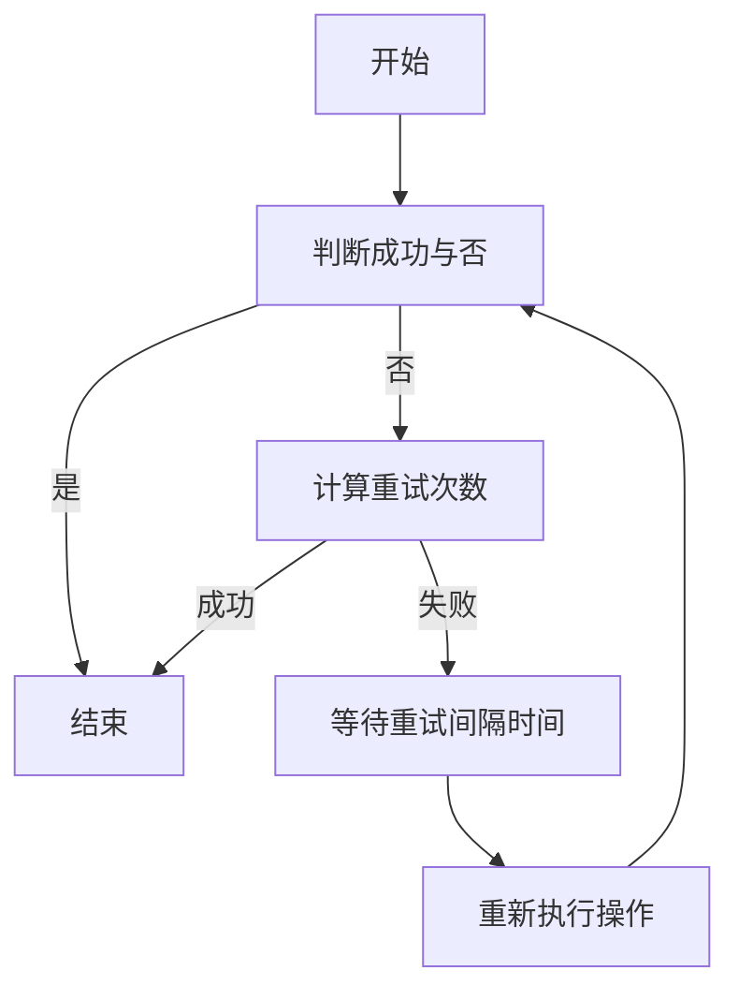

                 

# 重试机制：提高系统可靠性的常用手段

> 关键词：重试机制，系统可靠性，算法设计，应用场景，优化策略

> 摘要：本文将深入探讨重试机制在提高系统可靠性方面的作用。首先，我们将介绍重试机制的基础理论和核心概念，然后逐步分析其工作原理、数学模型和算法设计。接着，我们将详细阐述重试机制在不同应用场景中的具体实现，以及如何通过优化策略提升其效果。最后，本文将总结最佳实践和注意事项，以期为读者提供全面的技术指导。

### 目录大纲

1. **第一部分：重试机制的基础理论**
   - **第1章：重试机制概述**
     - **1.1 问题背景**
     - **1.2 问题描述**
     - **1.3 边界与外延**
     - **1.4 概念结构与核心要素组成**
   - **第2章：重试机制的原理**
     - **2.1 核心概念**
       - **2.1.1 重试机制的定义**
       - **2.1.2 重试机制的目的**
     - **2.2 工作原理**
       - **2.2.1 重试次数与间隔时间**
       - **2.2.2 重试条件**
     - **2.3 重试策略**
       - **2.3.1 顺序重试**
       - **2.3.2 并行重试**
   - **第3章：重试机制的数学模型**
     - **3.1 数学模型**
       - **3.1.1 重试成功的概率**
       - **3.1.2 重试次数的期望**
     - **3.2 数学公式**
       - **3.2.1 概率公式**
       - **3.2.2 期望公式**
   - **第4章：重试机制的算法设计**
     - **4.1 算法原理**
       - **4.1.1 算法概述**
       - **4.1.2 算法流程**
     - **4.2 Mermaid流程图**
       - **4.2.1 流程图绘制**
       - **4.2.2 流程图解析**
     - **4.3 Python源代码**
       - **4.3.1 源代码实现**
       - **4.3.2 代码解析**
   - **第5章：重试机制的应用场景**
     - **5.1 应用场景**
       - **5.1.1 网络通信**
       - **5.1.2 数据库操作**
       - **5.1.3 云计算服务**
     - **5.2 应用实例**
       - **5.2.1 实例1：网络通信中的重试机制**
       - **5.2.2 实例2：数据库操作中的重试机制**
       - **5.2.3 实例3：云计算服务中的重试机制**
   - **第6章：重试机制的优化策略**
     - **6.1 优化目标**
     - **6.2 优化方法**
       - **6.2.1 适应性调整**
       - **6.2.2 预测性重试**
       - **6.2.3 负载均衡**
   - **第7章：重试机制在系统可靠性中的重要性**
     - **7.1 系统可靠性**
     - **7.2 重试机制的作用**
     - **7.3 重试机制与系统可靠性的关系**
   - **第8章：最佳实践与注意事项**
     - **8.1 最佳实践**
     - **8.2 注意事项**
     - **8.3 拓展阅读**

## 1. 重试机制概述

### 1.1 问题背景

在计算机系统中，由于各种不可预测的因素，如网络波动、服务器故障、数据库连接超时等，可能导致某些操作无法立即成功。这种情况下，简单的放弃尝试可能会导致用户体验下降，系统功能不完整。因此，引入重试机制成为一种提高系统可靠性的常用手段。

### 1.2 问题描述

重试机制的目的是在遇到错误或异常时，自动重新执行某项操作，以提高系统的成功率和稳定性。其核心问题是如何合理地设置重试次数、重试间隔和重试条件，以保证在尽可能减少系统负担的同时，提高操作的成功率。

### 1.3 问题解决

通过合理的重试机制设计，可以在一定程度上解决上述问题。重试机制不仅能够提高系统的成功率和稳定性，还能够减少人为干预，提高系统的自动化程度。

### 1.4 边界与外延

重试机制的边界主要包括以下几个方面：
- **重试次数**：不能无限重试，否则可能会浪费过多资源，甚至陷入死循环。
- **重试间隔**：过短的重试间隔可能导致系统负担过重，过长的重试间隔可能影响用户体验。
- **重试条件**：需要根据具体应用场景，设定合理的重试条件，如网络连接失败、数据库操作超时等。

重试机制的外延则包括多种策略，如顺序重试、并行重试、适应性调整和预测性重试等。

### 1.5 概念结构与核心要素组成

重试机制的核心概念包括：
- **重试次数**：指重试操作的次数上限。
- **重试间隔**：指两次重试操作之间的时间间隔。
- **重试条件**：指触发重试的操作失败条件。

这些核心要素共同构成了重试机制的基本结构，并在实际应用中发挥关键作用。

## 2. 重试机制的原理

### 2.1 核心概念

#### 2.1.1 重试机制的定义

重试机制是一种在遇到错误或异常时，自动重新执行某项操作的技术手段。其目的是在尽可能减少系统负担的同时，提高操作的成功率。

#### 2.1.2 重试机制的目的

重试机制的主要目的是提高系统的可靠性，包括：
- 减少因网络波动、服务器故障等原因导致的操作失败。
- 提高系统的自动化程度，减少人工干预。
- 提高用户体验，确保系统功能正常运行。

### 2.2 工作原理

#### 2.2.1 重试次数与间隔时间

重试次数和间隔时间是重试机制的两个关键参数。合理的重试次数和间隔时间可以提高操作的成功率，减少系统负担。

- **重试次数**：通常根据具体应用场景和操作特点进行设置。例如，对于网络通信操作，可能设置为3次；对于数据库操作，可能设置为5次。

- **间隔时间**：通常采用指数退避算法，即每次重试的时间间隔逐渐增加。例如，初始间隔为1秒，第二次为2秒，第三次为4秒。

#### 2.2.2 重试条件

重试条件是触发重试的关键。常见的重试条件包括：
- 网络连接失败：如TCP连接建立失败、HTTP请求超时等。
- 数据库操作超时：如SQL查询超时、事务提交失败等。
- 服务不可用：如API调用失败、服务端返回错误等。

#### 2.2.3 重试策略

重试策略主要包括顺序重试和并行重试。

- **顺序重试**：按照顺序逐个尝试，直到成功或达到重试次数上限。优点是简单易懂，缺点是效率较低，可能需要较长时间才能成功。

- **并行重试**：同时尝试多个操作，直到成功或达到重试次数上限。优点是效率较高，缺点是可能增加系统负担。

## 3. 重试机制的数学模型

### 3.1 数学模型

#### 3.1.1 重试成功的概率

重试成功的概率取决于重试次数、重试间隔和重试条件。假设每次重试成功的概率为$p$，则$n$次重试成功的概率为：

$$ P(\text{成功}) = 1 - (1 - p)^n $$

#### 3.1.2 重试次数的期望

重试次数的期望表示平均需要重试多少次才能成功。根据大数定律，当重试次数足够多时，成功概率将趋近于$p$。因此，重试次数的期望为：

$$ E(\text{重试次数}) = \frac{1}{p} $$

### 3.2 数学公式

#### 3.2.1 概率公式

$$ P(\text{成功}) = 1 - (1 - p)^n $$

#### 3.2.2 期望公式

$$ E(\text{重试次数}) = \frac{1}{p} $$

## 4. 重试机制的算法设计

### 4.1 算法原理

#### 4.1.1 算法概述

重试机制的算法设计主要包括以下步骤：

1. 判断操作是否成功，若成功，则结束；若失败，则进入下一步。
2. 计算当前重试次数，若达到重试次数上限，则结束；否则，进入下一步。
3. 等待重试间隔时间，然后重新执行操作。

#### 4.1.2 算法流程



### 4.2 Mermaid流程图

#### 4.2.1 流程图绘制


#### 4.2.2 流程图解析

该流程图描述了重试机制的基本算法流程，包括判断操作是否成功、计算重试次数、等待重试间隔时间和重新执行操作等步骤。通过这个流程图，可以直观地了解重试机制的工作原理。

### 4.3 Python源代码

#### 4.3.1 源代码实现

```python
import time
import random

def retry_operation(success_rate, max_retries):
    retries = 0
    while retries < max_retries:
        if random.random() < success_rate:
            return "操作成功"
        retries += 1
        time.sleep(random.expovariate(1 / retries))
    return "操作失败"

success_rate = 0.5
max_retries = 5
result = retry_operation(success_rate, max_retries)
print(result)
```

#### 4.3.2 代码解析

1. **导入模块**：导入`time`和`random`模块，用于处理时间和随机数。
2. **定义函数**：`retry_operation`函数，接受成功率和最大重试次数作为参数。
3. **重试循环**：使用`while`循环进行重试，直到达到最大重试次数或成功。
4. **判断成功与否**：使用`random.random()`判断操作是否成功，成功则返回“操作成功”，否则继续重试。
5. **等待重试间隔**：使用`time.sleep`等待重试间隔时间，采用指数退避算法，即每次重试的时间间隔逐渐增加。

## 5. 重试机制的应用场景

### 5.1 应用场景

重试机制广泛应用于各种计算机系统和应用场景，主要包括：

- **网络通信**：如HTTP请求、TCP连接等。
- **数据库操作**：如SQL查询、事务提交等。
- **云计算服务**：如API调用、服务端响应等。

### 5.2 应用实例

#### 5.2.1 实例1：网络通信中的重试机制

在HTTP请求中，如果请求失败，可以通过重试机制重新发送请求，以提高成功率。

```python
import requests

def http_request(url, max_retries=3):
    retries = 0
    while retries < max_retries:
        try:
            response = requests.get(url)
            response.raise_for_status()
            return response
        except requests.exceptions.RequestException as e:
            print(f"请求失败，重试次数：{retries}")
            retries += 1
            time.sleep(random.randint(1, 3))
    return None

url = "http://example.com"
response = http_request(url)
if response:
    print("请求成功")
else:
    print("请求失败")
```

#### 5.2.2 实例2：数据库操作中的重试机制

在数据库操作中，如果查询失败，可以通过重试机制重新执行查询，以提高成功率。

```python
import sqlite3

def execute_query(conn, query, max_retries=3):
    retries = 0
    while retries < max_retries:
        try:
            cursor = conn.cursor()
            cursor.execute(query)
            conn.commit()
            return "操作成功"
        except sqlite3.Error as e:
            print(f"查询失败，重试次数：{retries}")
            retries += 1
            time.sleep(random.randint(1, 3))
    return "操作失败"

conn = sqlite3.connect("example.db")
query = "SELECT * FROM users WHERE id = 1"
result = execute_query(conn, query)
print(result)
```

#### 5.2.3 实例3：云计算服务中的重试机制

在云计算服务中，如API调用失败，可以通过重试机制重新调用API，以提高成功率。

```python
import requests

def api_call(url, max_retries=3):
    retries = 0
    while retries < max_retries:
        try:
            response = requests.post(url, json={"key": "value"})
            response.raise_for_status()
            return response.json()
        except requests.exceptions.RequestException as e:
            print(f"API调用失败，重试次数：{retries}")
            retries += 1
            time.sleep(random.randint(1, 3))
    return None

url = "https://example.com/api"
result = api_call(url)
if result:
    print("API调用成功")
else:
    print("API调用失败")
```

## 6. 重试机制的优化策略

### 6.1 优化目标

优化重试机制的目的是提高系统可靠性，同时减少系统负担。具体优化目标包括：

- 减少重试次数，提高操作成功率。
- 减少系统负担，避免过度重试。
- 提高用户体验，减少等待时间。

### 6.2 优化方法

#### 6.2.1 适应性调整

适应性调整是指根据实际情况动态调整重试策略，以提高成功率。例如，可以根据网络的稳定性动态调整重试间隔时间，或者在负载高峰期增加重试次数。

#### 6.2.2 预测性重试

预测性重试是指根据历史数据和算法预测未来操作的成功率，提前进行重试。例如，可以使用机器学习算法预测下一次操作的成功率，并提前重试。

#### 6.2.3 负载均衡

负载均衡是指将操作分散到多个节点或服务器上，以避免单点故障。通过负载均衡，可以减少单个节点的负担，提高系统的整体可靠性。

## 7. 重试机制在系统可靠性中的重要性

### 7.1 系统可靠性

系统可靠性是指系统在规定的时间内，按照规定的性能指标正常运行的能力。重试机制在提高系统可靠性方面具有重要作用，包括：

- 减少操作失败率，提高系统稳定性。
- 提高用户体验，减少等待时间。
- 降低系统负担，提高资源利用率。

### 7.2 重试机制的作用

重试机制的作用主要包括：

- **提高操作成功率**：通过重试机制，可以降低操作失败率，提高系统的成功率。
- **减少人为干预**：自动化的重试机制可以减少人工干预，提高系统的自动化程度。
- **提升用户体验**：通过合理的重试策略，可以缩短用户等待时间，提高用户体验。

### 7.3 重试机制与系统可靠性的关系

重试机制与系统可靠性密切相关。合理的重试机制可以提高系统的成功率和稳定性，降低操作失败率，从而提高系统的可靠性。同时，优化重试机制，如适应性调整、预测性重试和负载均衡，可以进一步提升系统的可靠性。

## 8. 最佳实践与注意事项

### 8.1 最佳实践

1. 根据应用场景和操作特点，合理设置重试次数和重试间隔。
2. 使用指数退避算法动态调整重试间隔时间。
3. 根据实际情况，采用适应性调整和预测性重试策略。
4. 在负载高峰期，适当增加重试次数和重试间隔。
5. 结合负载均衡，分散操作到多个节点或服务器。

### 8.2 注意事项

1. 避免无限重试，防止资源浪费和死循环。
2. 适当设置重试次数和重试间隔，避免影响用户体验。
3. 根据操作特点，选择合适的重试策略。
4. 监控重试机制的性能和效果，及时进行调整。

### 8.3 拓展阅读

1. 《高性能MySQL》 - 对于数据库操作中的重试机制，提供了详细的讨论和实践。
2. 《大规模分布式系统设计》 - 对于云计算服务中的重试机制，提供了丰富的案例和策略。
3. 《概率论与数理统计》 - 对于重试机制的数学模型和概率计算，提供了理论基础。

---

**作者：AI天才研究院/AI Genius Institute & 禅与计算机程序设计艺术 /Zen And The Art of Computer Programming**

