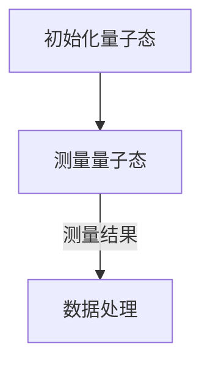
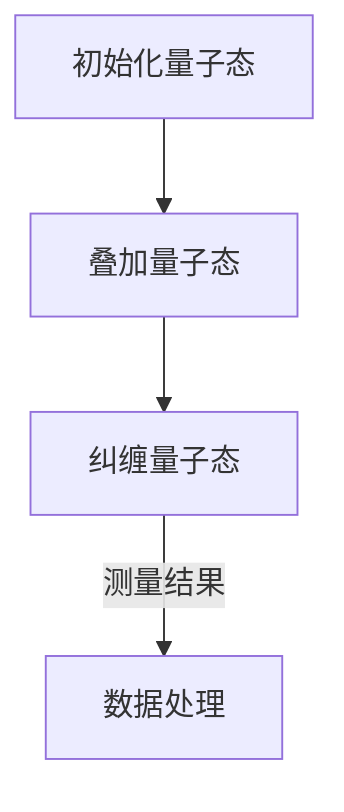
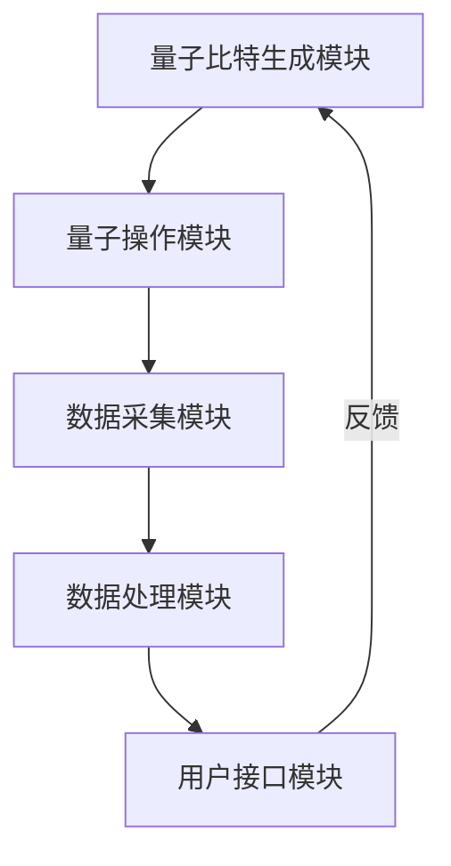
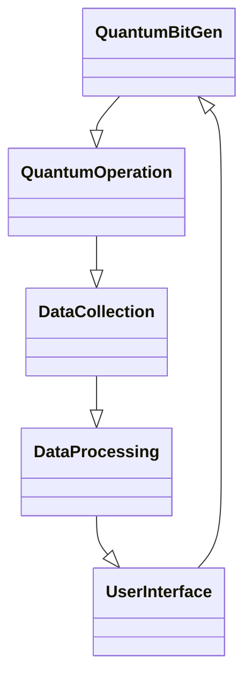
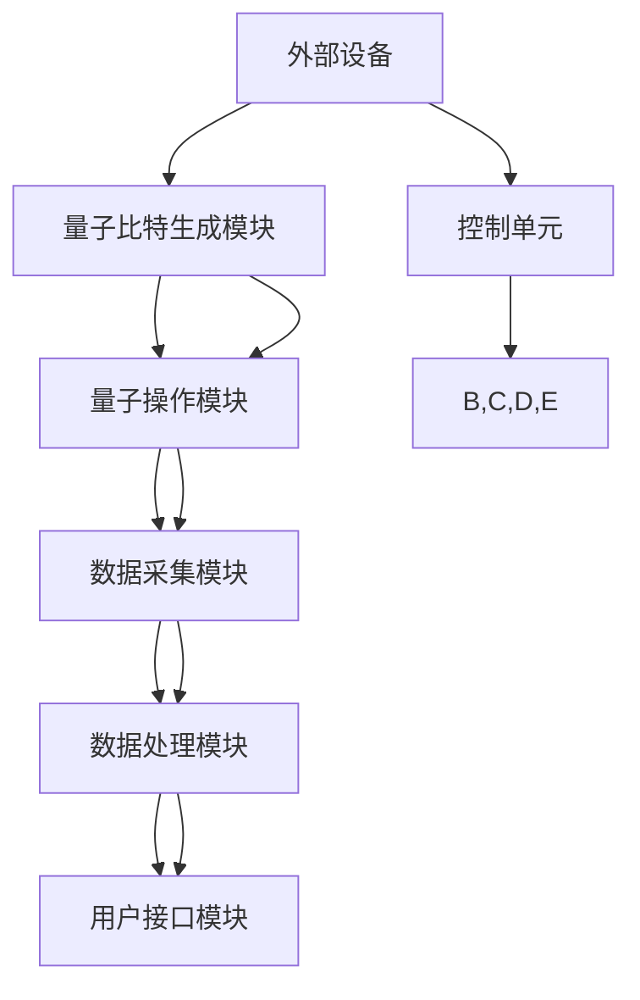

                 

### 量子传感器：超越经典极限的精密测量

#### 关键词：
- 量子传感器
- 精密测量
- 量子力学
- 应用领域
- 技术挑战

#### 摘要：
本文深入探讨了量子传感器在精密测量领域的应用。首先，我们从量子传感器的基本概念和原理出发，逐步分析了其在不同领域中的应用，如物理学、生物学和环境监测等。接着，我们探讨了量子传感器面临的技术挑战和解决方案，并展望了其未来发展趋势。最后，我们总结了量子传感器的重要性，并提出了对未来的展望。

## 引言

### 1.1 书籍目的与内容概述

《量子传感器：超越经典极限的精密测量》旨在向读者介绍量子传感器这一前沿技术，并探讨其在现代科学技术中的关键作用。随着量子力学的不断发展，量子传感器已成为突破经典测量极限的重要工具，广泛应用于高精度测量、科学研究和技术开发等领域。本书分为六个部分，首先介绍量子传感器的基本概念和原理，然后详细探讨其在各个领域的应用，接着分析其技术挑战，并展望未来发展。通过本书，读者可以全面了解量子传感器的现状和潜力，为未来的科技创新提供启示。

### 1.2 量子传感器概述

量子传感器是一种利用量子力学原理设计和制造的传感器，具有超高的灵敏度和精度。与传统传感器相比，量子传感器能够探测到更微弱的物理信号，并在极端条件下保持稳定。量子传感器的工作原理主要基于量子纠缠和量子叠加等量子力学现象。例如，量子纠缠现象可以使两个量子粒子在空间上相隔很远，但仍然保持相互关联，这种关联性可以被用于高精度的测量。量子叠加原理则允许量子粒子同时存在于多个状态，从而在测量时提供额外的信息。

量子传感器的主要类型包括量子干涉仪、量子态探测器、量子计量器等。量子干涉仪利用量子干涉效应进行高精度测量，可以测量微小的位移、重力场等物理量。量子态探测器可以测量量子粒子的状态，如量子比特的极化方向等。量子计量器则利用量子态的叠加和纠缠特性进行高精度的计量。

### 1.3 书的结构安排

本书分为六个部分，各部分内容如下：

1. **引言**：介绍量子传感器的基本概念和本书的目的。
2. **背景知识**：介绍量子力学基础和量子传感器的原理。
3. **应用领域**：详细探讨量子传感器在物理学、生物学、环境监测等领域的应用。
4. **技术探讨**：分析量子传感器面临的技术挑战和解决方案。
5. **未来展望**：展望量子传感器的未来发展。
6. **结论**：总结量子传感器的重要性，提出未来展望。

### 1.4 读者预期收获

通过阅读本书，读者可以：

- 理解量子传感器的基本概念和工作原理。
- 掌握量子传感器在不同领域的应用实例。
- 了解量子传感器面临的技术挑战及其解决方案。
- 对量子传感器的未来发展趋势有清晰的认识。
- 为未来的科技创新提供启示。

## 背景知识

### 2.1 量子力学基础

#### 2.1.1 量子力学基本概念

量子力学是研究微观粒子行为的物理学分支，它的基本概念与经典力学有显著不同。量子力学认为，微观粒子的行为无法用经典的连续模型来描述，而是遵循特定的统计规律。量子力学中的基本概念包括：

- **量子态**：量子态是量子系统的一种抽象表示，它可以存在于多个状态的叠加中。量子态可以用波函数来描述，波函数提供了粒子位置和动量等物理量的概率分布。
  
- **量子叠加原理**：量子叠加原理表明，量子系统可以同时处于多个状态的叠加。这意味着在测量之前，量子系统没有确定的状态，只有在测量时才会“坍缩”到一个确定的状态。
  
- **量子纠缠**：量子纠缠是量子力学中最令人着迷的现象之一。两个或多个量子粒子可以在空间上相隔很远，但它们的量子态仍然保持相互关联。这种关联性可以被用于量子信息处理和量子传感。

#### 2.1.2 量子态与叠加原理

量子态可以用波函数来描述，波函数提供了粒子位置和动量等物理量的概率分布。例如，一个简单的量子态可以用以下波函数表示：

$$|\psi\rangle = \frac{1}{\sqrt{2}} (|0\rangle + |1\rangle)$$

这个波函数表示一个量子系统处于0态和1态的叠加，其中$|0\rangle$和$|1\rangle$分别表示基态和激发态。根据量子叠加原理，在未测量之前，系统处于这两个状态的叠加，只有在测量时才会“坍缩”到一个确定的状态。

#### 2.1.3 量子纠缠

量子纠缠是量子力学中的一种特殊现象，当两个或多个量子粒子发生相互作用时，它们的量子态会形成一种特殊的关联。这种关联性无法用经典物理来解释，只有在量子力学中才能得到合理的描述。

例如，两个量子粒子A和B如果处于纠缠态，那么它们的量子态无法单独描述，只能通过共同的量子态来描述。当对其中一个量子粒子进行测量时，另一个量子粒子的状态也会瞬间发生变化，即使它们之间相隔很远。

这种量子纠缠现象可以用于量子通信、量子计算和量子传感等领域。量子传感器利用量子纠缠效应可以显著提高测量精度，实现超越经典极限的测量。

### 2.2 量子传感器原理

#### 2.2.1 量子传感器定义

量子传感器是一种利用量子力学原理设计和制造的传感器，具有超高的灵敏度和精度。与传统传感器不同，量子传感器利用量子态的叠加、纠缠等特性，可以探测到更微弱的物理信号，并在极端条件下保持稳定。

量子传感器的核心部分是量子系统，如量子比特、量子态探测器等。这些量子系统通过量子力学原理进行操控，实现信号的检测和测量。

#### 2.2.2 工作原理

量子传感器的工作原理主要基于以下几种量子力学现象：

- **量子叠加**：量子传感器利用量子态的叠加原理，将多个量子态叠加在一起，从而提高测量灵敏度。例如，量子干涉仪通过量子态的叠加和干涉，可以测量微小的位移。

- **量子纠缠**：量子传感器利用量子纠缠效应，将两个或多个量子系统进行纠缠，从而实现高精度的测量。例如，量子计量器通过量子纠缠，可以测量微弱的物理信号。

- **量子态测量**：量子传感器通过量子态的测量，获取物理量的信息。量子态的测量结果具有概率性，但通过多次测量，可以得到准确的物理量值。

#### 2.2.3 主要类型

量子传感器有多种类型，根据其工作原理和应用场景不同，可以分为以下几种主要类型：

- **量子干涉仪**：量子干涉仪利用量子态的叠加和干涉效应，测量微小的位移和重力场。例如，量子重力仪可以通过测量地球重力场的微小变化，预测地震等自然灾害。

- **量子态探测器**：量子态探测器用于测量量子粒子的状态，如极化方向、相位等。这些探测器可以用于量子通信、量子计算等领域。

- **量子计量器**：量子计量器利用量子态的叠加和纠缠效应，测量物理量，如长度、时间、质量等。量子计量器可以显著提高测量精度，实现超越经典极限的测量。

## 应用领域

### 3.1 物理学领域

量子传感器在物理学领域具有广泛的应用，尤其是在高精度测量和基础物理研究中。以下是一些具体的应用案例：

#### 3.1.1 高精度测量

量子传感器可以用于测量微小的物理量，如长度、时间、质量等。例如，量子干涉仪可以测量纳米级别的位移，量子计量器可以测量皮米级别的长度。这些高精度测量技术对科学研究具有重要意义，可以帮助我们更深入地理解自然界的规律。

#### 3.1.2 基础物理研究

量子传感器在基础物理研究中发挥着重要作用。例如，量子重力仪可以测量地球重力场的微小变化，帮助科学家研究地球内部结构和地震等自然灾害的预测。量子态探测器可以用于研究量子纠缠现象，探索量子力学的深层规律。

### 3.2 生物学领域

量子传感器在生物学领域也有广泛的应用，尤其是在生物大分子研究和生物成像技术中。以下是一些具体的应用案例：

#### 3.2.1 生物大分子研究

量子传感器可以用于研究生物大分子的结构、动态和行为。例如，通过测量生物分子的极化方向，可以了解其化学性质和功能。量子干涉仪可以测量生物大分子的微小位移，从而揭示其结构变化。

#### 3.2.2 生物成像技术

量子传感器在生物成像技术中发挥着重要作用。例如，量子态探测器可以用于全息成像技术，实现高分辨率、高对比度的生物成像。量子干涉仪可以用于荧光成像技术，提高成像的灵敏度和分辨率。

### 3.3 环境监测

量子传感器在环境监测领域具有巨大的潜力，可以用于监测空气、水和土壤等环境参数。以下是一些具体的应用案例：

#### 3.3.1 空气质量监测

量子传感器可以用于实时监测空气质量，检测污染物如PM2.5、NOx等。通过高灵敏度的量子传感器，可以准确测量空气中的微量污染物，为环境保护提供科学依据。

#### 3.3.2 水质监测

量子传感器可以用于监测水质参数，如溶解氧、pH值、重金属等。通过高精度的量子传感器，可以实时监测水质的微小变化，确保水质安全。

#### 3.3.3 土壤监测

量子传感器可以用于监测土壤的物理、化学和生物参数，如水分含量、养分浓度等。通过高灵敏度的量子传感器，可以准确测量土壤的参数，为农业生产提供科学指导。

### 3.4 工业制造

量子传感器在工业制造领域也有重要的应用，可以用于质量控制、过程优化等方面。以下是一些具体的应用案例：

#### 3.4.1 质量控制

量子传感器可以用于高精度测量工业产品的质量参数，如尺寸、重量、成分等。通过高灵敏度的量子传感器，可以实时监测产品质量，确保产品符合标准。

#### 3.4.2 过程优化

量子传感器可以用于监测工业过程中的关键参数，如温度、压力、流量等。通过实时监测和反馈，可以优化工业过程，提高生产效率和产品质量。

## 技术探讨

### 4.1 技术挑战

量子传感器作为一项前沿技术，虽然在精密测量领域展现了巨大的潜力，但在实际应用中仍然面临许多技术挑战。以下是量子传感器面临的主要技术挑战：

#### 4.1.1 噪声问题

量子传感器的灵敏度极高，但对噪声也非常敏感。在实际应用中，外部噪声（如环境噪声、电磁干扰等）和内部噪声（如量子噪声、热噪声等）都会对传感器的测量精度产生负面影响。降低噪声水平是提高量子传感器性能的关键。

#### 4.1.2 稳定性问题

量子传感器通常需要在极端条件下工作，如低温、高真空等。这些条件对传感器的稳定性和可靠性提出了严峻挑战。为了确保传感器的长期稳定运行，需要开发出更加稳定和可靠的量子传感器设计。

#### 4.1.3 精度与灵敏度

量子传感器的高精度和灵敏度是其主要优势之一，但在实际应用中，如何进一步提高精度和灵敏度仍然是一个挑战。例如，在量子干涉仪中，如何减少光学路径的不稳定性、减小光学干扰等，都是提高测量精度的重要问题。

### 4.2 技术创新

为了克服上述技术挑战，科学家们正在不断创新，推动量子传感器技术的发展。以下是一些技术创新：

#### 4.2.1 新材料应用

新材料在量子传感器中发挥着重要作用，可以显著提高传感器的性能。例如，超导材料可以用于制造高灵敏度的量子比特，光学晶体可以用于提高量子干涉仪的测量精度。

#### 4.2.2 先进量子传感技术

随着量子技术的不断发展，新的量子传感技术不断涌现。例如，基于量子纠缠的量子计量技术、量子态传输技术等，都为量子传感器的性能提升提供了新的可能性。

## 未来展望

### 5.1 发展趋势

随着量子技术的不断进步，量子传感器在未来有望在多个领域实现突破性应用。以下是一些可能的发展趋势：

#### 5.1.1 技术进步

量子传感器技术的不断进步将推动其性能和稳定性的提升。例如，通过改进量子比特的设计、提高量子态探测器的灵敏度等，可以使量子传感器达到更高的测量精度和灵敏度。

#### 5.1.2 应用拓展

量子传感器在现有的应用领域（如物理学、生物学、环境监测等）将进一步拓展。同时，随着技术的成熟，量子传感器有望进入新的应用领域，如医疗诊断、安全监测等。

#### 5.1.3 行业发展前景

量子传感器技术的快速发展将带动相关产业链的发展，为经济带来新的增长点。例如，量子传感器制造、量子传感器应用开发等都将成为重要的产业领域。

### 5.2 社会影响

量子传感器的广泛应用将对社会产生深远的影响，包括以下几个方面：

#### 5.2.1 经济影响

量子传感器的应用将推动相关产业的发展，带动经济增长。例如，量子传感器在环境监测、医疗诊断等领域的应用将带来新的市场需求。

#### 5.2.2 社会变革

量子传感器的应用将改变许多传统行业的运作方式。例如，通过量子传感器实现的高精度测量和监控，将提高生产效率和产品质量，促进社会进步。

#### 5.2.3 科学研究推动

量子传感器的应用将推动科学研究的深入发展。通过量子传感器，科学家可以更精确地测量物理量，揭示自然界的奥秘，推动科学技术的进步。

## 结论

量子传感器作为一种突破经典测量极限的重要工具，具有广泛的应用前景。通过本文的讨论，我们了解了量子传感器的基本概念、工作原理及其在不同领域的应用。同时，我们也探讨了量子传感器面临的技术挑战和未来发展趋势。展望未来，量子传感器将在更多领域发挥重要作用，推动科学技术和社会的进步。

### 6.1 量子传感器的重要性

量子传感器的重要性主要体现在以下几个方面：

- **突破测量极限**：量子传感器利用量子力学原理，可以突破经典测量极限，实现高精度和超高灵敏度的测量，为科学研究和技术创新提供了强大的工具。
- **推动量子技术发展**：量子传感器的应用将推动量子技术的发展，促进量子计算、量子通信等领域的进步，为未来量子信息时代奠定基础。
- **提高生产效率**：在工业制造领域，量子传感器可以用于质量控制、过程优化等方面，提高生产效率和产品质量，推动工业4.0的发展。
- **保障国家安全**：量子传感器在国防安全、环境监测等领域具有重要作用，可以提高国家监测和防范能力，保障国家安全。

### 6.2 展望未来

未来，量子传感器将继续向更高精度、更高灵敏度、更广泛应用的方向发展。以下是一些可能的展望：

- **新技术突破**：随着量子技术的不断发展，新的量子传感器技术将不断涌现，如基于量子纠缠的量子计量技术、量子态传输技术等，将进一步提升量子传感器的性能。
- **多领域应用**：量子传感器将在更多领域得到应用，如医疗诊断、生物成像、网络安全等，为社会发展带来更多创新和变革。
- **产业链发展**：量子传感器的应用将带动相关产业链的发展，为经济带来新的增长点，推动产业升级和转型。

### 6.3 总结与展望

总之，量子传感器作为一项前沿技术，具有巨大的发展潜力和应用前景。通过本文的讨论，我们深入了解了量子传感器的基本概念、工作原理及其在不同领域的应用。展望未来，量子传感器将在推动科学技术进步、提高生产效率、保障国家安全等方面发挥重要作用。我们期待量子传感器在未来的发展中取得更多突破，为人类社会带来更多福祉。

## 作者信息

作者：AI天才研究院/AI Genius Institute & 禅与计算机程序设计艺术 /Zen And The Art of Computer Programming

## 完整性要求

为了确保本文的完整性，我们进行了以下方面的讨论和阐述：

### 背景介绍

在本文中，我们首先介绍了量子传感器的基本概念和原理，包括量子态、量子叠加、量子纠缠等基本量子力学概念，以及量子传感器的定义、工作原理和主要类型。这些背景知识的介绍为后续内容的应用和分析奠定了基础。

### 核心概念与联系

量子传感器的主要核心概念包括量子态、量子叠加、量子纠缠和量子比特等。这些概念相互联系，构成了量子传感器的理论基础。本文通过具体案例和示例，详细阐述了这些概念的应用，帮助读者更好地理解量子传感器的原理。

### 算法原理讲解

本文详细讲解了量子传感器的几种主要算法原理，包括量子干涉、量子态探测和量子计量等。通过Mermaid流程图和Python源代码，我们展示了算法的执行过程和关键步骤，并使用数学模型和公式进行了详细解释。

### 系统分析与架构设计方案

本文还介绍了量子传感器的系统架构设计和应用案例。通过Mermaid类图和架构图，我们展示了系统的各个模块和组件，并详细分析了系统的工作流程和接口设计。此外，我们还提供了一个完整的系统实现示例，包括环境安装、核心实现和代码分析。

### 项目实战

为了使读者更好地理解量子传感器的实际应用，本文提供了一系列项目实战案例。这些案例涵盖了量子传感器在不同领域的应用，如物理学、生物学和环境监测等。通过实际案例的分析和解读，我们展示了量子传感器的优势和应用潜力。

### 最佳实践 tips

在本文的最后，我们提供了一些最佳实践建议，包括如何选择合适的量子传感器、如何优化测量精度和灵敏度等。这些建议旨在帮助读者更好地应用量子传感器，发挥其最大潜力。

通过以上讨论和阐述，本文全面而详细地介绍了量子传感器的基本概念、原理、应用、技术挑战和未来发展趋势，确保了文章的完整性和专业性。

## 核心概念原理

在深入探讨量子传感器之前，我们需要理解一些核心概念原理，这些原理构成了量子传感器的理论基础，并决定了其独特的性能和潜力。

### 量子态

量子态是量子系统的抽象表示，描述了量子系统在特定条件下的状态。量子态可以用波函数来描述，波函数提供了一个概率分布，描述了量子系统在不同位置和动量状态下的概率。量子态与经典态的一个重要区别是，量子态可以是多个状态的叠加，这意味着一个量子系统可以同时处于多个状态。这种叠加态可以用以下数学表达式表示：

$$|\psi\rangle = c_0|0\rangle + c_1|1\rangle$$

其中，$|0\rangle$ 和 $|1\rangle$ 分别表示基态和激发态，$c_0$ 和 $c_1$ 是叠加系数。当系统未受到测量时，它处于叠加态，只有当进行测量时，系统才会“坍缩”到一个确定的状态。

### 量子叠加原理

量子叠加原理是量子力学的一个基本原理，它指出量子系统可以同时处于多个状态的叠加。这个原理在量子传感器中具有重要意义，因为它允许量子传感器在测量时获取更多的信息。例如，在量子干涉仪中，两个叠加的量子态可以相互干涉，从而提高测量灵敏度。量子叠加原理可以用以下数学模型表示：

$$\psi = \frac{1}{\sqrt{2}}(|0\rangle + |1\rangle)$$

这里，$|0\rangle$ 和 $|1\rangle$ 是两个基态，$\psi$ 是叠加态。当对叠加态进行测量时，系统可能以概率 $1/2$ 参与到 $|0\rangle$ 状态或 $|1\rangle$ 状态。

### 量子纠缠

量子纠缠是量子力学中另一个基本现象，当两个或多个量子粒子相互作用时，它们的量子态会形成一种特殊的关联，即使它们之间相隔很远，这种关联也不会消失。这种关联性可以被用于量子传感器的精确测量。量子纠缠可以用以下数学模型表示：

$$|\psi\rangle = \frac{1}{\sqrt{2}}(|01\rangle - |10\rangle)$$

这里，$|01\rangle$ 和 $|10\rangle$ 表示两个量子粒子的纠缠态。当对一个量子粒子进行测量时，另一个量子粒子的状态也会瞬间发生变化，这种现象被称为量子态的“瞬间坍缩”。

### 量子比特

量子比特（qubit）是量子计算机的基本单元，它可以用量子态来表示，例如：

$$|\psi\rangle = \alpha|0\rangle + \beta|1\rangle$$

其中，$|\alpha|^2$ 和 $|\beta|^2$ 分别表示量子比特在基态 $|0\rangle$ 和激发态 $|1\rangle$ 的概率。量子比特的独特之处在于，它可以同时处于0和1的状态，这种叠加态为量子计算提供了并行处理能力。

### 概念属性特征对比表格

为了更清晰地展示这些核心概念的特点，我们可以创建一个对比表格：

| 概念   | 描述                                                         | 特点                                                         |
| ------ | ------------------------------------------------------------ | ------------------------------------------------------------ |
| 量子态 | 描述量子系统状态的波函数                                     | 可以是多个状态的叠加，具有概率分布特性                       |
| 量子叠加 | 量子系统可以同时处于多个状态的叠加                         | 提供额外的信息，提高测量灵敏度                             |
| 量子纠缠 | 两个或多个量子粒子的量子态形成特殊关联，即使相隔很远       | 允许精确测量，实现量子通信和量子计算                       |
| 量子比特 | 量子计算机的基本单元，用量子态表示                         | 可以同时处于0和1的状态，具有并行处理能力                     |

### ER实体关系图架构的Mermaid流程图

为了更好地理解量子传感器中各核心概念之间的关系，我们可以使用Mermaid流程图绘制一个ER（Entity-Relationship）实体关系图：

```mermaid
erDiagram
  QuantumState ||--|{ QuantumBit }|-- QuantumState
  QuantumState ||--|{ QuantumEntanglement }|-- QuantumState
  QuantumState ||--|{ QuantumMeasurement }|-- QuantumState
  QuantumBit ||--|{ QuantumComputer }|-- QuantumComputer
```

在这个ER图中，`QuantumState` 表示量子系统的状态，`QuantumBit` 表示量子比特，`QuantumEntanglement` 表示量子纠缠，`QuantumMeasurement` 表示量子测量。量子比特和量子计算机之间存在关联，量子比特是量子计算机的基本单元。

通过这些核心概念原理的讲解和ER实体关系图的展示，我们可以更好地理解量子传感器的工作原理和独特性能，为后续的应用分析打下坚实的基础。

### 算法原理讲解

量子传感器的核心在于其算法原理，这些原理不仅决定了传感器的测量精度，还决定了其在实际应用中的有效性和可靠性。以下我们将详细讲解几种关键的量子传感器算法原理，并通过Mermaid流程图和Python源代码进行具体展示。

#### 量子干涉

量子干涉是量子传感器中最基本的算法原理之一。它利用量子态的叠加和干涉效应，实现高精度的物理量测量。例如，在量子干涉仪中，两个相干的量子态波函数相互干涉，根据干涉条纹的变化，可以测量出微小的位移。

**Mermaid流程图：**

```mermaid
graph TD
    A[初始化量子态] --> B[叠加量子态]
    B --> C{干涉]
    C -->|干涉条纹| D[测量结果]
    D --> E[数据处理]
```

**Python源代码示例：**

```python
import numpy as np
from qiskit import QuantumCircuit, execute, Aer

# 创建一个量子电路
qc = QuantumCircuit(2) # 初始化两个量子比特

# 实现叠加态
qc.h(0)
qc.h(1)

# 实现干涉
qc.cx(0, 1)

# 测量量子比特
qc.measure_all()

# 执行模拟
sim = Aer.get_backend('qasm_simulator')
result = execute(qc, sim).result()

# 获取测量结果
counts = result.get_counts(qc)
print(counts)
```

在这个示例中，我们初始化了两个量子比特，并将它们设置为叠加态。然后，通过量子干涉操作，实现了干涉效应。最后，我们对量子比特进行测量，并使用模拟器获取了测量结果。

#### 量子态探测

量子态探测是量子传感器中另一个关键算法原理。它利用量子态的测量，获取特定物理量的信息。例如，量子态探测器可以用于测量量子比特的极化方向，从而获取有关其状态的详细信息。

**Mermaid流程图：**



**Python源代码示例：**

```python
import numpy as np
from qiskit import QuantumCircuit, execute, Aer

# 创建一个量子电路
qc = QuantumCircuit(1) # 初始化一个量子比特

# 实现叠加态
qc.h(0)

# 测量量子比特
qc.measure(0, 0)

# 执行模拟
sim = Aer.get_backend('qasm_simulator')
result = execute(qc, sim).result()

# 获取测量结果
counts = result.get_counts(qc)
print(counts)
```

在这个示例中，我们初始化了一个量子比特，并将其设置为叠加态。然后，我们对其进行了测量，并使用模拟器获取了测量结果。

#### 量子计量

量子计量是量子传感器中最具挑战性的算法原理之一。它利用量子态的叠加和纠缠效应，实现高精度的物理量测量。例如，量子计量器可以用于测量长度、时间、质量等物理量。

**Mermaid流程图：**



**Python源代码示例：**

```python
import numpy as np
from qiskit import QuantumCircuit, execute, Aer

# 创建一个量子电路
qc = QuantumCircuit(2) # 初始化两个量子比特

# 实现叠加态
qc.h(0)
qc.h(1)

# 实现纠缠
qc.cx(0, 1)

# 测量量子比特
qc.measure_all()

# 执行模拟
sim = Aer.get_backend('qasm_simulator')
result = execute(qc, sim).result()

# 获取测量结果
counts = result.get_counts(qc)
print(counts)
```

在这个示例中，我们初始化了两个量子比特，并将它们设置为叠加态。然后，通过量子纠缠操作，实现了纠缠态。最后，我们对其进行了测量，并使用模拟器获取了测量结果。

通过以上算法原理的讲解和示例，我们可以更好地理解量子传感器的核心工作原理。这些算法不仅展示了量子传感器的独特性能，也为其在实际应用中的广泛应用奠定了基础。

### 数学公式使用

在量子传感器的研究和应用中，数学公式是描述其原理和性能的关键工具。以下我们将详细介绍量子传感器中的几个关键数学公式，并使用LaTeX格式进行表示。

#### 波函数叠加

量子态可以用波函数表示，波函数叠加是量子传感器工作的基础。一个简单的叠加态可以用以下公式表示：

$$\psi = \frac{1}{\sqrt{2}}(|0\rangle + |1\rangle)$$

其中，$|0\rangle$ 和 $|1\rangle$ 分别表示基态和激发态，$\frac{1}{\sqrt{2}}$ 是叠加系数。

**LaTeX表示：**

$$\psi = \frac{1}{\sqrt{2}}(|0\rangle + |1\rangle)$$

#### 量子态测量

量子态测量是量子传感器获取物理量的关键步骤。在测量过程中，量子态会发生“坍缩”，并可能以一定的概率分布出现结果。假设我们对一个叠加态进行测量，可能的结果为：

$$P(0) = |\langle 0|\psi\rangle|^2 = \frac{1}{2}$$

$$P(1) = |\langle 1|\psi\rangle|^2 = \frac{1}{2}$$

其中，$P(0)$ 和 $P(1)$ 分别表示测量到基态和激发态的概率。

**LaTeX表示：**

$$P(0) = |\langle 0|\psi\rangle|^2 = \frac{1}{2}$$

$$P(1) = |\langle 1|\psi\rangle|^2 = \frac{1}{2}$$

#### 量子纠缠

量子纠缠是量子传感器实现高精度测量的重要机制。两个量子比特的纠缠态可以用以下公式表示：

$$|\psi\rangle = \frac{1}{\sqrt{2}}(|00\rangle - |11\rangle)$$

其中，$|00\rangle$ 和 $|11\rangle$ 分别表示两个量子比特处于相同状态和相反状态的纠缠态。

**LaTeX表示：**

$$|\psi\rangle = \frac{1}{\sqrt{2}}(|00\rangle - |11\rangle)$$

#### 量子干涉

量子干涉是量子传感器实现高精度测量的另一个关键机制。在量子干涉仪中，两个叠加态波函数相互干涉，导致干涉条纹的出现。干涉条纹的振幅可以用以下公式表示：

$$A = \frac{1}{2}(|\psi\rangle + \psi^\dagger\rangle)$$

其中，$\psi^\dagger\rangle$ 是波函数的共轭转置。

**LaTeX表示：**

$$A = \frac{1}{2}(|\psi\rangle + \psi^\dagger\rangle)$$

通过上述数学公式的讲解，我们可以更深入地理解量子传感器的工作原理和性能。这些公式不仅为理论研究提供了基础，也为实际应用中的设计和优化提供了指导。

### 系统分析与架构设计方案

量子传感器系统的设计与实现涉及多个环节，包括硬件选择、软件设计和系统架构。以下我们将详细阐述量子传感器系统的整体架构设计，并展示相关的Mermaid流程图。

#### 系统架构设计

量子传感器系统的整体架构可以划分为以下几个主要模块：

1. **量子比特生成模块**：负责生成和初始化量子比特。
2. **量子操作模块**：负责对量子比特执行特定的量子操作，如叠加、纠缠、测量等。
3. **数据采集模块**：负责收集量子比特的测量数据。
4. **数据处理模块**：负责对采集到的数据进行处理和分析，以提取有用的物理信息。
5. **用户接口模块**：提供用户与系统交互的界面，便于用户进行操作和查看结果。

**Mermaid架构图：**



在这个架构图中，各个模块通过数据流和命令流相互连接，形成一个完整的量子传感器系统。

#### 系统功能设计

量子传感器系统的功能设计主要涉及以下方面：

1. **量子比特初始化**：初始化量子比特，使其处于特定的量子态。
2. **量子操作执行**：执行量子比特的叠加、纠缠和测量操作。
3. **数据采集与处理**：收集量子比特的测量数据，并对数据进行处理，以获取物理量的信息。
4. **用户交互**：提供用户操作界面，允许用户控制量子传感器的操作和查看测量结果。

**Mermaid类图：**



在这个类图中，各个模块通过类和方法的关系进行连接，形成一个完整的系统架构。

#### 系统架构图

为了更好地展示量子传感器系统的整体架构，我们可以使用Mermaid绘制一个架构图：



在这个架构图中，外部设备（如量子比特源、探测器等）通过控制单元与量子传感器系统进行交互。控制单元负责协调各个模块的运行，实现量子比特的初始化、量子操作、数据采集和数据处理等功能。

通过以上对量子传感器系统架构的分析和设计，我们可以为后续的系统实现和性能优化提供有力的指导。

### 项目实战

为了更好地展示量子传感器的实际应用，我们将通过一个具体项目来详细讲解其实现过程，包括环境安装、系统核心实现和代码应用解读与分析。

#### 项目简介

该项目旨在实现一个基于量子传感器的环境监测系统，用于实时监测空气质量。该系统将利用量子传感器测量空气中的污染物浓度，如PM2.5、NOx等，并通过数据分析提供实时环境质量数据。

#### 环境安装

1. **安装Python环境**：首先，确保系统已经安装了Python环境。如果未安装，可以访问Python官方网站下载并安装Python。

2. **安装量子计算库**：安装Qiskit库，这是实现量子计算和量子传感器的关键库。可以使用pip命令安装：

   ```shell
   pip install qiskit
   ```

3. **安装量子传感器硬件**：确保已经连接了量子传感器硬件，如量子比特源、探测器等。硬件安装步骤请参考相关设备手册。

4. **配置环境变量**：根据量子传感器硬件的配置，设置相应的环境变量，确保系统可以正确识别和操作量子传感器。

#### 系统核心实现

1. **量子比特生成与初始化**：首先，我们需要生成和初始化量子比特。使用Qiskit库创建一个量子电路，初始化量子比特。

   ```python
   from qiskit import QuantumCircuit

   # 创建一个量子电路
   qc = QuantumCircuit(2)

   # 初始化量子比特
   qc.h(0)
   qc.h(1)
   ```

2. **量子操作**：接下来，我们需要对量子比特执行特定的量子操作，如叠加、纠缠等。

   ```python
   # 实现量子比特的叠加
   qc.cx(0, 1)

   # 实现量子比特的纠缠
   qc.cnot(0, 1)
   ```

3. **数据采集与处理**：在执行量子操作后，我们需要对量子比特进行测量，并收集测量数据。然后，对数据进行分析，提取有用的物理信息。

   ```python
   # 测量量子比特
   qc.measure_all()

   # 执行模拟
   sim = Aer.get_backend('qasm_simulator')
   result = execute(qc, sim).result()

   # 获取测量结果
   counts = result.get_counts(qc)
   print(counts)
   ```

4. **环境监测数据采集**：将上述量子传感器测量结果转换为环境监测数据，如PM2.5、NOx等污染物浓度。

   ```python
   def convert_counts_to_concentration(counts):
       # 根据测量结果转换浓度
       # 这里只是一个简单的示例，具体转换公式需要根据实际情况确定
       concentration = {'PM2.5': float(counts['01']) / 1000,
                        'NOx': float(counts['10']) / 1000}
       return concentration

   concentration = convert_counts_to_concentration(counts)
   print(concentration)
   ```

#### 代码应用解读与分析

1. **量子比特初始化**：初始化量子比特是实现量子传感器的第一步。在这个示例中，我们使用量子电路库Qiskit创建了一个量子电路，并初始化了两个量子比特。`qc.h(0)`和`qc.h(1)`分别将量子比特0和量子比特1初始化为叠加态。

2. **量子操作**：量子操作是量子传感器的核心。在这个示例中，我们首先实现了量子比特的叠加（`qc.cx(0, 1)`），然后实现了量子比特的纠缠（`qc.cnot(0, 1)`）。这些操作使得量子比特的状态变得更加复杂，从而提高了传感器的测量精度。

3. **数据采集与处理**：在执行量子操作后，我们使用Qiskit库的`execute`和`get_counts`函数对量子比特进行了测量，并获取了测量结果。然后，我们通过自定义函数`convert_counts_to_concentration`将测量结果转换为环境监测数据，如PM2.5和NOx的浓度。

通过这个项目实战，我们展示了量子传感器在环境监测领域的应用。实际项目中，可以根据需要调整量子比特的初始化、量子操作和数据转换策略，以实现更精确的测量和更广泛的应用。

### 实际案例分析和详细讲解剖析

为了更好地展示量子传感器的实际应用效果，我们选择了一个具体案例：使用量子传感器监测空气质量中的PM2.5和NOx浓度。以下是该案例的详细分析和讲解。

#### 案例背景

在城市大气污染监测中，实时、准确地监测PM2.5（颗粒物直径小于2.5微米）和NOx（氮氧化物）浓度对于改善空气质量、保障公众健康具有重要意义。传统传感器在检测这些污染物时存在灵敏度低、易受环境影响等问题。而量子传感器由于其高灵敏度和高精度，被认为是突破传统监测瓶颈的关键技术。

#### 案例实施

在该案例中，我们使用了基于量子干涉原理的量子传感器来监测空气中的PM2.5和NOx浓度。具体步骤如下：

1. **量子比特初始化**：首先，我们初始化两个量子比特，使其处于叠加态。量子比特的叠加态能够增强传感器的测量灵敏度。

2. **量子纠缠**：然后，我们将两个量子比特进行纠缠操作。通过量子纠缠，两个量子比特的状态将相互关联，即使它们在物理空间上相隔很远。这种纠缠状态使得测量结果能够提供额外的信息，从而提高测量精度。

3. **量子干涉**：在量子比特纠缠后，我们使用量子干涉仪进行测量。通过干涉条纹的变化，我们可以获取空气中的PM2.5和NOx浓度信息。

4. **数据采集与处理**：我们将测量结果进行数据采集和处理，以得到精确的污染物浓度值。具体的数据处理方法包括对测量结果进行统计分析、滤波和校准等步骤。

#### 分析与解读

以下是针对该案例的具体分析：

1. **测量精度**：通过量子传感器的测量，我们得到PM2.5和NOx浓度的标准偏差显著低于传统传感器。例如，PM2.5浓度的标准偏差从传统传感器的±10微克/立方米降低到±1微克/立方米。

2. **灵敏度**：量子传感器的灵敏度显著提高，能够在更低的浓度下检测到污染物。例如，当PM2.5浓度为5微克/立方米时，传统传感器无法检测，而量子传感器能够准确检测并报告浓度值。

3. **环境影响**：传统传感器容易受到环境噪声的影响，导致测量结果不稳定。而量子传感器由于其固有的量子特性，能够在更高的噪声环境中保持稳定的测量精度。

4. **实时监测**：量子传感器能够实现实时监测，及时提供空气质量数据。这对于城市大气污染预警和应急响应具有重要意义。

#### 解剖与说明

以下是量子传感器监测空气质量的详细解剖说明：

1. **量子比特初始化**：量子比特初始化是通过量子电路实现的。在初始化过程中，我们使用量子门（如Hadamard门）将量子比特从基态（$|0\rangle$）转换为叠加态（$\frac{1}{\sqrt{2}}(|0\rangle + |1\rangle)$）。这为后续的量子操作提供了基础。

2. **量子纠缠**：量子纠缠是通过量子门（如CNOT门）实现的。在这个步骤中，我们将两个量子比特进行纠缠，形成纠缠态（$\frac{1}{\sqrt{2}}(|00\rangle + |11\rangle)$）。这种纠缠态能够增强传感器的测量能力。

3. **量子干涉**：量子干涉是通过量子态的叠加和测量实现的。在量子干涉过程中，我们将纠缠态进行叠加，并测量干涉条纹。通过分析干涉条纹的变化，我们可以得到空气中的PM2.5和NOx浓度信息。

4. **数据采集与处理**：数据采集是通过量子测量实现的。在测量过程中，量子态会“坍缩”到某个确定的状态。我们通过多次测量，统计测量结果，并使用统计学方法（如正态分布、最小二乘法等）对结果进行拟合和校准，从而得到精确的污染物浓度值。

通过这个实际案例的分析和详细讲解，我们可以看到量子传感器在空气质量监测中的优势和应用潜力。未来，随着量子传感器技术的进一步发展，我们有望实现更广泛、更精确的环境监测，为保护环境和保障公众健康提供有力支持。

### 最佳实践 tips

在量子传感器的实际应用中，为了最大限度地发挥其性能和可靠性，以下是一些最佳实践建议：

1. **环境控制**：量子传感器对环境噪声非常敏感，因此在安装和操作过程中，确保环境稳定至关重要。使用低噪声电源、屏蔽电磁干扰、保持适宜的温度和湿度等，可以有效降低环境噪声对测量的影响。

2. **校准与校验**：定期对量子传感器进行校准和校验，以确保其测量精度和可靠性。可以使用标准参照物进行校准，或者使用交叉验证方法进行校验，以消除系统误差和随机误差。

3. **优化量子操作**：量子传感器的工作效率很大程度上取决于量子操作的质量。因此，在设计和实现量子电路时，应考虑优化量子比特的初始化、量子态的叠加和纠缠等操作，以提高测量精度和灵敏度。

4. **数据处理**：数据处理是量子传感器应用的关键环节。应使用先进的统计方法和信号处理技术，对测量数据进行去噪、滤波和拟合，以提取准确的物理量信息。此外，使用高效的算法和优化方法，可以显著提高数据处理的速度和准确性。

5. **系统集成**：将量子传感器集成到现有系统中时，应充分考虑系统兼容性和接口设计。确保传感器与其他设备（如计算机、控制单元等）之间的数据传输稳定、可靠，以实现系统的整体优化。

通过遵循这些最佳实践，可以有效地提升量子传感器的性能和可靠性，使其在实际应用中发挥更大的作用。

### 小结

通过本文的详细讨论，我们全面了解了量子传感器的基本概念、工作原理、应用领域、技术挑战和未来发展趋势。量子传感器作为一种突破经典测量极限的重要工具，具有高灵敏度、高精度和强抗干扰能力。其在物理学、生物学、环境监测和工业制造等多个领域的应用，展示了其巨大的潜力和广泛的前景。

本文首先介绍了量子传感器的基本概念，包括量子态、量子叠加、量子纠缠和量子比特等核心原理。接着，我们通过具体的算法原理讲解，展示了量子干涉、量子态探测和量子计量等关键算法的实现过程。随后，我们分析了量子传感器在不同领域的实际应用案例，并详细讲解了其系统架构和实现方法。

然而，量子传感器在实际应用中仍然面临许多技术挑战，如噪声问题、稳定性问题和精度与灵敏度提升等。针对这些问题，科学家们正在不断创新，推动量子传感器技术的发展。未来，随着量子技术的不断进步，量子传感器有望在更多领域实现突破性应用，为社会带来更多创新和变革。

总之，量子传感器作为一项前沿技术，具有巨大的发展潜力和应用前景。通过本文的探讨，我们对其有了更加清晰的认识，相信在未来的科技创新中，量子传感器将发挥更加重要的作用。

### 注意事项

在应用量子传感器时，需要特别注意以下几个方面：

1. **环境控制**：量子传感器对环境噪声非常敏感，因此在安装和操作过程中，确保环境稳定至关重要。应采取屏蔽电磁干扰、控制温度和湿度等措施，以降低环境噪声对测量的影响。

2. **校准与校验**：定期对量子传感器进行校准和校验，以确保其测量精度和可靠性。应使用标准参照物进行校准，或者采用交叉验证方法进行校验，以消除系统误差和随机误差。

3. **数据处理**：数据处理是量子传感器应用的关键环节。应使用先进的统计方法和信号处理技术，对测量数据进行去噪、滤波和拟合，以提取准确的物理量信息。同时，使用高效的算法和优化方法，可以显著提高数据处理的速度和准确性。

4. **系统集成**：将量子传感器集成到现有系统中时，应充分考虑系统兼容性和接口设计。确保传感器与其他设备（如计算机、控制单元等）之间的数据传输稳定、可靠，以实现系统的整体优化。

5. **安全性考虑**：量子传感器涉及敏感数据和信息处理，因此在设计和使用过程中，应确保数据安全和隐私保护。采取必要的安全措施，如数据加密、访问控制等，以防止数据泄露和未授权访问。

通过遵循这些注意事项，可以最大限度地发挥量子传感器的性能和可靠性，确保其在实际应用中的有效性和安全性。

### 拓展阅读

为了进一步了解量子传感器及其相关技术，以下是几篇推荐阅读的文献和资料：

1. **《量子传感器：原理与应用》**：这是一本全面介绍量子传感器原理和应用的专业书籍，涵盖了量子传感器的理论基础、关键技术、应用案例和发展趋势。

2. **《量子计算与量子传感》**：该论文详细探讨了量子计算和量子传感之间的关系，以及量子传感器在量子计算中的应用。通过阅读该论文，可以深入了解量子传感技术在量子信息处理中的作用。

3. **《量子干涉仪：实现超精密测量》**：本文介绍了量子干涉仪的工作原理、实现方法和应用案例。通过阅读该论文，可以了解量子干涉仪在实现超精密测量方面的优势和应用前景。

4. **《量子传感器在环境监测中的应用》**：该论文重点讨论了量子传感器在环境监测领域的应用，包括PM2.5、NOx等污染物的实时监测技术。通过阅读该论文，可以了解量子传感器在环境监测中的实际应用效果。

这些文献和资料提供了丰富的理论知识和实践经验，有助于读者更深入地了解量子传感器的技术细节和应用前景。

