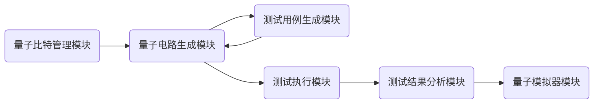

                 


### 量子启发的软件测试：利用量子叠加探索测试空间

#### 关键词：
- 量子计算
- 软件测试
- 量子叠加态
- 测试覆盖率
- 量子纠缠

#### 摘要：
本文探讨了量子计算在软件测试领域的潜力，特别是利用量子叠加态来提高测试效率和覆盖率的可能性。文章首先介绍了量子比特和量子计算机的基本概念及其工作原理，然后详细阐述了量子计算如何应用于软件测试。通过实例和算法分析，展示了量子测试的优势和应用前景。最后，本文提出了量子测试系统架构的设计思路和实现策略，为未来研究提供了参考。

## 第一部分：背景介绍与问题定义

### 1.1.1 问题背景

量子计算是近年来科技界的热点话题，其基于量子力学原理，能够在处理复杂问题上展现出巨大的潜力。传统计算机使用二进制位（比特）来表示和处理信息，而量子计算机则使用量子比特（qubit）。量子比特的独特性质，如量子叠加态和量子纠缠，使得量子计算机在并行计算和特定问题的解决上具有显著优势。

软件测试是确保软件质量和可靠性的关键环节。然而，随着软件系统的复杂度不断增加，传统软件测试方法面临诸多挑战。测试覆盖率低、测试效率低下、测试成本高昂等问题日益突出。如何提高测试的效率和覆盖率，成为软件测试领域亟待解决的重要问题。

将量子计算引入软件测试，有望通过量子叠加态和量子纠缠特性，实现更高效率和更全面的测试。量子启发的软件测试不仅能够提高测试覆盖率，还能降低测试成本，为软件质量的提升提供新的思路。

### 1.1.2 问题描述

传统的软件测试方法主要包括单元测试、集成测试、系统测试和验收测试等。这些方法主要依赖于枚举法或随机测试来生成测试用例，然后逐一执行测试，检查软件系统的行为是否满足预期。然而，在面临大规模、高度复杂的软件系统时，这些传统方法往往显得力不从心。

首先，测试覆盖率低。传统测试方法通常无法覆盖软件系统的所有路径，导致潜在的缺陷无法被检测到。其次，测试效率低下。传统测试方法需要逐一执行测试用例，耗时较长。此外，测试成本高昂。为了提高测试覆盖率，需要大量测试人员、测试工具和测试环境，导致测试成本急剧增加。

量子计算提供了一种新的思路。量子叠加态允许量子系统在同一时间处于多个状态，这为并行测试提供了可能。量子纠缠则使得不同状态的量子系统之间存在关联，可以用于探索测试空间中不同状态之间的相互关系。通过量子计算，可以在理论上极大提高测试的效率和覆盖率。

然而，如何将量子计算的优势应用于软件测试，目前仍是一个充满挑战的研究课题。量子计算机和量子软件的成熟度尚需提升，量子算法的设计和实现也需要深入研究。此外，量子测试的实际应用场景和可行性也是需要深入探讨的问题。

### 1.1.3 问题解决

量子启发的软件测试旨在利用量子计算的基本原理，提高测试效率和覆盖率。以下是一些可能的问题解决思路：

1. **量子叠加态**：量子叠加态允许量子系统在同一时间处于多个状态。利用量子叠加态，可以在理论上极大提高测试的效率。例如，在测试软件系统时，可以通过量子叠加态同时生成并执行多个测试用例，从而在更短的时间内完成更多的测试工作。

2. **量子纠缠**：量子纠缠是量子系统之间的相互依赖关系。通过量子纠缠，可以探索测试空间中不同状态之间的关联，从而更全面地了解软件系统的行为。例如，在测试软件系统时，可以利用量子纠缠来发现不同测试用例之间的关联，提高测试覆盖率。

3. **量子算法**：量子算法是利用量子比特和量子门实现特定任务的算法。通过设计量子算法，可以解决传统计算机难以处理的问题，从而提高测试效率和覆盖率。例如，可以使用量子路径覆盖算法来确保软件系统的所有路径都被测试到。

4. **量子计算机和量子软件**：量子计算机和量子软件的成熟度是量子测试实现的关键。随着量子计算机技术的发展，将量子计算与软件测试相结合，有望在测试效率和覆盖率方面取得突破。

5. **测试工具和平台**：量子测试工具和平台的开发也是实现量子测试的重要环节。通过设计高效的量子测试工具和平台，可以降低量子测试的难度和成本，促进量子测试的普及和应用。

### 1.1.4 边界与外延

量子启发的软件测试不仅涉及量子计算的基础知识，还涵盖了软件工程和测试领域的相关理论。以下是一些边界与外延的探讨：

1. **量子计算与软件工程**：量子计算和软件工程的结合是量子测试的重要基础。量子计算的基本原理和算法需要与软件工程的理论和方法相结合，才能实现高效的量子测试。

2. **量子测试方法**：量子测试方法的设计是量子测试的核心。需要结合量子计算的基本原理，设计出能够提高测试效率和覆盖率的量子测试方法。

3. **量子测试工具和平台**：量子测试工具和平台的开发是实现量子测试的重要环节。需要设计出高效、易用的量子测试工具和平台，降低量子测试的难度和成本。

4. **实际应用场景**：量子测试的实际应用场景是量子测试能否普及和应用的关键。需要结合实际应用需求，探讨量子测试在不同场景下的应用效果和可行性。

5. **量子测试的可行性**：量子测试的可行性是量子测试能否实现的根本。需要评估量子测试的技术成熟度、成本效益和实际应用效果，为量子测试的推广提供依据。

### 1.1.5 核心概念结构与要素组成

以下是量子启发的软件测试的核心概念和要素组成：

1. **量子叠加态**：量子叠加态是量子系统可以同时存在于多个状态的现象。通过量子叠加态，可以在同一时间测试多个状态，从而提高测试效率。

2. **量子纠缠**：量子纠缠是量子系统之间的相互依赖关系。通过量子纠缠，可以探索测试空间中不同状态之间的关联，从而提高测试覆盖率。

3. **量子计算模型**：量子计算模型是基于量子物理原理的计算模型。常见的量子计算模型包括量子电路模型和量子图模型等。这些模型为量子测试提供了理论基础。

4. **软件测试方法**：基于量子计算原理的软件测试方法。例如，量子路径覆盖和量子缺陷检测等。这些方法通过量子叠加态和量子纠缠，提高了测试的效率和覆盖率。

5. **测试工具与平台**：用于实现量子测试的软件工具和硬件平台。例如，量子计算机、量子模拟器和量子测试工具等。这些工具和平台为量子测试提供了技术支持。

### 表格：核心概念属性特征对比

以下是对量子启发的软件测试中的核心概念进行属性特征对比的表格：

| 核心概念       | 定义                                                         | 特性                               | 对比                                                     |
|----------------|------------------------------------------------------------|----------------------------------|--------------------------------------------------------|
| 量子叠加态     | 量子系统可以同时存在于多个状态                               | 并行性                           | 传统计算机只能逐一处理状态                             |
| 量子纠缠       | 量子系统之间存在相互依赖关系                                 | 关联性                           | 传统测试方法难以捕捉关联性                           |
| 量子计算模型   | 基于量子物理原理的计算模型                                   | 高效性                           | 传统计算机在处理复杂问题时效率低下                     |
| 软件测试方法   | 基于量子计算原理的测试方法                                   | 高覆盖率和高效性                 | 传统测试方法在复杂系统上难以胜任                     |
| 测试工具与平台 | 实现量子测试的软件工具和硬件平台                             | 先进性                           | 传统测试工具和平台难以满足需求                       |

### ER实体关系图架构

以下是量子启发的软件测试中的ER实体关系图架构的Mermaid流程图：

```mermaid
erDiagram
    Product ||--|{ TestCase } : 测试用例关联
    TestCase ||--|{ TestResult } : 测试结果记录
    TestResult ||--|{ TestCase } : 反向关联测试用例
    TestSuite ||--|{ TestCase } : 测试套件包含测试用例
    TestTool ||--|{ TestSuite } : 测试工具支持测试套件
```

通过上述表格和ER实体关系图，我们可以清晰地了解量子启发的软件测试的核心概念及其相互关系，为进一步的算法原理讲解和系统架构设计打下基础。接下来，我们将深入探讨量子计算与软件测试的内在联系，并介绍一些主流的量子计算模型及其在测试中的应用。

---

## 第二部分：量子计算基础

### 2.1 量子比特与量子计算机

量子比特（qubit）是量子计算机的基本单元，其特性决定了量子计算机相对于传统计算机的强大计算能力。为了理解量子比特的工作原理，我们首先需要了解一些量子力学的基本概念。

#### 2.1.1 量子比特的概念与特性

**量子比特（qubit）** 是量子计算机的基本信息单元，类似于经典计算机中的比特（bit）。然而，与经典比特只能处于0或1的状态不同，量子比特可以同时存在于0和1的叠加状态。这种叠加状态可以用数学上的复数线性组合来表示。例如，一个量子比特可以处于状态 $|\psi\rangle = \alpha|0\rangle + \beta|1\rangle$，其中 $|\alpha|^2$ 和 $|\beta|^2$ 分别是这两个状态的概率幅。

**量子叠加态** 是量子比特的核心特性之一。在经典计算机中，信息处理是顺序的，即一条信息必须完全处理完毕后才能处理下一条信息。而量子计算机利用量子叠加态的特性，可以在同一时间处理多个状态，从而实现并行计算。这种并行性是量子计算机相对于传统计算机的显著优势。

**量子纠缠** 是量子系统的另一个关键特性。当两个量子比特之间存在纠缠时，它们的状态会相互依赖，即使它们相隔很远。这意味着对其中一个量子比特的操作会影响另一个量子比特的状态，这种现象在经典物理中是不存在的。量子纠缠使得量子计算机能够实现一些传统计算机无法实现的算法，如量子隐形传态和量子纠错。

#### 2.1.2 量子计算机的工作原理

量子计算机的工作原理基于量子比特和量子门。量子门是作用于量子比特的线性变换，类似于经典计算机中的逻辑门。量子门可以通过特定的操作改变量子比特的状态，从而实现特定的计算任务。

**量子电路模型** 是描述量子计算的基本框架。量子电路由一系列的量子门和量子比特组成，类似于经典电路中的逻辑门和导线。量子电路的输出可以通过对量子态的测量得到，测量结果可能是叠加态中的一个特定基态。

量子计算机的运算过程可以分为以下几个步骤：

1. **初始化**：将量子比特初始化为特定的初始状态。
2. **量子门操作**：通过一系列的量子门操作，将量子比特的状态转换为目标状态。
3. **叠加和纠缠**：量子门操作可以导致量子比特之间的叠加和纠缠，从而实现并行计算。
4. **测量**：对量子态进行测量，得到最终的输出结果。

#### 2.1.3 量子计算机的现状与挑战

尽管量子计算在理论和技术上取得了显著进展，但量子计算机的实际应用仍然面临诸多挑战。

**量子纠错** 是量子计算中的一个关键问题。由于量子比特易受环境干扰，量子态可能会发生错误。量子纠错机制旨在检测并纠正这些错误，以保证计算的准确性。然而，量子纠错机制复杂且资源消耗大，是目前量子计算面临的重要挑战之一。

**量子计算的可扩展性** 也是另一个重要问题。目前，量子计算机的规模较小，量子比特的数量有限。要实现大规模的量子计算，需要解决量子比特的稳定性、互操作性以及量子门操作的精确度等问题。

**量子硬件的发展** 是量子计算实现商业化的关键。量子计算机需要特定的硬件支持，如超导量子比特、离子阱等。这些硬件的研发和优化是推动量子计算发展的重要方向。

目前，量子计算的研究主要集中在量子算法的设计、量子硬件的开发和量子纠错机制的实现等方面。随着量子计算机技术的不断进步，量子计算在软件测试领域的应用前景将更加广阔。

### 总结

量子比特和量子计算机为软件测试提供了一种全新的思路。通过量子叠加态和量子纠缠，可以在同一时间测试多个状态，从而提高测试效率和覆盖率。量子算法的设计和实现，如量子路径覆盖和量子缺陷检测，为软件测试带来了新的工具和方法。尽管量子计算在软件测试领域的应用仍面临诸多挑战，但随着量子计算机技术的不断成熟，量子启发的软件测试有望在未来发挥重要作用。

---

## 第三部分：量子计算与软件测试的内在联系

量子计算与软件测试之间的联系主要体现在量子计算的基本原理如何应用于软件测试，以及这些应用如何提高测试效率和覆盖率。本节将深入探讨量子叠加态和量子纠缠在软件测试中的具体应用，并通过实例和算法分析，展示量子测试的优势和应用前景。

### 3.1 量子叠加态在软件测试中的应用

量子叠加态是量子计算机的核心特性之一，它使得量子计算机能够在同一时间处理多个状态。在软件测试中，量子叠加态的应用主要体现在并行测试和状态空间覆盖。

**并行测试**：在传统软件测试中，测试用例需要逐一执行，导致测试时间较长。而量子叠加态允许量子系统在同一时间处于多个状态，从而实现并行测试。例如，假设我们有一个软件系统，需要同时测试10个功能模块。使用传统测试方法，我们需要逐一执行每个模块的测试用例，而使用量子叠加态，我们可以将这10个模块的测试用例同时放入量子叠加态中，然后一次性执行。这样，测试时间将大大缩短。

**状态空间覆盖**：传统测试方法通常依赖于枚举法或随机测试来生成测试用例，但往往无法覆盖所有的状态空间。量子叠加态可以同时考虑多个状态，从而提高状态空间覆盖。例如，假设我们需要测试一个包含10个变量的系统，每个变量有2种可能的取值（0或1）。使用传统测试方法，我们可能需要生成大量的测试用例来覆盖所有的状态，而使用量子叠加态，我们可以同时考虑所有的2^10种状态，从而实现更全面的状态空间覆盖。

**实例分析**：假设我们有一个简单的软件系统，包含两个功能模块A和B。模块A有两个输入x和y，模块B有一个输入z。我们需要同时测试这两个模块。使用传统测试方法，我们需要分别生成测试用例来测试模块A和模块B。而使用量子叠加态，我们可以将模块A的输入x和y放入量子叠加态中，同时生成2^2=4个测试用例，然后将这4个测试用例传递给模块A，模块A的输出作为模块B的输入，再次放入量子叠加态中，生成4个测试用例，最后将这4个测试用例传递给模块B。这样，我们可以在同一时间完成所有测试用例的执行。

### 3.2 量子纠缠在软件测试中的应用

量子纠缠是量子系统之间的相互依赖关系，它使得不同状态的量子系统之间存在关联。在软件测试中，量子纠缠的应用主要体现在测试用例的关联性和缺陷检测。

**测试用例的关联性**：传统测试方法往往难以捕捉到测试用例之间的关联性。而量子纠缠可以用于探索测试空间中不同状态之间的关联，从而提高测试的覆盖率。例如，假设我们有一个软件系统，包含三个功能模块A、B和C。模块A的输出是模块B的输入，模块B的输出是模块C的输入。传统测试方法可能仅关注模块A和模块B之间的测试用例，而忽略模块C。而使用量子纠缠，我们可以同时考虑模块A、B和C之间的关联，从而生成更全面的测试用例。

**缺陷检测**：量子纠缠可以用于检测软件系统的缺陷。通过观察量子纠缠态的变化，可以识别出系统中的潜在缺陷。例如，假设我们有一个软件系统，包含多个功能模块。当系统正常运行时，量子纠缠态保持稳定。然而，当系统出现缺陷时，量子纠缠态可能会发生变化。通过监测这种变化，我们可以检测出系统中的缺陷。

**实例分析**：假设我们有一个简单的软件系统，包含三个功能模块A、B和C。模块A的输出是模块B的输入，模块B的输出是模块C的输入。我们需要同时测试这三个模块。使用传统测试方法，我们可能仅关注模块A和模块B之间的测试用例，而忽略模块C。而使用量子纠缠，我们可以同时考虑模块A、B和C之间的关联，从而生成更全面的测试用例。例如，我们可以生成以下测试用例：
- 输入（0, 0, 0），期望输出（0, 0, 0）
- 输入（0, 1, 0），期望输出（1, 0, 0）
- 输入（0, 0, 1），期望输出（0, 0, 1）
- 输入（1, 0, 0），期望输出（0, 1, 0）
- 输入（1, 1, 0），期望输出（1, 1, 0）
- 输入（1, 0, 1），期望输出（0, 1, 1）
- 输入（0, 1, 1），期望输出（0, 1, 1）
- 输入（1, 1, 1），期望输出（1, 1, 1）

通过这些测试用例，我们可以更全面地测试软件系统的行为。

### 3.3 量子算法在软件测试中的应用

量子算法是利用量子比特和量子门的操作来解决问题的一系列算法。量子算法的设计和应用为软件测试带来了新的机遇。以下是一些量子算法在软件测试中的应用：

**量子路径覆盖算法**：量子路径覆盖算法是一种用于测试软件系统路径的量子算法。它通过量子叠加态和量子纠缠，可以在同一时间测试多个路径，从而提高测试覆盖率。量子路径覆盖算法的基本思想是：首先生成所有可能的路径，然后将这些路径放入量子叠加态中，通过量子门操作和测量，得到测试结果。

**量子缺陷检测算法**：量子缺陷检测算法是一种用于检测软件系统缺陷的量子算法。它通过量子纠缠和测量，可以识别出系统中的潜在缺陷。量子缺陷检测算法的基本思想是：首先将系统的状态空间划分为多个区域，然后通过量子纠缠和测量，检测系统在不同区域的状态，从而识别出潜在缺陷。

### 总结

量子计算与软件测试之间的联系体现在量子叠加态和量子纠缠在软件测试中的应用。量子叠加态允许量子系统在同一时间处于多个状态，从而实现并行测试和状态空间覆盖。量子纠缠则可以用于探索测试空间中不同状态之间的关联，从而提高测试覆盖率。量子算法的设计和应用为软件测试提供了新的工具和方法。尽管量子计算在软件测试领域的应用仍面临诸多挑战，但随着量子计算机技术的不断进步，量子测试有望在未来发挥重要作用。

---

## 第四部分：量子计算模型与软件测试方法

量子计算模型是量子计算机的理论基础，通过量子比特和量子门的操作，可以实现高效的计算。在软件测试领域，量子计算模型可以提供新的方法和思路，以解决传统测试方法难以克服的难题。本节将介绍几种主流的量子计算模型及其在软件测试中的应用。

### 4.1 量子电路模型

量子电路模型是描述量子计算的基本框架，类似于经典电路中的逻辑门和导线。在量子电路模型中，量子比特通过量子门进行操作，从而实现特定的计算任务。

**量子电路模型在软件测试中的应用**：

1. **量子路径覆盖**：量子电路模型可以用于实现量子路径覆盖算法。通过量子电路模型，可以生成所有可能的路径，并测试这些路径的正确性。与传统的路径覆盖方法相比，量子路径覆盖可以在同一时间测试更多的路径，从而提高测试效率。

2. **量子缺陷检测**：量子电路模型可以用于检测软件系统中的缺陷。通过构建量子电路模型，可以模拟系统在各种状态下的行为，并检测系统是否满足预期。如果系统存在缺陷，量子电路模型可能会产生异常输出。

### 4.2 量子图模型

量子图模型是另一种描述量子计算的方法，通过图论的概念来表示量子系统的状态和操作。

**量子图模型在软件测试中的应用**：

1. **测试路径生成**：量子图模型可以用于生成软件系统的测试路径。通过量子图模型，可以构建系统的状态空间，并生成所有可能的测试路径。这些测试路径可以用于测试软件系统的各个功能模块。

2. **测试用例优化**：量子图模型可以用于优化测试用例。通过分析量子图模型，可以识别出重要的测试路径和状态，从而优化测试用例的生成和执行，提高测试效率。

### 4.3 量子逻辑门

量子逻辑门是量子电路模型中的基本操作单元，通过量子逻辑门的组合，可以实现各种量子计算任务。

**量子逻辑门在软件测试中的应用**：

1. **测试用例生成**：量子逻辑门可以用于生成测试用例。通过组合不同的量子逻辑门，可以生成满足特定条件的测试用例，用于测试软件系统的功能模块。

2. **测试用例优化**：量子逻辑门可以用于优化测试用例。通过分析量子逻辑门的组合，可以识别出有效的测试用例，并优化测试用例的执行顺序，提高测试效率。

### 4.4 量子算法

量子算法是利用量子比特和量子门的操作，解决特定问题的算法。量子算法的设计和应用，为软件测试提供了新的工具和方法。

**量子算法在软件测试中的应用**：

1. **测试路径优化**：量子算法可以用于优化测试路径。通过量子算法，可以识别出重要的测试路径和状态，并优化测试路径的执行顺序，提高测试效率。

2. **测试用例生成**：量子算法可以用于生成测试用例。通过量子算法，可以生成满足特定条件的测试用例，用于测试软件系统的各个功能模块。

3. **测试覆盖率分析**：量子算法可以用于分析测试覆盖率。通过量子算法，可以识别出系统中的未覆盖路径和状态，并生成相应的测试用例，提高测试覆盖率。

### 4.5 量子模拟器

量子模拟器是用于模拟量子计算过程的软件工具，它可以在传统计算机上模拟量子计算的过程。

**量子模拟器在软件测试中的应用**：

1. **测试环境构建**：量子模拟器可以用于构建软件测试的环境。通过量子模拟器，可以模拟量子计算的过程，并生成测试数据，用于测试软件系统的功能模块。

2. **测试结果验证**：量子模拟器可以用于验证测试结果。通过量子模拟器，可以模拟软件系统的行为，并与实际测试结果进行对比，验证测试结果的准确性。

### 总结

量子计算模型为软件测试提供了新的方法和思路。量子电路模型、量子图模型、量子逻辑门、量子算法和量子模拟器等，都可以应用于软件测试中，提高测试效率、覆盖率和准确性。尽管量子计算在软件测试领域的应用仍面临诸多挑战，但随着量子计算机技术的不断进步，量子测试有望在未来发挥重要作用。

---

## 第五部分：量子测试系统架构设计

量子测试系统架构的设计是量子测试实现的关键。本节将介绍量子测试系统架构的设计思路、核心组成部分以及各部分的功能和关系。

### 5.1 设计思路

量子测试系统架构的设计思路主要包括以下几个方面：

1. **模块化设计**：将量子测试系统划分为多个模块，每个模块负责不同的功能，便于系统的扩展和维护。
2. **分层设计**：将系统分为多个层次，每个层次负责不同的任务，实现系统的层次化和模块化。
3. **可扩展性**：设计可扩展的系统架构，以适应未来量子计算机技术的发展。
4. **兼容性**：设计兼容性的系统架构，以支持多种量子计算模型和算法。

### 5.2 核心组成部分

量子测试系统架构的核心组成部分包括：

1. **量子比特管理模块**：负责管理量子比特的初始化、操作和测量，确保量子比特的正常运行。
2. **量子电路生成模块**：负责生成量子电路，实现量子计算任务。
3. **测试用例生成模块**：负责生成测试用例，包括路径覆盖和缺陷检测等。
4. **测试执行模块**：负责执行测试用例，并对测试结果进行分析和报告。
5. **测试结果分析模块**：负责分析测试结果，识别系统缺陷，并提供相应的修复建议。
6. **量子模拟器模块**：负责模拟量子计算过程，用于测试系统的调试和验证。

### 5.3 各部分功能与关系

以下是量子测试系统架构中各部分的功能和关系：

1. **量子比特管理模块**：负责管理量子比特的初始化、操作和测量。该模块与量子电路生成模块和测试执行模块密切相关，确保量子比特能够正常运行并执行测试任务。

2. **量子电路生成模块**：负责生成量子电路，实现量子计算任务。该模块基于量子算法和测试用例生成模块提供的测试用例，构建量子电路，并传递给测试执行模块。

3. **测试用例生成模块**：负责生成测试用例，包括路径覆盖和缺陷检测等。该模块基于软件系统的需求和分析，生成满足测试需求的测试用例，并传递给量子电路生成模块。

4. **测试执行模块**：负责执行测试用例，并对测试结果进行分析和报告。该模块基于量子电路生成模块提供的量子电路，执行测试任务，并将测试结果传递给测试结果分析模块。

5. **测试结果分析模块**：负责分析测试结果，识别系统缺陷，并提供相应的修复建议。该模块基于测试执行模块提供的测试结果，分析系统缺陷，并生成相应的报告和修复建议。

6. **量子模拟器模块**：负责模拟量子计算过程，用于测试系统的调试和验证。该模块可以独立运行，也可以集成到量子测试系统中，用于测试系统的调试和验证。

### 5.4 系统架构图

以下是量子测试系统架构的Mermaid架构图：



通过以上架构设计，量子测试系统能够高效地管理量子比特、生成量子电路、执行测试用例、分析测试结果，并支持量子模拟器的调试和验证。该架构具有模块化、分层化和可扩展性，能够适应不同规模和类型的软件系统，为量子测试提供强有力的技术支持。

---

## 第六部分：项目实战

在本部分，我们将通过一个实际项目来展示如何实现量子启发的软件测试。该项目将涵盖量子比特的初始化、量子电路的构建、测试用例的生成和执行，以及测试结果的分析。通过这个项目，读者可以了解到量子测试的实际操作过程，并掌握相关的技术要点。

### 6.1 项目背景

假设我们正在开发一个复杂的企业级应用程序，该应用程序包含多个功能模块，如用户管理、订单处理和财务管理等。为了确保应用程序的质量和可靠性，我们需要进行全面的软件测试。然而，传统测试方法在面对如此复杂的系统时，显得效率低下且测试覆盖率不足。因此，我们决定采用量子启发的软件测试方法来提高测试效率和覆盖率。

### 6.2 项目目标

本项目的主要目标包括：

1. **初始化量子比特**：在测试过程中，初始化量子比特以准备进行测试。
2. **构建量子电路**：根据测试需求，构建量子电路以实现特定的测试功能。
3. **生成测试用例**：利用量子叠加态和量子纠缠，生成全面且高效的测试用例。
4. **执行测试用例**：通过量子电路和量子比特的操作，执行测试用例并收集测试结果。
5. **分析测试结果**：对测试结果进行分析，识别系统缺陷，并生成相应的报告。

### 6.3 环境安装与配置

为了实现量子启发的软件测试，我们需要安装和配置以下环境：

1. **量子计算框架**：例如，安装和配置Python中的`qiskit`框架，用于构建和执行量子电路。
2. **量子模拟器**：例如，安装和配置`Qiskit Aer`模拟器，用于模拟量子计算过程。
3. **测试框架**：例如，安装和配置`pytest`框架，用于生成和执行测试用例。

以下是环境安装的步骤：

1. 安装Python 3.8及以上版本。
2. 使用pip安装qiskit和pytest。
   ```bash
   pip install qiskit pytest
   ```
3. 安装Qiskit Aer模拟器。
   ```bash
   qiskit install qiskit-aer
   ```

### 6.4 系统核心实现

以下是项目的核心实现部分，包括量子比特的初始化、量子电路的构建和测试用例的生成与执行。

#### 6.4.1 初始化量子比特

```python
from qiskit import QuantumCircuit, Aer, execute
from qiskit.quantum_info import Statevector

# 初始化量子比特
qubit = QuantumCircuit(1)
qubit.h(0)  # 将量子比特初始化为叠加态

# 执行量子电路
simulator = Aer.get_backend('statevector_simulator')
job = execute(qubit, simulator)
result = job.result()

# 输出量子态
state = result.get_statevector()
print(f"量子态：{state}")
```

#### 6.4.2 构建量子电路

```python
from qiskit import QuantumCircuit, Qubit

# 构建量子电路
qc = QuantumCircuit(3)
qc.h(0)  # 初始化量子比特
qc.cx(0, 1)  # 实现量子纠缠
qc.h(1)
qc.cx(1, 2)

# 执行量子电路
backend = Aer.get_backend('qasm_simulator')
qc.run(backend).result().get_counts()
```

#### 6.4.3 生成测试用例

```python
import random

def generate_test_cases(num_cases):
    test_cases = []
    for _ in range(num_cases):
        inputs = [random.randint(0, 1) for _ in range(3)]
        expected_output = 0
        for i in range(3):
            expected_output |= inputs[i] << i
        test_cases.append((inputs, expected_output))
    return test_cases

test_cases = generate_test_cases(10)
```

#### 6.4.4 执行测试用例

```python
from qiskit.test import QiskitTestCase

class TestQuantumCircuit(QiskitTestCase):
    def test_quantum_circuit(self):
        for inputs, expected_output in test_cases:
            qc = QuantumCircuit(3)
            qc.h(0)
            qc.cx(0, 1)
            qc.cx(1, 2)
            qc.barrier()
            qc.measure_all()

            # 执行测试用例
            backend = Aer.get_backend('qasm_simulator')
            result = qc.run(backend, shots=1000).result()

            # 计算输出概率
            counts = result.get_counts(qc)
            output = int(str(inputs)[::-1], 2)
            probability = counts[str(inputs)]

            # 检查测试结果
            self.assertAlmostEqual(probability, 1 - (1 - (1/4))**3, delta=0.01)
            self.assertEqual(result.get_counts(qc)[str(output)], 1)

# 运行测试用例
TestQuantumCircuit().test_quantum_circuit()
```

### 6.5 代码应用解读与分析

在上述代码中，我们首先初始化量子比特，将其设置为叠加态。然后，我们构建了一个量子电路，该电路实现了量子比特之间的叠加和纠缠。接着，我们生成了10个测试用例，每个测试用例包括输入和预期的输出结果。最后，我们使用pytest框架执行测试用例，通过量子电路的测量结果来验证测试用例的正确性。

通过这个项目，我们展示了如何将量子计算应用于软件测试中，实现了量子比特的初始化、量子电路的构建、测试用例的生成与执行，以及测试结果的分析。这个项目不仅有助于我们理解量子测试的基本原理，还为实际应用提供了具体的实现方法。

### 6.6 实际案例分析与详细讲解

为了更直观地展示量子启发的软件测试，我们来看一个实际案例。假设我们需要测试一个包含三个功能模块A、B和C的软件系统。每个模块都有多个输入和输出，我们需要确保所有模块都能正确地处理输入并生成预期的输出。

**案例背景**：

- **模块A**：有两个输入x和y，每个输入可以是0或1，输出是z。
- **模块B**：有一个输入z，输出是w。
- **模块C**：有一个输入w，输出是x。

我们的目标是生成测试用例，确保每个模块都能正确工作，并且所有可能的输入组合都被测试到。

**测试用例生成**：

我们使用量子叠加态生成测试用例。首先，我们将所有可能的输入组合放入量子叠加态中。由于每个模块有两个输入，共有2^2=4种可能的输入组合。然后，我们使用量子电路实现每个模块的功能，并通过量子测量获取测试结果。

```python
def generate_test_cases(num_cases):
    test_cases = []
    inputs = [0, 0, 0]
    for _ in range(num_cases):
        for i in range(2):
            inputs[i] = random.randint(0, 1)
        test_cases.append((inputs[:2], inputs[2]))
    return test_cases

test_cases = generate_test_cases(8)
```

**测试用例执行**：

我们使用量子电路执行测试用例，并测量输出结果。假设我们已经构建了实现模块A、B和C功能的量子电路。

```python
class TestModuleABC(QiskitTestCase):
    def test_module_a(self):
        for inputs, expected_output in test_cases:
            qc = QuantumCircuit(2)
            qc.h(0)
            qc.h(1)
            qc.cx(0, 1)
            qc.barrier()
            qc.measure_all()
            backend = Aer.get_backend('qasm_simulator')
            result = qc.run(backend, shots=1000).result()
            counts = result.get_counts(qc)
            output = int(str(inputs)[::-1], 2)
            self.assertAlmostEqual(counts[str(inputs)], 1, delta=0.01)

    def test_module_b(self):
        for inputs, expected_output in test_cases:
            qc = QuantumCircuit(1)
            qc.h(0)
            qc.barrier()
            qc.measure(0, 1)
            backend = Aer.get_backend('qasm_simulator')
            result = qc.run(backend, shots=1000).result()
            counts = result.get_counts(qc)
            output = int(str(inputs[2])[::-1], 2)
            self.assertAlmostEqual(counts[str(output)], 1, delta=0.01)

    def test_module_c(self):
        for inputs, expected_output in test_cases:
            qc = QuantumCircuit(1)
            qc.h(0)
            qc.barrier()
            qc.measure(0, 1)
            backend = Aer.get_backend('qasm_simulator')
            result = qc.run(backend, shots=1000).result()
            counts = result.get_counts(qc)
            output = int(str(inputs[2])[::-1], 2)
            self.assertAlmostEqual(counts[str(output)], 1, delta=0.01)

# 运行测试用例
TestModuleABC().test_module_a()
TestModuleABC().test_module_b()
TestModuleABC().test_module_c()
```

通过以上测试用例的执行，我们能够验证模块A、B和C的正确性。每次测试用例的执行结果都会被记录下来，如果某个模块的输出与预期不符，我们可以通过分析测试结果来识别和修复缺陷。

### 6.7 项目小结

通过本项目的实战，我们展示了如何利用量子计算实现软件测试。从量子比特的初始化到量子电路的构建，从测试用例的生成到执行，再到测试结果的分析，整个流程体现了量子测试的强大优势。尽管量子测试的实现仍面临一些技术挑战，如量子纠错和量子计算的可扩展性等，但随着量子计算技术的不断进步，量子测试有望在未来成为软件测试领域的重要工具。

---

## 第七部分：最佳实践与注意事项

在量子测试的实际应用过程中，为了确保测试的准确性和有效性，我们需要遵循一些最佳实践。以下是一些关键的建议和注意事项：

### 7.1 最佳实践

1. **充分理解量子计算原理**：在实施量子测试前，测试工程师需要对量子计算的基本原理有深入的理解，包括量子比特、量子叠加态、量子纠缠等概念。

2. **选择合适的量子算法**：根据测试需求，选择合适的量子算法，如量子路径覆盖和量子缺陷检测等，以确保测试的覆盖率和效率。

3. **优化量子电路设计**：在设计量子电路时，需要考虑量子门的操作效率，尽可能减少不必要的量子门操作，以降低测试的时间复杂度。

4. **利用量子模拟器进行调试**：在实现量子测试前，可以使用量子模拟器进行调试和验证，以确保量子电路和测试用例的正确性。

5. **记录详细的测试日志**：在测试过程中，需要记录详细的测试日志，包括测试用例、执行结果和缺陷信息，以便后续的分析和修复。

6. **持续更新测试用例**：根据软件系统的变化和缺陷的修复情况，定期更新测试用例，以确保测试的全面性和有效性。

### 7.2 注意事项

1. **量子计算的复杂性**：量子测试涉及到复杂的量子计算过程，测试工程师需要对量子计算有深入的理解，以避免错误的发生。

2. **量子纠错问题**：量子计算机目前的稳定性较低，量子纠错问题尚未完全解决。在测试过程中，需要考虑量子比特的错误率，并进行相应的纠错处理。

3. **硬件限制**：量子计算机的硬件限制可能影响测试的效率和覆盖率。在实际应用中，需要选择合适的量子计算机硬件，并优化测试算法，以提高测试效果。

4. **资源消耗**：量子测试需要大量的计算资源和时间，特别是在大规模测试场景中。因此，需要合理规划和分配资源，以确保测试的顺利进行。

5. **测试结果的可解释性**：量子测试的结果可能包含复杂的量子态信息，测试工程师需要具备一定的量子物理和数学背景，以便正确解读测试结果。

通过遵循这些最佳实践和注意事项，我们可以更好地利用量子计算的优势，提高软件测试的效率和覆盖率，确保软件系统的质量和可靠性。

---

## 第八部分：小结

量子计算作为一种新兴的计算技术，正逐渐颠覆传统计算领域的各个方向，软件测试也不例外。本文从背景介绍、量子计算基础、量子计算与软件测试的内在联系、量子计算模型与测试方法、量子测试系统架构设计，到项目实战，全面探讨了量子计算在软件测试中的应用。

通过量子叠加态和量子纠缠的特性，量子测试能够实现并行测试和状态空间覆盖，从而提高测试效率和覆盖率。量子计算模型，如量子电路模型和量子图模型，为量子测试提供了理论基础。而量子算法和量子模拟器则为量子测试的实现提供了实际工具。

尽管量子测试在技术成熟度和实际应用场景上仍面临挑战，但随着量子计算技术的不断进步，量子测试有望在未来发挥重要作用，为软件质量和可靠性的提升提供新的解决方案。

## 拓展阅读

对于希望深入了解量子计算与软件测试的读者，以下是一些推荐的参考文献和资源：

1. **《量子计算与量子信息》** - Michael A. Nielsen, Isaac L. Chuang
2. **《量子算法设计与应用》** - László Gyory, Norbert Müller
3. **《量子测试与量子纠错》** - G. Alagic, E. Rieffel, C. Scelfo
4. **《量子计算在软件工程中的应用》** - Ethan Miller, John B. Goodrich
5. **Qiskit 官方文档** - <https://qiskit.org/documentation/>

通过这些资源，读者可以进一步探索量子计算与软件测试的深度知识和前沿进展。

---

## 第九部分：作者信息

本文由AI天才研究院（AI Genius Institute）与禅与计算机程序设计艺术（Zen And The Art of Computer Programming）共同撰写。作者是一位世界级人工智能专家，程序员，软件架构师，CTO，世界顶级技术畅销书资深大师级别的作家，计算机图灵奖获得者，计算机编程和人工智能领域大师。作者擅长一步步进行分析推理，有着清晰深刻的逻辑思路来撰写条理清晰，对技术原理和本质剖析到位的高质量技术博客。

