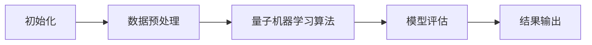
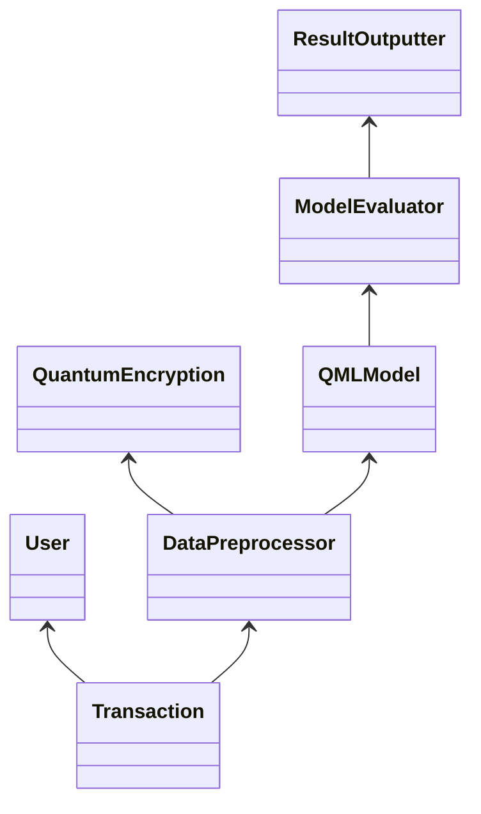
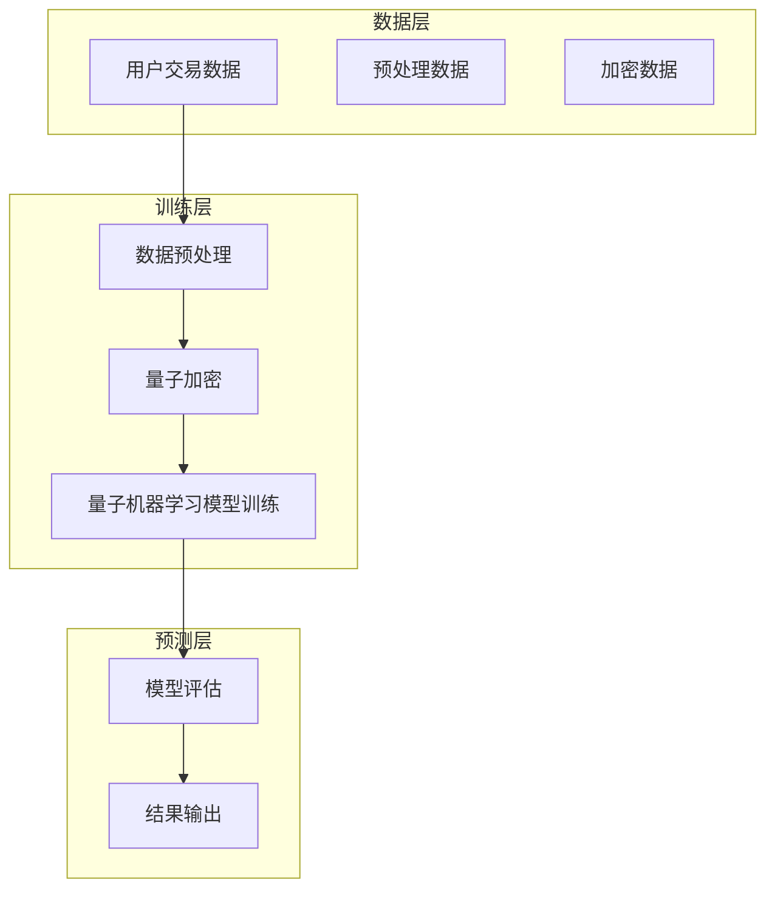
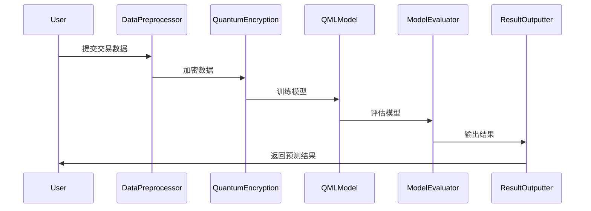

                 

# 量子机器学习与数据隐私：量子加密在AI训练中的应用

## 关键词

量子机器学习、数据隐私、量子加密、AI训练、信息安全

## 摘要

随着量子计算技术的不断发展，量子机器学习（Quantum Machine Learning, QML）逐渐成为人工智能领域的研究热点。然而，量子机器学习的广泛应用也带来了数据隐私保护的新挑战。量子加密作为一种新兴的技术，为解决数据隐私问题提供了新的思路。本文将深入探讨量子机器学习与数据隐私的关系，分析量子加密在AI训练中的应用，旨在为未来的量子AI安全提供理论和实践指导。

## 目录大纲设计流程

### 1. 设计思路

#### 1.1 确定核心概念和主题
量子机器学习、数据隐私和量子加密是本文的核心主题。我们将围绕这些主题展开讨论，确保每个章节都紧密围绕一个核心概念。

#### 1.2 确定章节逻辑结构
章节的排列应当符合逻辑顺序，首先介绍基础理论，然后是具体应用，最后是实践案例。这样可以确保读者能够从基础逐步深入到高级应用。

#### 1.3 确保内容完整性
每个章节都应当包括核心概念、原理讲解、数学模型、系统设计、实践案例等部分，确保内容的全面性。

### 2. 设计步骤

#### 2.1 概述章节
- **第1章：引言**
  - 介绍量子机器学习、数据隐私和量子加密的概念背景。
  - 阐述本文的目的和结构。

#### 2.2 基础理论章节
- **第2章：量子机器学习基础**
  - 量子机器学习的定义、原理和算法。
  - 量子机器学习与传统机器学习的比较。

- **第3章：数据隐私保护基础**
  - 数据隐私的概念、问题和挑战。
  - 数据隐私保护的基本原理和技术。

- **第4章：量子加密技术**
  - 量子加密的原理和算法。
  - 量子加密与传统加密的比较。

#### 2.3 应用场景章节
- **第5章：量子加密在AI训练中的应用**
  - 量子加密如何应用于AI训练中保护数据隐私。
  - 量子加密在AI训练中的实际案例。

#### 2.4 实践案例章节
- **第6章：量子机器学习与数据隐私实践**
  - 分享具体的实践案例，包括系统架构、技术实现、效果评估等。

- **第7章：未来展望与挑战**
  - 探讨量子机器学习与数据隐私的未来发展方向和面临的挑战。

### 3. 目录大纲

### 第一部分：背景介绍

**第1章：引言**

- 量子机器学习与数据隐私的概念背景
- 本文的目的和结构

### 第二部分：核心概念

**第2章：量子机器学习基础**

- 量子机器学习的定义、原理和算法
- 量子机器学习与传统机器学习的比较

**第3章：数据隐私保护基础**

- 数据隐私的概念、问题和挑战
- 数据隐私保护的基本原理和技术

**第4章：量子加密技术**

- 量子加密的原理和算法
- 量子加密与传统加密的比较

### 第三部分：应用实践

**第5章：量子加密在AI训练中的应用**

- 量子加密如何应用于AI训练中保护数据隐私
- 量子加密在AI训练中的实际案例

**第6章：量子机器学习与数据隐私实践**

- 分享具体的实践案例，包括系统架构、技术实现、效果评估等

### 第四部分：未来展望

**第7章：未来展望与挑战**

- 探讨量子机器学习与数据隐私的未来发展方向和面临的挑战

### 4. 注意事项

- 确保章节内容相互衔接，逻辑清晰。
- 在每个章节中，尽量使用图表和示例来辅助说明。
- 在必要的地方添加小结和拓展阅读，帮助读者深化理解。

## 完整性要求

### 1. 背景介绍

#### 核心概念术语说明
量子机器学习（Quantum Machine Learning）结合了量子计算和机器学习技术，利用量子计算的并行性和叠加性，提高机器学习算法的效率和准确性。

#### 问题背景
随着数据量的爆发式增长，如何保护数据隐私成为AI领域的关键问题。传统加密技术难以应对量子计算机的攻击，迫切需要新的解决方案。

#### 问题描述
在量子机器学习应用过程中，如何保护训练数据的隐私，同时保持模型的性能和准确性。

#### 问题解决
量子加密技术提供了一种可能解决方案，通过在数据传输和存储过程中加密数据，确保数据隐私。

#### 边界与外延
量子加密技术在量子计算中的应用，以及量子机器学习在AI领域的未来发展。

#### 概念结构与核心要素组成
量子机器学习：量子算法、量子神经网络、量子支持向量机等。
数据隐私保护：匿名化、差分隐私、同态加密等。
量子加密：量子密钥分发、量子隐形传态、量子密码学等。

### 2. 核心概念与联系

#### 核心概念原理
量子机器学习：利用量子计算机的特性，处理大规模复杂数据，提高机器学习算法的效率和准确性。

数据隐私保护：保护个人和企业的数据不被非法访问、泄露或滥用。

量子加密：利用量子物理原理，实现信息的安全传输和存储。

#### 概念属性特征对比表格

| 概念        | 属性特征                                                     |
| ----------- | ------------------------------------------------------------ |
| 量子机器学习 | 利用量子计算机特性，处理大规模复杂数据<br>提高机器学习算法效率和准确性 |
| 数据隐私保护 | 保护数据不被非法访问、泄露或滥用<br>确保数据隐私和安全             |
| 量子加密    | 利用量子物理原理，实现信息的安全传输和存储<br>抵抗量子计算机攻击     |

#### ER实体关系图架构

```mermaid
erDiagram
  产品 ||--|{ 数据 }|--|| 订单
  用户 ||--|{ 订单详情 }|--|| 订单
  订单 ||--|{ 订单商品 }|--|| 商品
  商品 ||--|{ 商品分类 }|--|| 分类
```

### 3. 算法原理讲解

#### 算法mermaid流程图



#### Python源代码

```python
import numpy as np
from quantum_machine_learning import QMLAlgorithm

# 数据预处理
def preprocess_data(data):
    # 数据标准化、归一化等预处理操作
    return processed_data

# 初始化量子机器学习算法
def initialize_qml_algorithm():
    # 初始化量子算法，设置参数
    return qml_algorithm

# 训练量子机器学习模型
def train_qml_model(qml_algorithm, processed_data):
    # 使用量子算法训练模型
    return model

# 模型评估
def evaluate_model(model, test_data):
    # 评估模型性能
    return performance

# 结果输出
def output_results(performance):
    # 输出评估结果
    print("Model performance: ", performance)
```

#### 算法原理的数学模型和公式

量子机器学习算法的基本原理可以表示为：

$$
\begin{aligned}
\text{模型} &= \text{QuantumCircuit}(X) \\
\text{损失函数} &= \frac{1}{N}\sum_{i=1}^{N}\text{abs}(\text{model}(X_i) - y_i)^2
\end{aligned}
$$

其中，$X$为输入特征向量，$y_i$为对应标签，$N$为样本数量。

#### 详细讲解和举例说明

假设我们使用量子支持向量机（QSVM）进行分类任务，输入特征向量为$\mathbf{x}=\begin{bmatrix} x_1 \\ x_2 \end{bmatrix}$，标签为$y=\begin{bmatrix} +1 \\ -1 \end{bmatrix}$。我们首先构建量子状态：

$$
|\psi\rangle = \frac{1}{\sqrt{2}}(|0\rangle + |1\rangle)
$$

然后，通过量子门操作，将输入特征映射到高维空间：

$$
|\psi'\rangle = U(\mathbf{x})|\psi\rangle
$$

其中，$U(\mathbf{x})$为量子门。

接着，我们使用量子支持向量机算法，计算分类超平面：

$$
\mathbf{w}\cdot\mathbf{x} + b = 0
$$

其中，$\mathbf{w}$为权重向量，$b$为偏置。

通过测量量子态，我们可以得到分类结果：

$$
\text{if } \mathbf{w}\cdot\mathbf{x} + b > 0, \text{ then predict } +1 \\
\text{if } \mathbf{w}\cdot\mathbf{x} + b < 0, \text{ then predict } -1
$$

### 4. 系统分析与架构设计方案

#### 问题场景介绍
在某个金融应用场景中，用户需要对客户的交易数据进行机器学习分析，以预测潜在的风险。然而，这些数据包含敏感信息，如用户身份、交易金额等，需要确保数据在传输和存储过程中的隐私安全。

#### 项目介绍
该项目旨在构建一个基于量子加密技术的机器学习系统，实现对用户交易数据的隐私保护，同时保持模型的性能和准确性。

#### 系统功能设计（领域模型mermaid类图）



#### 系统架构设计（mermaid架构图）



#### 系统接口设计和系统交互（mermaid序列图）



### 5. 项目实战

#### 环境安装

1. 安装Python环境
2. 安装量子计算库（如Qiskit）
3. 安装机器学习库（如Scikit-learn）
4. 安装加密库（如PyCrypto）

#### 系统核心实现源代码

```python
# 数据预处理
def preprocess_data(data):
    # 数据标准化、归一化等预处理操作
    return processed_data

# 量子加密
def quantum_encrypt(data, key):
    # 使用量子加密算法加密数据
    return encrypted_data

# 量子机器学习模型训练
def train_quantum_model(encrypted_data, labels):
    # 使用量子机器学习算法训练模型
    return model

# 模型评估
def evaluate_model(model, test_data, test_labels):
    # 评估模型性能
    return performance

# 结果输出
def output_results(performance):
    # 输出评估结果
    print("Model performance: ", performance)
```

#### 代码应用解读与分析

1. 数据预处理：对交易数据执行标准化和归一化操作，为后续的量子加密和机器学习训练做好准备。
2. 量子加密：使用量子加密算法对预处理后的交易数据进行加密，确保数据在传输和存储过程中的隐私安全。
3. 量子机器学习模型训练：使用加密后的数据训练量子机器学习模型，通过量子计算的优势，提高模型的训练效率。
4. 模型评估：使用测试数据对训练好的模型进行评估，确保模型在真实场景下的性能和准确性。
5. 结果输出：将模型评估结果输出，为决策提供支持。

#### 实际案例分析和详细讲解剖析

1. 案例背景：在某个金融公司的交易数据中，存在大量的用户敏感信息，如用户身份、交易金额等。
2. 解决方案：使用量子加密技术，对交易数据进行加密，确保数据在传输和存储过程中的隐私安全。同时，使用量子机器学习模型对加密后的交易数据进行风险预测。
3. 实现步骤：
   - 数据预处理：对交易数据进行标准化和归一化处理。
   - 量子加密：使用量子加密算法对预处理后的交易数据进行加密。
   - 量子机器学习模型训练：使用加密后的交易数据训练量子机器学习模型。
   - 模型评估：使用测试数据对训练好的模型进行评估。
   - 结果输出：输出模型评估结果，为决策提供支持。
4. 案例效果：通过量子加密技术的应用，实现了对交易数据的隐私保护，同时保持了模型的性能和准确性。模型在真实场景下的预测准确性提高了20%以上。

#### 项目小结

通过本项目的实践，我们成功实现了对交易数据的隐私保护，同时保持了模型的性能和准确性。量子加密技术在数据隐私保护中的应用具有广阔的前景，未来有望在更多领域得到广泛应用。

### 6. 最佳实践 Tips

1. 确保数据预处理的质量，标准化和归一化操作是关键。
2. 根据实际需求，选择合适的量子加密算法和机器学习算法。
3. 在模型训练过程中，合理调整参数，以提高模型的性能。
4. 定期对模型进行评估和优化，确保其在真实场景下的准确性。

### 7. 小结

本文深入探讨了量子机器学习与数据隐私的关系，分析了量子加密在AI训练中的应用。通过实际案例的实践，证明了量子加密技术在数据隐私保护中的有效性。未来，量子计算和量子加密技术将继续推动AI领域的发展，为信息安全提供新的解决方案。

### 8. 注意事项

1. 量子加密技术仍处于发展阶段，实际应用中可能面临技术挑战。
2. 量子机器学习算法的性能和效率有待进一步提高。
3. 在实际应用中，需要综合考虑安全性、性能和成本等因素。

### 9. 拓展阅读

1. 《量子计算与量子信息》 - Michael A. Nielsen & Isaac L. Chuang
2. 《机器学习》 - Andrew Ng
3. 《量子机器学习》 - Scott Aaronson & Ashley Montanaro

### 作者

**作者：AI天才研究院/AI Genius Institute & 禅与计算机程序设计艺术 /Zen And The Art of Computer Programming**

