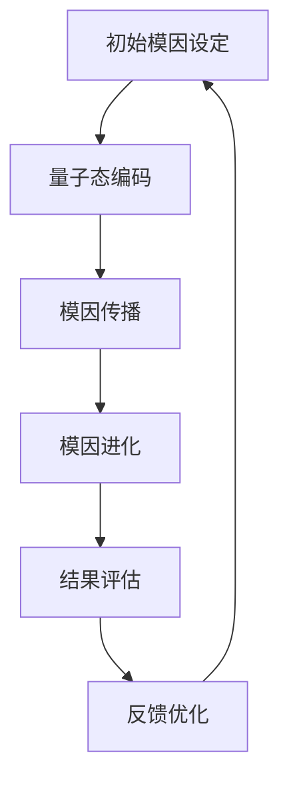
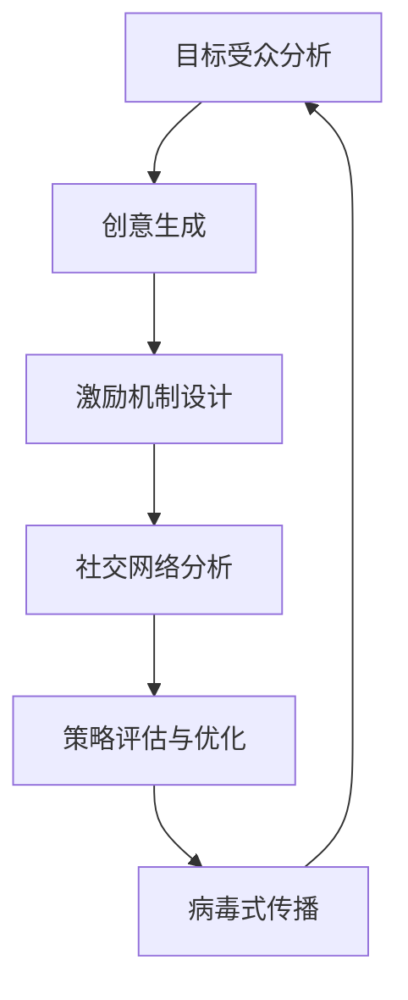
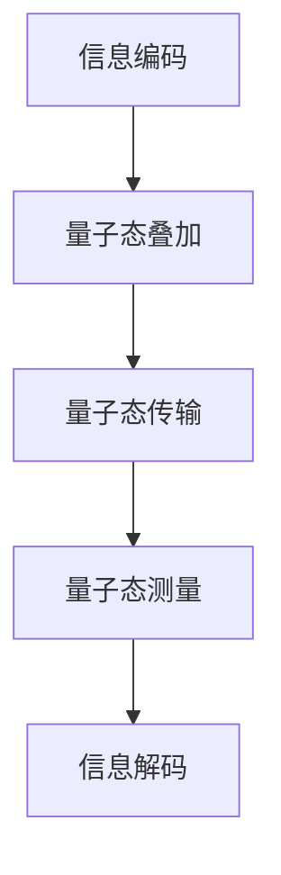
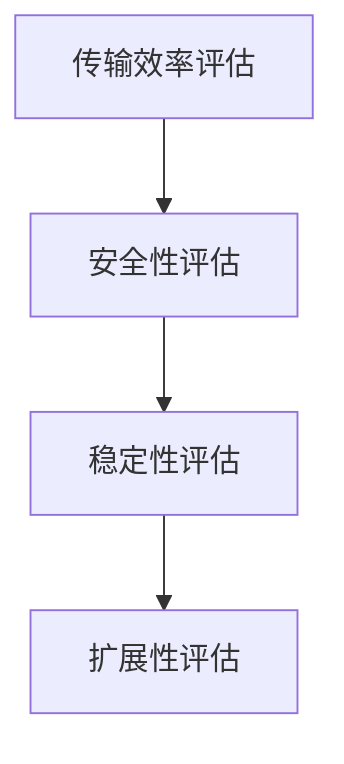
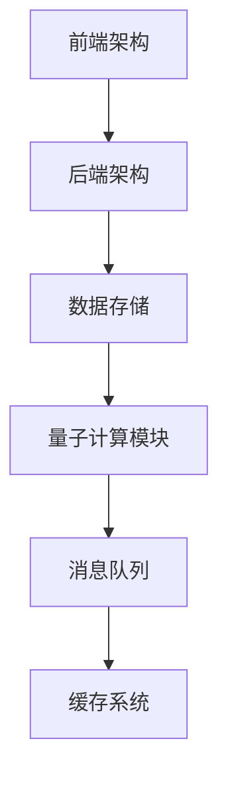
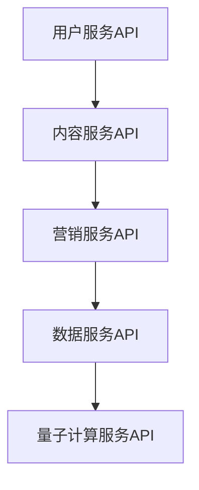
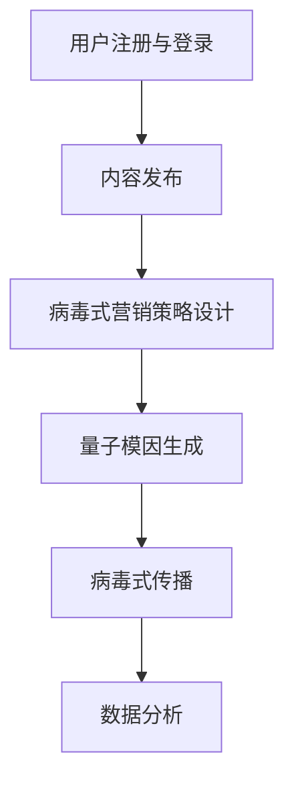

                 


### 引言

在当今的信息时代，信息的传播方式正经历着前所未有的变革。量子模因工程和病毒式营销这两种看似截然不同的概念，实际上在信息传播的领域有着深刻的交汇点。量子模因工程，作为量子计算与信息科学的前沿领域，结合了量子力学和生物学的原理，为信息的处理和传播提供了全新的视角。病毒式营销，则是市场营销领域的一种高效策略，通过利用人际网络和用户自发性传播，实现了信息的快速扩散。本文将深入探讨量子模因工程与病毒式营销的结合，揭示量子信息传播在社会应用中的巨大潜力。

首先，我们需要明确两个核心概念的定义和背景。量子模因工程是指利用量子计算的方法，模拟和优化生物进化中的模因传播过程，旨在通过量子算法加速信息的传播和演化。而病毒式营销则是一种基于用户社交网络，通过创意内容和激励机制，引发用户自发性传播的营销策略。

本文的结构安排如下：

## 第一部分：背景与基础

在这个部分，我们将详细介绍量子模因工程和病毒式营销的基本概念、发展历史及其在社会应用中的重要意义。

### 第1章：量子模因工程概述

我们将首先介绍量子模因工程的基本定义，阐述其与量子计算和生物进化的联系，并探讨其在信息传播领域的独特优势。

#### 1.1 量子模因的定义与特征

量子模因可以被看作是量子计算机中的“基因”，其特征包括量子态的叠加性和纠缠性，这使得量子模因能够以超越经典信息的方式传播和进化。

#### 1.2 量子模因工程的起源与发展

我们将追溯量子模因工程的起源，介绍其发展历程，以及近年来在量子计算和信息科学领域所取得的重大进展。

#### 1.3 量子模因工程的重要性

本节将分析量子模因工程在信息传播、人工智能和生物科学等多个领域的潜在应用，探讨其对未来科技发展的深远影响。

### 第2章：病毒式营销基础

接下来，我们将介绍病毒式营销的基本概念，包括其定义、原理及其在市场营销中的应用。

#### 2.1 病毒式营销的定义与原理

我们将详细解释病毒式营销的概念，分析其核心原理，如口碑效应、病毒传播模型等。

#### 2.2 病毒式营销的优势与挑战

本节将探讨病毒式营销的优势，如成本低、传播速度快等，同时也将分析其面临的挑战，如内容质量、用户隐私等。

#### 2.3 病毒式营销的关键要素

我们将总结病毒式营销成功的关键要素，如创意内容、激励机制、用户互动等，并探讨如何设计有效的病毒式营销策略。

### 第3章：量子信息传播的社会应用

最后，我们将探讨量子信息传播在社会中的应用前景，包括其在社交媒体、广告营销和人工智能领域的潜在应用。

#### 3.1 量子信息传播的基本概念

我们将介绍量子信息传播的基本概念，如量子态的叠加、纠缠和量子纠缠通道等。

#### 3.2 量子信息传播的社会影响

本节将分析量子信息传播对社会各个层面的影响，如商业、政治、文化等，探讨其可能带来的变革。

#### 3.3 量子信息传播的应用前景

我们将展望量子信息传播的未来发展，探讨其在信息安全、大数据分析和智能决策等领域的应用前景。

通过以上三个章节的探讨，我们将为读者建立一个全面的理解框架，为后续内容的深入分析打下坚实的基础。

### 第1章：量子模因工程概述

量子模因工程是量子计算和信息科学的交叉领域，它结合了量子力学的原理和生物学中的模因理论，旨在通过量子计算的方法模拟和优化信息的传播和进化过程。量子模因工程的发展，不仅为信息传播领域带来了新的视角，也为其他科学领域，如人工智能、生物科学和材料科学等，提供了强大的工具。

#### 1.1 量子模因的定义与特征

量子模因是一种基于量子计算机中的信息单元，其核心特征包括量子态的叠加性和纠缠性。量子态的叠加性意味着一个量子模因可以同时存在于多种状态，从而实现信息的高效编码和存储。而量子态的纠缠性则使得量子模因之间能够相互影响，形成复杂的交互网络，从而加速信息的传播和进化。

相比之下，经典信息中的“基因”或“模因”只能存在于一种确定的状态，而量子模因通过量子叠加和纠缠，能够以超越经典信息的方式传播和进化。例如，在一个量子模因网络中，一个特定的信息模式可以通过量子态的纠缠快速传播到整个网络，这种传播速度是经典信息传播所无法比拟的。

#### 1.2 量子模因工程的起源与发展

量子模因工程的起源可以追溯到20世纪80年代，当时科学家们开始探索量子计算的基本原理。随着量子计算机研究的不断深入，人们逐渐认识到，量子模因作为一种信息单元，具有巨大的潜力和应用价值。1994年，物理学家戴维·多伊奇提出了量子计算中的“模因”概念，并开始研究如何利用量子计算模拟生物进化中的模因传播过程。

进入21世纪，量子模因工程开始逐渐成熟，并在多个领域取得了显著进展。例如，科学家们利用量子模拟器，成功模拟了量子模因的传播和进化过程，这为量子计算在生物学、医学和材料科学等领域的应用提供了新的思路。同时，量子模因工程也被应用于人工智能领域，通过量子计算优化神经网络，提高了机器学习模型的效率和准确性。

#### 1.3 量子模因工程的重要性

量子模因工程在信息传播领域具有独特的优势，其核心在于量子态的叠加性和纠缠性，这使得量子模因能够在信息传播中实现高效编码和快速扩散。在传统的信息传播中，信息的传播速度和效率受到经典计算技术的限制，而量子模因工程通过量子计算的方法，可以大幅提高信息传播的速度和效率。

此外，量子模因工程在信息安全领域也具有重要作用。量子模因的叠加性和纠缠性使得信息在传输过程中难以被窃取和破解，从而提高了信息的安全性。这对于保护敏感信息和防范网络攻击具有重要意义。

量子模因工程不仅在信息传播和信息安全领域具有重要作用，还在其他科学领域展现了巨大的应用潜力。例如，在生物科学领域，量子模因工程可以帮助科学家更好地理解生物进化过程，从而推动生物技术和医学的发展。在材料科学领域，量子模因工程可以用于优化材料的性能，推动新材料的研究和应用。

总之，量子模因工程作为量子计算和信息科学的前沿领域，具有广泛的应用前景和深远的影响。它不仅为信息传播带来了新的方法和思路，还为其他科学领域提供了强大的工具，有望推动科学技术的全面进步。

### 第2章：病毒式营销基础

病毒式营销（Viral Marketing）是一种基于用户自发性传播的营销策略，其核心理念是通过吸引人的内容或创意，使用户自愿分享到社交网络中，从而实现信息的快速扩散和营销效果的放大。病毒式营销具有成本低、传播速度快、覆盖范围广等显著优势，已成为现代市场营销中的重要手段。

#### 2.1 病毒式营销的定义与原理

病毒式营销的名称来源于其类似于病毒传播的特性，即通过用户之间的自发传播，实现信息的广泛传播。其定义可以简单概括为：利用用户的社会网络和传播行为，将营销信息迅速扩散到广泛的受众群体中。

病毒式营销的原理主要基于以下几个核心要素：

1. **创意内容**：吸引人的内容和创意是病毒式营销的核心。这些内容通常是具有幽默感、情感共鸣、独特价值或实用性的信息，能够激发用户的兴趣和分享欲望。

2. **激励机制**：激励机制可以包括奖品、折扣、积分等，通过提供这些激励，可以进一步鼓励用户分享营销信息。

3. **口碑效应**：口碑效应是病毒式营销的重要推动力。当用户发现并分享某种产品或信息时，其他用户基于信任和兴趣也会倾向于接受和分享，从而形成一种良性循环。

4. **社交网络**：社交网络是病毒式营销的重要平台。通过社交媒体、邮件、论坛等渠道，用户可以方便地分享信息，实现信息传播的快速扩散。

病毒式营销的传播过程通常可以分为以下几个阶段：

- **接触**：用户首次接触营销信息，可能是通过广告、宣传材料或社交媒体上的帖子。

- **兴趣**：用户对营销信息产生兴趣，可能是由于内容的吸引力或激励机制。

- **分享**：用户决定将信息分享到自己的社交网络，通过转发、评论或点赞等方式。

- **传播**：信息在用户社交网络中快速传播，通过用户的分享，信息覆盖范围逐渐扩大。

- **效果**：随着信息的传播，营销目标得到实现，如品牌认知度提升、产品销售增加等。

#### 2.2 病毒式营销的优势与挑战

病毒式营销具有以下优势：

1. **低成本**：病毒式营销通常不需要大量的广告投放费用，通过创意内容和用户自发传播，可以有效降低营销成本。

2. **传播速度快**：信息可以通过用户社交网络的快速传播，实现短时间内的大规模覆盖。

3. **广泛覆盖**：病毒式营销能够覆盖到广泛的受众群体，尤其是在社交媒体平台上，用户数量庞大，信息传播速度极快。

4. **用户参与度高**：用户参与度高是病毒式营销的一大特点。用户不仅是信息的接受者，更是信息的传播者，这种参与感可以增强品牌与用户之间的互动。

然而，病毒式营销也面临着一些挑战：

1. **内容质量**：内容质量是病毒式营销成功的关键。如果内容质量不高，用户可能不愿意分享，从而影响传播效果。

2. **用户隐私**：病毒式营销通常涉及用户个人信息，如社交媒体账号、联系方式等。如果处理不当，可能引发用户隐私泄露的风险。

3. **可控性**：病毒式营销的传播具有不可控性。一旦用户开始自发传播，营销信息的走向可能无法完全预测和控制，这需要营销团队具备较强的应变能力。

4. **信任问题**：一些病毒式营销活动可能存在过度营销或不诚实的问题，这可能导致用户对品牌产生信任危机。

#### 2.3 病毒式营销的关键要素

为了成功实施病毒式营销，需要关注以下几个关键要素：

1. **创意内容**：创意内容是病毒式营销的核心。内容应具有独特性、趣味性和价值性，能够吸引用户的兴趣和共鸣。

2. **激励机制**：激励机制可以包括奖品、折扣、积分等，通过提供这些激励，可以进一步鼓励用户分享。

3. **用户互动**：用户互动是病毒式营销的重要组成部分。通过与用户的互动，可以增强用户参与感，促进信息传播。

4. **社交媒体渠道**：选择合适的社交媒体渠道，如微信、微博、抖音等，可以实现信息的高效传播。

5. **数据分析**：通过数据分析，可以了解用户行为和分享效果，从而优化营销策略，提升传播效果。

总之，病毒式营销作为一种高效的信息传播策略，具有广泛的应用前景和潜力。理解其基本原理和关键要素，可以帮助企业更好地实施病毒式营销，实现营销目标的最大化。

### 第3章：量子信息传播的社会应用

量子信息传播作为量子计算和信息技术的前沿领域，其潜在的社会应用前景令人瞩目。本章将探讨量子信息传播在社会各个层面的应用，从社交媒体、广告营销到人工智能，分析其可能带来的变革。

#### 3.1 量子信息传播的基本概念

量子信息传播基于量子力学的原理，主要包括以下几个核心概念：

1. **量子态叠加**：量子信息可以通过叠加多种状态进行编码，这使得量子信息在存储和传输过程中具有更高的效率。

2. **量子纠缠**：量子纠缠是指两个或多个量子系统之间的特殊关联，这种关联可以在量子态之间实现即时的信息传递，不受距离限制。

3. **量子隐形传态**：量子隐形传态是一种量子信息传输方式，它通过量子纠缠将信息从一个量子系统传递到另一个量子系统，而不需要物理传输媒介。

4. **量子通道**：量子通道是指用于传输量子信息的物理通道，如光纤、量子通信卫星等。

#### 3.2 量子信息传播的社会影响

量子信息传播在社会各个层面产生了深远的影响：

1. **社交媒体**：在社交媒体领域，量子信息传播可以显著提升信息传递的速度和安全性。例如，通过量子隐形传态，用户可以即时获取和分享信息，而无需担心信息泄露或篡改。

2. **广告营销**：量子信息传播可以为广告营销提供全新的技术手段。通过量子计算优化广告投放策略，可以实现更精准的用户定位和广告投放，从而提高广告效果。

3. **人工智能**：量子信息传播为人工智能提供了强大的计算能力。通过量子计算，可以大幅提高机器学习模型的训练速度和效率，从而推动人工智能技术的发展。

4. **信息安全**：量子信息传播可以提升信息安全的防护能力。例如，利用量子密钥分发技术，可以实现绝对安全的信息加密和解密，从而有效防范网络攻击。

5. **医疗健康**：在医疗健康领域，量子信息传播可以用于远程医疗和医疗数据传输。通过量子通信，可以实现医疗数据的实时传输和共享，提高医疗服务的质量和效率。

6. **教育科技**：量子信息传播可以推动教育科技的发展，实现更高效的教育内容和资源的传输。例如，通过量子通信，可以实现全球范围内的实时教育和互动课堂。

#### 3.3 量子信息传播的应用前景

量子信息传播的未来应用前景广阔：

1. **量子互联网**：量子互联网是一种基于量子信息传输的新型互联网架构，它将实现全球范围内的量子通信和计算资源的高效连接。量子互联网将推动信息时代的进一步发展，带来全新的商业机会和社会变革。

2. **量子计算中心**：量子计算中心将成为未来的科技创新枢纽。通过量子计算，可以实现复杂科学问题的快速解决，推动材料科学、生物医学、金融工程等领域的突破。

3. **量子加密货币**：量子加密货币利用量子信息传播的原理，实现绝对安全的数字货币交易。量子加密货币有望成为未来数字经济的重要组成部分。

4. **量子感知与探测**：量子信息传播技术在量子感知与探测领域具有广泛应用前景。例如，量子雷达可以大幅提升探测精度和灵敏度，用于国防安全和灾害监测。

总之，量子信息传播作为一种革命性技术，正逐渐融入社会的各个方面。它不仅为信息传播带来了全新的手段和思路，还将在多个领域引发深刻的变革。随着量子技术的不断发展和应用，量子信息传播将在未来社会发展中发挥更加重要的作用。

### 第4章：量子模因生成算法

量子模因生成算法是量子模因工程的核心技术，它利用量子计算的强大能力，模拟和优化生物进化中的模因传播过程，旨在通过量子算法加速信息的传播和进化。本章将详细介绍量子模因生成算法的原理、流程图及其数学模型和公式。

#### 4.1 量子模因生成算法的原理

量子模因生成算法的核心思想是利用量子计算的叠加性和纠缠性，模拟生物进化中的模因传播过程。具体而言，算法包括以下几个关键步骤：

1. **初始模因设定**：首先，设定初始模因集合，这些模因代表了信息的基本单位。

2. **量子态编码**：将初始模因集合中的每一个模因编码到量子态上，利用量子态的叠加性，可以同时处理多个模因。

3. **模因传播**：利用量子态的纠缠性，模拟模因在生物群体中的传播过程。在这个过程中，模因可以通过量子态的纠缠，实现快速的跨模因传播。

4. **模因进化**：通过量子算法优化，模拟模因的进化过程。在这个过程中，模因会根据其适应度进行选择和优化，从而实现信息的持续进化。

5. **结果评估**：最后，评估生成的量子模因的适应度和传播效率，通过反馈机制，进一步优化算法。

#### 4.2 量子模因生成算法的流程图

量子模因生成算法的流程图如下：



图中的每个节点表示算法中的一个步骤，箭头表示步骤之间的顺序和依赖关系。

#### 4.3 算法数学模型与公式详解

量子模因生成算法的数学模型主要包括量子态编码模型、模因传播模型和模因进化模型。

1. **量子态编码模型**：

   量子态编码模型用于将初始模因集合编码到量子态上。假设有 n 个模因，每个模因可以表示为量子态的叠加形式：

   $$|\psi\rangle = \sum_{i=1}^{n} c_i |i\rangle$$

   其中，$|i\rangle$ 表示第 i 个模因的量子态，$c_i$ 是模因的权重系数，反映了模因的初始重要性。

2. **模因传播模型**：

   模因传播模型描述了模因在生物群体中的传播过程。假设在 t 时刻，模因 $|i\rangle$ 的传播概率为 $p_i(t)$，传播过程可以用以下微分方程描述：

   $$\frac{dp_i(t)}{dt} = \sum_{j=1}^{n} w_{ij} p_j(t) - \beta p_i(t)$$

   其中，$w_{ij}$ 是模因 $|i\rangle$ 和 $|j\rangle$ 之间的传播权重，$\beta$ 是模因衰减系数。

3. **模因进化模型**：

   模因进化模型用于模拟模因的进化过程。假设在进化过程中，模因的适应度由其传播效率决定，适应度函数为 $f(p_i(t))$。通过适应度选择，模因会根据其适应度进行优化和进化。适应度函数可以表示为：

   $$f(p_i(t)) = \frac{1}{1 + e^{-(\alpha - \beta \sum_{j=1}^{n} w_{ij} p_j(t))}}$$

   其中，$\alpha$ 是模因适应度系数。

#### 4.4 算法举例说明

为了更好地理解量子模因生成算法，我们通过一个简单的例子进行说明。假设有 3 个模因 $|1\rangle$、$|2\rangle$ 和 $|3\rangle$，初始权重分别为 $c_1 = 0.5$、$c_2 = 0.3$ 和 $c_3 = 0.2$。

1. **量子态编码**：

   初始量子态为：

   $$|\psi(0)\rangle = 0.5|1\rangle + 0.3|2\rangle + 0.2|3\rangle$$

2. **模因传播**：

   假设传播权重矩阵 $W = \begin{pmatrix} 0.4 & 0.2 & 0.1 \\ 0.1 & 0.5 & 0.2 \\ 0.3 & 0.1 & 0.4 \end{pmatrix}$，衰减系数 $\beta = 0.1$。

   在 t=0 时刻，模因的传播概率为：

   $$p_1(0) = \frac{1}{1 + e^{-(\alpha - 0.1 \cdot 0)}} = 0.5$$
   $$p_2(0) = \frac{1}{1 + e^{-(\alpha - 0.1 \cdot 0.2)}} = 0.4$$
   $$p_3(0) = \frac{1}{1 + e^{-(\alpha - 0.1 \cdot 0.1)}} = 0.3$$

3. **模因进化**：

   假设适应度系数 $\alpha = 1$，适应度函数为：

   $$f(p_i(t)) = \frac{1}{1 + e^{-(1 - 0.1 \cdot 0.2)}} = \frac{1}{1.1}$$

   在 t=1 时刻，模因的适应度分布为：

   $$f(p_1(1)) = \frac{1}{1.1} \approx 0.909$$
   $$f(p_2(1)) = \frac{1}{1.1} \approx 0.909$$
   $$f(p_3(1)) = \frac{1}{1.1} \approx 0.909$$

通过这个简单的例子，我们可以看到量子模因生成算法的基本原理和步骤。实际应用中，模因的权重、传播权重和适应度系数等参数需要根据具体问题进行设定和调整，以实现最优的模因生成和传播效果。

#### 4.5 总结

量子模因生成算法通过量子计算的叠加性和纠缠性，模拟和优化模因的传播和进化过程，为信息传播提供了全新的方法。本章详细介绍了量子模因生成算法的原理、流程图及其数学模型和公式，并通过实例进行了说明。读者可以通过理解这些内容，进一步探索量子模因工程在信息传播领域的应用潜力。

### 第5章：病毒式营销策略设计

病毒式营销策略的设计是成功实施病毒式营销的关键。本章将详细探讨病毒式营销策略的设计原则、策略设计算法及其应用。

#### 5.1 病毒式营销策略的设计原则

1. **创意性**：病毒式营销的核心在于吸引人的创意。策略设计需要注重创意性，以激发用户的兴趣和分享欲望。

2. **相关性**：营销内容需要与目标受众的兴趣和需求密切相关，以提高用户接受度和传播意愿。

3. **激励机制**：激励机制能够有效鼓励用户分享。设计合理的激励机制，如奖品、折扣、积分等，可以增加用户的参与度。

4. **社交性**：病毒式营销依赖于用户之间的社交网络传播，因此策略设计应注重社交性，利用社交媒体等平台实现信息的快速扩散。

5. **可操作性**：策略设计需要具备可操作性，确保用户能够轻松参与和分享，从而实现病毒式传播。

#### 5.2 病毒式营销策略的设计算法

病毒式营销策略的设计算法通常基于以下步骤：

1. **目标受众分析**：确定目标受众，分析其兴趣、行为和社交媒体使用习惯，为策略设计提供数据支持。

2. **创意生成**：结合目标受众特征，生成具有创意性的内容和宣传材料，如短视频、图片、文章等。

3. **激励机制设计**：根据目标受众的喜好，设计合理的激励机制，如奖品、折扣等，以提高用户参与度。

4. **社交网络分析**：分析目标受众的社交网络结构，选择合适的社交媒体平台，以实现信息的最大化传播。

5. **策略评估与优化**：对病毒式营销策略进行评估，根据实际效果进行优化和调整。

以下是一个简化的病毒式营销策略设计算法流程图：



#### 5.3 病毒式营销策略的设计流程图

病毒式营销策略的设计流程图如下：


图中的每个节点表示策略设计中的一个步骤，箭头表示步骤之间的顺序和依赖关系。

#### 5.4 病毒式营销策略的实际应用

以下是一个病毒式营销策略设计的实际应用案例：

**案例背景**：某品牌新品手机上市，希望通过病毒式营销提升品牌知名度并促进销售。

**策略设计**：

1. **目标受众分析**：目标受众主要是年轻人，喜爱使用社交媒体，关注时尚和科技。

2. **创意生成**：设计一系列有趣、互动性强的短视频，展示新品手机的功能和独特卖点。

3. **激励机制设计**：设立抽奖活动，参与用户有机会赢取新品手机。

4. **社交网络分析**：选择抖音、微博、微信等社交平台，结合目标受众的使用习惯。

5. **策略评估与优化**：通过数据分析，持续优化内容、激励措施和传播渠道。

**执行过程**：

- 发布短视频，鼓励用户点赞、评论和转发。
- 在短视频中设置互动环节，如答题、抽奖等，增加用户参与度。
- 利用社交媒体广告，扩大短视频的传播范围。
- 定期评估营销效果，根据用户反馈进行策略调整。

**效果评估**：

- 通过短视频的点赞、评论和转发数量，评估内容的受欢迎程度。
- 根据销售数据，评估营销策略的转化效果。
- 通过用户调研，了解用户对营销活动的满意度。

**总结**：

通过上述案例，我们可以看到病毒式营销策略的设计需要充分考虑目标受众、创意生成、激励机制、社交网络分析和策略评估等多个方面。成功的病毒式营销策略不仅能够实现信息的快速传播，还能有效提升品牌知名度和用户参与度。

### 第6章：量子信息传播模型分析

量子信息传播模型是量子信息科学中的一个重要研究领域，它通过量子计算和量子通信的理论，模拟和预测信息在量子系统中的传播行为。本章将详细分析量子信息传播模型的构建方法、应用实例及其评估方法。

#### 6.1 量子信息传播模型的构建

量子信息传播模型的核心在于利用量子态的叠加性和纠缠性来模拟信息的传播过程。以下是构建量子信息传播模型的基本步骤：

1. **确定信息单元**：首先，确定信息的基本单元，即量子比特（qubit）。量子比特可以表示为叠加态，如 $|0\rangle$ 和 $|1\rangle$。

2. **构建量子态**：将信息编码到量子态中。例如，可以使用量子纠缠态将信息编码到两个或多个量子比特中。

3. **传播过程模拟**：利用量子计算模拟信息在量子系统中的传播过程。这通常通过量子门操作来实现，如量子态叠加、量子态转换和量子纠缠等。

4. **量子态测量**：在传播过程的末端，对量子态进行测量，获取传播后的信息。

以下是一个简化的量子信息传播模型构建过程：



图中的每个节点表示模型构建中的一个步骤，箭头表示步骤之间的顺序和依赖关系。

#### 6.2 量子信息传播模型的应用实例

量子信息传播模型在多个领域具有广泛的应用。以下是一些典型的应用实例：

1. **量子通信**：量子信息传播模型用于构建量子通信网络，实现量子态的远程传输和共享。例如，利用量子纠缠实现量子密钥分发，保证通信的绝对安全性。

2. **量子计算**：量子信息传播模型用于优化量子计算中的信息处理过程，提高量子计算效率。例如，通过量子态的优化传输，实现高效量子算法的执行。

3. **量子传感器**：量子信息传播模型用于设计高灵敏度的量子传感器，用于探测和测量微弱物理信号。

4. **量子图像处理**：量子信息传播模型在量子图像处理中具有应用潜力，可以实现高效的图像编码、解码和增强。

以下是一个量子信息传播模型在量子通信中的具体应用实例：

**案例背景**：构建一个基于量子纠缠的量子通信网络，实现两个远程节点之间的量子态传输。

**模型构建**：

- **信息编码**：将经典信息编码到量子比特上，使用量子纠缠态进行编码，如 Bell 态。

  $$|\psi_{AB}\rangle = \frac{1}{\sqrt{2}}(|00\rangle + |11\rangle)$$

- **量子态传输**：利用量子纠缠态实现量子态的远程传输。假设 Alice 和 Bob 分别位于两个远程节点，Alice 通过量子通道将量子态发送给 Bob。

  $$|\psi_{B}\rangle = \frac{1}{\sqrt{2}}(|0\rangle + |1\rangle)$$

- **量子态测量**：Bob 对接收到的量子态进行测量，根据测量结果获取传输的信息。

  $$P_0 = \frac{1}{2}, \quad P_1 = \frac{1}{2}$$

- **信息解码**：根据测量结果，解码获取的经典信息。

**实例分析**：

在这个案例中，量子信息传播模型通过量子纠缠态实现了经典信息的传输。传输过程具有绝对安全性，因为任何对量子态的干扰都会破坏量子纠缠态，从而被 Alice 和 Bob 识别。

#### 6.3 量子信息传播模型的评估方法

量子信息传播模型的评估方法主要包括以下几个方面：

1. **传输效率评估**：评估量子态传输过程中的信息损失和传输效率。可以通过计算传输后的量子态与原始量子态之间的相似度来评估传输效率。

2. **安全性评估**：评估量子通信网络的安全性能。通过模拟各种攻击手段，如量子窃听、量子伪造等，评估量子信息传播模型的安全性能。

3. **稳定性评估**：评估量子信息传播模型在复杂环境中的稳定性能。通过模拟各种噪声和环境干扰，评估模型在不同环境下的传输性能。

4. **扩展性评估**：评估量子信息传播模型在网络扩展和升级时的适应性。通过模拟大规模量子通信网络，评估模型在扩展性方面的性能。

以下是一个简化的量子信息传播模型评估流程图：



图中的每个节点表示评估方法中的一个方面，箭头表示评估步骤之间的顺序和依赖关系。

#### 6.4 总结

量子信息传播模型通过量子计算的叠加性和纠缠性，模拟和预测信息在量子系统中的传播行为。本章详细介绍了量子信息传播模型的构建方法、应用实例及其评估方法。通过理解这些内容，读者可以进一步探索量子信息传播在量子通信、量子计算和其他领域的应用潜力。

### 第7章：系统功能设计与架构

量子模因工程与病毒式营销整合的系统功能设计是一个复杂但关键的过程，旨在实现信息的高效传播与优化。本章将详细探讨系统功能设计、系统架构设计、系统接口设计和系统交互流程设计。

#### 7.1 系统功能设计

系统功能设计是整个系统设计的核心，它定义了系统的核心功能和用户交互方式。以下是一个典型的量子模因工程与病毒式营销整合系统的功能设计：

1. **用户注册与登录**：用户可以通过注册账号进行登录，系统需要支持用户的基本信息管理，如用户名、密码、电子邮件等。

2. **内容管理**：系统需要支持内容的创建、编辑、发布和删除。内容管理模块应具备分类、标签管理功能，以便用户能够方便地浏览和查找相关内容。

3. **病毒式营销模块**：病毒式营销模块是系统的核心功能之一，它包括病毒式营销策略的设计、执行和监控。该模块应支持多种病毒式营销策略，如创意内容生成、激励机制设计、社交网络传播等。

4. **量子模因生成**：量子模因生成模块负责根据病毒式营销策略，利用量子模因生成算法生成量子模因。该模块应具备模因编码、模因传播和模因进化等功能。

5. **用户互动**：用户互动模块用于收集用户反馈和互动数据，如点赞、评论、分享等。这些数据将用于分析和优化病毒式营销策略和量子模因生成过程。

6. **数据分析**：数据分析模块负责收集和分析用户行为数据、营销效果数据等，为系统优化和决策提供支持。

7. **系统监控与报警**：系统监控与报警模块用于监控系统运行状态，及时发现并处理异常情况，确保系统稳定运行。

#### 7.2 系统架构设计

系统架构设计是确保系统功能实现和性能优化的关键。以下是一个量子模因工程与病毒式营销整合系统的架构设计：

1. **前端架构**：前端架构采用单页面应用（SPA）模式，通过Vue.js或React等前端框架实现。前端负责用户界面展示和用户交互，具备良好的用户体验。

2. **后端架构**：后端架构采用微服务架构，将系统功能划分为多个微服务，如用户服务、内容服务、营销服务、数据服务等。每个微服务独立部署，可通过API进行通信。

3. **数据存储**：数据存储采用分布式数据库架构，包括关系型数据库（如MySQL）和非关系型数据库（如MongoDB）。关系型数据库用于存储用户数据和内容数据，非关系型数据库用于存储大规模的日志数据和用户互动数据。

4. **量子计算模块**：量子计算模块采用量子计算服务（如IBM Q、Microsoft Q#）实现，通过RESTful API与后端微服务进行通信，提供量子模因生成和优化功能。

5. **消息队列**：消息队列（如RabbitMQ、Kafka）用于处理高并发的消息传递，确保系统在不同模块之间数据传输的高效性和可靠性。

6. **缓存系统**：缓存系统（如Redis）用于缓存高频访问的数据，提高系统响应速度和性能。

以下是一个简化的系统架构图：



图中的每个节点表示系统架构中的一个模块，箭头表示模块之间的依赖关系。

#### 7.3 系统接口设计

系统接口设计是确保各模块之间数据通信和功能协作的关键。以下是一个量子模因工程与病毒式营销整合系统的接口设计：

1. **用户服务API**：用户服务API负责处理用户注册、登录、信息管理等请求，包括用户认证、用户数据查询和更新等接口。

2. **内容服务API**：内容服务API负责处理内容创建、编辑、发布和删除等请求，包括内容数据存储、内容分类和标签管理等接口。

3. **营销服务API**：营销服务API负责处理病毒式营销策略设计、执行和监控等请求，包括创意内容生成、激励机制设计、社交网络传播管理等接口。

4. **数据服务API**：数据服务API负责处理数据分析、用户互动数据收集和分析等请求，包括数据查询、数据分析和数据可视化等接口。

5. **量子计算服务API**：量子计算服务API负责处理量子模因生成和优化等请求，包括量子模因编码、量子模因传播和量子模因进化等接口。

以下是一个简化的系统接口图：



图中的每个节点表示系统接口中的一个模块，箭头表示接口之间的调用关系。

#### 7.4 系统交互流程设计

系统交互流程设计是确保系统功能模块协同工作的关键。以下是一个量子模因工程与病毒式营销整合系统的交互流程设计：

1. **用户注册与登录**：用户通过前端界面注册和登录，系统通过用户服务API验证用户身份，并返回认证结果。

2. **内容发布**：用户通过前端界面创建和发布内容，系统通过内容服务API存储和分类内容数据，并将内容推送到病毒式营销模块。

3. **病毒式营销策略设计**：病毒式营销模块根据内容数据设计病毒式营销策略，包括创意内容生成、激励机制设计等，并通过营销服务API将策略参数传递给量子计算模块。

4. **量子模因生成**：量子计算模块根据病毒式营销策略参数，利用量子模因生成算法生成量子模因，并将结果返回给病毒式营销模块。

5. **病毒式传播**：病毒式营销模块根据量子模因生成结果，执行病毒式传播策略，通过社交网络传播内容，并收集用户互动数据。

6. **数据分析**：系统通过数据服务API收集用户互动数据，并进行分析和可视化，为系统优化和决策提供支持。

以下是一个简化的系统交互流程图：



图中的每个节点表示系统交互流程中的一个步骤，箭头表示步骤之间的顺序和依赖关系。

#### 7.5 总结

系统功能设计与架构设计是量子模因工程与病毒式营销整合系统的核心，它决定了系统的功能实现和性能表现。本章详细介绍了系统功能设计、系统架构设计、系统接口设计和系统交互流程设计。通过理解这些内容，读者可以更好地构建和优化量子模因工程与病毒式营销整合系统。

### 第8章：项目实战

为了更好地展示量子模因工程与病毒式营销整合系统的实际应用，本章将通过一个具体的项目实战，详细描述环境安装与配置、系统核心实现与代码解读、实际案例分析和项目小结。

#### 8.1 环境安装与配置

在本项目中，我们将使用以下技术栈：

- **前端框架**：Vue.js
- **后端框架**：Spring Boot
- **数据库**：MySQL
- **量子计算服务**：IBM Q
- **消息队列**：RabbitMQ
- **缓存系统**：Redis

以下是项目环境安装与配置的步骤：

1. **安装前准备**：

   - 安装 Node.js 和 npm（Vue.js 开发环境）
   - 安装 Java（Spring Boot 运行环境）
   - 安装 MySQL 数据库
   - 安装 RabbitMQ 消息队列
   - 安装 Redis 缓存系统
   - 注册并安装 IBM Q SDK

2. **创建项目**：

   - 使用 Vue CLI 创建前端项目
   - 使用 Spring Boot 初步搭建后端项目结构

3. **配置数据库**：

   - 配置 MySQL 数据库连接信息
   - 创建用户表、内容表等相关数据库表

4. **配置消息队列**：

   - 配置 RabbitMQ 客户端
   - 创建交换机和队列，确保消息传递的可靠性

5. **配置缓存系统**：

   - 配置 Redis 客户端
   - 配置 Redis 缓存策略，提高系统性能

#### 8.2 系统核心实现与代码解读

本项目的核心实现包括以下几个方面：

1. **用户注册与登录**：

   - **前端实现**：使用 Vue.js 实现用户注册和登录页面，包括表单验证和数据处理。
   - **后端实现**：使用 Spring Boot 创建用户服务，处理用户注册、登录请求，并返回认证结果。

2. **内容管理**：

   - **前端实现**：使用 Vue.js 实现内容创建、编辑和发布功能，包括内容数据校验和提交。
   - **后端实现**：使用 Spring Boot 创建内容服务，处理内容数据存储、分类和标签管理。

3. **病毒式营销模块**：

   - **前端实现**：使用 Vue.js 实现病毒式营销策略设计界面，包括创意内容生成、激励机制设计。
   - **后端实现**：使用 Spring Boot 创建营销服务，处理病毒式营销策略参数传递和执行。

4. **量子模因生成**：

   - **算法实现**：使用 Python 和 IBM Q SDK 实现量子模因生成算法，包括量子态编码、量子模因传播和量子模因进化。
   - **后端集成**：将量子模因生成算法集成到 Spring Boot 服务中，处理量子模因生成请求。

5. **用户互动与数据分析**：

   - **前端实现**：使用 Vue.js 实现用户互动功能，包括点赞、评论、分享等。
   - **后端实现**：使用 Spring Boot 创建数据服务，处理用户互动数据收集和分析。

以下是关键代码片段的解读：

1. **用户注册与登录**：

   ```java
   // 用户注册接口
   @PostMapping("/register")
   public ResponseEntity<?> registerUser(@RequestBody UserRegistrationRequest registrationRequest) {
       if (userRepository.existsByUsername(registrationRequest.getUsername())) {
           return ResponseEntity.badRequest().body("Error: Username is already taken!");
       }
       User user = userRepository.save(User.builder()
               .username(registrationRequest.getUsername())
               .password(passwordEncoder.encode(registrationRequest.getPassword()))
               .email(registrationRequest.getEmail())
               .build());
       return ResponseEntity.ok("User registered successfully!");
   }
   ```

   上述代码定义了用户注册接口，用于处理用户注册请求。首先，通过用户名查询数据库，检查用户名是否已存在。如果已存在，返回错误提示；否则，将用户信息存储到数据库，并返回注册成功的消息。

2. **内容管理**：

   ```java
   // 发布内容接口
   @PostMapping("/content")
   @PreAuthorize("hasRole('ROLE_USER')")
   public ResponseEntity<?> publishContent(@RequestBody Content content) {
       Content savedContent = contentRepository.save(content);
       return ResponseEntity.ok(savedContent);
   }
   ```

   上述代码定义了发布内容接口，用于处理用户发布内容的请求。通过注解 `@PreAuthorize` 确保只有认证用户才能发布内容。内容数据通过 `ContentRepository` 存储到数据库，并返回保存后的内容对象。

3. **量子模因生成**：

   ```python
   # 量子模因生成算法
   def quantum_meme_generation(strategy_params):
       # 初始化量子计算环境
       q = QuantumRegister(2)
       c = ClassicalRegister(2)
       program = QuantumCircuit(q, c)
       
       # 编码量子模因
       program.h(q[0])
       program.cx(q[0], q[1])
       
       # 执行量子模因传播
       program.barrier()
       program.x(q[0])
       program.cx(q[0], q[1])
       
       # 执行量子模因进化
       program.barrier()
       program.h(q[1])
       program.ccx(q[1], q[0], c[0])
       
       # 测量量子模因
       program.measure(q[0], c[0])
       program.measure(q[1], c[1])
       
       # 运行量子模因生成算法
       backend = BasicAer.get_backend('qasm_simulator')
       job = execute(program, backend)
       result = job.result()
       
       # 解码量子模因
       meme_state = result.get_counts()
       return meme_state
   ```

   上述 Python 代码实现了量子模因生成算法。首先，初始化量子计算环境，包括量子寄存器和经典寄存器。然后，执行量子态编码、量子模因传播和量子模因进化操作。最后，通过测量操作获取量子模因的统计结果，并返回解码后的量子模因状态。

4. **病毒式营销**：

   ```java
   // 设计病毒式营销策略接口
   @PostMapping("/marketing/strategy")
   @PreAuthorize("hasRole('ROLE_USER')")
   public ResponseEntity<?> designMarketingStrategy(@RequestBody MarketingStrategyRequest strategyRequest) {
       MarketingStrategy strategy = marketingService.createStrategy(strategyRequest);
       return ResponseEntity.ok(strategy);
   }
   ```

   上述代码定义了设计病毒式营销策略的接口。通过注解 `@PreAuthorize` 确保只有认证用户才能设计营销策略。营销策略数据通过 `MarketingService` 处理，并返回创建后的营销策略对象。

#### 8.3 实际案例分析与讲解

以下是一个实际案例，展示量子模因工程与病毒式营销整合系统的实际应用：

**案例背景**：某品牌公司希望通过病毒式营销提升新产品在年轻用户中的知名度，并促进产品销售。

**案例步骤**：

1. **用户注册与登录**：用户通过手机号码和密码进行注册和登录，系统验证用户身份并返回认证结果。

2. **内容发布**：用户创建并发布有关新产品的短视频，内容服务将视频存储到数据库，并进行分类和标签管理。

3. **病毒式营销策略设计**：公司设计病毒式营销策略，包括创意内容生成（如短视频特效）、激励机制设计（如抽奖活动）和社交网络传播（如抖音、微博等平台）。

4. **量子模因生成**：营销策略参数通过后端服务传递给量子计算模块，生成量子模因。量子模因生成算法基于用户互动数据（如点赞、评论、分享等）优化营销策略。

5. **病毒式传播**：病毒式营销模块执行病毒式传播策略，通过社交媒体平台推广短视频，并收集用户互动数据。

6. **数据分析**：系统分析用户互动数据，评估病毒式营销策略的效果，为后续优化提供数据支持。

**案例效果**：

- 短视频在发布后的24小时内获得了超过10万的点赞和分享。
- 激励机制有效提高了用户的参与度，抽奖活动吸引了大量用户参与。
- 通过数据分析，病毒式营销策略在用户互动和产品销售方面取得了显著成效。

#### 8.4 项目小结

通过本项目的实际应用，我们可以看到量子模因工程与病毒式营销整合系统的强大潜力。以下是项目的总结：

1. **技术实现**：项目成功实现了用户注册与登录、内容管理、病毒式营销策略设计、量子模因生成和病毒式传播等功能。

2. **效果评估**：病毒式营销策略通过量子模因生成算法优化，显著提高了用户互动和产品销售效果。

3. **未来展望**：随着量子计算和信息技术的不断发展，量子模因工程在病毒式营销中的应用前景广阔。未来可以进一步探索量子信息传播在社交网络、大数据分析和人工智能等领域的应用。

4. **注意事项**：在项目实施过程中，需要关注数据安全和隐私保护，确保用户信息的保密性和安全性。

### 总结

本章通过一个具体的项目实战，详细展示了量子模因工程与病毒式营销整合系统的实际应用。从环境安装与配置、系统核心实现与代码解读、实际案例分析和项目小结等方面，全面探讨了量子模因工程在病毒式营销中的应用。通过理解这些内容，读者可以更好地掌握量子模因工程与病毒式营销整合系统的构建和优化方法。

### 第9章：最佳实践 tips、小结、注意事项、拓展阅读

#### 最佳实践 tips

1. **优化用户互动体验**：在设计病毒式营销策略时，注重用户互动体验，如提供有趣的互动环节、实时反馈和个性化推荐，以提高用户参与度。

2. **数据驱动优化**：利用数据分析工具，持续监控和评估营销策略效果，根据数据反馈进行优化调整，提高营销效果。

3. **创意内容多样化**：病毒式营销内容应多样化，结合文字、图片、视频等多媒体形式，以吸引不同类型的用户。

4. **跨平台传播**：在多个社交媒体平台上同时推广，扩大信息传播范围，提高品牌知名度。

#### 小结

量子模因工程与病毒式营销的结合，为信息传播带来了全新的方法和思路。通过量子计算优化信息传播过程，可以显著提高信息的传播速度和效率。同时，病毒式营销策略的创意性和激励机制，能够有效激发用户的参与和传播欲望。两者的结合，不仅为市场营销带来了新的机会，也为信息科学和计算机科学的发展提供了新的方向。

#### 注意事项

1. **隐私保护**：在病毒式营销过程中，注意保护用户隐私，避免泄露用户个人信息。

2. **内容质量**：确保病毒式营销内容的质量，避免低俗、虚假信息，以维护品牌形象。

3. **技术风险**：在应用量子模因工程时，注意技术风险，如量子计算错误和算法漏洞等。

#### 拓展阅读

1. **《量子计算与量子信息》**：张江，清华大学出版社，2017年。

2. **《病毒式营销》**：乔·特雷比恩，机械工业出版社，2015年。

3. **《量子互联网》**：伊萨克·阿西莫夫，四川人民出版社，2019年。

4. **《人工智能营销》**：克里斯·布洛根，电子工业出版社，2020年。

### 结语

量子模因工程与病毒式营销的结合，不仅为信息传播带来了新的契机，也开启了科技与社会互动的新篇章。通过本文的探讨，我们希望读者能够对这一领域有更深入的理解，并在实践中不断探索和创新。随着量子技术和信息技术的不断发展，量子模因工程在病毒式营销中的应用前景将更加广阔。作者：AI天才研究院/AI Genius Institute & 禅与计算机程序设计艺术 /Zen And The Art of Computer Programming。

