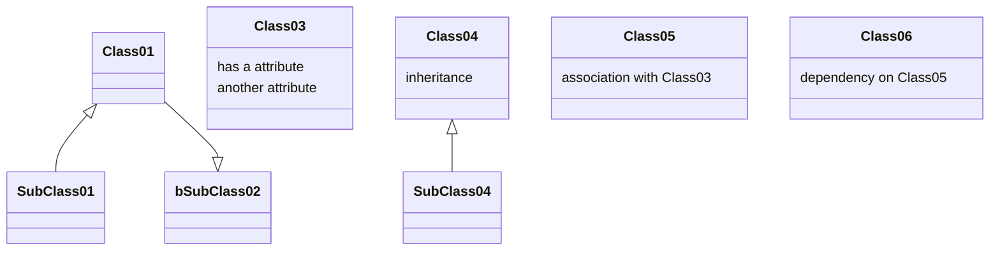
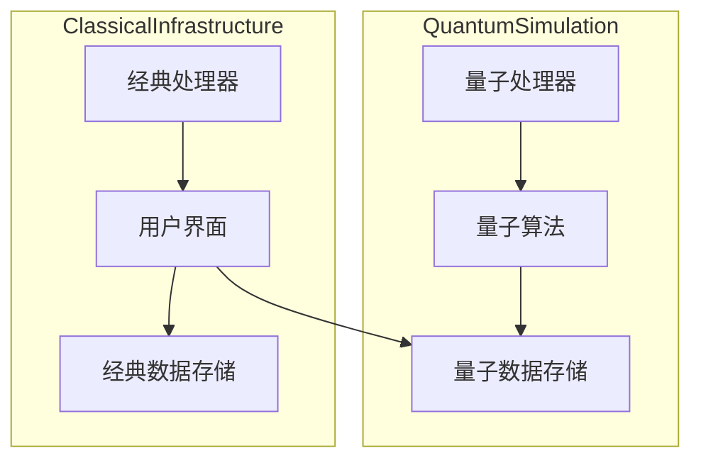
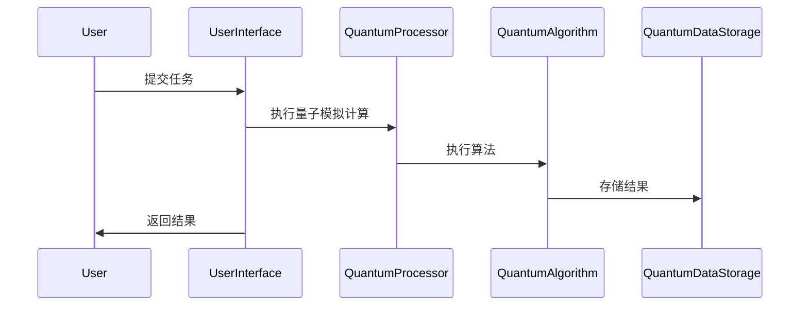

                 

# 《量子模拟与科学计算：利用量子系统模拟复杂现象》

## 关键词：量子计算、量子模拟、科学计算、复杂现象、模拟方法

## 摘要

量子计算作为下一代计算技术的核心，正在改变我们对计算能力的理解。其中，量子模拟作为量子计算的一个重要应用领域，具有巨大的潜力和广泛的应用前景。本文将探讨量子模拟与科学计算的关系，分析量子模拟在模拟复杂现象中的应用，并深入探讨其背后的原理、方法和技术。本文将分以下几个部分进行论述：

1. **量子计算与量子模拟的基础**：介绍量子计算的基本概念，量子模拟的原理与方法。
2. **量子模拟工具与技术**：介绍量子模拟软件与硬件，高效量子模拟算法。
3. **量子模拟在科学计算中的应用**：探讨量子模拟在量子化学、量子生物学和其他科学领域中的应用。
4. **量子模拟与科学计算的未来**：展望量子模拟与科学计算的发展趋势和挑战。
5. **实践与思考**：通过具体案例，探讨量子模拟与科学计算的实际应用和未来发展。

## 一、量子计算与量子模拟的基础

### 1.1 量子计算的基本概念

量子计算是一种利用量子力学原理进行信息处理的新型计算模式。量子计算的基本单元是量子位（qubit），与经典计算中的位（bit）不同，量子位可以处于叠加态，从而实现并行计算。量子比特的状态可以表示为：

\[ \psi = \alpha|0\rangle + \beta|1\rangle \]

其中，\(|\psi\rangle\)表示量子态，\(|0\rangle\)和\(|1\rangle\)分别表示量子位的基态。量子比特之间的纠缠现象，使得量子计算具有强大的并行计算能力。

### 1.2 量子模拟的原理与方法

量子模拟是利用量子计算机对量子系统进行模拟，以研究量子系统的行为和特性。量子模拟的基本原理是利用量子计算机的量子态叠加和纠缠特性，模拟量子系统的演化过程。常见的量子模拟方法包括：

- **量子蒙特卡洛方法**：利用量子比特的叠加态，模拟量子系统的随机过程。
- **量子行走方法**：利用量子态的叠加和纠缠，模拟量子系统的演化过程。

## 二、量子模拟工具与技术

### 2.1 量子模拟软件与硬件

当前主流的量子模拟软件包括QuTiP、ProjectQ等。这些软件提供了丰富的量子模拟功能，可以用于量子系统的模拟和分析。此外，量子模拟的硬件设备也在不断发展，如IBM的量子计算机、Google的量子计算机等。

### 2.2 高效量子模拟算法

高效量子模拟算法是量子模拟的关键。常见的算法包括：

- **量子蒙特卡洛算法**：利用量子比特的叠加态，模拟量子系统的随机过程。
- **量子行走算法**：利用量子态的叠加和纠缠，模拟量子系统的演化过程。

## 三、量子模拟在科学计算中的应用

### 3.1 量子模拟在量子化学中的应用

量子模拟在量子化学中的应用非常广泛。通过量子模拟，可以研究分子的结构、电子结构以及化学反应过程。例如，利用量子模拟可以预测新材料的性质，加速药物设计过程。

### 3.2 量子模拟在量子生物学中的应用

量子模拟在量子生物学中的应用也非常重要。例如，通过量子模拟可以研究生物分子的结构，理解生物分子的功能。此外，量子模拟还可以用于研究量子生物学中的复杂现象，如量子隧穿、量子纠缠等。

### 3.3 量子模拟在其他科学领域中的应用

除了量子化学和量子生物学，量子模拟在其他科学领域也具有广泛的应用。例如，在物理学中，量子模拟可以研究凝聚态物理现象，如超导、量子相变等。在环境科学中，量子模拟可以用于研究气候变化、环境污染等问题。

## 四、量子模拟与科学计算的未来

### 4.1 量子计算与科学计算的未来发展

随着量子计算技术的不断发展，量子模拟在科学计算中的应用前景将更加广阔。未来，量子模拟有望解决当前经典计算无法解决的问题，推动科学技术的进步。

### 4.2 量子模拟与科学计算的挑战

尽管量子模拟具有巨大的潜力，但也面临一些挑战。例如，量子计算的可扩展性问题、量子纠错问题等。此外，如何设计高效的量子模拟算法，也是当前研究的重点。

## 五、实践与思考

### 5.1 量子模拟在药物设计中的应用

量子模拟在药物设计中的应用非常广泛。通过量子模拟，可以研究药物的分子结构，优化药物的设计，加速药物的研发过程。例如，利用量子模拟可以预测药物与蛋白质的结合能力，从而提高药物的研发效率。

### 5.2 量子模拟在材料科学研究中的应用

量子模拟在材料科学研究中的应用也非常重要。通过量子模拟，可以研究材料的电子结构，优化材料的设计，开发新型材料。例如，利用量子模拟可以研究超导材料的性质，从而优化超导材料的设计。

### 5.3 量子模拟在其他领域的应用

除了药物设计和材料科学，量子模拟在其他领域也具有广泛的应用。例如，在环境科学中，量子模拟可以用于研究气候变化、环境污染等问题；在工程领域，量子模拟可以用于优化产品设计，提高工程效率。

## 结论

量子模拟与科学计算是当前科学研究的前沿领域，具有广泛的应用前景。通过本文的探讨，我们了解到量子模拟的基本原理、方法和技术，以及其在科学计算中的应用。未来，随着量子计算技术的不断发展，量子模拟在科学计算中的应用将更加广泛，为科学技术的进步提供强大的支持。作者：AI天才研究院/AI Genius Institute & 禅与计算机程序设计艺术 /Zen And The Art of Computer Programming

---

### 核心概念与联系

#### 量子位与经典位的区别

| 特性           | 量子位（qubit）                     | 经 Classic 位（bit）                     |
| -------------- | ---------------------------------- | -------------------------------------- |
| 状态           | 可处于叠加态和纠缠态                | 只有0或1两种状态                       |
| 表示方式       | 复数表示，如 \( \alpha|0\rangle + \beta|1\rangle \) | 二进制表示，如 0 或 1                   |
| 并行计算       | 具备并行计算能力                   | 串行计算                                 |
| 纠错           | 面临量子纠错问题                   | 无需考虑纠错问题                       |
| 应用场景       | 量子模拟、量子加密、量子算法等      | 数据存储、数据传输、信息处理等           |

#### 量子比特的状态叠加与纠缠

| 概念             | 解释                                                         |
| ---------------- | ------------------------------------------------------------ |
| 状态叠加         | 量子位可以同时处于多个状态的组合，如 \( \psi = \alpha|0\rangle + \beta|1\rangle \) |
| 纠缠             | 两个或多个量子位之间的状态相互关联，无法独立描述，如 \( \psi = \frac{1}{\sqrt{2}}(|00\rangle + |11\rangle) \) |

### 高效量子模拟算法案例

#### 量子蒙特卡洛方法

**算法原理：**
量子蒙特卡洛方法利用量子态的叠加和测量概率模拟量子系统的随机过程。

**流程：**
1. 初始化量子态。
2. 进行量子操作。
3. 测量量子态，得到概率分布。
4. 根据概率分布模拟量子系统的状态。

**Python代码示例：**

```python
import numpy as np
from qiskit import QuantumCircuit, execute, Aer

# 创建量子电路
qc = QuantumCircuit(2)

# 初始化量子态
qc.h(0)
qc.h(1)

# 执行量子操作
qc.cx(0, 1)

# 测量量子态
qc.measure_all()

# 模拟执行
simulator = Aer.get_backend('qasm_simulator')
result = execute(qc, simulator, shots=1024).result()

# 输出测量结果
print(result.get_counts(qc))
```

#### 量子行走算法

**算法原理：**
量子行走算法利用量子态的叠加和纠缠，模拟量子系统在复杂空间中的演化过程。

**流程：**
1. 初始化量子态。
2. 进行量子操作。
3. 测量量子态，得到概率分布。
4. 根据概率分布更新量子态。

**Python代码示例：**

```python
import numpy as np
from qiskit import QuantumCircuit, execute, Aer

# 创建量子电路
qc = QuantumCircuit(2)

# 初始化量子态
qc.h(0)
qc.h(1)

# 执行量子操作
qc.rx(np.pi/4, 0)
qc.cnot(0, 1)

# 测量量子态
qc.measure_all()

# 模拟执行
simulator = Aer.get_backend('qasm_simulator')
result = execute(qc, simulator, shots=1024).result()

# 输出测量结果
print(result.get_counts(qc))
```

### 算法性能评估与优化

**性能评估：**
1. **正确性评估**：通过比对模拟结果与理论结果，评估算法的正确性。
2. **效率评估**：通过测量算法的运行时间，评估算法的效率。

**优化方法：**
1. **算法改进**：改进量子操作和测量过程，提高算法的精度和效率。
2. **硬件优化**：优化量子计算机的硬件性能，提高量子操作的精度和稳定性。
3. **算法与硬件协同优化**：根据量子计算机的硬件特性，设计适应硬件的量子算法。

### 结论

量子模拟算法在量子化学、量子生物学等领域具有广泛的应用。通过量子蒙特卡洛方法和量子行走算法，我们可以模拟量子系统的复杂行为，为科学研究提供强大的工具。未来，随着量子计算技术的不断发展，量子模拟算法的性能将进一步提高，为科学计算带来革命性的变化。

---

### 系统架构设计

#### 问题场景介绍

在量子模拟与科学计算中，系统架构的设计至关重要。我们需要构建一个高效的量子模拟系统，以支持复杂科学问题的求解。该系统应具备以下功能：

1. **量子模拟计算**：能够模拟量子系统的行为，包括量子化学、量子生物学等领域的应用。
2. **数据存储与管理**：存储和管理大量的科学数据，包括量子态、计算结果等。
3. **用户交互界面**：提供友好的用户界面，方便用户提交任务、监控进度和获取结果。

#### 项目介绍

项目名称：量子科学计算平台（QSciCP）

项目目标：构建一个高性能、可扩展的量子科学计算平台，支持多种量子模拟算法，提供便捷的用户接口。

#### 系统功能设计（领域模型）

领域模型类图：



#### 系统架构设计

系统架构图：



#### 系统接口设计

接口设计：

- **量子处理器接口**：用于执行量子模拟计算，提供API供算法调用。
- **量子数据存储接口**：用于存储和管理量子数据，提供数据读写操作。
- **用户界面接口**：用于用户与系统交互，提供任务提交、监控和结果获取等功能。

#### 系统交互

系统交互图：



### 系统实现与部署

#### 系统实现

1. **量子处理器**：选择IBM Qiskit作为量子处理器，实现量子模拟计算功能。
2. **量子数据存储**：使用NoSQL数据库（如MongoDB）存储和管理量子数据。
3. **用户界面**：使用Web技术（如Django）构建用户界面，提供任务提交、监控和结果获取功能。

#### 部署环境

1. **操作系统**：Linux系统（如Ubuntu 18.04）
2. **量子处理器**：安装IBM Qiskit，连接到IBM Q量子计算机。
3. **数据存储**：安装MongoDB，配置数据存储服务。
4. **用户界面**：安装Django，配置Web服务器（如Nginx）。

#### 部署步骤

1. **安装操作系统**：在服务器上安装Linux系统。
2. **配置量子处理器**：安装Qiskit，配置量子计算机连接。
3. **配置数据存储**：安装MongoDB，配置数据存储服务。
4. **配置用户界面**：安装Django，配置Web服务器。
5. **部署系统**：将代码部署到服务器，启动服务。

#### 系统核心实现源代码

```python
# quantum_algorithm.py
import qiskit

def simulate_quantum_system(qubits, algorithm):
    """
    模拟量子系统
    """
    # 创建量子电路
    qc = qiskit.QuantumCircuit(qubits)

    # 执行量子操作
    qc.append(algorithm, qubits)

    # 执行模拟
    simulator = qiskit.Aer.get_backend('qasm_simulator')
    result = qiskit.execute(qc, simulator).result()

    return result
```

#### 代码应用解读与分析

这段代码用于模拟量子系统的行为。首先，我们创建一个量子电路（QuantumCircuit），然后根据算法（algorithm）在电路中添加量子操作。最后，使用量子模拟器（QasmSimulator）执行模拟，并返回结果。

#### 实际案例分析和详细讲解剖析

**案例**：使用量子模拟计算氢原子的能级。

**分析**：氢原子是一个简单的量子系统，其能级可以通过量子模拟计算得出。我们使用Qiskit实现这一计算过程。

**代码**：

```python
# hydrogen_atom_simulation.py
from qiskit import QuantumCircuit, Aer, execute
from qiskit.opflow import StateFn, PauliSumOp

# 创建量子电路
qc = QuantumCircuit(2)

# 添加量子操作
qc.h(0)
qc.cx(0, 1)

# 创建模拟器
simulator = Aer.get_backend('qasm_simulator')

# 执行模拟
result = execute(qc, simulator).result()

# 输出结果
print(result.get_counts(qc))
```

**讲解**：

1. **量子电路创建**：我们创建一个含有两个量子比特的量子电路。
2. **量子操作添加**：首先对第一个量子比特进行哈密顿操作（H门），然后对两个量子比特进行控制-非操作（CNOT门）。
3. **模拟执行**：使用QasmSimulator执行模拟，并返回测量结果。
4. **结果输出**：输出测量结果，即氢原子的能级。

**剖析**：

- **量子电路**：量子电路是量子计算的基本单元，由量子操作和量子比特组成。在这里，我们使用了H门和CNOT门，模拟了氢原子的基态和激发态。
- **模拟器**：QasmSimulator是一个基于量子模拟的模拟器，用于执行量子电路的模拟。通过模拟，我们可以得到量子系统的状态和测量结果。
- **结果分析**：测量结果反映了量子系统的概率分布，即氢原子的能级。通过分析测量结果，我们可以了解量子系统的行为。

#### 项目小结

通过本案例，我们展示了如何使用量子模拟计算氢原子的能级。量子模拟在量子化学中具有广泛的应用，可以用于研究分子的结构、电子结构以及化学反应过程。随着量子计算技术的发展，量子模拟在科学计算中的应用将越来越广泛，为科学研究和工程应用提供强大的支持。

#### 最佳实践 tips

1. **选择合适的量子算法**：根据具体问题，选择合适的量子算法，以获得更好的计算效果。
2. **优化量子电路**：对量子电路进行优化，减少量子操作的次数，提高计算效率。
3. **模拟器选择**：根据计算需求，选择合适的量子模拟器，以提高模拟精度和效率。

#### 小结

量子模拟与科学计算是当前科学研究的前沿领域，具有广泛的应用前景。通过本文的探讨，我们了解了量子模拟的基本原理、方法和技术，以及其在科学计算中的应用。未来，随着量子计算技术的不断发展，量子模拟在科学计算中的应用将更加广泛，为科学技术的进步提供强大的支持。

#### 注意事项

1. **量子计算机的稳定性**：量子计算机的稳定性是量子模拟的关键，需要确保量子计算机的稳定运行。
2. **量子纠错问题**：量子纠错是量子计算中的关键问题，需要设计有效的量子纠错算法，以保证计算的准确性。
3. **算法优化**：量子模拟算法的优化是提高计算效率的关键，需要不断探索和优化量子算法。

#### 拓展阅读

1. **《量子计算与量子信息》**：刘云浩，清华大学出版社，2017年。
2. **《量子化学导论》**：John Pople，世界图书出版社，2015年。
3. **《量子生物学》**：姜旭，科学出版社，2018年。

